# Tutorial: Prepare SQL Server for replication (publisher, distributor, subscriber)
 [!INCLUDE [SQL Server](../../includes/applies-to-version/sqlserver.md)]
It's important to plan for security before you configure your replication topology. This tutorial shows you how to better secure a replication topology. It also shows you how to configure distribution, which is the first step in replicating data. You must complete this tutorial before any of the others.  
  
> [!NOTE]  
> To replicate data securely between servers, you should implement all of the recommendations in [Replication security best practices](../../relational-databases/replication/security/replication-security-best-practices.md).  
  
## What you will learn  
This tutorial teaches you to prepare a server so that replication can run securely with least privileges.  

In this tutorial, you will learn how to:
> [!div class="checklist"]
> * Create Windows accounts for replication.
> * Prepare the snapshot folder.
> * Configure distribution.

## Prerequisites
This tutorial is for users who are familiar with fundamental database operations, but who have limited exposure to replication. 

To complete this tutorial, you need SQL Server, SQL Server Management Studio (SSMS), and an AdventureWorks database:  
  
- At the publisher server (source), install:  
  
   - Any edition of [!INCLUDE[ssNoVersion](../../includes/ssnoversion-md.md)], except SQL Server Express or SQL Server Compact. These editions cannot be replication publishers.   
   - The [!INCLUDE[ssSampleDBUserInputNonLocal](../../includes/sssampledbuserinputnonlocal-md.md)] sample database. To enhance security, the sample databases are not installed by default.  
  
- At the subscriber server (destination), install any edition of [!INCLUDE[ssNoVersion](../../includes/ssnoversion-md.md)], except [!INCLUDE[ssEW](../../includes/ssew-md.md)]. [!INCLUDE[ssEW](../../includes/ssew-md.md)] cannot be a subscriber in transactional replication.  
  
- Install [SQL Server Management Studio](../../ssms/download-sql-server-management-studio-ssms.md).
- Install [SQL Server 2017 Developer edition](https://www.microsoft.com/sql-server/sql-server-downloads).
- Download the [AdventureWorks sample database](https://github.com/Microsoft/sql-server-samples/releases). For instructions on restoring a database in SSMS, see [Restoring a database](../backup-restore/restore-a-database-backup-using-ssms.md). 
    
>[!NOTE]
> - Replication is not supported on SQL Server instances that are more than two versions apart. For more information, see [Supported SQL Server Versions in Replication Topology](replication-backward-compatibility.md).
> - In [!INCLUDE[ssManStudioFull](../../includes/ssmanstudiofull-md.md)], you must connect to the publisher and subscriber by using a login that is a member of the **sysadmin** fixed server role. For more information on this role, see [Server-level roles](../security/authentication-access/server-level-roles.md).  

**Estimated time to complete this tutorial: 30 minutes**
  
## Create Windows accounts for replication
In this section, you create Windows accounts to run replication agents. You create a separate Windows account on the local server for the following agents:  
  
|Agent|Location|Account name|  
|---------|------------|----------------|  
|Snapshot Agent|Publisher|<*machine_name*>\repl_snapshot|  
|Log Reader Agent|Publisher|<*machine_name*>\repl_logreader|  
|Distribution Agent|Publisher and subscriber|<*machine_name*>\repl_distribution|  
|Merge Agent|Publisher and subscriber|<*machine_name*>\repl_merge|  
  
> [!NOTE]  
> In the replication tutorials, the publisher and distributor share the same instance (NODE1\SQL2016) of [!INCLUDE[ssNoVersion](../../includes/ssnoversion-md.md)]. The subscriber instance (NODE2\SQL2016) is remote. The publisher and subscriber might share the same instance of [!INCLUDE[ssNoVersion](../../includes/ssnoversion-md.md)], but it is not a requirement. If the publisher and subscriber share the same instance, the steps that are used to create accounts at the subscriber are not required.  

### Create local Windows accounts for replication agents at the publisher
  
1. At the publisher, open **Computer Management** from **Administrative Tools** in Control Panel.  
  
2. In **System Tools**, expand **Local Users and Groups**.  
  
3. Right-click **Users** and then select **New User**.  
     
4. Enter **repl_snapshot** in the **User name** box, provide the password and other relevant information, and then select **Create** to create the repl_snapshot account: 

   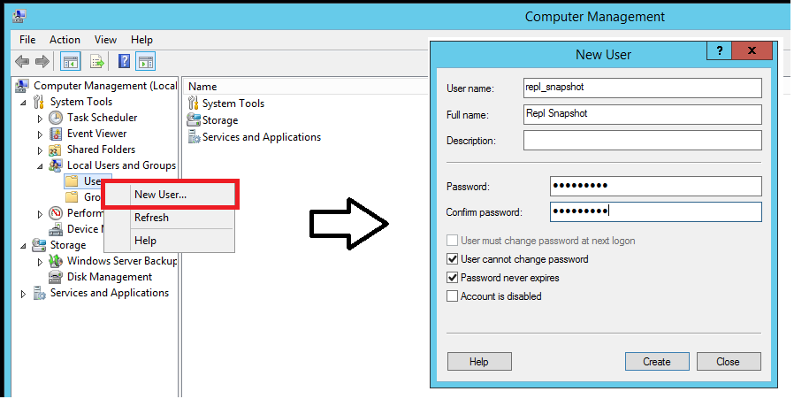
  
5. Repeat the previous step to create the repl_logreader, repl_distribution, and repl_merge accounts:  
 
   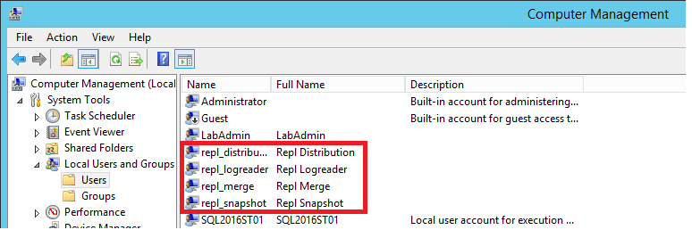
  
6. Select **Close**.  
  
### Create local Windows accounts for replication agents at the subscriber  
  
1. At the subscriber, open **Computer Management** from **Administrative Tools** in Control Panel.  
  
2. In **System Tools**, expand **Local Users and Groups**.  
  
3. Right-click **Users** and then select **New User**.  
  
4. Enter **repl_distribution** in the **User name** box, provide the password and other relevant information, and then select **Create** to create the repl_distribution account.  
  
5. Repeat the previous step to create the repl_merge account.  
  
6. Select **Close**.  

For more information, see
[Replication agents overview](../../relational-databases/replication/agents/replication-agents-overview.md).  

## Prepare the snapshot folder
In this section, you configure the snapshot folder that's used to create and store the publication snapshot. 

### Create a share for the snapshot folder and assign permissions  
  
1. In File Explorer, browse to the [!INCLUDE[ssNoVersion](../../includes/ssnoversion-md.md)] data folder. The default location is C:\Program Files\Microsoft SQL Server\MSSQL.X\MSSQL\Data.  
  
2. Create a new folder named **repldata**.  
  
3. Right-click this folder and select **Properties**.  
  
   a. On the **Sharing** tab in the **repldata Properties** dialog box, select **Advanced Sharing**.  
  
   b. In the **Advanced Sharing** dialog box, select **Share this Folder**, and then select **Permissions**.  

   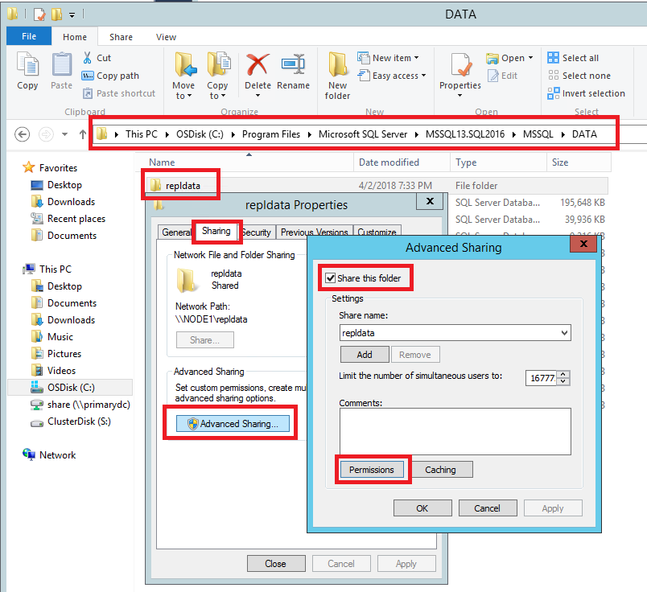

6. In the **Permissions for repldata** dialog box, select **Add**. In the **Select User, Computers, Service Account, or Groups** box, type the name of the Snapshot Agent account that you created previously, as <*Publisher_Machine_Name*>**\repl_snapshot**. Select **Check Names**, and then select **OK**.  

   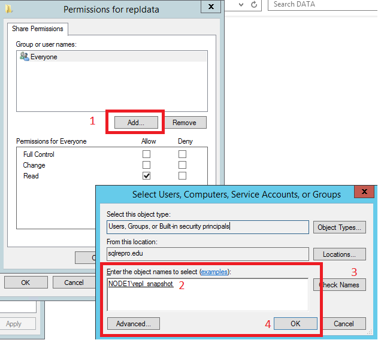

7. Repeat step 6 to add the other two accounts that you created previously: <*Publisher_Machine_Name*>**\repl_merge** and <*Publisher_Machine_Name*>**\repl_distribution**.

8. After you add the three accounts, assign the following permissions:      
   - repl_distribution: **Read**  
   - repl_merge: **Read**  
   - repl_snapshot: **Full Control**    

   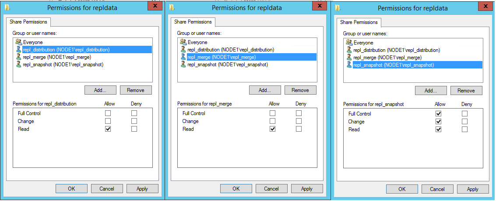

9. After your share permissions are configured correctly, select **OK** to close the **Permissions for repldata** dialog box. Select **OK** to close the **Advanced Sharing** dialog box. 

10. In the **repldata Properties** dialog box, select the **Security** tab and select **Edit**:  

    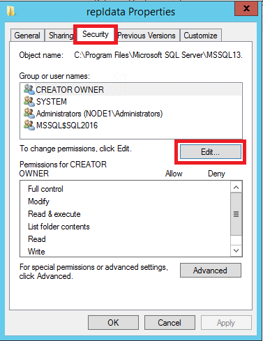   

11. In the **Permissions for repldata** dialog box, select **Add**. In the **Select Users, Computers, Service Accounts, or Groups** box, type the name of the Snapshot Agent account that you created previously, as <*Publisher_Machine_Name*>**\repl_snapshot**. Select **Check Names**, and then select **OK**.  

    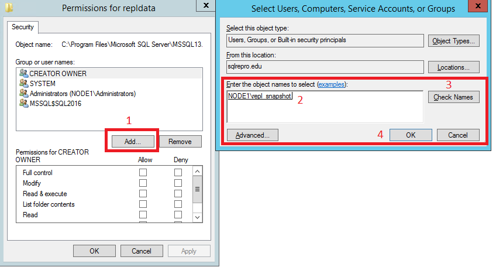

  
12. Repeat the previous step to add permissions for the Distribution Agent as <*Publisher_Machine_Name*>**\repl_distribution**, and for the Merge Agent as <*Publisher_Machine_Name*>**\repl_merge**.  
    
  
13. Verify that the following permissions are allowed:  
  
    - repl_distribution: **Read**
    - repl_merge: **Read**
    - repl_snapshot: **Full Control**   
 
    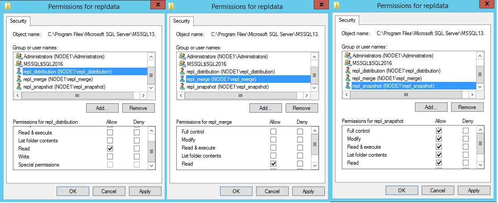 

14. Select the **Sharing** tab again and note the **Network Path** for the share. You'll need this path later when you're configuring your snapshot folder.  

    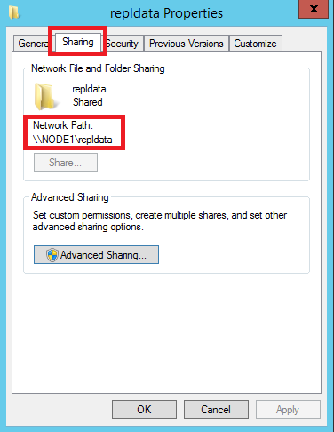

15. Select **OK** to close the **repldata Properties** dialog box. 
 
For more information, see [Secure the snapshot folder](../../relational-databases/replication/security/secure-the-snapshot-folder.md).  
  

## Configure distribution
In this section, you configure distribution at the publisher and set the required permissions on the publication and distribution databases. If you have already configured the distributor, you must disable publishing and distribution before you begin this section. Do not do this if you must keep an existing replication topology, especially in production.   
  
Configuring a publisher with a remote distributor is outside the scope of this tutorial.  

### Configure distribution at the publisher  
  
1. Connect to the publisher in [!INCLUDE[ssManStudioFull](../../includes/ssmanstudiofull-md.md)], and then expand the server node.  
  
2. Right-click the **Replication** folder and select **Configure Distribution**:  

   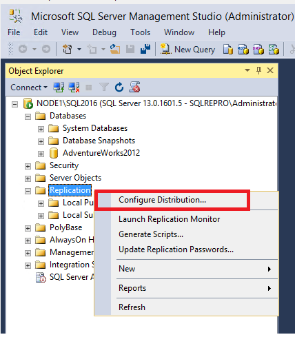
  
   > [!NOTE]  
   > - If you connected to [!INCLUDE[ssNoVersion](../../includes/ssnoversion-md.md)] by using **localhost** rather than the actual server name, you'll be prompted with a warning that [!INCLUDE[ssNoVersion](../../includes/ssnoversion-md.md)] cannot connect to **localhost or IP Address**. Select **OK** in the warning dialog box. In the **Connect to Server** dialog box, change **Server name** from **localhost or IP Address** to the name of your server. Then select **Connect**.  
   > - There is currently a known issue with SQL Server Management Studio (SSMS) 18.0 (and later) where a warning message is _not_ displayed when connecting to the Distributor with the IP address, but this is still invalid. The actual server name should be used when connecting to the Distributor. 
   
   The Distribution Configuration Wizard starts.  
  
3. On the **Distributor** page, select <*'ServerName'*> **will act as its own Distributor; SQL Server will create a distribution database and log**. Then select **Next**.  

   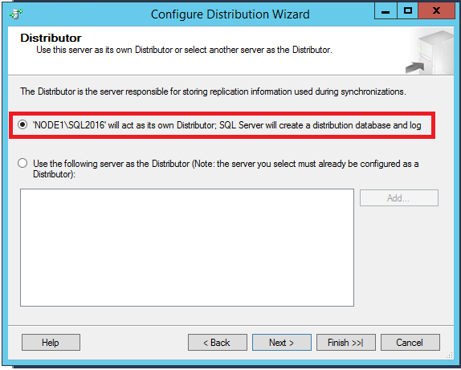
  
4. If the [!INCLUDE[ssNoVersion](../../includes/ssnoversion-md.md)] Agent is not running, on the [!INCLUDE[ssNoVersion](../../includes/ssnoversion-md.md)] **Agent Start** page, select **Yes, configure the [!INCLUDE[ssNoVersion](../../includes/ssnoversion-md.md)] Agent service to start automatically**. Select **Next**.  

     
5. Enter the path \\\\<*Publisher_Machine_Name*>**\repldata** in the **Snapshot folder** box, and then select **Next**. This path should match what you saw previously under **Network Path** for your repldata properties folder after configuring your share properties. 

   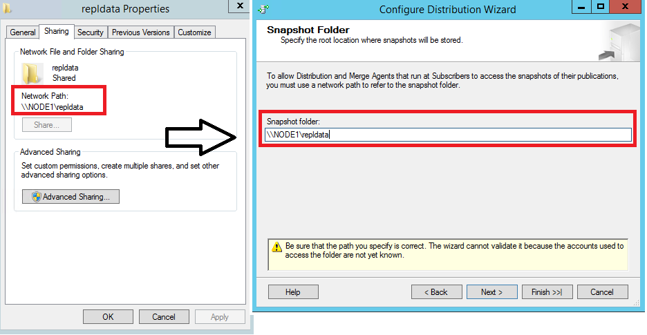
  
6. Accept the default values on the remaining pages of the wizard.  
    
   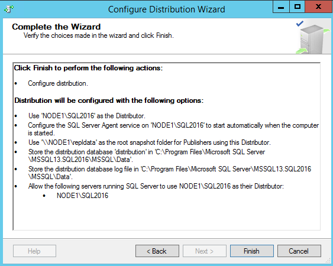
  
7. Select **Finish** to enable distribution. 

You might see the following error when configuring the distributor. It's an indication that the account that was used to start the SQL Server Agent account is not an administrator on the system. You'll either need to start the SQL Server Agent manually, grant those permissions to the existing account, or modify which account the SQL Server Agent is using. 

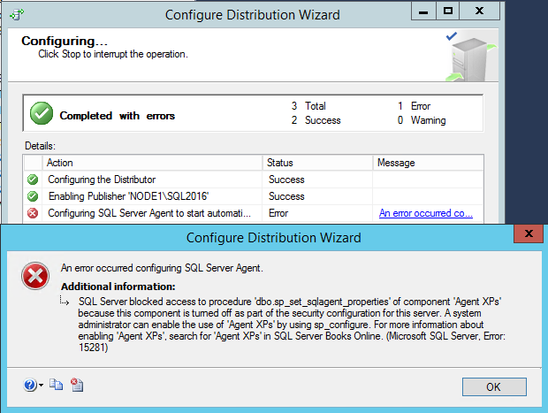

If your SQL Server Management Studio instance is running with administrative rights, you can start the SQL Agent manually from within SSMS:  
    
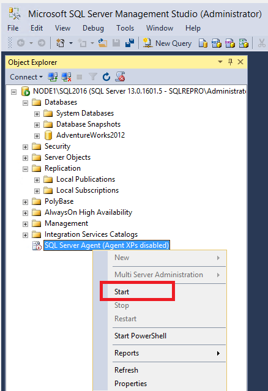 

>[!NOTE]
> If the SQL Agent doesn't visibly start, right-click the SQL Server Agent in SSMS and select **Refresh**. If it's still in the stopped state, start it manually from SQL Server Configuration Manager.    
  
## Set database permissions  
  
1. In [!INCLUDE[ssManStudioFull](../../includes/ssmanstudiofull-md.md)], expand **Security**, right-click **Logins**, and then select **New Login**:  

   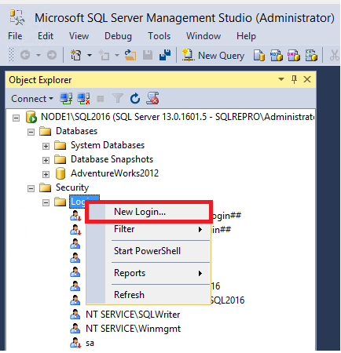
  
2. On the **General** page, select **Search**. Enter <*Publisher_Machine_Name*>**\repl_snapshot** in the **Enter the object name to select** box, select **Check Names**, and then select **OK**.  

   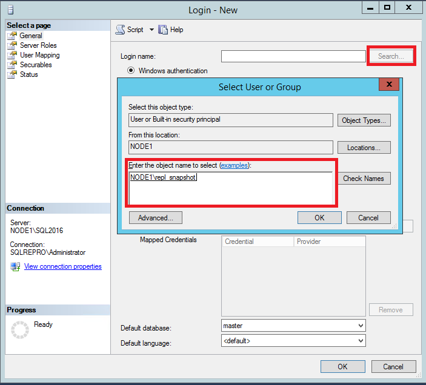
  
3. On the **User Mapping** page, in the **Users mapped to this login** list, select both the **distribution** and [!INCLUDE[ssSampleDBobject](../../includes/sssampledbobject-md.md)] databases.  
  
   In the database role membership list, select the **db_owner** role for the login for both databases.  

   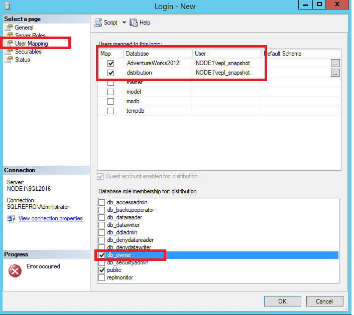
  
4. Select **OK** to create the login.  
  
5. Repeat steps 1-4 to create a login for the other local accounts (repl_distribution, repl_logreader, and repl_merge). These logins must also be mapped to users who are members of the **db_owner** fixed database role in the **distribution** and **AdventureWorks** databases.  

   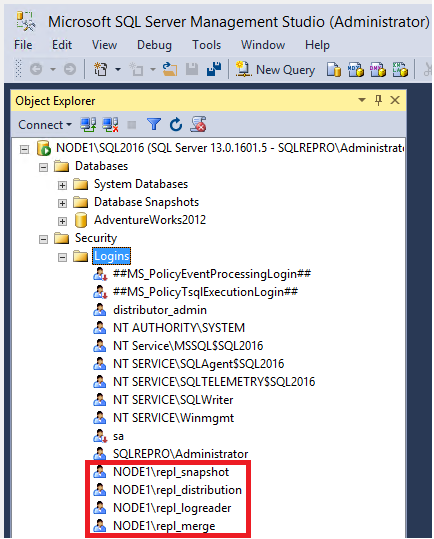
   
  
For more information, see:
- [Configure distribution](../../relational-databases/replication/configure-distribution.md) 
- [Replication agent security model](../../relational-databases/replication/security/replication-agent-security-model.md)  

## Next steps
You have now successfully prepared your server for replication. The next article teaches you how to configure transactional replication: 

> [!div class="nextstepaction"]
> [Tutorial: Configure replication between two fully connected servers (transactional)](tutorial-replicating-data-between-continuously-connected-servers.md)

  
