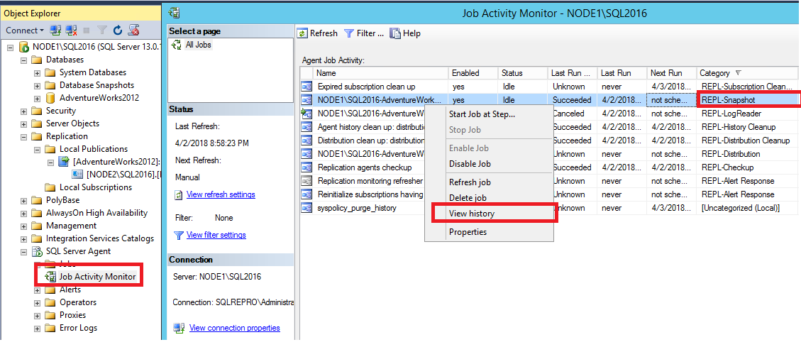
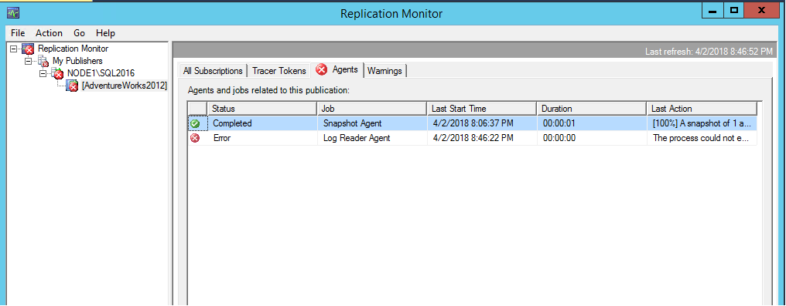
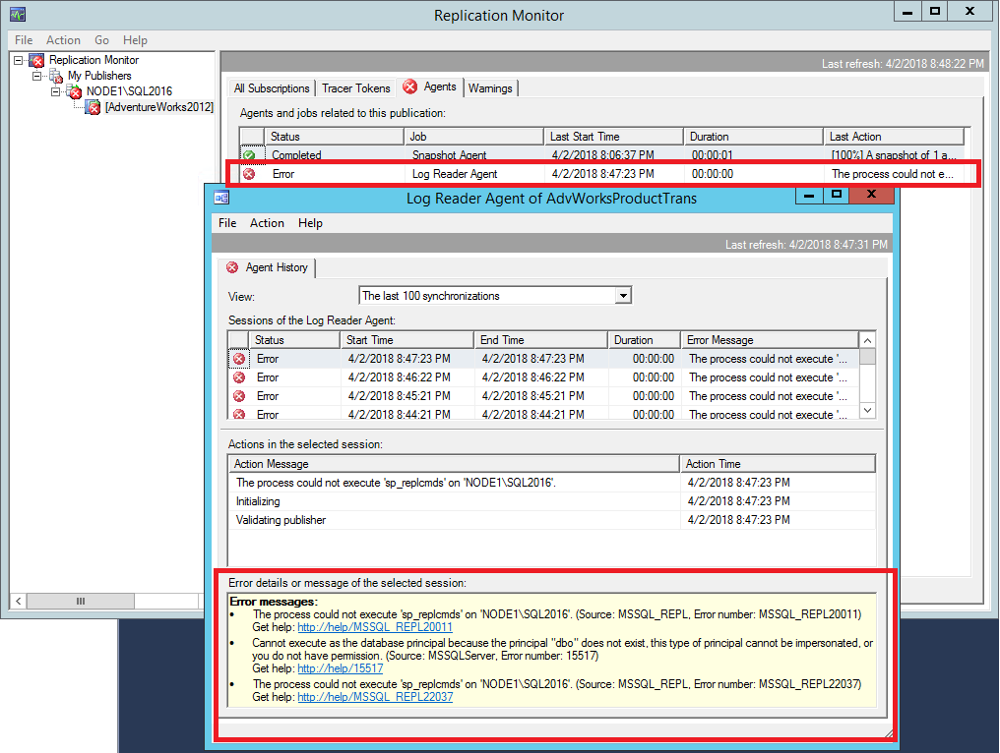
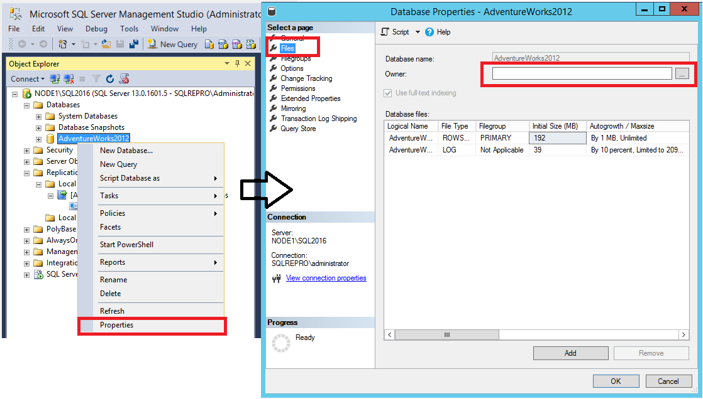
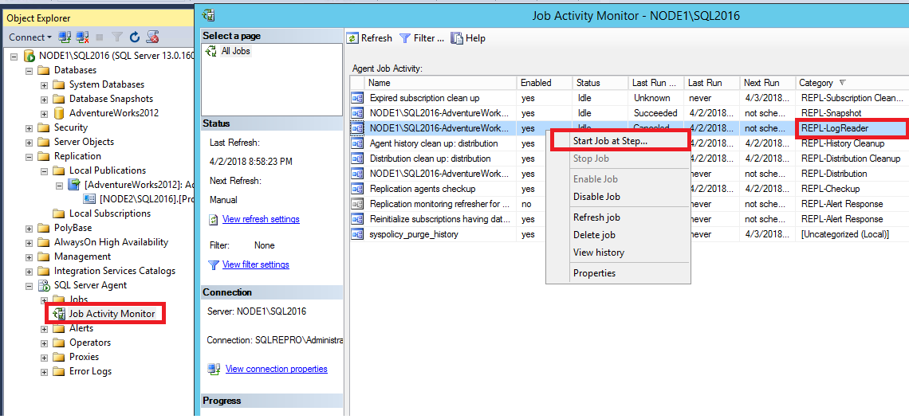
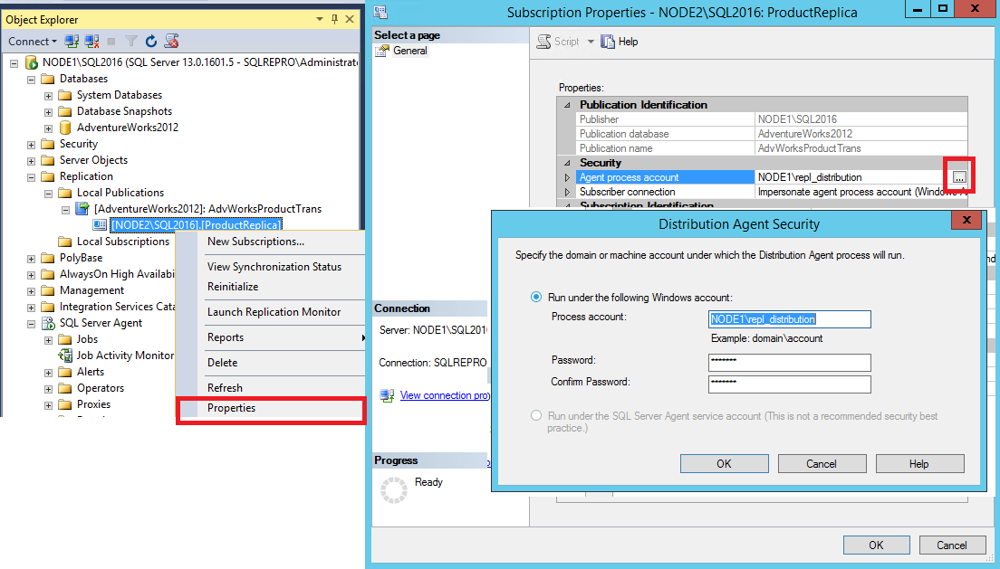
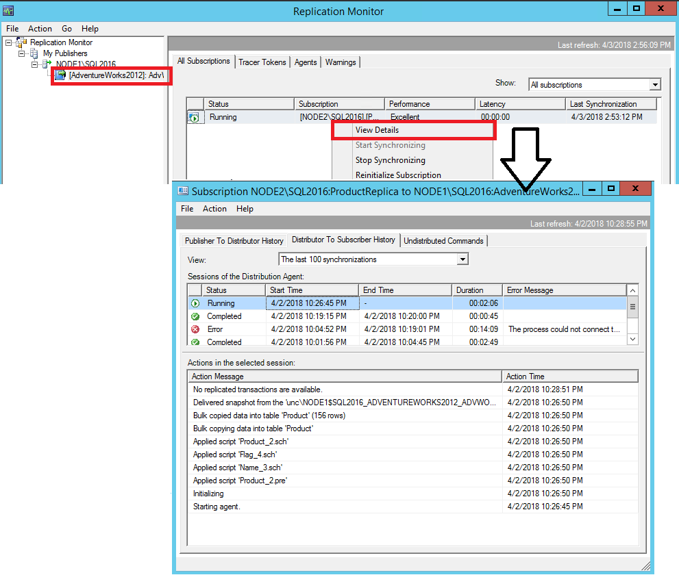

# Tutorial: Configure Replication between Two Fully Connected Servers (Transactional)
[!INCLUDE[appliesto-ss-xxxx-xxxx-xxx-md](../../includes/appliesto-ss-xxxx-xxxx-xxx-md.md)]
Transactional Replication is a good solution to the problem of moving data between continuously connected servers. Using  the Replication Wizard, you can easily configure and administer a replication topology. This tutorial shows you how to configure a Transactional Replication topology for continuously connected servers. For more information about how Transactional Replication works, please see [Transactional Replication Overview](https://docs.microsoft.com/en-us/sql/relational-databases/replication/transactional/transactional-replication). 
  
## What You Will Learn  
This tutorial will show you how to publish data from one database to another using transactional replication. 

In this tutorial, you will learn how to:
> [!div class="checklist"]
> * Create a publisher via Transactional Replication
> * Create a subscriber for the Transactional publisher
> * Validate the Subscription and measure latency
> * Error Troubleshooting Methodology
  
  
## Prerequisites  
This tutorial is intended for users who are familiar with basic database operations, but who have limited experience with replication. This tutorial requires that you have completed the previous tutorial, [Preparing the Server for Replication](../../relational-databases/replication/tutorial-preparing-the-server-for-replication.md).  
  
To use this Tutorial, your system must have SQL Server Management Studio (SSMS)  and these components:  
  
-   At the Publisher server (source):  
  
    -   Any edition of [!INCLUDE[ssNoVersion](../../includes/ssnoversion-md.md)], except SQL Server Express or SQL Compact. These editions cannot be replication Publishers.   
    -   [!INCLUDE[ssSampleDBUserInputNonLocal](../../includes/sssampledbuserinputnonlocal-md.md)] sample database. To enhance security, the sample databases are not installed by default.  
  
-   Subscriber server (destination):  
  
    -   Any edition of [!INCLUDE[ssNoVersion](../../includes/ssnoversion-md.md)], except [!INCLUDE[ssEW](../../includes/ssew-md.md)]. [!INCLUDE[ssEW](../../includes/ssew-md.md)] cannot be a Subscriber in transactional replication.  
  
- Install [SQL Server Management Studio](https://docs.microsoft.com/en-us/sql/ssms/download-sql-server-management-studio-ssms).
- Install [SQL Server 2017 Developer Edition](https://www.microsoft.com/en-us/sql-server/sql-server-downloads).
- Download an [AdventureWorks Sample Databases](https://github.com/Microsoft/sql-server-samples/releases). For instructions on restoring a database in SSMS, please see [Restoring a Database](https://docs.microsoft.com/en-us/sql/relational-databases/backup-restore/restore-a-database-backup-using-ssms). 
 
>[!NOTE]
> - Replication is not supported on SQL Servers that are more than two versions apart. For more information, please see [Supported SQL Versions in Repl Topology](https://blogs.msdn.microsoft.com/repltalk/2016/08/12/suppported-sql-server-versions-in-replication-topology/).
> - In [!INCLUDE[ssManStudioFull](../../includes/ssmanstudiofull-md.md)], you must connect to the Publisher and Subscriber using a login that is a member of the **sysadmin** fixed server role. For more information on the sysadmin role, please see [Server Level Roles](https://docs.microsoft.com/en-us/sql/relational-databases/security/authentication-access/server-level-roles).  
  
  
**Estimated time to complete this tutorial: 60 minutes.**  
  
## Configure the Publisher for Transactional Replication
In this section, you will create a transactional publication using [!INCLUDE[ssManStudioFull](../../includes/ssmanstudiofull-md.md)] to publish a filtered subset of the **Product** table in the [!INCLUDE[ssSampleDBobject](../../includes/sssampledbobject-md.md)] sample database. You will also add the SQL Server login used by the Distribution Agent to the publication access list (PAL). Before starting this tutorial, you should have completed the previous tutorial, [Preparing the Server for Replication](../../relational-databases/replication/tutorial-preparing-the-server-for-replication.md).


### Create a publication and define articles
1.  Connect to the Publisher in [!INCLUDE[ssManStudioFull](../../includes/ssmanstudiofull-md.md)], and then expand the server node.  
  
2. Right-click the **SQL Server Agent** and select **Start**. The SQL Server Agent should be running before you create the publication. If this does not start your agent, you'll need to do so manually from the **SQL Server Configuration Manager**. 
3. Expand the **Replication** folder, right-click the **Local Publications** folder, and select **New Publication**.  This will launch the Publication Configuration Wizard: 

    
  
  
3. On the Publication Database page, select [!INCLUDE[ssSampleDBobject](../../includes/sssampledbobject-md.md)], and then select **Next**.  
  
4. On the Publication Type page, select **Transactional publication**, and then select **Next**:  

    
  
5. On the Articles page, expand the **Tables** node, select the **Product** check box. Then expand **Product** and clear the checkboxes next to  **ListPrice** and **StandardCost**. Select **Next**:  

    
  
6. On the Filter Table Rows page, select **Add**.  
  
7. In the **Add Filter** dialog box, select the **SafetyStockLevel** column, select the right arrow to add the column to the Filter statement WHERE clause of the filter query. Then manually type in the WHERE clause modifier as follows:  
  
    ```sql  
    WHERE [SafetyStockLevel] < 500  
    ```
  

   
  
8. Select **OK**, and then select **Next**.  
  
9. Select the **Create a snapshot immediately and keep the snapshot available to initialize subscriptions** check box, and select **Next**:  

    
  
10. On the Agent Security page, clear **Use the security settings from the Snapshot Agent** check box.   
  
    a. Select **Security Settings** for the Snapshot Agent, enter <*Publisher_Machine_Name>***\repl_snapshot** in the **Process account** box, supply the password for this account, and then select **OK**:  

    
  
12. Repeat the previous step to set <*Publisher_Machine_Name*>**\repl_logreader** as the process account for the Log Reader Agent, and then select **OK**:  

       

  
13. On the Complete the Wizard page, type **AdvWorksProductTrans** in the **Publication name** box, and select **Finish**:  

    
  
14. After the publication is created, select **Close** to complete the wizard. 

    You may encounter the following error if your SQL Server Agent is not running when  you attempt to create the publication. This is an indication that your publication was created successfully, but your Snapshot Agent was unable to start. If this happens, you'll need to start the SQL Server Agent, and then manually start the Snapshot Agent. Instructions for this are covered in the next section: 

    
    
  
### To view the status of snapshot generation  
  
1.  Connect to the Publisher in [!INCLUDE[ssManStudioFull](../../includes/ssmanstudiofull-md.md)], expand the server node, and then expand the **Replication** folder.  
  
2.  In the **Local Publications** folder, right-click **AdvWorksProductTrans**, and then select **View Snapshot Agent Status**:  

    
  
3.  The current status of the Snapshot Agent job for the publication is displayed. Verify that the snapshot job has succeeded before you continue to the next section.
          
    If your SQL Server Agent was not running when you first created the publication, you'll see that the Snapshot Agent was 'never run' when you check the **Snapshot Agent Status** for your publication. If that's the case, select **Start** to start your Snapshot Agent: 

       
     
       If you see an error here, please see [Troubleshoot Errors with Snapshot Agent](#troubleshoot-erros-with-snapshot-agent). 

  
### To add the Distribution Agent login to the PAL  
  
1.  Connect to the Publisher in [!INCLUDE[ssManStudioFull](../../includes/ssmanstudiofull-md.md)], expand the server node, and then expand the **Replication** folder.  
  
2.  In the **Local Publications** folder, right-click **AdvWorksProductTrans**, and then select **Properties**.  The **Publication Properties** dialog box is displayed.    
  
    a. Select the **Publication Access List** page, and select **Add**.  
    b. In the **Add Publication Access** dialog box, select <*Publisher_Machine_Name>***\repl_distribution** and select **OK**. Select **OK**:

   
   

**See Also**:  
[Replication Programming Concepts](../../relational-databases/replication/concepts/replication-programming-concepts.md)  
  

## Create a subscription to the Transactional publication
In this section, you will add a subscriber to the Publication that was previously created. This tutorial uses a remote subscriber (NODE2\SQL2016) but a subscription can also be added locally to the publisher. 

### To create the subscription  
  
1.  Connect to the Publisher in [!INCLUDE[ssManStudioFull](../../includes/ssmanstudiofull-md.md)], expand the server node, and then expand the **Replication** folder.  
  
2.  In the **Local Publications** folder, right-click the **AdvWorksProductTrans** publication, and then select **New Subscriptions**.  The New Subscription Wizard launches: 
 
         
  
3.  On the Publication page, select **AdvWorksProductTrans**, and then select **Next**:  

    
  
4.  On the Distribution Agent Location page, select **Run all agents at the Distributor**, and then select **Next**.  For more information on pull and push subscriptions, please see [Subscribe to Publications](https://docs.microsoft.com/en-us/sql/relational-databases/replication/subscribe-to-publications):

    
  
5.  On the Subscribers page, if the name of the Subscriber instance is not displayed, select **Add Subscriber** and then select **Add SQL Server Subscriber** from the drop-down. This will launch the **Connect to Server** dialog box. Enter the Subscriber instance name and then select **Connect**.  
    
    a. Once the Subscriber has been added, check the box next to the instance name of your Subscriber. Then select **New Database** under **Subscription Database**:   

  

7. This will launch the **New Database** dialog box. Enter **ProductReplica** in the **Database name** box, select **OK**, and then select **Next**: 
  
    
  
8.  In the **Distribution Agent Security** dialog box, select the ellipsis (**…**) button. Enter <*Publisher_Machine_Name>***\repl_distribution** in the **Process account** box, enter the password for this account, select **OK**, and then select **Next**:

    
  
9. Select **Finish** to accept the default values on the remaining pages and complete the wizard.  
  
### Setting database permissions at the Subscriber  
  
1.  Connect to the Subscriber in [!INCLUDE[ssManStudioFull](../../includes/ssmanstudiofull-md.md)], expand **Security**, right-click **Logins**, and then select **New Login**.     
  
    a. On the **General** page, under **Login Name** select **Search** and add the login for <*Subscriber_Machine_Name>***\repl_distribution**.
    b. On the **User Mappings** page, grant the login **db_owner** for the **ProductReplica** database: 

    

2. Select **OK** to close the **New Login** dialog box. 

  
### To view the synchronization status of the subscription  
  
1.  Connect to the Publisher in [!INCLUDE[ssManStudioFull](../../includes/ssmanstudiofull-md.md)], expand the server node, and then expand the **Replication** folder.  
  
2.  In the **Local Publications** folder, expand the **AdvWorksProductTrans** publication, right-click the subscription in the **ProductReplica** database, and then select **View Synchronization Status**. The current synchronization status of the subscription is displayed:  
    
3.  If the subscription is not visible under **AdvWorksProductTrans**, press F5 to refresh the list.  
  
**See Also**:  
[Initialize a Subscription with a Snapshot](../../relational-databases/replication/initialize-a-subscription-with-a-snapshot.md)  
[Create a Push Subscription](../../relational-databases/replication/create-a-push-subscription.md)  
[Subscribe to Publications](../../relational-databases/replication/subscribe-to-publications.md)  

## Measuring Replication Latency
In this section, you will use tracer tokens to verify that changes are being replicated to the Subscriber and to determine latency. Latency is the time it takes for a change made at the Publisher to appear to the Subscriber.
  
1. Connect to the Publisher in [!INCLUDE[ssManStudioFull](../../includes/ssmanstudiofull-md.md)], expand the server node, right-click the **Replication** folder, and then select **Launch Replication Monitor**:

    

2. Expand a Publisher group in the left pane, expand the Publisher instance, and then select the **AdvWorksProductTrans** publication.  
  
    a. Select the **Tracer Tokens** tab.  
    b. Select **Insert Tracer**.    
    c. View elapsed time for the tracer token in the following columns: **Publisher to Distributor**, **Distributor to Subscriber**, **Total Latency**. A value of **Pending** indicates that the token has not reached a given point:


   


**See Also**   
[Measure Latency and Validate Connections for Transactional Replication](../../relational-databases/replication/monitor/measure-latency-and-validate-connections-for-transactional-replication.md)

## Error Troubleshooting Methodology
This section teaches you how to troubleshoot basic replication synchronization failures. Please note that this section is meant to introduce you to navigating the replication components with the aim of troubleshooting. However, the actual errors that you encounter may be different than what is discussed here, and as such may need a different resolution. If that is the case, further troubleshooting is necessary and is outside the scope of this tutorial. 


### Troubleshoot Errors with Snapshot Agent
The **Snapshot Agent** is the agent that generates the snapshot, and writes it to the specified snapshot folder. 

1. To view the status of your snapshot agent, expand the **Local Publication** node under replication, right select your publication **AdvWorksProductTrans** > **View Snapshot Agent Status**. 
2. If an error is reported in the **Snapshot Agent Status**, more details can be found in the **Snapshot Agent** job history. To access this, expand **SQL Server Agent** in **Object Explorer** and open the **Job Activity Monitor**. 

    a. Sort by **Category** and identify the **Snapshot Agent** by the category 'REPL-Snapshot'. 

    b. Right-click the **Snapshot Agent** and **View History**: 

   
    
1. In the **Snapshot Agent History**, select the relevant log entry. This will usually be the one that is *before* the error message (errors are indicated by the red X).  Review the message text in the text box below the logs: 

    

        The replication agent had encountered an exception.
        Exception Message: Access to path '\\node1\repldata.....' is denied.


  If your windows permissions are not configured correctly for your snapshot folder, you'll see an 'access is denied' error for the **Snapshot Agent**. You'll need to verify permissions for the <*Publisher_Machine_Name>***\repl_snapshot** account on your repldata folder. For more information, please see [Create a share for the snapshot folder and assign permissions](tutorial-preparing-the-server-for-replication.md#create-a-share-for-the-snapshot-folder-and-assign-permissions).

### Troubleshoot Errors with Log Reader Agent
The **Log Reader Agent** connects to  your publisher database and scans the transaction log for any transactions that are marked 'for replication'. It then adds those transactions to the **Distribution** database. 

1.  Connect to the Publisher in [!INCLUDE[ssManStudioFull](../../includes/ssmanstudiofull-md.md)], expand the server node, right-click the **Replication** folder, and then select **Launch Replication Monitor**:  

    
  
    Replication Monitor launches: 
     
   
2. The Red X is an indication that the publication is not synchronizing. Expand **My Publishers** on the left-hand side, and then expand the relevant publisher server.  
  
3.  Select the **AdvWorksProductTrans** publication on the left and then look for the Red X on one of the tabs to identify where the issue is. In this case, the Red X is on the **Agents Tab**, indicating that one of the Agents is running into an error: 

    

4. Select the **Agents Tab** to identify which agent is encountering the error: 

    


5. This view will show you two Agents, the **Snapshot Agent** and the **Log Reader Agent**. The one encountering an error will have the Red X. In this case, the **Log Reader Agent** is the one with the Red X, which indicates there's an issue with it. Double-click the line that's reporting the error, in this case the **Log Reader Agent**. This will launch the **Agent History** for the Agent you've selected, in this case the **Log Reader Agent** history. This provides more information about the error: 
    
    

       Status: 0, code: 20011, text: 'The process could not execute 'sp_replcmds' on 'NODE1\SQL2016'.'.
       The process could not execute 'sp_replcmds' on 'NODE1\SQL2016'.
       Status: 0, code: 15517, text: 'Cannot execute as the database principal because the principal "dbo" does not exist, this type of principal cannot be impersonated, or you do not have permission.'.
       Status: 0, code: 22037, text: 'The process could not execute 'sp_replcmds' on 'NODE1\SQL2016'.'.        

6. The aforementioned error is typically caused because the owner of the publisher database is not set correctly. This typically happens when a database has been restored. To verify this, expand **Databases** in **Object Explorer** > right-click **AdventureWorks2012** > **Properties**. Verify that an owner exists under the **Files** page. If this field is blank, then this is the likely cause of your issue: 

    

7. If the owner is blank on the **Files** page, open a **New Query Window** within the context of the **AdventureWorks2012** database. Run the following T-SQL code snippet:

    ```sql
    -- set the owner of the database to 'sa' or a specific user account, without the brackets. 
    EXEC sp_changedbowner '<useraccount>'
    -- example for sa: exec sp_changedbowner 'sa'
    -- example for user account: exec sp_changedbowner 'sqlrepro\administrator'
    ```

8. You'll need to restart the **Log Reader Agent**. To do this, expand the **SQL Server Agent** node in **Object Explorer** and open the **Job Activity Monitor**. Sort by **Category** and identify the **Log Reader Agent** by the **'REPL-LogReader'** category. Right-click the **Log Reader Agent** job and **Start Job at Step**: 

    

9. Validate that your publication is now synchronizing by opening the **Replication Monitor** again. If it's not already open, it can be found by right-clicking **Replication** in **Object Explorer**. 
10. Select the **AdvWorksProductTrans** publication, select the **Agents** tab, and double-select the **Log Reader Agent** to open the agent history. You should now see that the **Log Reader Agent** is running and either replicating commands, or that it has "No Replicated Transactions":

    

### Troubleshoot errors with Distribution Agent
The **Distribution Agent** takes data it finds in the **Distribution** database and then applies it to the Subscriber. 

1. Connect to the Publisher in [!INCLUDE[ssManStudioFull](../../includes/ssmanstudiofull-md.md)], expand the server node, right-click the **Replication** folder, and then select **Launch Replication Monitor**.  
2. In **Replication Monitor**, select the **AdvWorksProductTrans** publication, and select the **All Subscriptions** tab. Right-click the Subscription and **View Details**:

    

2. The **Distributor to Subscriber** history dialog box opens, and clarifies what error the agent is encountering: 

     
    
        Error messages:
        Agent 'NODE1\SQL2016-AdventureWorks2012-AdvWorksProductTrans-NODE2\SQL2016-7' is retrying after an error. 89 retries attempted. See agent job history in the Jobs folder for more details.

3. The error indicates that the **Distribution Agent** is retrying. To find out more information, expand **SQL Server Agent** in **Object Explorer** > **Job Activity Monitor**. Sort the jobs by **Category**. 

    a. Identify the **Distribution Agent** by the category **'REPL-Distribution'**. Right-click the agent and **View History**:

    

5. Select one of the error entries and view the error text at the bottom of the window:  

    
    
        Message:
        Unable to start execution of step 2 (reason: Error authenticating proxy NODE1\repl_distribution, system error: The user name or password is incorrect.)

6. This error is an indication that the password used by the **Distribution Agent** is incorrect. To resolve this, expand the **Replication** node in **Object Explorer**, right-click the subscription > **Properties**. Select the ellipses (...) next to **Agent Process Account** and modify the password:

    

7. Check your **Replication Monitor** again, which can be found by right-clicking **Replication** in **Object Explorer**. A Red X under **All Subscriptions** indicates that our **Distribution Agent** is still encountering an error. Open the **Distribution to Subscriber** history by right-clicking the Subscription in **Replication Monitor** > **View Details**. Here, the error is now different: 

    
           
        Connecting to Subscriber 'NODE2\SQL2016'        
        Agent message code 20084. The process could not connect to Subscriber 'NODE2\SQL2016'.
        Number:  18456
        Message: Login failed for user 'NODE2\repl_distribution'.

8. This error indicates that the **Distribution Agent** could not connect to the subscriber, as the login failed for user **NODE2\repl_distribution**. To investigate further, connect to the Subscriber and open the *current* **SQL Error Log** under the **Management** node in **Object Explorer**: 

    
    If you're seeing this error, it means that the login is missing on the subscriber. To resolve this, please see [Setting database permissions at the Subscriber](#setting-database-permissions-at-the-subscriber).

9. Once the login error has been resolved, check **Replication Monitor** again. If all issues have been addressed, you should see a green arrow next to the **Publication Name** and a status of **Running** under **All Subscriptions**. Right-click the **Subscription** to launch the **Distributor to Subscriber** history once more to verify success. If this is the first time running the distribution agent, you'll see that the snapshot has been bulk copied to the subscriber as the picture below indicates: 

        

  ## Next steps
You have successfully configured both your Publisher and your Subscriber for your Transactional Replication.  You can now insert, update, or delete data in the **Product**  table at the Publisher. Then you can query the **Product** table at the Subscriber to view the replicated changes. The next article will teach you how to configure Merge replication.  

Advance to the next article to learn more
> [!div class="nextstepaction"]
> [Next steps](tutorial-replicating-data-with-mobile-clients.md)

  
