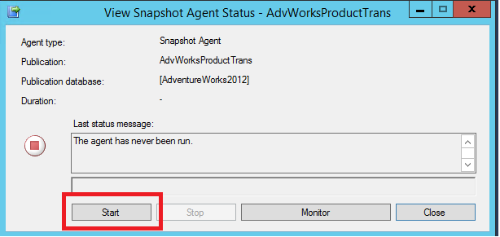
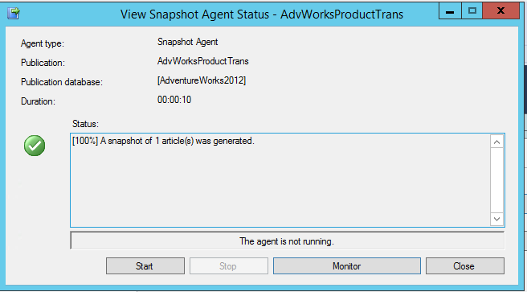
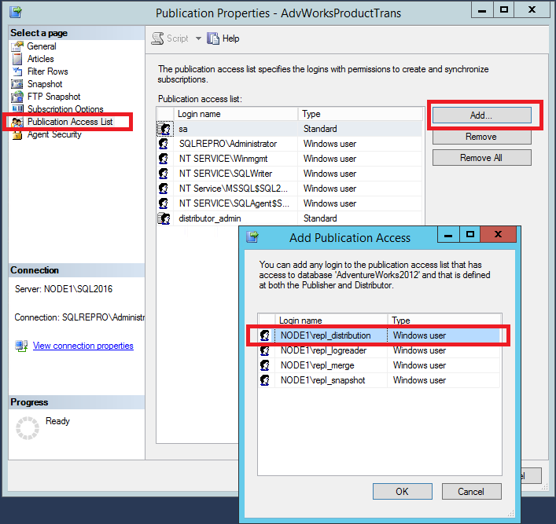
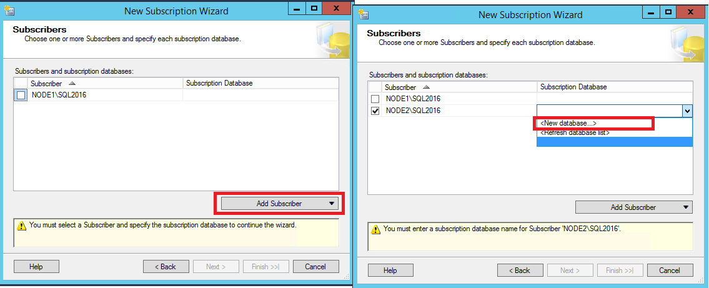
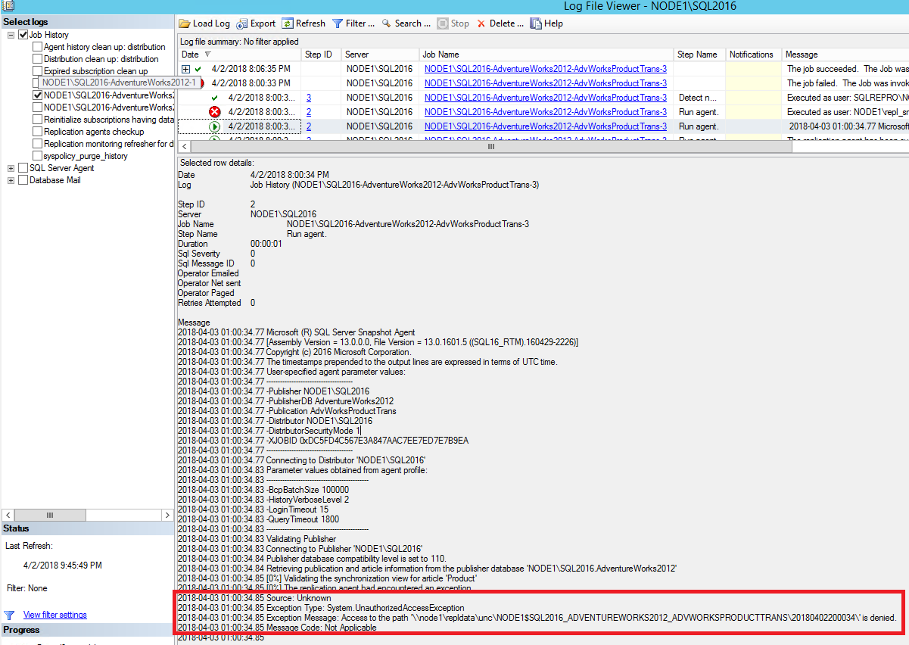
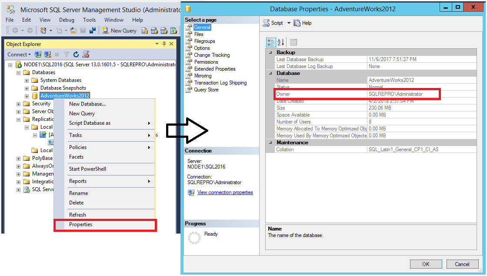
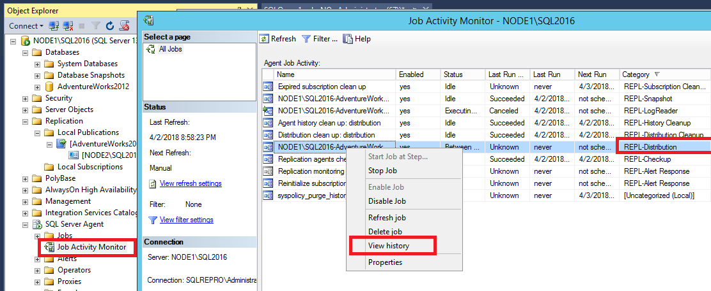
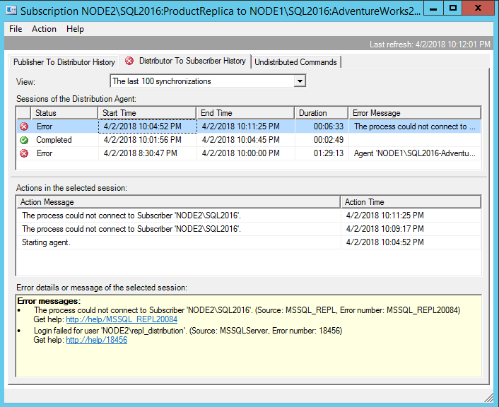
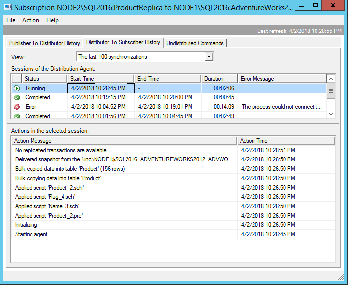

# Tutorial: Configure Publisher and Subscriber for Transactional Replication
[!INCLUDE[appliesto-ss-xxxx-xxxx-xxx-md](../../includes/appliesto-ss-xxxx-xxxx-xxx-md.md)]
Replication is a good solution to the problem of moving data between continuously connected servers. Using replication's wizards, you can easily configure and administer a replication topology. This tutorial shows you how to configure a replication topology for continuously connected servers.  
  
## What You Will Learn  
This tutorial will show you how to publish data from one database to another using transactional replication. 

In this tutorial, you will learn how to:
> [!div class="checklist"]
> * Publish data using Transactional Replication
> * Create a subscription to the Transactional publication
> * Validate the Subscription and measure latency
> * Troubleshooting Replication Error Methodology
  
  
## Prerequisites  
This tutorial is intended for users who are familiar with basic database operations, but who have limited experience with replication. This tutorial requires that you have completed the previous tutorial, [Preparing the Server for Replication](../../relational-databases/replication/tutorial-preparing-the-server-for-replication.md).  
  
To use this tutorial, your system must have the following SQL Server Management studio and these components:  
  
-   At the Publisher server (source):  
  
    -   Any edition of [!INCLUDE[ssNoVersion](../../includes/ssnoversion-md.md)], except Express ([!INCLUDE[ssExpress](../../includes/ssexpress-md.md)]) or [!INCLUDE[ssEW](../../includes/ssew-md.md)]. These editions cannot be replication Publishers.  
  
    -   [!INCLUDE[ssSampleDBUserInputNonLocal](../../includes/sssampledbuserinputnonlocal-md.md)] sample database. To enhance security, the sample databases are not installed by default.  
  
-   Subscriber server (destination):  
  
    -   Any edition of [!INCLUDE[ssNoVersion](../../includes/ssnoversion-md.md)], except [!INCLUDE[ssEW](../../includes/ssew-md.md)]. [!INCLUDE[ssEW](../../includes/ssew-md.md)] cannot be a Subscriber in transactional replication.  
  
- Install [SQL Server Management Studio](https://docs.microsoft.com/en-us/sql/ssms/download-sql-server-management-studio-ssms).
- Install [SQL Server 2017 Developer Edition](https://www.microsoft.com/en-us/sql-server/sql-server-downloads)
- Download an [AdventureWorks Sample Databases](https://github.com/Microsoft/sql-server-samples/releases). 
    - Instructions for restoring databases in SSMS can be found here: [Restoring a Database](https://docs.microsoft.com/en-us/sql/relational-databases/backup-restore/restore-a-database-backup-using-ssms). 
    >[!NOTE]
  > - Replication is not supported on SQL Servers that are more than two versions apart. For more information, please see [Supported SQL Versions in Repl Topology](https://blogs.msdn.microsoft.com/repltalk/2016/08/12/suppported-sql-server-versions-in-replication-topology/)
  > - In [!INCLUDE[ssManStudioFull](../../includes/ssmanstudiofull-md.md)], you must connect to the Publisher and Subscriber using a login that is a member of the **sysadmin** fixed server role  
  
  
**Estimated time to complete this tutorial: 60 minutes.**  
  
## Configure the Publisher for Transactional Replication
In this secton, you will create a transactional publication using [!INCLUDE[ssManStudioFull](../../includes/ssmanstudiofull-md.md)] to publish a filtered subset of the **Product** table in the [!INCLUDE[ssSampleDBobject](../../includes/sssampledbobject-md.md)] sample database. You will also add the SQL Server login used by the Distribution Agent to the publication access list (PAL). Before starting this tutorial, you should have completed the previous tutorial, [Preparing the Server for Replication](../../relational-databases/replication/tutorial-preparing-the-server-for-replication.md).


### Create a publication and define articles
1.  Connect to the Publisher in [!INCLUDE[ssManStudioFull](../../includes/ssmanstudiofull-md.md)], and then expand the server node.  
  
2.  Expand the **Replication** folder, right-click the **Local Publications** folder, and click **New Publication**.  This will launch the Publication Configuration Wizard. 

    
  
  
3.  On the Publication Database page, select [!INCLUDE[ssSampleDBobject](../../includes/sssampledbobject-md.md)], and then click **Next**.  
  
4.  On the Publication Type page, select **Transactional publication**, and then click **Next**.  

    
  
5.  On the Articles page, expand the **Tables** node, select the **Product** check box, then expand **Product** and clear the **ListPrice** and **StandardCost** check boxes. Click **Next**.  

    
  
6.  On the Filter Table Rows page, click **Add**.  
  
7.  In the **Add Filter** dialog box, click the **SafetyStockLevel** column, click the right arrow to add the column to the Filter statement WHERE clause of the filter query. Then manually type in the WHERE clause modifier as follows:  
  
    ```sql  
    WHERE [SafetyStockLevel] < 500  
    ```  

    
  
8.  Click **OK**, and then click **Next**.  
  
9. Select the **Create a snapshot immediately and keep the snapshot available to initialize subscriptions** check box, and click **Next**.  

    
  
10. On the Agent Security page, clear **Use the security settings from the Snapshot Agent** check box.  
  
11. Click **Security Settings** for the Snapshot Agent, enter \<*Machine_Name>***\repl_snapshot** in the **Process account** box, supply the password for this account, and then click **OK**.  

    
  
12. Repeat the previous step to set repl_logreader as the process account for the Log Reader Agent, and then click **Finish**.  

       

  
13. On the Complete the Wizard page, type **AdvWorksProductTrans** in the **Publication name** box, and click **Finish**.  

    
  
14. After the publication is created, click **Close** to complete the wizard. 

    You may encounter the following error if your SQL Server Agent is not running when  you attempt to create the publication. This is an indication that your publication was created successfully, but your Snapshot Agent was unable to start. If this happens, you'll need to start the SQL Server Agent, and then manually start the Snapshot Agent. Instructions for this are covered in the next section. 

    
    
  
### To view the status of snapshot generation  
  
1.  Connect to the Publisher in [!INCLUDE[ssManStudioFull](../../includes/ssmanstudiofull-md.md)], expand the server node, and then expand the **Replication** folder.  
  
2.  In the **Local Publications** folder, right-click **AdvWorksProductTrans**, and then click **View Snapshot Agent Status**.  

    
  
3.  The current status of the Snapshot Agent job for the publication is displayed. Verify that the snapshot job has succeeded before you continue to the next section.
          
    If your SQL Server Agent was not running when you first created the publication, you'll see that the Snapshot Agent was never run when you check the **Snapshot Agent Status** for your publication. If that's the case, select **Start** to start your agent. 

       

       Once your permissions are set correctly, try to **Start** the Snapshot agent once more. If issue persists, please see [Troubleshoot Errors with Snapshot Agent](#troubleshoot-erros-with-snapshot-agent)  
  

    

  
### To add the Distribution Agent login to the PAL  
  
1.  Connect to the Publisher in [!INCLUDE[ssManStudioFull](../../includes/ssmanstudiofull-md.md)], expand the server node, and then expand the **Replication** folder.  
  
2.  In the **Local Publications** folder, right-click **AdvWorksProductTrans**, and then click **Properties**.  The **Publication Properties** dialog box is displayed.

    
  
3.  Select the **Publication Access List** page, and select **Add**.  
  
4.  In the **Add Publication Access** dialog box, select *<Machine_Name>***\repl_distribution** and select **OK**. Select **OK**.  
  
    


**See Also**:  
[Replication Programming Concepts](../../relational-databases/replication/concepts/replication-programming-concepts.md)  
  

## Create a subscription to the Transactional publication
In this section, you will add a subscriber to the Publication that was previously created. This tutorial uses a remote subscriber (NODE2\SQL2016) but a subscription can also be added locally to the publisher. 

### To create the subscription  
  
1.  Connect to the Publisher in [!INCLUDE[ssManStudioFull](../../includes/ssmanstudiofull-md.md)], expand the server node, and then expand the **Replication** folder.  
  
2.  In the **Local Publications** folder, right-click the **AdvWorksProductTrans** publication, and then click **New Subscriptions**.  The New Subscription Wizard launches. 
 
            
  
3.  On the Publication page, select **AdvWorksProductTrans**, and then click **Next**.  

    
  
4.  On the Distribution Agent Location page, select **Run all agents at the Distributor**, and then click **Next**.  

    
  
5.  On the Subscribers page, if the name of the Subscriber instance is not displayed, click **Add Subscriber**, click **Add SQL Server Subscriber**, enter the Subscriber instance name in the **Connect to Server** dialog box, and then click **Connect**.  

    
  
6.  On the Subscribers page, select the instance name of the Subscriber server, and select **<New Database>** under **Subscription Database**.  
  
7.  On the **New Database** dialog box, enter **ProductReplica** in the **Database name** box, click **OK**, and then click **Next**.  

    
  
8.  In the **Distribution Agent Security** dialog box, click the ellipsis (**…**) button, enter \<*Machine_Name>***\repl_distribution** in the **Process account** box, enter the password for this account, click **OK**, and then click **Next**.

    
  
9. Click **Finish** to accept the default values on the remaining pages and complete the wizard.  
  
### Setting database permissions at the Subscriber  
  
1.  Connect to the Subscriber in [!INCLUDE[ssManStudioFull](../../includes/ssmanstudiofull-md.md)], expand **Security**, right-click **Logins**, and then select **New Login**.  
   
  
2.  On the **General** page, under **Login Name** select **Search** and add the login for <machinename>\repl_distributor. 
3. On the **User Mappings** page, grant the login **db_owner** for the **ProductReplica** database. 

    

  
### To view the synchronization status of the subscription  
  
1.  Connect to the Publisher in [!INCLUDE[ssManStudioFull](../../includes/ssmanstudiofull-md.md)], expand the server node, and then expand the **Replication** folder.  
  
2.  In the **Local Publications** folder, expand the **AdvWorksProductTrans** publication, right-click the subscription in the **ProductReplica** database, and then click **View Synchronization Status**. The current synchronization status of the subscription is displayed.  
    
3.  If the subscription is not visible under **AdvWorksProductTrans**, press F5 to refresh the list.  
  
**See Also**:  
[Initialize a Subscription with a Snapshot](../../relational-databases/replication/initialize-a-subscription-with-a-snapshot.md)  
[Create a Push Subscription](../../relational-databases/replication/create-a-push-subscription.md)  
[Subscribe to Publications](../../relational-databases/replication/subscribe-to-publications.md)  

## Measuring Replication Latency
In this section, you will use tracer tokens to verify that changes are being replicated to the Subscriber and to determine latency. Latency is the time it takes for a change made at the Publisher to appear to the Subscriber.
  
1.  Connect to the Publisher in [!INCLUDE[ssManStudioFull](../../includes/ssmanstudiofull-md.md)], expand the server node, right-click the **Replication** folder, and then click **Launch Replication Monitor**. 

2.  Expand a Publisher group in the left pane, expand the Publisher instance, and then click the **AdvWorksProductTrans** publication.  
  
3.  Click the **Tracer Tokens** tab.  
  
4.  Click **Insert Tracer**.  
  
5.  View elapsed time for the tracer token in the following columns: **Publisher to Distributor**, **Distributor to Subscriber**, **Total Latency**. A value of **Pending** indicates that the token has not reached a given point.  

    


## See Also  
[Measure Latency and Validate Connections for Transactional Replication](../../relational-databases/replication/monitor/measure-latency-and-validate-connections-for-transactional-replication.md)  2

## Troubleshooting Replication Error Methodology
This section teaches you how to troubleshoot basic replication synchronization failures. Please note that this section is meant to introduce you to navigating the replication components with the aim of troubleshooting. However, the actual errors that you encounter may be different than what is discussed here. Additionally, the resolutions used here are specific to the environment and may not work for you.  If that is the case, further troubleshooting is necessary and is outside the scope of this tutorial. 


### Troubleshoot Erros with Snapshot Agent
The **Snapshot Agent** is the agent that generates the snapshot, and writes it to the specified snapshot folder. 

1. To view the status of your snapshot agent, expand the **Local Publication** node under replication, right click your publication **AdvWorksProductTrans** > **View Snapshot Agent Status**. 
2. If an error isreported in the **Snapshot Agent Status**, more details can be found in the **Snapshot Agent** job history. To access this, expand **SQL Server Agent** in **Object Explorer** and open the **Job Activity Monitor**. 
3. Sort by **Category** and identfy the **Snapshot Agent** by the category 'REPL-Snapshot'. 
    
    
    
1. Right-click the **Snapshot Agent** and **View History**. Select the relevant error message and review the error message beneath the summary. 

    
     If your windows permissions are not configured correctly for your snapshot folder, you'll see an 'access is denied' error. You'll need to verify permissions for the <machine name>\repl_snapshot account on your repldata folder. For more information, please see [Create a share for the snapshot folder and assign permissions](tutorial-preparing-the-server-for-replication.md#create-a-share-for-the-snapshot-folder-and-assign-permissions).

### Troubleshoot Errors with Log Reader Agent
The **Log Reader Agent** connects to  your publisher database and scans the transaction log for any transactions that are marked 'for replication. It then adds those transactions to the **Distribution** database. 

1.  Connect to the Publisher in [!INCLUDE[ssManStudioFull](../../includes/ssmanstudiofull-md.md)], expand the server node, right-click the **Replication** folder, and then click **Launch Replication Monitor**.  

    
  
    Replication Monitor launches. 
     
   
2. The Red X is an indication that the publication is not synchronizing. Select the **AdvWorksProductTrans** publication on the left to identify where the issue is. 
  
3.  Expand the Publisher group in the left pane, expand the Publisher instance, and then click the **AdvWorksProductTrans** publication.  

    

4. Select the **Agents Tab** to identify which agent is encountering an error. 

    


5. Double-Click the Log Reader Agent Line that's reporting an error to open  the **Log Reader Agent** history. This provides more information about the error. 
    
    

       Status: 0, code: 20011, text: 'The process could not execute 'sp_replcmds' on 'NODE1\SQL2016'.'.
       The process could not execute 'sp_replcmds' on 'NODE1\SQL2016'.
        Status: 0, code: 15517, text: 'Cannot execute as the database principal because the principal "dbo" does not exist, this type of principal cannot be impersonated, or you do not have permission.'.
        Status: 0, code: 22037, text: 'The process could not execute 'sp_replcmds' on 'NODE1\SQL2016'.'.        

6. The aforementioned error is typically caused because the owner of the publisher database is not set correctly. To verify this, expand **Databases** in **Object Explorer** > right-click **AdventureWorks2012** > **Properties**. Verify the databsae owner on the **General** tab. 

    

7. If the owner is not set to 'sa', open a **New Query Window** within the context of the **AdventureWorks2012** database. Run the following T-SQL code snippet:

```sql
	EXEC sp_changedbowner 'sa'
```

8. You'll need to restart the **Log Reader Agent**. To do this, expand the **SQL Server Agent** node in **Object Explorer** and open the **Job Activity Monitor**. Sort by **Category** and identify the **Log Reader Agent** by the **'REPL-LogReader'** category. Right-click the **Log Reader Agent** job and **Start Job at Step**. 

    

9. Validate that your publication is now synchronizing by opening the **Replication Monitor** again. If it's not already open, it can be found by right-clicking **Replication** in **Object Explorer**. 
10. Select the **AdvWorksProductTrans** publication, select the **Agents** tab, and double-click the **Log Reader Agent** to open the agent history. You should now see that the **Log Reader Agent** is running and either replicating commands, or that it has "No Replicated Transacations"

    

### Troubleshoot errors with Distribution Agent
The **Distribution Agent** takes data it finds in the **Distrbution** database and then applies it to the subscriber. 

1. In **Replication Monitor**, select the **AdvWorksProductTrans** publication, and select the **All Subscriptions** tab. Right-Click the subscription and **View Details**.

    

2. The **Distributor to Subscriber** history dialog box opens, and clarifies what error the agent is encountering. 

     
    
    Error messages:
Agent 'NODE1\SQL2016-AdventureWorks2012-AdvWorksProductTrans-NODE2\SQL2016-7' is retrying after an error. 89 retries attempted. See agent job history in the Jobs folder for more details.

3. The error indicates that the **Distribution Agent** is retrying. To find out more information, expand **SQL Server Agent** in **Object Explorer** > **Job Activity Monitor**. Sort the jobs by **Category**. 

4. Identify the **Distribution Agent** by the category **'REPL-Distribution'**. Right-click the agent and **View History**:

    

5. Select one of the error entries and view the error text at the bottom of the window:  

    
    
        Message:
        Unable to start execution of step 2 (reason: Error authenticating proxy NODE1\repl_distribution, system error: The user name or password is incorrect.)

6. This error is an indication that the password used by the **Distribution Agent** is incorrect. To resolve this, expand the **Replication** node in **Object Explorer**, right-click the subscription > **Properties**. Select the elipses (...) next to **Agent Process Account** and modify the password:

    

7. Check your **Replication Monitor** again, which can be found by right-clicking **Replication**. A red X under **All Subscriptions** indicates that an issue persits. Open the **Distribution to Subscriber** history by right-clicking the Subscription in **Replication Monitor** > **View Details**. Here, the error is now different: 

    
           
        Connecting to Subscriber 'NODE2\SQL2016'        
        Agent message code 20084. The process could not connect to Subscriber 'NODE2\SQL2016'.
        Number:  18456
        Message: Login failed for user 'NODE2\repl_distribution'.

8. This error indicates that the the **Distribution Agent** could not connect to the subscriber, as the login failed for user **NODE2\repl_distribution**. To investigate further, open the **SQL Error Log** for the subscriber: 

    
    If you're seeing this error, it means that the login is missing on the subscriber. To resolve this, please see[Setting database permissions at the Subscriber](#setting-database-permissions-at-the-subscriber)

9. Once the login error has been resolved, check **Replication Monitor** again. We can now see that the distribution agent is running as expected, and has bulk copied the snapshot to the subscriber. 

        


  ## Next steps
The next article will teach you how to configure Merge replication.  

Advance to the next article to learn more
> [!div class="nextstepaction"]
> [Next steps button](tutorial-replicating-data-with-mobile-clients.md)

  
