# Tutorial: Configure replication between two fully connected servers (transactional)
 [!INCLUDE [SQL Server](../../includes/applies-to-version/sqlserver.md)]
Transactional replication is a good solution to the problem of moving data between continuously connected servers. By using the Replication Wizard, you can easily configure and administer a replication topology. 

This tutorial shows you how to configure a transactional replication topology for continuously connected servers. For more information about how transactional replication works, see the [overview of transactional replication](./transactional/transactional-replication.md). 
  
## What you will learn  
This tutorial teaches you to publish data from one database to another by using transactional replication.  

In this tutorial, you will learn how to:
> [!div class="checklist"]
> * Create a publisher via transactional replication.
> * Create a subscriber for the transactional publisher.
> * Validate the subscription and measure latency.
  
  
## Prerequisites  
This tutorial is for users who are familiar with basic database operations, but who have limited experience with replication. Before you start this tutorial, you must complete [Tutorial: Prepare SQL Server for replication](../../relational-databases/replication/tutorial-preparing-the-server-for-replication.md).  
  
To complete this tutorial, you need SQL Server, SQL Server Management Studio (SSMS), and an AdventureWorks database:  
  
- At the publisher server (source), install:  
  
   - Any edition of [!INCLUDE[ssNoVersion](../../includes/ssnoversion-md.md)], except SQL Server Express or SQL Server Compact. These editions cannot be replication publishers.   
   - The [!INCLUDE[ssSampleDBUserInputNonLocal](../../includes/sssampledbuserinputnonlocal-md.md)] sample database. To enhance security, the sample databases are not installed by default.  
  
- At the subscriber server (destination), install any edition of [!INCLUDE[ssNoVersion](../../includes/ssnoversion-md.md)], except [!INCLUDE[ssEW](../../includes/ssew-md.md)]. [!INCLUDE[ssEW](../../includes/ssew-md.md)] cannot be a subscriber in transactional replication.  
  
- Install [SQL Server Management Studio](../../ssms/download-sql-server-management-studio-ssms.md).
- Install [SQL Server 2017 Developer edition](https://www.microsoft.com/sql-server/sql-server-downloads).
- Download the [AdventureWorks sample database](https://github.com/Microsoft/sql-server-samples/releases). For instructions on restoring a database in SSMS, see [Restoring a database](../backup-restore/restore-a-database-backup-using-ssms.md). 
 
>[!NOTE]
> - Replication is not supported on SQL Server instances that are more than two versions apart. For more information, see [Supported SQL Server Versions in Replication Topology](https://blogs.msdn.microsoft.com/repltalk/2016/08/12/suppported-sql-server-versions-in-replication-topology/).
> - In [!INCLUDE[ssManStudioFull](../../includes/ssmanstudiofull-md.md)], you must connect to the publisher and subscriber by using a login that is a member of the **sysadmin** fixed server role. For more information on this role, see [Server-level roles](../security/authentication-access/server-level-roles.md).  
  
  
**Estimated time to complete this tutorial: 60 minutes**  
  
## Configure the publisher for transactional replication
In this section, you create a transactional publication by using [!INCLUDE[ssManStudioFull](../../includes/ssmanstudiofull-md.md)] to publish a filtered subset of the **Product** table in the [!INCLUDE[ssSampleDBobject](../../includes/sssampledbobject-md.md)] sample database. You also add the SQL Server login used by the Distribution Agent to the publication access list (PAL).


### Create a publication and define articles
1. Connect to the publisher in [!INCLUDE[ssManStudioFull](../../includes/ssmanstudiofull-md.md)], and then expand the server node.  
  
2. Right-click **SQL Server Agent** and select **Start**. The SQL Server Agent should be running before you create the publication. If this step does not start your agent, you'll need to do so manually from SQL Server Configuration Manager. 
3. Expand the **Replication** folder, right-click the **Local Publications** folder, and select **New Publication**. This step starts the New Publication Wizard:  

   
  
  
3. On the **Publication Database** page, select [!INCLUDE[ssSampleDBobject](../../includes/sssampledbobject-md.md)], and then select **Next**.  
  
4. On the **Publication Type** page, select **Transactional publication**, and then select **Next**:  

   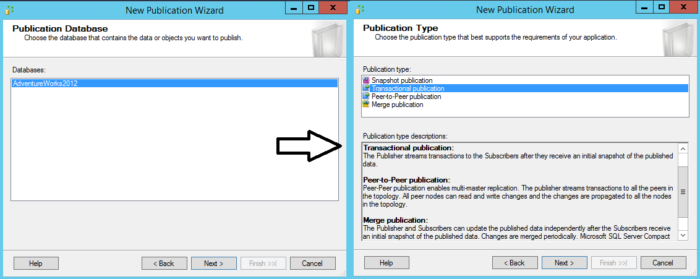
  
5. On the **Articles** page, expand the **Tables** node and select the **Product** check box. Then expand **Product** and clear the check boxes next to  **ListPrice** and **StandardCost**. Select **Next**.  

   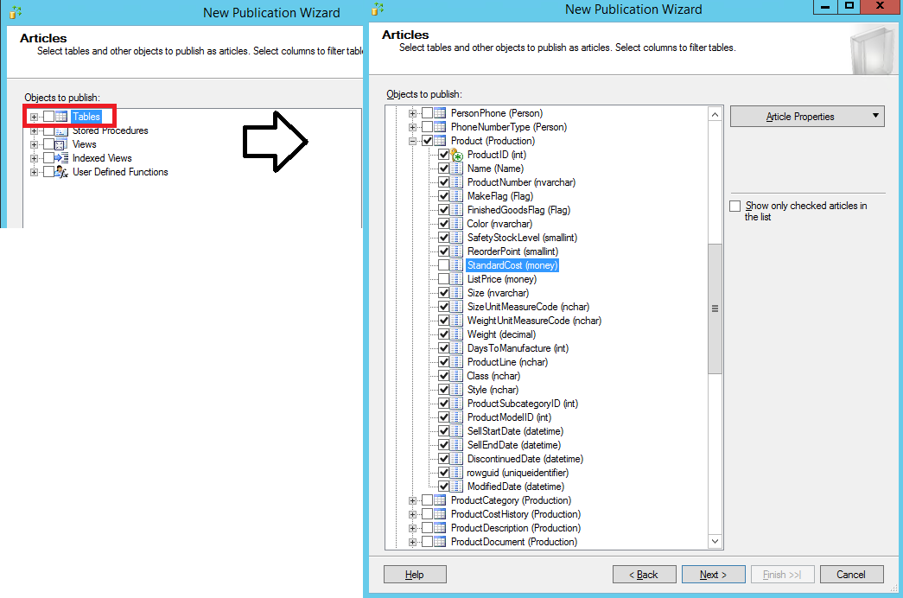
  
6. On the **Filter Table Rows** page, select **Add**.   
  
7. In the **Add Filter** dialog box, select the **SafetyStockLevel** column. Select the right arrow to add the column to the filter statement WHERE clause of the filter query. Then manually type in the WHERE clause modifier as follows:  
  
   ```sql  
   WHERE [SafetyStockLevel] < 500  
   ```
  
   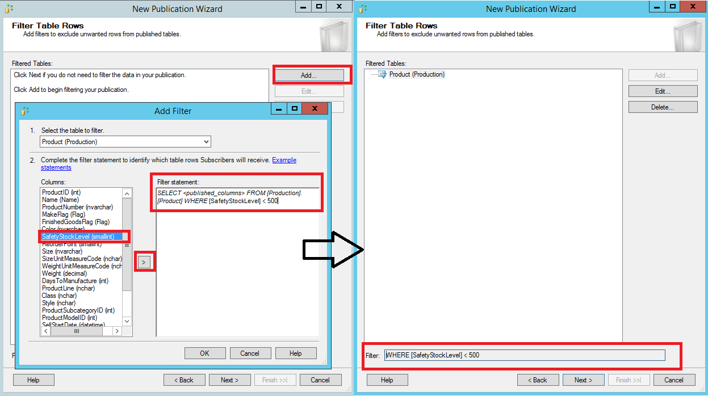
  
8. Select **OK**, and then select **Next**.  
  
9. Select the **Create a snapshot immediately and keep the snapshot available to initialize subscriptions** check box, and select **Next**:  

   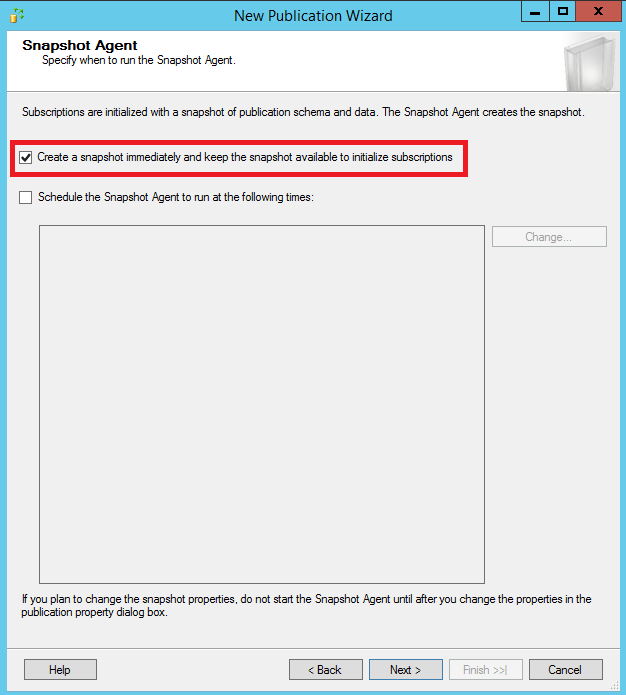
  
10. On the **Agent Security** page, clear the **Use the security settings from the Snapshot Agent** check box.   
  
    Select **Security Settings** for the Snapshot Agent. Enter <*Publisher_Machine_Name*>**\repl_snapshot** in the **Process account** box, supply the password for this account, and then select **OK**.  

    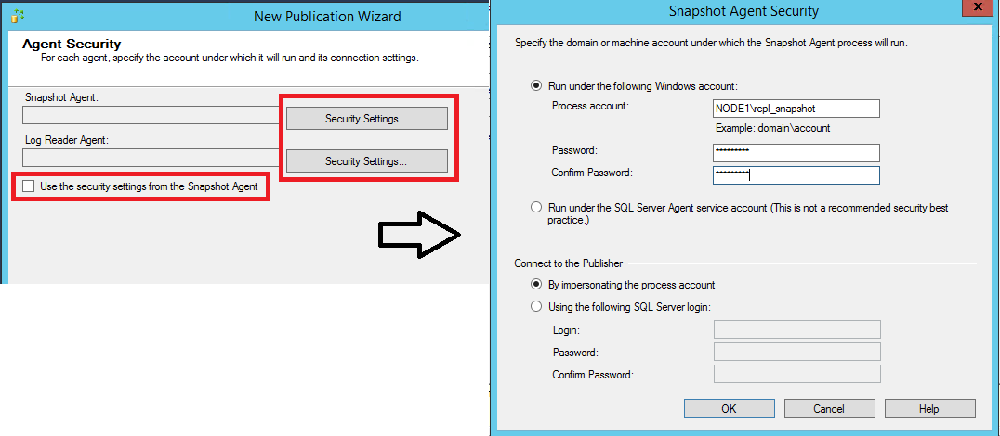
  
12. Repeat the previous step to set <*Publisher_Machine_Name*>**\repl_logreader** as the process account for the Log Reader Agent. Then select **OK**.  

    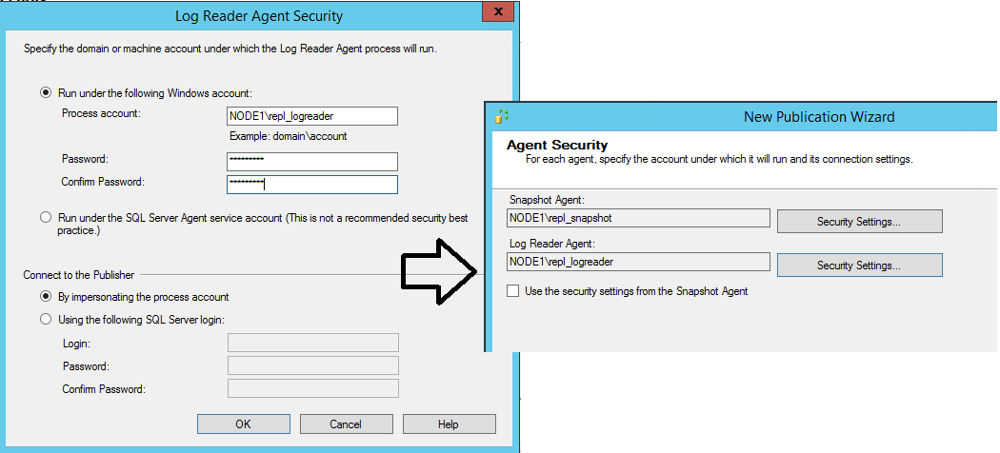   

  
13. On the **Complete the Wizard** page, type **AdvWorksProductTrans** in the **Publication name** box, and select **Finish**:  

    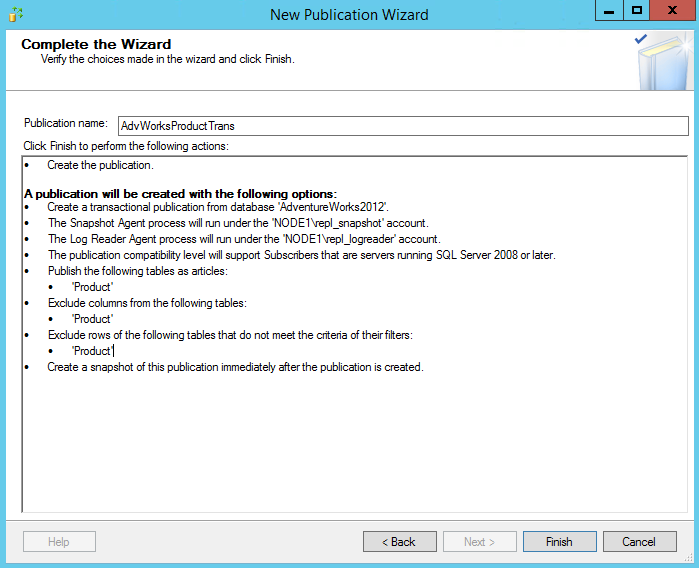
  
14. After the publication is created, select **Close** to complete the wizard. 

You might encounter the following error if your SQL Server Agent is not running when you try to create the publication. This error indicates that your publication was created successfully but your Snapshot Agent was unable to start. If this happens, you'll need to start the SQL Server Agent, and then manually start the Snapshot Agent. The next section gives instructions. 

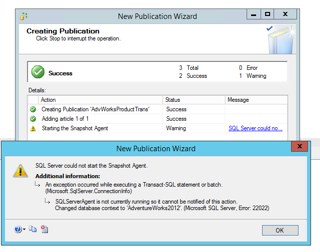
    
  
### View the status of snapshot generation  
  
1. Connect to the publisher in [!INCLUDE[ssManStudioFull](../../includes/ssmanstudiofull-md.md)], expand the server node, and then expand the **Replication** folder.  
  
2. In the **Local Publications** folder, right-click **AdvWorksProductTrans**, and then select **View Snapshot Agent Status**:  
   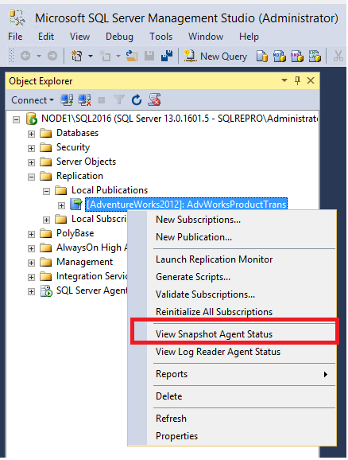
  
3. The current status of the Snapshot Agent job for the publication appears. Verify that the snapshot job has succeeded before you continue to the next section.
          
If your SQL Server Agent was not running when you created the publication, you'll see that the Snapshot Agent was never run when you check the Snapshot Agent status for your publication. If that's the case, select **Start** to start your Snapshot Agent: 

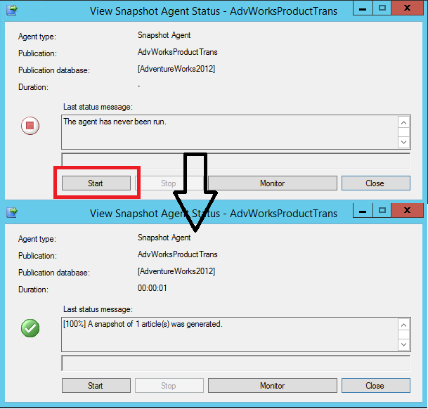
     
If you see an error here, see [Troubleshooting Snapshot Agent error](troubleshoot-tran-repl-errors.md#find-errors-with-the-snapshot-agent).


  
### Add the Distribution Agent login to the PAL  
  
1. Connect to the publisher in [!INCLUDE[ssManStudioFull](../../includes/ssmanstudiofull-md.md)], expand the server node, and then expand the **Replication** folder.  
  
2. In the **Local Publications** folder, right-click **AdvWorksProductTrans**, and then select **Properties**.  The **Publication Properties** dialog box appears.    
  
   a. Select the **Publication Access List** page, and select **Add**.  
   b. In the **Add Publication Access** dialog box, select <*Publisher_Machine_Name*>**\repl_distribution**, and select **OK**.
   
   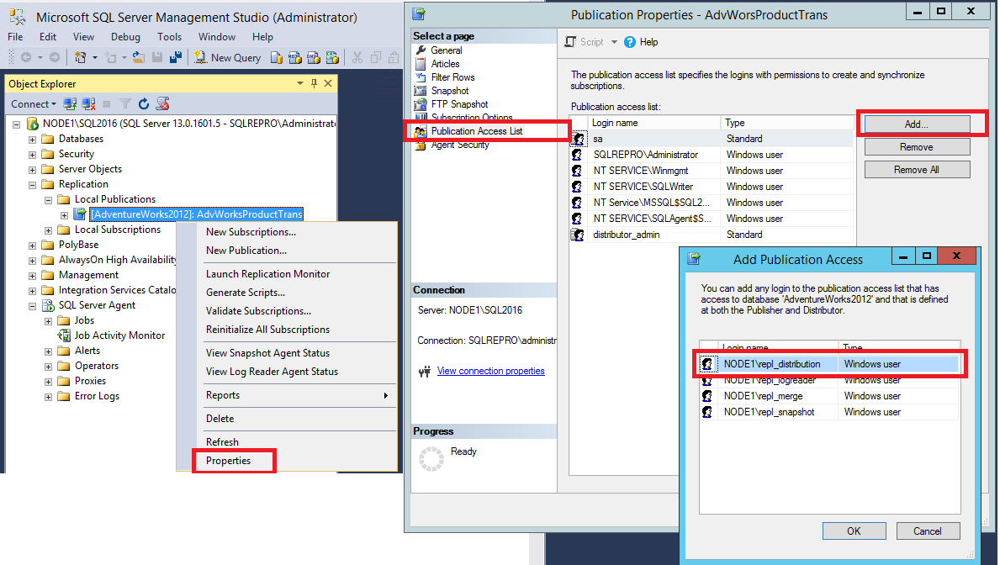

For more information, see [Replication programming concepts](../../relational-databases/replication/concepts/replication-programming-concepts.md).  
  

## Create a subscription to the transactional publication
In this section, you add a subscriber to the publication that you previously created. This tutorial uses a remote subscriber (NODE2\SQL2016), but you can also add a subscription locally to the publisher. 

### Create the subscription  
  
1. Connect to the publisher in [!INCLUDE[ssManStudioFull](../../includes/ssmanstudiofull-md.md)], expand the server node, and then expand the **Replication** folder.  
  
2. In the **Local Publications** folder, right-click the **AdvWorksProductTrans** publication, and then select **New Subscriptions**. The New Subscription Wizard starts: 
 
   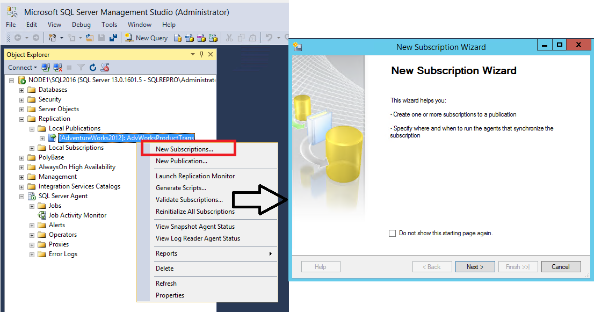     
  
3. On the **Publication** page, select **AdvWorksProductTrans**, and then select **Next**:  

   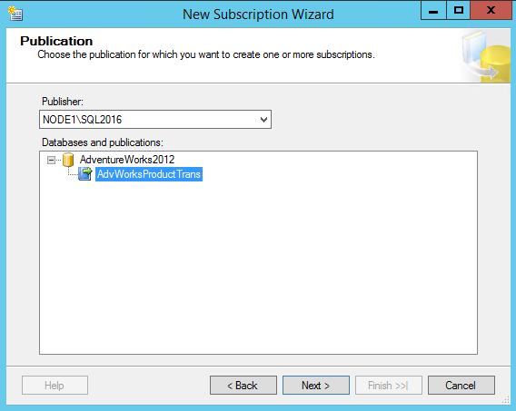
  
4. On the **Distribution Agent Location** page, select **Run all agents at the Distributor**, and then select **Next**.  For more information on pull and push subscriptions, see [Subscribe to publications](./subscribe-to-publications.md).

   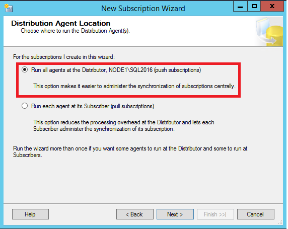
  
5. On the **Subscribers** page, if the name of the subscriber instance is not displayed, select **Add Subscriber**, and then select **Add SQL Server Subscriber** from the drop-down list. This step opens the **Connect to Server** dialog box. Enter the subscriber instance name and then select **Connect**.  
    
   After the subscriber has been added, select the check box next to the instance name of your subscriber. Then select **New Database** under **Subscription Database**.   

   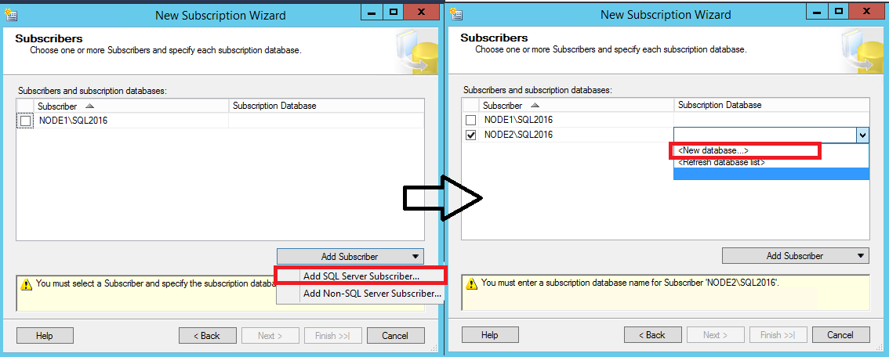

7. The **New Database** dialog box appears. Enter **ProductReplica** in the **Database name** box, select **OK**, and then select **Next**: 
  
   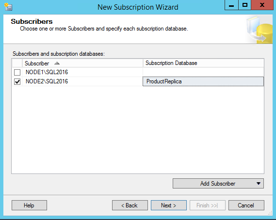
  
8. On the **Distribution Agent Security** page, select the ellipsis (**...**) button. Enter <*Publisher_Machine_Name*>**\repl_distribution** in the **Process account** box, enter the password for this account, select **OK**, and then select **Next**.

   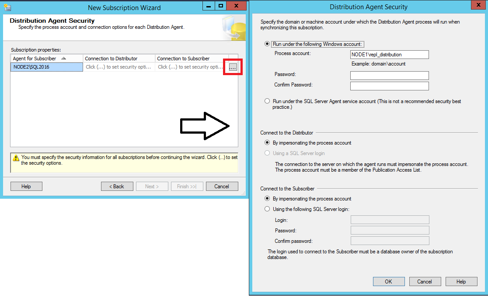
  
9. Select **Finish** to accept the default values on the remaining pages and complete the wizard.  
  
### Set database permissions at the subscriber  
  
1. Connect to the subscriber in [!INCLUDE[ssManStudioFull](../../includes/ssmanstudiofull-md.md)]. Expand **Security**, right-click **Logins**, and then select **New Login**.     
  
   a. On the **General** page, under **Login Name**, select **Search** and add the login for <*Subscriber_Machine_Name*>**\repl_distribution**.

   b. On the **User Mappings** page, grant the login **db_owner** membership for the **ProductReplica** database. 

   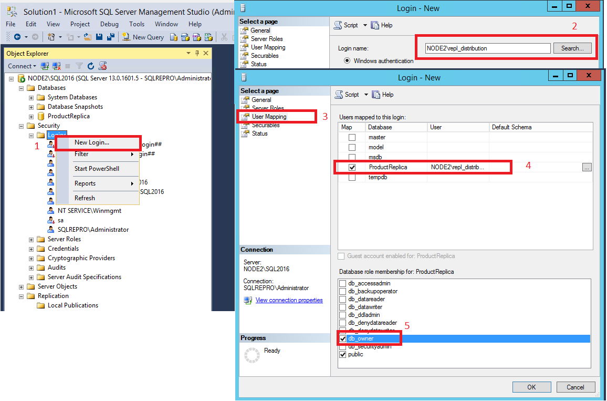

2. Select **OK** to close the **New Login** dialog box. 

  
### View the synchronization status of the subscription  
  
1. Connect to the publisher in [!INCLUDE[ssManStudioFull](../../includes/ssmanstudiofull-md.md)]. Expand the server node, and then expand the **Replication** folder.  
  
2. In the **Local Publications** folder, expand the **AdvWorksProductTrans** publication, right-click the subscription in the **ProductReplica** database, and then select **View Synchronization Status**. The current synchronization status of the subscription appears:

   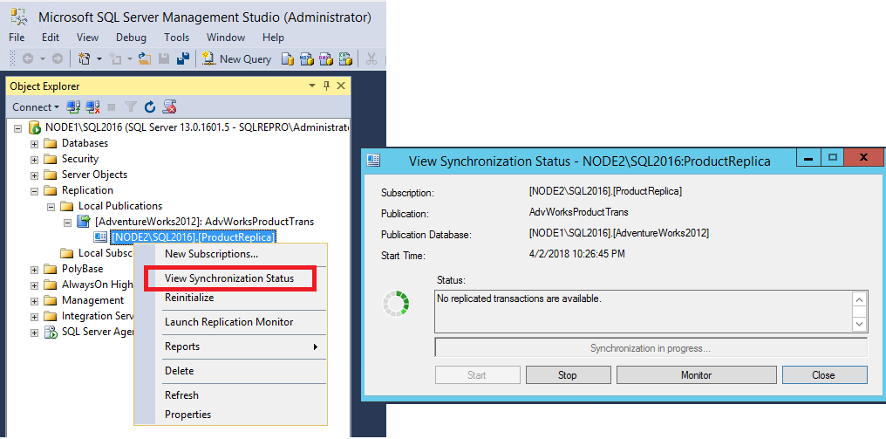
3. If the subscription is not visible under **AdvWorksProductTrans**, select the F5 key to refresh the list.  
  
For more information, see:  
- [Initialize a subscription with a snapshot](../../relational-databases/replication/initialize-a-subscription-with-a-snapshot.md)  
- [Create a push subscription](../../relational-databases/replication/create-a-push-subscription.md)  
- [Subscribe to publications](../../relational-databases/replication/subscribe-to-publications.md)  

## Measure replication latency
In this section, you use tracer tokens to verify that changes are being replicated to the subscriber and to determine latency. Latency is the time it takes for a change made at the publisher to appear to the subscriber.
  
1. Connect to the publisher in [!INCLUDE[ssManStudioFull](../../includes/ssmanstudiofull-md.md)]. Expand the server node, right-click the **Replication** folder, and then select **Launch Replication Monitor**:

   

2. Expand a publisher group in the left pane, expand the publisher instance, and then select the **AdvWorksProductTrans** publication.  
  
   a. Select the **Tracer Tokens** tab.  
   b. Select **Insert Tracer**.    
   c. View elapsed time for the tracer token in the following columns: **Publisher to Distributor**, **Distributor to Subscriber**, **Total Latency**. A value of **Pending** indicates that the token has not reached a specified point.

   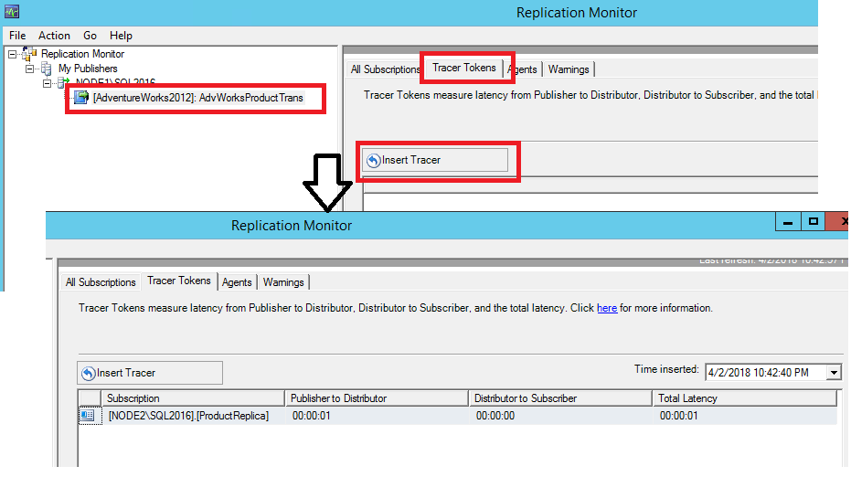


For more information, see: 
- [Measure latency and validate connections for transactional replication](../../relational-databases/replication/monitor/measure-latency-and-validate-connections-for-transactional-replication.md)
- [Finding errors with the transactional replication agents](troubleshoot-tran-repl-errors.md)


## Next steps
You have successfully configured both your publisher and your subscriber for transactional replication. You can now insert, update, or delete data in the **Product**  table at the publisher. Then you can query the **Product** table at the subscriber to view the replicated changes. 

The next article will teach you how to configure merge replication:  

> [!div class="nextstepaction"]
> [Tutorial: Configure replication between a server and mobile clients (merge)](tutorial-replicating-data-with-mobile-clients.md)