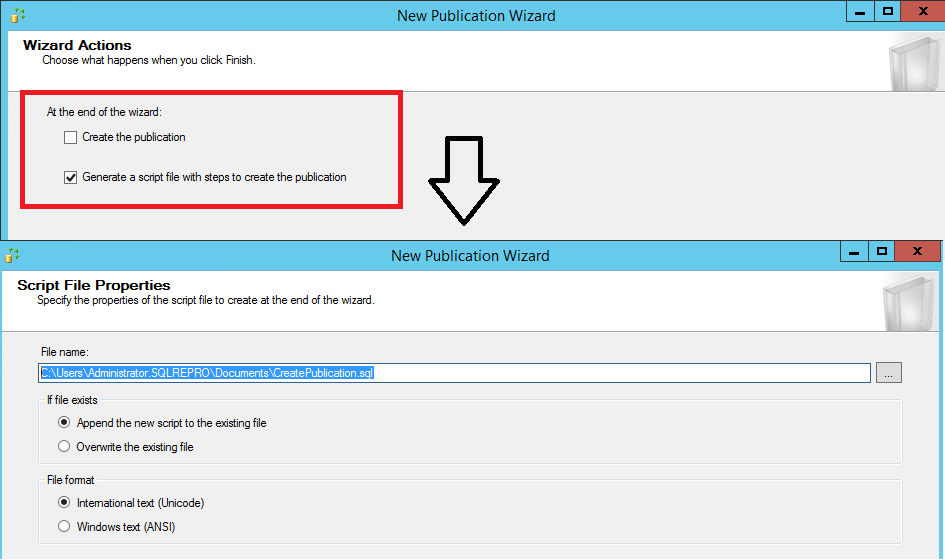
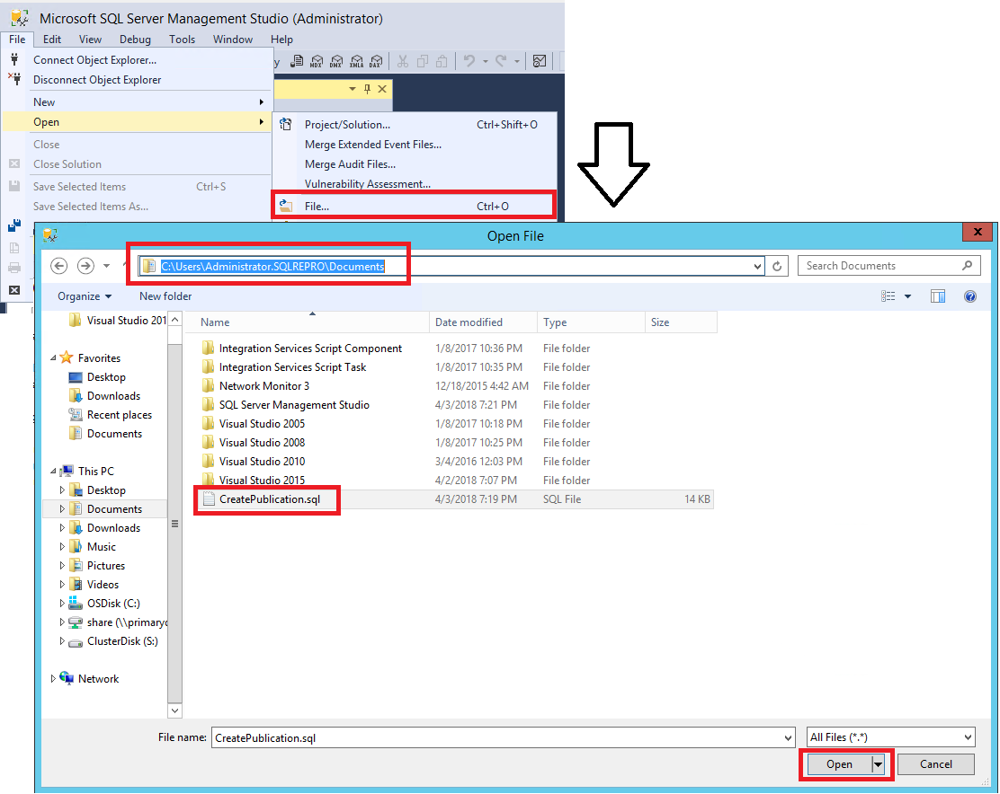

# Tutorial: Configure Publisher and Subscriber for Merge Replication
[!INCLUDE[appliesto-ss-xxxx-xxxx-xxx-md](../../includes/appliesto-ss-xxxx-xxxx-xxx-md.md)]
Merge replication is a good solution to the problem of moving data between a central server and mobile clients that are only occasionally connected. Using replication's wizards, you can easily configure and administer a Merge Replication topology. This tutorial shows you how to configure a replication topology for mobile clients.  For more information about Merge Replication, please see [An Overview of Merge Replication](https://docs.microsoft.com/en-us/sql/relational-databases/replication/merge/merge-replication)
  
## What You Will Learn  
This Tutorial teaches you to use Merge Replication to publish data from a central database to one or more mobile users so that each user gets a uniquely filtered subset of the data. 

In this tutorial, you will learn how to:
> [!div class="checklist"]
> * Configure a Publisher for Merge Replication
> * Configure a mobile Subscriber for your Merge Publication
> * Synchronize the Subscription to the Merge Publication
  
## Prerequisites  
This Tutorial is intended for users familiar with fundamental database operations, but who have limited experience with replication. Before you start this Tutorial, you must complete [Tutorial: Preparing the Server for Replication](../../relational-databases/replication/tutorial-preparing-the-server-for-replication.md).  
  
To use this tutorial, your system must have SQL Server Management Studio and the following components installed:  
  
-   At the Publisher server (source):  
  
    -   Any edition of [!INCLUDE[ssCurrent](../../includes/sscurrent-md.md)], except for Express ([!INCLUDE[ssExpress](../../includes/ssexpress-md.md)]) or [!INCLUDE[ssEW](../../includes/ssew-md.md)]. These editions cannot be a replication Publisher.  
  
    -   The [!INCLUDE[ssSampleDBobject](../../includes/sssampledbobject-md.md)] sample database. To enhance security, the sample databases are not installed by default..  
  
-   Subscriber server (destination):  
  
    -   Any edition of [!INCLUDE[ssCurrent](../../includes/sscurrent-md.md)], except for [!INCLUDE[ssEW](../../includes/ssew-md.md)]. [!INCLUDE[ssEW](../../includes/ssew-md.md)] is not supported by the publication created in this tutorial.  
  
    > [!NOTE]  
    > - Replication is not installed by default on [!INCLUDE[ssExpress](../../includes/ssexpress-md.md)].  
    > - In [!INCLUDE[ssManStudioFull](../../includes/ssmanstudiofull-md.md)], you must connect to the Publisher and Subscriber using a login that is a member of the sysadmin fixed server role. 
  
  
**Estimated time to complete this tutorial: 30 minutes.**  
  
## Configure a Publisher for Merge Replication
[!INCLUDE[appliesto-ss-xxxx-xxxx-xxx-md](../../includes/appliesto-ss-xxxx-xxxx-xxx-md.md)]
In this section, you will create a merge publication using [!INCLUDE[ssManStudioFull](../../includes/ssmanstudiofull-md.md)] to publish a subset of the **Employee**, **SalesOrderHeader**, and **SalesOrderDetail** tables in the [!INCLUDE[ssSampleDBobject](../../includes/sssampledbobject-md.md)] sample database. These tables are filtered with parameterized row filters so that each subscription contains a unique partition of the data. You will also add the [!INCLUDE[ssNoVersion](../../includes/ssnoversion-md.md)] login used by the Merge Agent to the publication access list (PAL).  
  
### Create Merge Publication and define articles  
  
1.  Connect to the Publisher in [!INCLUDE[ssManStudioFull](../../includes/ssmanstudiofull-md.md)], and then expand the server node.  
  
2.  Expand the **Replication** folder, right-click **Local Publications**, and select **New Publication**.  The Publication Configuration Wizard launches.  

    
  
3.  On the Publication Database page, select [!INCLUDE[ssSampleDBobject](../../includes/sssampledbobject-md.md)], and then select **Next**. 

      
4.  On the Publication Type page, select **Merge publication**, and then select **Next**.  
    a. On the Subscriber Types page, ensure that only [!INCLUDE[ssKatmai](../../includes/sskatmai-md.md)] or later is selected, and then select **Next**. 

    
  
 
  
6.  On the Articles page, expand the **Tables** node, expand the **Employee** table, and select **LoginID**. Next select **SalesOrderHeader** and **SalesOrderDetail**. Select **Next**.  

    
  
    > [!TIP]  
    > Additional required columns are automatically selected. Select any of  the automatically selected columns and view the note below the **Objects to publish** list for an explanation why the column is required.  
  
7.  On the Filter Table Rows page, select **Add** and then select **Add Filter**.  
  
8.  In the **Add Filter** dialog box, select **Employee (HumanResources)** in **Select the table to filter**, select the **LoginID** column, select the right arrow to add the column to the WHERE clause of the filter query, and modify the WHERE clause as follows:  
  
    ```  
    WHERE [LoginID] = HOST_NAME()  
    ```  
  
    a. Select **A row from this table will go to only one subscription**, and select **OK**.  
 
    

    
  
10. On the **Filter Table Rows** page, select **Employee (Human Resources)**, select **Add,** and then select **Add Join to Extend the Selected Filter**.  
  
    a. In the **Add Join** dialog box, select **Sales.SalesOrderHeader** under **Joined table**, select **Write the join statement manually**, and complete the join statement as follows:  
  
    ```  
    ON [Employee].[BusinessEntityID] =  [SalesOrderHeader].[SalesPersonID] 
    ```  
  
    a. In **Specify join options**, select **Unique key**, and then select **OK**.

    

  
13. On the Filter Table Rows page, select **SalesOrderHeader**, select **Add**, and then select **Add Join to Extend the Selected Filter**.  
  
    a. In the **Add Join** dialog box, select **Sales.SalesOrderDetail** under **Joined table**.    
    b. Select **Use the Builder to create the statement**.  
    c. In the **Preview** box, confirm that the join statement is as follows:  
  
    ```  
    ON [SalesOrderHeader].[SalesOrderID] = [SalesOrderDetail].[SalesOrderID] 
    ```  
  
    d. In **Specify join options**, select **Unique key**, and then select **OK**. Select **Next**. 

       
  
21. Select **Create a snapshot immediately**, clear **Schedule the snapshot agent to run at the following times**, and select **Next**.  

    
  
22. On the Agent Security page, select **Security Settings**, type \<*Machine_Name>***\repl_snapshot** in the **Process account** box, supply the password for this account, and then select **OK**. select **Finish**.  

    

23. On the **Wizard Action** page, clear the check next to **Create the Publication** and select to **Generate a script file with steps to create the publication**. Select **Next**. 
    a. On the **Script File Properties** page, choose a location for your publication generation script. The default is:  C:\Users\Administrator.SQLREPRO\Documents\CreatePublication.sql. Select **Next**.

        


  
23. On the Complete the Wizard page, enter **AdvWorksSalesOrdersMerge** in the **Publication name** box and select **Finish**.  

    
  
24. After the publication is created, select **Close**. 
25. Make sure the **SQL Server Agent** is running. If it is not, right-click the **SQL Server Agent** node in **Object Explorer** and select **Start**. 
26. Open the script that was just saved. From the menu select **File** >  **Open** > **File...** and navigate to where the script was saved. Highlight the script and select **Open**. 

    

27. This will open the script in a **New Query Window**. Locate the @job_password parameter of the stored procedure 'sp_addmergepublication'. 
  
### To view the status of snapshot generation  
  
1.  Connect to the Publisher in [!INCLUDE[ssManStudioFull](../../includes/ssmanstudiofull-md.md)], expand the server node, and then expand the **Replication** folder.  
  
2.  In the Local Publications folder, right-click **AdvWorksSalesOrdersMerge**, and then select **View Snapshot Agent Status**.  
  
3.  The current status of the Snapshot Agent job for the publication is displayed. Ensure that the snapshot job has succeeded before you continue to the next lesson.  
  
### To add the Merge Agent login to the PAL  
  
1.  Connect to the Publisher in [!INCLUDE[ssManStudioFull](../../includes/ssmanstudiofull-md.md)], expand the server node, and then expand the **Replication** folder.  
  
2.  In the Local Publications folder, right-click **AdvWorksSalesOrdersMerge**, and then select **Properties**.  
  
    The **Publication Properties** dialog box is displayed.  
  
3.  Select the **Publication Access List** page, and select **Add**.  
  
4.  In the Add Publication Access dialog box, select *<Machine_Name>***\repl_merge** and select **OK**. select **OK**.  
  
## Next Steps  
You have successfully created the merge publication. Next, you will subscribe to this publication. See [Lesson 2: Creating a Subscription to the Merge Publication](../../relational-databases/replication/lesson-2-creating-a-subscription-to-the-merge-publication.md).  
  
## See Also  
[Filter Published Data](../../relational-databases/replication/publish/filter-published-data.md)  
[Parameterized Row Filters](../../relational-databases/replication/merge/parameterized-filters-parameterized-row-filters.md)  
[Define an Article](../../relational-databases/replication/publish/define-an-article.md)  
  

  
## See Also  
[Replication Programming Concepts](../../relational-databases/replication/concepts/replication-programming-concepts.md)  
  
  
  
