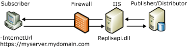

# Web Synchronization for Merge Replication
[!INCLUDE[appliesto-ss-xxxx-xxxx-xxx-md](../../includes/appliesto-ss-xxxx-xxxx-xxx-md.md)]
  Web synchronization for merge replication lets you replicate data by using the HTTPS protocol, and is useful for the following scenarios:  
  
-   Synchronizing data from mobile users over the Internet.  
  
-   Synchronizing data between [!INCLUDE[msCoName](../../includes/msconame-md.md)] [!INCLUDE[ssNoVersion](../../includes/ssnoversion-md.md)] databases across a corporate firewall.  
  
 For example, a traveling sales representative can use Web synchronization. The company, [!INCLUDE[ssSampleDBCoFull](../../includes/sssampledbcofull-md.md)], has sales representatives that travel to various stores and suppliers throughout their regions. On longer trips the representatives stay in hotels and need a convenient way to upload sales data and download any product updates at the end of each day.  
  
 The [!INCLUDE[ssSampleDBCoShort](../../includes/sssampledbcoshort-md.md)] IT department has configured each portable computer with [!INCLUDE[ssNoVersion](../../includes/ssnoversion-md.md)] and has enabled merge replication to use Web synchronization. The Merge Agent on each portable computer has an Internet URL that points to the replication components that are installed on a computer that is running [!INCLUDE[msCoName](../../includes/msconame-md.md)] Internet Information Services (IIS). These components synchronize the Subscriber with the Publisher. Each representative can now connect through any available Internet connection without using a remote dial-up connection, and can upload and download the appropriate data. The Internet connection uses Secure Sockets Layer (SSL); therefore, a virtual private network (VPN) is not required.  
  
 For information about how to configure the components that are required for Web synchronization, see [Configure Web Synchronization](../../relational-databases/replication/configure-web-synchronization.md), [Configure IIS for Web Synchronization](../../relational-databases/replication/configure-iis-for-web-synchronization.md), and [Configure IIS 7 for Web Synchronization](../../relational-databases/replication/configure-iis-7-for-web-synchronization.md).  
  
> [!NOTE]  
>  Web synchronization is designed for synchronizing data with portable computers, handheld devices, and other clients. Web synchronization is not intended for high-volume server-to-server applications.  
  
## Overview of How Web Synchronization Works  
 When Web synchronization is used, updates at the Subscriber are packaged and sent as an XML message to the computer that is running IIS by using the HTTPS protocol. The computer that is running IIS then sends the commands to the Publisher in a binary format, typically by using TCP/IP. Updates at the Publisher are sent to the computer that is running IIS and then packaged as an XML message for delivery to the Subscriber.  
  
 The following illustration shows some of the components that are involved in Web synchronization for merge replication.  
  
   
  
 Web synchronization is an option only for pull subscriptions; therefore, a Merge Agent will always run on the Subscriber. This Merge Agent can be the standard Merge Agent, the Merge Agent ActiveX control, or an application that provides synchronization through Replication Management Objects (RMO). To specify the location of the computer that is running IIS, use the **–InternetUrl** parameter for the Merge Agent.  
  
 The [!INCLUDE[ssNoVersion](../../includes/ssnoversion-md.md)] Replication Listener (Replisapi.dll) is configured on the computer that is running IIS and is responsible for handling messages that are sent to the server from the Publisher and Subscribers. Each node in the topology handles the XML data stream by using the Merge Replication Reconciler (Replrec.dll).  
  
 [!INCLUDE[ssVersion2005](../../includes/ssversion2005-md.md)] or a later version is required for all computers that participate in Web synchronization.  
  
### Synchronization Process  
 The following steps occur during synchronization:  
  
1.  The Merge Agent is started at the Subscriber. The agent does the following:  
  
    1.  Makes an SQL connection to the subscription database.  
  
    2.  Extracts any changes from the database.  
  
    3.  Makes an HTTPS request to the computer that is running IIS.  
  
    4.  Uploads data changes as an XML message.  
  
2.  The [!INCLUDE[ssNoVersion](../../includes/ssnoversion-md.md)] Replication Listener and Merge Replication Reconciler that are hosted on the computer that is running IIS do the following:  
  
    1.  Respond to the HTTPS request.  
  
    2.  Make an SQL connection to the publication database.  
  
    3.  Apply the upload changes to the publication database.  
  
    4.  Extract the download changes for the Subscriber.  
  
    5.  Send an HTTPS response back to the Merge Agent.  
  
3.  The Merge Agent at the Subscriber then accepts the HTTPS response and applies the download changes to the subscription database.  
  
## See Also  
 [Configure Web Synchronization](../../relational-databases/replication/configure-web-synchronization.md)   
 [Topologies for Web Synchronization](../../relational-databases/replication/topologies-for-web-synchronization.md)  
  
  
