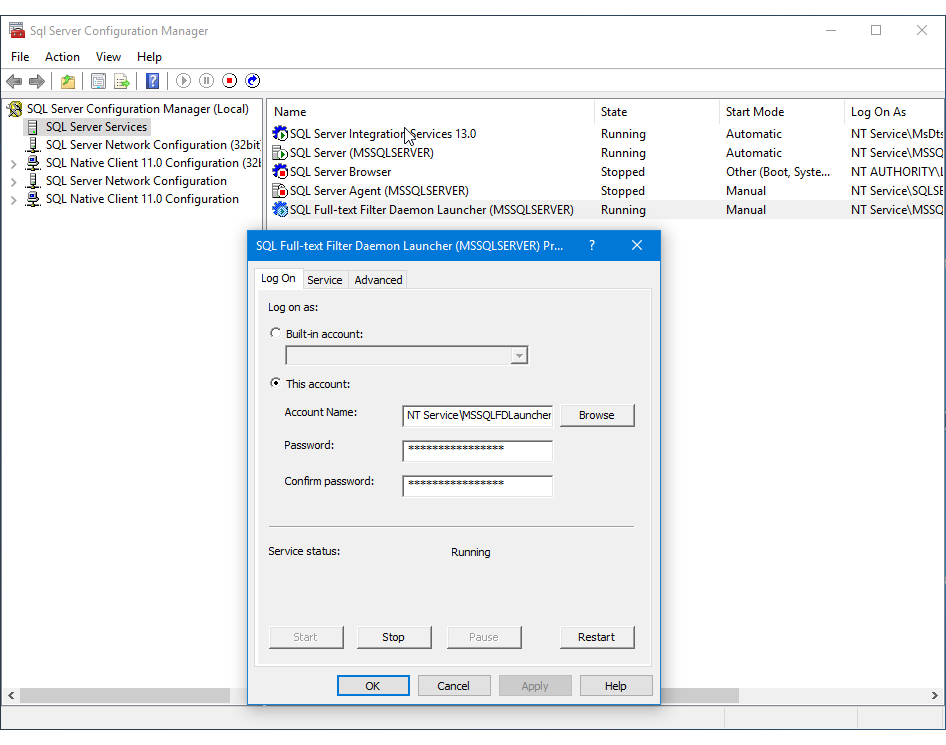

# Set the Service Account for the Full-text Filter Daemon Launcher
[!INCLUDE [SQL Server Azure SQL Database](../../includes/applies-to-version/sql-asdb.md)]
 This topic describes how to set or change the service account for the SQL Full-text Filter Daemon Launcher service (MSSQLFDLauncher) by using [!INCLUDE[ssNoVersion](../../includes/ssnoversion-md.md)] Configuration Manager. The default service account used by SQL Server setup is `NT Service\MSSQLFDLauncher`.
  
  
## About the SQL Full-text Filter Daemon Launcher service
The SQL Full-text Filter Daemon Launcher service is used by SQL Server Full-Text Search to start the filter daemon host process, which handles full-text search filtering and word breaking. The Launcher service must be running to use full-text search.  
  
The SQL Full-text Filter Daemon Launcher service is an instance-aware service that is associated with a specific instance of [!INCLUDE[ssNoVersion](../../includes/ssnoversion-md.md)]. The SQL Full-text Filter Daemon Launcher service propagates the service account information to each filter daemon host process that it launches.  

##   Set the service account  
  
1.  On the **Start** menu, point to **All Programs**, expand [!INCLUDE[ssCurrentUI](../../includes/sscurrentui-md.md)], and then click **SQL Server 2016 Configuration Manager**.  
  
2.  In **SQL Server Configuration Manager**, click **SQL Server Services**, right-click **SQL Full-text Filter Daemon Launcher (**_instance name_**)**, and then click **Properties**.  
  
3.  Click the **Log On** tab of the dialog box, and then select or enter the account under which to run the processes that the SQL Full-text Filter Daemon Launcher service starts.  
  
4.  After you close the dialog box, click **Restart** to restart the SQL Full-text Filter Daemon Launcher service.  
  

  
##   Troubleshoot the SQL Full-text Filter Daemon Launcher service if it doesn't start  
 If the SQL Full-text Filter Daemon Launcher service doesn't start, review the following possible causes:  
  
### Permissions issues
-   The [!INCLUDE[ssNoVersion](../../includes/ssnoversion-md.md)] service group does not have permission to start SQL Full-text Filter Daemon Launcher service.  

     Make sure the [!INCLUDE[ssNoVersion](../../includes/ssnoversion-md.md)] service group has permissions to the SQL Full-text Filter Daemon Launcher service account. During the installation of [!INCLUDE[ssNoVersion](../../includes/ssnoversion-md.md)], the [!INCLUDE[ssNoVersion](../../includes/ssnoversion-md.md)] service group is granted default permission to manage, query, and start the SQL Full-text Filter Daemon Launcher service. If [!INCLUDE[ssNoVersion](../../includes/ssnoversion-md.md)] service group permissions to the SQL Full-text Filter Daemon Launcher service account have been removed after [!INCLUDE[ssNoVersion](../../includes/ssnoversion-md.md)] installation, the SQL Full-text Filter Daemon Launcher service will not start, and full-text search will be disabled.     

-   The account used to log in to the service does not have privileges.  
  
     You may be using an account that does not have login privileges on the computer where the server instance is installed. Verify that you are logging in with an account that has User rights and permissions on the local computer.  

### Service account and password issues
-   The user account or password of the service account is incorrect.  
  
     In [!INCLUDE[ssNoVersion](../../includes/ssnoversion-md.md)] 2016 Configuration Manager, make sure the service is using the correct service account and password.  
  
-   The password associated with the SQL Full-text Filter Daemon Launcher service account has expired.  
  
     If you use a local user account for the SQL Full-text Filter Daemon Launcher service and the password expires, you have to:  
  
    1.  Set a new Windows password for the account.  
  
    2.  In [!INCLUDE[ssNoVersion](../../includes/ssnoversion-md.md)] 2016 Configuration Manager, update the SQL Full-text Filter Daemon Launcher service to use the new password.  
  
### Named pipes configuration issues
-   The SQL Full-text Filter Daemon Launcher service is not configured correctly.  
  
     If named pipes functionality has been disabled on the local computer, or if [!INCLUDE[ssNoVersion](../../includes/ssnoversion-md.md)] has been configured to use a named pipe other than the default named pipe, the SQL Full-text Filter Daemon Launcher service might not start.  
  
-   Another instance of the same named pipe is already running.  
  
     The [!INCLUDE[ssNoVersion](../../includes/ssnoversion-md.md)] service acts as a named pipe server for the SQL Full-text Filter Daemon Launcher service client. If the named pipe was already created by another process before [!INCLUDE[ssNoVersion](../../includes/ssnoversion-md.md)] starts, an error will be logged in the [!INCLUDE[ssNoVersion](../../includes/ssnoversion-md.md)] error log and the Windows Event Log, and full-text search will not be available.  Determine what process or application is attempting to use the same named pipe and stop the application.  
  
## See Also  
 [Managing Services How-to Topics &#40;SQL Server Configuration Manager&#41;](../../database-engine/configure-windows/scm-services-connect-to-another-computer.md)   
 [Upgrade Full-Text Search](../../relational-databases/search/upgrade-full-text-search.md)  
  
