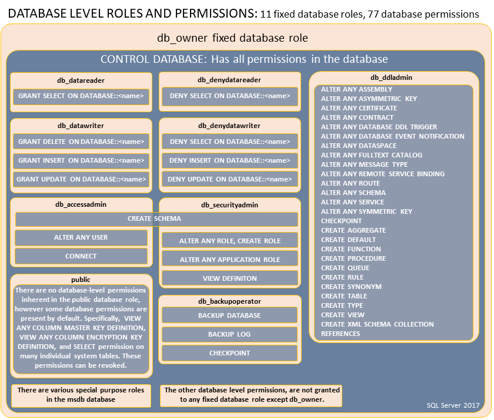

# Database-level roles

[!INCLUDE [SQL Server](../../../includes/applies-to-version/sql-asdb-asdbmi-asa-pdw.md)]

To easily manage the permissions in your databases, [!INCLUDE[ssNoVersion](../../../includes/ssnoversion-md.md)] provides several *roles that are security principals that group other principals. They are like ***groups*** in the [!INCLUDE[msCoName](../../../includes/msconame-md.md)] Windows operating system. Database-level roles are database-wide in their permissions scope.  

To add and remove users to a database role, use the `ADD MEMBER` and `DROP MEMBER` options of the [ALTER ROLE](../../../t-sql/statements/alter-role-transact-sql.md) statement. [!INCLUDE[ssPDW_md](../../../includes/sspdw-md.md)] and Azure Synapse doesn't support this use of `ALTER ROLE`. Use the older [sp_addrolemember](../../../relational-databases/system-stored-procedures/sp-addrolemember-transact-sql.md) and [sp_droprolemember](../../../relational-databases/system-stored-procedures/sp-droprolemember-transact-sql.md) procedures instead.
  
There are two types of database-level roles: *fixed-database roles* that are predefined in the database and *user-defined database roles* that you can create.  
  
Fixed-database roles are defined at the database level and exist in each database. Members of the **db_owner** database role can manage fixed-database role membership. There are also some special-purpose database roles in the msdb database.  
  
You can add any database account and other [!INCLUDE[ssNoVersion](../../../includes/ssnoversion-md.md)] roles into database-level roles.

> [!TIP]  
> Do not add user-defined database roles as members of fixed roles. This could enable unintended privilege escalation.  

The permissions of user-defined database roles can be customized by using the [GRANT](../../../t-sql/statements/grant-transact-sql.md), [DENY](../../../t-sql/statements/deny-transact-sql.md), and [REVOKE](../../../t-sql/statements/revoke-transact-sql.md) statements. For more information, see [Permissions (Database Engine)](../../../relational-databases/security/permissions-database-engine.md).

For a list of all the permissions, see the [Database Engine Permissions](https://aka.ms/sql-permissions-poster) poster. Server-level permissions cannot be granted to database roles. Logins and other server-level principals (such as server roles) cannot be added to database roles. For server-level security in [!INCLUDE[ssNoVersion_md](../../../includes/ssnoversion-md.md)], use [server roles](../../../relational-databases/security/authentication-access/server-level-roles.md) instead. Server-level permissions cannot be granted through roles in [!INCLUDE[ssSDS_md](../../../includes/sssds-md.md)] and Azure Synapse.

## Fixed-database roles
  
 The following table shows the fixed-database roles and their capabilities. These roles exist in all databases. Except for the **public** database role, the permissions assigned to the fixed-database roles cannot be changed.   
  
|Fixed-Database role name|Description|  
|-------------------------------|-----------------|  
|**db_owner**|Members of the **db_owner** fixed database role can perform all configuration and maintenance activities on the database, and can also `drop` the database in [!INCLUDE[ssNoVersion_md](../../../includes/ssnoversion-md.md)]. (In [!INCLUDE[ssSDS_md](../../../includes/sssds-md.md)] and Azure Synapse, some maintenance activities require server-level permissions and cannot be performed by **db_owners**.)|  
|**db_securityadmin**|Members of the **db_securityadmin** fixed database role can modify role membership for custom roles only and manage permissions. Members of this role can potentially elevate their privileges and their actions should be monitored.|  
|**db_accessadmin**|Members of the **db_accessadmin** fixed database role can add or remove access to the database for Windows logins, Windows groups, and [!INCLUDE[ssNoVersion](../../../includes/ssnoversion-md.md)] logins.|  
|**db_backupoperator**|Members of the **db_backupoperator** fixed database role can back up the database.|  
|**db_ddladmin**|Members of the **db_ddladmin** fixed database role can run any Data Definition Language (DDL) command in a database. Members of this role can potentially elevate their privileges by manipulating code that may get executed under high privileges and their actions should be monitored.|  
|**db_datawriter**|Members of the **db_datawriter** fixed database role can add, delete, or change data in all user tables. In most use cases this role will be combined with **db_datareader** membership to allow reading the data that is to be modified.|  
|**db_datareader**|Members of the **db_datareader** fixed database role can read all data from all user tables and views. User objects can exist in any schema except *sys* and *INFORMATION_SCHEMA*. |  
|**db_denydatawriter**|Members of the **db_denydatawriter** fixed database role cannot add, modify, or delete any data in the user tables within a database.|  
|**db_denydatareader**|Members of the **db_denydatareader** fixed database role cannot read any data from the user tables and views within a database.|  

The permissions assigned to the fixed-database roles cannot be changed. The following figure shows the permissions assigned to the fixed-database roles:



## Special roles for [!INCLUDE[ssSDS_md](../../../includes/sssds-md.md)] and Azure Synapse

These database roles exist only in the virtual master database. Their permissions are restricted to actions performed in master. Only database users in master can be added to these roles. Logins cannot be added to these roles, but users can be created based on logins and then those users can be added to the roles. Contained database users in master can also be added to these roles. However, contained database users added to the **dbmanager** role in master cannot be used to create new databases.

|Role name|Description|  
|--------------------|-----------------|
|**dbmanager** | Can create and delete databases. A member of the dbmanager role that creates a database, becomes the owner of that database, which allows that user to connect to that database as the dbo user. The dbo user has all database permissions in the database. Members of the dbmanager role don't necessarily have permission to access databases that they don't own.|
|**db_exporter** | *Applies only to Azure Synapse Analytics dedicated SQL pools (formerly SQL DW).*<BR>Members of the **db_exporter** fixed database role can perform all data export activities. Permissions granted via this role are CREATE TABLE, ALTER ANY SCHEMA, ALTER ANY EXTERNAL DATA SOURCE, ALTER ANY EXTERNAL FILE FORMAT. |
|**loginmanager** | Can create and delete logins in the virtual master database.|

> [!NOTE]
> The server-level principal and the Azure Active Directory Administrator (if configured) have all permissions in the [!INCLUDE[ssSDS_md](../../../includes/sssds-md.md)] and Azure Synapse without needing to be members of any roles. For more information, see [SQL Database Authentication and Authorization: Granting Access](/azure/azure-sql/database/logins-create-manage). 

Some database roles aren't applicable to Azure SQL or Azure Synapse:
- **db_backupoperator** is not applicable in Azure SQL database (not managed instance) and Azure Synapse serverless pool because backup and restore T-SQL commands are not available.
- **db_datawriter** and **db_denydatawriter** are not applicable to Azure Synapse serverless because it just reads external data.
  
## msdb roles  
 The msdb database contains the special-purpose roles that are shown in the following table.  
  
|msdb role name|Description|  
|--------------------|-----------------|  
|**db_ssisadmin**<br /><br /> **db_ssisoperator**<br /><br /> **db_ssisltduser**|Members of these database roles can administer and use [!INCLUDE[ssIS](../../../includes/ssis-md.md)]. Instances of [!INCLUDE[ssNoVersion](../../../includes/ssnoversion-md.md)] that are upgraded from an earlier version might contain an older version of the role that was named using Data Transformation Services (DTS) instead of [!INCLUDE[ssIS](../../../includes/ssis-md.md)]. For more information, see [Integration Services Roles &#40;SSIS Service&#41;](../../../integration-services/security/integration-services-roles-ssis-service.md).|  
|**dc_admin**<br /><br /> **dc_operator**<br /><br /> **dc_proxy**|Members of these database roles can administer and use the data collector. For more information, see [Data Collection](../../../relational-databases/data-collection/data-collection.md).|  
|**PolicyAdministratorRole**|Members of the **db_ PolicyAdministratorRole** database role can perform all configuration and maintenance activities on Policy-Based Management policies and conditions. For more information, see [Administer Servers by Using Policy-Based Management](../../../relational-databases/policy-based-management/administer-servers-by-using-policy-based-management.md).|  
|**ServerGroupAdministratorRole**<br /><br /> **ServerGroupReaderRole**|Members of these database roles can administer and use registered server groups.|  
|**dbm_monitor**|Created in the **msdb** database when the first database is registered in Database Mirroring Monitor. The **dbm_monitor** role has no members until a system administrator assigns users to the role.|  
  
> [!IMPORTANT]  
>  Members of the **db_ssisadmin** role and the **dc_admin** role may be able to elevate their privileges to sysadmin. This elevation of privilege can occur because these roles can modify [!INCLUDE[ssISnoversion](../../../includes/ssisnoversion-md.md)] packages and [!INCLUDE[ssISnoversion](../../../includes/ssisnoversion-md.md)] packages can be executed by [!INCLUDE[ssNoVersion](../../../includes/ssnoversion-md.md)] using the sysadmin security context of [!INCLUDE[ssNoVersion](../../../includes/ssnoversion-md.md)] Agent. To guard against this elevation of privilege when running maintenance plans, data collection sets, and other [!INCLUDE[ssISnoversion](../../../includes/ssisnoversion-md.md)] packages, configure [!INCLUDE[ssNoVersion](../../../includes/ssnoversion-md.md)] Agent jobs that run packages to use a proxy account with limited privileges or only add **sysadmin** members to the **db_ssisadmin** and **dc_admin** roles.  

## Working with database-level roles  
 The following table explains the commands, views, and functions for working with database-level roles.  
  
|Feature|Type|Description|  
|-------------|----------|-----------------|  
|[sp_helpdbfixedrole &#40;Transact-SQL&#41;](../../../relational-databases/system-stored-procedures/sp-helpdbfixedrole-transact-sql.md)|Metadata|Returns a list of the fixed database roles.|  
|[sp_dbfixedrolepermission &#40;Transact-SQL&#41;](../../../relational-databases/system-stored-procedures/sp-dbfixedrolepermission-transact-sql.md)|Metadata|Displays the permissions of a fixed database role.|  
|[sp_helprole &#40;Transact-SQL&#41;](../../../relational-databases/system-stored-procedures/sp-helprole-transact-sql.md)|Metadata|Returns information about the roles in the current database.|  
|[sp_helprolemember &#40;Transact-SQL&#41;](../../../relational-databases/system-stored-procedures/sp-helprolemember-transact-sql.md)|Metadata|Returns information about the members of a role in the current database.|  
|[sys.database_role_members &#40;Transact-SQL&#41;](../../../relational-databases/system-catalog-views/sys-database-role-members-transact-sql.md)|Metadata|Returns one row for each member of each database role.|  
|[IS_MEMBER &#40;Transact-SQL&#41;](../../../t-sql/functions/is-member-transact-sql.md)|Metadata|Indicates whether the current user is a member of the specified Microsoft Windows group or Microsoft SQL Server database role.|  
|[CREATE ROLE &#40;Transact-SQL&#41;](../../../t-sql/statements/create-role-transact-sql.md)|Command|Creates a new database role in the current database.|  
|[ALTER ROLE &#40;Transact-SQL&#41;](../../../t-sql/statements/alter-role-transact-sql.md)|Command|Changes the name or membership of a database role.|  
|[DROP ROLE &#40;Transact-SQL&#41;](../../../t-sql/statements/drop-role-transact-sql.md)|Command|Removes a role from the database.|  
|[sp_addrole &#40;Transact-SQL&#41;](../../../relational-databases/system-stored-procedures/sp-addrole-transact-sql.md)|Command|Creates a new database role in the current database.|  
|[sp_droprole &#40;Transact-SQL&#41;](../../../relational-databases/system-stored-procedures/sp-droprole-transact-sql.md)|Command|Removes a database role from the current database.|  
|[sp_addrolemember &#40;Transact-SQL&#41;](../../../relational-databases/system-stored-procedures/sp-addrolemember-transact-sql.md)|Command|Adds a database user, database role, Windows login, or Windows group to a database role in the current database. All platforms except [!INCLUDE[ssPDW_md](../../../includes/sspdw-md.md)] and Azure Synapse should use `ALTER ROLE` instead.|  
|[sp_droprolemember &#40;Transact-SQL&#41;](../../../relational-databases/system-stored-procedures/sp-droprolemember-transact-sql.md)|Command|Removes a security account from a SQL Server role in the current database. All platforms except [!INCLUDE[ssPDW_md](../../../includes/sspdw-md.md)] and Azure Synapse should use `ALTER ROLE` instead.|
|[GRANT](../../../t-sql/statements/grant-transact-sql.md)| Permissions | Adds permission to a role.
|[DENY](../../../t-sql/statements/deny-transact-sql.md)| Permissions | Denies a permission to a role.
|[REVOKE](../../../t-sql/statements/revoke-transact-sql.md)| Permissions | Removes previously granted or denied permissions.

## Public database role

Every database user belongs to the **public** database role. When a user hasn't been granted or denied specific permissions on a securable object, the user inherits the permissions granted to **public** on that object. Database users cannot be removed from the **public** role. 

## <a name="_examples"></a> Examples

The examples in this section show how to work with database-level roles.  

### A.  Adding a User to a database-level role

The following example adds the User 'Ben' to the fixed database-level role `db_datareader`.

```sql  
ALTER ROLE db_datareader
	ADD MEMBER Ben;  
GO
```  

### B.  Listing all database-principals that are members of a database-level role

The following statement returns all members of any database role. 

```sql  
SELECT    roles.principal_id                            AS RolePrincipalID
    ,    roles.name                                    AS RolePrincipalName
    ,    database_role_members.member_principal_id    AS MemberPrincipalID
    ,    members.name                                AS MemberPrincipalName
FROM sys.database_role_members AS database_role_members  
JOIN sys.database_principals AS roles  
    ON database_role_members.role_principal_id = roles.principal_id  
JOIN sys.database_principals AS members  
    ON database_role_members.member_principal_id = members.principal_id;  
GO
```  

## Related content

- [Security Catalog Views &#40;Transact-SQL&#41;](../../../relational-databases/system-catalog-views/security-catalog-views-transact-sql.md)  
- [Security Stored Procedures &#40;Transact-SQL&#41;](../../../relational-databases/system-stored-procedures/security-stored-procedures-transact-sql.md)  
- [Security Functions &#40;Transact-SQL&#41;](../../../t-sql/functions/security-functions-transact-sql.md)  
- [Securing SQL Server](../../../relational-databases/security/securing-sql-server.md)  
- [sp_helprotect &#40;Transact-SQL&#41;](../../../relational-databases/system-stored-procedures/sp-helprotect-transact-sql.md)
- [Server roles in Azure SQL Database](/azure/azure-sql/database/security-server-roles)
