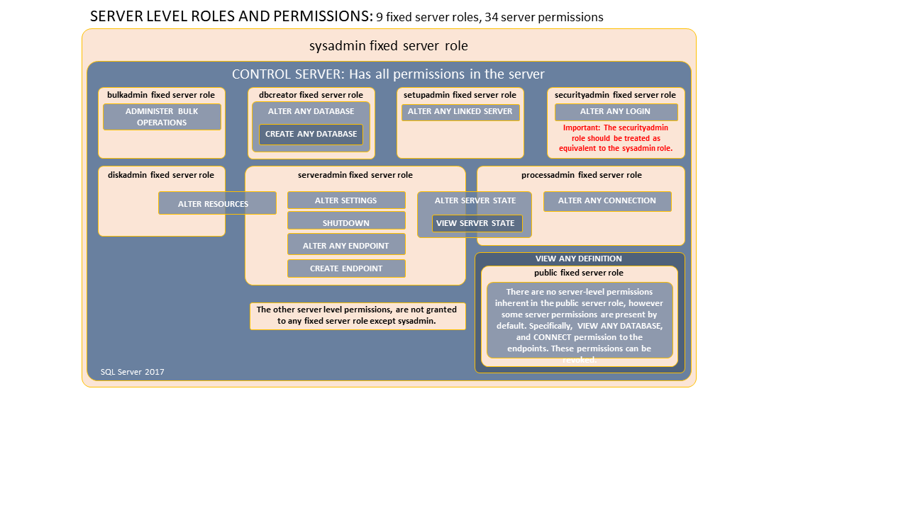

# Server-Level Roles
[!INCLUDE[appliesto-ss-xxxx-xxxx-pdw-md](../../../includes/appliesto-ss-xxxx-xxxx-pdw-md.md)]

  [!INCLUDE[ssNoVersion](../../../includes/ssnoversion-md.md)] provides server-level roles to help you manage the permissions on a server. These roles are security principals that group other principals. Server-level roles are server-wide in their permissions scope. (*Roles* are like *groups* in the Windows operating system.)  
  
 Fixed server roles are provided for convenience and backward compatibility. Assign more specific permissions whenever possible.  
  
 [!INCLUDE[ssNoVersion](../../../includes/ssnoversion-md.md)] provides nine fixed server roles. The permissions that are granted to the fixed server roles (except **public**) cannot be changed. Beginning with [!INCLUDE[ssSQL11](../../../includes/sssql11-md.md)], you can create user-defined server roles and add server-level permissions to the user-defined server roles.  
  
 You can add server-level principals ( [!INCLUDE[ssNoVersion](../../../includes/ssnoversion-md.md)] logins, Windows accounts, and Windows groups) into server-level roles. Each member of a fixed server role can add other logins to that same role. Members of user-defined server roles cannot add other server principals to the role.  
> [!NOTE]
>  Server-level permissions are not available in SQL Database or SQL Data Warehouse. For more information about SQL Database, see [Controlling and granting database access.](https://docs.microsoft.com/azure/sql-database/sql-database-manage-logins)
  
## Fixed Server-Level Roles  
 The following table shows the fixed server-level roles and their capabilities.  
  
|Fixed server-level role|Description|  
|------------------------------|-----------------|  
|**sysadmin**|Members of the **sysadmin** fixed server role can perform any activity in the server.|  
|**serveradmin**|Members of the **serveradmin** fixed server role can change server-wide configuration options and shut down the server.|  
|**securityadmin**|Members of the **securityadmin** fixed server role manage logins and their properties. They can `GRANT`, `DENY`, and `REVOKE` server-level permissions. They can also `GRANT`, `DENY`, and `REVOKE` database-level permissions if they have access to a database. Additionally, they can reset passwords for [!INCLUDE[ssNoVersion](../../../includes/ssnoversion-md.md)] logins.<br /><br /> **IMPORTANT:** The ability to grant access to the [!INCLUDE[ssDE](../../../includes/ssde-md.md)] and to configure user permissions allows the security admin to assign most server permissions. The **securityadmin** role should be treated as equivalent to the **sysadmin** role.|  
|**processadmin**|Members of the **processadmin** fixed server role can end processes that are running in an instance of [!INCLUDE[ssNoVersion](../../../includes/ssnoversion-md.md)].|  
|**setupadmin**|Members of the **setupadmin** fixed server role can add and remove linked servers by using [!INCLUDE[tsql](../../../includes/tsql-md.md)] statements. (**sysadmin** membership is needed when using [!INCLUDE[ssManStudio](../../../includes/ssmanstudio-md.md)].)|  
|**bulkadmin**|Members of the **bulkadmin** fixed server role can run the `BULK INSERT` statement.|  
|**diskadmin**|The **diskadmin** fixed server role is used for managing disk files.|  
|**dbcreator**|Members of the **dbcreator** fixed server role can create, alter, drop, and restore any database.|  
|**public**|Every [!INCLUDE[ssNoVersion](../../../includes/ssnoversion-md.md)] login belongs to the **public** server role. When a server principal has not been granted or denied specific permissions on a securable object, the user inherits the permissions granted to public on that object. Only assign public permissions on any object when you want the object to be available to all users. You cannot change membership in public.<br /><br /> **Note:** **public** is implemented differently than other roles, and permissions can be granted, denied, or revoked from the public fixed server roles.|  
  
## Permissions of Fixed Server Roles  
 Each fixed server role has certain permissions assigned to it. The following graphic shows the permissions assigned to the server roles.   
   
  
> [!IMPORTANT]  
>  The **CONTROL SERVER** permission is similar but not identical to the **sysadmin** fixed server role. Permissions do not imply role memberships and role memberships do not grant permissions. (E.g. **CONTROL SERVER** does not imply membership in the **sysadmin** fixed server role.) However, it is sometimes possible to impersonate between roles and equivalent permissions. Most **DBCC** commands and many system procedures require membership in the **sysadmin** fixed server role. For a list of 171 system stored procedures that require **sysadmin** membership, see the following blog post by Andreas Wolter [CONTROL SERVER vs. sysadmin/sa: permissions, system procedures, DBCC, automatic schema creation and privilege escalation - caveats](http://andreas-wolter.com/en/control-server-vs-sysadmin-sa/).  
  
## Server-Level Permissions  
 Only server-level permissions can be added to user-defined server roles. To list the server-level permissions, execute the following statement. The server-level permissions are:  
  
```  
SELECT * FROM sys.fn_builtin_permissions('SERVER') ORDER BY permission_name;  
```  
  
 For more information about permissions, see [Permissions &#40;Database Engine&#41;](../../../relational-databases/security/permissions-database-engine.md) and [sys.fn_builtin_permissions &#40;Transact-SQL&#41;](../../../relational-databases/system-functions/sys-fn-builtin-permissions-transact-sql.md).  
  
## Working with Server-Level Roles  
 The following table explains the commands, views, and functions that you can use to work with server-level roles.  
  
|Feature|Type|Description|  
|-------------|----------|-----------------|  
|[sp_helpsrvrole &#40;Transact-SQL&#41;](../../../relational-databases/system-stored-procedures/sp-helpsrvrole-transact-sql.md)|Metadata|Returns a list of server-level roles.|  
|[sp_helpsrvrolemember &#40;Transact-SQL&#41;](../../../relational-databases/system-stored-procedures/sp-helpsrvrolemember-transact-sql.md)|Metadata|Returns information about the members of a server-level role.|  
|[sp_srvrolepermission &#40;Transact-SQL&#41;](../../../relational-databases/system-stored-procedures/sp-srvrolepermission-transact-sql.md)|Metadata|Displays the permissions of a server-level role.|  
|[IS_SRVROLEMEMBER &#40;Transact-SQL&#41;](../../../t-sql/functions/is-srvrolemember-transact-sql.md)|Metadata|Indicates whether a [!INCLUDE[ssNoVersion](../../../includes/ssnoversion-md.md)] login is a member of the specified server-level role.|  
|[sys.server_role_members &#40;Transact-SQL&#41;](../../../relational-databases/system-catalog-views/sys-server-role-members-transact-sql.md)|Metadata|Returns one row for each member of each server-level role.|  
|[sp_addsrvrolemember &#40;Transact-SQL&#41;](../../../relational-databases/system-stored-procedures/sp-addsrvrolemember-transact-sql.md)|Command|Adds a login as a member of a server-level role. Deprecated. Use [ALTER SERVER ROLE](../../../t-sql/statements/alter-server-role-transact-sql.md) instead.|  
|[sp_dropsrvrolemember &#40;Transact-SQL&#41;](../../../relational-databases/system-stored-procedures/sp-dropsrvrolemember-transact-sql.md)|Command|Removes a [!INCLUDE[ssNoVersion](../../../includes/ssnoversion-md.md)] login or a Windows user or group from a server-level role. Deprecated. Use [ALTER SERVER ROLE](../../../t-sql/statements/alter-server-role-transact-sql.md) instead.|  
|[CREATE SERVER ROLE &#40;Transact-SQL&#41;](../../../t-sql/statements/create-server-role-transact-sql.md)|Command|Creates a user-defined server role.|  
|[ALTER SERVER ROLE &#40;Transact-SQL&#41;](../../../t-sql/statements/alter-server-role-transact-sql.md)|Command|Changes the membership of a server role or changes name of a user-defined server role.|  
|[DROP SERVER ROLE &#40;Transact-SQL&#41;](../../../t-sql/statements/drop-server-role-transact-sql.md)|Command|Removes a user-defined server role.|  
|[IS_SRVROLEMEMBER &#40;Transact-SQL&#41;](../../../t-sql/functions/is-srvrolemember-transact-sql.md)|Function|Determines membership of server role.|  
  
## See Also  
 [Database-Level Roles](../../../relational-databases/security/authentication-access/database-level-roles.md)   
 [Security Catalog Views &#40;Transact-SQL&#41;](../../../relational-databases/system-catalog-views/security-catalog-views-transact-sql.md)   
 [Security Functions &#40;Transact-SQL&#41;](../../../t-sql/functions/security-functions-transact-sql.md)   
 [Securing SQL Server](../../../relational-databases/security/securing-sql-server.md)   
 [GRANT Server Principal Permissions &#40;Transact-SQL&#41;](../../../t-sql/statements/grant-server-principal-permissions-transact-sql.md)   
 [REVOKE Server Principal Permissions &#40;Transact-SQL&#41;](../../../t-sql/statements/revoke-server-principal-permissions-transact-sql.md)   
 [DENY Server Principal Permissions &#40;Transact-SQL&#41;](../../../t-sql/statements/deny-server-principal-permissions-transact-sql.md)   
 [Create a Server Role](../../../relational-databases/security/authentication-access/create-a-server-role.md)  
  
  
