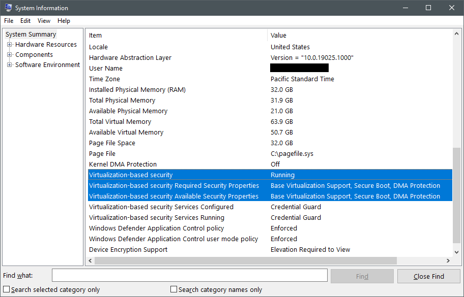

# Register computer with Host Guardian Service

[!INCLUDE [sqlserver2019-windows-only](../../../includes/applies-to-version/sqlserver2019-windows-only.md)]

This article describes how to register [!INCLUDE [ssnoversion-md](../../../includes/ssnoversion-md.md)] computers to attest with the Host Guardian Service (HGS).

> [!NOTE]
> The process of registering a [!INCLUDE [ssnoversion-md](../../../includes/ssnoversion-md.md)] with HGS requires a joint effort of the HGS administrator and the [!INCLUDE [ssnoversion-md](../../../includes/ssnoversion-md.md)] computer administrator. See [Roles and responsibilities when configuring attestation with HGS](always-encrypted-enclaves-host-guardian-service-plan.md#roles-and-responsibilities-when-configuring-attestation-with-hgs).

Before you start, make sure you've deployed at least one HGS computer and set up the HGS attestation service. For more information, see [Deploy the Host Guardian Service for [!INCLUDE [ssnoversion-md](../../../includes/ssnoversion-md.md)]](./always-encrypted-enclaves-host-guardian-service-deploy.md) for more information.

## Step 1: Install the attestation client components

> [!NOTE]
> This step should be performed by the [!INCLUDE [ssnoversion-md](../../../includes/ssnoversion-md.md)] computer administrator.

To allow a SQL client to verify it's talking to a trustworthy [!INCLUDE [ssnoversion-md](../../../includes/ssnoversion-md.md)] computer, the [!INCLUDE [ssnoversion-md](../../../includes/ssnoversion-md.md)] computer must successfully attest with the Host Guardian Service.
The attestation process is managed by an optional Windows component called the HGS Client.
The steps below will help you install this component and begin attesting.

1. Ensure the [!INCLUDE [ssnoversion-md](../../../includes/ssnoversion-md.md)] computer meets the [prerequisites outlined in the HGS planning doc](./always-encrypted-enclaves-host-guardian-service-plan.md#prerequisites).

2. Run the following command in an elevated PowerShell console to install the Host Guardian Hyper-V Support feature, which contains HGS Client and the attestation components.

    ```powershell
    Enable-WindowsOptionalFeature -Online -FeatureName HostGuardian -All
    ```

3. Restart to complete the installation.

## Step 2: Verify virtualization-based security is running

> [!NOTE]
> This step should be performed by the [!INCLUDE [ssnoversion-md](../../../includes/ssnoversion-md.md)] computer administrator.

When you install the Host Guardian Hyper-V Support feature, virtualization-based security (VBS) is automatically configured and enabled.
The enclaves for [!INCLUDE [ssnoversion-md](../../../includes/ssnoversion-md.md)] Always Encrypted are protected by and run inside the VBS environment.
VBS may not start if the computer doesn't have an IOMMU device installed and enabled.
To check if VBS is running, open the System Information tool by running `msinfo32.exe` and find the `Virtualization-based security` items towards the bottom of the System Summary.



The first item to check is `Virtualization-based security`, which can have the following three values:

- `Running` means VBS is configured correctly and was able to start successfully. If the computer shows this status, you can skip to Step 3.
- `Enabled but not running` means VBS is configured to run, but the hardware doesn't have the minimum security requirements to run VBS. You may need to change the configuration of the hardware in BIOS or UEFI to enable optional processor features like an IOMMU or, if the hardware truly doesn't support the required features, you may need to lower the VBS security requirements. Continue reading this section to learn more.
- `Not enabled` means VBS isn't configured to run. The Host Guardian Hyper-V Support feature automatically enables VBS, so it's recommended that you repeat step 1 if you see this status.

If VBS isn't running on the computer, check `Virtualization-based security` properties. Compare the values in the `Required Security Properties` item to the values in the `Available Security Properties` item.
The required properties must be equal to or a subset of the available security properties for VBS to run.

In the context of attesting [!INCLUDE [ssnoversion-md](../../../includes/ssnoversion-md.md)] enclaves, the security properties have the following importance:

- `Base virtualization support` is always required, as it represents the minimum hardware features needed to run a hypervisor.
- `Secure Boot` is recommended but not required for [!INCLUDE [ssnoversion-md](../../../includes/ssnoversion-md.md)] Always Encrypted. Secure Boot protects against rootkits by requiring a Microsoft-signed bootloader to run immediately after UEFI initialization completes. If you're using Trusted Platform Module (TPM) attestation, Secure Boot enablement will be measured and enforced regardless of whether VBS is configured to require Secure Boot.
- `DMA Protection` is recommended but not required for [!INCLUDE [ssnoversion-md](../../../includes/ssnoversion-md.md)] Always Encrypted. DMA protection uses an IOMMU to protect VBS and enclave memory from direct memory access attacks. In a production environment, you should always use computers with DMA protection. In a dev/test environment, it's okay to remove the requirement for DMA protection. If the [!INCLUDE [ssnoversion-md](../../../includes/ssnoversion-md.md)] instance is virtualized, you'll most likely not have DMA protection available and will need to remove the requirement for VBS to run. Review the [trust model](./always-encrypted-enclaves-host-guardian-service-plan.md#trust-model) for information about the lowered security assurances when running in a VM.

Before lowering the VBS required security features, check with your OEM or cloud service provider to confirm if there's a way to enable the missing platform requirements in UEFI or BIOS (for example, enabling Secure Boot, Intel VT-d or AMD IOV).

To change the required platform security features for VBS, run the following command in an elevated PowerShell console:

```powershell
# Value 0 = No security features required (use this for Azure VMs)
# Value 1 = Only Secure Boot is required
# Value 2 = Only DMA protection is required (default configuration)
# Value 3 = Both Secure Boot and DMA protection are required
Set-ItemProperty -Path HKLM:\SYSTEM\CurrentControlSet\Control\DeviceGuard -Name RequirePlatformSecurityFeatures -Value 0
```

After changing the registry, restart the [!INCLUDE [ssnoversion-md](../../../includes/ssnoversion-md.md)] computer and check if VBS is running again.

If the computer is managed by your company, Group Policy or Microsoft Endpoint Manager may override any changes you make to these registry keys after rebooting. Contact your IT help desk to see if they deploy policies that manage your VBS configuration.

## Step 3: Configure the attestation URL

> [!NOTE]
> This step should be performed by the [!INCLUDE [ssnoversion-md](../../../includes/ssnoversion-md.md)] computer administrator.

Next, you'll configure the [!INCLUDE [ssnoversion-md](../../../includes/ssnoversion-md.md)] computer with the URL for the HGS attestation service that you've obtained from the HGS administrator.

In an elevated PowerShell console, update and run the following command to configure the attestation URL.

- Replace `hgs.bastion.local` with the HGS cluster name
- You can run `Get-HgsServer` on any HGS computer to get the cluster name
- The attestation URL should always end with `/Attestation`
- SQL Server doesn't leverage the key protection features of HGS, so provide any dummy URL like `http://localhost` to `-KeyProtectionServerUrl`

```powershell
Set-HgsClientConfiguration -AttestationServerUrl "https://hgs.bastion.local/Attestation" -KeyProtectionServerUrl "http://localhost"
```

Unless you've registered this machine with HGS before, the command reports an attestation failure. This result is normal.

The `AttestationMode` field in the cmdlet output indicates which attestation mode HGS uses.

Proceed to [Step 4A](#step-4a-register-a-computer-in-tpm-mode) to register the computer in TPM mode or [Step 4B](#step-4b-register-a-computer-in-host-key-mode) to register the computer in host key mode.

## Step 4A: Register a computer in TPM mode

> [!NOTE]
> This step is performed jointly by the [!INCLUDE [ssnoversion-md](../../../includes/ssnoversion-md.md)] computer administrator and the HGS administrator. See the below notes for details.

### Prepare

> [!NOTE]
> This action should be performed by the [!INCLUDE [ssnoversion-md](../../../includes/ssnoversion-md.md)] computer administrator.

In this step, you collect information about the computer TPM state and register it with HGS.

If the HGS attestation service is configured to use the host key mode, skip to [Step 4B](#step-4b-register-a-computer-in-host-key-mode) instead.

Before you begin collecting TPM measurements, make sure you're working on a known-good configuration of the [!INCLUDE [ssnoversion-md](../../../includes/ssnoversion-md.md)] computer.
The computer should have all necessary hardware installed and the latest firmware and software updates applied.
HGS measures the computers against this baseline when they attest, so it's important to be in the most secure and intended state possible when collecting the TPM measurements.

There are three data files collected for TPM attestation, some of which can be reused if you have identically configured computers.

| Attestation artifact | What it measures | Uniqueness |
| -------------------- | ---------------- | ---------- |
| Platform identifier  | The public endorsement key in the computer's TPM and the endorsement key certificate from the TPM manufacturer. | 1 for each computer |
| TPM baseline | The platform control registers (PCRs) in the TPM that measure the firmware and OS configuration loaded during the boot process. Examples include Secure Boot state and whether crash dumps are encrypted. | One baseline per unique computer configuration (identical hardware and software can use the same baseline) |
| Code integrity policy | The [Windows Defender Application Control](/windows/security/threat-protection/windows-defender-application-control/windows-defender-application-control) policy you trust to protect the computers | One per unique CI policy deployed to the computers. |

You can configure more than one of each attestation artifact on HGS to support a mixed fleet of hardware and software.
HGS only requires that a computer attesting matches one policy from each policy category.
For example, if you have three TPM baselines registered on HGS, the computer measurements can match any one of those baselines to meet the policy requirement.

### Configure a code integrity policy

> [!NOTE]
> This below steps should be performed by the [!INCLUDE [ssnoversion-md](../../../includes/ssnoversion-md.md)] computer administrator.

HGS requires that every computer attesting in TPM mode has a Windows Defender Application Control (WDAC) policy applied.
WDAC code integrity policies restrict which software can run on a computer by checking each process that tries to execute code against a list of trusted publishers and file hashes.
For the [!INCLUDE [ssnoversion-md](../../../includes/ssnoversion-md.md)] use case, enclaves are protected by virtualization-based security and can't be modified from the host OS, so the strictness of the WDAC policy doesn't affect the security of encrypted queries.
As such, it's recommended that you deploy an audit-mode policy to the [!INCLUDE [ssnoversion-md](../../../includes/ssnoversion-md.md)] computers to meet the attestation requirement without imposing additional restrictions on the system.

If you're already using a custom WDAC code integrity policy on the computers to harden the OS configuration, you can skip to [Collect TPM attestation information](#collect-tpm-attestation-information).

1. There are pre-made example policies available on every Windows Server 2019, Windows 10 version 1809, and later operating system. The `AllowAll` policy allows any software to run on the computer without restrictions. Convert the policy to a binary form understood by the OS and HGS in order to use it. In an elevated PowerShell console, run the following commands to compile the `AllowAll` policy:

    ```powershell
    # We are changing the policy to disable enforcement and user mode code protection before compiling
    $temppolicy = "$HOME\Desktop\allowall_edited.xml"
    Copy-Item -Path "$env:SystemRoot\schemas\CodeIntegrity\ExamplePolicies\AllowAll.xml" -Destination $temppolicy
    Set-RuleOption -FilePath $temppolicy -Option 0 -Delete
    Set-RuleOption -FilePath $temppolicy -Option 3

    ConvertFrom-CIPolicy -XmlFilePath $temppolicy -BinaryFilePath "$HOME\Desktop\allowall_cipolicy.bin"
    ```

2. Follow the guidance in the [Windows Defender Application Control deployment guide](/windows/security/threat-protection/windows-defender-application-control/windows-defender-application-control-deployment-guide) to deploy the `allowall_cipolicy.bin` file to the [!INCLUDE [ssnoversion-md](../../../includes/ssnoversion-md.md)] computers using [Group Policy](/windows/security/threat-protection/windows-defender-application-control/deploy-windows-defender-application-control-policies-using-group-policy). For workgroup computers, follow the same process using the Local Group Policy Editor (`gpedit.msc`).

3. Run `gpupdate /force` on the [!INCLUDE [ssnoversion-md](../../../includes/ssnoversion-md.md)] computers to configure the new code integrity policy, then restart the computers to apply the policy.

### Collect TPM attestation information

> [!NOTE]
> This below steps should be performed by the [!INCLUDE [ssnoversion-md](../../../includes/ssnoversion-md.md)] computer administrator.

Repeat the following steps for each [!INCLUDE [ssnoversion-md](../../../includes/ssnoversion-md.md)] computer that will be attesting with HGS:

1. With the computer in a known-good state, run the following commands in PowerShell to collect the TPM attestation information:

    ```powershell
    # Collects the TPM EKpub and EKcert
    $name = $env:computername
    $path = "$HOME\Desktop"
    (Get-PlatformIdentifier -Name $name).Save("$path\$name-EK.xml")

    # Collects the TPM baseline (current PCR values)
    Get-HgsAttestationBaselinePolicy -Path "$path\$name.tcglog" -SkipValidation

    # Collects the applied CI policy, if one exists
    Copy-Item -Path "$env:SystemRoot\System32\CodeIntegrity\SIPolicy.p7b" -Destination "$path\$name-CIpolicy.bin"
    ```

2. Share the three attestation files with the HGS administrator. 

### Register the SQL Server computer with HGS

> [!NOTE]
> This below steps should be performed by the HGS administrator.

Repeat the following steps for each [!INCLUDE [ssnoversion-md](../../../includes/ssnoversion-md.md)] computer that will be attesting with HGS:

1. Copy the attestation files, you obtained from [!INCLUDE [ssnoversion-md](../../../includes/ssnoversion-md.md)] computer administrator to the HGS server. 
2. On the HGS server, run the following commands in an elevated PowerShell console to register the [!INCLUDE [ssnoversion-md](../../../includes/ssnoversion-md.md)] computer:

    ```powershell
    # TIP: REMEMBER TO CHANGE THE FILENAMES
    # Registers the unique TPM with HGS (required for every computer)
    Add-HgsAttestationTpmHost -Path "C:\temp\SQL01-EK.xml"

    # Registers the TPM baseline (required ONCE for each unique hardware and software configuration)
    Add-HgsAttestationTpmPolicy -Name "MyHWSoftwareConfig" -Path "C:\temp\SQL01.tcglog"

    # Registers the CI policy (required ONCE for each unique CI policy)
    Add-HgsAttestationCiPolicy -Name "AllowAll" -Path "C:\temp\SQL01-CIpolicy.bin"
    ```

    > [!TIP]
    > If you encounter an error trying to register the unique TPM identifier, make sure you [imported the TPM intermediate and root certificates](./always-encrypted-enclaves-host-guardian-service-deploy.md#switch-to-tpm-attestation) on the HGS computer you're using.

In addition to the platform identifier, TPM baseline, and code integrity policy, there are built-in policies configured and enforced by HGS that you may need to change.
These built-in policies are measured from the TPM baseline you collect from the server and represent various security settings that should be enabled to protect the computer.
If you have any computers that don't have an IOMMU present to protect against DMA attacks (for example, a VM), you'll need to disable the IOMMU policy.

To disable the IOMMU requirement, run the following command on the HGS server:

```powershell
Disable-HgsAttestationPolicy Hgs_IommuEnabled
```

> [!NOTE]
> If you disable the IOMMU policy, IOMMUs will not be required for any computer attesting with HGS.
> It is not possible to disable the IOMMU policy for just a single computer.

You can review the list of registered TPM hosts and policies with the following PowerShell commands:

```powershell
Get-HgsAttestationTpmHost
Get-HgsAttestationTpmPolicy
```

## Step 4B: Register a computer in host key mode

> [!NOTE]
> This step is performed jointly by the [!INCLUDE [ssnoversion-md](../../../includes/ssnoversion-md.md)] computer administrator and the HGS administrator. See the below notes for details.

This step will walk you through the process to generate a unique key for the host and register it with HGS.
If the HGS attestation service is configured to use TPM mode, follow the guidance in [Step 4A](#step-4a-register-a-computer-in-tpm-mode) instead.

### Generate a key for a [!INCLUDE [ssnoversion-md](../../../includes/ssnoversion-md.md)] computer

> [!NOTE]
> This part should be performed jointly by the [!INCLUDE [ssnoversion-md](../../../includes/ssnoversion-md.md)] computer administrator.

Host key attestation works by generating an asymmetric key pair on the [!INCLUDE [ssnoversion-md](../../../includes/ssnoversion-md.md)] computer and providing HGS with the public half of that key.

Repeat the following steps for each [!INCLUDE [ssnoversion-md](../../../includes/ssnoversion-md.md)] computer that will be attesting with HGS:

1. To generate the key pair, run the following command in an elevated PowerShell console:

    ```powershell
    Set-HgsClientHostKey
    Get-HgsClientHostKey -Path "$HOME\Desktop\$env:computername-key.cer"
    ```

    If you've already created a host key and want to generate a new key pair, use the following commands instead:

    ```powershell
    Remove-HgsClientHostKey
    Set-HgsClientHostKey
    Get-HgsClientHostKey -Path "$HOME\Desktop\$env:computername-key.cer"
    ```

2. Share the certificate file with the HGS administrator.

### Register the SQL Server computer with HGS

> [!NOTE]
> This below steps should be performed by the HGS administrator.

Repeat the following steps for each [!INCLUDE [ssnoversion-md](../../../includes/ssnoversion-md.md)] computer that will be attesting with HGS:

1. Copy the certificate file, you obtained from the [!INCLUDE [ssnoversion-md](../../../includes/ssnoversion-md.md)] computer administrator, to an HGS server.
2. Run the following command in an elevated PowerShell console to register the [!INCLUDE [ssnoversion-md](../../../includes/ssnoversion-md.md)] computer:

    ```powershell
    Add-HgsAttestationHostKey -Name "YourComputerName" -Path "C:\temp\yourcomputername.cer"
   ```

## Step 5: Confirm the host can attest successfully

> [!NOTE]
> This step should be performed by the [!INCLUDE [ssnoversion-md](../../../includes/ssnoversion-md.md)] computer administrator.

After you've registered the [!INCLUDE [ssnoversion-md](../../../includes/ssnoversion-md.md)] computer with HGS ([Step 4A](#step-4a-register-a-computer-in-tpm-mode) for TPM mode, [Step 4B](#step-4b-register-a-computer-in-host-key-mode) for host key mode), you should confirm it's able to successfully attest.

You can check the configuration of the HGS attestation client and perform an attestation attempt at any time with [Get-HgsClientConfiguration](/powershell/module/hgsclient/get-hgsclientconfiguration?view=win10-ps&preserve-view=true).

The output of the command will look similar to below:

```
PS C:\> Get-HgsClientConfiguration


IsHostGuarded                  : True
Mode                           : HostGuardianService
KeyProtectionServerUrl         : http://localhost
AttestationServerUrl           : http://hgs.bastion.local/Attestation
AttestationOperationMode       : HostKey
AttestationStatus              : Passed
AttestationSubstatus           : NoInformation
FallbackKeyProtectionServerUrl :
FallbackAttestationServerUrl   :
IsFallbackInUse                : False
```

The two most important fields in the output are `AttestationStatus`, which tells you if the computer passed attestation, and `AttestationSubStatus`, which explains which policies the computer failed if the computer failed attestation.

The most common values that may appear in `AttestationStatus` are explained below:

| `AttestationStatus` | Explanation |
| ----------------- | ----------- |
| Expired | The host passed attestation previously, but the health certificate it was issued has expired. Ensure the host and HGS time are in sync. |
| `InsecureHostConfiguration` | The computer didn't meet one or more of the attestation policies configured on the HGS server. For more information, see `AttestationSubStatus`. |
| NotConfigured | The computer isn't configured with an attestation URL. [Configure the attestation URL](#step-3-configure-the-attestation-url) |
| Passed | The computer passed attestation and is trusted to run [!INCLUDE [ssnoversion-md](../../../includes/ssnoversion-md.md)] enclaves. |
| `TransientError` | The attestation attempt failed due to a temporary error. This error usually means there was an issue contacting HGS over the network. Check the network connection and ensure the computer can resolve and route to the HGS service name. |
| `TpmError` | The computer's TPM device reported an error during the attestation attempt. Check the TPM logs for more information. Clearing the TPM may resolve the issue, but take care to suspend BitLocker and other services that rely on the TPM before clearing the TPM. |
| `UnauthorizedHost` | The host key isn't known to HGS. Follow the instructions in [Step 4B](#step-4b-register-a-computer-in-host-key-mode) to register the computer with HGS. |

When the `AttestationStatus` shows `InsecureHostConfiguration`, the `AttestationSubStatus` field will be populated with one or more policy names that failed.
The table below explains the most common values and how to remediate the errors.

| AttestationSubStatus | What it means and what to do |
| -------------------- | ---------------------------- |
| CodeIntegrityPolicy | The code integrity policy on the computer isn't registered with HGS *or* the computer isn't currently using a code integrity policy. See [Configure a code integrity policy](#configure-a-code-integrity-policy) for guidance. |
| DumpsEnabled | The computer is configured to allow crash dumps, but the Hgs_DumpsEnabled policy disallows dumps. Disable dumps on this computer or disable the Hgs_DumpsEnabled policy to continue. |
| FullBoot | The computer resumed from a sleep state or hibernation, resulting in changes to the TPM measurements. Restart the computer to generate clean TPM measurements. |
| HibernationEnabled | The computer is configured to allow hibernation with unencrypted hibernation files. Disable hibernation on the computer to resolve this issue. |
| HypervisorEnforcedCodeIntegrityPolicy | The computer isn't configured to use a code integrity policy. Check the Group Policy or Local Group Policy > Computer Configuration > Administrative Templates > System > Device Guard > Turn on Virtualization Based Security > Virtualization Based Protection of Code Integrity. This policy item should be "Enabled without UEFI lock". |
| Iommu | This computer doesn't have an IOMMU device enabled. If it's a physical computer, enable the IOMMU in the UEFI configuration menu. If it's a virtual machine and an IOMMU isn't available, run `Disable-HgsAttestationPolicy Hgs_IommuEnabled` on the HGS server. |
| SecureBoot | Secure Boot isn't enabled on this computer. Enable Secure Boot in the UEFI configuration menu to resolve this error. |
| VirtualSecureMode | Virtualization-based security isn't running on this computer. Follow the guidance in [Step 2: Verify VBS is running on the computer](#step-2-verify-virtualization-based-security-is-running). |

## Next steps

- [Configure the secure enclave in SQL Server](always-encrypted-enclaves-configure-enclave-type.md)
