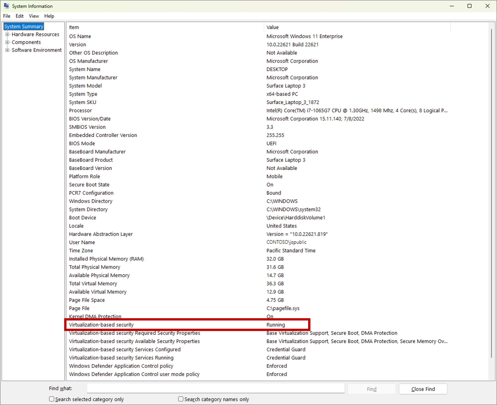

# Plan for Always Encrypted with secure enclaves in SQL Server without attestation

[!INCLUDE [sqlserver2019-windows-only](../../../includes/applies-to-version/sqlserver2019-windows-only.md)]

Setting up [Always Encrypted with secure enclaves](always-encrypted-enclaves.md) in [!INCLUDE [ssnoversion-md](../../../includes/ssnoversion-md.md)] without attestation provides an easy way to start with the feature, which we recommended for proof of concepts, development, and testing. However, when you use secure enclaves in a production environment, keep in mind the level of protection against OS administrators is reduced without attestation. For example, if a malicious OS admin tampered with the [!INCLUDE [ssnoversion-md](../../../includes/ssnoversion-md.md)] library running inside the enclave, a client application would be unable to detect it. If you're concerned about such attacks, consider setting up attestation with Host Guardian Service - see [Plan for Host Guardian Service attestation](always-encrypted-enclaves-host-guardian-service-plan.md).

In [!INCLUDE [ssnoversion-md](../../../includes/ssnoversion-md.md)], Always Encrypted with secure enclaves uses [virtualization-based Security (VBS) enclaves](https://www.microsoft.com/security/blog/2018/06/05/virtualization-based-security-vbs-memory-enclaves-data-protection-through-isolation/) (also known as Virtual Secure Mode, or VSM enclaves) - a software-based technology that relies on Windows hypervisor and doesn't require any special hardware.

> [!NOTE]
> When [ssnoversion-md](../../../includes/ssnoversion-md.md)] is deployed in a VM, VBS enclaves help protect your data from attacks inside the VM. However, they do not provide any protection from attacks using privileged system accounts originating from the host. For example, a memory dump of the VM generated on the host machine may contain the memory of the enclave.

## Prerequisites

### [!INCLUDE [ssnoversion-md](../../../includes/ssnoversion-md.md)] computer prerequisites

The computer(s) running [!INCLUDE [ssnoversion-md](../../../includes/ssnoversion-md.md)] must meet both the [Requirements for Installing SQL Server](../../../sql-server/install/hardware-and-software-requirements-for-installing-sql-server.md) and the [Hyper-V hardware requirements](/virtualization/hyper-v-on-windows/reference/hyper-v-requirements#hardware-requirements).

These requirements include:

- [!INCLUDE [sssql19-md](../../../includes/sssql19-md.md)] or later
- Windows 10 or later or Windows Server 2019 or later.
- CPU support for virtualization technologies:

  - Intel VT-x with Extended Page Tables.
  - AMD-V with Rapid Virtualization Indexing.
  - If you're running [!INCLUDE [ssnoversion-md](../../../includes/ssnoversion-md.md)] in a VM:
    - In Azure, use a [Generation 2 VM size](/azure/virtual-machines/generation-2#generation-2-vm-sizes) (recommended) or use a Generation 1 VM size with nested virtualization enabled. Check the [individual VM sizes documentation](/azure/virtual-machines/sizes) to determine which Generation 1 VM sizes support nested virtualization.
    - On Hyper-V 2016 or later (outside of Azure), make sure your VM is a Generation 2 VM (recommended) or it's a Generation 1 VM with nested virtualization enabled. For more information, see [Should I create a generation 1 or 2 virtual machine in Hyper-V?](/windows-server/virtualization/hyper-v/plan/should-i-create-a-generation-1-or-2-virtual-machine-in-hyper-v) and [Configure nested virtualization](/virtualization/hyper-v-on-windows/user-guide/nested-virtualization#configure-nested-virtualization).
    - On VMware vSphere 6.7 or later, enable virtualization-based security support for the VM as described in the [VMware documentation](https://docs.vmware.com/en/VMware-vSphere/6.7/com.vmware.vsphere.vm_admin.doc/GUID-C2E78F3E-9DE2-44DB-9B0A-11440800AADD.html).
    - Other hypervisors and public clouds may support nested virtualization capabilities that enable Always Encrypted with VBS Enclaves as well. Check your virtualization solution's documentation for compatibility and configuration instructions.

- Virtualization-based security (VBS) must be enabled and running.
  - To check the status of VBS, sign in to your [!INCLUDE [ssnoversion-md](../../../includes/ssnoversion-md.md)] computer as an administrator, open an elevated Windows PowerShell console, and run msinfo32.exe. 

    

  - For instructions on how to enable VBS, see [Enable virtualization-based protection of code integrity](https://learn.microsoft.com/windows/security/threat-protection/device-guard/enable-virtualization-based-protection-of-code-integrity).

### Tooling requirements

- [SQL Server Management Studio (SSMS) 19 or later](../../ssms/download-sql-server-management-studio-ssms.md).

### Client driver requirements

For information about client driver versions that support using secure enclaves without attestation, see [Develop applications using Always Encrypted with secure enclaves](always-encrypted-enclaves-client-development.md).

## Next steps

- Once you've made sure your environment meets the above prerequisites, see [Configure the secure enclave in SQL Server](always-encrypted-enclaves-configure-enclave-type.md).
