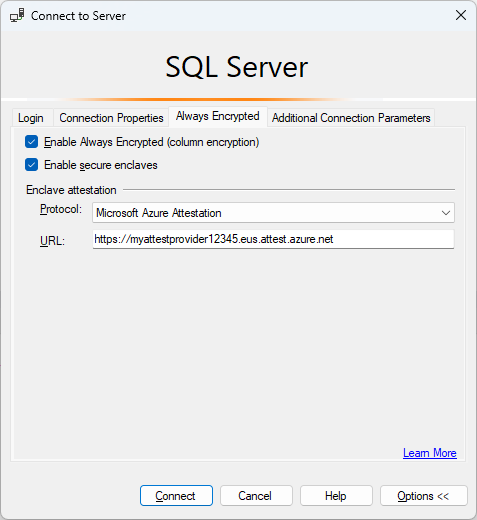
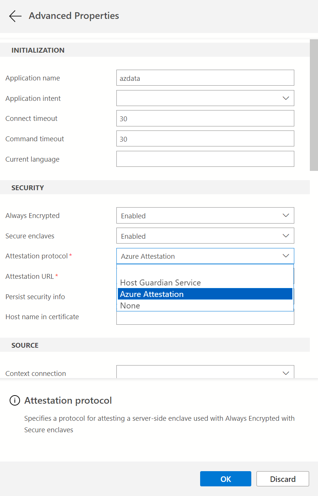

# Run Transact-SQL statements using secure enclaves

[!INCLUDE [sqlserver2019-windows-only-asdb](../../../includes/applies-to-version/sqlserver2019-windows-only-asdb.md)]

[Always Encrypted with secure enclaves](always-encrypted-enclaves.md) allows some Transact-SQL (T-SQL) statements to perform confidential computations on encrypted database columns in a server-side secure enclave.

## Statements using secure enclaves

The following types of T-SQL statement utilize secure enclaves.

### DDL statements using secure enclaves

The following types of [Data Definition Language (DDL)](../../../t-sql/statements/statements.md#data-definition-language) statements require secure enclaves.

- [ALTER TABLE column_definition (Transact-SQL)](../../../t-sql/statements/alter-table-column-definition-transact-sql.md) statements that trigger in-place cryptographic operations using enclave-enabled keys. For more information, see [Configure column encryption in-place using Always Encrypted with secure enclaves](always-encrypted-enclaves-configure-encryption.md).
- [CREATE INDEX (Transact-SQL)](../../../t-sql/statements/create-index-transact-sql.md) and [ALTER INDEX (Transact-SQL)](../../../t-sql/statements/alter-index-transact-sql.md) statements that create or alter indexes on enclave-enabled columns using randomized encryption. For more information, see [Create and use indexes on columns using Always Encrypted with secure enclaves](always-encrypted-enclaves-create-use-indexes.md).
  
### DML statements using secure enclaves

The following [Data Manipulation Language (DML)](../../../t-sql/statements/statements.md#data-manipulation-language) statements or queries against enclave-enabled columns using randomized encryption require secure enclaves:

- Queries that use one or more of the following Transact-SQL operators supported inside secure enclaves:
  - [Comparison Operators](../../../mdx/comparison-operators.md)
  - [BETWEEN (Transact-SQL)](../../../t-sql/language-elements/between-transact-sql.md)
  - [IN (Transact-SQL)](../../../t-sql/language-elements/in-transact-sql.md)
  - [LIKE (Transact-SQL)](../../../t-sql/language-elements/like-transact-sql.md)
  - [DISTINCT](../../../t-sql/queries/select-transact-sql.md#c-using-distinct-with-select)
  - [Joins](../../performance/joins.md) - [!INCLUDE[sql-server-2019](../../../includes/sssql19-md.md)] supports only nested loop joins. [!INCLUDE [sssql22-md](../../../includes/sssql22-md.md)] and [!INCLUDE[ssSDSfull](../../../includes/sssdsfull-md.md)] supports nested loop, hash, and merge joins
  - [SELECT - ORDER BY Clause (Transact-SQL)](../../../t-sql/queries/select-order-by-clause-transact-sql.md). Supported in [!INCLUDE [sssql22-md](../../../includes/sssql22-md.md)] and Azure SQL Database. Not supported in [!INCLUDE[sql-server-2019](../../../includes/sssql19-md.md)]
  - [SELECT - GROUP BY Clause (Transact-SQL)](../../../t-sql/queries/select-group-by-transact-sql.md). Supported in [!INCLUDE [sssql22-md](../../../includes/sssql22-md.md)] and Azure SQL Database. Not supported in [!INCLUDE[sql-server-2019](../../../includes/sssql19-md.md)]
- Queries that insert, update, or delete rows, which in turn triggers inserting and/or removing an index key to/from an index on an enclave-enabled column. For more information, see [Create and use indexes on columns using Always Encrypted with secure enclaves](always-encrypted-enclaves-create-use-indexes.md).

> [!NOTE]
> Operations on indexes and confidential DML queries using enclaves are only supported on enclave-enabled columns that use randomized encryption. Deterministic encryption is not supported.

> [!NOTE]
> In [!INCLUDE[ssSDSfull](../../../includes/sssdsfull-md.md)] and in [!INCLUDE[sql-server-2022](../../../includes/sssql22-md.md)], confidential queries using enclaves on a character string column (`char`, `nchar`) require the column uses a [binary-code point (_BIN2) collation or a UTF-8 collation](../../../relational-databases/collations/collation-and-unicode-support.md). In [!INCLUDE[sql-server-2019](../../../includes/sssql19-md.md)], a_BIN2 collation is required. 

### DBCC commands using secure enclaves

[DBCC (Transact-SQL)](../../../t-sql/database-console-commands/dbcc-transact-sql.md) administrative commands that involve checking the integrity of indexes may also require secure enclaves, if the database contains indexes on enclave-enabled columns using randomized encryption. For example, [DBCC CHECKDB (Transact-SQL)](../../../t-sql/database-console-commands/dbcc-checkdb-transact-sql.md) and [DBCC CHECKTABLE (Transact-SQL)](../../../t-sql/database-console-commands/dbcc-checktable-transact-sql.md).

## Prerequisites for running statements using secure enclaves

Your environment needs to meet the following requirements to support executing statements that use a secure enclave.

- Your [!INCLUDE [ssnoversion-md](../../../includes/ssnoversion-md.md)] instance or your database and server in [!INCLUDE[ssSDSfull](../../../includes/sssdsfull-md.md)] must be correctly configured to support enclaves and attestation. For more information, see [Set up the secure enclave and attestation](configure-always-encrypted-enclaves.md#set-up-the-secure-enclave-and-attestation).
- You need to obtain an attestation URL from your environment from your attestation service administrator.

  - If you're using [!INCLUDE [ssnoversion-md](../../../includes/ssnoversion-md.md)] and Host Guardian Service (HGS), see [Determine and share the HGS attestation URL](always-encrypted-enclaves-host-guardian-service-deploy.md#step-6-determine-and-share-the-hgs-attestation-url).
  - If you're using [!INCLUDE[ssSDSfull](../../../includes/sssdsfull-md.md)] and Microsoft Azure Attestation, see [Determine the attestation URL for your attestation policy](./always-encrypted-enclaves.md#secure-enclave-attestation).

- If you're connecting to your database using your application, it must use a client driver that supports Always Encrypted with secure enclaves. The application must connect to the database with Always Encrypted enabled for the database connection and the attestation protocol and the attestation URL properly configured. For detailed information, see [Develop applications using Always Encrypted with secure enclaves](always-encrypted-enclaves-client-development.md).
- If you're using SQL Server Management Studio (SSMS) or Azure SQL Data Studio, you need to enable Always Encrypted and configure the attestation protocol and the attestation URL when connecting to your database. See the following sections for details.

> [!NOTE]
> Connecting to the database with Always Encrypted and attestation configured is not required for the following operations if you are using cached column encryption keys: DDL queries that create or alter indexes, DML queries that update indexes, and DBCC commands that check index integrity. For more information, see [Invoke indexing operations using cached column encryption keys](always-encrypted-enclaves-create-use-indexes.md#invoke-indexing-operations-using-cached-column-encryption-keys).

### Prerequisites for running T-SQL statements using enclaves in SSMS

Minimum version requirements for SQL Server Management Studio:

- SSMS 18.3 when using [!INCLUDE[ssNoVersion](../../../includes/ssnoversion-md.md)].
- SSMS 18.8 when using [!INCLUDE[ssSDSfull](../../../includes/sssdsfull-md.md)].

Make sure you run your statements from a query window that uses a connection that has Always Encrypted and attestation parameters correctly configured.

1. In the **Connect to Server** dialog, specify your server name, select an authentication method, and specify your credentials.
2. Click **Options >>** and select the **Connection Properties** tab. Specify your database name.
3. Select the **Always Encrypted** tab.
4. Select **Enable Always Encrypted (column encryption)**.
5. (This step applies to SSMS 19 or later.) Select **Enable secure enclaves**.
6. (This step applies to SSMS 19 or later.) Set **Protocol** to **Host Guardian Service** (if you're using  [!INCLUDE [ssnoversion-md](../../../includes/ssnoversion-md.md)]) or **Microsoft Azure Attestation** (if you're using a DC-series database with Intel SGX in [!INCLUDE[ssSDSfull](../../../includes/sssdsfull-md.md)]). 
7. Specify your enclave attestation URL. For example, `https://hgs.bastion.local/Attestation` or `https://contososqlattestation.uks.attest.azure.net/attest/SgxEnclave`.

    

8. Select **Connect**.
9. If you're prompted to enable Parameterization for Always Encrypted queries, select **Enable**.

For additional information, see [Enabling and disabling Always Encrypted for a database connection](always-encrypted-query-columns-ssms.md#en-dis).

### Prerequisites for running T-SQL statements using enclaves in Azure Data Studio

The minimum recommended version **1.23** or higher is recommended.

Make sure you run your statements from a query window that uses a connection that has Always Encrypted enabled and both the correct attestation protocol and the attestation URL configured.

1. In the **Connection** dialog, click **Advanced...**.
2. To enable Always Encrypted for the connection, set the **Always Encrypted** field to **Enabled**.
3. Specify the attestation protocol and the attestation URL.
    - If you're using [!INCLUDE[ssNoVersion](../../../includes/ssnoversion-md.md)] set **Attestation Protocol** to **Host Guardian Service** and enter your Host Guardian Service attestation URL in the **Enclave Attestation URL** field.
    - If you're using if you're using a DC-series database with Intel SGX in [!INCLUDE[ssSDSfull](../../../includes/sssdsfull-md.md)], set **Attestation Protocol** to **Azure Attestation** and enter the attestation URL referencing your policy in Microsoft Azure Attestation in the **Enclave Attestation URL** field.

    

4. Click **OK** to close **Advanced Properties**.

For additional information, see [Enabling and disabling Always Encrypted for a database connection](always-encrypted-query-columns-ads.md#enabling-and-disabling-always-encrypted-for-a-database-connection).

If you plan to run parameterized DML queries, you also need to enable [Parameterization for Always Encrypted](always-encrypted-query-columns-ads.md#parameterization-for-always-encrypted).

## Examples

This section includes examples of DML queries using enclaves. 

The examples use the below schema.

```sql
CREATE SCHEMA [HR];
GO

CREATE TABLE [HR].[Jobs](
 [JobID] [int] IDENTITY(1,1) PRIMARY KEY,
 [JobTitle] [nvarchar](50) NOT NULL,
 [MinSalary] [money] ENCRYPTED WITH (COLUMN_ENCRYPTION_KEY = [CEK1], ENCRYPTION_TYPE = Randomized, ALGORITHM = 'AEAD_AES_256_CBC_HMAC_SHA_256') NOT NULL,
 [MaxSalary] [money] ENCRYPTED WITH (COLUMN_ENCRYPTION_KEY = [CEK1], ENCRYPTION_TYPE = Randomized, ALGORITHM = 'AEAD_AES_256_CBC_HMAC_SHA_256') NOT NULL
);
GO

CREATE TABLE [HR].[Employees](
 [EmployeeID] [int] IDENTITY(1,1) PRIMARY KEY,
 [SSN] [char](11) ENCRYPTED WITH (COLUMN_ENCRYPTION_KEY = [CEK1], ENCRYPTION_TYPE = Randomized, ALGORITHM = 'AEAD_AES_256_CBC_HMAC_SHA_256') NOT NULL,
 [FirstName] [nvarchar](50) NOT NULL,
 [LastName] [nvarchar](50) NOT NULL,
 [Salary] [money] ENCRYPTED WITH (COLUMN_ENCRYPTION_KEY = [CEK1], ENCRYPTION_TYPE = Randomized, ALGORITHM = 'AEAD_AES_256_CBC_HMAC_SHA_256') NOT NULL,
 [JobID] [int] NULL,
 FOREIGN KEY (JobID) REFERENCES [HR].[Jobs] (JobID)
);
GO
```

### Exact match search

The below query performs an exact match search on the encrypted `SSN` string column.

```sql
DECLARE @SSN char(11) = '795-73-9838';
SELECT * FROM [HR].[Employees] WHERE [SSN] = @SSN;
GO
```

### Pattern matching search

The below query performs a pattern matching search on the encrypted `SSN` string column, searching for employees with the specified last for digits of a social security number.

```sql
DECLARE @SSN char(11) = '795-73-9838';
SELECT * FROM [HR].[Employees] WHERE [SSN] = @SSN;
GO
```

### Range comparison

The below query performs a range comparison on the encrypted  `Salary`  column, searching for employees with salaries within the specified range.

```sql
DECLARE @MinSalary money = 40000;
DECLARE @MaxSalary money = 45000;
SELECT * FROM [HR].[Employees] WHERE [Salary] > @MinSalary AND [Salary] < @MaxSalary;
GO
```

### Joins

The below query performs a join between `Employees` and `Jobs` tables using the encrypted `Salary` column. The query retrieves employees with salaries outside of a salary range for employee's job.

```sql
SELECT * FROM [HR].[Employees] e
JOIN [HR].[Jobs] j
ON e.[JobID] = j.[JobID] AND e.[Salary] > j.[MaxSalary] OR e.[Salary] < j.[MinSalary];
GO
```

### Sorting

The below query sorts employee records based on the encrypted `Salary` column, retrieving 10 employees with the highest salaries.
> [!NOTE]
> Sorting encrypted columns is supported in [!INCLUDE [sssql22-md](../../../includes/sssql22-md.md)] and Azure SQL Database, but not in [!INCLUDE[sql-server-2019](../../../includes/sssql19-md.md)].

```sql
SELECT TOP(10) * FROM [HR].[Employees]
ORDER BY [Salary] DESC;
GO
```

## Next Steps

- [Develop applications using Always Encrypted with secure enclaves](always-encrypted-enclaves-client-development.md)

## See also

- [Troubleshoot common issues for Always Encrypted with secure enclaves](always-encrypted-enclaves-troubleshooting.md)
- [Tutorial: Getting started with Always Encrypted with secure enclaves in SQL Server](../tutorial-getting-started-with-always-encrypted-enclaves.md)
- [Tutorial: Getting started with Always Encrypted with secure enclaves in Azure SQL Database](/azure/azure-sql/database/always-encrypted-enclaves-getting-started)
- [Configure column encryption in-place using Always Encrypted with secure enclaves](always-encrypted-enclaves-configure-encryption.md)
- [Create and use indexes on columns using Always Encrypted with secure enclaves](always-encrypted-enclaves-create-use-indexes.md)
