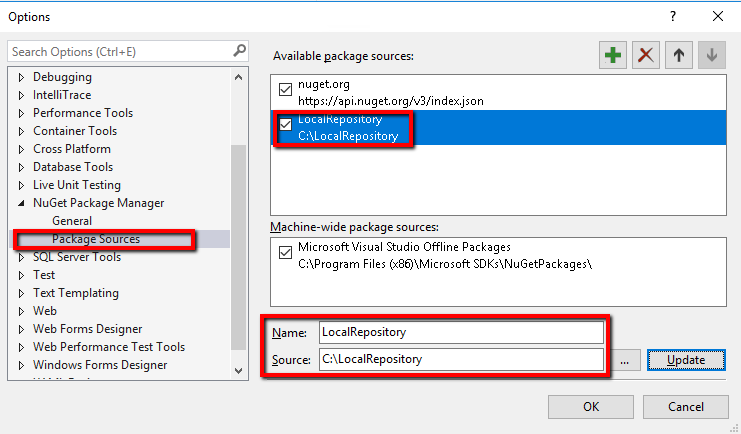
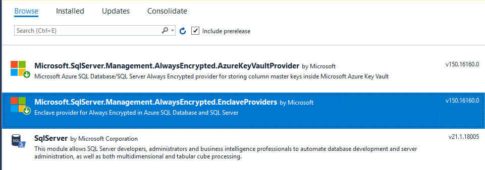

# Introducing Always Encrypted with Secure enclaves

Always Encrypted with secure enclaves extends the existing Always
Encrypted feature to enable richer functionality on sensitive data,
while keeping the data confidential.

Introduced in SQL Server 2016, Always Encrypted is an encryption
technology that protects the confidentiality of sensitive data from
malware and high-privileged, but unauthorized users of SQL Server,
including DBAs, computer admins, and cloud admins. Until now, Always
Encrypted protected the data by encrypting it on the client side and
never allowing the data or the corresponding cryptographic keys to
appear in plaintext inside the SQL Server Engine. As a result, the
functionality on encrypted database columns inside the database was
severely restricted: the only operation SQL Server could perform on
encrypted data was equality comparison (and it was only available with
deterministic encryption). All other operations, including cryptographic
operations, such as initial data encryption or key rotation, or rich
computations, such as pattern matching, were not supported inside the
database. Customers needed to move the data outside of the database and
perform such operations on the client-side.

Always Encrypted with secure enclaves addresses the preceding limitations by
allowing computations on plaintext data inside a secure enclave on the
server side. A secure enclave is a protected region of memory within the
SQL Server process, and it acts as a trusted execution environment for
processing sensitive data inside the SQL Server Engine. A secure enclave
appears as a black box to the rest of the SQL Server process and other
processes on the hosting machine. There is no way to view the data or
the code inside the enclave from the outside, even with a debugger.

The way Always Encrypted in SQL Server v.Next uses secure enclaves is
illustrated on the following diagram:

When parsing an application’s query, the SQL Server Engine determines if
the query contains any operations on encrypted data that require the use
of the secure enclave. If so, the client driver sends the column
encryption keys, required for the operations, to the secure enclave over
a secure channel. Then, the client driver submits the query for
execution, along with the encrypted query parameters. When processing
the query, the SQL Server Engine delegates cryptographic operations or
other computations on encrypted columns to the secure enclave. If
needed, the secure enclave decrypts the query parameters or/and the
data, stored in encrypted columns, and perform the requested operations.

During query processing, the data or the column
encryption keys are not exposed in plaintext in the SQL Server Engine
outside of the secure enclaves.


With secure enclaves, Always Encrypted can protect the confidentiality
of sensitive data while providing the following benefits:

  - In-place encryption – cryptographic operations on sensitive data,
    for example: initial data encryption or rotating a column encryption
    key, are performed inside the secure enclave and do not require
    moving the data outside of the database. You can issue in-place
    encryption using the ALTER TABLE Transact-SQL statement, and you do
    not need to use tools, such as the Always Encrypted wizard in SSMS
    or the Set-SqlColumnEncryption PowerShell cmdlet.

  - Rich computations – operations on encrypted columns, including
    pattern matching (the LIKE predicate) and range comparisons, are
    supported inside the secure enclave, which unlocks Always Encrypted
    to a broad range of applications and scenarios that require such
    computations to be performed inside the database system.

In the current stage of the Community Technology Preview (CTP) of SQL
Server v.Next, Always Encrypted with secure enclaves uses
Virtualization-Based security (VBS) secure memory enclaves (also known
as Virtual Secure Mode, or VSM, enclaves) in Windows.

## Key Concepts

## Secure Enclave Attestation

The secure enclave inside the SQL Server Engine can access both the
sensitive data, stored in encrypted database columns, and the
corresponding column encryption keys in plaintext. Therefore, before you
or your application submits a query that involves enclave computations
to SQL Server, the client driver inside the application must verify the
secure enclave is a genuine enclave based on a given technology (for example,
VBS) and the code running inside the enclave has been signed for running
inside the enclave. The process of verifying the enclave is called
**enclave attestation**, and it usually involves a client driver within
the application (and sometimes also SQL Server) contacting an external
attestation service. The specifics of the attestation process depend on
the enclave technology and the attestation service.

The attestation process, SQL Server supports for VBS secure enclaves in
SQL Server v.Next CTP is Windows Defender System Guard runtime
attestation, which uses Host Guardian Service (HGS) as an attestation
service. You need to configure HGS in your environment and register the
machine hosting your SQL Server instance in HGS. You also must configure
you client applications or tools (for example, SQL Server Management Studio)
with an HGS attestation.

## Secure Enclave Providers

To use Always Encrypted with secure enclaves, an application must use a
client driver that supports the feature. In this stage of the CTP, your
applications must use .NET Framework 4.7.2 and .NET Framework Data
Provider for SQL Server. In addition, .NET applications must be
configured with a **secure enclave provider** specific to the enclave
type (for example, VBS) and the attestation service (for example, HGS), you are using.
The supported enclave providers are shipped separately in a NuGet
package, which you need to integrate with your application. An enclave
provider implements the client-side logic for the attestation protocol
and for establishing a secure channel with a secure enclave of a given
type.

## Enclave-enabled Keys

Always Encrypted with secure enclaves introduces the concept of
enclave-enabled keys:

  - Enclave-enabled column master key – a column master key that has the
    ENCLAVE\_COMPUTATIONS property specified in the column master key
    metadata object inside the database. The column master key metadata
    object must also contain a valid signature of the metadata
    properties.

  - Enclave-enabled column encryption key – a column encryption key that
    is encrypted with an enclave-enabled column master key.

When the SQL Server Engine determines operations, specified in a query,
need to be performed inside the secure enclave, the SQL Server Engine
requests the client driver shares the column encryption keys that are
needed for the computations with the secure enclave. The client driver
shares the column encryption keys only if the keys are
enclave-enabled (that is, encrypted with enclave-enabled column master keys)
and they are properly signed. Otherwise, the query fails.

## Enclave-enabled Columns

An enclave-enabled column is a database column encrypted with an
enclave-enabled column encryption key.

The functionality available for an enclave-enabled column depends on the
encryption type the column is using.

  - Deterministic encryption. Enclave-enabled columns using
    deterministic encryption support in-place encryption, but no other
    operations inside the secure enclave. Equality comparison is
    supported, but it is performed outside of the enclave, by comparing
    the ciphertext (outside of the enclave).

  - Randomized encryption - Enclave-enabled columns using randomized
    encryption support in-place encryption as well as rich computations
    inside the secure enclave. The supported rich computations are
    pattern matching and [comparison
    operators](https://docs.microsoft.com/en-us/sql/t-sql/language-elements/comparison-operators-transact-sql),
    including equality comparison, .

For more information about encryption types, see
<https://docs.microsoft.com/en-us/sql/relational-databases/security/encryption/always-encrypted-cryptography>.

The following table summarizes the functionality available for encrypted
columns, depending on whether the columns use enclave-enabled column
encryption keys and an encryption
type.

| **Operation**                             | **A** **column** **is** **NOT enclave-enabled** | **A column is enclave-enabled**  |
| ----------------------------------------- | ----------------------------------------------- | -------------------------------- | ------------------------------ | -------------------------------- |
|                                           | **Randomized encryption**                       | **Deterministic encryption**     | **Randomized encryption**      | **Deterministic encryption**     |
| **In-place encryption**                   | Not Supported                                   | Not Supported                    | Supported                      | Supported                        |
| **Equality comparison**                   | Not Supported                                   | Supported outside of the enclave | Supported (inside the enclave) | Supported outside of the enclave |
| **Comparison operators beyond equality ** | Not Supported                                   | Not Supported                    | Supported                      | Not Supported                    |
| **LIKE**                                  | Not Supported                                   | Not Supported                    | Supported                      | Not Supported                    |
|                                           |                                                 |                                  |                                |                                  |

In-place encryption includes support for the following operations inside
the enclave:

  - Initial encryption of data stored in an existing column.

  - Re-encrypting existing data in a column, for example:
    
      - Rotating the column encryption key (re-encrypting the column
        with a new key).
    
      - Changing the encryption type.

  - Decrypting data stored in an encrypted column (converting the column
    into a plaintext column).

For in-place encryption to be possible, the column encryption
key (or keys), involved in the cryptographic operations, must be
enclave-enabled:

  - Initial encryption: the column encryption key for the column being
    encrypted must be enclave-enabled.

  - Re-encryption: both the current and the target column encryption key
    (if different than the current key) must be enclave-enabled.

  - Decryption: the current column encryption key of the column must be
    enclave-enabled.

## Known limitations

General limitations: 

  - All limitations listed for the current version of Always Encrypted
    at
    <https://docs.microsoft.com/en-us/sql/relational-databases/security/encryption/always-encrypted-database-engine#feature-details>
    also apply to Always Encrypted with secure enclaves (to columns
    encrypted with enclave-enabled keys), except the restrictions that
    are removed by adding support for in-place encryption and rich
    computations.

<!-- end list -->

  - 
<!-- end list -->

  - Equality comparison remains the only Transact-SQL operator supported
    with deterministic encryption and equality comparisons are performed
    by comparing ciphertext values outside of the enclave, regardless if
    the columns encryption key is enclave-enabled or not. The only new
    functionality that gets unlocked with enclave-enabled column
    encryption keys for deterministic encryption, are in-place
    cryptographic operations. If you have a column that is encrypted
    using deterministic encryption (and a key that is not
    enclave-enabled), to enable rich computations (pattern matching,
    comparison operations), you need to re-encrypt the column using
    randomized encryption.

<!-- end list -->

  - The existing restriction on using collations apply to columns
    encrypted with enclave-enabled column encryption keys: character
    string columns (char, nchar, varchar, nvarchar) encrypted using
    deterministic encryption must use collations with a binary2 sort
    order (BIN2 collations). Character string columns using non-BIN2
    collations can be encrypted using randomized encryption – however
    the only new functionality that is enabled for such columns (if they
    are encrypted with enclave-enabled column encryption keys) is
    in-place encryption. **To support rich computations (pattern
    matching, comparison operations), a column must use a BIN2
    collation** (and the column must be encrypted using randomized
    encryption and an enclave-enabled column encryption key). Also, see
    Known Bugs in the following section:

  - Using enclave-enabled keys for columns in in-memory tables is not
    supported.

  - In-place cryptographic operations cannot be combined with any other
    changes of column metadata, except collation and nullability
    changes. for example, you cannot encrypt, re-encrypt, or decrypt a column AND
    change a data type of the column in a single ALTER TABLE / ALTER
    COLUMN Transact-SQL statement. You need to use two separate
    statements.

Limitations that apply to the preview and may be lifted later:

  - Enclave-enabled columns using randomized encryptions cannot be
    indexed, which means that comparison operations or LIKE operations
    require table scans.

  - The only client driver supporting Always Encrypted with secure
    enclaves is .NET Framework Data Provider for SQL Server (ADO.NET) in
    .NET Framework 4.7.2. There is no ODBC/JDBC support.

  - The only supported key stores for storing enclave-enabled column
    master keys are Windows Certificate Store and Azure Key Vault.

  - 
  - Tooling support for Always Encrypted with secure enclaves is
    currently incomplete. To trigger an in-place cryptographic operation
    via an ALTER TABLE Transact-SQL statement, you need to issue the
    statement using a query window in SSMS, or you can write your own
    program that issues the statement. SQL command-line tools
    (sqlcmd.exe, the Invoke-SqlCmd cmdlet, or the Set-SqlColumnEncryption
    cmdlet) and the Always Encrypted wizard in SSMS do not support
    in-place encryption yet.

## Known Bugs

  - Currently, a BIN2 collation must be set at the database level for
    rich computations.

## System Requirements

  - SQL Server machine
    
      - Windows Server 2019 Preview. The machine must be configured as a
        guarded host, attested by HGS. See Configuring HGS
        Attestation.pdf for details.
    
      - SQL Server v.Next CTP 1.6 or later

> Note: During the preview (for testing/prototyping), it is fine to use
> Always Encrypted with secure enclaves in a SQL Server instance inside
> a virtual machine. However, for production, the recommended TPM
> attestation mode requires SQL Server runs on a physical machine.

  - HGS machine(s).
    
      - See Configuring HGS Attestation.pdf for details.

> Note: A single HGS machine is sufficient during the preview
> (testing/prototyping). For production, a Windows failover cluster with
> 3 machines is strongly recommended.

  - Client/development machine.
    
      - .NET Framework 4.7.2
    
      - SSMS 18.0 Preview 2 or later
    
      - Visual Studio (2017 recommended)

## Getting Started with Always Encrypted with Secure Enclaves


1.  Configure HGS attestation.

2.  Install SQL Server CTP on the SQL Server machine.

3.  Install tools on the client/development machine.

4.  Configure the enclave type in your SQL Server instance.

5.  Provision enclave-enabled keys.

6.  Encrypt sensitive data columns in-place.

7.  Test your rich queries in SSMS.

8.  Develop your .NET application using Always Encrypted with secure
    enclaves.

  - 
## How-to Guides

## Configure HGS attestation

For step-by-step instructions, see: Configuring HGS Attestation.pdf

## Install tools

On the client/development machine:

1.  Install .NET Framework 4.7.2.

2.  Install SSMS 18.0 Preview 2 or later. You can download it from:
    https://go.microsoft.com/fwlink/?linkid=875509

3.  Download and install the SqlServer PowerShell module.
    
    1.  Download SqlServer PowerShell Pre-release EULA.rtf from MS
        Collaborate. If you accept the EULA, proceed to the next step.
    
    2.  Download SqlServer.21.1.18007.nupkg from MS Collaborate and save
        it in a local folder, for example, C:\\LocalRepository.
    
    3.  Open a PowerShell window and execute the following commands:
        
        Register-PSRepository -Name LocalRepository -SourceLocation
        “\<your local folder\>” -PublishLocation “\<your local
        folder\>”
        
        Install-Module -Repository LocalRepository -Name SqlServer
        -Force

4.  Install Visual Studio (2017 recommended).

5.  Install Developer Pack for .NET Framework 4.7.2
    (https://www.microsoft.com/net/download/visual-studio-sdks)

6.  Install NuGet packages for application development.
    
    1.  Download Always Encrypted Enclave Providers Pre-Release EULA.rtf
        and Azure Key Vault Always Encrypted Provider Pre-Release
        EULA.rtf from MS Collaborate. If you accept the EULAs, proceed
        to the next step.
    
    2.  Download
        microsoft.sqlserver.management.alwaysencrypted.azurekeyvaultprovider.150.16160.0.nupkg
        and
        microsoft.sqlserver.management.alwaysencrypted.enclaveproviders.150.16160.0.nupkg
        save the in a local folder, for example, C:\\LocalRepository.
        
        The first NuGet package implements client-side logic for the
        driver to attest and interact with secure enclaves. The second
        NuGet package contains the Microsoft Azure Key Vault Provider
        for Always Encrypted Column Master Keys. Both packages are
        intended and it is intended to be used in Visual Studio
        projects. For instructions on how to consume the NuGet package
        in a Visual Studio project see the Develop Applications issuing
        Rich Queries in Visual Studio section later in this document.

### Configure a secure enclave for Always Encrypted

On the client/development machine:

1.  Open SSMS and connect your SQL Server instance ad administrator.

2.  Turn on the following trace flag: TODO

3.  Verify Always Encrypted with secure enclaves is supported in your
    instance and it is not enabled yet. Run the following query:
    
    
    ```sql
    SELECT \* FROM sys.configurations
        
        WHERE \[name\] = 'column encryption enclave type'
    ```

    
    The query should return a row that looks like the following:

    | name                           | value | value\_in\_use |
    | ------------------------------ | ----- | -------------- |
    | column encryption enclave type | 0     | 0              |

4.  Configure the secure enclave type to VSM (VBS enclaves).
    
    EXEC sys.sp\_configure 'column encryption enclave type', 1
    
    RECONFIGURE

5.  Restart your SQL Server instance for the previous change to take
    effect. You can restart the instance in SSMS by right-clicking on it
    in Object Explorer and selecting Restart. Once the instance
    restarts, reconnect to it.

6.  Confirm the secure enclave is now loaded by running the following
    query:
    

    ```sql
    SELECT \* FROM sys.configurations
        
        WHERE \[name\] = 'column encryption enclave type'
    ```

    
    The query should return a row that looks like the following:

    | name                           | value | value\_in\_use |
    | ------------------------------ | ----- | -------------- |
    | column encryption enclave type | 1     | 1              |

## Provision Enclave-enabled Keys

Prerequisites:

  - Before provisioning the keys, you need to create your database (for example,
    by restoring it from a backup file) on the SQL Server instance with
    the secure enclave loaded.

The introduction of enclave-enabled keys does not fundamentally change
the key provisioning (and, more broadly, key management) workflows for
Always Encrypted, which are documented here:
<https://docs.microsoft.com/en-us/sql/relational-databases/security/encryption/overview-of-key-management-for-always-encrypted>.

The only change is in the column master key provisioning workflow. When
you provision a column master key, using an Always Encrypted key
provisioning tool (PowerShell), you can mark the key as enclave-enabled
(by default, column master keys, are not enclave-enabled). When you
specify the new column master key is to be enclave-enabled, the tool:

  - Sets the ENCLAVE\_COMPUTATIONS property in the column master key
    metadata in the database.

  - Digitally signs column master key property values (including the
    setting of ENCLAVE\_COMPUTATIONS). The tool adds the signature,
    which is produced using the actual column master key, to the
    metadata. The purpose of the signature is to prevent malicious DBAs
    and machine admins from tampering with the ENCLAVE\_COMPUTATIONS
    setting. The SQL client drivers verify the signatures before
    allowing the enclave use. This provides security administrators with
    control over which column data can be computed inside the enclave.

The ENCLAVE\_COMPUTATIONS property of a column master key is
immutable – you cannot change it after the key has been provisioned. You
can, however, replace the column master key with a new key that has a
different value of the ENCLAVE\_COMPUTATIONS property than the original
key, via a process called a column master key rotation, which is
discussed in a later section.

To provision an enclave-enabled column encryption key, you just need to
make sure that the column master key, encrypting the column encryption
key, is enclave-enabled.

The following limitations apply to provisioning enclave-enabled keys
**during this preview**:

  - Enclave-enabled **column master keys must be stored in Windows
    Certificate Store or in Azure Key Vault**. Storing enclave-enabled
    column master keys in other types of key stores (hardware security
    modules or custom key stores) is not supported.

### Provision enclave-enabled keys using SSMS

On the client/development machine:

1.  Connect to your database using SSMS.

2.  In Object Explorer, navigate to your database and then navigate to
    Always Encrypted \> Always Encrypted Keys.

3.  Provision a new enclave-enabled column master key.
    
    1.  Right click on the Always Encrypted Keys folder and select New
        Column Master Key….
    
    2.  Select your column master key name.
    
    3.  Make sure you select either Windows Certificate Store (Current
        User or Local Machine) or Azure Key Vault.
    
    4.  Check the Allow enclave computations checkbox.
    
    5.  If you selected Azure Key Vault, sign in to Azure and select
        your key vault. See
        https://blogs.technet.microsoft.com/kv/2016/09/12/manage-your-key-vaults-from-new-azure-portal/
        for more information on how to create a key vault for Always
        Encrypted.
    
    6.  Select your key or create it.
    
    7.  Click
        OK.
        
        

4.  Create a new enclave-enabled column encryption key.
    
    8.  Right click on the Always Encrypted Keys folder and select New
        Column Encryption Key
    
    9.  Select a name for column encryption key and select the column
        master key, you created in the previous steps.
    
    10. Click OK.

### Provision enclave-enabled keys using PowerShell

The following sections provide sample PowerShell scripts for
provisioning enclave-enabled keys. The steps that are specific (new) to
Always Encrypted with secure enclaves are highlighted. For more information (not specific to Always Encrypted with secure enclaves) about provisioning keys using PowerShell, see
<https://docs.microsoft.com/en-us/sql/relational-databases/security/encryption/configure-always-encrypted-keys-using-powershell>.

**Provisioning Enclave-Enabled Keys – Windows Certificate Store**

On the client/development machine, open Windows PowerShell ISE, copy the
following script into Windows PowerShell ISE, customize the script and run
it.


```powershell
\# Create a column master key in Windows Certificate Store.

$cert = New-SelfSignedCertificate -Subject "\<Subject Name\>"
-CertStoreLocation Cert:CurrentUser\\My -KeyExportPolicy Exportable
-Type DocumentEncryptionCert -KeyUsage DataEncipherment -KeySpec
KeyExchange

\# Import the SqlServer module.

Import-Module "SqlServer"

\# Connect to your database. Provide the server/db name. You can also
modify the connection string, if needed.

$serverName = "\<server name\>"

$databaseName = "\<database name\>"

$connStr = "Data Source = " + $serverName + "; Initial Catalog = " +
$databaseName + "; Integrated Security = true"

$database = Get-SqlDatabase -ConnectionString $connStr

\# Create a SqlColumnMasterKeySettings object for your column master
key.

$cmkSettings = New-SqlCertificateStoreColumnMasterKeySettings
-CertificateStoreLocation "CurrentUser" -Thumbprint $cert.Thumbprint
-AllowEnclaveComputations

\# Create column master key metadata in the database.

$cmkName = "\<column master key name in the database\>"

New-SqlColumnMasterKey -Name $cmkName -InputObject $database
-ColumnMasterKeySettings $cmkSettings

\# Generate a column encryption key, encrypt it with the column master
key and create column encryption key metadata in the database.

$cekName = "\<column encryption key name in the database\>"

New-SqlColumnEncryptionKey -Name $cekName -InputObject $database
-ColumnMasterKey $cmkName
```


**Provisioning Enclave-Enabled Keys – Azure Key Vault**

One the client/development machine, open Windows PowerShell ISE, copy
the following script into Windows PowerShell ISE, customize the script and
run it.

\# Step 1: Provision a column master key in Azure Key Vault. Note this can be also done using Azure portal:
https://blogs.technet.microsoft.com/kv/2016/09/12/manage-your-key-vaults-from-new-azure-portal/


```powershell
Import-Module AzureRM

Login-AzureRmAccount

\# Provide the below values

$SubscriptionId = "\<Azure SubscriptionId\>"

$resourceGroup = "\<resource group name\>"

$azureLocation = "\<datacenter location\>"

$akvName = "\<key vault name\>"

$akvKeyName = "\<key name\>"

\# Set the context to the specified subscription.

$azureCtx = Set-AzureRMConteXt -SubscriptionId $SubscriptionId

\# Create a new resource group - skip, if your desired group already
exists.

New-AzureRmResourceGroup –Name $resourceGroup –Location $azureLocation

\# Create a new key vault - skip if your vault already exists.

New-AzureRmKeyVault -VaultName $akvName -ResourceGroupName
$resourceGroup -Location $azureLocation

\# Grant yourself permissions needed to create and use the column master
key.

Set-AzureRmKeyVaultAccessPolicy -VaultName $akvName -ResourceGroupName
$resourceGroup -PermissionsToKeys get, create, list, update,
wrapKey,unwrapKey, sign, verify -UserPrincipalName $azureCtx.Account

\# Create a column master key in Azure Key Vault.

$akvKey = Add-AzureKeyVaultKey -VaultName $akvName -Name $akvKeyName
-Destination "Software"

\# Step 2: Create column master key metadata in the database, create a
column encryption key and create column encryption key metadata in the
database.

\# Connect to your database (Azure SQL database).

\# Import the SqlServer module.

Import-Module "SqlServer" -Version

\# Connect to your database. Provide the server/db name. You can also
modify the connection string, if needed.

$serverName = "\<server name\>"

$databaseName = "\<database name\>"

$connStr = "Data Source = " + $serverName + "; Initial Catalog = " +
$databaseName + "; Integrated Security = true"

$database = Get-SqlDatabase -ConnectionString $connStr

\# Authenticate to Azure

\# Note: authentication needs to be done before
New-SqlAzureKeyVaultColumnMasterKeySettings, as
-AllowEnclaveComputations will cause
New-SqlAzureKeyVaultColumnMasterKeySettings to call Azure Key Vault to
generate the signature of the column master key.

Add-SqlAzureAuthenticationContext -Interactive

\# Create a SqlColumnMasterKeySettings object for your column master
key.

$cmkSettings = New-SqlAzureKeyVaultColumnMasterKeySettings -KeyURL
$akvKey.ID -AllowEnclaveComputations

\# Create column master key metadata in the database.

$cmkName = "\<column master key name in the database\>"

New-SqlColumnMasterKey -Name $cmkName -InputObject $database
-ColumnMasterKeySettings $cmkSettings

\# Generate a column encryption key, encrypt it with the column master
key and create column encryption key metadata in the database.

$cekName = "\<column encryption key name in the database\>"

New-SqlColumnEncryptionKey -Name $cekName -InputObject $database
-ColumnMasterKey $cmkName
```


## Identify Enclave-enabled Keys and Columns

1.  To list column master keys, configured in your database, you can
    query the sys.column\_master\_keys catalog view (for example, in SSMS). The
    new allow\_enclave\_computations column has been added to the view.
    It indicates whether a column master key is enclave-enabled.


```sql
SELECT

name

, allow\_enclave\_computations

FROM sys.column\_master\_keys
```


2.  To determine which column encryption keys are encrypted with
    enclave-enabled column encryption keys (and, thus, are
    enclave-enabled), you need to join sys.column\_master\_keys,
    sys.column\_encryption\_key\_values, and
    sys.column\_encryption\_keys.


```sql
SELECT

cek.name AS \[cek\_name\]

, cmk.name AS \[cmk\_name\]

, cmk.allow\_enclave\_computations

FROM

sys.column\_master\_keys cmk

JOIN sys.column\_encryption\_key\_values cekv

ON cmk.column\_master\_key\_id = cekv.column\_master\_key\_id

JOIN sys.column\_encryption\_keys cek

ON cekv.column\_encryption\_key\_id = cek.column\_encryption\_key\_id
```


3.  To determine which columns are enclave-enabled, that is, the columns
    that are encrypted with column encryption keys that are
    enclave-enabled, you can use the following query:

<table>
<tbody>
<tr class="odd">
<td><blockquote>
<p>SELECT</p>
<p>c.name AS column_name</p>
<p>, cek.name AS cek_name</p>
<p>, cmk.name AS [cmk_name]</p>
<p>, cmk.allow_enclave_computations</p>
<p>from sys.columns c</p>
<p>JOIN</p>
<p>sys.column_encryption_keys cek</p>
<p>ON c.column_encryption_key_id = cek.column_encryption_key_id</p>
<p>JOIN sys.column_encryption_key_values cekv</p>
<p>ON cekv.column_encryption_key_id = cek.column_encryption_key_id</p>
<p>JOIN sys.column_master_keys cmk</p>
<p>ON cmk.column_master_key_id = cekv.column_master_key_id</p>
</blockquote></td>
</tr>
</tbody>
</table>

## Manage collations

Since its initial release, Always Encrypted has had a restriction
regarding the use of collations: non-BIN2 collations are not allowed for
character string columns encrypted using deterministic encryption. This
restriction also applies to enclave-enabled string columns.

The use of non-BIN2 collations is permitted for character string columns
encrypted with randomized encryption and enclave-enabled column
encryption keys. However, the only new functionality that is enabled for
such columns is in-place encryption. To enable rich computations
(pattern matching, comparison operations), you must ensure the column
uses a BIN2 collation.

The below table summarizes the functionality for enclave-enabled string
columns, depending on the encryption type and the collation sort
order.

| **Collation sort order** | **Deterministic Encryption** | **Randomized Encryption**                 |
| ------------------------ | ---------------------------- | ----------------------------------------- |
| **Non-BIN2**             | Not supported                | In-place encryption                       |
| **BIN2**                 | Equality comparison          | In-place encryption and rich computations |

### Determining and changing collations

In SQL Server, collations can be set at the server, database, or column
level. For general instructions on how to determine the current
collation and change a collation at the server, database or column
level, see
<https://docs.microsoft.com/en-us/sql/relational-databases/collations/collation-and-unicode-support>.

### Special considerations for non-UNICODE string columns

The following additional restriction, imposed by a limitation in SQL
client drivers (not related to Always Encrypted), applies to non-UNICODE
(ASCII) string columns.

If you overwrite the database collation for a non-UNICODE (char,
varchar) string column, **you must ensure the column collation uses the
same code page as the database collation**.

To list all collations along with their code page identifiers, you can
use the following query:

SELECT \[Name\], \[Description\], \[CodePage\] =
COLLATIONPROPERTY(\[Name\], 'CodePage')

FROM ::fn\_helpcollations()

For example, Chinese\_Traditional\_Stroke\_Order\_100\_CI\_AI\_WS and
Chinese\_Traditional\_Stroke\_Order\_100\_BIN2 have the same code page
(950), but Chinese\_Traditional\_Stroke\_Order\_100\_CI\_AI\_WS and
Latin1\_General\_100\_BIN2 have different code pages (950 and 1252,
respectively).

The above restriction does not apply to UNICODE (nchar,
nvarchar) string columns. Therefore, as a workaround, you may consider
setting a UNICODE data type for your new encrypted columns, you are
creating, or changing the type to a UNICODE type before encrypting an
existing column.

## Create a New Table with Enclave-enabled Columns

You can create a new table with encrypted columns using the [CREATE
TABLE
(Transact-SQL)](https://docs.microsoft.com/en-us/sql/t-sql/statements/create-table-transact-sql)
statement. Always Encrypted with secure enclaves does not
change the syntax of this statement.

### 

1.  Using SSMS, connect to your database and open a query window.
    
    Note: Always Encrypted does not have to be enabled in the connection
    string for this task.

2.  In the query window, issue a CREATE TABLE statement to create your
    new table, specifying the ENCRYPTED WITH clause in the [column
    definition](https://docs.microsoft.com/en-us/sql/t-sql/statements/alter-table-column-definition-transact-sql)
    for each column to be encrypted. To make a column enclave-enabled,
    make sure you specify an enclave-enabled column encryption key. You
    may also need to specify a BIN2 collation for string columns if the
    default collation for your database is not a BIN2 collation. See the
    Collation Setup section for details.

### Example

The below statement creates a new table with two encrypted columns, SSN
and Salary. Assuming CEK1 is an enclave-enabled column encryption key,
the SQL Server Engine supports both in-place encryption and rich
computations for both columns, as the columns use randomized encryption.
The statement sets Latin1\_General\_BIN2 collation for the
UNICODE SSN column, which is required assuming the default database
collation is a non-BIN2 Latin1 collation.

```sql
CREATE TABLE \[dbo\].\[Employees\](

\[EmployeeID\] \[int\] IDENTITY(1,1) NOT NULL,

\[SSN\] \[char\](11) COLLATE Latin1\_General\_BIN2 ENCRYPTED WITH (

COLUMN\_ENCRYPTION\_KEY = \[CEK1\],

ENCRYPTION\_TYPE = Randomized,

ALGORITHM = 'AEAD\_AES\_256\_CBC\_HMAC\_SHA\_256') NOT NULL,

\[FirstName\] \[nvarchar\](50) NOT NULL,

\[LastName\] \[nvarchar\](50) NOT NULL,

\[Salary\] \[int\] ENCRYPTED WITH (

COLUMN\_ENCRYPTION\_KEY = \[CEK1\],

ENCRYPTION\_TYPE = Randomized,

ALGORITHM = 'AEAD\_AES\_256\_CBC\_HMAC\_SHA\_256') NOT NULL,

CONSTRAINT \[PK\_dbo.Employees\] PRIMARY KEY CLUSTERED (

\[EmployeeID\] ASC

)

) ON \[PRIMARY\]

GO
```


## Add a new Enclave-enabled Column to an Existing Table

You can add a new encrypted column to an existing table using the [ALTER
TABLE
(Transact-SQL)](https://docs.microsoft.com/en-us/sql/t-sql/statements/alter-table-transact-sql)
/ ADD statement. Always Encrypted with secure enclaves does
not change the syntax of this statement.

### 

1.  Using SSMS, connect to your database and open a query window.
    
    Note: Always Encrypted does not have to be enabled in the connection
    string for this task.

2.  In the query window, issue the ALTER TABLE statement with the ADD
    clause, specifying the ENCRYPTED WITH clause in the [column
    definition](https://docs.microsoft.com/en-us/sql/t-sql/statements/alter-table-column-definition-transact-sql),
    and using an enclave-enabled column encryption key. You may also
    need to specify a BIN2 collation if your new column is a string
    column and if the default collation for your database is not a BIN2
    collation. See the Collation Setup section for details.

### Example

Assuming CEK1 is an enclave-enabled column encryption key, the below
statement adds a new encrypted column, named BirthDate, which supports
both rich queries and in-place encryption (as the column uses Randomized
encryption).


```sql
ALTER TABLE \[dbo\].\[Employees\]

ADD \[BirthDate\] \[Date\] ENCRYPTED WITH (

COLUMN\_ENCRYPTION\_KEY = \[CEK1\],

ENCRYPTION\_TYPE = Randomized,

ALGORITHM = 'AEAD\_AES\_256\_CBC\_HMAC\_SHA\_256') NULL
```


## Determine your Attestation Service URL

To determine an attestation service URL, you need to configure your
tools and applications with:

1.  Log on to you SQL Server machine as administrator.

2.  Open PowerShell ad administrator.

3.  Run Get-HGSClientConfiguration.

4.  Take note of the AttestationServerURL property. It should look like
    this: http://10.193.16.185/Attestation.

5.  If you are using SQL Server v.Next CTP 1.6/1.7, you must append
    “/attestationservice.svc/signingCertificates” to the above URL.
    The result if the attestation URL for your SQL server instance.

## Prepare an SSMS Query Window with Always Encrypted Enabled

Several use cases, described in the remaining part of this document,
require that you first open an SSMS query window that uses a connection
with Always Encrypted and enclave computations enabled in the connection
string.

### 

1.  Open SSMS.

2.  After specifying your server name and a database name in the Connect
    To Server dialog, click on the Additional Connection Parameter tab
    and enter: **Column Encryption Setting = Enabled;** **Enclave
    Attestation Url = \<your attestation
    URL\>**
    
    

3.  Click Connect.

4.  Open a new query window.

Alternatively, if you already have a query window open, here is how you
can update its database connection to enable Always Encrypted:

1.  Right-click anywhere in an existing query window.

2.  Select Connection \> Change Connection.

3.  Click on the Additional Connection Parameter tab and enter **Column
    Encryption Setting = Enabled; Enclave Attestation Url = \<your
    attestation URL\>**

4.  Click Connect.

## Encrypt an Existing Plaintext Column In-place

You can encrypt an existing plaintext column in-place using the [ALTER
TABLE
(Transact-SQL)](https://docs.microsoft.com/en-us/sql/t-sql/statements/alter-table-transact-sql)
/ ALTER COLUMN statement, providing you use an enclave-enabled column
encryption key.

To encrypt a column using a key that is not enclave-enabled,
you need to use client-side tools, such as Always Encrypted wizard in
SSMS or the Set-SqlColumnEncryption cmdlet in the SqlServer PowerShell
module. For details,
    see:

  - <https://docs.microsoft.com/en-us/sql/relational-databases/security/encryption/always-encrypted-wizard>

  - <https://docs.microsoft.com/en-us/sql/relational-databases/security/encryption/configure-column-encryption-using-powershell>

### Prerequisites

  - Your existing column is not encrypted.

  - You have provisioned enclave-enabled keys.

  - You have access to the column master key.

### Steps

1.  Prepare an SSMS query window with Always Encrypted and enclave
    computations enabled in the database connection. See Section
    Preparing an SSMS Query Window with Always Encrypted Enabled.

2.  In the query window, issue the ALTER TABLE statement with the ALTER
    COLUMN clause, specifying an enclave-enabled column encryption key
    in the ENCRYPTED WITH clause. If your column is a string column
    (for example, char, varchar, nchar, nvarchar), you may also need to change
    the collation to a BIN2 collation. See the Collation Setup section
    for details.
    
    **Note:** if your column master key is stored in Azure Key Vault,
    you might be prompted to sign in to Azure.

3.  (Optionally) clear the plan cache using [DBCC
    FREEPROCCACHE](https://technet.microsoft.com/en-us/library/ms174283\(v=sql.105\).aspx)
    to ensure the plans for any query against the columns you have
    encrypted gets re-created on the first query execution.
    
    Note: if you do not remove the plan for the impacted query from the
    cache, the first execution of the query after encryption may fail.
    
    Note: Use DBCC FREEPROCCACHE to clear the plan cache carefully, as
    it may result in temporary query performance degradation. To
    minimize the negative impact of clearing the cache, you can
    selectively remove the plans for the impacted queries only. See the [DBCC
    FREEPROCCACHE](https://technet.microsoft.com/en-us/library/ms174283\(v=sql.105\).aspx)
    for details.

4.  (Optionally) call
    [sp\_refresh\_parameter\_encryption](https://docs.microsoft.com/en-us/sql/relational-databases/system-stored-procedures/sp-refresh-parameter-encryption-transact-sql)
    to update the metadata for the parameters of each module (stored
    procedure, function, view, trigger) that may have been invalidated
    by encrypting the columns.

### Example

The below example assumes:

  - CEK1 is an enclave-enabled column encryption key.

  - The SSN column is plaintext and is currently using a Latin1,
    non-BIN2 collation (for example, Latin1\_General\_CI\_AI\_KS\_WS).

The statement encrypts the SSN column using randomized encryption and
enclave-enabled column encryption key. It also sets the overwrites the
default database collation with the corresponding (in the same code
page) BIN2 collation.

The operation is performed online (ONLINE = ON). Also note the
call to DBCC FREEPROCCACHE which ensures the query plan gets re-created
for the query.

```sql
ALTER TABLE \[dbo\].\[Employees\]

ALTER COLUMN \[SSN\] \[char\] COLLATE Latin1\_General\_BIN2

ENCRYPTED WITH (COLUMN\_ENCRYPTION\_KEY = \[CEK1\], ENCRYPTION\_TYPE =
Randomized, ALGORITHM = 'AEAD\_AES\_256\_CBC\_HMAC\_SHA\_256') NOT
NULL

WITH (ONLINE = ON)

GO
DBCC FREEPROCCACHE

GO
```


## Make an Existing Encrypted Column Enclave-Enabled

There are several ways to enable the enclave functionality for an
existing column that is not enclave-enabled. Which method you choose,
depends on several factors:

  - Scope/granularity: do you want to enable the enclave functionality
    for a subset of columns, or for all columns protected with a given
    column master key?

  - Data size: what is the size of the tables containing the column(s)
    you want to make enclave-enabled?

  - Do you also want to change the encryption type for your column(s)?
    Remember that only randomized encryption supports rich computations
    (pattern matching, comparison operators). If your column is
    encrypted using deterministic encryption, you will also need to
    re-encrypt it with randomized encryption to unlock the full
    functionality of the enclave.

Here are the three approaches for enabling enclaves for existing
columns.

  - Option 1: Rotating the column master key to replace it with an
    enclave-enabled column master key.
    
      - Pros - this method:
        
          - Does not involve re-encrypting data, so it is typically the
            fastest approach. It is a recommended approach for columns
            containing large amounts of data, providing all columns, you
            need to enable rich computations for, already use
            deterministic encryption and, thus, do not need to be
            re-encrypted.
        
          - Can enable the enclave functionality for multiple columns at
            scale, as it makes all column encryption keys and all
            encrypted columns, associated with the original column
            master key, enclave-enabled.
    
      - Cons – this method:
        
          - Does not support changing the encryption type from
            deterministic to randomized, so while it unlocks in-place
            encryption for columns encrypted deterministically, it does
            not enable rich computations.
        
          - Does not allow you to selectively convert some of the
            columns, associated with a given column master key.
        
          - Introduces key management overhead – you need to create a
            new column master key and make it available to applications
            that query the impacted columns.

  - Option 2: This approach involves two steps: 1) rotating the column
    master key (as in Option 1) and 2) re-encrypting a subset of
    deterministically encrypted columns using randomized encryption, to
    enable rich computations for those columns.
    
      - Pros - this method:
        
          - Re-encrypts data in-place, and thus it is a recommended
            method to enable rich queries for deterministically
            encrypted columns that contain large amounts of data. Note
            that step 1 unlocks in-place encryption for the columns
            using deterministic encryption, so step 2 can be performed
            in-place.
        
          - Can enable the enclave functionality for multiple columns at
            scale.
    
      - Cons – this method:
        
          - Does not allow you to selectively convert some of the
            columns, associated with a given column master key.
        
          - It introduces key management overhead – you need to create a
            new column master key and make it available to applications
            that query the impacted columns.

  - Option 3: Re-encrypting selected columns with a new enclave-enabled
    column encryption key and randomized encryption (if needed) on the
    client side.
    
      - Pros - this method:
        
          - Allows you selectively to enable the enclave functionality
            for one column or a small subset of columns.
        
          - It can enable rich computations for a deterministically
            encrypted column in one step.
        
          - It does not require creating new column master key, so it
            has a smaller impact on applications.
    
      - Cons – this method:
        
          - The entire content of the table that contains the column
            needs to be moved outside of the database for re-encryption,
            so it can be recommend only for small tables.

For more information, see the following sections:

  - Making Columns Enclave-Enabled by Rotating their Column Master Key

  - Re-encrypting Columns in-Place

  - Re-encrypting Columns on the Client Side

## Make Columns Enclave-Enabled by Rotating their Column Master Key

A column master key rotation is a process of replacing an existing
column master key with a new column master key. It involves
re-encrypting the column encryption keys, associated with the old column
master key, using the new column master key. This workflow has existed
since the initial release of Always Encrypted to support replacing a
column master key for compliance or security reasons (in case the
existing column master key gets compromised).

Always Encrypted using enclaves adds a new purpose for the column master
key rotation workflow. Assuming the old column master key is not
enclave-enabled, and the new column master key is enclave-enabled, the
rotation process effectively makes all column encryption keys,
associated with the column master key, enclave-enabled. Rotating a
column master key does not involve re-encrypting the data and,
therefore, it is a recommended process for enabling enclave capabilities
for existing columns.

Rotating the column master key does not change the encryption type of
the impacted columns. Therefore, it can only unlock in-place encryption
for columns encrypted deterministically. To unlock rich computations for
columns using deterministic encryption, you need to re-encrypt them
(in-place), after you rotate the column master key.

You may also need to change the collation for string columns, using
randomized encryption, to a BIN2 collation, in order to unlock rich
computations. See the Collation Setup section for details.

Note: the process a column master key rotation is the same, regardless
if either involved key is enclave-enabled. The details on how rotate the
column master key can be found online documentation:

  - Rotate a column master key in SSMS -
    [https://docs.microsoft.com/en-us/sql/relational-databases/security/encryption/configure-always-encrypted-using-sql-server-management-studio\#rotating-column-master-keys](https://docs.microsoft.com/en-us/sql/relational-databases/security/encryption/configure-always-encrypted-using-sql-server-management-studio)

  - Rotating a column master key in PowerShell
    (<https://docs.microsoft.com/en-us/sql/relational-databases/security/encryption/rotate-always-encrypted-keys-using-powershell>).

For your convenience, a sample PowerShell script for rotating a column
master key is provided below.

### Pre-requisites

  - You have provisioned a new enclave-enabled column master key.

  - You have access to both the old and the new column master key.

  - All string columns, protected with the old column master key, use
    BIN2 collations. (Note: alternatively, you can change the collation
    of string columns after rotating the column master key).

### Steps

Open Windows PowerShell ISE, copy the following script into Windows
PowerShell ISE, customize the script and run it.


```powershell
\# Import the SqlServer module.

Import-Module "SqlServer"

\# Connect to your database. Modify server/db name or/and the connection
string, if needed.

$serverName = "\<server name\>"

$databaseName = "\<database name\>"

$connStr = "Data Source = " + $serverName + "; Initial Catalog = " +
$databaseName + "; Integrated Security = true"

$database = Get-SqlDatabase -ConnectionString $connStr

\# Set the names of the old/current column master key and the new/target
enclave-enabled column master key. (Change the names, if needed).

$oldCmkName = "\<old column master key name\>"

$newCmkName = "\<new column master key name\>"

\# Authenticate to Azure. Needed only of either column master key is
stored in Azure Key Vault.

Add-SqlAzureAuthenticationContext -Interactive

\# Initiate the rotation from the current column master key to the new
column master key.

Invoke-SqlColumnMasterKeyRotation -SourceColumnMasterKeyName $oldCmkName
-TargetColumnMasterKeyName $newCmkName -InputObject $database

\# Complete the rotation of the old column master key.

Complete-SqlColumnMasterKeyRotation -SourceColumnMasterKeyName
$oldCmkName -InputObject $database

\# Remove the old column master key metadata.

Remove-SqlColumnMasterKey -Name $oldCmkName -InputObject $database
```


## Re-encrypt Columns in-Place 

After you have made your column enclave-enabled, you can perform the
following operations in-place (inside the enclave, without having to
move the data out of the database):

  - Rotating the column encryption key (to replace it with a new key),
    for example, to adhere to compliance regulations, some of which mandate
    periodic key rotation, or for security reasons (in case your column
    encryption key gets compromised).

  - Changing the encryption type, for example, from deterministic encryption to
    randomized encryption, to unlock rich computations for the column.

### Prerequisites

  - Your column is encrypted using an enclave-enabled column encryption
    key.

  - You have provisioned a new enclave-enabled column encryption key (if
    your goal is to replace the current enclave-enabled column
    encryption key, protecting the column).

  - You have access to the column master key.

### Steps

1.  Prepare an SSMS query window with Always Encrypted and enclave
    computations enabled for the database connection. See Section
    Preparing an SSMS Query Window with Always Encrypted Enabled.

2.  In the query window, issue the use the [ALTER TABLE
    (Transact-SQL)](https://docs.microsoft.com/en-us/sql/t-sql/statements/alter-table-transact-sql)
    statement with the ALTER COLUMN clause, specifying the following in
    the ENCRYPTED WITH clause:
    
    1.  The name of the new enclave-enabled column encryption key if you
        are rotating the current key. If you are not changing the column
        encryption key, you need to specify the name of the current key.
    
    2.  The new encryption type if you are change it. If you are not
        changing the encryption type, you need to specify the current
        encryption type.
        
        If the column, you are re-encrypting, uses a collation (BIN2)
        that is different than the default database collation, you need
        to include the COLLATE phrase and specify the current column
        collation in the column definition (to keep the collation the
        same).
        
        **Note:** if your column master key is stored in Azure Key
        Vault, you might be prompted to sign in to Azure.

3.  (Optionally) clear the plan cache using [DBCC
    FREEPROCCACHE](https://technet.microsoft.com/en-us/library/ms174283\(v=sql.105\).aspx)
    to ensure the plans for any query against the columns you have
    re-encrypted gets re-created on the first query execution.
    
    Note: if you do not remove the plan for the impacted query from the
    cache, the first execution of the query after re-encryption may
    fail.
    
    Note: Use DBCC FREEPROCCACHE to clear the plan cache carefully, as
    it may result in temporary query performance degradation. To
    minimize the negative impact of clearing the cache, you can
    selectively remove the plans for the impacted queries only. See the [DBCC
    FREEPROCCACHE](https://technet.microsoft.com/en-us/library/ms174283\(v=sql.105\).aspx)
    for details.

4.  (Optionally) call
    [sp\_refresh\_parameter\_encryption](https://docs.microsoft.com/en-us/sql/relational-databases/system-stored-procedures/sp-refresh-parameter-encryption-transact-sql)
    to update the metadata for the parameters of each module (stored
    procedure, function, view, trigger) that may have been invalidated
    by re-encrypting the columns.

### Examples

Assuming the SSN column currently is encrypted using an enclave-enabled
column encryption key, named CEK1, and deterministic encryption, and the
current collation, set at the column level is Latin1\_General\_BIN2, the
below statement re-encrypts the column with randomized encrypted and the
same key.


```sql
ALTER TABLE \[dbo\].\[Employees\]

ALTER COLUMN \[SSN\] \[char\](11) COLLATE Latin1\_General\_BIN2
ENCRYPTED WITH (COLUMN\_ENCRYPTION\_KEY = \[CEK1\], ENCRYPTION\_TYPE =
Randomized, ALGORITHM = 'AEAD\_AES\_256\_CBC\_HMAC\_SHA\_256') NOT NULL

GO

DBCC FREEPROCCACHE

GO
```


Assuming the SSN column currently is encrypted using an enclave-enabled
column encryption key, named CEK1, and deterministic encryption, and the
default database collation is a BIN2 collation (and it has not been set
at the column level), the below statement re-encrypts the column with a
new enclave-enabled key, named CEK2 (without changing the encryption
type).

```sql
ALTER TABLE \[dbo\].\[Employees\]

ALTER COLUMN \[SSN\] \[char\](11) ENCRYPTED WITH
(COLUMN\_ENCRYPTION\_KEY = \[CEK2\], ENCRYPTION\_TYPE = Deterministic,
ALGORITHM = 'AEAD\_AES\_256\_CBC\_HMAC\_SHA\_256') NOT NULL

GO

DBCC FREEPROCCACHE

GO
```


Assuming the SSN column currently is encrypted using an enclave-enabled
column encryption key, named CEK1, and deterministic encryption, and the
default database collation is a BIN2 collation (and it has not been set
at the column level), the below statement re-encrypts the column with a
new enclave-enabled key and randomized encryption. In addition, the
operation is performed in the online mode.


```sql
ALTER TABLE \[dbo\].\[Employees\]

ALTER COLUMN \[SSN\] \[char\](11) ENCRYPTED WITH
(COLUMN\_ENCRYPTION\_KEY = \[CEK1\], ENCRYPTION\_TYPE = Randomized,
ALGORITHM = 'AEAD\_AES\_256\_CBC\_HMAC\_SHA\_256') NOT NULL

> WITH (ONLINE = ON)

GO

DBCC FREEPROCCACHE

GO
```


## Re-encrypt Columns on the Client Side 

The legacy method for re-encrypting (and encrypting or decrypting)
columns uses client-side tools, such as the Always Encrypted wizard or
PowerShell. In general, using this method is not recommended, except if
the table containing the columns (being re-encrypted) is small and if
your goal is to combine re-encrypting a column with a new
enclave-enabled key and changing the encryption type (from deterministic
to randomized).

Note that if you re-encrypt a column uses randomized encryption, you may
need to change its collation to a BIN2 collation (before or after
re-encrypting), to unlock rich computations. See the Collation Setup
section for details.

For details, please see:

  - Rotating column encryption keys using SSMS:
    <https://docs.microsoft.com/en-us/sql/relational-databases/security/encryption/always-encrypted-wizard>

  - Rotating column encryption keys using PowerShell:
    <https://docs.microsoft.com/en-us/sql/relational-databases/security/encryption/configure-column-encryption-using-powershell>

## Decrypt a Column In-place

If your column is encrypted with an enclave-enabled column encryption
key, you can decrypt it (convert to a plaintext column) in-place, using
the ALTER TABLE statement. In addition, the operation is performed in
the online mode.

### Prerequisites

  - Your column is encrypted using an enclave-enabled column encryption
    key.

  - You have access to the column master key.

### Steps

1.  Prepare an SSMS query window with Always Encrypted and enclave
    computations enabled for the database connection. See Section
    Preparing an SSMS Query Window with Always Encrypted Enabled.

2.  In the query window, issue the [ALTER TABLE
    (Transact-SQL)](https://docs.microsoft.com/en-us/sql/t-sql/statements/alter-table-transact-sql)
    statement with the ALTER COLUMN clause, specifying the desired
    column configuration **without** the ENCRYPTED WITH clause.
    
    **Note:** if your column master key is stored in Azure Key Vault,
    you might be prompted to sign in to Azure.

3.  (Optionally) clear the plan cache using [DBCC
    FREEPROCCACHE](https://technet.microsoft.com/en-us/library/ms174283\(v=sql.105\).aspx)
    to ensure the plans for any query against the columns you have
    decrypted gets re-created on the first query execution.
    
    Note: if you do not remove the plan for the impacted query from the
    cache, the first execution of the query after decryption may fail.
    
    Note: Use DBCC FREEPROCCACHE to clear the plan cache carefully, as
    it may result in temporary query performance degradation. To
    minimize the negative impact of clearing the cache, you can
    selectively remove the plans for the impacted queries only. See the [DBCC
    FREEPROCCACHE](https://technet.microsoft.com/en-us/library/ms174283\(v=sql.105\).aspx)
    for details.

4.  (Optionally) call
    [sp\_refresh\_parameter\_encryption](https://docs.microsoft.com/en-us/sql/relational-databases/system-stored-procedures/sp-refresh-parameter-encryption-transact-sql)
    to update the metadata for the parameters of each module (stored
    procedure, function, view, trigger) that may have been invalidated
    by decrypting the columns.

### Example

Assuming the SSN column is encrypted and the current collation, set at
the column level is Latin1\_General\_BIN2, the below statement decrypts
the column (and keep the collation unchanged – alternatively, you can
choose to change the collation, for example, to a non-BIN2 collation in the same
statement).


```sql
ALTER TABLE \[dbo\].\[Employees\]

ALTER COLUMN \[SSN\] \[char\](11) COLLATE Latin1\_General\_BIN2

WITH (ONLINE = ON)

GO

DBCC FREEPROCCACHE

GO
```


## Issue Rich Queries against Encrypted Columns using SSMS

The quickest way to try rich queries against your enclave-enabled
columns is from an SSMS query window with Parameterization for Always
Encrypted enabled. For details on this useful capability in SSMS,
    see:

  - <https://blogs.msdn.microsoft.com/sqlsecurity/2016/12/13/parameterization-for-always-encrypted-using-ssms-to-insert-into-update-and-filter-by-encrypted-columns/>

  - <https://docs.microsoft.com/en-us/sql/relational-databases/security/encryption/configure-always-encrypted-using-sql-server-management-studio#querying-encrypted-columns>

### Prerequisites

  - The columns, you want to query, are enclave-enabled.

  - You have access to the column master key (or keys).

### Steps

1.  Prepare an SSMS query window with Always Encrypted and enclave
    computations enabled for the database connection. See Section
    Preparing an SSMS Query Window with Always Encrypted Enabled.

2.  Enable Parameterization for Always Encrypted.
    
    1.  Select Query from the main menu of SSMS.
    
    2.  Select Query Options….
    
    3.  Navigate to Execution \> Advanced.
    
    4.  Select or unselect Enable Parameterization for Always Encrypted.
    
    5.  Click OK.

3.  Author and execute your queries using rich computations on encrypted
    columns. You need to declare a Transact-SQL variable for each value
    targeting an encrypted column in your query. The variables must use
    inline initializations (cannot be set via the SET statement).
    
    **Note:** if your column master key is stored in Azure Key Vault,
    you might be prompted to sign in to Azure.

### Example

This example assumes your database contains a table that has been
created using the below statement.

```sql
CREATE TABLE \[dbo\].\[Employees\](

\[EmployeeID\] \[int\] IDENTITY(1,1) NOT NULL,

\[SSN\] \[char\](11) COLLATE Latin1\_General\_BIN2 ENCRYPTED WITH (

COLUMN\_ENCRYPTION\_KEY = \[CEK1\],

ENCRYPTION\_TYPE = Randomized,

ALGORITHM = 'AEAD\_AES\_256\_CBC\_HMAC\_SHA\_256') NOT NULL,

\[FirstName\] \[nvarchar\](50) NOT NULL,

\[LastName\] \[nvarchar\](50) NOT NULL,

\[Salary\] \[int\] ENCRYPTED WITH (

COLUMN\_ENCRYPTION\_KEY = \[CEK1\],

ENCRYPTION\_TYPE = Randomized,

ALGORITHM = 'AEAD\_AES\_256\_CBC\_HMAC\_SHA\_256') NOT NULL,

CONSTRAINT \[PK\_dbo.Employees\] PRIMARY KEY CLUSTERED (

\[EmployeeID\] ASC

)

) ON \[PRIMARY\]

GO
```


CEK1 is an enclave-enabled column encryption key.

Here is an example of a that adheres to the guidelines for
parameterization, against that table:


```sql
DECLARE @SSNPattern CHAR(11) = '%1111%'

DECLARE @MinSalary INT = 1000

SELECT \* FROM \[dbo\].\[Employees\]

WHERE SSN LIKE @SSNPattern

AND \[Salary\] \>= @MinSalary;

GO;
```


## Develop Applications issuing Rich Queries in Visual Studio

### Set up your you Visual Studio Project

To use the preview functionality of Always Encrypted in a .NET Framework
application, you need to make sure your application is built against
.NET 4.7.2 and is integrated with the
Microsoft.SqlServer.Management.AlwaysEncrypted.EnclaveProviders NuGet.
In addition, if your store you column master key in Azure Key Vault, you
also need to integrate your application with the
Microsoft.SqlServer.Management.AlwaysEncrypted.AzureKeyVaultProvider
NuGet. 

1.  Open Visual Studio.

2.  Create a new Visual C\# project, or open an existing project.

3.  Make sure your project targets at least .NET Framework 4.7.2.
    Right-click on the project in Solution Explorer, select Properties
    and set Target framework to .NET Framework 4.7.2.

4.  Select Tools (main menu) \> NuGet Package Manager \> Package Manager
    Settings.

5.  Select Package Sources.

6.  Click the '+' icon to add a new package source. Enter a name of the
    package source (for example, Local Repository). Click the … button and
    navigate to the directory containing the NuGet with the preview
    version of the .NET Framework Data Provider for SQL Server
    (SqlClient). Note, in the Azure VM, which has been provisioned for
    you, the NuGet is located in C:\\LocalRepository. Click
    OK.
    
    

7.  Select Tools \> NuGet Package Manager \> Manage NuGet Packages for
    this Solution.

8.  In the NuGet – Solution tab, select the package source, you have
    created (Local Repository) as Package source. Click Browse and
    select Include
    prerelapse.
    
    

9.  Select
    Microsoft.SqlServer.Management.AlwaysEncrypted.EnclaveProviders -
    this package contains the logic to attest and interact with the
    enclaves.

10. If you use Azure Key Vault for storing your column master keys,
    select
    Microsoft.SqlServer.Management.AlwaysEncrypted.AzureKeyVaultProvider
    – this package contains the preview/pre-release version the Always
    Encrypted provider for Azure Key Vault.

11. Select your project and click Install.

12. Open the configuration file from your project (for example, App.config or
    Web.config).

13. Locate the \<configuration\> section. Within the \<configuration\>
    section, locate the \<configSections\> section. Add the following
    section within the \<configSection\>:

    > \<section name="SqlColumnEncryptionEnclaveProviders"
    > type="System.Data.SqlClient.SqlColumnEncryptionEnclaveProviderConfigurationSection,
    > System.Data, Version=4.0.0.0, Culture=neutral,
    > PublicKeyToken=b77a5c561934e089" /\>

14. Inside the configuration section, below the \<configSections\>, add
    the following section, which specific an enclave provider to be used
    to attest and interact with Intel SGX enclaves:

    > \<SqlColumnEncryptionEnclaveProviders\>
    > 
    > \<providers\>
    > 
    > \<add name="VSM" type="Microsoft.SqlServer.Management.AlwaysEncrypted.EnclaveProviders.VirtualSecureModeEnclaveProvider, Microsoft.SqlServer.Management.AlwaysEncrypted.EnclaveProviders, Version=15.0.0.0, Culture=neutral, PublicKeyToken=89845dcd8080cc91"/\>
    > 
    > \</providers\>
    > 
    > \</SqlColumnEncryptionEnclaveProviders\> 

### Develop and Test Your App 

To use Always Encrypted and enclave computations, your application need
to connect to the database with the following two keywords in the
connection string: **Column Encryption Setting = Enabled; Enclave
Attestation
Url=https://atts-stage.cloudapp.net/api/attestation/verifyQuote**

In addition, your application needs to adhere to common guidelines that
apply to applications using Always Encrypted, for example, your application must
have access to column master keys associated with the database columns,
referenced in application queries.

For details on developing .NET Framework Applications using Always
Encrypted,
    see:

  - <https://docs.microsoft.com/en-us/sql/relational-databases/security/encryption/develop-using-always-encrypted-with-net-framework-data-provider>.

  - <https://docs.microsoft.com/en-us/azure/sql-database/sql-database-always-encrypted-azure-key-vault>

  - <https://docs.microsoft.com/en-us/azure/sql-database/sql-database-always-encrypted>

#### Example

The below code is a simple example of a C\# console app issuing a LIKE
query against the table with the following schema:

```sql
CREATE TABLE \[dbo\].\[Employees\](

\[EmployeeID\] \[int\] IDENTITY(1,1) NOT NULL,

\[SSN\] \[char\](11) ENCRYPTED WITH (

COLUMN\_ENCRYPTION\_KEY = \[CEK1\],

ENCRYPTION\_TYPE = Randomized,

ALGORITHM = 'AEAD\_AES\_256\_CBC\_HMAC\_SHA\_256') NOT NULL,

\[FirstName\] \[nvarchar\](50) NOT NULL,

\[LastName\] \[nvarchar\](50) NOT NULL,

\[Salary\] \[int\] ENCRYPTED WITH (

COLUMN\_ENCRYPTION\_KEY = \[CEK1\],

ENCRYPTION\_TYPE = Randomized,

ALGORITHM = 'AEAD\_AES\_256\_CBC\_HMAC\_SHA\_256') NOT NULL,

CONSTRAINT \[PK\_dbo.Employees\] PRIMARY KEY CLUSTERED (

\[EmployeeID\] ASC

)

) ON \[PRIMARY\]

GO
```

CEK1 is assumed to be an enclave-enabled column encryption key.


```csharp
using System;

using System.Collections.Generic;

using System.Linq;

using System.Text;

using System.Threading.Tasks;

using System.Data.SqlClient;

using System.Data;

namespace ConsoleApp1

{

class Program

{

static void Main(string\[\] args)

{

string connectionString = "Data Source = myserver; Initial Catalog =
ContosoHR; Column Encryption Setting = Enabled;Enclave Attestation Url =
http://10.193.16.185/Attestation/attestationservice.svc/signingCertificates;
Integrated Security = true";

using (SqlConnection connection = new SqlConnection(

connectionString))

{

connection.Open();

SqlCommand cmd = connection.CreateCommand();

cmd.CommandText = @"SELECT \[SSN\], \[FirstName\], \[LastName\],
\[Salary\] FROM \[dbo\].\[Employees\] WHERE \[SSN\] LIKE @SSNPattern AND
\[Salary\] \> @MinSalary;";

SqlParameter paramSSNPattern = cmd.CreateParameter();

paramSSNPattern.ParameterName = @"@SSNPattern";

paramSSNPattern.DbType = DbType.AnsiStringFixedLength;

paramSSNPattern.Direction = ParameterDirection.Input;

paramSSNPattern.Value = "%1111";

paramSSNPattern.Size = 11;

cmd.Parameters.Add(paramSSNPattern);

SqlParameter MinSalary = cmd.CreateParameter();

MinSalary.ParameterName = @"@MinSalary";

MinSalary.DbType = DbType.Int32;

MinSalary.Direction = ParameterDirection.Input;

MinSalary.Value = 900;

cmd.Parameters.Add(MinSalary);

cmd.ExecuteNonQuery();

SqlDataReader reader = cmd.ExecuteReader();

while (reader.Read())

{

Console.WriteLine(reader);

Console.WriteLine(reader\[0\] + ", " + reader\[1\] + ", " + reader\[2\]
+ ", " + reader\[3\]);

}

Console.ReadKey();

}

}

}

}
```
