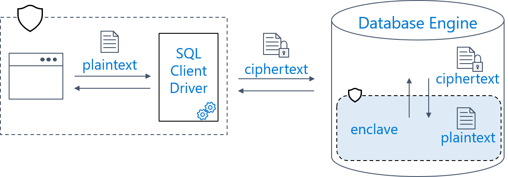

# Always Encrypted with Secure Enclaves
[!INCLUDE[tsql-appliesto-ssver15-xxxx-xxxx-xxx](../../../includes/tsql-appliesto-ssver15-xxxx-xxxx-xxx.md)]

Always Encrypted with secure enclaves provides additional functionality to the [Always Encrypted](always-encrypted-database-engine.md) feature.

Introduced in SQL Server 2016, Always Encrypted protects the confidentiality of sensitive data from malware and high-privileged *unauthorized* users of SQL Server. High-privileged unauthorized users are DBAs, computer admins, cloud admins, or anyone else who has legitimate access to server instances, hardware, etc., but who should not have access to some or all of the actual data. 

Until now, Always Encrypted protected the data by encrypting it on the client side and never allowing the data or the corresponding cryptographic keys to appear in plaintext inside the SQL Server Engine. As a result, the functionality on encrypted columns inside the database was severely restricted. The only operations SQL Server could perform on encrypted data were equality comparisons (and equality comparisons were only available with deterministic encryption). All other operations, including cryptographic operations (initial data encryption or key rotation), or rich computations (for example, pattern matching) were not supported inside the database. Users needed to move the data outside of the database to perform these operations on the client-side.

Always Encrypted *with secure enclaves* addresses these limitations by allowing computations on plaintext data inside a secure enclave on the server side. A secure enclave is a protected region of memory within the SQL Server process, and acts as a trusted execution environment for processing sensitive data inside the SQL Server engine. A secure enclave appears as a black box to the rest of the SQL Server and other processes on the hosting machine. There is no way to view any data or code inside the enclave from the outside, even with a debugger.  

Always Encrypted uses secure enclaves as illustrated in the following diagram:

When parsing an application's query, the SQL Server Engine determines if the query contains any operations on encrypted data that require the use of the secure enclave. For queries where the secure enclave needs to be accessed:

- The client driver sends the column encryption keys required for the operations to the secure enclave (over a secure channel). 
- Then, the client driver submits the query for execution along with the encrypted query parameters.

During query processing, the data or the column encryption keys are not exposed in plaintext in the SQL Server Engine outside of the secure enclave. The SQL Server engine delegates cryptographic operations and computations on encrypted columns to the secure enclave. If needed, the secure enclave decrypts the query parameters and/or the data stored in encrypted columns and performs the requested operations.

## Why use Always Encrypted with secure enclaves?

With secure enclaves, Always Encrypted protects the confidentiality of sensitive data while providing the following benefits:

- **In-place encryption** - cryptographic operations on sensitive data, for example: initial data encryption or rotating a column encryption key, are performed inside the secure enclave and do not require moving the data outside of the database. You can issue in-place encryption using the ALTER TABLE Transact-SQL statement, and you do not need to use tools, such as the Always Encrypted wizard in SSMS or the Set-SqlColumnEncryption PowerShell cmdlet.

- **Rich computations (preview)** - operations on encrypted columns, including pattern matching (the LIKE predicate) and range comparisons, are supported inside the secure enclave, which unlocks Always Encrypted to a broad range of applications and scenarios that require such computations to be performed inside the database system.

> [!IMPORTANT]
> In [!INCLUDE[sql-server-2019](../../../includes/sssqlv15-md.md)], rich computations are pending several performance optimizations, include limited functionality (no indexing, etc), and are currently disabled by default. To enable rich computations, see  [Enable rich computations](configure-always-encrypted-enclaves.md#configure-a-secure-enclave).

In [!INCLUDE[sql-server-2019](../../../includes/sssqlv15-md.md)], Always Encrypted with secure enclaves uses [Virtualization-based Security (VBS)](https://cloudblogs.microsoft.com/microsoftsecure/2018/06/05/virtualization-based-security-vbs-memory-enclaves-data-protection-through-isolation/) secure memory enclaves (also known as Virtual Secure Mode, or VSM enclaves) in Windows.

## Secure Enclave Attestation

The secure enclave inside the SQL Server Engine can access sensitive data stored in encrypted database columns and the corresponding column encryption keys in plaintext. Before submitting a query that involves enclave computations to SQL Server, the client driver inside the application must verify the secure enclave is a genuine enclave based on a given technology (for example, VBS) and the code running inside the enclave has been signed for running inside the enclave. 

The process of verifying the enclave is called **enclave attestation**, and it usually involves a client driver within the application (and sometimes also SQL Server) contacting an external attestation service. The specifics of the attestation process depend on the enclave technology and the attestation service.

The attestation process SQL Server supports for VBS secure enclaves in [!INCLUDE[sql-server-2019](../../../includes/sssqlv15-md.md)] is Windows Defender System Guard runtime attestation, which uses Host Guardian Service (HGS) as an attestation service. You need to configure HGS in your environment and register the machine hosting your SQL Server instance in HGS. You also must configure you client applications or tools (for example, SQL Server Management Studio) with an HGS attestation.

## Secure Enclave Providers

To use Always Encrypted with secure enclaves, an application must use a client driver that supports the feature. In [!INCLUDE[sql-server-2019](../../../includes/sssqlv15-md.md)], your applications must use .NET Framework 4.7.2 and .NET Framework Data Provider for SQL Server. In addition, .NET applications must be configured with a **secure enclave provider** specific to the enclave type (for example, VBS) and the attestation service (for example, HGS), you are using. The supported enclave providers are shipped separately in a NuGet package, which you need to integrate with your application. An enclave provider implements the client-side logic for the attestation protocol and for establishing a secure channel with a secure enclave of a given type.

## Enclave-enabled Keys

Always Encrypted with secure enclaves introduces the concept of enclave-enabled keys:

- **Enclave-enabled column master key** - a column master key that has the ENCLAVE_COMPUTATIONS property specified in the column master key metadata object inside the database. The column master key metadata object must also contain a valid signature of the metadata properties.
- **Enclave-enabled column encryption key** - a column encryption key that is encrypted with an enclave-enabled column master key.

When the SQL Server Engine determines operations, specified in a query, need to be performed inside the secure enclave, the SQL Server Engine requests the client driver shares the column encryption keys that are needed for the computations with the secure enclave. The client driver shares the column encryption keys only if the keys are enclave-enabled (that is, encrypted with enclave-enabled column master keys) and they are properly signed. Otherwise, the query fails.

## Enclave-enabled Columns

An enclave-enabled column is a database column encrypted with an enclave-enabled column encryption key. The functionality available for an enclave-enabled column depends on the encryption type the column is using.

- **Deterministic encryption** - Enclave-enabled columns using deterministic encryption support in-place encryption, but no other operations inside the secure enclave. Equality comparison is supported, but it is performed outside of the enclave, by comparing the ciphertext (outside of the enclave).  
- **Randomized encryption** - Enclave-enabled columns using randomized encryption support in-place encryption as well as rich computations inside the secure enclave. The supported rich computations are pattern matching and [comparison operators](https://docs.microsoft.com/sql/t-sql/language-elements/comparison-operators-transact-sql), including equality comparison.

For more information about encryption types, see [Always Encrypted Cryptography](always-encrypted-cryptography.md).

The following table summarizes the functionality available for encrypted columns, depending on whether the columns use enclave-enabled column encryption keys and an encryption
type.

| **Operation**| **Column is NOT enclave-enabled** |**Column is NOT enclave-enabled**| **Column is enclave-enabled**  |**Column is enclave-enabled** |
|:---|:---|:---|:---|:---|
| | **Randomized encryption**  | **Deterministic encryption**     | **Randomized encryption**      | **Deterministic encryption**     |
| **In-place encryption** | Not Supported  | Not Supported   | Supported         | Supported    |
| **Equality comparison**   | Not Supported | Supported outside of the enclave | Supported (inside the enclave) | Supported outside of the enclave |
| **Comparison operators beyond equality** | Not Supported  | Not Supported   | Supported      | Not Supported     |
| **LIKE**    | Not Supported      | Not Supported    | Supported     | Not Supported    |

In-place encryption includes support for the following operations inside the enclave:

- Initial encryption of data stored in an existing column.
- Re-encrypting existing data in a column, for example:
  
  - Rotating the column encryption key (re-encrypting the column with a new key).
  - Changing the encryption type.  

- Decrypting data stored in an encrypted column (converting the column into a plaintext column).

For in-place encryption to be possible, the column encryption key (or keys), involved in the cryptographic operations, must be enclave-enabled:

- Initial encryption: the column encryption key for the column being encrypted must be enclave-enabled.
- Re-encryption: both the current and the target column encryption key (if different than the current key) must be enclave-enabled.
- Decryption: the current column encryption key of the column must be enclave-enabled.

## Known limitations

General limitations: 

- All limitations listed for the current version of Always Encrypted at [Feature Details](https://docs.microsoft.com/sql/relational-databases/security/encryption/always-encrypted-database-engine#feature-details) also apply to Always Encrypted with secure enclaves (to columns encrypted with enclave-enabled keys), except the restrictions that are removed by adding support for in-place encryption and rich computations.

- Equality comparison remains the only Transact-SQL operator supported with deterministic encryption and equality comparisons are performed by comparing ciphertext values outside of the enclave, regardless if the columns encryption key is enclave-enabled or not. The only new functionality that gets unlocked with enclave-enabled column encryption keys for deterministic encryption, are in-place cryptographic operations. If you have a column that is encrypted using deterministic encryption (and a key that is not enclave-enabled), to enable rich computations (pattern matching, comparison operations), you need to re-encrypt the column using randomized encryption.

- The existing restriction on using collations apply to columns encrypted with enclave-enabled column encryption keys: character string columns (char, nchar, varchar, nvarchar) encrypted using deterministic encryption must use collations with a binary2 sort order (BIN2 collations). Character string columns using non-BIN2 collations can be encrypted using randomized encryption - however the only new functionality that is enabled for such columns (if they are encrypted with enclave-enabled column encryption keys) is in-place encryption. **To support rich computations (pattern matching, comparison operations), a column must use a BIN2 collation** (and the column must be encrypted using randomized encryption and an enclave-enabled column encryption key).

- Using enclave-enabled keys for columns in in-memory tables is not supported.

- In-place cryptographic operations cannot be combined with any other changes of column metadata, except collation and nullability changes. For example, you cannot encrypt, re-encrypt, or decrypt, a column AND change a data type of the column in a single ALTER TABLE or ALTER COLUMN Transact-SQL statement. You need to use two separate statements.

The following limitations apply to the current Preview, but are on the roadmap to be addressed:

- Enclave-enabled columns using randomized encryptions cannot be indexed, which means that comparison operations or LIKE operations require table scans.

- The only client driver supporting Always Encrypted with secure enclaves is .NET Framework Data Provider for SQL Server (ADO.NET) in .NET Framework 4.7.2. There is no ODBC/JDBC support.

- The only supported key stores for storing enclave-enabled column master keys are Windows Certificate Store and Azure Key Vault.

- Tooling support for Always Encrypted with secure enclaves is currently incomplete. To trigger an in-place cryptographic operation via an ALTER TABLE Transact-SQL statement, you need to issue the statement using a query window in SSMS, or you can write your own program that issues the statement. The Set-SqlColumnEncryption cmdlet in the SqlServer PowerShell module and the Always Encrypted wizard in SQL Server Management Studio do not support in-place encryption yet - both tools currently move the data out of the database for cryptographic operations, even if the column encryption keys used for the operations are enclave-enabled. 

## Known Issues

- Rich computations on non-UNICODE (char, varchar) string columns require a BIN2 collation is set at the database level. Please see Special considerations for non-UNICODE string columns in [Manage Collations](configure-always-encrypted-enclaves.md#manage-collations).

## Next Steps

- Set up your test environment and try the functionality of Always Encrypted with secure enclaves in SSMS - see [Tutorial: Getting started with Always Encrypted with secure enclaves using SSMS](../tutorial-getting-started-with-always-encrypted-enclaves.md).