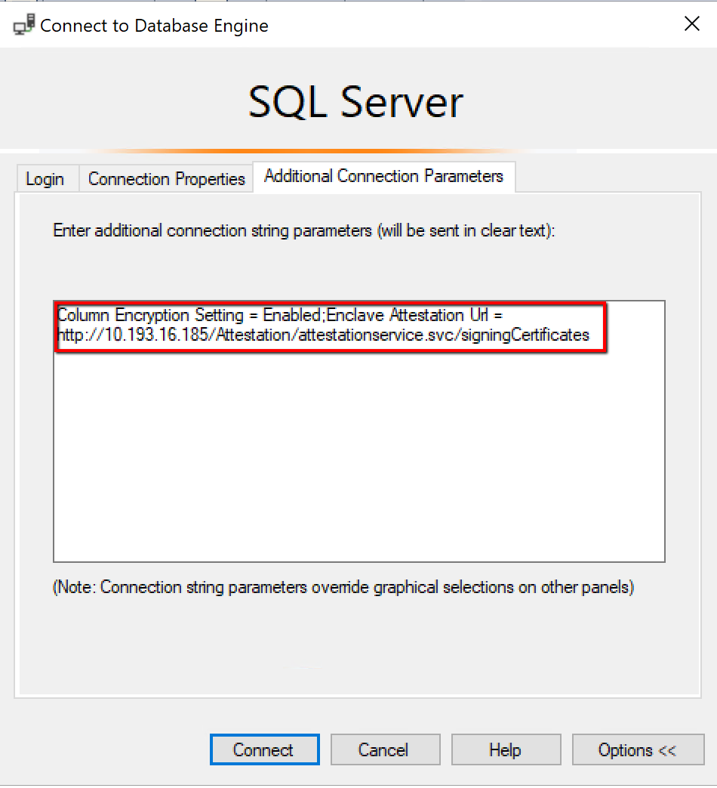

# Configure Always Encrypted with secure enclaves

[!INCLUDE[tsql-appliesto-ssver15-xxxx-xxxx-xxx](../../../includes/tsql-appliesto-ssver15-xxxx-xxxx-xxx.md)]

[Always Encrypted with secure enclaves](always-encrypted-enclaves.md) extends the existing [Always Encrypted](always-encrypted-database-engine.md) feature to enable richer functionality on sensitive data while keeping the data confidential.

To setup Always Encrypted with secure enclaves, use the following workflow:

1. Configure Host Guardian Service (HGS) attestation.
2. Install [!INCLUDE[sql-server-2019](../../../includes/sssqlv15-md.md)] on the SQL Server computer.
3. Install tools on the client/development computer.
4. Configure the enclave type in your SQL Server instance.
5. Provision enclave-enabled keys.
6. Encrypt columns that contain sensitive data.

> [!NOTE]
> For a step-by-step tutorial on how to set up a test environment and try the functionality of Always Encrypted with secure enclaves in SSMS, see [Tutorial: Getting started with Always Encrypted with secure enclaves using SSMS](../tutorial-getting-started-with-always-encrypted-enclaves.md).

## Configure your environment

To use secure enclaves with Always Encrypted, your environment requires Windows Server 2019 Preview, and SQL Server Management Studio (SSMS) 18.0 (preview), .NET Framework, and several other components. The following sections provide details and links to get the required components.

### SQL Server computer requirements

The computer running SQL Server needs the following operating system and SQL Server version:

*SQL Server*:

- [!INCLUDE[sql-server-2019](../../../includes/sssqlv15-md.md)] or later

*Windows*:

- Windows 10 Enterprise, version 1809
- Windows Server DataCenter (Semi-Annual Channel), version 1809
- Windows Server 2019 DataCenter

> [!IMPORTANT]
> The SQL Server computer must be configured as a guarded host, attested by HGS. TPM attestation is the recommended enclave attestation method for production environments, and requires SQL Server runs on a physical machine, not in a virtual machine. Virtual machines are adequate for pre-production environments only.

### HGS computer requirements

A single HGS computer is sufficient during testing and prototyping. For production, a Windows failover cluster with 3 computers is strongly recommended.

Windows Host Guardian Service (HGS) needs to be installed on separate HGS computers, and not on the same computer as SQL Server. For details on HGS computer requirements and set up, see [Setting up the Host Guardian Service for Always Encrypted in SQL Server](https://docs.microsoft.com/windows-server/security/set-up-hgs-for-always-encrypted-in-sql-server).


### Determine your Attestation Service URL

To determine the attestation service URL, you need to configure your tools and applications:

1. Log on to your SQL Server computer as administrator.
2. Run PowerShell as administrator.
3. Run [Get-HGSClientConfiguration](https://docs.microsoft.com/powershell/module/hgsclient/get-hgsclientconfiguration).
4. Write down and save the AttestationServerURL property. It should look similar to this: `https://x.x.x.x/Attestation`.


### Install tools

Install the following tools on the client/development computer:

1. [.NET Framework 4.7.2](https://www.microsoft.com/net/download/dotnet-framework-runtime).
2. [SSMS 18.0 or later](../../../ssms/download-sql-server-management-studio-ssms.md).
3. [SQL Server PowerShell module](../../../powershell/download-sql-server-ps-module.md) version 21.1 or later.
4. [Visual Studio (2017 or later recommended)](https://visualstudio.microsoft.com/downloads/).
5. [Developer Pack for .NET Framework 4.7.2](https://www.microsoft.com/net/download/visual-studio-sdks).
6. [Microsoft.SqlServer.Management.AlwaysEncrypted.AzureKeyVaultProvider NuGet package](https://www.nuget.org/packages/Microsoft.SqlServer.Management.AlwaysEncrypted.AzureKeyVaultProvider), version 2.2.0 or later.
7. [Microsoft.SqlServer.Management.AlwaysEncrypted.EnclaveProviders NuGet package](https://www.nuget.org/packages?q=Microsoft.SqlServer.Management.AlwaysEncrypted.EnclaveProviders).

The NuGet packages are intended to be used in Visual Studio projects for developing applications using Always Encrypted with secure enclaves. The first package is required only if you store your column master keys in Azure Key Vault. For details, see [Develop applications](#develop-applications-issuing-rich-queries-in-visual-studio).

### Configure a secure enclave

On the client/development computer:

1. Open SSMS and connect to your SQL Server instance as an Active Directory (AD) administrator.
2. To verify Always Encrypted with secure enclaves is supported in your instance, run the following query:

   ```sql
   SELECT [name], [value], [value_in_use] FROM sys.configurations
   WHERE [name] = 'column encryption enclave type'
   ```

    The query should return a row that looks like the following:  

    | name                           | value | value_in_use |
    | ------------------------------ | ----- | -------------|
    | column encryption enclave type | 0     | 0            |

3. Configure the secure enclave type to VBS enclaves.

   ```sql
   EXEC sys.sp_configure 'column encryption enclave type', 1
   RECONFIGURE
   ```

4. Restart your SQL Server instance for the previous change to take effect. You can restart the instance in SSMS by right-clicking on it in Object Explorer and selecting Restart. Once the instance restarts, reconnect to it.

5. Confirm the secure enclave is now loaded by running the following query:

   ```sql
   SELECT [name], [value], [value_in_use] FROM sys.configurations
   WHERE [name] = 'column encryption enclave type'
   ```   

    The query should return a row that looks like the following:  

    | name                           | value | value_in_use |
    | ------------------------------ | ----- | -------------- |
    | column encryption enclave type | 1     | 1              |

6. To enable rich computations on encrypted columns, run the following query:

   ```sql
   DBCC traceon(127,-1)
   ```

    > [!NOTE]
    > Rich computations are disabled by default in [!INCLUDE[sql-server-2019](../../../includes/sssqlv15-md.md)]. They need to be enabled using the above statement after each restart of your SQL Server instance.

## Provision enclave-enabled keys

The introduction of enclave-enabled keys does not fundamentally change the [key provisioning and key management workflows for Always Encrypted](overview-of-key-management-for-always-encrypted.md). The only change is in the column master key provisioning workflow, where you can now mark the key as enclave-enabled (by default, column master keys, are not enclave-enabled). When you specify the new column master key is to be enclave-enabled (with SSMS, or PowerShell), the following happens:

- The **ENCLAVE_COMPUTATIONS** property in the column master key metadata in the database is set.
- The column master key property values (including the setting of **ENCLAVE_COMPUTATIONS**) are digitally signed. The tool adds the signature, which is produced using the actual column master key, to the metadata. The purpose of the signature is to prevent malicious DBAs and computer admins from tampering with the **ENCLAVE_COMPUTATIONS** setting. The SQL client drivers verify the signatures before allowing the enclave use. This provides security administrators with control over which column data can be computed inside the enclave.

The **ENCLAVE_COMPUTATIONS** property of a column master key is immutable - you cannot change it after the key has been provisioned. You can, however, replace the column master key with a new key that has a different value of the **ENCLAVE_COMPUTATIONS** property than the original key, via a process called a [column master key rotation](#initiate-the-rotation-from-the-current-column-master-key-to-the-new-column-master-key). For more information about the **ENCLAVE_COMPUTATIONS** property, see [CREATE COLUMN MASTER KEY](../../../t-sql/statements/create-column-master-key-transact-sql.md).

To provision an enclave-enabled column encryption key, you need to make sure that the column master key that encrypts the column encryption key, is enclave-enabled.

The following limitations currently apply to provisioning enclave-enabled keys:

- Enclave-enabled **column master keys must be stored in Windows Certificate Store or in Azure Key Vault**. Storing enclave-enabled column master keys in other types of key stores (hardware security modules or custom key stores) is not currently supported.

### **Provision enclave-enabled keys using SQL Server Management Studio (SSMS)**

The following steps create enclave-enabled keys (requires SSMS 18.0 or later):

1. Connect to your database using SSMS.
2. In **Object Explorer**, expand your database and navigate to **Security** > **Always Encrypted Keys**.
3. Provision a new enclave-enabled column master key:

    1. Right click **Always Encrypted Keys** and select **New Column Master Key...**.
    2. Select your column master key name.
    3. Make sure you select either **Windows Certificate Store (Current User or Local Machine)** or **Azure Key Vault**.
    4. Select **Allow enclave computations**.
    5. If you selected Azure Key Vault, sign in to Azure and select your key vault. For more information on how to create a key vault for Always Encrypted, see [Manage your key vaults from Azure portal](https://blogs.technet.microsoft.com/kv/2016/09/12/manage-your-key-vaults-from-new-azure-portal/).
    6. Select your key if it already exists, or follow the directions on the form to create a new key.
    7. Click **OK**.

        

4. Create a new enclave-enabled column encryption key:

    1. Right click **Always Encrypted Keys** and select **New Column Encryption Key**.
    2. Enter a name for the new column encryption key.
    3. In the **Column master key** dropdown, select the column master key you created in the previous steps.
    4. Click **OK**.

### **Provision enclave-enabled keys using PowerShell**

The following sections provide sample PowerShell scripts for provisioning enclave-enabled keys. The steps that are specific (new) to Always Encrypted with secure enclaves are highlighted. For more information (not specific to Always Encrypted with secure enclaves) about provisioning keys using PowerShell, see [Configure Always Encrypted Keys using PowerShell](https://docs.microsoft.com/sql/relational-databases/security/encryption/configure-always-encrypted-keys-using-powershell).

**Provisioning Enclave-Enabled Keys - Windows Certificate Store**

On the client/development computer, open Windows PowerShell ISE, and run the following script.

Important to note is the use of the `-AllowEnclaveComputations` parameter in the [**New-SqlCertificateStoreColumnMasterKeySettings**](https://docs.microsoft.com/powershell/module/sqlserver/new-sqlcertificatestorecolumnmasterkeysettings) cmdlet.

```powershell
# Create a column master key in Windows Certificate Store.
$cert = New-SelfSignedCertificate -Subject "\<Subject Name\>" -CertStoreLocation Cert:CurrentUser\\My -KeyExportPolicy Exportable -Type DocumentEncryptionCert -KeyUsage DataEncipherment -KeySpec KeyExchange

# Import the SqlServer module.
Import-Module "SqlServer"

# Connect to your database. Provide the server/db name. Modify the connection string, if needed.
$serverName = "<server name>"
$databaseName = "<database name>"
$connStr = "Data Source = " + $serverName + "; Initial Catalog = " + $databaseName + "; Integrated Security = true"
$database = Get-SqlDatabase -ConnectionString $connStr

# Create a SqlColumnMasterKeySettings object for your column master key
# using the -AllowEnclaveComputations parameter.
$cmkSettings = New-SqlCertificateStoreColumnMasterKeySettings -CertificateStoreLocation "CurrentUser" -Thumbprint $cert.Thumbprint -AllowEnclaveComputations

# Create column master key metadata in the database.
$cmkName = "<column master key name in the database>"
New-SqlColumnMasterKey -Name $cmkName -InputObject $database -ColumnMasterKeySettings $cmkSettings

# Generate a column encryption key, encrypt it with the column master key and create column encryption key metadata in the database.
$cekName = "<column encryption key name in the database>"
New-SqlColumnEncryptionKey -Name $cekName -InputObject $database -ColumnMasterKey $cmkName
```


### Provisioning Enclave-Enabled Keys - Azure Key Vault

On the client/development computer, open Windows PowerShell ISE, and run the following script.

**Step 1: Provision a column master key in Azure Key Vault**

This can be also done using Azure portal. For details, see [Manage your key vaults from Azure portal](https://blogs.technet.microsoft.com/kv/2016/09/12/manage-your-key-vaults-from-new-azure-portal/).


```powershell
Import-Module Az
Connect-AzAccount

# User values
$SubscriptionId = "<Azure SubscriptionId>"
$resourceGroup = "<resource group name>"
$azureLocation = "<datacenter location>"
$akvName = "<key vault name>"
$akvKeyName = "<key name>"

# Set the context to the specified subscription.
$azureCtx = Set-AzContext -SubscriptionId $SubscriptionId

# Create a new resource group - skip, if your desired group already exists.
New-AzResourceGroup -Name $resourceGroup -Location $azureLocation

# Create a new key vault - skip if your vault already exists.
New-AzKeyVault -VaultName $akvName -ResourceGroupName $resourceGroup -Location $azureLocation

# Grant yourself permissions needed to create and use the column master key.
Set-AzKeyVaultAccessPolicy -VaultName $akvName -ResourceGroupName $resourceGroup -PermissionsToKeys get, create, list, update, wrapKey,unwrapKey, sign, verify -UserPrincipalName $azureCtx.Account

# Create a column master key in Azure Key Vault.
$akvKey = Add-AzureKeyVaultKey -VaultName $akvName -Name $akvKeyName -Destination "Software"
```

**Step 2: Create column master key metadata in the database, create a column encryption key, and create column encryption key metadata in the database**


```powershell
# Import the SqlServer module.
Import-Module "SqlServer" -Version

# Connect to your database. Provide the server and db name. If needed, modify the connection string.
$serverName = "<server name>"
$databaseName = "<database name>"
$connStr = "Data Source = " + $serverName + "; Initial Catalog = " + $databaseName + "; Integrated Security = true"
$database = Get-SqlDatabase -ConnectionString $connStr

# Authenticate to Azure before calling New-SqlAzureKeyVaultColumnMasterKeySettings,
# because -AllowEnclaveComputations causes a call to Azure Key Vault
# to generate the signature of the column master key.
Add-SqlAzureAuthenticationContext -Interactive

# Create a SqlColumnMasterKeySettings object for your column master key.
$cmkSettings = New-SqlAzureKeyVaultColumnMasterKeySettings -KeyURL $akvKey.ID -AllowEnclaveComputations

# Create column master key metadata in the database.
$cmkName = "<column master key name in the database>"
New-SqlColumnMasterKey -Name $cmkName -InputObject $database -ColumnMasterKeySettings $cmkSettings

# Generate a column encryption key, encrypt it with the column master key and create column encryption key metadata in the database.
$cekName = "<column encryption key name in the database>"
New-SqlColumnEncryptionKey -Name $cekName -InputObject $database -ColumnMasterKey $cmkName
```


## Identify Enclave-enabled keys and columns

To list column master keys, configured in your database, you can query the [sys.column_master_keys](../../system-catalog-views/sys-column-master-keys-transact-sql.md) catalog view (for example, in SSMS). The new **allow_enclave_computations** column has been added to the view. It indicates whether a column master key is enclave-enabled.

```sql
SELECT name, allow_enclave_computations
FROM sys.column_master_keys
```

To determine which column encryption keys are encrypted with enclave-enabled column encryption keys (and, thus, are enclave-enabled), you need to join [sys.column_master_keys](../../system-catalog-views/sys-column-master-keys-transact-sql.md), [sys.column_encryption_key_values](../../system-catalog-views/sys-column-encryption-key-values-transact-sql.md), and [sys.column_encryption_keys](../../system-catalog-views/sys-column-encryption-keys-transact-sql.md).


```sql
SELECT cek.name AS [cek_name]
, cmk.name AS [cmk_name]
, cmk.allow_enclave_computations
FROM sys.column_master_keys cmk
JOIN sys.column_encryption_key_values cekv
   ON cmk.column_master_key_id = cekv.column_master_key_id
JOIN sys.column_encryption_keys cek
   ON cekv.column_encryption_key_id = cek.column_encryption_key_id
```

To determine which columns are enclave-enabled (the columns that are encrypted with column encryption keys that are enclave-enabled), use the following query:

```sql
SELECT c.name AS column_name
, cek.name AS cek_name
, cmk.name AS [cmk_name]
, cmk.allow_enclave_computations
from sys.columns c
JOIN sys.column_encryption_keys cek 
ON c.column_encryption_key_id = cek.column_encryption_key_id 
JOIN sys.column_encryption_key_values cekv 
ON cekv.column_encryption_key_id = cek.column_encryption_key_id 
JOIN sys.column_master_keys cmk 
ON cmk.column_master_key_id = cekv.column_master_key_id
```


## Manage collations

Since its initial release, Always Encrypted has had a restriction regarding the use of collations: non-BIN2 collations are not allowed for character string columns encrypted using deterministic encryption. This restriction also applies to enclave-enabled string columns.

The use of non-BIN2 collations is permitted for character string columns encrypted with randomized encryption and enclave-enabled column encryption keys. However, the only new functionality that is enabled for such columns is in-place encryption. To enable rich computations (pattern matching, comparison operations), you must ensure the column uses a BIN2 collation.

The below table summarizes the functionality for enclave-enabled string columns, depending on the encryption type and the collation sort order.

| **Collation sort order** | **Deterministic Encryption** | **Randomized Encryption**                 |
| ------------------------ | ---------------------------- | ----------------------------------------- |
| **Non-BIN2**             | Not supported                | In-place encryption                       |
| **BIN2**                 | Equality comparison          | In-place encryption and rich computations |

### Determining and changing collations

In SQL Server, collations can be set at the server, database, or column level. For general instructions on how to determine the current collation and change a collation at the server, database or column level, see [Collation and Unicode Support](https://docs.microsoft.com/sql/relational-databases/collations/collation-and-unicode-support).

**Special considerations for non-UNICODE string columns**:

The following additional restriction, imposed by a limitation in SQL client drivers (not related to Always Encrypted), applies to non-UNICODE (ASCII) string columns. If you overwrite the database collation for a non-UNICODE (char, varchar) string column, you must ensure the column collation uses the same code page as the database collation.
To list all collations along with their code page identifiers, use the following query:

```sql
SELECT [Name]
   , [Description]
   , [CodePage] = COLLATIONPROPERTY([Name], 'CodePage')
FROM ::fn_helpcollations()
```

For example, Chinese_Traditional_Stroke_Order_100_CI_AI_WS and Chinese_Traditional_Stroke_Order_100_BIN2 have the same code page (950), but Chinese_Traditional_Stroke_Order_100_CI_AI_WS and Latin1_General_100_BIN2 have different code pages (950 and 1252, respectively). The above restriction does not apply to UNICODE (nchar, nvarchar) string columns. Therefore, as a workaround, you may consider setting a UNICODE data type for your new encrypted columns, you are creating, or changing the type to a UNICODE type before encrypting an existing column.


## Create a New Table with Enclave-enabled Columns

You can create a new table with encrypted columns using the [CREATE TABLE (Transact-SQL)](https://docs.microsoft.com/sql/t-sql/statements/create-table-transact-sql) statement. Always Encrypted with secure enclaves does not change the syntax of this statement.

1. Using SSMS, connect to your database and open a query window.
   
     > [!NOTE]
     > Always Encrypted does not have to be enabled in the connection string for this task.

2. In the query window, issue a CREATE TABLE statement to create your new table, specifying the ENCRYPTED WITH clause in the [column definition](https://docs.microsoft.com/sql/t-sql/statements/alter-table-column-definition-transact-sql) for each column to be encrypted. To make a column enclave-enabled, make sure you specify an enclave-enabled column encryption key. You may also need to specify a BIN2 collation for string columns if the default collation for your database is not a BIN2 collation. See the Collation Setup section for details.

### Example

The below statement creates a new table with two encrypted columns, SSN and Salary. Assuming CEK1 is an enclave-enabled column encryption key, the SQL Server Engine supports both in-place encryption and rich computations for both columns, as the columns use randomized encryption. The statement sets Latin1\_General\_BIN2 collation for the UNICODE SSN column, which is required assuming the default database collation is a non-BIN2 Latin1 collation.

```sql
CREATE TABLE [dbo].[Employees]
(
    [EmployeeID] [int] IDENTITY(1,1) NOT NULL,
    [SSN] [char](11) COLLATE Latin1_General_BIN2 ENCRYPTED WITH (
        COLUMN_ENCRYPTION_KEY = [CEK1],
        ENCRYPTION_TYPE = Randomized,
        ALGORITHM = 'AEAD_AES_256_CBC_HMAC_SHA_256') NOT NULL,
    [FirstName] [nvarchar](50) NOT NULL,
    [LastName] [nvarchar](50) NOT NULL,
    [Salary] [int] ENCRYPTED WITH (
        COLUMN_ENCRYPTION_KEY = [CEK1],
        ENCRYPTION_TYPE = Randomized,
        ALGORITHM = 'AEAD_AES_256_CBC_HMAC_SHA_256') NOT NULL,
    CONSTRAINT [PK_dbo.Employees] PRIMARY KEY CLUSTERED (
[EmployeeID] ASC
)
) ON [PRIMARY]
GO
```


## Add a new Enclave-enabled Column to an Existing Table

You can add a new encrypted column to an existing table using the [ALTER TABLE (Transact-SQL)](https://docs.microsoft.com/sql/t-sql/statements/alter-table-transact-sql)
/ ADD statement. Always Encrypted with secure enclaves does not change the syntax of this statement.

1. Using SSMS, connect to your database and open a query window.
    
   Always Encrypted does not have to be enabled in the connection string for this task.

2. In the query window, issue the ALTER TABLE statement with the ADD clause, specifying the ENCRYPTED WITH clause in the [column definition](https://docs.microsoft.com/sql/t-sql/statements/alter-table-column-definition-transact-sql), and using an enclave-enabled column encryption key. You may also need to specify a BIN2 collation if your new column is a string column and if the default collation for your database is not a BIN2 collation. See the Collation Setup section for details.

### Example

Assuming CEK1 is an enclave-enabled column encryption key, the below statement adds a new encrypted column, named BirthDate, which supports both rich queries and in-place encryption (as the column uses Randomized encryption).

```sql
ALTER TABLE [dbo].[Employees]
ADD [BirthDate] [Date] ENCRYPTED WITH (
COLUMN_ENCRYPTION_KEY = [CEK1],
ENCRYPTION_TYPE = Randomized,
ALGORITHM = 'AEAD_AES_256_CBC_HMAC_SHA_256') NULL
```


## Prepare an SSMS Query Window with Always Encrypted Enabled

To add the required connection parameters to enable enclave computations:

1. Open SSMS.
2. After specifying your server name and a database name in the Connect To Server dialog, click **Options**. Navigate to the **Always Encrypted** tab, select **Enable Always Encrypted**, and specify your enclave attestation URL.
    
    

3. Click Connect.
4. Open a new query window.

Alternatively, if you already have a query window open, here is how you can update its database connection to enable Always Encrypted:

1. Right-click anywhere in an existing query window.
2. Select Connection \> Change Connection.
3. Click on **Options**. Navigate to the **Always Encrypted** tab, select **Enable Always Encrypted**, and specify your enclave attestation URL.
4. Click Connect.


## Work with encrypted columns

### Encrypt an Existing Plaintext Column In-place

You can encrypt an existing plaintext column in-place using the [ALTER TABLE (Transact-SQL)](https://docs.microsoft.com/sql/t-sql/statements/alter-table-transact-sql) / ALTER COLUMN statement, providing you use an enclave-enabled column encryption key.

To encrypt a column using a key that is not enclave-enabled, you need to use client-side tools, such as the Always Encrypted wizard in SSMS, or the Set-SqlColumnEncryption cmdlet in the SqlServer PowerShell module. For details, see:

- [Always Encrypted Wizard](always-encrypted-wizard.md)
- [Configure Column Encryption using PowerShell](configure-column-encryption-using-powershell.md)


### Prerequisites

- Your existing column is not encrypted.
- You have provisioned enclave-enabled keys.
- You have access to the column master key.

#### Steps

1. Prepare an SSMS query window with Always Encrypted and enclave computations enabled in the database connection. For details, see [Prepare an SSMS Query Window with Always Encrypted Enabled](#prepare-an-ssms-query-window-with-always-encrypted-enabled).
2. In the query window, issue the ALTER TABLE statement with the ALTER COLUMN clause, specifying an enclave-enabled column encryption key in the ENCRYPTED WITH clause. If your column is a string column (for example, char, varchar, nchar, nvarchar), you may also need to change the collation to a BIN2 collation. See the Collation Setup section for details.
    
    > [!NOTE]
    > If your column master key is stored in Azure Key Vault, you might be prompted to sign in to Azure.

3. (Optionally) clear the plan cache using [DBCC FREEPROCCACHE](../../../t-sql/database-console-commands/dbcc-freeproccache-transact-sql.md) to ensure the plans for any query against the columns you have encrypted gets re-created on the first query execution.
  
    > [!NOTE]
    > If you do not remove the plan for the impacted query from the cache, the first execution of the query after encryption may fail.

    > [!NOTE]
    > Use DBCC FREEPROCCACHE to clear the plan cache carefully, as it may result in temporary query performance degradation. To minimize the negative impact of clearing the cache, you can selectively remove the plans for the impacted queries only.

4.  (Optionally) call [sp_refresh_parameter_encryption](../../system-stored-procedures/sp-refresh-parameter-encryption-transact-sql.md) to update the metadata for the parameters of each module (stored procedure, function, view, trigger) that may have been invalidated by encrypting the columns.

#### Example

The below example assumes:

  - CEK1 is an enclave-enabled column encryption key.

  - The SSN column is plaintext and is currently using a Latin1, non-BIN2 collation (for example, Latin1\_General\_CI\_AI\_KS\_WS).

The statement encrypts the SSN column using randomized encryption and enclave-enabled column encryption key. It also overwrites the default database collation with the corresponding (in the same code page) BIN2 collation.

The operation is performed online (ONLINE = ON). Also note the call to **DBCC FREEPROCCACHE** which recreates the plans of the queries impacted by the table schema change.

```sql
ALTER TABLE [dbo].[Employees]
ALTER COLUMN [SSN] [char] COLLATE Latin1_General_BIN2
ENCRYPTED WITH (COLUMN_ENCRYPTION_KEY = [CEK1], ENCRYPTION_TYPE = Randomized, ALGORITHM = 'AEAD_AES_256_CBC_HMAC_SHA_256') NOT NULL
WITH
(ONLINE = ON)
GO
DBCC FREEPROCCACHE
GO
```


### Make an Existing Encrypted Column Enclave-Enabled

There are several ways to enable the enclave functionality for an existing column that is not enclave-enabled. Which method you choose, depends on several factors:

- **Scope/granularity:** Do you want to enable the enclave functionality for a subset of columns, or for all columns protected with a given column master key?
- **Data size:** What is the size of the tables containing the column(s) you want to make enclave-enabled?
- Do you also want to change the encryption type for your column(s)? Remember that only randomized encryption supports rich computations (pattern matching, comparison operators). If your column is encrypted using deterministic encryption, you will also need to re-encrypt it with randomized encryption to unlock the full functionality of the enclave.

Here are the three approaches for enabling enclaves for existing columns:

#### Option 1: Rotate the column master key to replace it with an enclave-enabled column master key.
  
- Pros:
  - Does not involve re-encrypting data, so it is typically the fastest approach. It is a recommended approach for columns containing large amounts of data, providing all columns, you need to enable rich computations for, already use deterministic encryption and, thus, do not need to be re-encrypted.
  - Can enable the enclave functionality for multiple columns at scale, as it makes all column encryption keys and all encrypted columns, associated with the original column master key, enclave-enabled.
  
- Cons:
  - Does not support changing the encryption type from deterministic to randomized, so while it unlocks in-place encryption for columns encrypted deterministically, it does not enable rich computations.
  - Does not allow you to selectively convert some of the columns, associated with a given column master key.
  - Introduces key management overhead - you need to create a new column master key and make it available to applications that query the impacted columns.  


#### Option 2: This approach involves two steps: 1) rotating the column master key (as in Option 1) and 2) re-encrypting a subset of deterministically encrypted columns using randomized encryption, to enable rich computations for those columns.
  
- Pros:
  - Re-encrypts data in-place, and thus it is a recommended method to enable rich queries for deterministically encrypted columns that contain large amounts of data. Note that step 1 unlocks in-place encryption for the columns using deterministic encryption, so step 2 can be performed in-place.
  - Can enable the enclave functionality for multiple columns at scale.
  
- Cons:
  - Does not allow you to selectively convert some of the columns, associated with a given column master key.
  - It introduces key management overhead - you need to create a new column master key and make it available to applications that query the impacted columns.

#### Option 3: Re-encrypting selected columns with a new enclave-enabled column encryption key and randomized encryption (if needed) on the client side.
  
- Pros - this method:
  - Allows you selectively to enable the enclave functionality for one column or a small subset of columns.
  - It can enable rich computations for a deterministically encrypted column in one step.
  - It does not require creating new column master key, so it has a smaller impact on applications.
  
- Cons:
  - The entire content of the table that contains the column needs to be moved outside of the database for re-encryption, so it is recommended only for small tables. 

For more information, see the following sections:
  - [Making Columns Enclave-Enabled by Rotating their Column Master Key](#make-columns-enclave-enabled-by-rotating-their-column-master-key)
  - [Re-encrypting Columns in-Place](#re-encrypt-columns-in-place)
  - [Re-encrypting Columns on the Client Side](#re-encrypt-columns-on-the-client-side)

### Make Columns Enclave-Enabled by Rotating their Column Master Key

A column master key rotation is a process of replacing an existing column master key with a new column master key. It involves re-encrypting the column encryption keys, associated with the old column master key, using the new column master key. This workflow has existed since the initial release of Always Encrypted to support replacing a column master key for compliance or security reasons (in case the existing column master key gets compromised).

Always Encrypted using enclaves adds a new purpose for the column master key rotation workflow. Assuming the old column master key is not enclave-enabled, and the new column master key is enclave-enabled, the rotation process effectively makes all column encryption keys, associated with the column master key, enclave-enabled. Rotating a column master key does not involve re-encrypting the data and, therefore, it is a recommended process for enabling enclave capabilities for existing columns.

Rotating the column master key does not change the encryption type of the impacted columns. Therefore, it can only unlock in-place encryption for columns encrypted deterministically. To unlock rich computations for columns using deterministic encryption, you need to re-encrypt them (in-place), after you rotate the column master key.

You may also need to change the collation for string columns, using randomized encryption, to a BIN2 collation, in order to unlock rich computations. See the Collation Setup section for details.

The process a column master key rotation is the same, regardless if either involved key is enclave-enabled. The details on how rotate the column master key is in the following articles:

- [Rotate a column master key with SSMS](configure-always-encrypted-using-sql-server-management-studio.md)
- [Rotating a column master key with PowerShell](rotate-always-encrypted-keys-using-powershell.md)

For your convenience, a sample PowerShell script for rotating a column master key is provided below.

#### Pre-requisites

- You have provisioned a new enclave-enabled column master key.
- You have access to both the old and the new column master key.
- All string columns, protected with the old column master key, use BIN2 collations. (Note: alternatively, you can change the collation of string columns after rotating the column master key).

#### Steps

Paste the following script into Windows PowerShell ISE, replace the \<place holders\> with your specific values:


```powershell
# Import the SqlServer module.
Import-Module "SqlServer"

# Connect to your database. Modify server/db name or/and the connection string, if needed.
$serverName = "<server name>"
$databaseName = "<database name>"
$connStr = "Data Source = " + $serverName + "; Initial Catalog = " +
$databaseName + "; Integrated Security = true"
$database = Get-SqlDatabase -ConnectionString $connStr

# Set the names of the old/current column master key and the new/target enclave-enabled column master key. (Change the names, if needed).
$oldCmkName = "<old column master key name>"
$newCmkName = "<new column master key name>"

# Authenticate to Azure. Needed only of either column master key is stored in Azure Key Vault.
Add-SqlAzureAuthenticationContext -Interactive

# Initiate the rotation from the current column master key to the new column master key.
Invoke-SqlColumnMasterKeyRotation -SourceColumnMasterKeyName $oldCmkName
-TargetColumnMasterKeyName $newCmkName -InputObject $database

# Complete the rotation of the old column master key.
Complete-SqlColumnMasterKeyRotation -SourceColumnMasterKeyName
$oldCmkName -InputObject $database

# Remove the old column master key metadata.
Remove-SqlColumnMasterKey -Name $oldCmkName -InputObject $database
```


### Re-encrypt Columns in-Place 

After you have made your column enclave-enabled, you can perform the following operations in-place (inside the enclave, without having to move the data out of the database):

- Rotating the column encryption key (to replace it with a new key), for example, to adhere to compliance regulations, some of which mandate periodic key rotation, or for security reasons (in case your column encryption key gets compromised).
- Changing the encryption type, for example, from deterministic encryption to randomized encryption, to unlock rich computations for the column.

#### Prerequisites

- Your column is encrypted using an enclave-enabled column encryption key.
- You have provisioned a new enclave-enabled column encryption key (if your goal is to replace the current enclave-enabled column encryption key, protecting the column).
- You have access to the column master key.

#### Steps

1. Prepare an SSMS query window with Always Encrypted and enclave computations enabled for the database connection. For details, see [Prepare an SSMS Query Window with Always Encrypted Enabled](#prepare-an-ssms-query-window-with-always-encrypted-enabled).

2. In the query window, issue the use the [ALTER TABLE (Transact-SQL)](https://docs.microsoft.com/sql/t-sql/statements/alter-table-transact-sql) statement with the ALTER COLUMN clause, specifying the following in the ENCRYPTED WITH clause:
    
    1. The name of the new enclave-enabled column encryption key if you are rotating the current key. If you are not changing the column encryption key, you need to specify the name of the current key.
    
    2. The new encryption type if you are change it. If you are not changing the encryption type, you need to specify the current encryption type.
        
       If the column, you are re-encrypting, uses a collation (BIN2) that is different than the default database collation, you need to include the COLLATE phrase and specify the current column collation in the column definition (to keep the collation the same).
        
       > [!NOTE]
       > If your column master key is stored in Azure Key Vault, you might be prompted to sign in to Azure.

3. (Optionally) clear the plan cache using [DBCC FREEPROCCACHE](../../../t-sql/database-console-commands/dbcc-freeproccache-transact-sql.md) to ensure the plans for any query against the columns you have re-encrypted gets re-created on the first query execution.
    
    If you do not remove the plan for the impacted query from the cache, the first execution of the query after re-encryption may fail.
    
    > [!NOTE]
    > Use DBCC FREEPROCCACHE to clear the plan cache carefully, as it may result in temporary query performance degradation. To minimize the negative impact of clearing the cache, you can selectively remove the plans for the impacted queries only. See the [DBCC FREEPROCCACHE](../../../t-sql/database-console-commands/dbcc-freeproccache-transact-sql.md).aspx) for details.

4. (Optionally) call
    [sp_refresh_parameter_encryption](https://docs.microsoft.com/sql/relational-databases/system-stored-procedures/sp-refresh-parameter-encryption-transact-sql) to update the metadata for the parameters of each module (stored procedure, function, view, trigger) that may have been invalidated by re-encrypting the columns.

#### Examples

Assuming the SSN column currently is encrypted using an enclave-enabled column encryption key, named CEK1, and deterministic encryption, and the current collation, set at the column level is Latin1\_General\_BIN2, the below statement re-encrypts the column with randomized encrypted and the same key.


```sql
ALTER TABLE [dbo].[Employees]
ALTER COLUMN [SSN] [char](11) COLLATE Latin1_General_BIN2
ENCRYPTED WITH (COLUMN_ENCRYPTION_KEY = [CEK1]
, ENCRYPTION_TYPE = Randomized
, ALGORITHM = 'AEAD_AES_256_CBC_HMAC_SHA_256') NOT NULL
GO
DBCC FREEPROCCACHE
GO
```


Assuming the SSN column currently is encrypted using an enclave-enabled column encryption key, named CEK1, and deterministic encryption, and the default database collation is a BIN2 collation (and it has not been set at the column level), the below statement re-encrypts the column with a new enclave-enabled key, named CEK2 (without changing the encryption type).

```sql
ALTER TABLE [dbo].[Employees]
ALTER COLUMN [SSN] [char](11) 
ENCRYPTED WITH (COLUMN_ENCRYPTION_KEY = [CEK2]
, ENCRYPTION\_TYPE = Deterministic
, ALGORITHM = 'AEAD_AES_256_CBC_HMAC_SHA_256') NOT NULL
GO
DBCC FREEPROCCACHE
GO
```

Assuming the SSN column currently is encrypted using an enclave-enabled column encryption key named CEK1, deterministic encryption, and the default database collation is a BIN2 collation (and it has not been set at the column level), the below statement re-encrypts the column with a new enclave-enabled key and randomized encryption. In addition, the operation is performed in the online mode.


```sql
ALTER TABLE [dbo].[Employees]
ALTER COLUMN [SSN] [char](11) 
ENCRYPTED WITH (COLUMN_ENCRYPTION_KEY = [CEK1]
, ENCRYPTION_TYPE = Randomized
, ALGORITHM = 'AEAD_AES_256_CBC_HMAC_SHA_256') NOT NULL 
WITH (ONLINE = ON)
GO
DBCC FREEPROCCACHE
GO
```


### Re-encrypt Columns on the Client Side 

The legacy method for re-encrypting (and encrypting or decrypting) columns uses client-side tools, such as the Always Encrypted wizard or PowerShell. In general, using this method is not recommended, except if the table containing the columns (being re-encrypted) is small and if your goal is to combine re-encrypting a column with a new enclave-enabled key and changing the encryption type (from deterministic to randomized).

Note that if you re-encrypt a column uses randomized encryption, you may need to change its collation to a BIN2 collation (before or after re-encrypting), to unlock rich computations. See the Collation Setup section for details.

For details, see:

  - Rotating column encryption keys using SSMS:
    <https://docs.microsoft.com/sql/relational-databases/security/encryption/always-encrypted-wizard>
  - Rotating column encryption keys using PowerShell:
    <https://docs.microsoft.com/sql/relational-databases/security/encryption/configure-column-encryption-using-powershell>

### Decrypt a Column In-place

If your column is encrypted with an enclave-enabled column encryption
key, you can decrypt it (convert to a plaintext column) in-place, using
the ALTER TABLE statement. In addition, the operation is performed in
the online mode.

#### Prerequisites

- Your column is encrypted using an enclave-enabled column encryption key.
- You have access to the column master key.


#### Steps

1.  Prepare an SSMS query window with Always Encrypted and enclave computations enabled for the database connection. For details, see [Prepare an SSMS Query Window with Always Encrypted Enabled](#prepare-an-ssms-query-window-with-always-encrypted-enabled).

2.  In the query window, issue the [ALTER TABLE (Transact-SQL)](https://docs.microsoft.com/sql/t-sql/statements/alter-table-transact-sql) statement with the ALTER COLUMN clause, specifying the desired column configuration **without** the ENCRYPTED WITH clause.
    
    > [!NOTE]
    > If your column master key is stored in Azure Key Vault, you might be prompted to sign in to Azure.

3.  (Optionally) clear the plan cache using [DBCC FREEPROCCACHE](../../../t-sql/database-console-commands/dbcc-freeproccache-transact-sql.md) to ensure the plans for any query against the columns you have decrypted gets re-created on the first query execution.
    
    > [!NOTE]
    > If you do not remove the plan for the impacted query from the cache, the first execution of the query after decryption may fail.
    
    > [!NOTE]
    > Use DBCC FREEPROCCACHE to clear the plan cache carefully, as it may result in temporary query performance degradation. To minimize the negative impact of clearing the cache, you can selectively remove the plans for the impacted queries only. See the [DBCC FREEPROCCACHE](../../../t-sql/database-console-commands/dbcc-freeproccache-transact-sql.md) for details.

4.  (Optionally) call
    [sp\_refresh\_parameter\_encryption](https://docs.microsoft.com/sql/relational-databases/system-stored-procedures/sp-refresh-parameter-encryption-transact-sql) to update the metadata for the parameters of each module (stored procedure, function, view, trigger) that may have been invalidated by decrypting the columns.

#### Example

Assuming the SSN column is encrypted and the current collation, set at the column level is Latin1\_General\_BIN2, the below statement decrypts the column (and keep the collation unchanged - alternatively, you can choose to change the collation, for example, to a non-BIN2 collation in the same statement).


```sql
ALTER TABLE [dbo].[Employees]
ALTER COLUMN [SSN] [char](11) COLLATE Latin1_General_BIN2
WITH (ONLINE = ON)
GO
DBCC FREEPROCCACHE
GO
```


## Issue Rich Queries against Encrypted Columns using SSMS

The quickest way to try rich queries against your enclave-enabled columns is from an SSMS query window with Parameterization for Always Encrypted enabled. For details on this useful capability in SSMS, see:

- [Parameterization for Always Encrypted - Using SSMS to Insert into, Update and Filter by Encrypted Columns](https://blogs.msdn.microsoft.com/sqlsecurity/2016/12/13/parameterization-for-always-encrypted-using-ssms-to-insert-into-update-and-filter-by-encrypted-columns/)
- [Querying Encrypted Columns](configure-always-encrypted-using-sql-server-management-studio.md#querying-encrypted-columns)


### Prerequisites

- The columns to query, are enclave-enabled.
- You have access to the column master key (or keys).

### Steps

1.  Prepare an SSMS query window with Always Encrypted and enclave computations enabled for the database connection. For details, see [Prepare an SSMS Query Window with Always Encrypted Enabled](#prepare-an-ssms-query-window-with-always-encrypted-enabled).

2.  Enable Parameterization for Always Encrypted.
    
    1.  Select **Query** from the main menu of SSMS.
    2.  Select **Query Options...**.
    3.  Navigate to **Execution** > **Advanced**.
    4.  Select or unselect Enable Parameterization for Always Encrypted.
    5.  Click OK.

3.  Author and execute your queries using rich computations on encrypted columns. You need to declare a Transact-SQL variable for each value targeting an encrypted column in your query. The variables must use inline initializations (cannot be set via the SET statement).
    
    > [!NOTE]
    > If your column master key is stored in Azure Key Vault, you might be prompted to sign in to Azure.

### Example

This example assumes your database contains a table created using the following statement.

```sql
CREATE TABLE [dbo].[Employees]
(
    [EmployeeID] [int] IDENTITY(1,1) NOT NULL,
    [SSN] [char](11) COLLATE Latin1_General_BIN2 ENCRYPTED WITH (
        COLUMN_ENCRYPTION_KEY = [CEK1],
        ENCRYPTION_TYPE = Randomized,
        ALGORITHM = 'AEAD_AES_256_CBC_HMAC_SHA_256') NOT NULL,
    [FirstName] [nvarchar](50) NOT NULL,
    [LastName] [nvarchar](50) NOT NULL,
    [Salary] [int] ENCRYPTED WITH (
        COLUMN_ENCRYPTION_KEY = [CEK1],
        ENCRYPTION_TYPE = Randomized,
        ALGORITHM = 'AEAD_AES_256_CBC_HMAC_SHA_256') NOT NULL,
    CONSTRAINT [PK_dbo.Employees] PRIMARY KEY CLUSTERED (
[EmployeeID] ASC
)
) ON [PRIMARY]
GO
```


CEK1 is an enclave-enabled column encryption key.

Here is an example of a query that adheres to the guidelines for parameterization, against that table:


```sql
DECLARE @SSNPattern CHAR(11) = '%1111%'
DECLARE @MinSalary INT = 1000
SELECT *
FROM [dbo].[Employees]
WHERE SSN LIKE @SSNPattern
    AND [Salary] >= @MinSalary;
GO;
```


## Develop Applications issuing Rich Queries in Visual Studio

### Set up your you Visual Studio Project

To use Always Encrypted with secure enclaves in a .NET Framework application, you need to make sure your application is built against .NET Framework 4.7.2 and is integrated with the Microsoft.SqlServer.Management.AlwaysEncrypted.EnclaveProviders NuGet. In addition, if you store you column master key in Azure Key Vault, you also need to integrate your application with the Microsoft.SqlServer.Management.AlwaysEncrypted.AzureKeyVaultProvider NuGet, version 2.2.0 or later. 

1. Open Visual Studio.
2. Create a new Visual C\# project, or open an existing project.
3. Make sure your project targets at least .NET Framework 4.7.2. Right-click on the project in Solution Explorer, select Properties and set Target framework to .NET Framework 4.7.2.

4. Install the following NuGet package by going to **Tools** (main menu) > **NuGet Package Manager** > **Package Manager Console**. Run the following code in the Package Manager Console.

  ```powershell
  Install-Package Microsoft.SqlServer.Management.AlwaysEncrypted.AzureKeyVaultProvider --IncludePrerelease 
  ```

5. If you use Azure Key Vault for storing your column master keys, install the following NuGet packages by going to **Tools** (main menu) > **NuGet Package Manager** > **Package Manager Console**. Run the following code in the Package Manager Console.

  ```powershell
  Install-Package Microsoft.SqlServer.Management.AlwaysEncrypted.AzureKeyVaultProvider --IncludePrerelease -Version 2.2.0
  Install-Package Microsoft.IdentityModel.Clients.ActiveDirectory
  ```

6. Select your project and click Install.
7. Open the configuration file from your project (for example, App.config or Web.config).
8. Locate the \<configuration\> section. Within the \<configuration\> section, locate the \<configSections\> section. Add the following section within the \<configSections\>:

  ```
  <section name="SqlColumnEncryptionEnclaveProviders" type="System.Data.SqlClient.SqlColumnEncryptionEnclaveProviderConfigurationSection, System.Data, Version=4.0.0.0, Culture=neutral, PublicKeyToken=b77a5c561934e089" /\>
  ```

9. Inside the configuration section, below the \<configSections\>, add the following section, which specific an enclave provider to be used to attest and interact with Intel SGX enclaves:

  ```
  \<SqlColumnEncryptionEnclaveProviders\>
      \<providers\>
      \<add name="VBS" type="Microsoft.SqlServer.Management.AlwaysEncrypted.EnclaveProviders.VirtualizationBasedSecurityEnclaveProvider, Microsoft.SqlServer.Management.AlwaysEncrypted.EnclaveProviders,   Version=15.0.0.0, Culture=neutral, PublicKeyToken=89845dcd8080cc91"/\>
      \</SqlColumnEncryptionEnclaveProviders\>
  ```
 

### Develop and Test Your App 

To use Always Encrypted and enclave computations, your application needs to connect to the database with the following two keywords in the connection string: `Column Encryption Setting = Enabled; Enclave Attestation Url=https://x.x.x.x/Attestation` (where xxxx can be an ip, domain, etc).

In addition, your application needs to adhere to common guidelines that apply to applications using Always Encrypted, for example, your application must have access to column master keys associated with the database columns, referenced in application queries.

For details on developing .NET Framework Applications using Always Encrypted, see the following articles:

- [Develop using Always Encrypted with .NET Framework Data Provider](develop-using-always-encrypted-with-net-framework-data-provider.md)
- [Always Encrypted: Protect sensitive data in SQL Database and store your encryption keys in Azure Key Vault](https://docs.microsoft.com/azure/sql-database/sql-database-always-encrypted)

#### Example

The below code is a simple example of a C\# console app issuing a LIKE query against the table with the following schema:

```sql
CREATE TABLE [dbo].[Employees]
(
    [EmployeeID] [int] IDENTITY(1,1) NOT NULL,
    [SSN] [char](11) ENCRYPTED WITH (
        COLUMN_ENCRYPTION_KEY = [CEK1],
        ENCRYPTION_TYPE = Randomized,
        ALGORITHM = 'AEAD_AES_256_CBC_HMAC_SHA_256') NOT NULL,
    [FirstName] [nvarchar](50) NOT NULL,
    [LastName] [nvarchar](50) NOT NULL,
    [Salary] [int] ENCRYPTED WITH (
        COLUMN_ENCRYPTION_KEY = [CEK1],
        ENCRYPTION_TYPE = Randomized,
        ALGORITHM = 'AEAD_AES_256_CBC_HMAC_SHA_256') NOT NULL,
    CONSTRAINT [PK_dbo.Employees] PRIMARY KEY CLUSTERED (
[EmployeeID] ASC
)
) ON [PRIMARY]
GO
```

CEK1 is assumed to be an enclave-enabled column encryption key.


```cs
using System;
using System.Collections.Generic;
using System.Linq;
using System.Text;
using System.Threading.Tasks;
using System.Data.SqlClient;
using System.Data;
namespace ConsoleApp1
{
   class Program
   {
      static void Main(string\[\] args)
   {

   string connectionString = "Data Source = myserver; Initial Catalog = ContosoHR; Column Encryption Setting = Enabled;Enclave Attestation Url = https://10.193.16.185/Attestation/attestationservice.svc/signingCertificates; Integrated Security = true";

using (SqlConnection connection = new SqlConnection(connectionString))
{
   connection.Open();
   
   SqlCommand cmd = connection.CreateCommand();
   cmd.CommandText = @"SELECT [SSN], [FirstName], [LastName], [Salary] FROM [dbo].[Employees] WHERE [SSN] LIKE @SSNPattern AND [Salary] > @MinSalary;";
   
   SqlParameter paramSSNPattern = cmd.CreateParameter();
   
   paramSSNPattern.ParameterName = @"@SSNPattern";
   paramSSNPattern.DbType = DbType.AnsiStringFixedLength;
   paramSSNPattern.Direction = ParameterDirection.Input;
   paramSSNPattern.Value = "%1111";
   paramSSNPattern.Size = 11;
   
   cmd.Parameters.Add(paramSSNPattern);
   
   SqlParameter MinSalary = cmd.CreateParameter();
   
   MinSalary.ParameterName = @"@MinSalary";
   MinSalary.DbType = DbType.Int32;
   MinSalary.Direction = ParameterDirection.Input;
   MinSalary.Value = 900;
   
   cmd.Parameters.Add(MinSalary);
   cmd.ExecuteNonQuery();
   
   SqlDataReader reader = cmd.ExecuteReader();
   while (reader.Read())
   
   {
     Console.WriteLine(reader);
     Console.WriteLine(reader\[0\] + ", " + reader\[1\] + ", " + reader\[2\] + ", " + reader\[3\]);
   }

   Console.ReadKey();

   }
  }
 }
}
```
