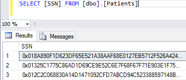
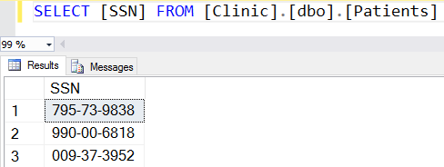
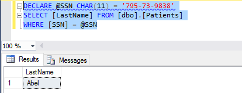
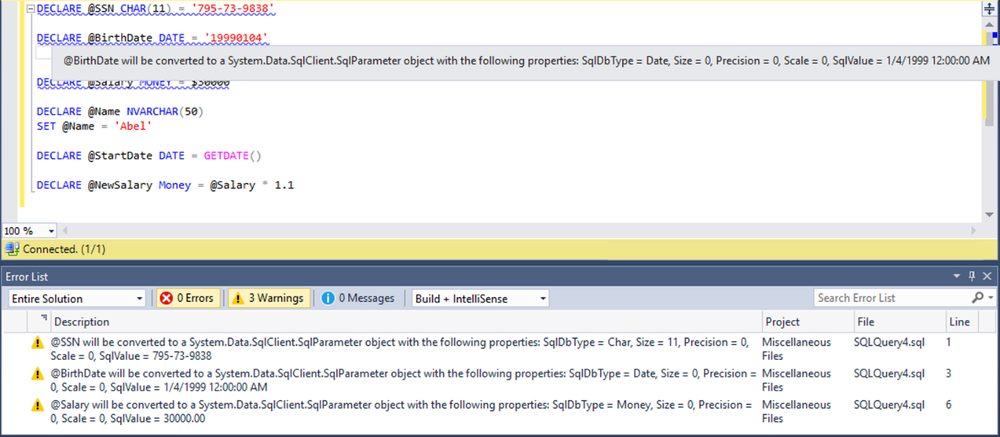
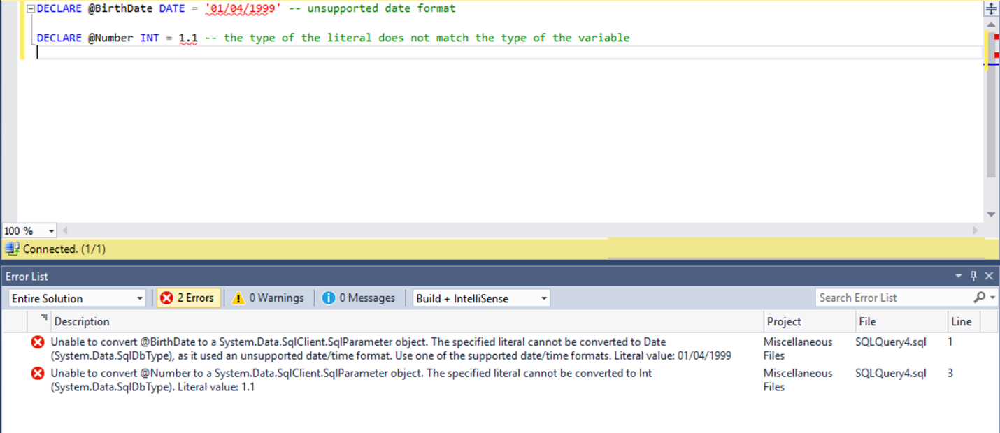

# Configure Always Encrypted using SQL Server Management Studio
[!INCLUDE[appliesto-ss-asdb-xxxx-xxx-md](../../../includes/appliesto-ss-asdb-xxxx-xxx-md.md)]

This article describes tasks for configuring Always Encrypted and managing databases that use Always Encrypted with [SQL Server Management Studio (SSMS)](../../../ssms/download-sql-server-management-studio-ssms.md).

When you use SSMS to configure Always Encrypted, SSMS handles both Always Encrypted keys and sensitive data, so both the keys and the data appear in plaintext inside the SSMS process. Therefore, it is important you run SSMS on a secure computer. If your database is hosted in SQL Server, make sure SSMS runs on a different computer than the computer hosting your SQL Server instance. As the primary goal of Always Encrypted is to ensure encrypted sensitive data is safe even if the database system gets compromised, executing a PowerShell script that processes keys or sensitive data on the SQL Server computer can reduce or defeat the benefits of the feature. For additional recommendations, see [Security Considerations for Key Management](../../../relational-databases/security/encryption/overview-of-key-management-for-always-encrypted.md#SecurityForKeyManagement).

SSMS does not support role separation between those who manage the database (DBAs) and those who manage cryptographic secrets and have access to plaintext data (Security Administrators and/or Application Administrators). If your organization enforces role separation, you should use PowerShell to configure Always Encrypted. For additional information, see [Overview of Key Management for Always Encrypted](../../../relational-databases/security/encryption/overview-of-key-management-for-always-encrypted.md) and [Configure Always Encrypted using PowerShell](../../../relational-databases/security/encryption/configure-always-encrypted-using-powershell.md).

## Configuring Always Encrypted using the Always Encrypted Wizard

The [Always Encrypted Wizard](../../../relational-databases/security/encryption/always-encrypted-wizard.md) is a powerful tool that allows you to set the desired encryption configuration for selected database columns. Depending on the current Always Encrypted configuration and the desired target configuration, the wizard can encrypt a column, decrypt it (remove encryption), or re-encrypt it (for example, using a new column encryption key or an encryption type that is different from the current type, configured for the column). Multiple columns can be configured in a single run of the wizard.

If you have not provisioned any keys for Always Encrypted, the wizard will auto-generate them for you. You just need to pick a key store for your column master key: Windows Certificate Store or Azure Key Vault. The wizard will auto-generate names for keys and their metadata objects in the database. If you need more control for how your keys are provisioned (and more choices for a key store containing a column master key), you can use the **New Column Master Key** and **New Column Encryption Key** dialogs (described below) to provision keys before you start the wizard. In the Always Encrypted Wizard, you can then pick the existing column encryption key.

For details of how to use the wizard, see  [Always Encrypted Wizard](../../../relational-databases/security/encryption/always-encrypted-wizard.md).

## Querying Encrypted Columns

This section describes how to:   
-   Retrieve ciphertext values stored in encrypted columns.   
-   Retrieve plaintext values stored in encrypted columns.   
-   Send plaintext values targeting encrypted columns (e.g. in `INSERT` or `UPDATE` statements and as a lookup parameters of `WHERE` clauses in `SELECT` statements).   

### Retrieving ciphertext values stored in encrypted columns    

To retrieve values from an encrypted column as ciphertext (without decrypting the values):
1.	Make sure Always Encrypted is disabled for the database connection for the Query Editor window, from which you are running your `SELECT` query. See [Enabling and disabling Always Encrypted for a database](#en-dis) connection below.      
2.	Run a `SELECT` query. Any data retrieved from encrypted columns will be returned as binary (encrypted) values.   

*Example*   
Assuming `SSN` is an encrypted column in the `Patients` table, the query shown below will retrieve binary ciphertext values, if Always Encrypted is disabled for the database connection.   


 
### Retrieving plaintext values stored in encrypted columns    

To retrieve values from an encrypted column as plaintext (to decrypt the values):   
1.	Make sure Always Encrypted is enabled for the database connection for the Query Editor window, from which you are running your `SELECT` query. This will instruct the .NET Framework Data Provider for SQL Server (used by SSMS) to decrypt data retrieved from encrypted columns. See [Enabling and disabling Always Encrypted for a database](#en-dis) below.
2.	Make sure you can access all column master keys configured for encrypted columns. For example, if your column master key is a certificate, you need to make sure the certificate is deployed on the machine, SSMS is running on. Or, if your column master key is a key stored in Azure Key Vault, you need to make sure you have permissions to access the key (Also, you might be prompted to sign in to Azure.)
3.	Run a `SELECT` query. Any data retrieved from encrypted columns will be returned as plaintext as values of the original data types.   

*Example*   
Assuming SSN is an encrypted `char(11)` column in the `Patients` table, the query, shown below, will return plaintext values, if Always Encrypted is enabled for the database connection and if you have access to the column master key configured for the `SSN` column.   


 
### Sending plaintext values targeting encrypted columns       

To execute a query that sends a value that targets an encrypted column, for example a query that inserts, updates or filters by a value stored in an encrypted column:   
1.	Make sure Always Encrypted is enabled for the database connection for the Query Editor window, from which you are running your `SELECT` query. This will instruct the .NET Framework Data Provider for SQL Server (used by SSMS) to encrypt parameterized Transact-SQL variables (see below) targeting encrypted columns. See [Enabling and disabling Always Encrypted for a database](#en-dis) below.   
2.	Make sure you can access all column master keys configured for encrypted columns. For example, if your column master key is a certificate, you need to make sure the certificate is deployed on the machine, SSMS is running on. Or, if your column master key is a key stored in Azure Key Vault, you need to make sure you have permissions to access the key (Also, you might be prompted to sign in to Azure.)   
3.	Ensure Parameterization for Always Encrypted is enabled for the Query Editor window. (Requires at least SSMS version 17.0.) Declare a Transact-SQL variable and initialize it with a value, you want to send (insert, update or filter by) to the database. See [Parameterization for Always Encrypted](#param) below for details.   
    > [!NOTE]
    > As Always Encrypted support a limited subset of type conversions, in many cases it is required that data type of a Transact-SQL variable is the same as the type of the target database column, it targets.   
4.	Run your query sending the value of the Transact-SQL variable to the database. SSMS will convert the variable to a query parameter and it will encrypt its value before sending it to the database.   

*Example*   
Assuming `SSN` is an encrypted `char(11)` column in the `Patients` table, the below script will attempt to find a row containing `'795-73-9838'` in the SSN column and return the value of the `LastName` column, providing Always Encrypted is enabled for the database connection,  Parameterization for Always Encrypted is enabled for the Query Editor window, and you have access to the column master key configured for the `SSN` column.   


 
### <a name="en-dis"></a> Enabling and disabling Always Encrypted for a database connection   

Enabling Always Encrypted for a database connection instructs the .NET Framework Data Provider for SQL Server, used by SQL Server Management Studio, to attempt to transparently:   
-	Decrypt any values that are retrieved from encrypted columns and returned in query results.   
-	Encrypt the values of the parameterized Transact-SQL variables that target encrypted database columns.   
To enable Always Encrypted for a database connection, specify `Column Encryption Setting=Enabled` in the **Additional Properties** tab of the **Connect to Server** dialog.    
To disable Always Encrypted for a database connection, specify `Column Encryption Setting=Disabled` or simply remove the setting of **Column Encryption Setting** from the **Additional Properties** tab of the **Connect to Server** dialog (its default value is **Disabled**).   

> [!TIP]
> To toggle between Always Encrypted being enabled and disabled for an existing Query Editor window:   
> 1.	Right-click anywhere in the Query Editor window.
> 2.	Select **Connection** > **Change Connection ...**, 
> 3.	Click **Options** >>,
> 4.	Select the **Additional Properties** tab and type `Column Encryption Setting=Enabled` (to enable the Always Encrypted behavior) or remove the setting (to disable the Always Encrypted behavior).   
> 5.	Click **Connect**.   
   
### <a name="param"></a>Parameterization for Always Encrypted   
 
Parameterization for Always Encrypted is a feature in SQL Server Management Studio that automatically converts Transact-SQL variables into query parameters (instances of [SqlParameter Class](https://msdn.microsoft.com/library/system.data.sqlclient.sqlparameter.aspx)). (Requires at least SSMS version 17.0.) This allows the underlying .NET Framework Data Provider for SQL Server to detect data targeting encrypted columns, and to encrypt such data before sending it to the database. 
  
Without parameterization, the .NET Framework Data Provider passes each statement, you author in the Query Editor, as a non-parameterized query. If the query contains literals or Transact-SQL variables that target encrypted columns, the .NET Framework Data Provider for SQL Server will not be able to detect and encrypt them, before sending the query to the database. As a result, the query will fail due to type mismatch (between the plaintext literal Transact-SQL variable and the encrypted column). For example, the following query will fail without parameterization, assuming the `SSN` column is encrypted.   

```sql
DECLARE @SSN NCHAR(11) = '795-73-9838'
SELECT * FROM [dbo].[Patients]
WHERE [SSN] = @SSN
```

#### Enabling/Disabling Parameterization for Always Encrypted   


Parameterization for Always Encrypted is disabled by default.    

To enable/disable Parameterization for Always Encrypted for the current Query Editor window:   
1.	Select **Query** from the main menu.   
2.	Select **Query Options...**.   
3.	Navigate to **Execution** > **Advanced**.   
4.	Select or unselect **Enable Parameterization for Always Encrypted**.   
5.	Click **OK**.   

To enable/disable Parameterization for Always Encrypted for future Query Editor windows:   
1.	Select **Tools** from the main menu.   
2.	Select **Options...**.   
3.	Navigate to **Query Execution** > **SQL Server** > **Advanced**.   
4.	Select or unselect **Enable Parameterization for Always Encrypted**.   
5.	Click **OK**.   

If you execute a query in a Query Editor window that uses a database connection with Always Encrypted enabled, but parameterization is not enabled for the Query Editor window, you will be prompted to enable it.   
> [!NOTE]
> Parameterization for Always Encrypted works only in Query Editor windows that use database connections with Always Encrypted enabled (see [Enabling and disabling Always Encrypted for a database](#en-dis)). No Transact-SQL variables will be parameterized if the Query Editor window uses a database connection without Always Encrypted enabled.   

#### How Parameterization for Always Encrypted works   

If both Parameterization for Always Encrypted and the Always Encrypted behavior in the database connection are enabled for a Query Editor window, SQL Server Management Studio will attempt parameterize Transact-SQL variables that meet the following pre-requisite conditions:    
- Are declared and initialized in the same statement (inline initialization). Variables declared using separate `SET` statements will not be parameterized.   
- Are initialized using a single literal. Variables initialized using expressions including any operators or functions will not be parameterized.      

Below are examples of variable, SQL Server Management Studio will parameterize.   
```sql
DECLARE @SSN char(11) = '795-73-9838';
   
DECLARE @BirthDate date = '19990104';
DECLARE @Salary money = $30000;
```

And, here are a few examples of variables SQL Server Management Studio will not attempt to parameterize:   
```sql
DECLARE @Name nvarchar(50); --Initialization seperate from declaration
SET @Name = 'Abel';
   
DECLARE @StartDate date = GETDATE(); -- a function used instead of a literal
   
DECLARE @NewSalary money = @Salary * 1.1; -- an expression used instead of a literal
```
 
For an attempted parameterization to succeed:   
- The type of the literal used for the initialization of the variable to be parametrized, must match the type in the variable declaration.   
- If the declared type of the variable is a date type or a time type, the variable must be initialized using a string using one of the following ISO 8601-compliant formats.   

Here are the examples of Transact-SQL variable declarations that will result in parameterization errors:   
```sql
DECLARE @BirthDate date = '01/04/1999' -- unsupported date format   
   
DECLARE @Number int = 1.1 -- the type of the literal does not match the type of the variable   
```
SQL Server Management Studio uses Intellisense to inform you which variables can be successfully parameterized and which parameterization attempts fail (and why).   

A declaration of a variable that can be successfully parameterized is marked with a warning underline in the Query Editor. If you hover on a declaration statement that got marked with a warning underline, you will see the results of the parameterization process, including the values of the key properties of the resulting [SqlParameter](https://msdn.microsoft.com/library/system.data.sqlclient.sqlparameter.aspx) object (the variable is mapped to): [SqlDbType](https://msdn.microsoft.com/library/system.data.sqlclient.sqlparameter.sqldbtype.aspx), [Size](https://msdn.microsoft.com/library/system.data.sqlclient.sqlparameter.size.aspx), [Precision](https://msdn.microsoft.com/library/system.data.sqlclient.sqlparameter.precision.aspx), [Scale](https://msdn.microsoft.com/library/system.data.sqlclient.sqlparameter.scale.aspx), [SqlValue](https://msdn.microsoft.com/library/system.data.sqlclient.sqlparameter.sqlvalue.aspx). You can also see the complete list of all variables that have been successfully parameterized in the **Warning** tab of the **Error List** view. To open the **Error List** view, select **View** from the main menu and then select **Error List**.    

If SQL Server Management Studio has attempted to parameterize a variable, but the parameterization has failed, the declaration of the variable will be marked with an error underline. If you hover on the declaration statement that has been marked with an error underline, you will get the results about the error. You can also see the complete list of parameterization errors for all variables in the **Error** tab of the **Error List** view. To open the **Error List** view, select **View** from the main menu and then select **Error List**.   

The below screenshot shows an example of six variable declarations. SQL Server Management Studio successfully parameterized the first three variables. The last three variables did not meet the pre-requisite conditions for parameterization, and therefore, SQL Server Management Studio did not attempt to parameterize them (their declarations are not marked in any way).   


 
Another example below, shows two variables that meet pre-requisite conditions for parameterization, but the parameterization attempt has failed because the variables are incorrectly initialized.    
 

 
> [!NOTE]
> As Always Encrypted supports a limited subset of type conversions, in many cases it is required that the data type of a Transact-SQL variable is the same as the type of the target database column, it targets. For example, assuming type of the `SSN` column in the `Patients` table is `char(11)`, the below query will fail, as the type of the `@SSN` variable, which is `nchar(11)`, does not match the type of the column.   

```sql
DECLARE @SSN nchar(11) = '795-73-9838'
SELECT * FROM [dbo].[Patients]
WHERE [SSN] = @SSN;
```

    Msg 402, Level 16, State 2, Line 5   
    The data types char(11) encrypted with (encryption_type = 'DETERMINISTIC', 
    encryption_algorithm_name = 'AEAD_AES_256_CBC_HMAC_SHA_256', column_encryption_key_name = 'CEK_Auto1', 
    column_encryption_key_database_name = 'Clinic') collation_name = 'Latin1_General_BIN2' 
    and nchar(11) encrypted with (encryption_type = 'DETERMINISTIC', 
    encryption_algorithm_name = 'AEAD_AES_256_CBC_HMAC_SHA_256', column_encryption_key_name = 'CEK_Auto1', 
    column_encryption_key_database_name = 'Clinic') are incompatible in the equal to operator.

> [!NOTE]
> Without parameterization, the entire query, including type conversions, is processed inside SQL Server/Azure SQL Database. With parameterization enabled, some type conversions are performed by .NET Framework inside SQL Server Management Studio. Due to differences between the .NET Framework type system and the SQL Server type system (e.g. different precision of some types, such as float), a query executed with parameterization enabled can produce different results than the query executed without parameterization enabled. 

#### Permissions      

To run any queries against encrypted columns, including queries that retrieve data in ciphertext,  you need the `VIEW ANY COLUMN MASTER KEY DEFINITION` and `VIEW ANY COLUMN ENCRYPTION KEY DEFINITION` permissions in the database.   
In addition to the above permissions, to decrypt any query results or to encrypt any query parameters (produced by parameterizing Transact-SQL variables), you also need access to the column master key protecting the target columns:   
- **Certificate Store - Local computer** You must have `Read` access to the certificate that is used a column master key, or be the administrator on the computer.   
- **Azure Key Vault** You need the `get`, `unwrapKey`, and verify permissions on the vault containing the column master key.   
- **Key Store Provider (CNG)** The required permission and credentials, you might be prompted for when using a key store or a key, depend on the store and the KSP configuration.   
- **Cryptographic Service Provider (CAPI)** The required permission and credentials, you might be prompted for when using a key store or a key, depend on the store and the CSP configuration.   

For more information, see [Create and Store Column Master Keys (Always Encrypted)](../../../relational-databases/security/encryption/create-and-store-column-master-keys-always-encrypted.md).


<a name="provisioncmk"></a>
## Provisioning Column Master Keys (New Column Master Key)

The **New Column Master Key** dialog allows you to generate a column master key or pick an existing key in a key store, and create column master key metadata for the created or selected key in the database.

1.	Using **Object Explorer**, navigate to the **Security>Always Encrypted Keys** folder under your database.
2.	Right click on the **Column Master Keys** folder and select **New Column Master Key...**. 
3.	In the **New Column Master Key** dialog, enter the name of the column master key metadata object.
4.	Select a key store:
    - **Certificate Store - Current User** - indicates the Current User certificate store location in the Windows Certificate Store, which is your personal store. 
    - **Certificate Store - Local computer** - indicates the Local computer certificate store location in the Windows Certificate Store. 
    - **Azure Key Vault** -  you will need to sign in to Azure (click **Sign in**). Once you sign in, you will be able to pick one of your Azure subscriptions and a key vault.
    - **Key Store Provider (CNG)** - indicates a key store that is accessible via a key store provider (KSP) that implements the Cryptography Next Generation (CNG) API. Typically, this type of a store is a hardware security module (HSM). After you select this option, you will need to pick a KSP. **Microsoft Software Key Store Provider** is selected by default. If you want to use a column master key stored in an HSM, select a KSP for your device (it must be installed and configured on the computer before you open the dialog).
    -	**Cryptographic Service Provider (CAPI)** - a key store that is accessible via a cryptographic service provider (CSP) that implements the Cryptography API (CAPI). Typically, such a store is a hardware security module (HSM). After you select this option, you will need to pick a CSP.  If you want to use a column master key stored in an HSM, select a CSP for your device (it must be installed and configured on the computer before you open the dialog).
    
    > [!NOTE]
    > Since CAPI is a deprecated API, the Cryptographic Service Provider (CAPI) option is disabled by default. You can enable by creating the CAPI Provider Enabled DWORD value under the **[HKEY_CURRENT_USER\Software\Microsoft\Microsoft SQL Server\sql13\Tools\Client\Always Encrypted]** key in Windows Registry, and setting it to 1. You should use CNG instead of CAPI, unless your key store does not support CNG.
   
    For more information about the above key stores, see [Create and Store Column Master Keys (Always Encrypted)](../../../relational-databases/security/encryption/create-and-store-column-master-keys-always-encrypted.md).

5.	Pick an existing key in your key store, or click the **Generate Key** or **Generate Certificate** button, to create a key in the key store. 
6.	Click **OK** and the new key will show up in the list. 

SQL Server Management Studio will create metadata for your column master key in the database. The dialog achieves this by generating and issuing a [CREATE COLUMN MASTER KEY (Transact-SQL)](../../../t-sql/statements/create-column-master-key-transact-sql.md) statement.


<a name="provisioncek"></a> 
## Provisioning Column Encryption Keys (New Column Encryption Key)

The **New Column Encryption Key** dialog allows you to generate a column encryption key, encrypt it with a column master key, and create the column encryption key metadata in the database.

1.	Using **Object Explorer**, navigate to the **Security/Always Encrypted Keys** folder under your database.
2.	Right click on the **Column Encryption Keys** folder and select **New Column Encryption Key...**. 
3.	In the **New Column Encryption Key** dialog, enter the name of the column encryption key metadata object.
4.	Select a metadata object that represents your column master key in the database.
5.	Click **OK**. 


SQL Server Management Studio will generate a new column encryption key and then it will retrieve the metadata for the column master key you selected from the database. SQL Server Management Studio will then use the column master key metadata to contact the key store containing your column master key and encrypt the column encryption key. Finally, the metadata for the new column encryption key will be created in the database. The dialog achieves this by generating and issuing a [CREATE COLUMN ENCRYPTION KEY (Transact-SQL)](../../../t-sql/statements/create-column-encryption-key-transact-sql.md) statement.

### Permissions

You need the *ALTER ANY ENCRYPTION MASTER KEY* and *VIEW ANY COLUMN MASTER KEY DEFINITION* database permissions in the database for the dialog to create the column encryption key metadata and to access column master key metadata.
To access a key store and use the column master key, you might require permissions on the key store or/and the key:
- **Certificate Store - Local computer** - you must have Read access to the certificate that is used as a column master key, or be the administrator on the computer.
- **Azure Key Vault** - you need the *get*, *unwrapKey*, *wrapKey*, *sign*, and *verify*  permissions on the vault containing the column master key.
- **Key Store Provider (CNG)** - you might be prompted for the required permission and credentials when using a key store or a key, depending on the store and the KSP configuration.
- **Cryptographic Service Provider (CAPI)** - you might be prompted for the required permission and credentials when using a key store or a key, depending on the store and the CSP configuration.

For more information, see [Create and Store Column Master Keys (Always Encrypted)](../../../relational-databases/security/encryption/create-and-store-column-master-keys-always-encrypted.md).

<a name="rotatecmk"></a>
## Rotating Column Master Keys

The rotation of a column master key is the process of replacing an existing column master key with a new column master key. You may need to rotate a key if it has been compromised, or in order to comply with your organization's policies or compliance regulations that mandate cryptographic keys must be rotated on a regular basis. A column master key rotation involves decrypting column encryption keys that are protected with the current column master key, re-encrypting them using the new column master key, and updating the key metadata. For more information, see [Overview of Key Management for Always Encrypted](../../../relational-databases/security/encryption/overview-of-key-management-for-always-encrypted.md).

**Step 1: Provision a new column master key**

Provision a new column master key, by following the steps in the Provisioning Column Master Keys section above.

**Step 2: Encrypt column encryption keys with the new column master key**

A column master key typically protects one or more column encryption keys. Each column encryption key has an encrypted value stored in the database, that is the product of encrypting the column encryption key with the column master key.
In this step, encrypt each of the column encryption keys that are protected with the column master key you are rotating, with the new column master key, and store the new encrypted value in the database. As a result, each column encryption key that is affected by the rotation will have two encrypted values: one value encrypted with the existing column master key, and a new value encrypted with the new column master key.

1.	Using **Object Explorer**, navigate to the **Security>Always Encrypted Keys>Column Master Keys** folder and locate the column master key you are rotating.
2.	Right-click on the column master key and select **Rotate**.
3.	In the **Column Master Key Rotation** dialog, select the name of your new column master key, you created in Step 1, in the **Target** field.
4.	Review the list of column encryption keys, protected by the existing column master keys. These keys will be affected by the rotation.
5.	Click **OK**.

SQL Server Management Studio will obtain the metadata of the column encryption keys that are protected with the old column master key, and the metadata of the old and the new column master keys. Then, SSMS will use the column master key metadata to access the key store containing the old column master key and decrypt the column encryption key(s). Subsequently, SSMS will access the key store holding the new column master key to produce a new set of encrypted values of the column encryption keys, and then it will add the new values to the metadata (generating and issuing [ALTER COLUMN ENCRYPTION KEY (Transact-SQL)](../../../t-sql/statements/alter-column-encryption-key-transact-sql.md) statements).

> [!NOTE]
> Make sure each of the column encryption keys, encrypted with the old column master key, is not encrypted with any other column master key. In other words, each column encryption key, impacted by the rotation, must have exactly one encrypted value in the database. If any affected column encryption key has more than one encrypted value, you need to remove the value before you can proceed with the rotation (see *Step 4* on how to remove an encrypted value of a column encryption key).

**Step 3: Configure your applications with the new column master key**

In this step you need to make sure that all your client applications that query database columns protected with the column master key that you are rotating can access the new column master key  (i.e. database columns encrypted with a column encryption key that is encrypted with the column master key, being rotated). This step depends on the type of key store your new column master key is in. For example:
- If the new column master key is a certificate stored in Windows Certificate Store, you need to deploy the certificate to the same certificate store location (*Current User* or *Local computer*) as the location specified in the key path of your column master key in the database. The application needs to be able to access the certificate:
    - If the certificate is stored in the *Current User* certificate store location, the certificate needs to be imported into the Current User store of the application's Windows identity (user).
    - If the certificate is stored in the *Local computer* certificate store location, the application's Windows identity must have permission to access the certificate.
- If the new column master key is stored in Microsoft Azure Key Vault, the application must be implemented so that it can authenticate to Azure and has permission to access the key.

For details, see [Create and Store Column Master Keys (Always Encrypted)](../../../relational-databases/security/encryption/create-and-store-column-master-keys-always-encrypted.md).

> [!NOTE]
> At this point in the rotation, both the old column master key and the new column master key are valid and can be used to access the data.

**Step 4: Clean up column encryption key values encrypted with the old column master key**

Once you have configured all your applications to use the new column master key, remove the values of column encryption keys that are encrypted with the *old* column master key from the database. Removing old values will ensure you are ready for the next rotation (remember, each column encryption key, protected with a column master key to be rotated, must have exactly one encrypted value).

Another reason to clean up the old value before archiving or removing the old column master key, is performance-related: when querying an encrypted column, an Always Encrypted-enabled client driver might need to attempt to decrypt two values: the old value and the new one. The driver does not know which of the two column master keys is valid in the application's environment so the driver will retrieve both encrypted values from the server. If decrypting one of the values fails, because it is protected with the column master key is that not available (e.g. it is the old column master key that has been removed from the store), the driver will attempt to decrypt another value using the new column master key.

> [!WARNING]
> If you remove the value of a column encryption key before its corresponding column master key has been made available to an application, the application will no longer be able to decrypt the database column.

1.	Using **Object Explorer**, navigate to the **Security>Always Encrypted Keys** folder and locate the existing column master key you want to replace.
2.	Right-click on your existing column master key and select **Cleanup**.
3.	Review the list of column encryption key values to be removed.
4.	Click **OK**.

SQL Server Management Studio will issue [ALTER COLUMN ENCRYPTION KEY (Transact-SQL)](../../../t-sql/statements/alter-column-encryption-key-transact-sql.md) statements to drop encrypted values of column encryption keys that are encrypted with the old column master key.

**Step 5: Delete metadata for your old column master key**

If you choose to remove the definition of the old column master key from the database, use the below steps. 
1.	Using **Object Explorer**, navigate to the **Security>Always Encrypted Keys>Column Master Keys** folder and locate the old column master key to be removed from the database.
2.	Right-click on the old column master key and select **Delete**. (This will generate and issue a [DROP COLUMN MASTER KEY (Transact-SQL)](../../../t-sql/statements/drop-column-master-key-transact-sql.md) statement to remove the column master key metadata.)
3.	Click **OK**.

> [!NOTE]
> It is highly recommended you do not permanently delete the old column master key after the rotation. Instead, you should keep the old column master key in its current key store or archive it in another secure place. If you restore your database from a backup file to a point in time before the new column master key was configured, you will need the old key to access the data.

### Permissions

Rotating a column master key requires the following database permissions:

- **ALTER ANY COLUMN MASTER KEY** - required to create metadata for the new column master key and deleting the metadata for the old column master key.
- **ALTER ANY COLUMN ENCRYPTION KEY** - required to modify column encryption key metadata (add new encrypted values).
- **VIEW ANY COLUMN MASTER KEY DEFINITION** - required to access and read the metadata of the column master keys.
- **VIEW ANY COLUMN ENCRYPTION KEY DEFINITION** - required to access and read the metadata of the column encryption keys. 

You also need to be able to access both the old column master key and the new column master key in their key stores. To access a key store and use a column master key, you might require permissions on the key store or/and the key:
- **Certificate Store - Local computer** - you must have Read access to the certificate that is used a column master key, or be the administrator on the computer.
- **Azure Key Vault** - you need the *create*, *get*, *unwrapKey*, *wrapKey*, *sign*, and *verify* permissions on the vault containing the column master key(s).
- **Key Store Provider (CNG)** - you might be prompted for the required permission and credentials when using a key store or a key, depending on the store and the KSP configuration.
- **Cryptographic Service Provider (CAPI)** - you might be prompted for the required permission and credentials when using a key store or a key, depending on the store and the CSP configuration.

For more information, see [Create and Store Column Master Keys (Always Encrypted)](../../../relational-databases/security/encryption/create-and-store-column-master-keys-always-encrypted.md).

<a name="rotatecek"></a> 
## Rotating Column Encryption Keys

Rotating a column encryption key involves decrypting the data in all columns that are encrypted with the key to be rotated out, and re-encrypting the data using the new column encryption key.

>[!NOTE]
> Rotating a column encryption key can take a very long time if the tables containing columns encrypted with the key being rotated are large. While the data is being re-encrypted, your applications cannot write to the impacted tables. Therefore, your organization needs to plan a column encryption key rotation very carefully.
To rotate a column encryption key, use the Always Encrypted Wizard.

1.	Open the wizard for your database: right-click your database, point to **Tasks**, and then click **Encrypt Columns**.
2.	Review the **Introduction** page, and then click **Next**.
3.	On the **Column Selection** page, expand the tables and locate all columns you want to replace that are currently encrypted with the old column encryption key.
4.	For each column encrypted with the old column encryption key, set **Encryption Key** to a new auto-generated key. **Note:** Alternatively, you can create a new column encryption key before running the wizard - see the *Provisioning Column Encryption Keys* section above.
5.	On the **Master Key Configuration** page, select a location to store the new key, and select a master key source, and then click **Next**. **Note:** If you are using an existing column encryption key (not an auto-generated one), there is no action to perform on this page.
6.	On the **Validation page**, choose whether to run the script immediately or create a PowerShell script, and then click **Next**.
7.	On the **Summary** page, review the options you have selected, and then click **Finish** and close the wizard when completed.
8.	Using **Object Explorer**, navigate to the **Security/Always Encrypted Keys/Column Encryption Keys** folder and locate your old column encryption key, to be removed from the database. Right-click on the key and select **Delete**.

### Permissions

Rotating a column encryption key requires the following database permissions:
**ALTER ANY COLUMN MASTER KEY** - required if you use a new auto-generated column encryption key (a new column master key and its new metadata will also be generated).
**ALTER ANY COLUMN ENCRYPTION KEY** -required to add metadata for the new column encryption key.
**VIEW ANY COLUMN MASTER KEY DEFINITION** - required to access and read the metadata of the column master keys.
**VIEW ANY COLUMN ENCRYPTION KEY DEFINITION** - required to access and read the metadata of the column encryption keys.

You also need to be able to access column master keys for both the new and the old column encryption key. To access a key store and use a column master key, you might require permissions on the key store or/and the key:
- **Certificate Store - Local computer** - you must have the Read access to the certificate that is used a column master key, or be the administrator on the computer.
- **Azure Key Vault** - you need the get, unwrapKey, and verify permissions on the vault containing the column master key.
- **Key Store Provider (CNG)** - you might be prompted for the required permission and credentials when using a key store or a key, depending on the store and the KSP configuration.
- **Cryptographic Service Provider (CAPI)** - you might be prompted for the required permission and credentials when using a key store or a key, depending on the store and the CSP configuration.

For more information, see [Create and Store Column Master Keys (Always Encrypted)](../../../relational-databases/security/encryption/create-and-store-column-master-keys-always-encrypted.md).

## Performing DAC Upgrade Operations when Database or DACPAC uses Always Encrypted

[DAC operations](../../data-tier-applications/data-tier-applications.md) are supported on DACPAC files and databases with schemas containing encrypted columns. Special considerations apply to the DAC upgrade operation - see [Upgrade a Data-tier Application](../../../relational-databases/data-tier-applications/upgrade-a-data-tier-application.md) on how to perform a DAC upgrade operation in various tools, including SSMS. 

When you upgrade a database using a DACPAC and either the DACPAC or the target database has encrypted columns, the upgrade operation will trigger a data encryption operation if all of the following conditions are met:
- The database contains a column with data.
- The same column exists in the DACPAC.
- The encryption configuration of the column in the database is different than the configuration the corresponding column in the DACPAC. Please, see the below table for details.

| Condition|Action|
|:---|:---|
|The column is encrypted in the DACPAC and it is not encrypted in the database.| The data in the column will be encrypted.|
|The column is not encrypted in the DACPAC and it is encrypted in the database.| The data in the column will be decrypted (the encryption will be removed for the column).|
| The column is encrypted both in the DACPAC and the database, but the column in the DACPAC uses a different encryption type or/and a different column encryption key than the corresponding column in the database.|The data in the column will be decrypted and then re-encrypted to match the encryption configuration in the DACPAC.|

> [!NOTE]
> If the column master key configured for the column in the database or the DACPAC is stored in Azure Key Vault, you will be prompted to sign in to Azure (if you're not already signed in).

### Permissions

To perform a DAC upgrade operation if Always Encrypted is setup in the DACPAC or in the target database, you might need some or all of the below permissions, depending on the differences between the schema in the DACPAC and the target database schema.

*ALTER ANY COLUMN MASTER KEY*, *ALTER ANY COLUMN ENCRYPTION KEY*, *VIEW ANY COLUMN MASTER KEY DEFINITION*, *VIEW ANY COLUMN ENCRYPTION KEY DEFINITION*

If the upgrade operation triggers a data encryption operation, you also need to be able to access column master keys configured for the impacted columns:
- **Certificate Store - Local computer** - you must have Read access to the certificate that is used a column master key, or be the administrator on the computer.
- **Azure Key Vault** - you need the *create*, *get*, *unwrapKey*, *wrapKey*, *sign*, and *verify* permissions on the vault containing the column master key.
- **Key Store Provider (CNG)** - you might be prompted for the required permission and credentials when using a key store or a key, depending on the store and the KSP configuration.
- **Cryptographic Service Provider (CAPI)** - you might be prompted for the required permission and credentials when using a key store or a key, depending on the store and the CSP configuration.

For more information, see [Create and Store Column Master Keys (Always Encrypted)](../../../relational-databases/security/encryption/create-and-store-column-master-keys-always-encrypted.md).

## Migrating Databases with Encrypted Columns using BACPAC

When you export a database, all data stored in encrypted columns are retrieved and put into the resulting [BACPAC](../../data-tier-applications/data-tier-applications.md) (in encrypted form). The resulting BACPAC also contains the metadata for Always Encrypted keys.

When you import the BACPAC into a database, the encrypted data from the BACPAC is loaded into the database and Always Encrypted key metadata is re-created.

If you have an application that is configured to modify or retrieve the encrypted data stored in the source database (the one you exported), you do not need to do anything special to enable the application to query the encrypted data in the target database, as the keys in both databases are the same.


### Permissions

You need *ALTER ANY COLUMN MASTER KEY* and *ALTER ANY COLUMN ENCRYPTION KEY* on the source database. You need *ALTER ANY COLUMN MASTER KEY*, *ALTER ANY COLUMN ENCRYPTION KEY*, *VIEW ANY COLUMN MASTER KEY DEFINITION*, and *VIEW ANY COLUMN ENCRYPTION* on the target database.

## Migrating Databases with Encrypted Columns using SQL Server Import and Export Wizard

Compared to using BACPAC files, the [SQL Server Import and Export Wizard](~/integration-services/import-export-data/import-and-export-data-with-the-sql-server-import-and-export-wizard.md) gives you more control over how the data stored in encrypted columns are handled during the data migration.

- If your data source is a database using Always Encrypted, you can configure your data source connection so that the data stored in encrypted columns is decrypted during the export operation, or remains encrypted.
- If your data target is a database using Always Encrypted, you can configure your data target connection so that the data targeting encrypted columns is encrypted.

To enable decryption (for the data source) or encryption (for the data target), you need to configure your data source/target connection to use the [.Net Framework Data Provider for SqlServer](https://msdn.microsoft.com/library/system.data.sqlclient.aspx) and you need to set the Column Encryption Setting connection string keywords to *Enabled*.

The below table lists possible migration scenarios and how they relate to Always Encrypted along with the data source and data target configuration for each connection.

| Scenario|Source Connection Configuration|	Target Connection Configuration
|:---|:---|:---
|Encrypt data on migration (the data is stored as plaintext in the data source, and is migrated to encrypted columns in the data target).| Data provider/driver: *any*<br><br>Column Encryption Setting = Disabled<br><br>(if .Net Framework Data Provider for SqlServer and .NET Framework 4.6 or later are used.) | Data provider/driver: *.Net Framework Data Provider for SqlServer* (.NET Framework 4.6 or later required)<br><br>Column Encryption Setting = Enabled
| Decrypt data on migration (the data is stored in encrypted columns in the data source, and it is migrated in plaintext to the data target; if the data target is a database, the target columns are not encrypted).<br><br>**Note:** the target tables with encrypted columns must exist prior to the migration.|Data provider/driver: *.Net Framework Data Provider for SqlServer* (.NET Framework 4.6 or later required)<br><br>Column Encryption Setting=Enabled|Data provider/driver: *any*<br><br>Column Encryption Setting = Disabled<br><br>(if .Net Framework Data Provider for SqlServer and .NET Framework 4.6 or later are used.)
|Re-encrypt data on migration (the data is stored in encrypted columns in the data source, and it is migrated in plaintext to the data target to the columns that use different encryption types of column encryption keys).<br><br>**Note:** the target tables with encrypted columns must exist prior to the migration.| Data provider/driver: *.Net Framework Data Provider for SqlServer* (.NET Framework 4.6 or later required)<br><br>Column Encryption Setting=Enabled|Data provider/driver: *.Net Framework Data Provider for SqlServer* (.NET Framework 4.6 or later required)<br><br>Column Encryption Setting=Enabled
|Move encrypted data without decrypting it.<br><br>**Note:** the target tables with encrypted columns must exist prior to the migration.| Data provider/driver: *any*<br>Column Encryption Setting = Disabled<br><br>(if .Net Framework Data Provider for SqlServer and .NET Framework 4.6 or later are used.)| Data provider/driver: *any*<br>Column Encryption Setting = Disabled<br><br>(if .Net Framework Data Provider for SqlServer and .NET Framework 4.6 or later are used.)<br><br>The user must have ALLOW_ENCRYPTED_VALUE_MODIFICATIONS set to ON.<br><br>For details, see [Migrate Sensitive Data Protected by Always Encrypted](../../../relational-databases/security/encryption/migrate-sensitive-data-protected-by-always-encrypted.md).


### Permissions

To **encrypt** or **decrypt** data stored in the data source, you need the *VIEW ANY COLUMN MASTER KEY DEFINITION* and *VIEW ANY COLUMN ENCRYPTION KEY DEFINITION* permissions in the source database.

You also need access to column master keys, configured for the columns, storing data you are encrypted or decrypting:
- **Certificate Store - Local computer** - you must have the Read access to the certificate that is used a column master key, or be the administrator on the computer.
- **Azure Key Vault** - you need the get, unwrapKey, wrapKey, sign, and verify permissions on the vault containing the column master key.
- **Key Store Provider (CNG)** - the required permission and credentials, you might be prompted for when using a key store or a key, depend on the store and the KSP configuration.
- **Cryptographic Service Provider (CAPI)** - the required permission and credentials, you might be prompted for when using a key store or a key, depend on the store and the CSP configuration.
For more information, see [Create and Store Column Master Keys (Always Encrypted)](../../../relational-databases/security/encryption/create-and-store-column-master-keys-always-encrypted.md).

## See Also
- [Always Encrypted (Database Engine)](../../../relational-databases/security/encryption/always-encrypted-database-engine.md)
- [Always Encrypted Wizard](../../../relational-databases/security/encryption/always-encrypted-wizard.md)
- [Overview of Key Management for Always Encrypted](../../../relational-databases/security/encryption/overview-of-key-management-for-always-encrypted.md)
- [Create and Store Column Master Keys (Always Encrypted)](../../../relational-databases/security/encryption/create-and-store-column-master-keys-always-encrypted.md)
- [Always Encrypted (client development)](../../../relational-databases/security/encryption/always-encrypted-client-development.md)
- [CREATE COLUMN MASTER KEY (Transact-SQL)](../../../t-sql/statements/create-column-master-key-transact-sql.md)
- [DROP COLUMN MASTER KEY (Transact-SQL)](../../../t-sql/statements/drop-column-master-key-transact-sql.md)
- [CREATE COLUMN ENCRYPTION KEY (Transact-SQL)](../../../t-sql/statements/create-column-encryption-key-transact-sql.md)
- [ALTER COLUMN ENCRYPTION KEY (Transact-SQL)](../../../t-sql/statements/alter-column-encryption-key-transact-sql.md)
- [DROP COLUMN ENCRYPTION KEY (Transact-SQL)](../../../t-sql/statements/drop-column-encryption-key-transact-sql.md) 
- [sys.column_master_keys (Transact-SQL)](../../../relational-databases/system-catalog-views/sys-column-master-keys-transact-sql.md)
- [sys.column_encryption_keys (Transact-SQL)](../../../relational-databases/system-catalog-views/sys-column-encryption-keys-transact-sql.md)
- [Configure Always Encrypted using PowerShell](../../../relational-databases/security/encryption/configure-always-encrypted-using-powershell.md)


