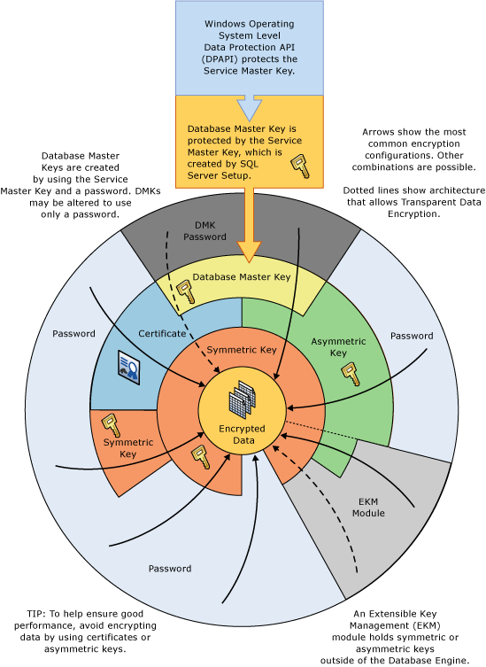

# Encryption Hierarchy
[!INCLUDE[appliesto-ss-asdb-xxxx-xxx-md](../../../includes/appliesto-ss-asdb-xxxx-xxx-md.md)]
  [!INCLUDE[ssNoVersion](../../../includes/ssnoversion-md.md)] encrypts data with a hierarchical encryption and key management infrastructure. Each layer encrypts the layer below it by using a combination of certificates, asymmetric keys, and symmetric keys. Asymmetric keys and symmetric keys can be stored outside of [!INCLUDE[ssNoVersion](../../../includes/ssnoversion-md.md)] in an Extensible Key Management (EKM) module.  
  
 The following illustration shows that each layer of the encryption hierarchy encrypts the layer beneath it, and displays the most common encryption configurations. The access to the start of the hierarchy is usually protected by a password.  
  
   
  
 Keep in mind the following concepts:  
  
-   For best performance, encrypt data using symmetric keys instead of certificates or asymmetric keys.  
  
-   Database master keys are protected by the Service Master Key. The Service Master Key is created by [!INCLUDE[ssNoVersion](../../../includes/ssnoversion-md.md)] setup and is encrypted with the Windows Data Protection API (DPAPI).  
  
-   Other encryption hierarchies stacking additional layers are possible.  
  
-   An Extensible Key Management (EKM) module holds symmetric or asymmetric keys outside of SQL Server.  
  
-   Transparent Data Encryption (TDE) must use a symmetric key called the database encryption key which is protected by either a certificate protected by the database master key of the master database, or by an asymmetric key stored in an EKM.  
  
-   The Service Master Key and all Database Master Keys are symmetric keys.  
  
 The following illustration shows the same information in an alternative manner.  
  
   
  
 This diagram illustrates the following additional concepts:  
  
-   In this illustration, arrows indicate common encryption hierarchies.  
  
-   Symmetric and asymmetric keys in the EKM can protect access to the symmetric and asymmetric keys stored in [!INCLUDE[ssNoVersion](../../../includes/ssnoversion-md.md)]. The dotted line associated with EKM indicates that keys in the EKM could replace the symmetric and asymmetric keys stored in [!INCLUDE[ssNoVersion](../../../includes/ssnoversion-md.md)].  
  
## Encryption Mechanisms  
 [!INCLUDE[ssNoVersion](../../../includes/ssnoversion-md.md)] provides the following mechanisms for encryption:  
  
-   [!INCLUDE[tsql](../../../includes/tsql-md.md)] functions  
  
-   Asymmetric keys  
  
-   Symmetric keys  
  
-   Certificates  
  
-   Transparent Data Encryption  
  
### Transact-SQL Functions  
 Individual items can be encrypted as they are inserted or updated using [!INCLUDE[tsql](../../../includes/tsql-md.md)] functions. For more information, see [ENCRYPTBYPASSPHRASE &#40;Transact-SQL&#41;](../../../t-sql/functions/encryptbypassphrase-transact-sql.md) and [DECRYPTBYPASSPHRASE &#40;Transact-SQL&#41;](../../../t-sql/functions/decryptbypassphrase-transact-sql.md).  
  
### Certificates  
 A public key certificate, usually just called a certificate, is a digitally-signed statement that binds the value of a public key to the identity of the person, device, or service that holds the corresponding private key. Certificates are issued and signed by a certification authority (CA). The entity that receives a certificate from a CA is the subject of that certificate. Typically, certificates contain the following information.  
  
-   The public key of the subject.  
  
-   The identifier information of the subject, such as the name and e-mail address.  
  
-   The validity period. This is the length of time that the certificate is considered valid.  
  
     A certificate is valid only for the period of time specified within it; every certificate contains **Valid From** and **Valid To** dates. These dates set the boundaries of the validity period. When the validity period for a certificate has passed, a new certificate must be requested by the subject of the now-expired certificate.  
  
-   Issuer identifier information.  
  
-   The digital signature of the issuer.  
  
     This signature attests to the validity of the binding between the public key and the identifier information of the subject. (The process of digitally signing information entails transforming the information, as well as some secret information held by the sender, into a tag called a signature.)  
  
 A primary benefit of certificates is that they relieve hosts of the need to maintain a set of passwords for individual subjects. Instead, the host merely establishes trust in a certificate issuer, which may then sign an unlimited number of certificates.  
  
 When a host, such as a secure Web server, designates an issuer as a trusted root authority, the host implicitly trusts the policies that the issuer has used to establish the bindings of certificates it issues. In effect, the host trusts that the issuer has verified the identity of the certificate subject. A host designates an issuer as a trusted root authority by putting the self-signed certificate of the issuer, which contains the public key of the issuer, into the trusted root certification authority certificate store of the host computer. Intermediate or subordinate certification authorities are trusted only if they have a valid certification path from a trusted root certification authority.  
  
 The issuer can revoke a certificate before it expires. Revocation cancels the binding of a public key to an identity that is asserted in the certificate. Each issuer maintains a certificate revocation list that can be used by programs when they are checking the validity of any given certificate.  
  
 The self-signed certificates created by [!INCLUDE[ssNoVersion](../../../includes/ssnoversion-md.md)] follow the X.509 standard and support the X.509 v1 fields.  
  
### Asymmetric Keys  
 An asymmetric key is made up of a private key and the corresponding public key. Each key can decrypt data encrypted by the other. Asymmetric encryption and decryption are relatively resource-intensive, but they provide a higher level of security than symmetric encryption. An asymmetric key can be used to encrypt a symmetric key for storage in a database.  
  
### Symmetric Keys  
 A symmetric key is one key that is used for both encryption and decryption. Encryption and decryption by using a symmetric key is fast, and suitable for routine use with sensitive data in the database.  
  
### Transparent Data Encryption  
 Transparent Data Encryption (TDE) is a special case of encryption using a symmetric key. TDE encrypts an entire database using that symmetric key called the database encryption key. The database encryption key is protected by other keys or certificates which are protected either by the database master key or by an asymmetric key stored in an EKM module. For more information, see [Transparent Data Encryption &#40;TDE&#41;](../../../relational-databases/security/encryption/transparent-data-encryption.md).  
  
## Related Content  
 [Securing SQL Server](../../../relational-databases/security/securing-sql-server.md)  
  
 [Security Functions &#40;Transact-SQL&#41;](../../../t-sql/functions/security-functions-transact-sql.md)  
  
## See Also  
 [Permissions Hierarchy &#40;Database Engine&#41;](../../../relational-databases/security/permissions-hierarchy-database-engine.md)   
 [Securables](../../../relational-databases/security/securables.md)  
  
  
