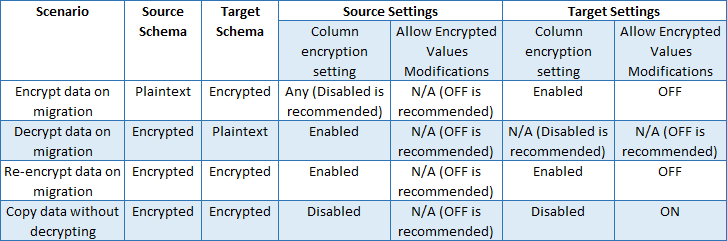

# Migrate Sensitive Data Protected by Always Encrypted
[!INCLUDE[appliesto-ss-asdb-xxxx-xxx-md](../../../includes/appliesto-ss-asdb-xxxx-xxx-md.md)]

To load encrypted data without performing metadata checks on the server during bulk copy operations, create the user with the **ALLOW_ENCRYPTED_VALUE_MODIFICATIONS** option. This option is intended to be used by legacy tools from versions of [!INCLUDE[ssNoVersion](../../../includes/ssnoversion-md.md)] older than [!INCLUDE[ssSQL15](../../../includes/sssql15-md.md)] (such as bcp.exe) or by using third-party Extract-Transform-Load (ETL) work flows that cannot use Always Encrypted. This allows a user to securely move encrypted data from one set of tables, containing encrypted columns, to another set of tables with encrypted columns (in the same or a different database).  

 ## The ALLOW_ENCRYPTED_VALUE_MODIFICATIONS Option  
 Both [CREATE USER](../../../t-sql/statements/create-user-transact-sql.md) and [ALTER USER](../../../t-sql/statements/alter-user-transact-sql.md) have an ALLOW_ENCRYPTED_VALUE_MODIFICATIONS option. When set to ON (the default is OFF), this option suppresses cryptographic metadata checks on the server in bulk copy operations, which enables the user to bulk copy encrypted data between tables or databases, without decrypting the data.  
  
## Data Migration Scenarios  
The following table shows the recommended settings appropriate for several migration scenarios.  
 
  

## Bulk Loading of Encrypted Data  
Use the following process to load encrypted data.  

1.  Set the option to ON for the user in the database that is the target for the bulk copy operation. For example:  
 
   ```  
    ALTER USER Bob WITH ALLOW_ENCRYPTED_VALUE_MODIFICATIONS = ON;  
   ```  

2.  Run your bulk copy application or tool connecting as that user. (If your application uses an Always Encrypted enabled client driver, make sure the connection string for the data source does not contain **column encryption setting=enabled** to ensure the data retrieved from encrypted columns remains encrypted. For more information, see [Always Encrypted &#40;client development&#41;](../../../relational-databases/security/encryption/always-encrypted-client-development.md).)  
  
3.  Set the ALLOW_ENCRYPTED_VALUE_MODIFICATIONS option back to OFF. For example:  

    ```  
    ALTER USER Bob WITH ALLOW_ENCRYPTED_VALUE_MODIFICATIONS = OFF;  
    ```  

## Potential for Data Corruption  
Improper use of this option can lead to data corruption. The **ALLOW_ENCRYPTED_VALUE_MODIFICATIONS** option allows the user to insert any data into encrypted columns in the database, including data that is encrypted with different keys, incorrectly encrypted, or not encrypted at all. If the user accidently copies the data that is not correctly encrypted using the encryption scheme (column encryption key, algorithm, encryption type) set up for the target column, you will not be able to decrypt the data (the data will be corrupted). This option must be used carefully, as it can lead to corrupting data in the database.  

The following scenario demonstrates how improperly importing data could lead to data corruption:  

1.  The option is set to ON for a user.  
 
2.  The user runs the application that connects to the database. The application uses bulk APIs to insert plain text values to encrypted columns. The application expects an Always Encrypted-enabled client driver to encrypt the data on insert. However, the application is misconfigured, so that either it ends up using a driver that does not support Always Encrypted or the connection string does not contain **column encryption setting=enabled**.  

3.  The application sends plaintext values to the server. As cryptographic metadata checks are disabled in the server for the user, the server lets the incorrect data (plaintext instead of correctly encrypted ciphertext) to be inserted into an encrypted column.  
 
4.  The same or another application connects to the database using an Always Encrypted-enabled driver and with **column encryption setting=enabled** in the connection string, and retrieves the data. The application expects the data to be transparently decrypted. However, the driver fails to decrypt the data because the data is incorrect ciphertext.  

## Best practice  
 
Use designated user accounts for long running workloads using this option.  
 
For short running bulk copy applications or tools that need to move encrypted data without decrypting it, set the option to ON immediately before running the application and set it back to OFF immediately after running the operation.  
 
Do not use this option for developing new applications. Instead, use a client driver (such as  ADO 4.6.1) that offers an API for suppressing cryptographic metadata checks for a single session.  

## See Also  
[CREATE USER &#40;Transact-SQL&#41;](../../../t-sql/statements/create-user-transact-sql.md)   
[ALTER USER &#40;Transact-SQL&#41;](../../../t-sql/statements/alter-user-transact-sql.md)   
[Always Encrypted &#40;Database Engine&#41;](../../../relational-databases/security/encryption/always-encrypted-database-engine.md)   
[Always Encrypted Wizard](../../../relational-databases/security/encryption/always-encrypted-wizard.md)   
[Always Encrypted &#40;client development&#41;](../../../relational-databases/security/encryption/always-encrypted-client-development.md)  
