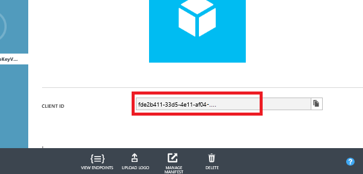
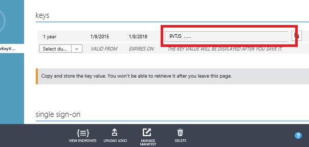

# SQL Server TDE Extensible Key Management Using Azure Key Vault - Setup Steps
[!INCLUDE[appliesto-ss-xxxx-xxxx-xxx-md](../../../includes/appliesto-ss-xxxx-xxxx-xxx-md.md)]

  The following steps walk through the installation and configuration of the [!INCLUDE[ssNoVersion](../../../includes/ssnoversion-md.md)]Connector for Azure Key Vault.  
  
## Before You Start  
 To use Azure Key Vault with your SQL Server, there are a few prerequisites:  
  
-   You must have an Azure subscription  
  
-   Install the latest [Azure PowerShell](https://azure.microsoft.com/documentation/articles/powershell-install-configure/) (5.2.0 or higher).  

-   Create an Azure Active Directory  

-   Familiarize yourself with the principals of EKM storage using the Azure Key Vault by reviewing [Extensible Key Management Using Azure Key Vault &#40;SQL Server&#41;](../../../relational-databases/security/encryption/extensible-key-management-using-azure-key-vault-sql-server.md).  

-   Have the appropriate version of the Visual Studio C++ redistributable installed based on the version of SQL Server that you are running:
  
SQL Server Version  |Redistributable Install Link    
---------|--------- 
2008, 2008 R2, 2012, 2014 | [Visual C++ Redistributable Packages for Visual Studio 2013](https://www.microsoft.com/download/details.aspx?id=40784)    
2016 | [Visual C++ Redistributable for Visual Studio 2015](https://www.microsoft.com/download/details.aspx?id=48145)    
 
  
## Part I: Set up an Azure Active Directory service principal  
 In order to grant SQL Server access permissions to your Azure Key Vault, you will need a Service Principal account in Azure Active Directory (AAD).  
  
1.  Go to the [Azure Portal](https://ms.portal.azure.com/), and sign in.  
  
2.  Register an application with Azure Active Directory. For detailed step-by-step instructions to register an application, see the **Get an identity for the application** section  of the [Azure Key Vault blog post](https://blogs.technet.microsoft.com/kv/2015/06/02/azure-key-vault-step-by-step/).  
  
3.  Copy the **Client ID** and **Client Secret** for a later step, where they will be used to grant [!INCLUDE[ssNoVersion](../../../includes/ssnoversion-md.md)] access to your key vault.  
  
   
  
   
  
## Part II: Create a Key Vault and Key  
 The key vault and key created here will be used by the SQL Server Database Engine for encryption key protection.  
  
> [!IMPORTANT]  
>  The subscription where the key vault is created must be in the same default Azure Active Directory where the Azure Active Directory service principal was created. If you want to use an Active Directory other than your default Active Directory for creating a service principal for the SQL Server Connector, you must change the default Active Directory in your Azure account before creating your key vault. To learn how to change the default Active Directory to the one you'd like to use, please refer to the SQL Server Connector [FAQs](../../../relational-databases/security/encryption/sql-server-connector-maintenance-troubleshooting.md#AppendixB).  
  
1.  **Open PowerShell and Sign in**  
  
     Install and start the [latest Azure PowerShell](https://azure.microsoft.com/documentation/articles/powershell-install-configure/) (5.2.0 or higher). Sign in to your Azure account with the following command:  
  
    ```powershell  
    Connect-AzAccount  
    ```  
  
     The statement returns:  
  
    ```  
    Environment           : AzureCloud  
    Account               : <account_name>  
    TenantId              : <tenant_id>  
    SubscriptionId        : <subscription_id>  
    CurrentStorageAccount :  
    ```  
  
    > [!NOTE]  
    >  If you have multiple subscriptions and want to specify a specific one to use for the vault, then use `Get-AzSubscription` to see the subscriptions and `Select-AzSubscription` to choose the correct subscription. Otherwise, PowerShell will select one for you by default.  
  
2.  **Create a new resource group**  
  
     All Azure resources created via Azure Resource Manager must be contained in resource groups. Create a resource group to house your key vault. This example uses `ContosoDevRG`. Choose your own **unique** resource group and key vault name as all key vault names are globally unique.  
  
    ```powershell  
    New-AzResourceGroup -Name ContosoDevRG -Location 'East Asia'  
    ```  
  
     The statement returns:  
  
    ```  
    ResourceGroupName: ContosoDevRG  
    Location         : eastasia  
    ProvisioningState: Succeeded  
    Tags             :   
    ResourceId       : /subscriptions/<subscription_id>/  
                        resourceGroups/ContosoDevRG  
    ```  
  
    > [!NOTE]  
    >  For the `-Location parameter`, use the command `Get-AzureLocation` to identify how to specify an alternative location to the one in this example. If you need more information, type: `Get-Help Get-AzureLocation`  
  
3.  **Create a Key Vault**  
  
     The `New-AzKeyVault` cmdlet requires a resource group name, a key vault name, and a geographic location. For example, for a key vault named `ContosoDevKeyVault`, type:  
  
    ```powershell  
    New-AzKeyVault -VaultName 'ContosoDevKeyVault' `  
       -ResourceGroupName 'ContosoDevRG' -Location 'East Asia'  
    ```  
  
     Record the name of your key vault.  
  
     The statement returns:  
  
    ```  
    Vault Name                       : ContosoDevKeyVault  
    Resource Group Name              : ContosoDevRG  
    Location                         : East Asia  
    ResourceId                       : /subscriptions/<subscription_id>/  
                                        resourceGroups/ContosoDevRG/providers/  
                                        Microsoft/KeyVault/vaults/ContosoDevKeyVault  
    Vault URI: https://ContosoDevKeyVault.vault.azure.net  
    Tenant ID                        : <tenant_id>  
    SKU                              : Standard  
    Enabled For Deployment?          : False  
    Enabled For Template Deployment? : False  
    Enabled For Disk Encryption?     : False  
    Access Policies                  :  
             Tenant ID              : <tenant_id>  
             Object ID              : <object_id>  
             Application ID         :   
             Display Name           : <display_name>  
             Permissions to Keys    : get, create, delete, list, update, import,   
                                      backup, restore  
             Permissions to Secrets : all  
    Tags                             :  
    ```  
  
4.  **Grant Permission for the Azure Active Directory Service Principal to Access the Key Vault**  
  
     You can authorize other users and applications to use your key vault.   
    In this case, let's use the Azure Active Directory service principal created in Part I to authorize the [!INCLUDE[ssNoVersion](../../../includes/ssnoversion-md.md)] instance.  
  
    > [!IMPORTANT]  
    >  The Azure Active Directory service principal must have at least the `get`, `wrapKey`, and `unwrapKey` permissions for the key vault.  
  
     As shown below, use the **Client ID** from Part I for the `ServicePrincipalName` parameter. The `Set-AzKeyVaultAccessPolicy` runs silently with no output if it runs successfully.  
  
    ```powershell  
    Set-AzKeyVaultAccessPolicy -VaultName 'ContosoDevKeyVault'`  
      -ServicePrincipalName EF5C8E09-4D2A-4A76-9998-D93440D8115D `  
      -PermissionsToKeys get, wrapKey, unwrapKey  
    ```  
  
     Call the `Get-AzKeyVault` cmdlet to confirm the permissions. In the statement output under 'Access Policies,' you should see your AAD application name listed as another tenant that has access to this key vault.  
  
       
5.  **Generate an Asymmetric Key in the Key Vault**  
  
     There are two ways to generate a key in Azure Key Vault: 1) Import an existing key or 2) create a new key.  
                  
      > [!NOTE]
        >  SQL Server only supports 2048-bit RSA keys.
        
    ### Best Practice:
    
    To ensure quick key recovery and be able to access your data outside of Azure, we recommend the following best practice:
 
    1. Create your encryption key locally on a local HSM device. (Make sure this is an asymmetric, RSA 2048 key so it's is supported by SQL Server.)
    2. Import the encryption key to Azure Key Vault. See the steps below for how to do that.
    3. Before using the key in Azure Key Vault for the first time, take an Azure Key Vault key backup. Learn more about the [Backup-AzureKeyVaultKey](https://msdn.microsoft.com/library/mt126292.aspx) command.
    4. Whenever any changes are made to the key (for example add ACLs, add tags, add key attributes), be sure to take another Azure Key Vault key backup.

        > [!NOTE]  
        >  Backing up a key is an Azure Key Vault key operation which returns a file that can be saved anywhere.

    ### Types of keys:
    There are two types of keys you can generate in Azure Key Vault that will work with SQL Server. Both are asymmetric 2048-bit RSA keys.  
  
    -   **Software-protected:** Processed in software and encrypted at rest. Operations on software-protected keys occur on Azure Virtual Machines. Recommended for keys not used in a production deployment.  
  
    -   **HSM-protected:** Created and protected by a hardware security module (HSM) for additional security. Cost is about $1 per key version.  
  
        > [!IMPORTANT]  
        >  The SQL Server Connector requires the key name to only use the characters "a-z", "A-Z", "0-9", and "-", with a 26-character limit.   
        > Different key versions under the same key name in Azure Key Vault will not work with [!INCLUDE[ssNoVersion](../../../includes/ssnoversion-md.md)] Connector. To rotate an Azure Key Vault key that's being used by [!INCLUDE[ssNoVersion](../../../includes/ssnoversion-md.md)], please refer to the Key Rollover steps in the [SQL Server Connector Maintenance & Troubleshooting](../../../relational-databases/security/encryption/sql-server-connector-maintenance-troubleshooting.md).  

    ### Import an Existing Key   
  
    If you have an existing 2048-bit RSA software-protected key, you can upload the key to Azure Key Vault. For example, if you had a .PFX file saved to your `C:\\` drive in a file named `softkey.pfx` that you want to upload to Azure Key Vault, type the following to set the variable `securepfxpwd` for a password of `12987553` for the .PFX file:  
  
    ``` powershell  
    $securepfxpwd = ConvertTo-SecureString -String '12987553' `  
      -AsPlainText -Force  
    ```  
  
    Then you can type the following to import the key from the .PFX file, which protects the key by hardware (recommended) in the Key Vault service:  
  
    ``` powershell  
        Add-AzureKeyVaultKey -VaultName 'ContosoKeyVault' `  
          -Name 'ContosoFirstKey' -KeyFilePath 'c:\softkey.pfx' `  
          -KeyFilePassword $securepfxpwd $securepfxpwd  -Destination 'HSM'  
    ```  
 
    > [!IMPORTANT]  
    > Importing the asymmetric key is highly recommended for production scenarios because it allows the administrator to escrow the key in a key escrow system. If the asymmetric key is created in the vault, it cannot be escrowed because the private key can never leave the vault. Keys used to protect critical data should be escrowed. The loss of an asymmetric key will result in permanent data loss.  

    ### Create a new key
    #### Example:  
    Alternatively, you can create a new encryption key directly in Azure Key vault and have it be either software-protected or HSM-protected.  In this example, let's create a software-protected key using the `Add-AzureKeyVaultKey cmdlet`:  

    ``` powershell  
    Add-AzureKeyVaultKey -VaultName 'ContosoDevKeyVault' `  
      -Name 'ContosoRSAKey0' -Destination 'Software'  
    ```  
  
    The statement returns:  
  
    ```  
    Attributes : Microsoft.Azure.Commands.KeyVault.Models.KeyAttributes  
    Key        :  {"kid":"https:contosodevKeyVault.azure.net/keys/  
                   ContosoRSAKey0/<guid>","dty":"RSA:,"key_ops": ...  
    VaultName  : contosodevkeyvault  
    Name       : contosoRSAKey0  
    Version    : <guid>  
    Id         : https://contosodevkeyvault.vault.azure.net:443/  
                 keys/ContosoRSAKey0/<guid>  
    ```  
 > [!IMPORTANT]  
    >  The key vault supports multiple versions of the same named key, but keys to be used by [!INCLUDE[ssNoVersion](../../../includes/ssnoversion-md.md)] Connector should not be versioned or rolled. If the administrator wants to roll the key used for [!INCLUDE[ssNoVersion](../../../includes/ssnoversion-md.md)] encryption, a new key with a different name should be created in the vault and used to encrypt the DEK.  
   
  
## Part III: Install the [!INCLUDE[ssNoVersion](../../../includes/ssnoversion-md.md)] Connector  
 Download the SQL Server Connector from the [Microsoft Download Center](https://go.microsoft.com/fwlink/p/?LinkId=521700). (This should be done by the administrator of the [!INCLUDE[ssNoVersion](../../../includes/ssnoversion-md.md)] computer.)  

> [!NOTE]  
>  Versions 1.0.0.440 and older have been replaced and are no longer supported in production environments. Upgrade to version 1.0.1.0 or later by visiting the [Microsoft Download Center](https://www.microsoft.com/download/details.aspx?id=45344) and using the instructions on the [SQL Server Connector Maintenance & Troubleshooting](../../../relational-databases/security/encryption/sql-server-connector-maintenance-troubleshooting.md) page under "Upgrade of SQL Server Connector."

> [!NOTE]  
> There is a breaking change in 1.0.5.0 version, in terms of the thumbprint algorithm. You may experience database restore failure after upgrading to 1.0.5.0 version. Please refer KB aritcle [447099](https://support.microsoft.com/help/4470999/db-backup-problems-to-sql-server-connector-for-azure-1-0-5-0).
  
   
  
 By default, the connector installs at C:\Program Files\SQL Server Connector for Microsoft Azure Key Vault. This location can be changed during setup. (If changed, adjust the scripts below.)  
  
 There is no interface for the Connector, but if it is installed successfully, the **Microsoft.AzureKeyVaultService.EKM.dll** is installed on the machine. This is the cryptographic EKM provider DLL that needs to be registered with [!INCLUDE[ssNoVersion](../../../includes/ssnoversion-md.md)] by using the `CREATE CRYPTOGRAPHIC PROVIDER` statement.  
  
 The SQL Server Connector installation also allows you to optionally download sample scripts for SQL Server encryption.  
  
 To view error code explanations, configuration settings, or maintenance tasks for SQL Server Connector, visit the appendix at the bottom of this topic:  
  
-   [A. Maintenance Instructions for SQL Server Connector](../../../relational-databases/security/encryption/sql-server-connector-maintenance-troubleshooting.md#AppendixA)  
  
-   [C. Error Code Explanations for SQL Server Connector](../../../relational-databases/security/encryption/sql-server-connector-maintenance-troubleshooting.md#AppendixC)  
  
  
## Part IV: Configure [!INCLUDE[ssNoVersion](../../../includes/ssnoversion-md.md)]  
 Refer to [B. Frequently Asked Questions](../../../relational-databases/security/encryption/sql-server-connector-maintenance-troubleshooting.md#AppendixB) to see a note about the minimum permission levels needed for each action in this section.  
  
1.  **Launch sqlcmd.exe or [!INCLUDE[ssNoVersion](../../../includes/ssnoversion-md.md)] Management Studio**  
  
2.  **Configure [!INCLUDE[ssNoVersion](../../../includes/ssnoversion-md.md)] to use EKM**  
  
     Execute the following [!INCLUDE[tsql](../../../includes/tsql-md.md)] script to configure the [!INCLUDE[ssDE](../../../includes/ssde-md.md)] to use an EKM provider.  
  
    ```sql  
    -- Enable advanced options.  
    USE master;  
    GO  
  
    sp_configure 'show advanced options', 1;  
    GO  
    RECONFIGURE;  
    GO  
  
    -- Enable EKM provider  
    sp_configure 'EKM provider enabled', 1;  
    GO  
    RECONFIGURE;  
    ```  
  
3.  **Register (create) the [!INCLUDE[ssNoVersion](../../../includes/ssnoversion-md.md)] Connector as an EKM provider with [!INCLUDE[ssNoVersion](../../../includes/ssnoversion-md.md)]**  
  
     -- Create a cryptographic provider, using the [!INCLUDE[ssNoVersion](../../../includes/ssnoversion-md.md)] Connector, which is an EKM provider for the Azure Key Vault.    
    This example uses the name `AzureKeyVault_EKM_Prov`.  
  
    ```sql  
    CREATE CRYPTOGRAPHIC PROVIDER AzureKeyVault_EKM_Prov   
    FROM FILE = 'C:\Program Files\SQL Server Connector for Microsoft Azure Key Vault\Microsoft.AzureKeyVaultService.EKM.dll';  
    GO  
    ```  
  
    > [!NOTE]  
    >  The file path length cannot exceed 256 characters.  
  
  
4.  **Setup a [!INCLUDE[ssNoVersion](../../../includes/ssnoversion-md.md)] credential for a [!INCLUDE[ssNoVersion](../../../includes/ssnoversion-md.md)] login to use the key vault**  
  
     A credential must be added to each login that will be performing encryption using a key from the Key Vault. This might include:  
  
    -   A [!INCLUDE[ssNoVersion](../../../includes/ssnoversion-md.md)] administrator login who will use key vault in order to setup and manage [!INCLUDE[ssNoVersion](../../../includes/ssnoversion-md.md)] encryption scenarios.  
  
    -   Other [!INCLUDE[ssNoVersion](../../../includes/ssnoversion-md.md)] logins who might enable Transparent Data Encryption (TDE), or other [!INCLUDE[ssNoVersion](../../../includes/ssnoversion-md.md)] encryption features.  
  
     There is one-to-one mapping between credentials and logins. That is, each login must have a unique credential.  
  
     Modify the [!INCLUDE[tsql](../../../includes/tsql-md.md)] script below in the following ways:  
  
    -   Edit the `IDENTITY` argument (`ContosoDevKeyVault`) to point to your Azure Key Vault.
        - If you're using **global Azure**, replace the `IDENTITY` argument with the name of your Azure Key Vault from Part II.
        - If you're using a **private Azure cloud** (ex. Azure Government, Azure China, or Azure Germany), replace the `IDENTITY` argument with the Vault URI that is returned in Part II, step 3. Do not include "https://" in the Vault URI.   
    -   Replace the first part of the `SECRET` argument with the Azure Active Directory **Client ID** from Part I. In this example, the **Client ID** is `EF5C8E094D2A4A769998D93440D8115D`.  
  
        > [!IMPORTANT]  
        >  You must remove the hyphens from the **Client ID**.  
  
    -   Complete the second part of the `SECRET` argument with **Client Secret** from Part I.  In this example the **Client Secret** from Part 1 is `Replace-With-AAD-Client-Secret`. The final string for the `SECRET` argument will be a long sequence of letters and numbers, with *no hyphens*.  
  
    ```sql  
    USE master;  
    CREATE CREDENTIAL sysadmin_ekm_cred   
        WITH IDENTITY = 'ContosoDevKeyVault', -- for public Azure
        -- WITH IDENTITY = 'ContosoDevKeyVault.vault.usgovcloudapi.net', -- for Azure Government
        -- WITH IDENTITY = 'ContosoDevKeyVault.vault.azure.cn', -- for Azure China
        -- WITH IDENTITY = 'ContosoDevKeyVault.vault.microsoftazure.de', -- for Azure Germany   
        SECRET = 'EF5C8E094D2A4A769998D93440D8115DReplace-With-AAD-Client-Secret'   
    FOR CRYPTOGRAPHIC PROVIDER AzureKeyVault_EKM_Prov;  
  
    -- Add the credential to the SQL Server administrator's domain login   
    ALTER LOGIN [<domain>\<login>]  
    ADD CREDENTIAL sysadmin_ekm_cred;  
    ```  
  
     For an example of using variables for the **CREATE CREDENTIAL** arguments and programmatically removing the hyphens from the Client ID, see [CREATE CREDENTIAL &#40;Transact-SQL&#41;](../../../t-sql/statements/create-credential-transact-sql.md).  
  
5.  **Open your Azure Key Vault key in [!INCLUDE[ssNoVersion](../../../includes/ssnoversion-md.md)]**  
  
     If you imported an asymmetric key as described in Part II, open the key by providing your key name in the following [!INCLUDE[tsql](../../../includes/tsql-md.md)] script.  
  
    -   Replace `CONTOSO_KEY` with the name you'd like the key to have in [!INCLUDE[ssNoVersion](../../../includes/ssnoversion-md.md)].  
  
    -   Replace `ContosoRSAKey0` with the name of your key in Azure Key Vault.  
  
    ```sql  
    CREATE ASYMMETRIC KEY CONTOSO_KEY   
    FROM PROVIDER [AzureKeyVault_EKM_Prov]  
    WITH PROVIDER_KEY_NAME = 'ContosoRSAKey0',  
    CREATION_DISPOSITION = OPEN_EXISTING;  
    ```  
## Next Step  
  
Now that you have completed the basic configuration, see how to [Use SQL Server Connector with SQL Encryption Features](../../../relational-databases/security/encryption/use-sql-server-connector-with-sql-encryption-features.md)   
  
## See Also  
 [Extensible Key Management Using Azure Key Vault](../../../relational-databases/security/encryption/extensible-key-management-using-azure-key-vault-sql-server.md)   
[SQL Server Connector Maintenance & Troubleshooting](../../../relational-databases/security/encryption/sql-server-connector-maintenance-troubleshooting.md)
