# Set up SQL Server TDE Extensible Key Management by using Azure Key Vault
[!INCLUDE[appliesto-ss-xxxx-xxxx-xxx-md](../../../includes/appliesto-ss-xxxx-xxxx-xxx-md.md)]

In this article, you install and configure [!INCLUDE[ssNoVersion](../../../includes/ssnoversion-md.md)] Connector for Azure Key Vault.  
  
## Prerequisites

Before you begin using Azure Key Vault with your SQL Server instance, you must meet the following prerequisites:  
  
- You must have an Azure subscription.
  
- Install [Azure PowerShell version 5.2.0 or later](https://azure.microsoft.com/documentation/articles/powershell-install-configure/).  

- Create an Azure Active Directory (Azure AD) instance.

- Familiarize yourself with the principles of Extensible Key Management (EKM) storage with Azure Key Vault by reviewing [EKM with Azure Key Vault (SQL Server)](../../../relational-databases/security/encryption/extensible-key-management-using-azure-key-vault-sql-server.md).  

- Install the version of Visual Studio C++ Redistributable that's based on the version of SQL Server that you're running:
  
  SQL Server version  | Visual Studio C++ Redistributable version    
  ---------|--------- 
  2008, 2008 R2, 2012, 2014 | [Visual C++ Redistributable packages for Visual Studio 2013](https://www.microsoft.com/download/details.aspx?id=40784)    
  2016 | [Visual C++ Redistributable for Visual Studio 2015](https://www.microsoft.com/download/details.aspx?id=48145)    
 
  
## Step 1: Set up an Azure AD service principal

To grant your SQL Server instance access permissions to your Azure key vault, you'll need a service principal account in Azure AD.  
  
1.  Sign in to the [Azure portal](https://ms.portal.azure.com/) <br>
    a. and either select "Azure Active Directory" icon.
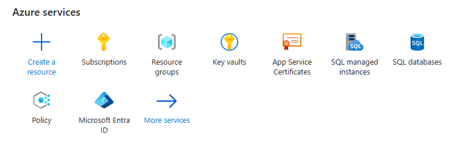
b. or select **"More services"** and search for "Azure active directory".
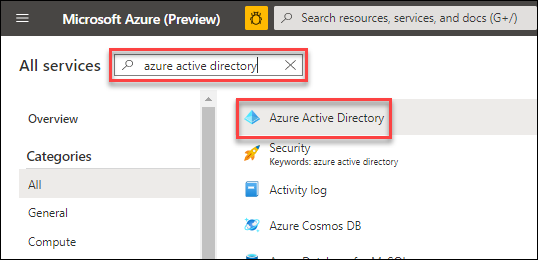  
c. **Register an application** with Azure Active Directory. For detailed step-by-step instructions, see the "Get an identity for the application" section of the [Azure Key Vault blog post](https://blogs.technet.microsoft.com/kv/2015/06/02/azure-key-vault-step-by-step/).
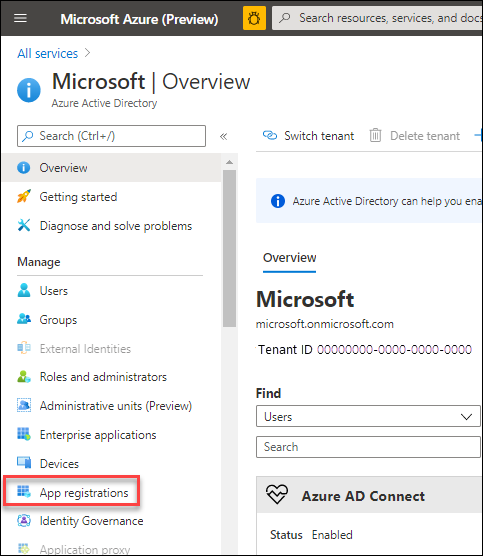 <br>
d. Select **New registration** to set up the Azure AD application.<br>
   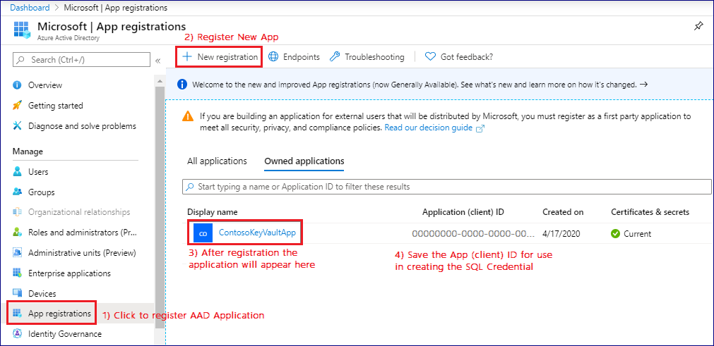  
e. **Register an application** in Azure Active Directory.
   

    f. Select **Certificates & Secrets** and add **New client secret**.
  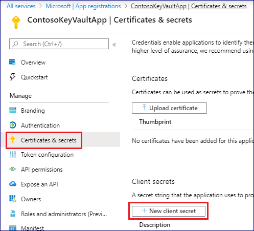  
    g. Add a description and an appropriate expiration, and then select **Add**.<br>
  
    h. Copy the **"Value"** of the client secret to be used to create an asymmetric key in SQL Server.
    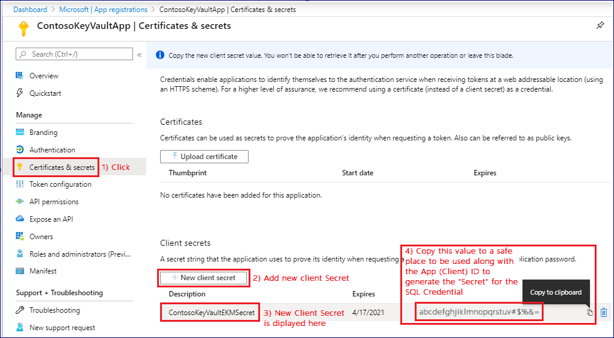  
    i. Also copy the **Application (Client) ID** GUID to be used to create an asymmetric key in SQL Server.
    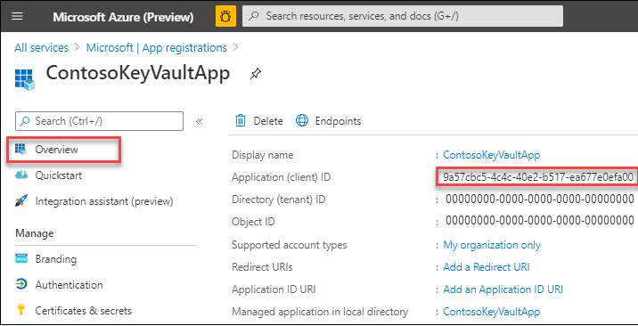  
<br>
 

## Step 2: Create a key vault
In the following row, click whichever method (Azure portal or PowerShell)  interested in. The click displays different content here on this webpage, appropriate for whichever method you click.

::: moniker range="azureportal"
|||||
|-|-|-|-|
 **_\* Azure Key Vault <br>using PowerShell \*_** &nbsp; | [Azure Key Vault  <br>using Azure portal](setup-steps-for-extensible-key-management-using-the-azure-key-vault.md.md?view=azureportal)|||
|||||
### Step 2 (Portal): Create a key vault by using the Azure portal 
You can use the Azure portal to create the key vault and then add an Azure AD principal to it.

1. Create a resource group.

   All Azure resources that are created via the Azure portal must be contained in a resource group, which you create to house your key vault. This example uses `ContosoDevRG`. Choose your own *unique* resource group and key vault name, because all key vault names must be globally unique.

   Fill in the values, and then select **Review + create**.
      
      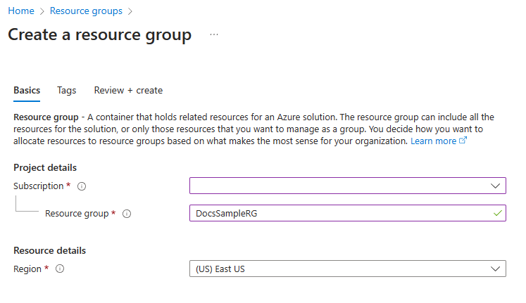  

1.  Create the key vault.

    Fill in the values, and then select **Review + create**.
      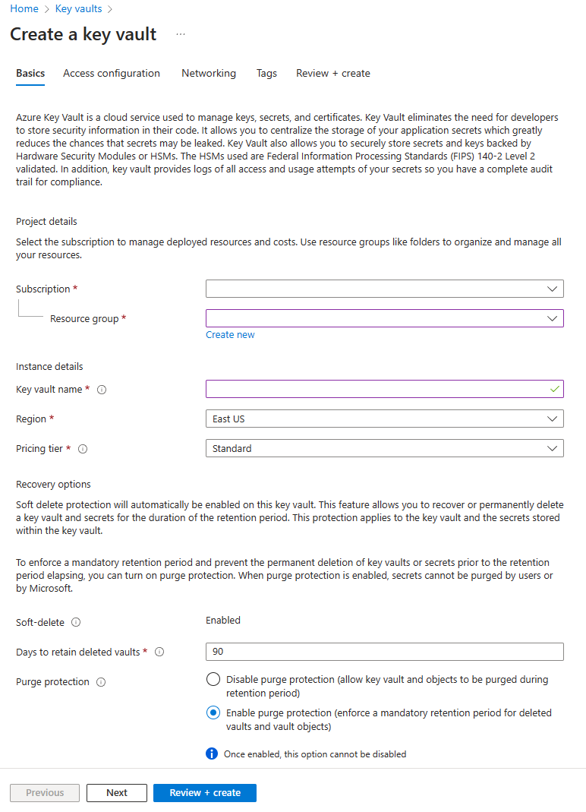  

1.  Add an access policy to the Azure AD principal (application) by selecting **Add Access Policy**.
      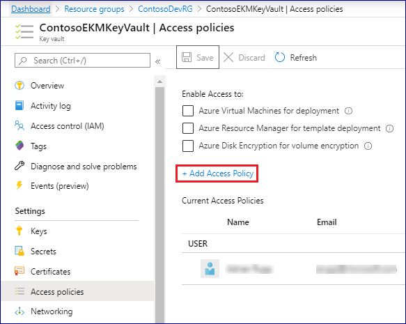  

1.  On the **Add access policy** pane, do the following:
  
    a. In the **Configure from template (optional)** drop-down list, select **SQL Server Connector**.
    
    b. Select the **Key permissions** tab, and verify the **Get**, **List**, **Unwrap Key**, and **Wrap Key** check boxes are checked.

    c. Select **Add**.
   
      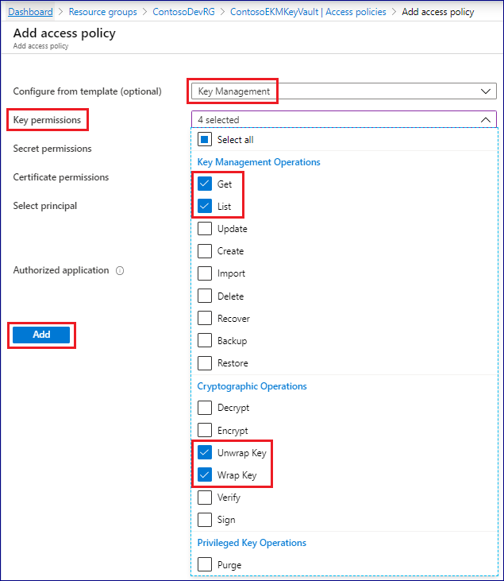

1.  Select the **Select principal** tab, and then do the following:

    a. In the right pane, under **Select**, start typing the name of the Azure AD application, and then select the application you want to add.
  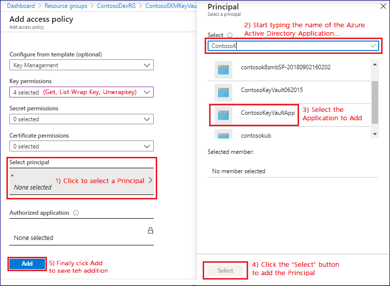  
    b. Select the **Select** button to add the principal to your key vault.
  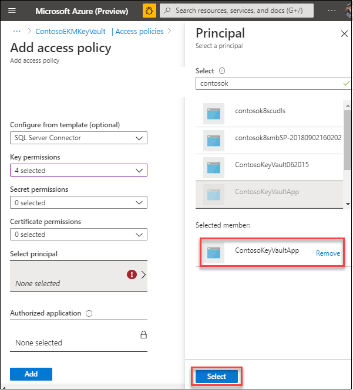

    c. Select **Add** to save the addition of the principal.

    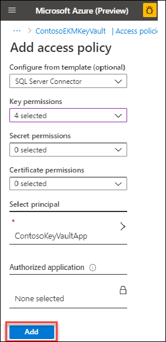
 
1.  On the **Access policies** pane, select **Save**.
   
        
 
::: moniker-end
::: moniker range="powershell"
|||||
|-|-|-|-|
 [Azure Key Vault<br>using PowerShell](setup-steps-for-extensible-key-management-using-the-azure-key-vault.md?view=powershell) |**_\* Azure Key Vault <br> using Azure portal \*_** &nbsp;|
|||||

### Step 2 (PowerShell): Create an Azure Key Vault and key by using PowerShell
 The key vault and key created here will be used by the SQL Server Database Engine for encryption key protection.  
  
> [!IMPORTANT] 
> The subscription where the key vault is created must be in the same default Azure Active Directory where the Azure Active Directory service principal was created. If you want to use an Active Directory other than your default Active Directory for creating a service principal for the SQL Server Connector, you must change the default Active Directory in your Azure account before creating your key vault. To learn how to change the default Active Directory to the one you'd like to use, please refer to the SQL Server Connector [FAQs](../../../relational-databases/security/encryption/sql-server-connector-maintenance-troubleshooting.md#AppendixB).  
  
  
1.  **Open PowerShell and sign in**

    Install and start the [latest Azure PowerShell](https://azure.microsoft.com/documentation/articles/powershell-install-configure/) (5.2.0 or higher). Sign in to your Azure account with the following command:  
  
    ```powershell  
    Connect-AzAccount  
    ```  
  
    The statement returns:  
  
    ```  
    Environment           : AzureCloud  
    Account               : <account_name>  
    TenantId              : <tenant_id>  
    SubscriptionId        : <subscription_id>  
    CurrentStorageAccount :  
    ```  
  
    > [!NOTE]  
    > If you have multiple subscriptions and want to specify a specific one to use for the vault, then use `Get-AzSubscription` to see the subscriptions and `Select-AzSubscription` to choose the correct subscription. Otherwise, PowerShell will select one for you by default.  
  
1.  **Create a new resource group:**   

    All Azure resources created via Azure portal must be contained in resource groups. Create a resource group to house your key vault. This example uses `ContosoDevRG`. Choose your own **unique** resource group and key vault name as all key vault names are globally unique.  
  
    ```powershell  
    New-AzResourceGroup -Name ContosoDevRG -Location 'East Asia'  
    ```  
  
    The statement returns:  
  
    ```  
    ResourceGroupName: ContosoDevRG  
    Location         : eastasia  
    ProvisioningState: Succeeded  
    Tags             :   
    ResourceId       : /subscriptions/<subscription_id>/  
                        resourceGroups/ContosoDevRG  
    ```  
  
    > [!NOTE] 
    > For the `-Location parameter`, use the command `Get-AzureLocation` to identify how to specify an alternative location to the one in this example. If you need more information, type: `Get-Help Get-AzureLocation`  
  
1.  **Create a key vault:**    
     The `New-AzKeyVault` cmdlet requires a resource group name, a key vault name, and a geographic location. For example, for a key vault named `ContosoEKMKeyVault`, type:  
  
    ```powershell  
    New-AzKeyVault -VaultName 'ContosoEKMKeyVault' `  
       -ResourceGroupName 'ContosoDevRG' -Location 'East Asia'  
    ```  
  
     Record the name of your key vault.  
  
     The statement returns:

    ```  
    Vault Name                       : ContosoEKMKeyVault  
    Resource Group Name              : ContosoDevRG  
    Location                         : East Asia  
    ResourceId                       : /subscriptions/<subscription_id>/  
                                        resourceGroups/ContosoDevRG/providers/  
                                        Microsoft/KeyVault/vaults/ContosoEKMKeyVault  
    Vault URI: https://ContosoEKMKeyVault.vault.azure.net  
    Tenant ID                        : <tenant_id>  
    SKU                              : Standard  
    Enabled For Deployment?          : False  
    Enabled For Template Deployment? : False  
    Enabled For Disk Encryption?     : False  
    Access Policies                  :  
             Tenant ID              : <tenant_id>  
             Object ID              : <object_id>  
             Application ID         :   
             Display Name           : <display_name>  
             Permissions to Keys    : get, create, delete, list, update, import,   
                                      backup, restore  
             Permissions to Secrets : all  
    Tags                             :  
    ```  
  
1.  **Grant permission for the Azure Active Directory service principal to access the Azure key vault:**  
  
    You can authorize other users and applications to use your key vault.   
    In this case, let's use the Azure Active Directory service principal created in Step 1 to authorize the [!INCLUDE[ssNoVersion](../../../includes/ssnoversion-md.md)] instance.  
  
    > [!IMPORTANT] 
    > The Azure Active Directory service principal must have at least the `get`, `list`,`wrapKey`, and `unwrapKey` permissions for the key vault.  
  
    As shown below, use the **App (Client) ID** from Step 1 for the `ServicePrincipalName` parameter. The `Set-AzKeyVaultAccessPolicy` runs silently with no output if it runs successfully.  
  
    ```powershell  
    Set-AzKeyVaultAccessPolicy -VaultName 'ContosoEKMKeyVault' `  
      -ServicePrincipalName 9A57CBC5-4C4C-40E2-B517-EA677 `  
      -PermissionsToKeys get, list, wrapKey, unwrapKey  
    ```  
  
    Call the `Get-AzKeyVault` cmdlet to confirm the permissions. In the statement output under 'Access Policies,' you should see your Azure AD application name listed as another tenant that has access to this key vault.  
  
       
1.  **Generate an Asymmetric Key in the key vault:**  
  
    There are two ways to generate a key in Azure Key Vault: import an existing key or create a new key.  
                  
     > [!NOTE] 
     > SQL Server only supports 2048-bit RSA keys.
        
### Best practice:
    
To ensure quick key recovery and be able to access your data outside of Azure, we recommend the following best practice:
 
- Create your encryption key locally on a local HSM (hardware security module) device. (Make sure to use an asymmetric, RSA 2048 key so it's is supported by SQL Server.)
- Import the encryption key to your Azure key vault. See the steps below for how to do that.
- Before using the key in your Azure key vault for the first time, take an Azure key vault key backup. Learn more about the [Backup-AzureKeyVaultKey](/sql/relational-databases/security/encryption/setup-steps-for-extensible-key-management-using-the-azure-key-vault) command.
- Whenever any changes are made to the key (for example add ACLs, add tags, add key attributes), be sure to take another Azure key vault key backup.

  > [!NOTE]
  > Backing up a key is an Azure Key Vault key operation which returns a file that can be saved anywhere.

### Types of keys:

There are two types of keys you can generate in an Azure key vault that will work with SQL Server. Both are asymmetric 2048-bit RSA keys.  
  
  - **Software-protected:** Processed in software and encrypted at rest. Operations on software-protected keys occur on Azure Virtual Machines. Recommended for keys not used in a production deployment.  

  - **HSM-protected:** Created and protected by a hardware security module (HSM) for additional security. Cost is about $1 per key version.  
  
    > [!IMPORTANT] 
    > The SQL Server Connector requires the key name to only use the characters "a-z", "A-Z", "0-9", and "-", with a 26-character limit.   
    > Different key versions under the same key name in an Azure key vault will not work with [!INCLUDE[ssNoVersion](../../../includes/ssnoversion-md.md)] Connector. To rotate an Azure key vault key that's being used by [!INCLUDE[ssNoVersion](../../../includes/ssnoversion-md.md)], please refer to the Key Rollover steps in the [SQL Server Connector Maintenance & Troubleshooting](../../../relational-databases/security/encryption/sql-server-connector-maintenance-troubleshooting.md).  

### Import an existing key   
  
If you have an existing 2048-bit RSA software-protected key, you can upload the key to the Azure key vault. For example, if you had a .PFX file saved to your `C:\\` drive in a file named `softkey.pfx` that you want to upload to the Azure key vault, type the following to set the variable `securepfxpwd` for a password of `12987553` for the .PFX file:  
  
``` powershell  
$securepfxpwd = ConvertTo-SecureString -String '12987553' `  
  -AsPlainText -Force  
```  

Then you can type the following to import the key from the .PFX file, which protects the key by hardware (recommended) in the Key Vault service:  
  
``` powershell  
    Add-AzureKeyVaultKey -VaultName 'ContosoKeyVault' `  
      -Name 'ContosoFirstKey' -KeyFilePath 'c:\softkey.pfx' `  
      -KeyFilePassword $securepfxpwd $securepfxpwd  -Destination 'HSM'  
```  
 
> [!IMPORTANT]
>Importing the asymmetric key is highly recommended for production scenarios because it allows the administrator to escrow the key in a key escrow system. If the asymmetric key is created in the vault, it cannot be escrowed because the private key can never leave the vault. Keys used to protect critical data should be escrowed. The loss of an asymmetric key will result in permanent data loss.  

### Create a new key 

Example:  Alternatively, you can create a new encryption key directly in Azure Key vault and have it be either software-protected or HSM-protected.  In this example, let's create a software-protected key using the `Add-AzureKeyVaultKey cmdlet`:  

``` powershell  
Add-AzureKeyVaultKey -VaultName 'ContosoEKMKeyVault' `  
  -Name 'ContosoRSAKey0' -Destination 'Software'  
```  
  
The statement returns:  
  
```
Attributes : Microsoft.Azure.Commands.KeyVault.Models.KeyAttributes  
Key        :  {"kid":"https:contosoekmkeyvault.azure.net/keys/  
                ContosoRSAKey0/<guid>","dty":"RSA:,"key_ops": ...  
VaultName  : contosodevkeyvault  
Name       : contosoRSAKey0  
Version    : <guid>  
Id         : https://contosoekmkeyvault.vault.azure.net:443/  
              keys/ContosoRSAKey0/<guid>  
```  

> [!IMPORTANT] 
> The key vault supports multiple versions of the same named key, but keys to be used by [!INCLUDE[ssNoVersion](../../../includes/ssnoversion-md.md)] Connector should not be versioned or rolled. If the administrator wants to roll the key used for [!INCLUDE[ssNoVersion](../../../includes/ssnoversion-md.md)] encryption, a new key with a different name should be created in the key vault and used to encrypt the DEK.  

::: moniker-end
       
## Step 3: Install the [!INCLUDE[ssNoVersion](../../../includes/ssnoversion-md.md)] Connector  
 Download the SQL Server Connector from the [Microsoft Download Center](https://go.microsoft.com/fwlink/p/?LinkId=521700). (The download should be done by the administrator of the [!INCLUDE[ssNoVersion](../../../includes/ssnoversion-md.md)] computer.)  

> [!NOTE] 
> Versions 1.0.0.440 and older have been replaced and are no longer supported in production environments. Upgrade to version 1.0.1.0 or later by visiting the [Microsoft Download Center](https://www.microsoft.com/download/details.aspx?id=45344) and using the instructions on the [SQL Server Connector Maintenance & Troubleshooting](../../../relational-databases/security/encryption/sql-server-connector-maintenance-troubleshooting.md) page under "Upgrade of SQL Server Connector."

> [!NOTE]
> There is a breaking change in 1.0.5.0 version, in terms of the thumbprint algorithm. You may experience database restore failure after upgrading to 1.0.5.0 version. Please refer KB aritcle [447099](https://support.microsoft.com/help/4470999/db-backup-problems-to-sql-server-connector-for-azure-1-0-5-0).
  
  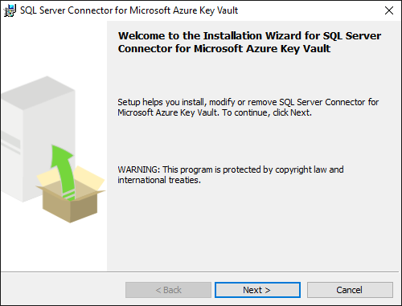  
  
By default, the connector is installed at C:\Program Files\SQL Server Connector for Microsoft Azure Key Vault. This location can be changed during setup. If you do change it, adjust the scripts in the next section.  
  
There's no interface for the Connector, but if it's installed successfully, the *Microsoft.AzureKeyVaultService.EKM.dll* is installed on the machine. This assembly is the cryptographic EKM provider DLL that needs to be registered with [!INCLUDE[ssNoVersion](../../../includes/ssnoversion-md.md)] by using the `CREATE CRYPTOGRAPHIC PROVIDER` statement.  
  
The SQL Server Connector installation also allows you to optionally download sample scripts for SQL Server encryption.  
  
To view error code explanations, configuration settings, or maintenance tasks for SQL Server Connector:  
  
 - [A. Maintenance Instructions for SQL Server Connector](../../../relational-databases/security/encryption/sql-server-connector-maintenance-troubleshooting.md#AppendixA)  
  
 - [C. Error Code Explanations for SQL Server Connector](../../../relational-databases/security/encryption/sql-server-connector-maintenance-troubleshooting.md#AppendixC)  
  
  
## Step 4: Configure [!INCLUDE[ssNoVersion](../../../includes/ssnoversion-md.md)]  

Refer to [B. Frequently Asked Questions](../../../relational-databases/security/encryption/sql-server-connector-maintenance-troubleshooting.md#AppendixB) to see a note about the minimum permission levels needed for each action in this section.  
  
1.  **Launch sqlcmd.exe or [!INCLUDE[ssNoVersion](../../../includes/ssnoversion-md.md)] Management Studio**  
  
1.  **Configure [!INCLUDE[ssNoVersion](../../../includes/ssnoversion-md.md)] to use EKM:**  
  
    Execute the following [!INCLUDE[tsql](../../../includes/tsql-md.md)] script to configure the [!INCLUDE[ssDE](../../../includes/ssde-md.md)] to use an EKM provider.  
  
    ```sql  
    -- Enable advanced options.  
    USE master;  
    GO  
  
    EXEC sp_configure 'show advanced options', 1;  
    GO  
    RECONFIGURE;  
    GO  
  
    -- Enable EKM provider  
    EXEC sp_configure 'EKM provider enabled', 1;  
    GO  
    RECONFIGURE;  
    ```  
  
1.  **Register (create) the [!INCLUDE[ssNoVersion](../../../includes/ssnoversion-md.md)] Connector as an EKM provider with [!INCLUDE[ssNoVersion](../../../includes/ssnoversion-md.md)]:**  
  
    Create a cryptographic provider, using the [!INCLUDE[ssNoVersion](../../../includes/ssnoversion-md.md)] Connector, which is an EKM provider for the Azure key vault.    
    This example uses the name `AzureKeyVault_EKM`.  
  
    ```sql  
    CREATE CRYPTOGRAPHIC PROVIDER AzureKeyVault_EKM   
    FROM FILE = 'C:\Program Files\SQL Server Connector for Microsoft Azure Key Vault\Microsoft.AzureKeyVaultService.EKM.dll';  
    GO  
    ```  
    
    > [!NOTE]
    > The file path length cannot exceed 256 characters.  
  
1.  **Set up a [!INCLUDE[ssNoVersion](../../../includes/ssnoversion-md.md)] credential for a [!INCLUDE[ssNoVersion](../../../includes/ssnoversion-md.md)] login to use the key vault:**  
  
    A credential must be added to each login that will be performing encryption using a key from the key vault. This might include:  
  
    - A [!INCLUDE[ssNoVersion](../../../includes/ssnoversion-md.md)] administrator login who will use key vault to set up and manage [!INCLUDE[ssNoVersion](../../../includes/ssnoversion-md.md)] encryption scenarios.  
  
    - Other [!INCLUDE[ssNoVersion](../../../includes/ssnoversion-md.md)] logins who might enable Transparent Data Encryption (TDE), or other [!INCLUDE[ssNoVersion](../../../includes/ssnoversion-md.md)] encryption features.  
  
    There is one-to-one mapping between credentials and logins. That is, each login must have a unique credential.  
  
    Modify the [!INCLUDE[tsql](../../../includes/tsql-md.md)] script below in the following ways:  
  
    - Edit the `IDENTITY` argument (`ContosoEKMKeyVault`) to point to your Azure key vault.
      - If you're using **global Azure**, replace the `IDENTITY` argument with the name of your Azure key vault from Step 2.
      - If you're using a **private Azure cloud** (ex. Azure Government, Azure China 21Vianet, or Azure Germany), replace the `IDENTITY` argument with the Vault URI that is returned in Step 2 (bullet #3). Don't include "https://" in the Vault URI.   
    - Replace the first part of the `SECRET` argument with the Azure Active Directory **Client ID** from Step 1. In this example, the **Client ID** is `9A57CBC54C4C40E2B517EA677E0EFA00`.  
  
      > [!IMPORTANT] 
      > You **must** remove the hyphens from the **App (Client) ID**.  
  
    - Complete the second part of the `SECRET` argument with **Client Secret** from Step 1.  In this example, the **Client Secret** from Part 1 is `08:k?[:XEZFxcwIPvVVZhTjHWXm7w1?m`. The final string for the `SECRET` argument will be a long sequence of letters and numbers, with *no hyphens*.  
  
    ```sql  
    USE master;  
    CREATE CREDENTIAL sysadmin_ekm_cred   
        WITH IDENTITY = 'ContosoEKMKeyVault',                            -- for public Azure
        -- WITH IDENTITY = 'ContosoEKMKeyVault.vault.usgovcloudapi.net', -- for Azure Government
        -- WITH IDENTITY = 'ContosoEKMKeyVault.vault.azure.cn',          -- for Azure China 21Vianet
        -- WITH IDENTITY = 'ContosoEKMKeyVault.vault.microsoftazure.de', -- for Azure Germany
               --<----Application (Client) ID ---><--Azure AD app (Client) ID secret-->
        SECRET = '9A57CBC54C4C40E2B517EA677E0EFA0008:k?[:XEZFxcwIPvVVZhTjHWXm7w1?m'   
    FOR CRYPTOGRAPHIC PROVIDER AzureKeyVault_EKM;  
  
    -- Add the credential to the SQL Server administrator's domain login   
    ALTER LOGIN [<domain>\<login>]  
    ADD CREDENTIAL sysadmin_ekm_cred;  
    ```  
  
    For an example of using variables for the **CREATE CREDENTIAL** arguments and programmatically removing the hyphens from the Client ID, see [CREATE CREDENTIAL &#40;Transact-SQL&#41;](../../../t-sql/statements/create-credential-transact-sql.md).  
  
1. **Open your Azure key vault key in your SQL Server instance:**  
    Whether you created a new key, or imported an asymmetric key as described in Step 2, you will need to open the key. Open the key by providing your key name in the following [!INCLUDE[tsql](../../../includes/tsql-md.md)] script.  
  
    - Replace `EKMSampleASYKey` with the name you'd like the key to have in [!INCLUDE[ssNoVersion](../../../includes/ssnoversion-md.md)].  
  
    - Replace `ContosoRSAKey0` with the name of your key in your Azure key vault.  
  
    ```sql  
    CREATE ASYMMETRIC KEY EKMSampleASYKey   
    FROM PROVIDER [AzureKeyVault_EKM]  
    WITH PROVIDER_KEY_NAME = 'ContosoRSAKey0',  
    CREATION_DISPOSITION = OPEN_EXISTING;  
    ```  
    
1. **Create a new Login from ASYMMETRIC KEY in [!INCLUDE[ssNoVersion](../../../includes/ssnoversion-md.md)]:**
    The new login can now be created using the asymmetric key creates in previous step.
     ```sql  
    --Create a Login that will associate the asymmetric key to this login
    CREATE LOGIN TDE_Login
    FROM ASYMMETRIC KEY EKMSampleASYKey;
    ```  

1. **Create a new Login from ASYMMETRIC KEY in SQL Server:**
     Drop the credential mapping from step 4 so the credential can be mapped to the new login.
     ```sql  
    --Now drop the credential mapping from the original association
    ALTER LOGIN [<domain>\<login>]
    DROP CREDENTIAL sysadmin_ekm_cred;
    ```     

1. **Alter the new Login:**
    Alter the new Login and map the EKM credential to the new login.
     ```sql  
    --Now drop the credential mapping from the original association
    ALTER LOGIN TDE_Login
    ADD CREDENTIAL sysadmin_ekm_cred;
    ```  

1. **Create test database:**
    Create a test database that will be encrypted with the Azure key vault key.
     ```sql
    --Create a test database that will be encrypted with the Azure key vault key
    CREATE DATABASE TestTDE
    ```  

1. **Create a database encryption key:**
    Create an ENCRYPTION KEY using the ASYMMETRIC KEY (EKMSampleASYKey).
    ```sql  
    --Create an ENCRYPTION KEY using the ASYMMETRIC KEY (EKMSampleASYKey)
    CREATE DATABASE ENCRYPTION KEY   
    WITH ALGORITHM = AES_256   
    ```  
  
1. **Encrypt the test database:**
    Enable TDE by setting ENCRYPTION ON.
     ```sql  
    --Enable TDE by setting ENCRYPTION ON
    ALTER DATABASE TestTDE   
    SET ENCRYPTION ON;  
     ```  
    
1. **Cleanup test objects:**
    Delete all the objects created in this test script.
    ```sql  
    -- CLEAN UP
    USE Master
    ALTER DATABASE [TestTDE] SET SINGLE_USER WITH ROLLBACK IMMEDIATE
    DROP DATABASE [TestTDE]

    ALTER LOGIN [TDE_Login] DROP CREDENTIAL [sysadmin_ekm_cred]
    DROP LOGIN [TDE_Login]

    DROP CREDENTIAL [sysadmin_ekm_cred]  

    USE MASTER
    DROP ASYMMETRIC KEY [EKMSampleASYKey]
    DROP CRYPTOGRAPHIC PROVIDER [AzureKeyVault_EKM]
    ```  
    
**Sample scripts:**
You can find sample scripts in the blog at [SQL Server Transparent Data Encryption and Extensible Key Management with Azure Key Vault](https://techcommunity.microsoft.com/t5/sql-server/intro-sql-server-transparent-data-encryption-and-extensible-key/ba-p/1427549).


## Next steps  
  
Now that you've completed the basic configuration, see how to [Use SQL Server Connector with SQL Encryption features](../../../relational-databases/security/encryption/use-sql-server-connector-with-sql-encryption-features.md).
  
## See also  

[Extensible Key Management with Azure Key Vault](../../../relational-databases/security/encryption/extensible-key-management-using-azure-key-vault-sql-server.md)   

[SQL Server Connector maintenance and troubleshooting](../../../relational-databases/security/encryption/sql-server-connector-maintenance-troubleshooting.md)

