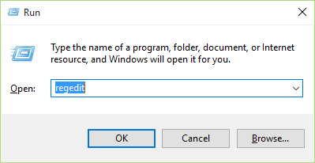
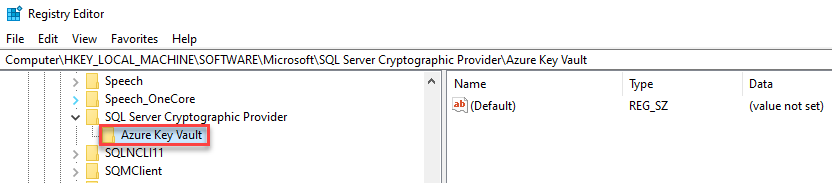
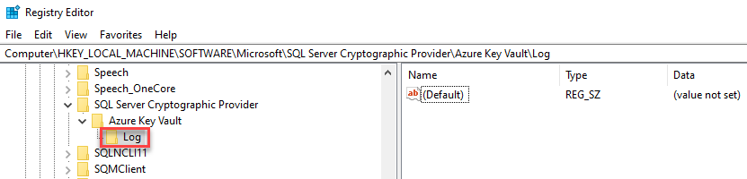
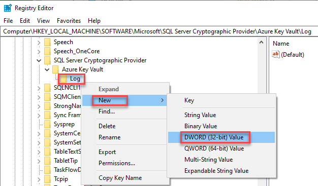
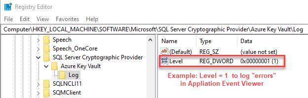

# SQL Server Connector error and information logging

This article describes modifying registry entries to enable SQL Server Connector error and information logging.

## SQL Server Connector for Microsoft Azure Key Vault

The [SQL Server Connector for Microsoft Azure Key Vault](https://www.microsoft.com/download/details.aspx?id=45344) enables SQL Server encryption to use the Microsoft Azure Key Vault as an extensible key management (EKM) provider to protect its encryption keys.

The [download](https://www.microsoft.com/download/details.aspx?id=45344) consists of the SQL Server Connector as well as sample scripts to enable a SQL Server Administrator to learn how to configure the SQL Server Connector and enable SQL Server encryption scenarios. For more information, see [Extensible key management using Key Vault (SQL Server)](./extensible-key-management-using-azure-key-vault-sql-server.md).

Use the [Azure Key Vault forum](https://social.msdn.microsoft.com/Forums/AzureKeyVault) to ask questions, share insights, and discuss the SQL Server Connector.

> [!NOTE]
> During normal execution, the SQL Server Connector DLL will dynamically create registry entries to establish connectivity to Azure Key Vault, to create the Key `[HKEY_LOCAL_MACHINE\SOFTWARE\Microsoft\SQL Server Cryptographic Provider]`. The SQL Server startup account must be a local administrator or its service account must be **NT SERVICE\MSSQLSERVER**

## Upgrade SQL Server Connector to the latest version

To upgrade the SQL Server Connector (Version: 1.0.5.0 with a Date Published: September 2020) to the latest version DLL Crypto provider, follow these steps.

### Upgrade

1. Stop SQL Server service using SQL Server Configuration Manager
1. Uninstall the old version using **Control Panel\Programs\Programs and Features**
    1. Application name: SQL Server Connector for Microsoft Azure Key Vault
    1. Version: 15.0.300.96 (original 1.0.5.0 version)
    1. DLL file date: 01/30/2018 3:00 PM
1. Install (upgrade) new SQL Server Connector for Microsoft Azure Key Vault
    1. Version: 15.0.2000.440 (or latest version)
    1. DLL file date: 09/11/2020 ‏‎5:17 AM (or later)
1. Start SQL Server service
1. Test encrypted DB(s) is/are accessible

### Rollback

1. Stop SQL Server service using SQL Server Configuration Manager
1. Uninstall the new version using **Control Panel\Programs\Programs and Features**
    1. Application name: SQL Server Connector for Microsoft Azure Key Vault
    1. Version: 15.0.2000.440
    1. DLL file date: 09/11/2020 ‏‎5:17 AM
1. Install old version of SQL Server Connector for Microsoft Azure Key Vault
    1. Version: 15.0.300.96
    1. DLL file date: 01/30/2018 3:00 PM
1. Start SQL Server service
1. Test encrypted DB(s) is/are accessible

> [!NOTE]
> - SQL Server Connector versions 1.0.0.440 and older have been replaced and are no longer supported in production environments. For more information on troubleshooting SQL Server Connector issues, see [SQL Server Connector Maintenance & Troubleshooting](../../../relational-databases/security/encryption/sql-server-connector-maintenance-troubleshooting.md).
> - Starting with version 1.0.3.0, the SQL Server Connector reports relevant error messages to the Windows event logs for troubleshooting.
> - Starting with [1.0.4.0: (version 13.0.811.168)](https://download.microsoft.com/download/8/0/9/809494f2-bac9-4388-ad07-7eaf9745d77b/SQL%20Server%20Connector%20for%20Microsoft%20Azure%20Key%20Vault%201.0.4.0.msi), there is support for private Azure clouds, including Azure China, Azure Germany, and Azure Government.
> - There is a breaking change in version 1.0.5.0 in terms of the thumbprint algorithm. You may experience database restore failures after upgrading to 1.0.5.0. For more information, see [KB article 447099](https://support.microsoft.com/help/4470999/db-backup-problems-to-sql-server-connector-for-azure-1-0-5-0).
> - **Starting with version [1.0.5.0 (with a file date of September 2020)](https://www.microsoft.com/en-us/download/details.aspx?id=45344), the SQL Server Connector supports filtering messages and network request retry logic.**
> - *The old version of the SQL Server Connector is also version: [1.0.5.0 (version 15.0.300.96) – File date January 2018](https://download.microsoft.com/download/8/0/9/809494f2-bac9-4388-ad07-7eaf9745d77b/1033_15.0.2000.367/SQLServerConnectorforMicrosoftAzureKeyVault.msi)*. Upgrade to the newest SQL Server Connector if you experience any issues.

**System Requirements** - Supported SQL Server versions:

- SQL Server 2019 RTM Enterprise or Standard 64-bit
- SQL Server 2017 RTM Enterprise 64-bit
- SQL Server 2016 RTM Enterprise 64-bit
- SQL Server 2014 RTM Enterprise 64-bit
- SQL Server 2012 SP2 Enterprise 64-bit
- SQL Server 2012 SP1 CU6 Enterprise 64-bit
- SQL Server 2008 R2 SP2 CU8 Enterprise 64-bit

On SQL Server 2008 and 2012 versions lower than the ones listed above, the patch specified in the following KB article needs to be installed:  [https://support2.microsoft.com/kb/2859713](https://support2.microsoft.com/kb/2859713).

The SQL Server Connector for Microsoft Azure Key Vault also requires .NET Version 4.5.1 on the Microsoft SQL Server Virtual Machine on Azure. This library should be installed before you install the SQL Server Connector.

Have the appropriate version of the Visual Studio C++ redistributable installed based on the version of SQL Server that you're running:

- For SQL Server versions 2008, 2008 R2, 2012, and 2014, install the 2013 Visual C++ Redistributable.

- For SQL Server 2016, 2017, 2019, install the 2015 Visual C++ Redistributable.

## Modify Windows registry steps

Modify registry entries to enable SQL Server Connector logging error and information events in the Windows Application Event Log.

> [!CAUTION]
> Follow the steps in this section carefully and at your own risk. Serious problems might occur if you modify the registry incorrectly. Before you modify the registry, [back up the registry for restoration](https://support.microsoft.com/help/322756) in case problems occur.

1. There are two ways to open Registry Editor in Windows:
    - In the search box on the taskbar, type **regedit**. Then, select the top result for Registry Editor (Desktop app).

    
    - Press and hold or right-click the Start button, then select Run. Enter **regedit** in the dialog box and select **OK**.

   

1. Navigate to this registry key:

    **HKLM\SOFTWARE\Microsoft\SQL Server Cryptographic Provider\Azure Key Vault\\**

      

1. Add a new Key under **Azure Key Vault** named `Log`:

    **HKLM\SOFTWARE\Microsoft\SQL Server Cryptographic Provider\Azure Key Vault\\Log\\**

      

1. Below the **Log** key, add a DWORD (32-bit) Value named `Level`:

    **HKLM\SOFTWARE\Microsoft\SQL Server Cryptographic Provider\Azure Key Vault\\Log\\**

      

1. Set the value of the DWORD as an appropriate Log Level (0,1,2):
   1. 0 (Info) - **Default**
   1. 1 (Error)
   1. 2 (No Log)

     

The registry entries described in this article are found under this key:

```console
\Computer
    \HKEY_LOCAL_MACHINE
       \SOFTWARE
          \Microsoft
             \SQL Server Cryptographic Provider
                \Azure Key Vault
                   \Log\
                      <Level>
```

Optionally, you can use command-line to generate the key:

```cmd
--Create the logging parameter using (Administrator) Command Line:
REG ADD "HKLM\SOFTWARE\Microsoft\SQL Server Cryptographic Provider\Azure Key Vault\Log" /v Level /t REG_DWORD /d 1 

--Validate the new registry entry
REG QUERY "HKLM\SOFTWARE\Microsoft\SQL Server Cryptographic Provider\Azure Key Vault\Log" /v Level
```

Application event log entries that are missing messages can be fixed using a registry entry as well. The event log can contain the message, `The description for Event ID 0 from source SQL Server Connector for Microsoft Azure Key Vault cannot be found...`.  

```cmd
--Create the registry entry to enable missing messages (this works with any version)
REG ADD "HKLM\SYSTEM\ControlSet001\Services\EventLog\Application\SQL Server Connector for Microsoft Azure Key Vault" /v EventMessageFile /t REG_EXPAND_SZ /d "C:\Program Files\SQL Server Connector for Microsoft Azure Key Vault\Microsoft.AzureKeyVaultService.EKM.dll"

--Validate the new registry entry
REG QUERY "HKLM\SYSTEM\ControlSet001\Services\EventLog\Application\SQL Server Connector for Microsoft Azure Key Vault" /v EventMessageFile
```

## Related articles

- For additional sample scripts, see the blog at [SQL Server Transparent Data Encryption and Extensible Key Management with Azure Key Vault](https://techcommunity.microsoft.com/t5/sql-server/intro-sql-server-transparent-data-encryption-and-extensible-key/ba-p/1427549)
- [Extensible Key Management (EKM)](extensible-key-management-ekm.md)  
- [Extensible Key Management using Azure Key Vault](extensible-key-management-using-azure-key-vault-sql-server.md)
- [SQL Server Connector Maintenance & Troubleshooting](../../../relational-databases/security/encryption/sql-server-connector-maintenance-troubleshooting.md)
