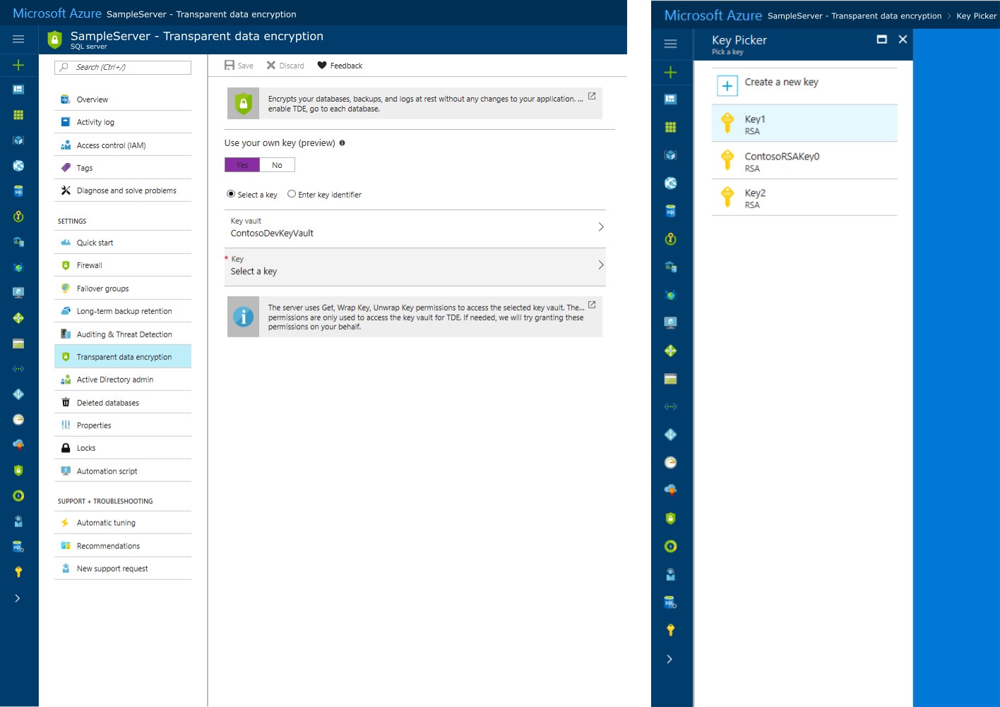

---
title: 'TDE for Azure SQL Database and Data Warehouse | Microsoft Docs'
description: An overview of Transparent Data Encryption for SQL Database and Data Warehouse. The document covers its benefits, and the options for configuration, including Service-managed TDE and Bring Your Own Key.
keywords:
services: sql-database
documentationcenter: ''
author: becczhang
manager: jhubbard
editor: ''

ms.assetid: 
ms.service: sql-database
ms.custom: security
ms.workload:
ms.tgt_pltfrm:
ms.devlang: na
ms.topic: article
ms.date: 08/07/2017
ms.author: rebeccaz

--- 

# Transparent Data Encryption for Azure SQL Database and Data Warehouse

[!INCLUDE[tsql-appliesto-xxxxxx-asdb-asdw-xxx-md](../../../includes/tsql-appliesto-xxxxxx-asdb-asdw-xxx-md.md)]

Transparent Data Encryption (TDE) helps protect Azure SQL Database and Data Warehouse against the threat of malicious activity by performing real-time encryption and decryption of the database, associated backups, and transaction log files at rest without requiring changes to the application.

TDE encrypts the storage of an entire database by using a symmetric key called the database encryption key (DEK). This database encryption key is protected by the TDE protector, which is either a service-managed certificate (“Service-Managed TDE”) or an asymmetric key stored in Azure Key Vault (“Bring Your Own Key”). The TDE protector is set at the server level. 

On database startup, the encrypted DEK is decrypted, and then used for decryption and re-encryption of the database files in the SQL Engine process. TDE performs real-time I/O encryption and decryption of the data at the page level. Each page is decrypted when read into memory, and encrypted before being written to disk. For a general description of TDE, see [Transparent Data Encryption (TDE)](transparent-data-encryption.md).

SQL Server running on an Azure virtual machine can also use an asymmetric key from Key Vault. The configuration steps are different from using an asymmetric key in Azure SQL Database. For more information, see [Extensible Key Management Using Azure Key Vault (SQL Server)](extensible-key-management-using-azure-key-vault-sql-server.md).

## Service-Managed TDE

In Azure, the default setting for TDE is that the database encryption key is protected by a built-in server certificate. The built-in server certificate is unique for each server. If a database is in a geo-replication relationship, both the primary and geo-secondary database will be protected by the primary’s parent server key. If 2 databases are connected to the same server, they share the same built-in certificate. Microsoft automatically rotates these certificates at least every 90 days.

Microsoft also seamlessly moves and manages the keys as needed for Geo-replication and restores. 

> [!IMPORTANT]
> All newly created SQL databases are encrypted by default using service-managed TDE. Existing databases before May 2017 and databases created through restore, geo-replication, and database copy are not encrypted by default.
>

## Bring Your Own Key

Bring Your Own Key (BYOK) support allows the user to take control over their TDE encryption keys and control who can access them and when. Azure Key Vault (AKV), which is Azure’s cloud-based external key management system, is the first key management service that TDE has integrated with for BYOK support. With BYOK, the database encryption key is protected by an asymmetric key stored in AKV. The asymmetric key never leaves Key Vault; once the server has permissions to a key vault, the server sends basic key operation requests to it through the Key Vault service. The asymmetric key is set at the server level and inherited by all databases under that server. 
With BYOK support, users can now control key management tasks including key rotations, key vault permissions, deleting keys, and enable auditing/reporting on all encryption keys. Key Vault provides central key management, leverages tightly monitored hardware security modules (HSMs), and promotes separation of management of keys and data to help meet regulatory compliances. To learn more about Key Vault, visit the [Key Vault documentation page](https://docs.microsoft.com/azure/key-vault/key-vault-secure-your-key-vault).

To learn more about TDE with BYOK support for Azure SQL Database and Data Warehouse, see [Transparent Data Encryption with Bring Your Own Key support](transparent-data-encryption-byok-azure-sql.md).

To start using TDE with BYOK support, visit the how-to guide [Turn on Transparent Data Encryption using your own key from Key Vault Using PowerShell](transparent-data-encryption-byok-azure-sql-configure.md).

## Moving a TDE-protected database

You do not need to decrypt databases for operations within Azure. The TDE settings on the source database or primary database are transparently inherited on the target. This includes operations involving:
- Geo-restore
- Self-service point-in-time restore
- Restore a deleted database
- Active geo-replication
- Creating a database copy

When exporting a TDE-protected database, the exported content of the database is not encrypted. This exported content is stored in unencrypted BACPAC files. Be sure to protect the BACPAC files appropriately and enable TDE once import of the new database is completed.

For example, if the BACPAC file is exported from an on-premises SQL Server, then the imported content of the new database is not automatically encrypted. Likewise, if the BACPAC file is exported to an on-premises SQL Server, the new database is also not automatically encrypted.

The one exception is when exporting to and from Azure SQL Database. TDE is enabled in the new database, but the PACPAC file itself is still not encrypted.

## Managing Transparent Data Encryption in the Azure portal

To configure TDE through Azure portal, you must be connected as the Azure Owner, Contributor, or SQL Security Manager. 

Transparent Data Encryption is set on the database level. To enable TDE on a database, visit the [Azure portal](https://portal.azure.com) and sign in with your Azure Administrator or Contributor account. Find the TDE settings under your user database. By default, service-managed TDE is used, and a TDE certificate is automatically generated for the server containing the database. 

  

The TDE master key, also referred to as the *TDE Protector*, is set on the server level. To use TDE with Bring Your Own Key support and protect your databases with a key from Azure Key Vault, visit the TDE settings under your server. 

 

## Managing Transparent Data Encryption using PowerShell

To configure TDE through PowerShell, you must be connected as the Azure Owner, Contributor, or SQL Security Manager. 

| Cmdlet | Description |
| --- | --- |
| [Set-AzureRmSqlDatabaseTransparentDataEncryption](/powershell/module/azurerm.sql/set-azurermsqldatabasetransparentdataencryption) |Enables or disables TDE for a database.|
| [Get-​Azure​Rm​Sql​Database​Transparent​Data​Encryption](/powershell/module/azurerm.sql/get-azurermsqldatabasetransparentdataencryption) |Gets the TDE state for a database. |
| [Get-​Azure​Rm​Sql​Database​Transparent​Data​Encryption​Activity](/powershell/module/azurerm.sql/get-azurermsqldatabasetransparentdataencryptionactivity) |Checks the encryption progress for a database. |
| [Add-AzureRmSqlServerKeyVaultKey](/powershell/module/azurerm.sql/add-azurermsqlserverkeyvaultkey) |Adds a Key Vault key to a SQL server. |
| [Get-AzureRmSqlServerKeyVaultKey](/powershell/module/azurerm.sql/get-azurermsqlserverkeyvaultkey) |Gets a SQL server's Key Vault keys. |
| [Set-AzureRmSqlServerTransparentDataEncryptionProtector](/powershell/module/azurerm.sql/set-azurermsqlservertransparentdataencryptionprotector) |Sets the TDE Protector for a SQL server. |
| [Get-AzureRmSqlServerTransparentDataEncryptionProtector](/powershell/module/azurerm.sql/get-azurermsqlservertransparentdataencryptionprotector) |Gets the Transparent Data Encryption (TDE) protector. |
| [Remove-AzureRmSqlServerKeyVaultKey](/powershell/module/azurerm.sql/remove-azurermsqlserverkeyvaultkey) |Removes a Key Vault key from a SQL server. |
|  | |

## Managing Transparent Data Encryption using Transact-SQL

Connect to the database using a login that is an administrator or member of the **dbmanager** role in the master database.

| Command | Description |
| --- | --- |
| [ALTER DATABASE (Azure SQL Database)](/sql/t-sql/statements/alter-database-azure-sql-database) | Use SET ENCRYPTION ON/OFF to encrypt or decrypt a database. |
| [sys.dm_database_encryption_keys](/sql/relational-databases/system-dynamic-management-views/sys-dm-database-encryption-keys-transact-sql) |Returns information about the encryption state of a database and its associated database encryption keys. |
| [sys.dm_pdw_nodes_database_encryption_keys](https://docs.microsoft.com/en-us/sql/relational-databases/system-dynamic-management-views/sys-dm-pdw-nodes-database-encryption-keys-transact-sql) |Returns information about the encryption state of each data warehouse node and its associated database encryption keys. | 
|  | |

The TDE Protector cannot be switched to a key from Azure Key Vault using Transact-SQL; use PowerShell or the Azure portal.

## Managing Transparent Data Encryption using REST API
 
To configure TDE through REST API, you must be connected as the Azure Owner, Contributor, or SQL Security Manager. 

| Command | Description |
| --- | --- |
|[Create Or Update Server](/rest/api/sql/servers/createorupdate)|Adds an AAD identity to a SQL server (used to grant access to Key Vault).|
|[Create Or Update Server Key](/rest/api/sql/serverkeys/createorupdate)|Adds a Key Vault key to a SQL server.|
|[Delete Server Key](/rest/api/sql/serverkeys/delete)|Removes a Key Vault key from a SQL server.|
|[Get Server Keys](/rest/api/sql/serverkeys/get)|Gets a specific Key Vault key from a SQL server.|
|[List Server Keys By Server](/rest/api/sql/serverkeys/listbyserver)|Gets a SQL server's Key Vault keys.|
|[Create Or Update Encryption Protector](/rest/api/sql/encryptionprotectors/createorupdate)|Sets the TDE Protector for a SQL server.|
|[Get Encryption Protector](/rest/api/sql/encryptionprotectors/get)|Gets the TDE Protector for a SQL server.|
|[List Encryption Protectors By Server](/rest/api/sql/encryptionprotectors/listbyserver)|Gets a SQL server's TDE Protectors.|
|[Create Or Update Transparent Data Encryption Configuration](/rest/api/sql/transparentdataencryptions/createorupdate)|Enables or disables TDE for a database.|
|[Get Transparent Data Encryption Configuration](/rest/api/sql/transparentdataencryptions/get)|Gets the TDE configuration for a database.|
|[List Transparent Data Encryption Configuration Results](/rest/api/sql/transparentdataencryptionactivities/ListByConfiguration)|Gets the encryption result for a database.|

## Next steps

- For a general description of TDE, see [Transparent Data Encryption (TDE)](transparent-data-encryption.md).

- To learn more about TDE with BYOK support for Azure SQL Database and Data Warehouse, visit [Transparent Data Encryption with Bring Your Own Key support](transparent-data-encryption-byok-azure-sql.md).

- To start using TDE with BYOK support, visit the how-to guide [Turn on Transparent Data Encryption using your own key from Key Vault Using PowerShell](transparent-data-encryption-byok-azure-sql-configure.md).

- For more information about Key Vault, see [Key Vault documentation page](https://docs.microsoft.com/azure/key-vault/key-vault-secure-your-key-vault).
