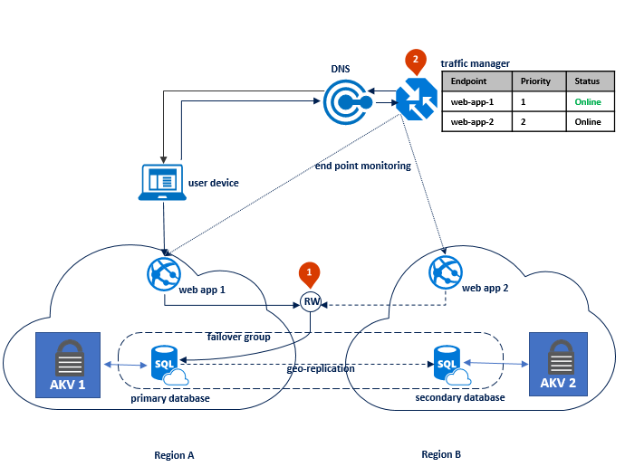

---
title: "TDE - Bring Your Own Key (BYOK) - Azure SQL | Microsoft Docs"
description: "Bring Your Own Key (BYOK) support for Transparent Data Encryption (TDE) with Azure Key Vault for SQL Database and Data Warehouse. TDE with BYOK overview, benefits, how it works, considerations, and recommendations."
keywords: ""
services: "sql-database"
documentationcenter: ""
author: "aliceku"
manager: "craigg"
ms.prod: 
ms.reviewer: ""
ms.suite: sql
ms.prod_service: sql-database, sql-data-warehouse
ms.service: "sql-database"
ms.custom: 
ms.component: "security"
ms.workload: "On Demand"
ms.tgt_pltfrm: ""
ms.devlang: "na"
ms.topic: "article"
ms.date: "01/31/2018"
ms.author: "aliceku"
--- 
# Transparent Data Encryption with Bring Your Own Key (PREVIEW) support for Azure SQL Database and Data Warehouse
[!INCLUDE[appliesto-xx-asdb-asdw-xxx-md](../../../includes/appliesto-xx-asdb-asdw-xxx-md.md)]

Bring Your Own Key (BYOK) support for [Transparent Data Encryption (TDE)](transparent-data-encryption.md) allows you to encrypt the Database Encryption Key (DEK) with an asymmetric key called TDE Protector.  The TDE Protector is stored under your control in [Azure Key Vault](https://docs.microsoft.com/azure/key-vault/key-vault-secure-your-key-vault), Azure’s cloud-based external key management system. Azure Key Vault is the first key management service with which TDE has integrated support for BYOK. The TDE DEK, which is stored on the boot page of a database is encrypted and decrypted by the TDE protector. The TDE Protector is stored in Azure Key Vault and never leaves the key vault. If the server's access to the key vault is revoked, a database cannot be decrypted and read into memory.  The TDE protector is set at the logical server level and is inherited by all databases associated with that server. 

With BYOK support, users can now control key management tasks including key rotations, key vault permissions, deleting keys, and enable auditing/reporting on all TDE protectors using Azure Key Vault functionality. Key Vault provides central key management, leverages tightly monitored hardware security modules (HSMs), and enables separation of duties between management of keys and data to help meet regulatory compliance.  


TDE with BYOK provides the following benefits:
- Increased transparency and granular control with the ability to self-manage the TDE protector   
- Central management of TDE protectors (along with other keys and secrets used in other Azure services) by hosting them in Key Vault
- Separation of key and data management responsibilities within the organization, to support separation of duties
- Greater trust from your own clients, since Key Vault is designed so that Microsoft does not see or extract any encryption keys. 
- Support for key rotation

> [!IMPORTANT]
> For those using service-managed TDE who would like to start using Key Vault, TDE remains enabled during the process of switching over to a TDE protector in Key Vault. There is no downtime nor re-encryption of the database files. Switching from a service-managed key to a Key Vault key only requires re-encryption of the database encryption key (DEK), which is a fast and online operation. 
>

## How does TDE with BYOK support work?
 


When TDE is first configured to use a TDE protector from Key Vault, the server sends the DEK of each TDE-enabled database to Key Vault for a wrap key request. Key Vault returns the encrypted database encryption key, which is stored in the user database.  

>[!IMPORTANT]
>It is important to note that **once a TDE Protector is stored in Azure Key Vault, it never leaves Azure Key Vault**. The logical server can only send key operation requests to the TDE protector key material within Key Vault, and **never accesses or caches the TDE protector**. The Key Vault administrator has the right to revoke Key Vault permissions of the server at any point, in which case all connections to the server are cut off. 
>


## Guidelines for configuring TDE with BYOK

### General Guidelines
- Ensure Azure Key Vault and Azure SQL Database are going to be in the same tenant.  Cross-tenant key vault and server interactions **are not supported**.
- Decide which subscriptions are going to be used for the required resources – moving the server across subscriptions later requires a new setup of TDE with BYOKs.
- When configuring TDE with BYOK, it is important to consider the load placed on the key vault by repeated wrap/unwrap operations. For example, since all databases associated with a logical server use the same TDE protector, a failover of that server will trigger as many key operations against the vault as there are databases in the server. Based on our experience and documented [key vault service limits](https://docs.microsoft.com/en-us/azure/key-vault/key-vault-service-limits), we recommend associating at most 500 Standard or 200 Premium databases with one Azure Key Vault in a single subscription to ensure consistently high availability when accessing the TDE protector in the vault. 
- Recommended: Keep a copy of the TDE protector on premises.  This requires an HSM device to create a TDE Protector locally and a key escrow system to store a local copy of the TDE Protector.


### Guidelines for configuring Azure Key Vault

- Use a key vault with [soft-delete](https://docs.microsoft.com/azure/key-vault/key-vault-ovw-soft-delete) enabled to protect from data loss in case of accidental key – or key vault – deletion:  
  - Soft deleted resources are retained for a set period of time, 90 days unless they are recovered or purged.
  - The **recover** and **purge** actions have their own permissions associated in a key vault access policy. 
- Grant the logical server access to the key vault using its Azure Active Directory (AAD) Identity.  When using the Portal UI, the AAD identity gets automatically created and the key vault access permissions are granted to the server.  Using PowerShell to configure TDE with BYOK, the AAD identity must be created and completion should be verified. See [Configure TDE with BYOK](transparent-data-encryption-byok-azure-sql-configure.md) for detailed step-by-step instructions when using PowerShell.

  >[!NOTE]
  >If the AAD Identity **is accidentally deleted or the server’s permissions are revoked** using the key vault’s access policy, the  server loses access to the key vault.
  >
  
- Enable auditing and reporting on all encryption keys: Key Vault provides logs that are easy to inject into other security information and event management (SIEM) tools. Operations Management Suite (OMS) [Log Analytics](https://docs.microsoft.com/azure/log-analytics/log-analytics-azure-key-vault) is one example of a service that is already integrated.
- To ensure high-availability of encrypted databases, configure each logical server with two Azure Key Vaults that reside in different regions.


### Guidelines for configuring the TDE Protector (asymmetric key) stored in Azure Key Vault

- Create your encryption key locally on a local HSM device. Ensure this is an asymmetric, RSA 2048 key so it is storable in Azure Key Vault.
- Escrow the key in a key escrow system.  
- Import the encryption key file (.pfx, .byok, or .backup) to Azure Key Vault. 
    

>[!NOTE] 
    >For testing purposes, it is possible to create a key with Azure Key Vault, however this key cannot be escrowed, because  the private key can never leave the key vault.  Always back up and escrow keys used to encrypt production data, as the loss of the key (accidental deletion in key vault, expiration etc.) results in permanent data loss.
    >
    
- Use a key without an expiration date – and never set an expiration date on a key already in use: **once the key expires, the encrypted databases lose access to their TDE Protector and are dropped within 24 hours**.
- Ensure the key is enabled and has permissions to perform *get*, *wrap key*, and *unwrap key* operations.
- Create an Azure Key Vault key backup before using the key in Azure Key Vault for the first time. Learn more about the [Backup-AzureKeyVaultKey](https://docs.microsoft.com/en-us/powershell/module/azurerm.keyvault/backup-azurekeyvaultkey?view=azurermps-5.1.1) command.
- Create a new backup whenever any changes are made to the key (for example, add ACLs, add tags, add key attributes).
- **Keep previous versions** of the key in the key vault when rotating keys, so older database backups can be restored. When the TDE Protector is changed for a database, old backups of the database **are not updated** to use the latest TDE Protector.  Each backup needs the TDE Protector it was created with at restore time. Key rotations can be performed following the instructions at [Rotate the Transparent Data Encryption Protector Using PowerShell](transparent-data-encryption-byok-azure-sql-key-rotation.md).
- Keep all previously used keys in Azure Key Vault after changing back to service-managed keys.  This ensures database backups can be restored with the TDE protectors stored in Azure Key Vault.  TDE protectors created with Azure Key Vault have to be maintained until all stored backups have been created with service-managed keys.  
- Make recoverable backup copies of these keys using [Backup-AzureKeyVaultKey](https://docs.microsoft.com/en-us/powershell/module/azurerm.keyvault/backup-azurekeyvaultkey?view=azurermps-5.1.1).
- To remove a potentially compromised key during a security incident without the risk of data loss, follow the steps at [Remove a potentially compromised key](transparent-data-encryption-byok-azure-sql-remove-tde-protector.md).


## High Availability, Geo-Replication, and Backup / Restore

### High availability and disaster recovery

How to configure high availability with Azure Key Vault depends on the configuration of your database and logical server, and here are the recommended configurations for two distinct cases.  The first case is a stand-alone database or logical server with no configured geo redundancy.  The second case is a database or logical server configured with failover groups or geo-redundancy, where it must be ensured that each geo-redundant copy has a local Azure Key Vault within the failover group to ensure geo-failovers work. 
In the first case, if you require high availability of a database and logical server with no configured geo-redundancy, it is highly recommended to configure the server to use two different key vaults in two different regions with the same key material.  This can be accomplished by creating a TDE protector using the primary Key Vault co-located in the same region as the logical server and cloning the key into a key vault in a different Azure region, so that the server has access to a second key vault should the primary key vault experience an outage while the database is up and running. Use the Backup-AzureKeyVaultKey cmdlet to retrieve the key in encrypted format from the primary key vault and then use the Restore-AzureKeyVaultKey cmdlet and specify a key vault in the second region.


In the second case, it is required to configure redundant Azure Key Vaults based on the existing SQL Database failover groups or active geo-replication copies of databases to maintain high availability of TDE protectors in the Azure Key Vault.  Each geo-replicated server requires a separate key vault, ideally co-located in the same Azure region as its server. Should a primary database become inaccessible due to an outage in one region and a failover is triggered, the secondary database is able to take over using the secondary key vault.  



To ensure that continuous access to the TDE protector in Azure Key Vault is guaranteed during a failover, this must be configured before a database is replicated or failed over to a secondary server. Both, primary and secondary servers have to store copies of the TDE protectors in all other Azure Key Vaults, which means in this example the same keys are stored in both key vaults.

To add an existing key from one key vault to another key vault, use the [Add-AzureRmSqlServerKeyVaultKey](https://docs.microsoft.com/en-us/powershell/module/azurerm.sql/add-azurermsqlserverkeyvaultkey) cmdlet.

 ```powershell
   <# Include the version guid in the KeyId #>
   Add-AzureRmSqlServerKeyVaultKey `
   -KeyId <KeyVaultKeyId> `
   -ServerName <LogicalServerName> `
   -ResourceGroup <SQLDatabaseResourceGroupName>
   ```

>[!NOTE]
>The combined character length of the key vault name and the key name cannot exceed 94 characters.
>
 
Follow the steps in [Active geo-replication overview](https://docs.microsoft.com/azure/sql-database/sql-database-geo-replication-overview) to configure active geo-replication with these servers and to trigger a failover. 


### Backup and Restore

Once a database is encrypted with TDE using a key from Key Vault, any generated backups are also encrypted with the same TDE Protector.

To restore a backup encrypted with a TDE Protector from Key Vault, make sure that the key material is still in the original vault under the original key name. When the TDE Protector is changed for a database, old backups of the database **are not** updated to use the latest TDE Protector. Therefore, we recommend that you keep all old versions of the TDE Protector in Key Vault, so database backups can be restored. 

If a key that might be needed for restoring a backup is no longer in its original key vault, the following error message  is returned:
"Target server <Servername> does not have access to all AKV Uris created between <Timestamp #1> and <Timestamp #2>. Please retry operation after restoring all AKV Uris."

To mitigate this, run the [Get-AzureRmSqlServerKeyVaultKey](/powershell/module/azurerm.sql/get-azurermsqlserverkeyvaultkey) cmdlet to return the list of keys from Key Vault that were added to the server (unless they were deleted by a user). To ensure all backups can be restored, make sure the target server for the backup has access to all of these keys.

   ```powershell
   Get-AzureRmSqlServerKeyVaultKey `
   -ServerName <LogicalServerName> `
   -ResourceGroup <SQLDatabaseResourceGroupName>
   ```
To learn more about backup recovery for SQL Database, see [Recover an Azure SQL database](https://docs.microsoft.com/azure/sql-database/sql-database-recovery-using-backups). To learn more about backup recovery for SQL Data Warehouse, see [Recover an Azure SQL Data Warehouse](https://docs.microsoft.com/azure/sql-data-warehouse/sql-data-warehouse-restore-database-overview).

Additional consideration for backed up log files: Backed up log files remain encrypted with the original TDE Encryptor, even if the TDE Protector was rotated and the database is now using a new TDE Protector.  At restore time, both keys will be needed to restore the database.  If the log file is using a TDE Protector stored in Azure Key Vault, this key will be needed at restore time, even if the database has been changed to use service-managed TDE in the meantime.   
