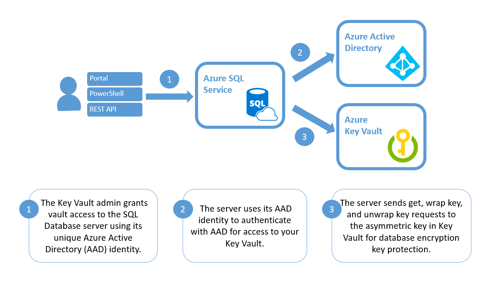

---
title: 'TDE - Bring your own key - Azure SQL | Microsoft Docs'
description: An overview of bring your own key support for Transparent Data Encryption with Azure Key Vault for SQL Database and Data Warehouse. The document covers the benefits of the feature, how it works, considerations, and recomendations.
keywords:
services: sql-database
documentationcenter: ''
author: becczhang
manager: jhubbard
editor: ''
ms.assetid: 
ms.service: sql-database
ms.custom: security
ms.workload:
ms.tgt_pltfrm:
ms.devlang: na
ms.topic: article
ms.date: 06/20/2017
ms.author: rebeccaz
--- 

# Transparent Data Encryption with Bring Your Own Key support for Azure SQL Database and Data Warehouse

[!INCLUDE[tsql-appliesto-xxxxxx-asdb-asdw-xxx-md](../../../includes/tsql-appliesto-xxxxxx-asdb-asdw-xxx-md.md)]

Bring Your Own Key (BYOK) support for [Transparent Data Encryption (TDE)](transparent-data-encryption.md) allows you to take control over your TDE encryption keys and control who can access them and when. [Azure Key Vault](https://docs.microsoft.com/azure/key-vault/key-vault-secure-your-key-vault), Azure’s cloud-based external key management system, is the first key management service with which TDE has integrated support for BYOK. With BYOK, the database encryption key is protected by an asymmetric key stored in Key Vault. The asymmetric key is set at the server level and inherited by all databases under that server. 

With BYOK support, users can now control key management tasks including key rotations, key vault permissions, deleting keys, and enable auditing/reporting on all encryption keys. Key Vault provides central key management, leverages tightly monitored hardware security modules (HSMs), and promotes separation of management of keys and data to help meet regulatory compliance. 

TDE with BYOK provides the following benefits:
- Increased transparency and granular control with the ability to self-manage the TDE protector   
- Central management of TDE encryption keys (along with other keys and secrets used in other Azure services) by hosting them in Key Vault
- Separation of keys and data management within the organization, to support separation of roles
- Greater trust from your own clients, since Key Vault is designed so that Microsoft does not see or extract any encryption keys. 
- Support for key rotation

> [!IMPORTANT]
> For those using service-managed TDE who would like to start using Key Vault, TDE remains on during the process of switching over to a key in Key Vault. There is no downtime nor re-encryption of the database files themselves. Switching from a service-managed key to a Key Vault key requires re-encryption of the database encryption key, which is a fast and online operation.
>

## How does TDE with BYOK support work?
 


When TDE is configured to use a key from Key Vault, the server sends the database encryption key of each TDE-enabled database to Key Vault for a *wrap key* request. Key Vault returns the encrypted database encryption key, which is stored in the user database. 

It is important to note that **once a key is stored in Key Vault, that key never leaves Key Vault**. A hardware security module (HSM)-backed key in Key Vault never leaves the HSM security boundary. The server can only send key operation requests to the TDE protector key material within Key Vault. The Key Vault administrator has the right to revoke Key Vault permissions for the server at any point, in which case all connections to the server are cut off. 

## Considerations

Using TDE with BYOK brings both additional key management tasks to you and related costs for the use of the key vault itself. These considerations are discussed in the next two sections.

### Key Management Responsibilities

Taking over encryption key management of an application’s resources is an important responsibility. By using TDE with BYOK through Key Vault, the following are the key management tasks that you are assuming:
- **Key rotations:** The TDE protectors should be rotated according to internal regulations or compliance requirements. Key rotations can be done through the TDE protector’s key vault.  
- **Key vault permissions**: Permissions within Key Vault are provisioned across a key vault and server level. The server's permissions to a key vault can be revoked at any time using the key vault's access policy.
- **Deleting keys**: Keys may be dropped from Key Vault and the SQL server for additional safety or to meet compliance.
- **Auditing/reporting on all encryption keys**: Key Vault provides logs that are easy to inject into other security information and event management (SIEM) tools. Operations Management Suite (OMS) [Log Analytics](https://docs.microsoft.com/azure/log-analytics/log-analytics-azure-key-vault) is one example service that is already integrated.

### Pricing Considerations 

TDE with BYOK support is a security capability that is built into Azure SQL Database and Data Warehouse, without any extra fees. However, there are related costs for using Key Vault itself. Key Vault operations made by the server are charged as normal operations to your vault, and follow Key Vault’s [pricing](https://azure.microsoft.com/pricing/details/key-vault/). The server sends requests to Key Vault for the following events:
- SQL instance restarts
- Key rollovers
- Every 6 hours to check if any changes have been made to the server’s permissions to the key vault

## Important Warnings

### Loss of access to keys

Once a server no longer has access to the TDE Protector (either by removed Key Vault permissions or a deleted key), **all connections to the encrypted databases under the server are blocked, and these databases go offline and get dropped within 24 hours**. Old backups encrypted with the unavailable key are no longer be accessible. If there is an extreme case where a key is suspected to be compromised (such that a service or user had unauthorized access to the key), it’s best to delete the key by following the guidelines at [Remove a potentially compromised key](transparent-data-encryption-byok-azure-sql-remove-tde-protector.md). The databases must be dropped before deletion of an active TDE protector to prevent up to 10 minutes of potential data loss.  

### Expired keys

Because the TDE Protector’s availability directly impacts database availability, a key with an expiration date is not allowed to be added to a SQL server. If a key is already used as a TDE Protector for a server, and is later added an expiration date in Azure Key Vault, **once the key becomes expired, the encrypted databases no longer have access to their TDE Protector and are dropped within 24 hours.**

### Deleted server identities 

A server's access to Key Vault is managed through the server's unique Azure Active Directory (AAD) identity. Therefore, if the server's identity is deleted from AAD, the server loses access to its key vaults. As a result, **all connections to the encrypted databases under the server are blocked, and these databases go offline and get dropped within 24 hours.**

## Limitations

Key vaults being used for TDE must be in the same AAD tenant as the SQL Database or Data Warehouse server. Cross-tenant key vault and server interactions are not supported. A resource that is being encrypted with a key from Key Vault cannot be moved across Azure subscriptions. Moving the resource across subscriptions breaks the necessary Key Vault access controls that made TDE with BYOK possible. If any resources must be moved to another subscription, change the TDE mode from BYOK to [Service Managed TDE](transparent-data-encryption-azure-sql.md). 

Unique TDE Protectors for a database or data warehouse are not supported. The TDE Protector is set on the server-level, and inherited by all resources under the server. 

## Guidelines for Managing Encrypted Databases

### High Availability & Disaster Recovery
  
There are two ways geo-replication can be configured for servers using Key Vault: 

- **Separate key vault**: Each server has access to a separate key vault (ideally each within their own Azure region). This is the recommended configuration, since each server has its own copy of the TDE protector for the encrypted geo-replicated databases. If one of the server’s Azure regions goes offline, the other servers can continue to access the geo-replicated databases.   

- **Shared key vault**: All servers share the same key vault. This configuration is easier to set up, but if the Azure region where the key vault is located goes offline, all servers are not be able to read the encrypted geo-replicated databases or their own encrypted databases. 
 
To get started, use the [Add-AzureRmSqlServerKeyVaultKey](/powershell/module/azurerm.sql/add-azurermsqlserverkeyvaultkey) cmdlet to add each server’s Key Vault key to the other servers in the geo-replication link.  
(Example of a KeyId from Key Vault: *https://contosokeyvault.vault.azure.net/keys/Key1/1a1a2b2b3c3c4d4d5e5e6f6f7g7g8h8h*)

   ```powershell
   <# Include the version guid in the KeyId #>
   Add-AzureRmSqlServerKeyVaultKey `
   -KeyId <KeyVaultKeyId> `
   -ServerName <LogicalServerName> `
   -ResourceGroup <SQLDatabaseResourceGroupName>
   ```

>[!NOTE]
>The combined character length of the key vault name and the key name cannot exceed 94 characters.
>

Follow the steps in [Active geo-replication overview](https://docs.microsoft.com/azure/sql-database/sql-database-geo-replication-overview) to configure active geo-replication with these servers and to trigger a failover.  

### Backup & Restore

Once a database is encrypted with TDE using a key from Key Vault, any generated backups are also encrypted with the same TDE Protector.

To restore a backup encrypted with a TDE Protector from Key Vault, make sure that the key material is still in the original vault under the original key name. When the TDE Protector is changed for a database, old backups of the database **are not** updated to use the latest TDE Protector. Therefore, we recommend that you keep all old versions of the TDE Protector in Key Vault, so database backups can be restored. 

If a key that might be needed for restoring a backup is no longer in its original key vault, the following error message  is returned:
"Target server <Servername> does not have access to all AKV Uris created between <Timestamp #1> and <Timestamp #2>. Please retry operation after restoring all AKV Uris."

To mitigate this, run the [Get-AzureRmSqlServerKeyVaultKey](/powershell/module/azurerm.sql/get-azurermsqlserverkeyvaultkey) cmdlet to return the list of keys from Key Vault that were added to the server. To ensure all backups can be restored, please make sure the target server for the backup has access to all of these keys.

   ```powershell
   Get-AzureRmSqlServerKeyVaultKey `
   -ServerName <LogicalServerName> `
   -ResourceGroup <SQLDatabaseResourceGroupName>
   ```
To learn more about backup recovery for SQL Database, see [Recover an Azure SQL database](https://docs.microsoft.com/azure/sql-database/sql-database-recovery-using-backups). To learn more about backup recovery for SQL Data Warehouse, see [Recover an Azure SQL Data Warehouse](https://docs.microsoft.com/azure/sql-data-warehouse/sql-data-warehouse-restore-database-overview).

## Best practices

### Key Management 

To ensure quick key recovery and access your data outside of Azure, we recommend the following:
- Create your encryption key locally on a local HSM device. (Make sure this is an asymmetric, RSA 2048 key so it is storable in Azure Key Vault.)
- Import the encryption key file (.pfx, .byok, or .backup) to Azure Key Vault. 
- Before using the key in Azure Key Vault for the first time, take an Azure Key Vault key backup. Learn more about the [Backup-AzureKeyVaultKey](https://msdn.microsoft.com/library/mt126292.aspx) command.
- Whenever any changes are made to the key (for example, add ACLs, add tags, add key attributes), be sure to take another Azure Key Vault key backup.
- During a key rollover, **keep previous versions of the key** in the key vault so older database backups can be restored. 

Creating the TDE encryption key locally first and importing the asymmetric key is highly recommended for production scenarios because it allows the administrator to escrow the key in a key escrow system. If the asymmetric key is created in the Azure Key Vault, it cannot be escrowed because the private key can never leave the vault. Keys used to protect critical data should be escrowed. The loss of an asymmetric key results in permanently unrecoverable data.

### Pre-configuration for Replicated Databases

If an encrypted database is going to be replicated to another server, make sure that the server has access to a copy of the Key Vault key material used in the other server **before** moving or replicating the database.  

We recommend that each server have access to a copy of the Key Vault key material used in the other server, which is stored in a separate key vault (ideally each within the same Azure region as the server). With this setup, each server has its own copy of the TDE Protector for the encrypted replicated databases. If one of the servers’ Azure region goes offline, the other servers can continue to access the replicated databases.

## Next steps

- Get started with Bring Your Own Key support for TDE: [Turn on TDE using your own key from Key Vault using PowerShell](transparent-data-encryption-byok-azure-sql-configure.md)
- Learn how to rotate the TDE Protector of a server to comply with security requirements: [Rotate the Transparent Data Encryption Protector Using PowerShell](transparent-data-encryption-byok-azure-sql-key-rotation.md)
- In case of a security risk, learn how to remove a potentially compromised TDE Protector: [Remove a potentially compromised key](transparent-data-encryption-byok-azure-sql-remove-tde-protector.md) 
