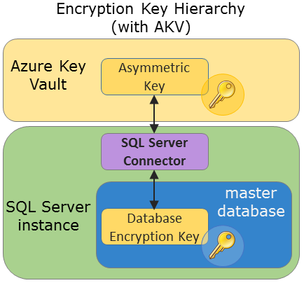
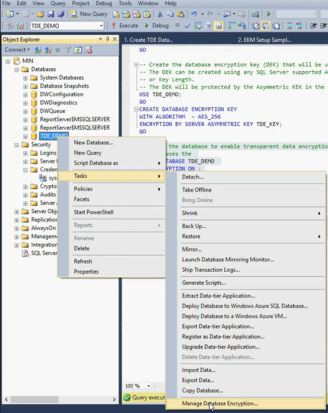
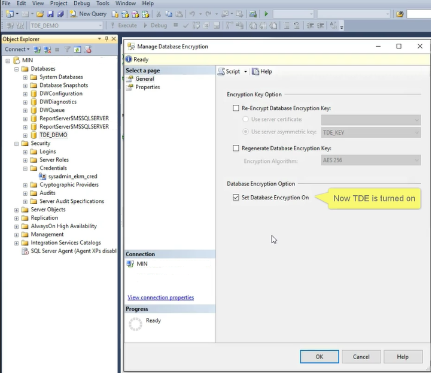

# Use SQL Server Connector with SQL Encryption Features
[!INCLUDE[appliesto-xx-asdb-xxxx-xxx-md](../../../includes/applies-to-version/sqlserver.md)]
  Common [!INCLUDE[ssNoVersion](../../../includes/ssnoversion-md.md)] encryption activities using an asymmetric key protected by the Azure Key Vault include the following three areas.  
  
-   Transparent Data Encryption by using an Asymmetric Key from Azure Key Vault  
  
-   Encrypting Backups by Using an Asymmetric Key from the Key Vault  
  
-   Column Level Encryption by Using an Asymmetric Key from the Key Vault  
  
 Complete parts I through IV of the topic [Setup Steps for Extensible Key Management Using the Azure Key Vault](../../../relational-databases/security/encryption/setup-steps-for-extensible-key-management-using-the-azure-key-vault.md), before following the steps on this topic.  
 
> [!NOTE]  
>  Versions 1.0.0.440 and older have been replaced and are no longer supported in production environments. Upgrade to version 1.0.1.0 or later by visiting the [Microsoft Download Center](https://www.microsoft.com/download/details.aspx?id=45344) and using the instructions on the [SQL Server Connector Maintenance & Troubleshooting](../../../relational-databases/security/encryption/sql-server-connector-maintenance-troubleshooting.md) page under "Upgrade of SQL Server Connector."  
  
## Transparent Data Encryption by using an Asymmetric Key from Azure Key Vault

After completing Parts I through IV of the topic Setup Steps for Extensible Key Management Using the Azure Key Vault, use the Azure Key Vault key to encrypt the database encryption key using TDE. For more information about rotating keys using PowerShell, see [Rotate the Transparent Data Encryption (TDE) protector using PowerShell](/azure/sql-database/transparent-data-encryption-byok-azure-sql-key-rotation).
 
[!IMPORTANT] Do not delete previous versions of the key after a rollover. When keys are rolled over, some data is still encrypted with the previous keys, such as older database backups, backed-up log files and transaction log files.

You will need to create a credential and a login, and create a database encryption key which will encrypt the data and logs in the database. To encrypt a database requires **CONTROL** permission on the database. The following graphic shows the hierarchy of the encryption key when using the Azure Key Vault.  
  
   
  
1.  **Create a [!INCLUDE[ssNoVersion](../../../includes/ssnoversion-md.md)] credential for the Database Engine to use for TDE**  
  
     The Database Engine uses the credential to access the Key Vault during database load. We recommend creating another Azure Active Directory **Client ID** and **Secret** in Part I for the [!INCLUDE[ssDE](../../../includes/ssde-md.md)], to limit the Key Vault permissions that are granted.  
  
     Modify the [!INCLUDE[tsql](../../../includes/tsql-md.md)] script below in the following ways:  
  
    -   Edit the `IDENTITY` argument (`ContosoDevKeyVault`) to point to your Azure Key Vault.
        - If you're using **global Azure**, replace the `IDENTITY` argument with the name of your Azure Key Vault from Part II.
        - If you're using a **private Azure cloud** (ex. Azure Government, Azure China 21Vianet, or Azure Germany), replace the `IDENTITY` argument with the Vault URI that is returned in Part II, step 3. Do not include "https://" in the Vault URI.   
  
    -   Replace the first part of the `SECRET` argument with the Azure Active Directory **Client ID** from Part I. In this example, the **Client ID** is `EF5C8E094D2A4A769998D93440D8115D`.
  
        > [!IMPORTANT]  
        >  You must remove the hyphens from the **Client ID**.  
  
    -   Complete the second part of the `SECRET` argument with **Client Secret** from Part I. In this example, the **Client Secret** from Part 1 is `ReplaceWithAADClientSecret`. 
  
    -   The final string for the SECRET argument will be a long sequence of letters and numbers, with no hyphens.
  
    ```sql  
    USE master;  
    CREATE CREDENTIAL Azure_EKM_TDE_cred   
        WITH IDENTITY = 'ContosoDevKeyVault', -- for global Azure
        -- WITH IDENTITY = 'ContosoDevKeyVault.vault.usgovcloudapi.net', -- for Azure Government
        -- WITH IDENTITY = 'ContosoDevKeyVault.vault.azure.cn', -- for Azure China 21Vianet
        -- WITH IDENTITY = 'ContosoDevKeyVault.vault.microsoftazure.de', -- for Azure Germany   
        SECRET = 'EF5C8E094D2A4A769998D93440D8115DReplaceWithAADClientSecret'   
    FOR CRYPTOGRAPHIC PROVIDER AzureKeyVault_EKM_Prov;  
    ```  
  
2.  **Create a [!INCLUDE[ssNoVersion](../../../includes/ssnoversion-md.md)] login for the [!INCLUDE[ssDE](../../../includes/ssde-md.md)] for TDE**  
  
     Create a [!INCLUDE[ssNoVersion](../../../includes/ssnoversion-md.md)] login and add the credential from Step 1 to it. This [!INCLUDE[tsql](../../../includes/tsql-md.md)] example uses the same key that was imported earlier.  
  
    ```sql  
    USE master;  
    -- Create a SQL Server login associated with the asymmetric key   
    -- for the Database engine to use when it loads a database   
    -- encrypted by TDE.  
    CREATE LOGIN TDE_Login   
    FROM ASYMMETRIC KEY CONTOSO_KEY;  
    GO   
  
    -- Alter the TDE Login to add the credential for use by the   
    -- Database Engine to access the key vault  
    ALTER LOGIN TDE_Login   
    ADD CREDENTIAL Azure_EKM_TDE_cred ;  
    GO  
    ```  
  
3.  **Create the Database Encryption Key (DEK)**  
  
     The DEK will encrypt your data and log files in the database instance, and in turn be encrypted by the Azure Key Vault asymmetric key. The DEK can be created using any [!INCLUDE[ssNoVersion](../../../includes/ssnoversion-md.md)] supported algorithm or key length.  
  
    ```sql  
    USE ContosoDatabase;  
    GO  
  
    CREATE DATABASE ENCRYPTION KEY   
    WITH ALGORITHM = AES_256   
    ENCRYPTION BY SERVER ASYMMETRIC KEY CONTOSO_KEY;  
    GO  
    ```  
  
4.  **Turn On TDE**  
  
    ```sql  
    -- Alter the database to enable transparent data encryption.  
    ALTER DATABASE ContosoDatabase   
    SET ENCRYPTION ON;  
    GO  
    ```  
  
     Using [!INCLUDE[ssManStudio](../../../includes/ssmanstudio-md.md)],  verify that TDE has been turned on by connecting to your database with Object Explorer. Right-click your database, point to **Tasks**, and then click **Manage Database Encryption**.  
  
       
  
     In the **Manage Database Encryption** dialog box, confirm that TDE is on, and what asymmetric key is encrypting the DEK.  
  
       
  
     Alternatively, you can execute the following [!INCLUDE[tsql](../../../includes/tsql-md.md)] script. An encryption state of 3 indicates an encrypted database.  
  
    ```sql  
    USE MASTER  
    SELECT * FROM sys.asymmetric_keys  
  
    -- Check which databases are encrypted using TDE  
    SELECT d.name, dek.encryption_state   
    FROM sys.dm_database_encryption_keys AS dek  
    JOIN sys.databases AS d  
         ON dek.database_id = d.database_id;  
    ```  
  
    > [!NOTE]  
    >  The `tempdb` database is automatically encrypted whenever any database enables TDE.  
  
## Encrypting Backups by Using an Asymmetric Key from the Key Vault  
 Encrypted backups are supported starting with [!INCLUDE[ssSQL14](../../../includes/sssql14-md.md)]. The following example creates and restores a backup encrypted a data encryption key protected by the asymmetric key in the key vault.  
The [!INCLUDE[ssDE](../../../includes/ssde-md.md)] needs the credential when accessing the Key Vault during database load. We recommend creating another Azure Active Directory Client ID and Secret in Part I for the Database Engine, to limit the Key Vault permissions that are granted.  
  
1.  **Create a SQL Server credential for the Database Engine to use for Backup Encryption**  
  
     Modify the [!INCLUDE[tsql](../../../includes/tsql-md.md)] script below in the following ways:  
  
    -   Edit the `IDENTITY` argument (`ContosoDevKeyVault`) to point to your Azure Key Vault.
        - If you're using **global Azure**, replace the `IDENTITY` argument with the name of your Azure Key Vault from Part II.
        - If you're using a **private Azure cloud** (ex. Azure Government, Azure China 21Vianet, or Azure Germany), replace the `IDENTITY` argument with the Vault URI that is returned in Part II, step 3. Do not include "https://" in the Vault URI.    
  
    -   Replace the first part of the `SECRET` argument with the Azure Active Directory **Client ID** from Part I. In this example, the **Client ID** is `EF5C8E094D2A4A769998D93440D8115D`.  
  
        > [!IMPORTANT]  
        >  You must remove the hyphens from the **Client ID**.  
  
    -   Complete the second part of the `SECRET` argument with **Client Secret** from Part I.  In this example the **Client Secret** from Part I is `Replace-With-AAD-Client-Secret`. The final string for the `SECRET` argument will be a long sequence of letters and numbers, with *no hyphens*.   
  
        ```sql  
        USE master;  
  
        CREATE CREDENTIAL Azure_EKM_Backup_cred   
            WITH IDENTITY = 'ContosoDevKeyVault', -- for global Azure
            -- WITH IDENTITY = 'ContosoDevKeyVault.vault.usgovcloudapi.net', -- for Azure Government
            -- WITH IDENTITY = 'ContosoDevKeyVault.vault.azure.cn', -- for Azure China 21Vianet
            -- WITH IDENTITY = 'ContosoDevKeyVault.vault.microsoftazure.de', -- for Azure Germany   
            SECRET = 'EF5C8E094D2A4A769998D93440D8115DReplace-With-AAD-Client-Secret'   
        FOR CRYPTOGRAPHIC PROVIDER AzureKeyVault_EKM_Prov;    
        ```  
  
2.  **Create a [!INCLUDE[ssNoVersion](../../../includes/ssnoversion-md.md)] login for the [!INCLUDE[ssDE](../../../includes/ssde-md.md)] for Backup Encryption**  
  
     Create a [!INCLUDE[ssNoVersion](../../../includes/ssnoversion-md.md)] login to be used by the [!INCLUDE[ssDE](../../../includes/ssde-md.md)]e for encryption backups, and add the credential from Step 1 to it. This [!INCLUDE[tsql](../../../includes/tsql-md.md)] example uses the same key that was imported earlier.  
  
    > [!IMPORTANT]  
    >  You cannot use the same asymmetric key for backup encryption if you've already used that key for TDE (the above example) or column level Encryption (the following example).  
  
     This example uses the `CONTOSO_KEY_BACKUP` asymmetric key stored in the key vault, which can be imported or created earlier for the master database, as Part IV, Step 5 earlier.  
  
    ```sql  
    USE master;  
  
    -- Create a SQL Server login associated with the asymmetric key   
    -- for the Database engine to use when it is encrypting the backup.  
    CREATE LOGIN Backup_Login   
    FROM ASYMMETRIC KEY CONTOSO_KEY_BACKUP;  
    GO   
  
    -- Alter the Encrypted Backup Login to add the credential for use by   
    -- the Database Engine to access the key vault  
    ALTER LOGIN Backup_Login   
    ADD CREDENTIAL Azure_EKM_Backup_cred ;  
    GO  
    ```  
  
3.  **Backup the Database**  
  
     Backup the database specifying encryption with the asymmetric key stored in the key vault.
     
     In the below example, note that if the database was already encrypted with TDE, and the asymmetric key `CONTOSO_KEY_BACKUP` is different from the TDE asymmetric key, the backup will be encrypted by both the TDE asymmetric key and `CONTOSO_KEY_BACKUP`. The target [!INCLUDE[ssNoVersion](../../../includes/ssnoversion-md.md)] instance will need both keys in order to decrypt the backup.
  
    ```sql  
    USE master;  
  
    BACKUP DATABASE [DATABASE_TO_BACKUP]  
    TO DISK = N'[PATH TO BACKUP FILE]'   
    WITH FORMAT, INIT, SKIP, NOREWIND, NOUNLOAD,   
    ENCRYPTION(ALGORITHM = AES_256,   
    SERVER ASYMMETRIC KEY = [CONTOSO_KEY_BACKUP]);  
    GO  
    ```  
  
4.  **Restore the Database**  
    
    To restore a database backup that is encrypted with TDE, the target [!INCLUDE[ssNoVersion](../../../includes/ssnoversion-md.md)] instance must first have a copy of the asymmetric Key Vault key used for encryption. This is how this would be achieved:  
    
    - If the original asymmetric key used for TDE is no longer in Key Vault, restore the Key Vault key backup or reimport the key from a local HSM. **Important:** In order to have the key's thumbprint match the thumbprint recorded on the database backup, the key must be named the **same Key Vault key name** as it was originally named before.
    
    - Apply Steps 1 and 2 on the target [!INCLUDE[ssNoVersion](../../../includes/ssnoversion-md.md)] instance.
    
    - Once the target [!INCLUDE[ssNoVersion](../../../includes/ssnoversion-md.md)] instance has access to the asymmetric key(s) used to encrypt the backup, restore the database on the server.
    
     Sample restore code:  
  
    ```sql  
    RESTORE DATABASE [DATABASE_TO_BACKUP]  
    FROM DISK = N'[PATH TO BACKUP FILE]'   
        WITH FILE = 1, NOUNLOAD, REPLACE;  
    GO  
    ```  
  
     For more information about backup options, see [BACKUP (Transact-SQL)](../../../t-sql/statements/backup-transact-sql.md).  
  
## Column Level Encryption by Using an Asymmetric Key from the Key Vault  
 The following example creates a symmetric key protected by the asymmetric key in the key vault. Then the symmetric key is used to encrypt data in the database.  
  
> [!IMPORTANT]  
>  You cannot use the same asymmetric key for backup encryption if you've already used that key for TDE or backup encryption (the preceding examples).  
  
 This example uses the `CONTOSO_KEY_COLUMNS` asymmetric key stored in the key vault, which can be imported or created earlier, as described in Step 3, section 3 of [Setup Steps for Extensible Key Management Using the Azure Key Vault](../../../relational-databases/security/encryption/setup-steps-for-extensible-key-management-using-the-azure-key-vault.md). To use this asymmetric key in the `ContosoDatabase` database, you must execute the `CREATE ASYMMETRIC KEY` statement again, to provide the `ContosoDatabase` database with a reference to the key.  
  
```sql  
USE [ContosoDatabase];  
GO  
  
-- Create a reference to the key in the key vault  
CREATE ASYMMETRIC KEY CONTOSO_KEY_COLUMNS   
FROM PROVIDER [AzureKeyVault_EKM_Prov]  
WITH PROVIDER_KEY_NAME = 'ContosoDevRSAKey2',  
CREATION_DISPOSITION = OPEN_EXISTING;  
  
-- Create the data encryption key.  
-- The data encryption key can be created using any SQL Server   
-- supported algorithm or key length.  
-- The DEK will be protected by the asymmetric key in the key vault  
  
CREATE SYMMETRIC KEY DATA_ENCRYPTION_KEY  
    WITH ALGORITHM=AES_256  
    ENCRYPTION BY ASYMMETRIC KEY CONTOSO_KEY_COLUMNS;  
  
DECLARE @DATA VARBINARY(MAX);  
  
--Open the symmetric key for use in this session  
OPEN SYMMETRIC KEY DATA_ENCRYPTION_KEY   
DECRYPTION BY ASYMMETRIC KEY CONTOSO_KEY_COLUMNS;  
  
--Encrypt syntax  
SELECT @DATA = ENCRYPTBYKEY  
    (  
    KEY_GUID('DATA_ENCRYPTION_KEY'),   
    CONVERT(VARBINARY,'Plain text data to encrypt')  
    );  
  
-- Decrypt syntax  
SELECT CONVERT(VARCHAR, DECRYPTBYKEY(@DATA));  
  
--Close the symmetric key  
CLOSE SYMMETRIC KEY DATA_ENCRYPTION_KEY;  
```  
  
## See Also  
 [Setup Steps for Extensible Key Management Using the Azure Key Vault](../../../relational-databases/security/encryption/setup-steps-for-extensible-key-management-using-the-azure-key-vault.md)   
 [Extensible Key Management Using Azure Key Vault](../../../relational-databases/security/encryption/extensible-key-management-using-azure-key-vault-sql-server.md)  
 [EKM provider enabled Server Configuration Option](../../../database-engine/configure-windows/ekm-provider-enabled-server-configuration-option.md)   
 [SQL Server Connector Maintenance & Troubleshooting](../../../relational-databases/security/encryption/sql-server-connector-maintenance-troubleshooting.md)  
  
  
