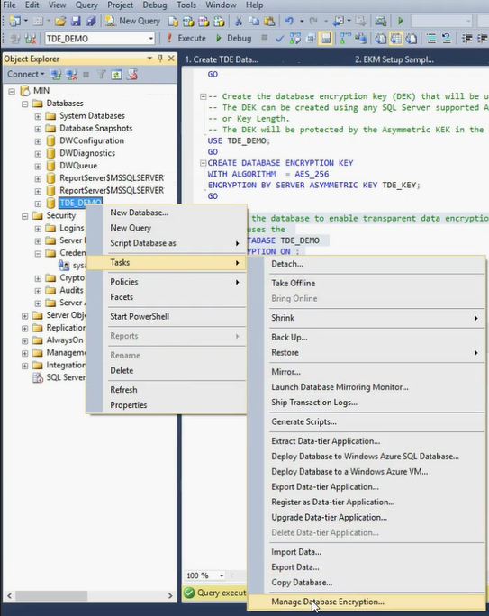
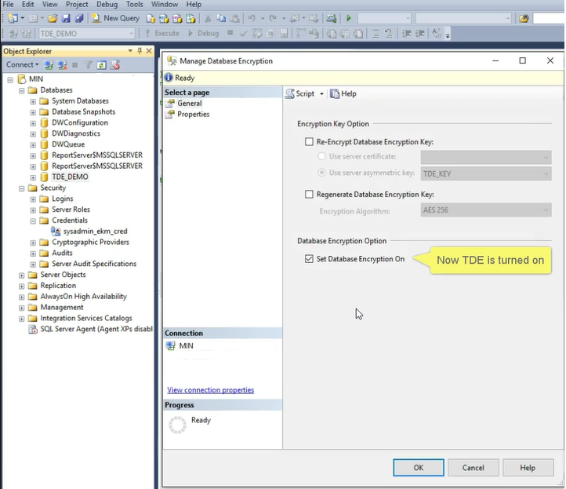

# Use SQL Server Connector with SQL encryption features

[!INCLUDE [sqlserver](../../../includes/applies-to-version/sqlserver.md)]

Common [!INCLUDE[ssNoVersion](../../../includes/ssnoversion-md.md)] encryption activities that use an asymmetric key protected by Azure Key Vault fall into the following three areas:

- Transparent data encryption (TDE) by using an asymmetric key from Azure Key Vault.
- Encrypting backups by using an asymmetric key from the key vault.
- Column level encryption by using an asymmetric key from the key vault.

Complete steps 1 through 4 of [Set up Transparent Data Encryption with Azure Key Vault for SQL Server](set-up-transparent-data-encryption-with-azure-key-vault-for-sql-server.md) before you follow the steps in this article.

> [!NOTE]
> Versions 1.0.0.440 and earlier are replaced and are no longer supported in production environments. Upgrade to version 1.0.1.0 or later. Download the current version from the [Microsoft Download Center](https://www.microsoft.com/download/details.aspx?id=45344), and follow the instructions in the "Upgrade of SQL Server Connector" section of [SQL Server Connector maintenance and troubleshooting](sql-server-connector-maintenance-troubleshooting.md).

[!INCLUDE [entra-id](../../../includes/entra-id.md)]

## Transparent data encryption by using an asymmetric key from Azure Key Vault

After you complete steps 1 through 4 of [Set up Transparent Data Encryption with Azure Key Vault for SQL Server](set-up-transparent-data-encryption-with-azure-key-vault-for-sql-server.md), use the Azure Key Vault key to encrypt the database encryption key with TDE. For more information about rotating keys by using PowerShell, see [Rotate the Transparent Data Encryption (TDE) protector using PowerShell](/azure/azure-sql/database/transparent-data-encryption-byok-key-rotation).

> [!IMPORTANT]
> Don't delete previous versions of the key after a rollover. When keys roll over, some data is still encrypted with the previous keys, such as older database backups, backed-up log files, and transaction log files.

You need to create a credential and a login, and create a database encryption key that encrypts the data and logs in the database. Encrypting a database requires `CONTROL` permission on the database. The following graphic shows the hierarchy of the encryption key when you use Azure Key Vault.

:::image type="content" source="media/ekm-key-hierarchy-with-akv.png" alt-text="Diagram showing the hierarchy of the encryption key when using the Azure Key Vault.":::
  
1.  **Create a [!INCLUDE[ssNoVersion](../../../includes/ssnoversion-md.md)] credential for the Database Engine to use for TDE**  
  
     The [!INCLUDE[ssDE](../../../includes/ssde-md.md)] uses the Microsoft Entra application credentials to access the key vault during database load. To limit the key vault permissions that you grant, create another **Client ID** and **Secret**, as described in [Step 1: Set up the authentication model](set-up-transparent-data-encryption-with-azure-key-vault-for-sql-server.md#step-1-set-up-the-authentication-model), for the [!INCLUDE[ssDE](../../../includes/ssde-md.md)].
  
     Modify the [!INCLUDE[tsql](../../../includes/tsql-md.md)] script below in the following ways:  
  
    -   Edit the `IDENTITY` argument (`ContosoDevKeyVault`) to point to your Azure Key Vault.
        - If you're using **global Azure**, replace the `IDENTITY` argument with the name of your Azure Key Vault from [Step 2: Create a key vault](set-up-transparent-data-encryption-with-azure-key-vault-for-sql-server.md#step-2-create-a-key-vault).
        - If you're using a **private Azure cloud**, for example Azure Government, Azure operated by 21Vianet, or Azure Germany, replace the `IDENTITY` argument with the Vault URI returned in [Create a key vault and key by using PowerShell](set-up-transparent-data-encryption-with-azure-key-vault-for-sql-server.md#create-a-key-vault-and-key-by-using-powershell). Don't include `https://` in the key vault URI.
  
    -   Replace the first part of the `SECRET` argument with the Microsoft Entra application **Client ID** from [Step 1: Set up the authentication model](set-up-transparent-data-encryption-with-azure-key-vault-for-sql-server.md#step-1-set-up-the-authentication-model). In this example, the **Client ID** is `EF5C8E094D2A4A769998D93440D8115D`.
  
        > [!IMPORTANT]  
        >  You must remove the hyphens from the **Client ID**.  
  
    -   Complete the second part of the `SECRET` argument with the **Client Secret** from step 1. In this example, the **Client Secret** is `ReplaceWithAADClientSecret`. 
  
    -   The final string for the `SECRET` argument is a long sequence of letters and numbers, with no hyphens.
  
    ```sql  
    USE master;  
    CREATE CREDENTIAL Azure_EKM_TDE_cred   
        WITH IDENTITY = 'ContosoDevKeyVault', -- for global Azure
        -- WITH IDENTITY = 'ContosoDevKeyVault.vault.usgovcloudapi.net', -- for Azure Government
        -- WITH IDENTITY = 'ContosoDevKeyVault.vault.azure.cn', -- for Microsoft Azure operated by 21Vianet
        -- WITH IDENTITY = 'ContosoDevKeyVault.vault.microsoftazure.de', -- for Azure Germany   
        SECRET = 'EF5C8E094D2A4A769998D93440D8115DReplaceWithAADClientSecret'   
    FOR CRYPTOGRAPHIC PROVIDER AzureKeyVault_EKM_Prov;  
    ```  
  
2.  **Create a [!INCLUDE[ssNoVersion](../../../includes/ssnoversion-md.md)] login for the [!INCLUDE[ssDE](../../../includes/ssde-md.md)] for TDE**  
  
     Create a [!INCLUDE[ssNoVersion](../../../includes/ssnoversion-md.md)] login and add the credential from Step 1 to it. This [!INCLUDE[tsql](../../../includes/tsql-md.md)] example uses the same key that was imported earlier.  
  
    ```sql  
    USE master;  
    -- Create a SQL Server login associated with the asymmetric key   
    -- for the Database engine to use when it loads a database   
    -- encrypted by TDE.  
    CREATE LOGIN TDE_Login   
    FROM ASYMMETRIC KEY CONTOSO_KEY;  
    GO   
  
    -- Alter the TDE Login to add the credential for use by the   
    -- Database Engine to access the key vault  
    ALTER LOGIN TDE_Login   
    ADD CREDENTIAL Azure_EKM_TDE_cred ;  
    GO  
    ```  
  
3.  **Create the database encryption key (DEK)**  
  
     The DEK encrypts your data and log files in the database instance, and in turn is encrypted by the Azure Key Vault asymmetric key. You can create the DEK by using any algorithm or key length that [!INCLUDE[ssNoVersion](../../../includes/ssnoversion-md.md)] supports.  
  
    ```sql  
    USE ContosoDatabase;  
    GO  
  
    CREATE DATABASE ENCRYPTION KEY   
    WITH ALGORITHM = AES_256   
    ENCRYPTION BY SERVER ASYMMETRIC KEY CONTOSO_KEY;  
    GO  
    ```  
  
4.  **Turn on TDE**  
  
    ```sql  
    -- Alter the database to enable transparent data encryption.  
    ALTER DATABASE ContosoDatabase   
    SET ENCRYPTION ON;  
    GO  
    ```  
  
     Using [!INCLUDE[ssManStudio](../../../includes/ssmanstudio-md.md)], verify that TDE is turned on by connecting to your database with Object Explorer. Right-click your database, point to **Tasks**, and then select **Manage Database Encryption**.  
  
       
  
     In the **Manage Database Encryption** dialog box, confirm that TDE is on, and what asymmetric key is encrypting the DEK.  
  
       
  
     Alternatively, you can execute the following [!INCLUDE[tsql](../../../includes/tsql-md.md)] script. An encryption state of 3 indicates an encrypted database.  
  
    ```sql  
    USE MASTER  
    SELECT * FROM sys.asymmetric_keys  
  
    -- Check which databases are encrypted using TDE  
    SELECT d.name, dek.encryption_state   
    FROM sys.dm_database_encryption_keys AS dek  
    JOIN sys.databases AS d  
         ON dek.database_id = d.database_id;  
    ```  
  
    > [!NOTE]  
    >  The `tempdb` database is automatically encrypted whenever any database enables TDE.  
  
## Encrypting backups by using an asymmetric key from the key vault

Encrypted backups are supported starting with [!INCLUDE[ssSQL14](../../../includes/sssql14-md.md)]. The following example creates and restores a backup encrypted with a data encryption key that the asymmetric key in the key vault protects.

The [!INCLUDE[ssDE](../../../includes/ssde-md.md)] uses the Microsoft Entra application credentials to access the key vault during database load. To limit the key vault permissions that you grant, create another **Client ID** and **Secret**, as described in [Step 1: Set up the authentication model](set-up-transparent-data-encryption-with-azure-key-vault-for-sql-server.md#step-1-set-up-the-authentication-model), for the [!INCLUDE[ssDE](../../../includes/ssde-md.md)].
  
1.  **Create a SQL Server credential for the Database Engine to use for backup encryption**  
  
     Modify the [!INCLUDE[tsql](../../../includes/tsql-md.md)] script below in the following ways:  
  
    -   Edit the `IDENTITY` argument (`ContosoDevKeyVault`) to point to your Azure Key Vault.
        - If you're using **global Azure**, replace the `IDENTITY` argument with the name of your Azure Key Vault from [Step 2: Create a key vault](set-up-transparent-data-encryption-with-azure-key-vault-for-sql-server.md#step-2-create-a-key-vault).
        - If you're using a **private Azure cloud**, for example Azure Government, Microsoft Azure operated by 21Vianet, or Azure Germany, replace the `IDENTITY` argument with the Vault URI returned in [Create a key vault and key by using PowerShell](set-up-transparent-data-encryption-with-azure-key-vault-for-sql-server.md#create-a-key-vault-and-key-by-using-powershell). Don't include `https://` in the key vault URI.
  
    -   Replace the first part of the `SECRET` argument with the Microsoft Entra application **Client ID** from [Step 1: Set up the authentication model](set-up-transparent-data-encryption-with-azure-key-vault-for-sql-server.md#step-1-set-up-the-authentication-model). In this example, the **Client ID** is `EF5C8E094D2A4A769998D93440D8115D`.
  
        > [!IMPORTANT]  
        >  You must remove the hyphens from the **Client ID**.  
  
    -   Complete the second part of the `SECRET` argument with the **Client Secret** from step 1. In this example, the **Client Secret** is `Replace-With-AAD-Client-Secret`. The final string for the `SECRET` argument is a long sequence of letters and numbers, with *no hyphens*.
  
        ```sql  
        USE master;  
  
        CREATE CREDENTIAL Azure_EKM_Backup_cred   
            WITH IDENTITY = 'ContosoDevKeyVault', -- for global Azure
            -- WITH IDENTITY = 'ContosoDevKeyVault.vault.usgovcloudapi.net', -- for Azure Government
            -- WITH IDENTITY = 'ContosoDevKeyVault.vault.azure.cn', -- for Microsoft Azure operated by 21Vianet
            -- WITH IDENTITY = 'ContosoDevKeyVault.vault.microsoftazure.de', -- for Azure Germany   
            SECRET = 'EF5C8E094D2A4A769998D93440D8115DReplace-With-AAD-Client-Secret'   
        FOR CRYPTOGRAPHIC PROVIDER AzureKeyVault_EKM_Prov;    
        ```  
  
2.  **Create a [!INCLUDE[ssNoVersion](../../../includes/ssnoversion-md.md)] login for the [!INCLUDE[ssDE](../../../includes/ssde-md.md)] for backup encryption**  
  
     Create a [!INCLUDE[ssNoVersion](../../../includes/ssnoversion-md.md)] login to be used by the [!INCLUDE[ssDE](../../../includes/ssde-md.md)] for encryption backups, and add the credential from Step 1 to it. This [!INCLUDE[tsql](../../../includes/tsql-md.md)] example uses the same key that was imported earlier.  
  
    > [!IMPORTANT]  
    > You can't use the same asymmetric key for backup encryption if you already used that key for TDE (the preceding example), or column level encryption (the following example).
  
     This example uses the `CONTOSO_KEY_BACKUP` asymmetric key stored in the key vault, which you can import or create earlier for the `master` database, as described in [Step 2: Create a key vault](set-up-transparent-data-encryption-with-azure-key-vault-for-sql-server.md#step-2-create-a-key-vault).  
  
    ```sql  
    USE master;  
  
    -- Create a SQL Server login associated with the asymmetric key   
    -- for the Database engine to use when it is encrypting the backup.  
    CREATE LOGIN Backup_Login   
    FROM ASYMMETRIC KEY CONTOSO_KEY_BACKUP;  
    GO   
  
    -- Alter the Encrypted Backup Login to add the credential for use by   
    -- the Database Engine to access the key vault  
    ALTER LOGIN Backup_Login   
    ADD CREDENTIAL Azure_EKM_Backup_cred ;  
    GO  
    ```  
  
3.  **Back up the database**  
  
     Back up the database, specifying encryption with the asymmetric key stored in the key vault.
     
     In the following example, note that if the database was already encrypted with TDE, and the asymmetric key `CONTOSO_KEY_BACKUP` is different from the TDE asymmetric key, the backup is encrypted by both the TDE asymmetric key and `CONTOSO_KEY_BACKUP`. The target [!INCLUDE[ssNoVersion](../../../includes/ssnoversion-md.md)] instance needs both keys to decrypt the backup.
  
    ```sql  
    USE master;  
  
    BACKUP DATABASE [DATABASE_TO_BACKUP]  
    TO DISK = N'[PATH TO BACKUP FILE]'   
    WITH FORMAT, INIT, SKIP, NOREWIND, NOUNLOAD,   
    ENCRYPTION(ALGORITHM = AES_256,   
    SERVER ASYMMETRIC KEY = [CONTOSO_KEY_BACKUP]);  
    GO  
    ```  
  
4.  **Restore the database**  
    
    To restore a database backup that is encrypted with TDE, the target [!INCLUDE[ssNoVersion](../../../includes/ssnoversion-md.md)] instance must first have a copy of the asymmetric key vault key used for encryption. To provide that copy:
    
    - If the original asymmetric key used for TDE is no longer in the key vault, restore the key vault key backup or reimport the key from a local HSM. For the key's thumbprint to match the thumbprint recorded on the database backup, the key must use the **same key vault key name** it had originally.
    
    - Apply steps 1 and 2 on the target [!INCLUDE[ssNoVersion](../../../includes/ssnoversion-md.md)] instance.
    
    - After the target [!INCLUDE[ssNoVersion](../../../includes/ssnoversion-md.md)] instance has access to the asymmetric keys used to encrypt the backup, restore the database on the server.
    
     Sample restore code:  
  
    ```sql  
    RESTORE DATABASE [DATABASE_TO_BACKUP]  
    FROM DISK = N'[PATH TO BACKUP FILE]'   
        WITH FILE = 1, NOUNLOAD, REPLACE;  
    GO  
    ```  
  
     For more information about backup options, see [BACKUP (Transact-SQL)](../../../t-sql/statements/backup-transact-sql.md).  
  
## Column level encryption by using an asymmetric key from the key vault

The following example creates a symmetric key protected by the asymmetric key in the key vault. The symmetric key then encrypts data in the database.

> [!IMPORTANT]
> You can't use the same asymmetric key for column level encryption if you already used that key for backup encryption.

This example uses the `CONTOSO_KEY_COLUMNS` asymmetric key stored in the key vault, which you can import or create earlier, as described in [Step 2: Create a key vault](set-up-transparent-data-encryption-with-azure-key-vault-for-sql-server.md#step-2-create-a-key-vault). To use this asymmetric key in the `ContosoDatabase` database, run the `CREATE ASYMMETRIC KEY` statement again to give the `ContosoDatabase` database a reference to the key.
  
```sql  
USE [ContosoDatabase];  
GO  
  
-- Create a reference to the key in the key vault  
CREATE ASYMMETRIC KEY CONTOSO_KEY_COLUMNS   
FROM PROVIDER [AzureKeyVault_EKM_Prov]  
WITH PROVIDER_KEY_NAME = 'ContosoDevRSAKey2',  
CREATION_DISPOSITION = OPEN_EXISTING;  
  
-- Create the data encryption key.  
-- The data encryption key can be created using any SQL Server   
-- supported algorithm or key length.  
-- The DEK will be protected by the asymmetric key in the key vault  
  
CREATE SYMMETRIC KEY DATA_ENCRYPTION_KEY  
    WITH ALGORITHM=AES_256  
    ENCRYPTION BY ASYMMETRIC KEY CONTOSO_KEY_COLUMNS;  
  
DECLARE @DATA VARBINARY(MAX);  
  
--Open the symmetric key for use in this session  
OPEN SYMMETRIC KEY DATA_ENCRYPTION_KEY   
DECRYPTION BY ASYMMETRIC KEY CONTOSO_KEY_COLUMNS;  
  
--Encrypt syntax  
SELECT @DATA = ENCRYPTBYKEY  
    (  
    KEY_GUID('DATA_ENCRYPTION_KEY'),   
    CONVERT(VARBINARY,'Plain text data to encrypt')  
    );  
  
-- Decrypt syntax  
SELECT CONVERT(VARCHAR, DECRYPTBYKEY(@DATA));  
  
--Close the symmetric key  
CLOSE SYMMETRIC KEY DATA_ENCRYPTION_KEY;  
```  
  
## Related content

- [Set up Transparent Data Encryption with Azure Key Vault for SQL Server](set-up-transparent-data-encryption-with-azure-key-vault-for-sql-server.md)
- [Extensible Key Management using Azure Key Vault (SQL Server)](extensible-key-management-using-azure-key-vault-sql-server.md)
- [Server configuration: EKM provider enabled](../../../database-engine/configure-windows/ekm-provider-enabled-server-configuration-option.md)
- [SQL Server Connector maintenance and troubleshooting](sql-server-connector-maintenance-troubleshooting.md)
