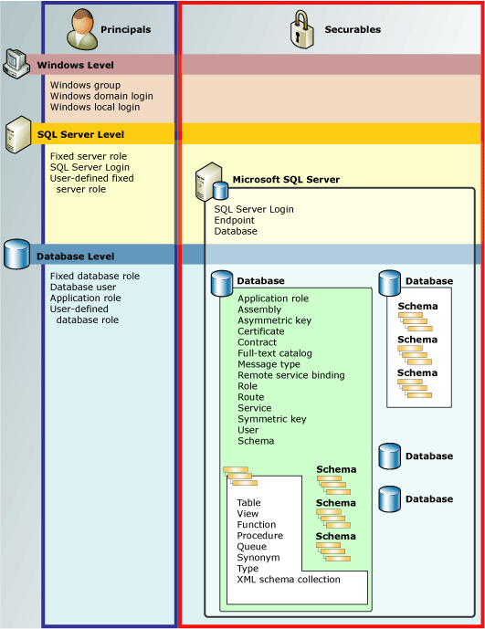

# Permissions Hierarchy (Database Engine)
[!INCLUDE[SQL Server Azure SQL Database Synapse Analytics PDW ](../../includes/applies-to-version/sql-asdb-asdbmi-asa-pdw.md)]

  The [!INCLUDE[ssDE](../../includes/ssde-md.md)] manages a hierarchical collection of entities that can be secured with permissions. These entities are known as *securables*. The most prominent securables are servers and databases, but discrete permissions can be set at a much finer level. [!INCLUDE[ssNoVersion](../../includes/ssnoversion-md.md)] regulates the actions of principals on securables by verifying that they have been granted appropriate permissions.  
  
 The following illustration shows the relationships among the [!INCLUDE[ssDE](../../includes/ssde-md.md)] permissions hierarchies.  
  
 The permissions system works the same in all versions of [!INCLUDE[ssNoVersion](../../includes/ssnoversion-md.md)], [!INCLUDE[ssSDS](../../includes/sssds-md.md)], [!INCLUDE[ssDW](../../includes/ssdw-md.md)], [!INCLUDE[ssAPS](../../includes/ssaps-md.md)], however some features are not available in all versions. For example, server-level permission cannot be configured in Azure products.  
  
   
  
## Chart of SQL Server Permissions  
 For a poster sized chart of all [!INCLUDE[ssDE](../../includes/ssde-md.md)] permissions in pdf format, see [https://aka.ms/sql-permissions-poster](https://aka.ms/sql-permissions-poster).  
  
## Working with Permissions  
 Permissions can be manipulated with the familiar [!INCLUDE[tsql](../../includes/tsql-md.md)] queries GRANT, DENY, and REVOKE. Information about permissions is visible in the [sys.server_permissions](../../relational-databases/system-catalog-views/sys-server-permissions-transact-sql.md) and [sys.database_permissions](../../relational-databases/system-catalog-views/sys-database-permissions-transact-sql.md) catalog views. There is also support for querying permissions information by using built-in functions.  
  
 For information about designing a permissions system, see [Getting Started with Database Engine Permissions](../../relational-databases/security/authentication-access/getting-started-with-database-engine-permissions.md).  
  
## See Also  
 [Securing SQL Server](../../relational-databases/security/securing-sql-server.md)   
 [Permissions &#40;Database Engine&#41;](../../relational-databases/security/permissions-database-engine.md)   
 [Securables](../../relational-databases/security/securables.md)   
 [Principals &#40;Database Engine&#41;](../../relational-databases/security/authentication-access/principals-database-engine.md)   
 [GRANT &#40;Transact-SQL&#41;](../../t-sql/statements/grant-transact-sql.md)   
 [REVOKE &#40;Transact-SQL&#41;](../../t-sql/statements/revoke-transact-sql.md)   
 [DENY &#40;Transact-SQL&#41;](../../t-sql/statements/deny-transact-sql.md)   
 [HAS_PERMS_BY_NAME &#40;Transact-SQL&#41;](../../t-sql/functions/has-perms-by-name-transact-sql.md)   
 [sys.fn_builtin_permissions &#40;Transact-SQL&#41;](../../relational-databases/system-functions/sys-fn-builtin-permissions-transact-sql.md)   
 [sys.server_permissions &#40;Transact-SQL&#41;](../../relational-databases/system-catalog-views/sys-server-permissions-transact-sql.md)   
 [sys.database_permissions &#40;Transact-SQL&#41;](../../relational-databases/system-catalog-views/sys-database-permissions-transact-sql.md)  
  
  
