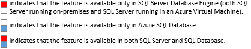

# Security for SQL Server Database Engine and Azure SQL Database

[!INCLUDE [SQL Server Azure SQL Database Synapse Analytics PDW](../../includes/applies-to-version/sql-asdb-asdbmi-asa-pdw.md)]

This page provides links to help you locate the information that you need about security and protection in the [!INCLUDE [ssDEnoversion](../../includes/ssdenoversion-md.md)] and [!INCLUDE [ssazure-sqldb](../../includes/ssazure-sqldb.md)].

**Legend**

## Authentication: Who are you?

| Feature | Link |
| --- | --- |
| **Who Authenticates?**  :::image type="icon" source="../performance/media/security-center-sqlserver.png"::: Windows Authentication :::image type="icon" source="../performance/media/security-center-both.png"::: [!INCLUDE [ssNoVersion](../../includes/ssnoversion-md.md)] Authentication :::image type="icon" source="../../relational-databases/security/media/security-center-both.png"::: Microsoft Entra ID ([formerly Azure Active Directory](/entra/fundamentals/new-name)) | Who Authenticates? (Windows or [!INCLUDE [ssNoVersion](../../includes/ssnoversion-md.md)]) [Choose an authentication mode](choose-an-authentication-mode.md) [Connect to Azure SQL with Microsoft Entra authentication](/azure/azure-sql/database/authentication-aad-overview) |
| **Where Authenticated?**  :::image type="icon" source="../performance/media/security-center-both.png"::: At `master` database: Logins and Database Users :::image type="icon" source="../performance/media/security-center-both.png"::: At User Database: Contained DB Users | Authenticate at the `master` database (Logins and database users) [Create a login](authentication-access/create-a-login.md) [Managing Databases and Logins in Azure SQL Database](/previous-versions/azure/ee336235(v=azure.100)) [Create a database user](authentication-access/create-a-database-user.md) Authenticate at a user database [Make your database portable by using contained databases](contained-database-users-making-your-database-portable.md) |
| **Using Other Identities**  :::image type="icon" source="../performance/media/security-center-both.png"::: Credentials :::image type="icon" source="../performance/media/security-center-sqlserver.png"::: Execute as Another Login :::image type="icon" source="../performance/media/security-center-both.png"::: Execute as Another Database User | [Credentials (Database Engine)](authentication-access/credentials-database-engine.md) [EXECUTE AS](../../t-sql/statements/execute-as-transact-sql.md) [EXECUTE AS](../../t-sql/statements/execute-as-transact-sql.md) |

## Authorization: What can you do?

| Feature | Link |
| --- | --- |
| **Granting, Revoking, and Denying Permissions**  :::image type="icon" source="../performance/media/security-center-both.png"::: Securable Classes :::image type="icon" source="../performance/media/security-center-sqlserver.png"::: Granular Server Permissions :::image type="icon" source="../performance/media/security-center-both.png"::: Granular Database Permissions | [Permissions Hierarchy (Database Engine)](permissions-hierarchy-database-engine.md) [Permissions (Database Engine)](permissions-database-engine.md) [Securables](securables.md) [Get started with Database Engine permissions](authentication-access/getting-started-with-database-engine-permissions.md) |
| **Security by Roles**  :::image type="icon" source="../performance/media/security-center-sqlserver.png"::: Server Level Roles :::image type="icon" source="../performance/media/security-center-both.png"::: Database Level Roles | [Server-level roles](authentication-access/server-level-roles.md) [Database-level roles](authentication-access/database-level-roles.md) |
| **Restricting Data Access to Selected Data Elements**  :::image type="icon" source="../performance/media/security-center-both.png"::: Restrict Data Access With Views/Procedures :::image type="icon" source="../performance/media/security-center-both.png"::: Row-Level Security :::image type="icon" source="../performance/media/security-center-both.png"::: Dynamic Data Masking :::image type="icon" source="../performance/media/security-center-both.png"::: Signed Objects | Restrict Data Access Using [Views](../views/views.md) and [Stored procedures (Database Engine)](../stored-procedures/stored-procedures-database-engine.md) [Row-level security](row-level-security.md) [Row-level security](row-level-security.md) [Dynamic data masking](dynamic-data-masking.md) [Dynamic Data Masking (Azure SQL Database)](/azure/azure-sql/database/dynamic-data-masking-overview) [ADD SIGNATURE](../../t-sql/statements/add-signature-transact-sql.md) |

## Encryption: Storing Secret Data

| Feature | Link |
| --- | --- |
| **Encrypting Files**  :::image type="icon" source="../performance/media/security-center-sqlserver.png"::: BitLocker Encryption (Drive Level) :::image type="icon" source="../performance/media/security-center-sqlserver.png"::: NTFS Encryption (Folder Level) :::image type="icon" source="../performance/media/security-center-both.png"::: Transparent Data Encryption (File Level) :::image type="icon" source="../performance/media/security-center-both.png"::: Backup Encryption (File Level) | [BitLocker (Drive Level)](/troubleshoot/windows-client/windows-security/enable-bitlocker-device-encryption-local-hard-disk) [NTFS Encryption (Folder Level)](/previous-versions/tn-archive/dd163562(v=technet.10)) [Transparent data encryption (TDE)](encryption/transparent-data-encryption.md) [Backup encryption](../backup-restore/backup-encryption.md) |
| **Encrypting Sources**  :::image type="icon" source="../performance/media/security-center-sqlserver.png"::: Extensible Key Management Module :::image type="icon" source="../performance/media/security-center-sqlserver.png"::: Keys Stored in the Azure Key Vault :::image type="icon" source="../performance/media/security-center-both.png"::: Always Encrypted | [Extensible Key Management (EKM)](encryption/extensible-key-management-ekm.md) [Extensible Key Management Using Azure Key Vault (SQL Server)](encryption/extensible-key-management-using-azure-key-vault-sql-server.md) [Always Encrypted](encryption/always-encrypted-database-engine.md) |
| **Column, Data, & Key Encryption**  :::image type="icon" source="../performance/media/security-center-both.png"::: Encrypt by Certificate :::image type="icon" source="../performance/media/security-center-both.png"::: Encrypt by Symmetric Key :::image type="icon" source="../performance/media/security-center-both.png"::: Encrypt by Asymmetric Key :::image type="icon" source="../performance/media/security-center-both.png"::: Encrypt by Passphrase | [ENCRYPTBYCERT](../../t-sql/functions/encryptbycert-transact-sql.md) [ENCRYPTBYASYMKEY](../../t-sql/functions/encryptbyasymkey-transact-sql.md) [ENCRYPTBYKEY](../../t-sql/functions/encryptbykey-transact-sql.md) [ENCRYPTBYPASSPHRASE](../../t-sql/functions/encryptbypassphrase-transact-sql.md) [Encrypt a Column of Data](encryption/encrypt-a-column-of-data.md) |

## Connection Security: Restricting and Securing

| Feature | Link |
| --- | --- |
| **Firewall Protection**  :::image type="icon" source="../performance/media/security-center-sqlserver.png"::: Windows Firewall Settings :::image type="icon" source="../../relational-databases/security/media/security-center-sqldb.png"::: Azure Service Firewall Settings :::image type="icon" source="../../relational-databases/security/media/security-center-sqldb.png"::: Database Firewall Settings | [Configure Windows Firewall for Database Engine access](../../database-engine/configure-windows/configure-a-windows-firewall-for-database-engine-access.md) [sp_set_database_firewall_rule (Azure SQL Database)](../system-stored-procedures/sp-set-database-firewall-rule-azure-sql-database.md) [sp_set_firewall_rule (Azure SQL Database)](../system-stored-procedures/sp-set-firewall-rule-azure-sql-database.md) |
| **Encrypting Data in Transit**  :::image type="icon" source="../performance/media/security-center-both.png"::: Forced TLS/SSL Connections :::image type="icon" source="../performance/media/security-center-sqlserver.png"::: Optional SSL Connections | [Configure SQL Server Database Engine for encrypting connections](../../database-engine/configure-windows/configure-sql-server-encryption.md) [Configure SQL Server Database Engine for encrypting connections](../../database-engine/configure-windows/configure-sql-server-encryption.md), [Network security](/azure/sql-database/sql-database-security-best-practice#network-security) [TLS 1.2 support for Microsoft SQL Server](/troubleshoot/sql/database-engine/connect/tls-1-2-support-microsoft-sql-server) |

## Auditing: Recording Access

| Feature | Link |
| --- | --- |
| **Automated Auditing**  :::image type="icon" source="../../relational-databases/performance/media/security-center-sqlserver.png"::: [!INCLUDE [ssNoVersion](../../includes/ssnoversion-md.md)] Audit (Server and DB Level) :::image type="icon" source="../../relational-databases/security/media/security-center-sqldb.png"::: [!INCLUDE [ssSDS](../../includes/sssds-md.md)] Audit (Database Level) :::image type="icon" source="../../relational-databases/security/media/security-center-sqldb.png"::: Detect threats | [SQL Server Audit (Database Engine)](auditing/sql-server-audit-database-engine.md) [SQL Database Auditing](/azure/azure-sql/database/auditing-overview) [Get started with SQL Database Advanced Threat Protection](/azure/azure-sql/database/threat-detection-configure) [SQL Database Vulnerability Assessment](/azure/sql-database/sql-vulnerability-assessment) |
| **Custom Audit**  :::image type="icon" source="../../relational-databases/performance/media/security-center-both.png"::: Triggers | Custom Audit Implementation: Creating [DDL Triggers](../triggers/ddl-triggers.md) and [DML Triggers](../triggers/dml-triggers.md) |
| **Compliance**  :::image type="icon" source="../../relational-databases/performance/media/security-center-both.png"::: Compliance | SQL Server: [Common Criteria](https://go.microsoft.com/fwlink/?LinkId=616319) SQL Database: [Microsoft Azure Trust Center: Compliance by Feature](https://azure.microsoft.com/support/trust-center/services/) |

## SQL Injection

SQL injection is an attack in which malicious code is inserted into strings that are later passed to the [!INCLUDE [ssDE](../../includes/ssde-md.md)] for parsing and execution. Any procedure that constructs SQL statements should be reviewed for injection vulnerabilities because [!INCLUDE [ssNoVersion](../../includes/ssnoversion-md.md)] will execute all syntactically valid queries that it receives. All database systems have some risk of SQL Injection, and many of the vulnerabilities are introduced in the application that is querying the [!INCLUDE [ssDE](../../includes/ssde-md.md)]. You can thwart SQL injection attacks by using stored procedures and parameterized commands, avoiding dynamic SQL, and restricting permissions on all users. For more information, see [SQL injection](sql-injection.md).

Additional links for application programmers:

- [Application Security Scenarios in SQL Server](/dotnet/framework/data/adonet/sql/application-security-scenarios-in-sql-server)

- [Writing Secure Dynamic SQL in SQL Server](/dotnet/framework/data/adonet/sql/writing-secure-dynamic-sql-in-sql-server)

- [How To: Protect From SQL Injection in ASP.NET](/previous-versions/msp-n-p/ff648339(v=pandp.10))

## Related content

- [Get started with Database Engine permissions](authentication-access/getting-started-with-database-engine-permissions.md)
- [Securing SQL Server](securing-sql-server.md)
- [Principals (Database Engine)](authentication-access/principals-database-engine.md)
- [SQL Server Certificates and Asymmetric Keys](sql-server-certificates-and-asymmetric-keys.md)
- [SQL Server encryption](encryption/sql-server-encryption.md)
- [Surface area configuration](surface-area-configuration.md)
- [Strong Passwords](strong-passwords.md)
- [TRUSTWORTHY database property](trustworthy-database-property.md)
- [What's new in SQL Server 2019](../../sql-server/what-s-new-in-sql-server-2019.md)
- [Protecting Your SQL Server Intellectual Property](protecting-your-sql-server-intellectual-property.md)

[!INCLUDE [get-help-security](../../includes/get-help-security.md)]
