# Static Data Masking
[!INCLUDE[appliesto-ss-asdb-xxxx-xxx-md](../../includes/appliesto-ss-asdb-xxxx-xxx-md.md)]

Static Data Masking released as a component of [SQL Server Management Studio](../../ssms/sql-server-management-studio-ssms.md) 18.0 preview 5 and higher. We have decided that our current prototype does not meet our customer’s expectations. We will therefore not carry this capability forward. We will update you on our plans if we have a replacement candidate.

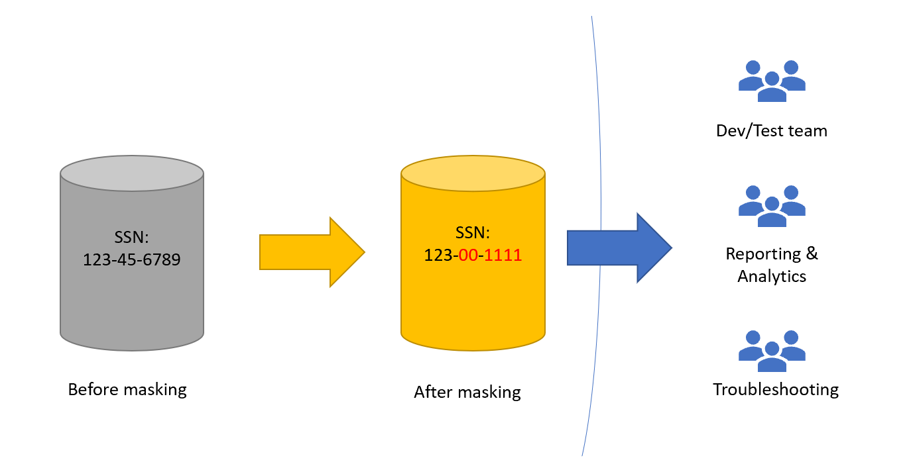

## What is Static Data Masking? 
Static Data Masking is a feature of SQL Server Management Studio that allows users to create a masked copy of a database. The feature was developed for organizations that need to share data, some of which is sensitive, across teams or with other organizations. 

By replacing sensitive data (pre-masking data) with new data (post-masking data), Static Data Masking will facilitate the following scenarios: 
- Development and testing 
- Analytics and business reporting 
- Troubleshooting 
- Sharing the database with a consultant, a research team or any third party 

The example below shows how Static Data Masking works in action. Before masking, the column contains social security numbers. After masking, the five first digits of each social security number have been replaced by randomly generated numbers.

| US Social Security Number (pre-masking)   | US Social Security Number (post-masking)  |
| ------------- | ------------- |
| 140-38-9110 | 302-92-9110 |
| 463-34-5535 | 189-70-5535 |
| 116-30-8733 | 201-01-8733 |
| 209-36-1971 | 683-10-1971 |
| 372-38-6948 | 372-38-6948 |
| 267-64-2334 | 100-03-2334 |
| 523-93-4176 | 582-20-4176 |
| 573-91-5137 | 730-20-5137 |
| 612-72-1026 | 369-40-1026 |

Users of Static Data Masking can choose from several masking functions. Depending on the masking function, the pre-masking data and post-masking data can be highly related or not related at all. A masking function performing a shuffle will leave post-masking data highly related to pre-masking data. 

| US Social Security Number (pre-masking) | US Social Security Number (post-masking) |
| ------------- | ------------- |
| 140-38-9110 | 612-72-1026 |  
| 463-34-5535 | 372-38-6948 | 
| 116-30-8733 | 523-93-4176 |
| 209-36-1971 | 209-36-1971 | 
| 372-38-6948 | 140-38-9110 |
| 267-64-2334 | 463-34-5535 | 
| 523-93-4176 | 573-91-5137 | 
| 573-91-5137 | 267-64-2334 | 
| 612-72-1026 | 116-30-8733 |

A masking function performing a replacement with NULL value will leave post-masking data unrelated to pre-masking data. 
 
| US Social Security Number (pre-masking) | US Social Security Number (post-masking) |
| ------------- | ------------- |
| 140-38-9110 | NULL |  
| 463-34-5535 | NULL | 
| 116-30-8733 | NULL |
| 209-36-1971 | NULL | 
| 372-38-6948 | NULL |
| 267-64-2334 | NULL | 
| 523-93-4176 | NULL | 
| 573-91-5137 | NULL | 
| 612-72-1026 | NULL |

## How does Static Data Masking work?
Static Data Masking happens at the column level. Users select which columns they wish to mask and, for each column selected, which masking function they wish to apply. There are several masking functions to choose from. They are described in detail in [Masking Functions](#masking-functions). 

Static Data Masking will then create a copy of the database. For Azure SQL Database, the copy is performed through the [copy function](https://azure.microsoft.com/blog/static-data-masking-preview/). For SQL Server, it is performed through a backup operation followed by a restore operation. From there, for each column, Static Data Masking starts replacing the pre-masking data with post-masking data according to the masking function selected. 

The replacement is done at the storage level. As a result, it is not possible to retrieve pre-masking data from the masked copy of the database after Static Data Masking has completed.

## How-to Guide

Below is a step-by-step guide to run Static Data Masking. 
 
1. Launch SQL Server Management studio. Connect to your database. In the **Object Explorer** pane on the left side, expand the Databases folder. Right click on the database you wish to mask. Left click on **Tasks**. Left click on **Mask database... (Preview)**.
 
 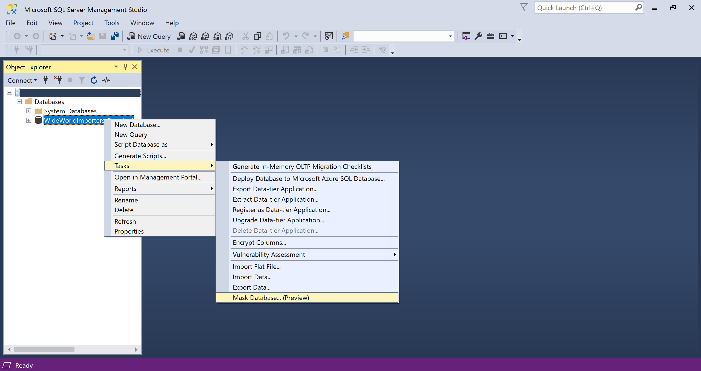
 
2. The masking configuration window pops up. It will display all the tables in the database. The tables are presented by schema and then ordered by alphabetical order within a schema. 
 
 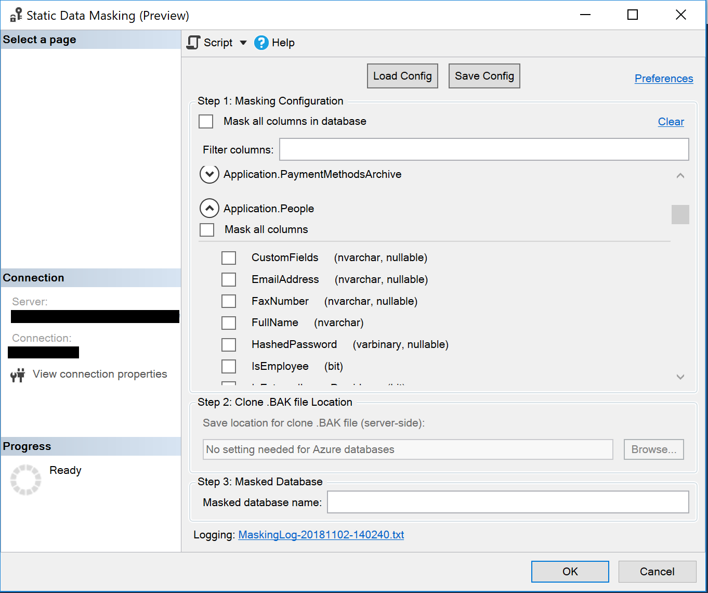
 
3. Click on the drop-down icon near the table name to get a list of all the columns in the table. For each column in the table, the datatype of the column is specified as well as whether the column is nullable. A nullable column is a column that can receive the NULL value as an entry. 
 
 
 
4. Select all the columns you wish to mask and the masking function that you wish to apply. The types of masking available are **Shuffle** masking, **Group Shuffle** masking, **Single value** masking, **NULL** masking, **String Composite** masking. 
 
 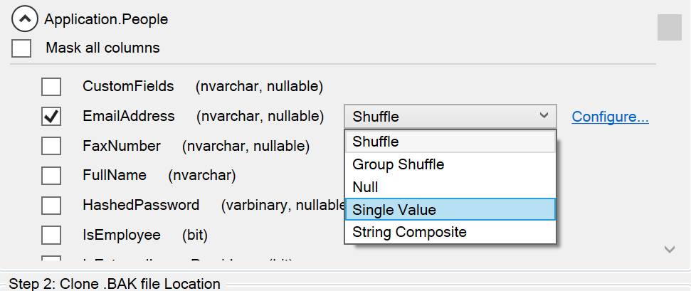
 
 NOTE: Most of these masking functions have additional configuration parameters. For Shuffle masking, Static Data Masking provides a   default parameter. For Group Shuffle masking, Single value masking, and String Composite masking, the user has to provide configuration parameters. To change or provide configuration parameters, click on the **Configure...** option and specify an (alternative) value for the parameter in the dialog box that pops up. Detailed descriptions of each masking function are provided in [Masking Functions](#masking-functions).
 
 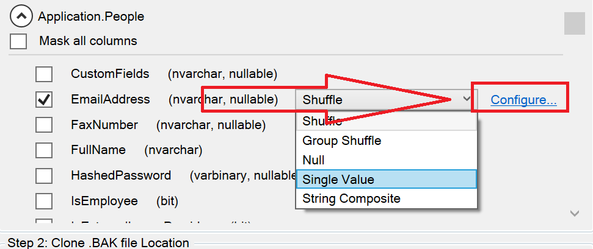
 
 The masking configuration choices get validated for configuration- and schema-related errors and warnings on-the-fly.  Anything detected will show up as an icon to the left that you can hover over with your mouse to get additional details. 
 
 In the example below, the user-selected NULL masking for a column that does not allow NULL values (NOT NULL constraint).
 
 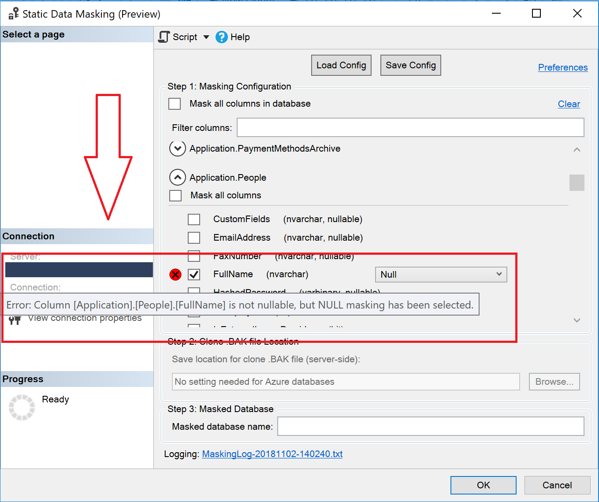
 
 In the example below, the user-selected Group Shuffle masking for only one column. Since Group Shuffle required a minimum of two columns a warning was issued. 
 
 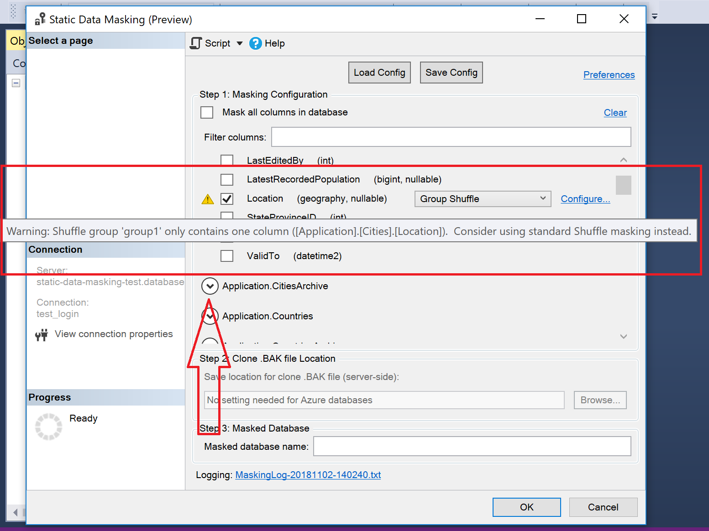
 
5. The complete masking configuration can be saved to an XML file for later use.  While masking function configuration is identical between Azure SQL databases and on-premise databases, there are some slight differences in which other properties (such as the backup file path) that get saved. To save the configuration, click on **Save Config**, provide a file name, and click save.  Users can later load an existing configuration file using **Load Config**. We recommend using configuration files for tables with a large number of columns. 
 
 
 
6. Static Data Masking will create a folder in the user's **Documents** folder named Static Data Masking and place log files inside. The log files can be useful for debugging purposes. The name of the log file is indicated at the bottom of the configuration window. 
  
 
7. (SQL Server only) If you operate Static Data Masking on an on-premise database, Static Data Masking will perform a backup/restore operation. In **Step 2: Clone .BAK file Location**, provide the location on the server where the backup file will be stored. 

## Masking Functions

### NULL masking

NULL masking replaces all the values in the column with NULL. If the column does not allow NULL values, Static Data Masking tool will return an error. 

### Single-value masking

Single-value masking replaces all the values in the column with a single fixed value, this value is specified by the user. The format of the input must be convertible to whatever the type of the selected column is. To specify the value, click on **Configure...**, and provide a value and then click **Okay**. 

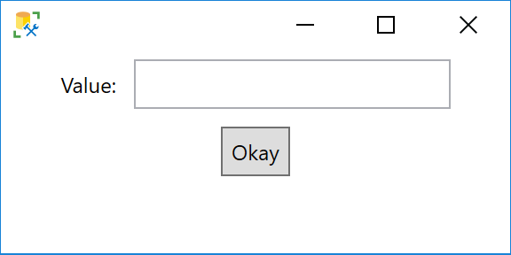

### Shuffle masking

All the values in the column are shuffled to new rows. No new data is generated. Shuffle masking provides the option to maintain NULL entries in the column. To do so, click on **Configure...** and select the box Maintain NULL positions.

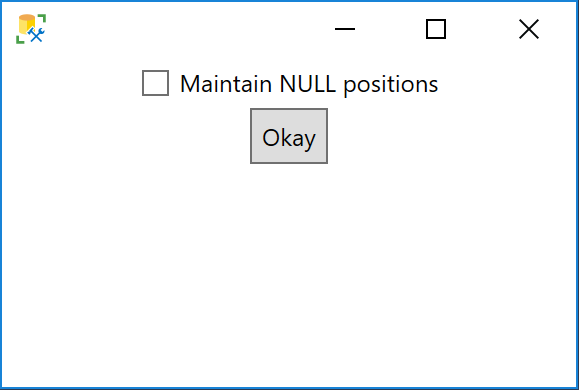

Below is an example of Shuffle masking with NULL values not maintained in place and then maintained in place.

| US Social Security Number (pre-masking) | US Social Security Number (post-masking with NULL entries shuffled) | US Social Security Number (post-masking with NULL entries not shuffled) |
| ------------- | ------------- | ------------- |
| 116-30-8733 | 612-72-1026 | 463-34-5535 |
| 140-38-9110 | NULL | 573-91-5137  |
| 209-36-1971 | 523-93-4176 | 140-38-9110 |
| NULL | 209-36-1971 | NULL |
| 463-34-5535 | 140-38-9110 | 116-30-8733  |
| 523-93-4176 | 463-34-5535 | 612-72-1026  |
| NULL | 573-91-5137 | NULL |
| 573-91-5137 | NULL | 523-93-4176 |
| 612-72-1026  | 116-30-8733  | 209-36-1971 |  

### Group Shuffle masking
Group Shuffle binds several columns together in a shuffle group. The columns in a shuffle group will be shuffled together. The user must specify the name of the shuffle group using the **Configure...** option.

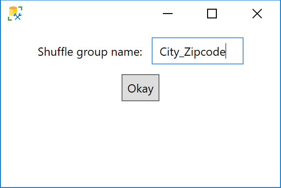

Group shuffles happen within the same table; if the same shuffle group name is used in multiple tables, the two group shuffles are independent actions. The group name must be the same for each column to be includes in the group. The name is case-sensitive. Multiple shuffle groups (with different names) can happen in the same table. 

### String Composite masking

String Composite masking generates random strings along a pattern. It is designed for strings that must follow a predefined pattern to be a valid entry. For example, American social security numbers have the format 123-45-6789. The syntax for String Composite masking is specified in the dialog box where the user has to enter the pattern.

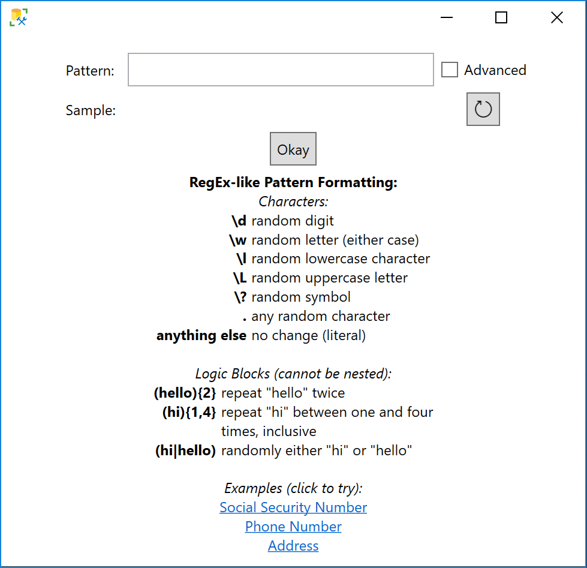

String Composite masking provides three example patterns that can be tested by clicking on them. If you click on Phone Number, the pattern box will be automatically populated with the formula required to generate random American phone numbers.

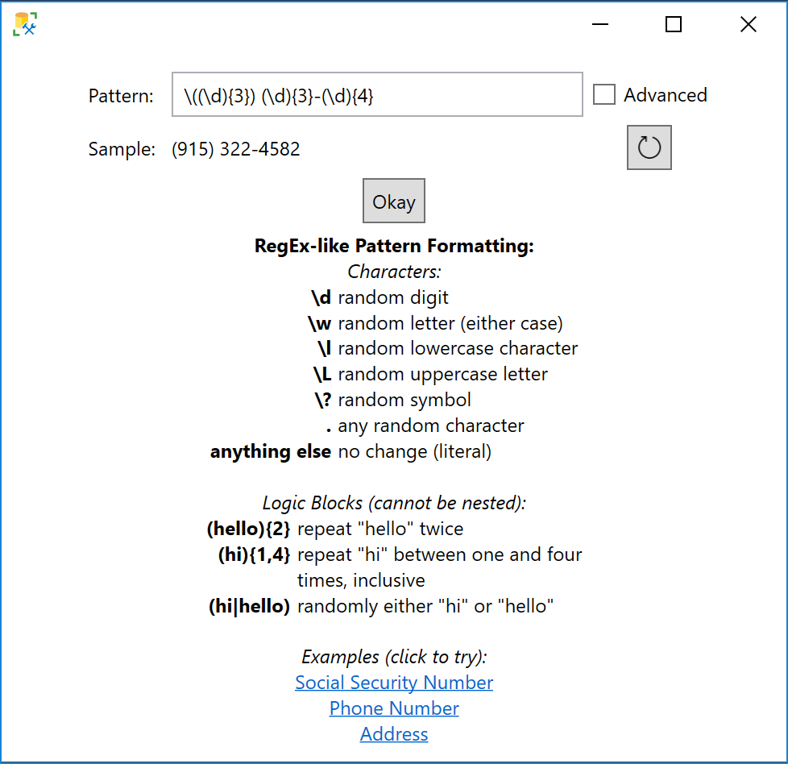

String Composite masking also has an advanced mode that allows for subsections of the existing data to be replaced with pattern-generated strings. The replaced portion of the string is determined by the capture group in a regular expression. For example, the username portion of an email can be replaced while preserving the domain, or phone number can be replaced by preserving the area code. More information on regular expressions is available [here](https://docs.microsoft.com/dotnet/standard/base-types/regular-expression-language-quick-reference).

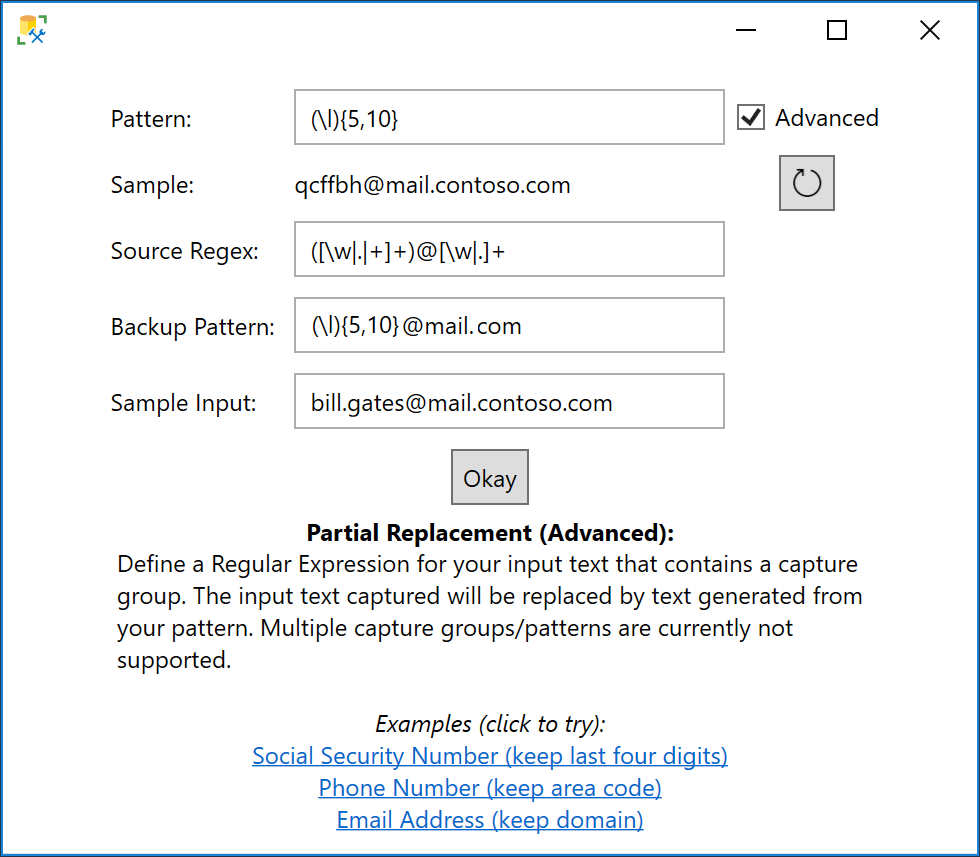

String Composite masking and its advanced mode can only be used for columns with [datatypes](../../t-sql/data-types/data-types-transact-sql.md) char, varchar, text, nchar, nvarchar, ntext.

## Limitations 

Static Data Masking has the following limitations:

- Static Data Masking does not support databases with [temporal tables](../../relational-databases/tables/temporal-tables.md).

- Static Data Masking does not mask [memory-optimized](../../relational-databases/in-memory-oltp/introduction-to-memory-optimized-tables.md) tables.

- Static Data Masking does not mask [computed columns](../../relational-databases/tables/specify-computed-columns-in-a-table.md), and [identity](../../t-sql/statements/create-table-transact-sql-identity-property.md) columns.

- Static Data Masking does not support Azure SQL Hyperscale databases.

- Static Data Masking does not support geometry and geography datatypes. 

In addition, Static Data Masking presents three limitations in its masking abilities:

- Static Data Masking does not update [histogram statistics](../../relational-databases/statistics/statistics.md). Consequently, the masked copy of the database may still contain sensitive data in the histogram statistics once Static Data Masking has been completed. Consider running [UPDATE STATISTICS](../../t-sql/statements/update-statistics-transact-sql.md) to remedy this issue. 

- If Static Data Masking returns an error, all masking operations are suspended. The copy of the database is not deleted and may contain sensitive information. The user is responsible for deleting the copy of the database if Static Data Masking returns an error. 

- (SQL Server only) The [data file(s)](../../relational-databases/databases/database-files-and-filegroups.md) and the [log file](../../relational-databases/logs/the-transaction-log-sql-server.md) may still contain bits of sensitive data in unallocated memory after Static Data Masking has completed. This sensitive data may be retrievable with a hex editor if given access to the data file(s) and the log file.

## See Also  
 [Dynamic Data Masking](../../relational-databases/security/dynamic-data-masking.md)   
 [Get started with SQL Database Static Data Masking](https://azure.microsoft.com/documentation/articles/sql-database-static-data-masking-get-started/)  
