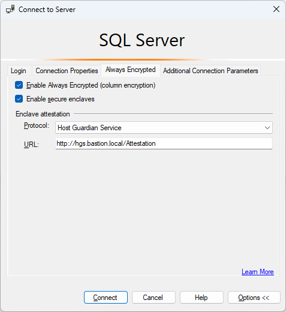

# Tutorial: Getting started with Always Encrypted with secure enclaves in SQL Server
[!INCLUDE [sqlserver2019-windows-only](../../includes/applies-to-version/sqlserver2019-windows-only.md)]

This tutorial teaches you how to get started with [Always Encrypted with secure enclaves](encryption/always-encrypted-enclaves.md) in [!INCLUDE [ssnoversion-md](../../includes/ssnoversion-md.md)]. It will show you:

> [!div class="checklist"]
> - How to create a basic environment for testing and evaluating Always Encrypted with secure enclaves.
> - How to encrypt data in-place and issue rich confidential queries against encrypted columns using SQL Server Management Studio (SSMS).

## Prerequisites

To get started with Always Encrypted with secure enclaves, you need at least two computers (they can be virtual machines):

- The [!INCLUDE [ssnoversion-md](../../includes/ssnoversion-md.md)] computer to host [!INCLUDE [ssnoversion-md](../../includes/ssnoversion-md.md)] and SSMS.
- The HGS computer to run Host Guardian Service, which is needed for enclave attestation.

### SQL Server computer requirements

- [!INCLUDE [sssql19-md](../../includes/sssql19-md.md)] or later.
- Windows 10, version 1809 or later - Enterprise edition, Windows 11 or later - Enterprise edition, Windows Server 2019 or later - Datacenter edition. Other editions of Windows 10/11 and Windows Server don't support attestation with HGS.
- CPU support for virtualization technologies:
  - Intel VT-x with Extended Page Tables.
  - AMD-V with Rapid Virtualization Indexing.
  - If you're running [!INCLUDE [ssnoversion-md](../../includes/ssnoversion-md.md)] in a VM:
    - In Azure, use a [Generation 2 VM size](/azure/virtual-machines/generation-2#generation-2-vm-sizes) (recommended) or use a Generation 1 VM size with nested virtualization enabled. Check the [individual VM sizes documentation](/azure/virtual-machines/sizes) to determine which Generation 1 VM sizes support nested virtualization.
    - On Hyper-V 2016 or later (outside of Azure), make sure your VM is a Generation 2 VM (recommended) or it's a Generation 1 VM with nested virtualization enabled. For more information, see [Should I create a generation 1 or 2 virtual machine in Hyper-V?](/windows-server/virtualization/hyper-v/plan/should-i-create-a-generation-1-or-2-virtual-machine-in-hyper-v) and [Configure nested virtualization](/virtualization/hyper-v-on-windows/user-guide/nested-virtualization#configure-nested-virtualization).
    - On VMware vSphere 6.7 or later, enable Virtualization Based Security support for the VM as described in the [VMware documentation](https://docs.vmware.com/en/VMware-vSphere/6.7/com.vmware.vsphere.vm_admin.doc/GUID-C2E78F3E-9DE2-44DB-9B0A-11440800AADD.html).
    - Other hypervisors and public clouds may support nested virtualization capabilities that enable Always Encrypted with VBS Enclaves as well. Check your virtualization solution's documentation for compatibility and configuration instructions.
- [SQL Server Management Studio (SSMS) 18.3 or later](../../ssms/download-sql-server-management-studio-ssms.md).

As an alternative, you can install SSMS on another machine.

> [!WARNING]
> In production environments,  running SSMS or other key management tools on the SQL Server computer may reduce the security benefits of using Always Encrypted. In general, running such tools on a different machine is recommended. See [Security Considerations for Key Management](encryption/overview-of-key-management-for-always-encrypted.md#security-considerations-for-key-management) for details.

### HGS computer requirements

- Windows Server 2019 Standard or Datacenter edition
- 2 CPUs
- 8 GB RAM
- 100 GB storage

> [!NOTE]
> The HGS computer should not be joined to a domain before you start.

## Step 1: Configure the HGS computer

In this step, you'll configure the HGS computer to run Host Guardian Service supporting host key attestation.

1. Sign in to the HGS computer as an administrator (local admin), open an elevated Windows PowerShell console and add the Host Guardian Service role by running the following command:

   ```powershell
   Install-WindowsFeature -Name HostGuardianServiceRole -IncludeManagementTools -Restart
   ```

2. After the HGS computer reboots, sign in with your admin account again, open an elevated Windows PowerShell console and run the following commands to install the Host Guardian Service and configure its domain. The password you specify here will only apply to the Directory Services Repair Mode password for Active Directory; it will not change your admin account's login password. You may provide any domain name of your choosing for -HgsDomainName.

   ```powershell
   $adminPassword = ConvertTo-SecureString -AsPlainText '<password>' -Force
   Install-HgsServer -HgsDomainName 'bastion.local' -SafeModeAdministratorPassword $adminPassword -Restart
   ```

3. After the computer reboots again, sign in with your admin account (which is now also a Domain Admin), open an elevated Windows PowerShell console, and configure host key attestation for your HGS instance. 

   ```powershell
   Initialize-HgsAttestation -HgsServiceName 'hgs' -TrustHostKey  
   ```

4. Find the IP address of the HGS computer by running the following command. Save this IP address for later steps.

   ```powershell
   Get-NetIPAddress  
   ```

> [!NOTE]
> Alternatively, if you want to reference your HGS computer by a DNS name, you can set up a forwarder from your corporate DNS servers to the new HGS domain controller.  

## Step 2: Configure the SQL Server computer as a guarded host
In this step, you'll configure the SQL Server computer as a guarded host registered with HGS using host key attestation.

> [!WARNING]
> Host key attestation is considered a weaker attestation mode. If possible, you should use TPM attestation for production environments. For more information, see [Attestation modes](encryption/always-encrypted-enclaves-host-guardian-service-plan.md#attestation-modes).

1. Sign in to your SQL Server computer as an administrator, open an elevated Windows PowerShell console, and retrieve the name of your computer by accessing the computername variable.

   ```powershell
   $env:computername 
   ```

2. Install the Guarded Host feature, which will also install Hyper-V (if it isn't installed already).

   ```powershell
   Enable-WindowsOptionalFeature -Online -FeatureName HostGuardian -All
   ```

3. Restart your SQL Server computer when prompted to complete the installation of Hyper-V.

4. If your SQL Server computer is a virtual machine, a physical machine that doesn't support UEFI Secure Boot, or a physical machine not equipped with an IOMMU, you need to remove the VBS requirement for platform security features.
    1. Remove the requirement for Secure Boot and IOMMU by running the following command on your SQL Server computer in an elevated PowerShell console:

        ```powershell
       Set-ItemProperty -Path HKLM:\SYSTEM\CurrentControlSet\Control\DeviceGuard -Name RequirePlatformSecurityFeatures -Value 0
       ```

    1. Restart the SQL Server computer again to get VBS to come online with the lowered requirements.

        ```powershell
       Restart-Computer
       ```

5. Sign in to the SQL Server computer as an administrator again, open an elevated Windows PowerShell console, generate a unique host key, and export the resulting public key to a file.

   ```powershell
   Set-HgsClientHostKey 
   Get-HgsClientHostKey -Path $HOME\Desktop\hostkey.cer
   ```

6. Manually copy the host key file, generated in the previous step, to the HGS machine. The below instructions assume your file name is `hostkey.cer` and you're copying it to your Desktop on the HGS machine.

7. On the HGS computer, open an elevated Windows PowerShell console and register the host key of your SQL Server computer with HGS:

   ```powershell
   Add-HgsAttestationHostKey -Name <your SQL Server computer name> -Path $HOME\Desktop\hostkey.cer
   ```

8. On the SQL Server computer, run the following command in an elevated Windows PowerShell console, to tell the SQL Server computer where to attest. Make sure you specify the IP address or the DNS name of your HGS computer in both address locations. 

   ```powershell
   # use http, and not https
   Set-HgsClientConfiguration -AttestationServerUrl http://<IP address or DNS name>/Attestation -KeyProtectionServerUrl http://<IP address or DNS name>/KeyProtection/  
   ```

The result of the above command should show that AttestationStatus = Passed.

If you get a HostUnreachable error, that means your SQL Server computer can't communicate with HGS. Ensure that you can ping the HGS computer.

An UnauthorizedHost error indicates that the public key wasn't registered with the HGS server - repeat steps 5 and 6 to resolve the error.

If all else fails, run Remove-HgsClientHostKey and repeat steps 4-7.

## Step 3: Enable Always Encrypted with secure enclaves in SQL Server

In this step, you'll enable the functionality of Always Encrypted using enclaves in your SQL Server instance.

1. Using SSMS, connect to your SQL Server instance as sysadmin **without** Always Encrypted enabled for the database connection.
    1. Start SSMS.
    1. In the **Connect to Server** dialog, specify your server name, select an authentication method and specify your credentials.
    1. Select **Options >>** and select the **Always Encrypted** tab.
    1. Make sure the **Enable Always Encrypted (column encryption)** checkbox is **not** selected.

       :::image type="content" source="./encryption/media/always-encrypted-database-engine/always-encrypted-ssms-connect-disabled.png" alt-text="Screenshot of the SSMS connection option for Always Encrypted disabled.":::

    1. Select **Connect**.

2. Open a new query window, and execute the below statement to set the secure enclave type to Virtualization Based Security (VBS).

   ```sql
   EXEC sys.sp_configure 'column encryption enclave type', 1;
   RECONFIGURE;
   ```

3. Restart your SQL Server instance for the previous change to take effect. You can restart the instance in SSMS by right-clicking on it in Object Explorer and selecting Restart. Once the instance restarts, reconnect to it.

4. Confirm the secure enclave is now loaded by running the following query:

   ```sql
   SELECT [name], [value], [value_in_use] FROM sys.configurations
   WHERE [name] = 'column encryption enclave type';
   ```

    The query should return the following result:  

    | name                           | value | value_in_use |
    | ------------------------------ | ----- | -------------- |
    | column encryption enclave type | 1     | 1              |

## Step 4: Create a sample database
In this step, you'll create a database with some sample data, which you'll encrypt later.

1. Using the SSMS instance from the previous step, execute the below statement in a query window to create a new database, named **ContosoHR**.

    ```sql
    CREATE DATABASE [ContosoHR];
    ```

1. Create a new table, named **Employees**.

    ```sql
    USE [ContosoHR];
    GO

    CREATE SCHEMA [HR];
    GO
    
    CREATE TABLE [HR].[Employees]
    (
        [EmployeeID] [int] IDENTITY(1,1) NOT NULL,
        [SSN] [char](11) NOT NULL,
        [FirstName] [nvarchar](50) NOT NULL,
        [LastName] [nvarchar](50) NOT NULL,
        [Salary] [money] NOT NULL
    ) ON [PRIMARY];
    ```

1. Add a few employee records to the **Employees** table.

    ```sql
    USE [ContosoHR];
    GO

    INSERT INTO [HR].[Employees]
            ([SSN]
            ,[FirstName]
            ,[LastName]
            ,[Salary])
        VALUES
            ('795-73-9838'
            , N'Catherine'
            , N'Abel'
            , $31692);

    INSERT INTO [HR].[Employees]
            ([SSN]
            ,[FirstName]
            ,[LastName]
            ,[Salary])
        VALUES
            ('990-00-6818'
            , N'Kim'
            , N'Abercrombie'
            , $55415);
    ```

## Step 5: Provision enclave-enabled keys

In this step, you'll create a column master key and a column encryption key that allow enclave computations.

1. Using the SSMS instance from the previous step, in **Object Explorer**, expand your database and navigate to **Security** > **Always Encrypted Keys**.
1. Provision a new enclave-enabled column master key:
    1. Right-click **Always Encrypted Keys** and select **New Column Master Key...**.
    2. Select your column master key name: **CMK1**.
    3. Make sure you select either **Windows Certificate Store (Current User or Local Machine)** or **Azure Key Vault**.
    4. Select **Allow enclave computations**.
    5. If you selected Azure Key Vault, sign in to Azure and select your key vault. For more information on how to create a key vault for Always Encrypted, see [Manage your key vaults from Azure portal](/archive/blogs/kv/manage-your-key-vaults-from-new-azure-portal).
    6. Select your certificate or Azure Key Value key if it already exists, or select the **Generate Certificate** button to create a new one.
    7. Select **OK**.

        

1. Create a new enclave-enabled column encryption key:

    1. Right-click **Always Encrypted Keys** and select **New Column Encryption Key**.
    2. Enter a name for the new column encryption key: **CEK1**.
    3. In the **Column master key** dropdown, select the column master key you created in the previous steps.
    4. Select **OK**.

## Step 6: Encrypt some columns in place

In this step, you'll encrypt the data stored in the **SSN** and **Salary** columns inside the server-side enclave, and then test a SELECT query on the data.

1. Open a new SSMS instance and connect to your SQL Server instance **with** Always Encrypted enabled for the database connection.
    1. Start a new instance of SSMS.
    1. In the **Connect to Server** dialog, specify your server name, select an authentication method and specify your credentials.
    1. Select **Options >>** and select the **Always Encrypted** tab.
    1. Select the **Enable Always Encrypted (column encryption)** checkbox.
    1. Select **Enable secure enclaves**. (This step applies to SSMS 19 or later.)
    1. Set **Protocol** to **Host Guardian Service**. (This step applies to SSMS 19 or later.)
    1. Specify your enclave attestation URL (for example, ht<span>tp://</span>hgs.bastion.local/Attestation).

          

    1. Select **Connect**.
    1. If you're prompted to enable Parameterization for Always Encrypted queries, select **Enable**.

1. Using the same SSMS instance (with Always Encrypted enabled), open a new query window and encrypt the **SSN** and **Salary** columns by running the below queries.

    ```sql
    USE [ContosoHR];
    GO

    ALTER TABLE [HR].[Employees]
    ALTER COLUMN [SSN] [char] (11) COLLATE Latin1_General_BIN2
    ENCRYPTED WITH (COLUMN_ENCRYPTION_KEY = [CEK1], ENCRYPTION_TYPE = Randomized, ALGORITHM = 'AEAD_AES_256_CBC_HMAC_SHA_256') NOT NULL
    WITH
    (ONLINE = ON);

    ALTER TABLE [HR].[Employees]
    ALTER COLUMN [Salary] [money]
    ENCRYPTED WITH (COLUMN_ENCRYPTION_KEY = [CEK1], ENCRYPTION_TYPE = Randomized, ALGORITHM = 'AEAD_AES_256_CBC_HMAC_SHA_256') NOT NULL
    WITH
    (ONLINE = ON);

    ALTER DATABASE SCOPED CONFIGURATION CLEAR PROCEDURE_CACHE;
    ```

    > [!NOTE]
    > Notice the ALTER DATABASE SCOPED CONFIGURATION CLEAR PROCEDURE_CACHE statement to clear the query plan cache for the database in the above script. After you have altered the table, you need to clear the plans for all batches and stored procedures that access the table, to refresh parameters encryption information. 

1. To verify the **SSN** and **Salary** columns are now encrypted, open a new query window in the SSMS instance **without** Always Encrypted enabled for the database connection and execute the below statement. The query window should return encrypted values in the **SSN** and **Salary** columns. If you execute the same query using the SSMS instance with Always Encrypted enabled, you should see the data decrypted.

    ```sql
    SELECT * FROM [HR].[Employees];
    ```

## Step 7: Run rich queries against encrypted columns

Now, you can run rich queries against the encrypted columns. Some query processing will be performed inside your server-side enclave. 

1. In the SSMS instance **with** Always Encrypted enabled, make sure Parameterization for Always Encrypted is also enabled.
    1. Select **Tools** from the main menu of SSMS.
    2. Select **Options...**.
    3. Navigate to **Query Execution** > **SQL Server** > **Advanced**.
    4. Ensure that **Enable Parameterization for Always Encrypted** is checked.
    5. Select **OK**.
2. Open a new query window, paste in and execute the below query. The query should return plaintext values and rows meeting the specified search criteria.

    ```sql
    DECLARE @SSNPattern [char](11) = '%6818';
    DECLARE @MinSalary [money] = $1000;
    SELECT * FROM [HR].[Employees]
    WHERE SSN LIKE @SSNPattern AND [Salary] >= @MinSalary;
    ```

3. Try the same query again in the SSMS instance that doesn't have Always Encrypted enabled, and note the failure that occurs.

## Next Steps

After completing this tutorial, you can go to one of the following tutorials:

- [Tutorial: Develop a .NET application using Always Encrypted with secure enclaves](../../connect/ado-net/sql/tutorial-always-encrypted-enclaves-develop-net-apps.md)
- [Tutorial: Develop a .NET Framework application using Always Encrypted with secure enclaves](tutorial-always-encrypted-enclaves-develop-net-framework-apps.md)
- [Tutorial: Creating and using indexes on enclave-enabled columns using randomized encryption](./tutorial-creating-using-indexes-on-enclave-enabled-columns-using-randomized-encryption.md)

## See Also

- [Configure and use Always Encrypted with secure enclaves](encryption/configure-always-encrypted-enclaves.md)
- [Tutorial: Always Encrypted with secure enclaves in [!INCLUDE[ssSDSfull](../../includes/sssdsfull-md.md)]](/azure/azure-sql/database/always-encrypted-enclaves-getting-started)
