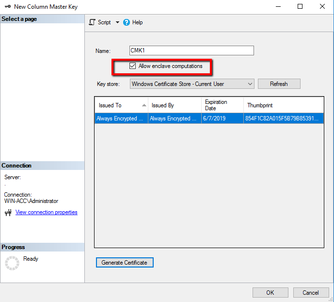

# Tutorial: Getting started with Always Encrypted with secure enclaves using SSMS
[!INCLUDE [tsql-appliesto-ssver15-xxxx-xxxx-xxx](../../includes/tsql-appliesto-ssver15-xxxx-xxxx-xxx.md)]

This tutorial teaches you how to get started with [Always Encrypted with secure enclaves](encryption/always-encrypted-enclaves.md). It will show you:
- How to create a simple environment for testing and evaluating Always Encrypted with secure enclaves.
- How to encrypt data in-place and issue rich queries against encrypted columns using SQL Server Management Studio (SSMS).

## Prerequisites

To get started with Always Encrypted with secure enclaves, you need at least two computers (they can be virtual machines):

- The SQL Server computer to host SQL Server and SSMS.
- The HGS computer to run Host Guardian Service, which is needed for enclave attestation.

### SQL Server computer requirements

- [!INCLUDE [sssqlv15-md](../../includes/sssqlv15-md.md)] or later
- Windows 10 Enterprise version 1809, or Windows Server 2019 Datacenter
- [SQL Server Management Studio (SSMS) 18.0 or later](../../ssms/download-sql-server-management-studio-ssms.md).

Alternatively, you can install SSMS on another machine.

>[!WARNING] 
>In production environments, you should never use SSMS or other tools to manage Always Encrypted keys or run queries on encrypted data on the SQL Server computer, as this may reduce or completely defeat the purpose of using Always Encrypted.

### HGS computer requirements

- Windows Server 2019 Standard or Datacenter edition
- 2 CPUs
- 8 GB RAM
- 100 GB storage

>[!NOTE]
>The HGS computer should not be joined to a domain before you start.

## Step 1: Configure the HGS computer

In this step, you will configure the HGS computer to run Host Guardian Service supporting host key attestation.

1. Sign in to the HGS computer as an administrator (local admin), open an elevated Windows PowerShell console and add the Host Guardian Service role by running the following command:

   ```powershell
   Install-WindowsFeature -Name HostGuardianServiceRole -IncludeManagementTools -Restart
   ```

2. After the HGS computer reboots, sign in with your admin account again, open an elevated Windows PowerShell console and run the following commands to install the Host Guardian Service and configure its domain. The password you specify here will only apply to the Directory Services Repair Mode password for Active Directory; it will not change your admin account's login password. You may provide any domain name of your choosing for -HgsDomainName.

   ```powershell
   $adminPassword = ConvertTo-SecureString -AsPlainText '<password>' -Force
   Install-HgsServer -HgsDomainName 'bastion.local' -SafeModeAdministratorPassword $adminPassword -Restart
   ```

3. After the computer reboots again, sign in with your admin account (which is now also a Domain Admin), open an elevated Windows PowerShell console, and configure host key attestation for your HGS instance. 

   ```powershell
   Initialize-HgsAttestation -HgsServiceName 'hgs' -TrustHostKey  
   ```

4. Find the IP address of the HGS computer by running the following command. Save this IP address for later steps.

   ```powershell
   Get-NetIPAddress  
   ```

>[!NOTE]
>Alternatively, if you want to reference your HGS computer by a DNS name, you can set up a forwarder from your corporate DNS servers to the new HGS domain controller.  

## Step 2: Configure the SQL Server computer as a guarded host
In this step, you will configure the SQL Server computer as a guarded host registered with HGS using host key attestation.
>[!NOTE]
>Host key attestation is only recommended for use in test environments. You should use TPM attestation for production environments.

1. Sign in to your SQL Server computer as an administrator, open an elevated Windows PowerShell console, and install the Guarded Host feature, which will also install Hyper-V (if it is not installed already).

   ```powershell
   Enable-WindowsOptionalFeature -Online -FeatureName HostGuardian -All
   ```

2. Restart your SQL Server computer when prompted to complete the installation of Hyper-V.
3. Retrieve the value of the below variable to determine the name of your SQL Server computer.

   ```powershell
   $env:computername 
   ```

4. Sign in to the SQL Server computer as an administrator again, open an elevated Windows PowerShell console, generate a unique host key, and export the resulting public key to a file.

   ```powershell
   Set-HgsClientHostKey 
   Get-HgsClientHostKey -Path $HOME\Desktop\hostkey.cer
   ```

5. Copy the host key file, generated in the previous step, to the HGS machine. The below instructions assume your file name is hostkey.cer and you are coping it to your Desktop on the HGS machine.
6. On the HGS computer, open an elevated Windows PowerShell console and register the host key of your SQL Server computer with HGS:

   ```powershell
   Add-HgsAttestationHostKey -Name <your SQL Server computer name> -Path $HOME\Desktop\hostkey.cer
   ```

7. On the SQL Server computer, run the following command in an elevated Windows PowerShell console, to tell the SQL Server computer where to attest. Make sure you specify the IP address or the DNS name of your HGS computer. 

   ```powershell
   # use http, and not https
   Set-HgsClientConfiguration -AttestationServerUrl http://<IP address or DNS name>/Attestation -KeyProtectionServerUrl http://<IP address or DNS name>/KeyProtection/  
   ```

The result of the above command should show that AttestationStatus = Passed.

If you get a HostUnreachable error, that means your SQL Server computer cannot communicate with HGS. Ensure that you can ping the HGS computer.

An UnauthorizedHost error indicates that the public key was not registered with the HGS server - repeat steps 5 and 6 to resolve the error.

If all else fails, run Clear-HgsClientHostKey and repeat steps 4-7.

## Step 3: Enable Always Encrypted with secure enclaves in SQL Server

In this step, you will enable the functionality of Always Encrypted using enclaves in your SQL Server instance.

1. Open SSMS, connect to your SQL Server instance as sysadmin, and open a new query window.
2. Configure the secure enclave type to VBS.

   ```sql
   EXEC sys.sp_configure 'column encryption enclave type', 1
   RECONFIGURE
   ```

3. Restart your SQL Server instance for the previous change to take effect. You can restart the instance in SSMS by right-clicking on it in Object Explorer and selecting Restart. Once the instance restarts, reconnect to it.

4. Confirm the secure enclave is now loaded by running the following query:

   ```sql
   SELECT [name], [value], [value_in_use] FROM sys.configurations
   WHERE [name] = 'column encryption enclave type'
   ```

    The query should return a row that looks like the following:  

    | name                           | value | value_in_use |
    | ------------------------------ | ----- | -------------- |
    | column encryption enclave type | 1     | 1              |

5. To enable rich computations on encrypted columns, run the following query:

   ```sql
   DBCC traceon(127,-1)
   ```

    > [!NOTE]
    > Rich computations are disabled by default in [!INCLUDE [sssqlv15-md](../../includes/sssqlv15-md.md)]. They need to be enabled using the above statement after each restart of your SQL Server instance.

## Step 4: Create a sample database
In this step, you will create a database with some sample data, which you will encrypt later.

1. Connect to your SQL Server instance using SSMS.
2. Create a new database, named ContosoHR.

    ```sql
    CREATE DATABASE [ContosoHR] COLLATE Latin1_General_BIN2
    ```

3. Make sure you are connected to the newly created database. Create a new table, named Employees.

    ```sql
    CREATE TABLE [dbo].[Employees]
    (
        [EmployeeID] [int] IDENTITY(1,1) NOT NULL,
        [SSN] [char](11) NOT NULL,
        [FirstName] [nvarchar](50) NOT NULL,
        [LastName] [nvarchar](50) NOT NULL,
        [Salary] [money] NOT NULL
    ) ON [PRIMARY]
    GO
    ```

4. Add a few employee records to the Employees table.

    ```sql
    INSERT INTO [dbo].[Employees]
            ([SSN]
            ,[FirstName]
            ,[LastName]
            ,[Salary])
        VALUES
            ('795-73-9838'
            , N'Catherine'
            , N'Abel'
            , $31692)
    GO

    INSERT INTO [dbo].[Employees]
            ([SSN]
            ,[FirstName]
            ,[LastName]
            ,[Salary])
        VALUES
            ('990-00-6818'
            , N'Kim'
            , N'Abercrombie'
            , $55415)
    GO
    ```

## Step 5: Provision enclave-enabled keys

In this step, you will create a column master key and a column encryption key that allow enclave computations.

1. Connect to your database using SSMS.
2. In **Object Explorer**, expand your database and navigate to **Security** > **Always Encrypted Keys**.
3. Provision a new enclave-enabled column master key:
    1. Right-click **Always Encrypted Keys** and select **New Column Master Key...**.
    2. Select your column master key name: CMK1.
    3. Make sure you select either **Windows Certificate Store (Current User or Local Machine)** or **Azure Key Vault**.
    4. Select **Allow enclave computations**.
    5. If you selected Azure Key Vault, sign in to Azure and select your key vault. For more information on how to create a key vault for Always Encrypted, see [Manage your key vaults from Azure portal](https://blogs.technet.microsoft.com/kv/2016/09/12/manage-your-key-vaults-from-new-azure-portal/).
    6. Select your key if it already exists, or follow the directions on the form to create a new key.
    7. Select **OK**.

        

4. Create a new enclave-enabled column encryption key:

    1. Right-click **Always Encrypted Keys** and select **New Column Encryption Key**.
    2. Enter a name for the new column encryption key: CEK1.
    3. In the **Column master key** dropdown, select the column master key you created in the previous steps.
    4. Select **OK**.

## Step 6: Encrypt some columns in place

In this step, you will encrypt the data stored in the SSN and Salary columns inside the server-side enclave, and then test a SELECT query of the data.

1. In SSMS, configure a new query window with Always Encrypted enabled for the database connection.
    1. In SSMS, open a new query window.
    2. Right-click anywhere in the new query window.
    3. Select Connection \> Change Connection.
    4. Select **Options**. Navigate to the **Always Encrypted** tab, select **Enable Always Encrypted**, and specify your enclave attestation URL.
    5. Select **Connect**.
    6. If prompted to enable parameterization for Always Encrypted queries, click **Yes**.
2. In SSMS, configure another query window with Always Encrypted disabled for the database connection.
    1. In SSMS, open a new query window.
    2. Right-click anywhere in the new query window.
    3. Select Connection \> Change Connection.
    4. Select on **Options**. Navigate to the **Always Encrypted** tab, make sure **Enable Always Encrypted** is not selected.
    5. Select **Connect**.
3. Encrypt the SSN and Salary columns. In the query window with Always Encrypted enabled, paste in and execute the below statements:

    ```sql
    ALTER TABLE [dbo].[Employees]
    ALTER COLUMN [SSN] [char] (11)
    ENCRYPTED WITH (COLUMN_ENCRYPTION_KEY = [CEK1], ENCRYPTION_TYPE = Randomized, ALGORITHM = 'AEAD_AES_256_CBC_HMAC_SHA_256') NOT NULL
    WITH
    (ONLINE = ON)
    GO
    DBCC FREEPROCCACHE
    GO

    ALTER TABLE [dbo].[Employees]
    ALTER COLUMN [Salary] [money]
    ENCRYPTED WITH (COLUMN_ENCRYPTION_KEY = [CEK1], ENCRYPTION_TYPE = Randomized, ALGORITHM = 'AEAD_AES_256_CBC_HMAC_SHA_256') NOT NULL
    WITH
    (ONLINE = ON)
    GO
    DBCC FREEPROCCACHE
    GO
    ```

4. To verify the SSN and Salary columns are now encrypted, paste in and execute the below statement in the query window with Always Encrypted disabled. The query window should return encrypted values in the SSN and Salary columns. With the Always Encrypted enabled query window, try the same query to see the data decrypted.

    ```sql
    SELECT * FROM [dbo].[Employees]
    ```

## Step 7: Run rich queries against encrypted columns

Now, you can run rich queries against the encrypted columns. Some query processing will be performed inside your server-side enclave. 

1. Enable Parameterization for Always Encrypted.
    1. Select **Query** from the main menu of SSMS.
    2. Select **Query Options...**.
    3. Navigate to **Execution** > **Advanced**.
    4. Select or unselect Enable Parameterization for Always Encrypted.
    5. Select OK.
2. In the query window with Always Encrypted enabled, paste in and execute the below query. The query should return plaintext values and rows meeting the specified search criteria.

    ```sql
    DECLARE @SSNPattern [char](11) = '%6818'
    DECLARE @MinSalary [money] = $1000
    SELECT * FROM [dbo].[Employees]
    WHERE SSN LIKE @SSNPattern AND [Salary] >= @MinSalary;
    ```

## Next Steps
See [Configure Always Encrypted with secure enclaves](encryption/configure-always-encrypted-enclaves.md) for ideas about other use cases. You can also try the following:

- [Configuring TPM attestation.](https://docs.microsoft.com/windows-server/security/guarded-fabric-shielded-vm/guarded-fabric-initialize-hgs-tpm-mode)
- [Configuring HTTPS for your HGS instance.](https://docs.microsoft.com/windows-server/security/guarded-fabric-shielded-vm/guarded-fabric-configure-hgs-https)
- Developing applications that issue rich queries against encrypted columns.
