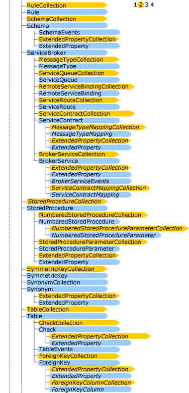
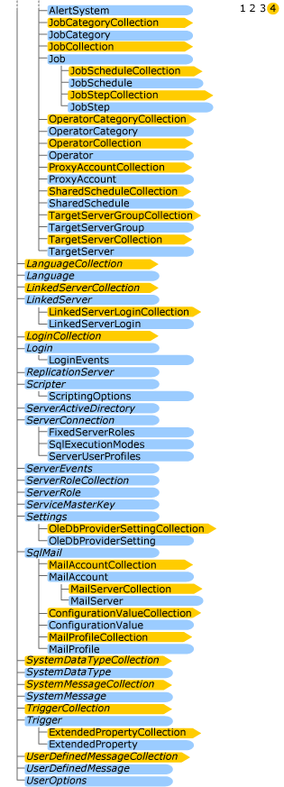

# SMO Object Model Diagram
[!INCLUDE[appliesto-ss-asdb-asdw-xxx-md](../../includes/appliesto-ss-asdb-asdw-xxx-md.md)]

  This diagram shows the SMO object hierarchy and the relationships between the object types. The <xref:Microsoft.SqlServer.Management.Smo.Server> object is the top level object.  
  
   
  
   
  
   
  
   
  
  
