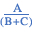
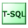

# Showplan Logical and Physical Operators Reference
[!INCLUDE[appliesto-ss-asdb-xxxx-xxx-md](../includes/appliesto-ss-asdb-xxxx-xxx-md.md)]
  Operators describe how [!INCLUDE[ssNoVersion](../includes/ssnoversion-md.md)] executes a query or a Data Manipulation Language (DML) statement. The query optimizer uses operators to build a query plan to create the result specified in the query, or to perform the operation specified in the DML statement. The query plan is a tree consisting of physical operators. You can view the query plan by using the SET SHOWPLAN statements, the graphical execution plan options in [!INCLUDE[ssManStudioFull](../includes/ssmanstudiofull-md.md)], or the SQL Server Profiler Showplan event classes.  
  
 Operators are classified as logical and physical operators.  
  
 **Logical Operators**  
 Logical operators describe the relational algebraic operation used to process a statement. In other words, logical operators describe conceptually what operation needs to be performed.  
  
 **Physical Operators**  
 Physical operators implement the operation described by logical operators. Each physical operator is an object or routine that performs an operation. For example, some physical operators access columns or rows from a table, index or view. Other physical operators perform other operations such as calculations, aggregations, data integrity checks or joins. Physical operators have costs associated with them.  
  
 The physical operators initialize, collect data, and close. Specifically, the physical operator can answer the following three method calls:  
  
-   **Init()**: The **Init()** method causes a physical operator to initialize itself and set up any required data structures. The physical operator may receive many **Init()** calls, though typically a physical operator receives only one.  
  
-   **GetNext()**: The **GetNext()** method causes a physical operator to get the first, or subsequent row of data. The physical operator may receive zero or many **GetNext()** calls.  
  
-   **Close()**: The **Close()** method causes a physical operator to perform some clean-up operations and shut itself down. A physical operator only receives one **Close()** call.  
  
The **GetNext()** method returns one row of data, and the number of times it is called appears as **ActualRows** in the Showplan output that is produced by using SET STATISTICS PROFILE ON or SET STATISTICS XML ON. For more information about these SET options, see [SET STATISTICS PROFILE &#40;Transact-SQL&#41;](../t-sql/statements/set-statistics-profile-transact-sql.md) and [SET STATISTICS XML &#40;Transact-SQL&#41;](../t-sql/statements/set-statistics-xml-transact-sql.md).  
  
The **ActualRebinds** and **ActualRewinds** counts that appear in Showplan output refer to the number of times that the **Init()** method is called. Unless an operator is on the inner side of a loop join, **ActualRebinds** equals one and **ActualRewinds** equals zero. If an operator is on the inner side of a loop join, the sum of the number of rebinds and rewinds should equal the number of rows processed on the outer side of the join. A rebind means that one or more of the correlated parameters of the join changed and the inner side must be reevaluated. A rewind means that none of the correlated parameters changed and the prior inner result set may be reused.  
  
**ActualRebinds** and **ActualRewinds** are present in XML Showplan output produced by using SET STATISTICS XML ON. They are only populated for the **Nonclustered Index Spool**, **Remote Query**, **Row Count Spool**, **Sort**, **Table Spool**, and **Table-valued Function** operators. **ActualRebinds** and **ActualRewinds** may also be populated for the **Assert** and **Filter** operators when the **StartupExpression** attribute is set to TRUE.  
  
When **ActualRebinds** and **ActualRewinds** are present in an XML Showplan, they are comparable to **EstimateRebinds** and **EstimateRewinds**. When they are absent, the estimated number of rows (**EstimateRows**) is comparable to the actual number of rows (**ActualRows**). Note that actual graphical Showplan output displays zeros for the actual rebinds and actual rewinds when they are absent.  
  
A related counter, **ActualEndOfScans**, is available only when Showplan output is produced by using SET STATISTICS XML ON. Whenever a physical operator reaches the end of its data stream, this counter is incremented by one. A physical operator can reach the end of its data stream zero, one, or multiple times. As with rebinds and rewinds, the number of end of scans can be more than one only if the operator is on the inner side of a loop join. The number of end of scans should be less than or equal to the sum of the number of rebinds and rewinds.  
  
## Mapping Physical and Logical Operators  
 The query optimizer creates a query plan as a tree consisting of logical operators. After the query optimizer creates the plan, the query optimizer chooses the most efficient physical operator for each logical operator. The query optimizer uses a cost-based approach to determine which physical operator will implement a logical operator.  
  
 Usually, a logical operation can be implemented by multiple physical operators. However, in rare cases, a physical operator can implement multiple logical operations as well.  
  
## Operator Descriptions  
 This section contains descriptions of the logical and physical operators.  
  
|Graphical Execution Plan Icon|Showplan Operator|Description|  
|-----------------------------------|-----------------------|-----------------|  
||**Adaptive Join**|The **Adaptive Join** operator enables the choice of a hash join or nested loop join method to be deferred until the after the first input has been scanned. | 
|None|**Aggregate**|The **Aggregate** operator calculates an expression containing MIN, MAX, SUM, COUNT or AVG. The **Aggregate** operator can be a logical operator or a physical operator.| 
||**Arithmetic Expression**|The **Arithmetic Expression** operator computes a new value from existing values in a row. **Arithmetic Expression** is not used in [!INCLUDE[ssCurrent](../includes/sscurrent-md.md)].| 
|None|**Async Concat**|The **Async Concat** operator is used only in remote queries (distributed queries). It has *n* children and one parent node. Usually, some of the children are remote computers that participate in a distributed query. **Async Concat** issues `open()` calls to all of the children simultaneously and then applies a bitmap to each child. For each bit that is a 1, **Async Concat** sends the output rows to the parent node on demand.| 
||**Assert**|The **Assert** operator verifies a condition. For example, it validates referential integrity or ensures that a scalar subquery returns one row. For each input row, the **Assert** operator evaluates the expression in the **Argument** column of the execution plan. If this expression evaluates to NULL, the row is passed through the **Assert** operator and the query execution continues. If this expression evaluates to a nonnull value, the appropriate error will be raised. The **Assert** operator is a physical operator.| 
||**Assign**|The **Assign** operator assigns the value of an expression or a constant to a variable. **Assign** is a language element.| 
||**Bitmap Create**|The **Bitmap Create** operator appears in the Showplan output where bitmaps are built. **Bitmap Create** is a logical operator.| 
||**Bitmap**|[!INCLUDE[ssNoVersion](../includes/ssnoversion-md.md)] uses the **Bitmap** operator to implement bitmap filtering in parallel query plans. Bitmap filtering speeds up query execution by eliminating rows with key values that cannot produce any join records before passing rows through another operator such as the **Parallelism** operator. A bitmap filter uses a compact representation of a set of values from a table in one part of the operator tree to filter rows from a second table in another part of the tree. By removing unnecessary rows early in the query, subsequent operators have fewer rows to work with, and the overall performance of the query improves. The optimizer determines when a bitmap is selective enough to be useful and in which operators to apply the filter. **Bitmap** is a physical operator.| 
||**Bookmark Lookup**|The **Bookmark Lookup** operator uses a bookmark (row ID or clustering key) to look up the corresponding row in the table or clustered index. The **Argument** column contains the bookmark label used to look up the row in the table or clustered index. The **Argument** column also contains the name of the table or clustered index in which the row is looked up. If the WITH PREFETCH clause appears in the **Argument** column, the query processor has determined that it is optimal to use asynchronous prefetching (read-ahead) when looking up bookmarks in the table or clustered index.   Starting with [!INCLUDE[ssVersion2005](../includes/ssversion2005-md.md)], **Bookmark Lookup** is not used. Instead, **Key Lookup** and **RID Lookup** provide bookmark lookup functionality.| 
|None|**Branch Repartition**|In a parallel query plan, sometimes there are conceptual regions of iterators. All of the iterators within such a region can be executed by parallel threads. The regions themselves must be executed serially. Some of the **Parallelism** iterators within an individual region are called **Branch Repartition**. The **Parallelism** iterator at the boundary of two such regions is called **Segment Repartition**. **Branch Repartition** and **Segment Repartition** are logical operators.| 
|None|**Broadcast**|**Broadcast** has one child node and *n* parent nodes. **Broadcast** sends its input rows to multiple consumers on demand. Each consumer gets all of the rows. For example, if all of the consumers are build sides of a hash join, then *n* copies of the hash tables will be built.| 
||**Build Hash**|Indicates the build of a batch hash table for an xVelocity memory optimized columnstore index.| 
|None|**Cache**|**Cache** is a specialized version of the **Spool** operator. It stores only one row of data. **Cache** is a logical operator. **Cache** is not used in [!INCLUDE[ssCurrent](../includes/sscurrent-md.md)].| 
||**Clustered Index Delete**|The **Clustered Index Delete** operator deletes rows from the clustered index specified in the Argument column of the query execution plan. If a WHERE:() predicate is present in the Argument column, then only those rows that satisfy the predicate are deleted.**Clustered Index Delete** is a physical operator.| 
||**Clustered Index Insert**|The **Clustered Index Insert** Showplan operator inserts rows from its input into the clustered index specified in the Argument column. The Argument column also contains a SET:() predicate, which indicates the value to which each column is set. If **Clustered Index Insert** has no children for insert values, the row inserted is taken from the **Insert** operator itself.**Clustered Index Insert** is a physical operator.| 
||**Clustered Index Merge**|The **Clustered Index Merge** operator applies a merge data stream to a clustered index. The operator deletes, updates, or inserts rows from the clustered index specified in the **Argument** column of the operator. The actual operation performed depends on the runtime value of the **ACTION** column specified in the **Argument** column of the operator. **Clustered Index Merge** is a physical operator.| 
||**Clustered Index Scan**|The **Clustered Index Scan** operator scans the clustered index specified in the Argument column of the query execution plan. When an optional WHERE:() predicate is present, only those rows that satisfy the predicate are returned. If the Argument column contains the ORDERED clause, the query processor has requested that the output of the rows be returned in the order in which the clustered index has sorted it. If the ORDERED clause is not present, the storage engine scans the index in the optimal way, without necessarily sorting the output. **Clustered Index Scan** is a logical and physical operator.| 
||**Clustered Index Seek**|The **Clustered Index Seek** operator uses the seeking ability of indexes to retrieve rows from a clustered index. The **Argument** column contains the name of the clustered index being used and the SEEK:() predicate. The storage engine uses the index to process only those rows that satisfy this SEEK:() predicate. It can also include a WHERE:() predicate where the storage engine evaluates against all rows that satisfy the SEEK:() predicate, but this is optional and does not use indexes to complete this process.   If the **Argument** column contains the ORDERED clause, the query processor has determined that the rows must be returned in the order in which the clustered index has sorted them. If the ORDERED clause is not present, the storage engine searches the index in the optimal way, without necessarily sorting the output. Allowing the output to retain its ordering can be less efficient than producing nonsorted output. When the keyword LOOKUP appears, then a bookmark lookup is being performed. In [!INCLUDE[ssKatmai](../includes/sskatmai-md.md)] and later versions, the **Key Lookup** operator provides bookmark lookup functionality. **Clustered Index Seek** is a logical and physical operator.| 
||**Clustered Index Update**|The **Clustered Index Update** operator updates input rows in the clustered index specified in the **Argument** column.If a WHERE:() predicate is present, only those rows that satisfy this predicate are updated. If a SET:() predicate is present, each updated column is set to this value. If a DEFINE:() predicate is present, the values that this operator defines are listed. These values may be referenced in the SET clause or elsewhere within this operator and elsewhere within this query. **Clustered Index Update** is a logical and physical operator.| 
||**Collapse**|The **Collapse** operator optimizes update processing. When an update is performed, it can be split (using the **Split** operator) into a delete and an insert. The **Argument** column contains a GROUP BY:() clause that specifies a list of key columns. If the query processor encounters adjacent rows that delete and insert the same key values, it replaces these separate operations with a single more efficient update operation. **Collapse** is a logical and physical operator.| 
||**Columnstore Index Scan**|The **Columnstore Index Scan** operator scans the columnstore index specified in the **Argument** column of the query execution plan.| 
||**Compute Scalar**|The **Compute Scalar** operator evaluates an expression to produce a computed scalar value. This may then be returned to the user, referenced elsewhere in the query, or both. An example of both is in a filter predicate or join predicate. **Compute Scalar** is a logical and physical operator.   **Compute Scalar** operators that appear in Showplans generated by SET STATISTICS XML might not contain the **RunTimeInformation** element. In graphical Showplans, **Actual Rows**, **Actual Rebinds**, and **Actual Rewinds** might be absent from the **Properties** window when the **Include Actual Execution Plan** option is selected in [!INCLUDE[ssManStudioFull](../includes/ssmanstudiofull-md.md)]. When this occurs, it means that although these operators were used in the compiled query plan, their work was performed by other operators in the run-time query plan. Also note that the number of executes in Showplan output generated by SET STATISTICS PROFILE is equivalent to the sum of rebinds and rewinds in Showplans generated by SET STATISTICS XML.| 
||**Concatenation**|The **Concatenation** operator scans multiple inputs, returning each row scanned. **Concatenation** is typically used to implement the [!INCLUDE[tsql](../includes/tsql-md.md)] UNION ALL construct. The **Concatenation** physical operator has two or more inputs and one output. Concatenation copies rows from the first input stream to the output stream, then repeats this operation for each additional input stream. **Concatenation** is a logical and physical operator.| 
||**Constant Scan**|The **Constant Scan** operator introduces one or more constant rows into a query. A **Compute Scalar** operator is often used after a **Constant Scan** to add columns to a row produced by the **Constant Scan** operator.| 
| language element icon")|**Convert**|The **Convert** operator converts one scalar data type to another. **Convert** is a language element.| 
|None|**Cross Join**|The **Cross Join** operator joins each row from the first (top) input with each row from the second (bottom) input. **Cross Join** is a logical operator.| 
|None|**Cursor**|The **Cursor** logical and physical operators are used to describe how a query or update involving cursor operations is executed. The physical operators describe the physical implementation algorithm used to process the cursor; for example, using a keyset-driven cursor. Each step in the execution of a cursor involves a physical operator. The logical operators describe a property of the cursor, such as the cursor is read only.   Logical operators include Asynchronous, Optimistic, Primary, Read Only, Scroll Locks, and Secondary and Synchronous.   Physical operators include Dynamic, Fetch Query, Keyset, Population Query, Refresh Query and Snapshot.| 
||**catchall**|The catchall icon is displayed when a suitable icon for the iterator cannot be found by the logic that produces graphical showplans. The catchall icon does not necessarily indicate an error condition. There are three catchall icons: blue (for iterators), orange (for cursors), and green (for [!INCLUDE[tsql](../includes/tsql-md.md)] language elements).| 
||**Declare**|The **Declare** operator allocates a local variable in the query plan. **Declare** is a language element.| 
| operator icon")|**Delete**|The **Delete** operator deletes from an object rows that satisfy the optional predicate in the **Argument** column.| 
||**Deleted Scan**|The **Deleted Scan** operator scans the deleted table within a trigger.| 
|None|**Distinct Sort**|The **Distinct Sort** logical operator scans the input, removing duplicates and sorting by the columns specified in the DISTINCT ORDER BY:() predicate of the **Argument** column. **Distinct Sort** is a logical operator.| 
|None|**Distinct**|The **Distinct** operator removes duplicates from a rowset or from a collection of values. **Distinct** is a logical operator.| 
||**Distribute Streams**|The **Distribute Streams** operator is used only in parallel query plans. The **Distribute Streams** operator takes a single input stream of records and produces multiple output streams. The record contents and format are not changed. Each record from the input stream appears in one of the output streams. This operator automatically preserves the relative order of the input records in the output streams. Usually, hashing is used to decide to which output stream a particular input record belongs.   If the output is partitioned, then the **Argument** column contains a PARTITION COLUMNS:() predicate and the partitioning columns. **Distribute Streams** is a logical operator| 
||**Dynamic**|The **Dynamic** operator uses a cursor that can see all changes made by others.| 
||**Fetch Query**|The **Fetch Query** operator retrieves rows when a fetch is issued against a cursor.| 
| operator icon")|**Filter**|The **Filter** operator scans the input, returning only those rows that satisfy the filter expression (predicate) that appears in the **Argument** column.| 
|None|**Flow Distinct**|The **Flow Distinct** logical operator scans the input, removing duplicates. Whereas the **Distinct** operator consumes all input before producing any output, the **FlowDistinct** operator returns each row as it is obtained from the input (unless that row is a duplicate, in which case it is discarded).| 
||**Foreign Key References Check**|The **Foreign Key References Check** operator performs referential integrity checks in place, by comparing the modified row to the rows in the referencing tables to verify that the modification will not break the referential integrity. The **Foreign Key References Check** operator is used when more than 253 foreign key references exist on the same primary or unique key. **Foreign Key References Check** is a logical and physical operator.| 
|None|**Full Outer Join**|The **Full Outer Join** logical operator returns each row satisfying the join predicate from the first (top) input joined with each row from the second (bottom) input. It also returns rows from:   -The first input that had no matches in the second input.   -The second input that had no matches in the first input.   The input that does not contain the matching values is returned as a null value. **Full Outer Join** is a logical operator.| 
||**Gather Streams**|The **Gather Streams** operator is only used in parallel query plans. The **Gather Streams** operator consumes several input streams and produces a single output stream of records by combining the input streams. The record contents and format are not changed. If this operator is order preserving, all input streams must be ordered. If the output is ordered, the **Argument** column contains an ORDER BY:() predicate and the names of columns being ordered. **Gather Streams** is a logical operator.| 
||**Hash Match**|The **Hash Match** operator builds a hash table by computing a hash value for each row from its build input. A HASH:() predicate with a list of columns used to create a hash value appears in the **Argument** column. Then, for each probe row (as applicable), it computes a hash value (using the same hash function) and looks in the hash table for matches. If a residual predicate is present (identified by RESIDUAL:() in the **Argument** column), that predicate must also be satisfied for rows to be considered a match. Behavior depends on the logical operation being performed:   -For any joins, use the first (top) input to build the hash table and the second (bottom) input to probe the hash table. Output matches (or nonmatches) as dictated by the join type. If multiple joins use the same join column, these operations are grouped into a hash team.   -For the distinct or aggregate operators, use the input to build the hash table (removing duplicates and computing any aggregate expressions). When the hash table is built, scan the table and output all entries.   -For the union operator, use the first input to build the hash table (removing duplicates). Use the second input (which must have no duplicates) to probe the hash table, returning all rows that have no matches, then scan the hash table and return all entries.   **Hash Match** is a physical operator.| 
||**If**|The **If** operator carries out conditional processing based on an expression. **If** is a language element.| 
|None|**Inner Join**|The **Inner Join** logical operator returns each row that satisfies the join of the first (top) input with the second (bottom) input.| 
| operator icon")|**Insert**|The **Insert** logical operator inserts each row from its input into the object specified in the **Argument** column. The physical operator is either the **Table Insert**, **Index Insert**, or **Clustered Index Insert** operator.| 
||**Inserted Scan**|The **Inserted Scan** operator scans the **inserted** table. **Inserted Scan** is a logical and physical operator.| 
||**Intrinsic**|The **Intrinsic** operator invokes an internal [!INCLUDE[tsql](../includes/tsql-md.md)] function. **Intrinsic** is a language element.| 
||**Iterator**|The **Iterator** catchall icon is displayed when a suitable icon for the iterator cannot be found by the logic that produces graphical Showplans. The catchall icon does not necessarily indicate an error condition. There are three catchall icons: blue (for iterators), orange (for cursors), and green (for [!INCLUDE[tsql](../includes/tsql-md.md)] language constructs).| 
||**Key Lookup**|The **Key Lookup** operator is a bookmark lookup on a table with a clustered index. The **Argument** column contains the name of the clustered index and the clustering key used to look up the row in the clustered index. **Key Lookup** is always accompanied by a **Nested Loops** operator. If the WITH PREFETCH clause appears in the **Argument** column, the query processor has determined that it is optimal to use asynchronous prefetching (read-ahead) when looking up bookmarks in the clustered index.   The use of a **Key Lookup** operator in a query plan indicates that the query might benefit from performance tuning. For example, query performance might be improved by adding a covering index.| 
||**Keyset**|The **Keyset** operator uses a cursor that can see updates, but not inserts made by others.| 
||**Language Element**|The **Language Element** catchall icon is displayed when a suitable icon for the iterator cannot be found by the logic that produces graphical Showplans. The catchall icon does not necessarily indicate an error condition. There are three catchall icons: blue (for iterators), orange (for cursors), and green (for [!INCLUDE[tsql](../includes/tsql-md.md)] language constructs).| 
|None|**Left Anti Semi Join**|The **Left Anti Semi Join** operator returns each row from the first (top) input when there is no matching row in the second (bottom) input. If no join predicate exists in the **Argument** column, each row is a matching row. **Left Anti Semi Join** is a logical operator.| 
|None|**Left Outer Join**|The **Left Outer Join** operator returns each row that satisfies the join of the first (top) input with the second (bottom) input. It also returns any rows from the first input that had no matching rows in the second input. The nonmatching rows in the second input are returned as null values. If no join predicate exists in the **Argument** column, each row is a matching row. **Left Outer Join** is a logical operator.| 
|None|**Left Semi Join**|The **Left Semi Join** operator returns each row from the first (top) input when there is a matching row in the second (bottom) input. If no join predicate exists in the **Argument** column, each row is a matching row. **Left Semi Join** is a logical operator.| 
||**Log Row Scan**|The **Log Row Scan** operator scans the transaction log. **Log Row Scan** is a logical and physical operator.| 
||**Merge Interval**|The **Merge Interval** operator merges multiple (potentially overlapping) intervals to produce minimal, nonoverlapping intervals that are then used to seek index entries. This operator typically appears above one or more **Compute Scalar** operators over **Constant Scan** operators, which construct the intervals (represented as columns in a row) that this operator merges. **Merge Interval** is a logical and physical operator.| 
||**Merge Join**|The **Merge Join** operator performs the inner join, left outer join, left semi join, left anti semi join, right outer join, right semi join, right anti semi join, and union logical operations.   In the **Argument** column, the **Merge Join** operator contains a MERGE:() predicate if the operation is performing a one-to-many join, or a MANY-TO-MANY MERGE:() predicate if the operation is performing a many-to-many join. The **Argument** column also includes a comma-separated list of columns used to perform the operation. The **Merge Join** operator requires two inputs sorted on their respective columns, possibly by inserting explicit sort operations into the query plan. Merge join is particularly effective if explicit sorting is not required, for example, if there is a suitable B-tree index in the database or if the sort order can be exploited for multiple operations, such as a merge join and grouping with roll up. **Merge Join** is a physical operator.| 
||**Nested Loops**|The **Nested Loops** operator performs the inner join, left outer join, left semi join, and left anti semi join logical operations. Nested loops joins perform a search on the inner table for each row of the outer table, typically using an index. The query processor decides, based on anticipated costs, whether to sort the outer input in order to improve locality of the searches on the index over the inner input. Any rows that satisfy the (optional) predicate in the **Argument** column are returned as applicable, based on the logical operation being performed. **Nested Loops** is a physical operator.| 
||**Nonclustered Index Delete**|The **Nonclustered Index Delete** operator deletes input rows from the nonclustered index specified in the **Argument** column. **Nonclustered Index Delete** is a physical operator.| 
||**Index Insert**|The **Index Insert** operator inserts rows from its input into the nonclustered index specified in the **Argument** column. The **Argument** column also contains a SET:() predicate, which indicates the value to which each column is set. **Index Insert** is a physical operator.| 
||**Index Scan**|The **Index Scan** operator retrieves all rows from the nonclustered index specified in the **Argument** column. If an optional WHERE:() predicate appears in the **Argument** column, only those rows that satisfy the predicate are returned. **Index Scan** is a logical and physical operator.| 
||**Index Seek**|The **Index Seek** operator uses the seeking ability of indexes to retrieve rows from a nonclustered index. The **Argument** column contains the name of the nonclustered index being used. It also contains the SEEK:() predicate. The storage engine uses the index to process only those rows that satisfy the SEEK:() predicate. It optionally may include a WHERE:() predicate, which the storage engine will evaluate against all rows that satisfy the SEEK:() predicate (it does not use the indexes to do this). If the **Argument** column contains the ORDERED clause, the query processor has determined that the rows must be returned in the order in which the nonclustered index has sorted them. If the ORDERED clause is not present, the storage engine searches the index in the optimal way (which does not guarantee that the output will be sorted). Allowing the output to retain its ordering may be less efficient than producing nonsorted output. **Index Seek** is a logical and physical operator.| 
||**Index Spool**|The **Index Spool** physical operator contains a SEEK:() predicate in the **Argument** column. The **Index Spool** operator scans its input rows, placing a copy of each row in a hidden spool file (stored in the **tempdb** database and existing only for the lifetime of the query), and builds a nonclustered index on the rows. This allows you to use the seeking capability of indexes to output only those rows that satisfy the SEEK:() predicate. If the operator is rewound (for example, by a **Nested Loops** operator) but no rebinding is needed, the spooled data is used instead of rescanning the input.| 
||**Nonclustered Index Update**|The **Nonclustered Index Update** physical operator updates rows from its input in the nonclustered index specified in the **Argument** column. If a SET:() predicate is present, each updated column is set to this value. **Nonclustered Index Update** is a physical operator.| 
||**Online Index Insert**|The **Online Index Insert** physical operator indicates that an index create, alter, or drop operation is performed online. That is, the underlying table data remains available to users during the index operation.| 
|None|**Parallelism**| The **Parallelism** operator (or Exchange Iterator) performs the distribute streams, gather streams, and repartition streams logical operations. The **Argument** columns can contain a PARTITION COLUMNS:() predicate with a comma-separated list of the columns being partitioned. The **Argument** columns can also contain an ORDER BY:() predicate, listing the columns to preserve the sort order for during partitioning. **Parallelism** is a physical operator. For more information about the Parallelism operator, see [Craig Freedman's blog series](https://blogs.msdn.microsoft.com/craigfr/tag/parallelism/).  **Note:** If a query has been compiled as a parallel query, but at run time it is run as a serial query, the Showplan output generated by SET STATISTICS XML or by using the **Include Actual Execution Plan** option in [!INCLUDE[ssManStudioFull](../includes/ssmanstudiofull-md.md)] will not contain the **RunTimeInformation** element for the **Parallelism** operator. In SET STATISTICS PROFILE output, the actual row counts and actual number of executes will display zeroes for the **Parallelism** operator. When either condition occurs, it means that the **Parallelism** operator was only used during query compilation and not in the run-time query plan. Note that sometimes parallel query plans are run in serial if there is a high concurrent load on the server.| 
||**Parameter Table Scan**|The **Parameter Table Scan** operator scans a table that is acting as a parameter in the current query. Typically, this is used for INSERT queries within a stored procedure. **Parameter Table Scan** is a logical and physical operator.| 
|None|**Partial Aggregate**|**Partial Aggregate** is used in parallel plans. It applies an aggregation function to as many input rows as possible so that writing to disk (known as a "spill") is not necessary. **Hash Match** is the only physical operator (iterator) that implements partition aggregation. **Partial Aggregate** is a logical operator.| 
||**Population Query**|The **Population Query** operator populates the work table of a cursor when the cursor is opened.| 
||**Refresh Query**|The **Refresh Query** operator fetches current data for rows in the fetch buffer.| 
||**Remote Delete**|The **Remote Delete** operator deletes the input rows from a remote object. **Remote Delete** is a logical and physical operator.| 
||**Remote Index Scan**|The **Remote Index Scan** operator scans the remote index specified in the Argument column. **Remote Index Scan** is a logical and physical operator.| 
||**Remote Index Seek**|The **Remote Index Seek** operator uses the seeking ability of a remote index object to retrieve rows. The **Argument** column contains the name of the remote index being used and the SEEK:() predicate. **Remote Index Seek** is a logical physical operator.| 
||**Remote Insert**|The **Remote Insert** operator inserts the input rows into a remote object. **Remote Insert** is a logical and physical operator.| 
||**Remote Query**|The **Remote Query** operator submits a query to a remote source. The text of the query sent to the remote server appears in the **Argument** column. **Remote Query** is a logical and physical operator.| 
||**Remote Scan**|The **Remote Scan** operator scans a remote object. The name of the remote object appears in the **Argument** column. **Remote Scan** is a logical and physical operator.| 
||**Remote Update**|The **Remote Update** operator updates the input rows in a remote object. **Remote Update** is a logical and physical operator.| 
||**Repartition Streams**|The **Repartition Streams** operator (or exchange iterator) consumes multiple streams and produces multiple streams of records. The record contents and format are not changed. If the query optimizer uses a bitmap filter, the number of rows in the output stream is reduced. Each record from an input stream is placed into one output stream. If this operator is order preserving, all input streams must be ordered and merged into several ordered output streams. If the output is partitioned, the **Argument** column contains a PARTITION COLUMNS:() predicate and the partitioning columns.If the output is ordered, the **Argument** column contains an ORDER BY:() predicate and the columns being ordered. **Repartition Streams** is a logical operator. The operator is used only in parallel query plans.| 
||**Result**|The **Result** operator is the data returned at the end of a query plan. This is usually the root element of a Showplan. **Result** is a language element.| 
||**RID Lookup**|**RID Lookup** is a bookmark lookup on a heap using a supplied row identifier (RID). The **Argument** column contains the bookmark label used to look up the row in the table and the name of the table in which the row is looked up. **RID Lookup** is always accompanied by a NESTED LOOP JOIN. **RID Lookup** is a physical operator. For more information about bookmark lookups, see "[Bookmark Lookup](https://go.microsoft.com/fwlink/?LinkId=132568)" on the MSDN SQL Server blog.| 
||**Row Count Spool**|The **Row Count Spool** operator scans the input, counting how many rows are present and returning the same number of rows without any data in them. This operator is used when it is important to check for the existence of rows, rather than the data contained in the rows. For example, if a **Nested Loops** operator performs a left semi join operation and the join predicate applies to inner input, a row count spool may be placed at the top of the inner input of the **Nested Loops** operator. Then the **Nested Loops** operator can determine how many rows are output by the row count spool (because the actual data from the inner side is not needed) to determine whether to return the outer row. **Row Count Spool** is a physical operator.| 
|None|**Right Anti Semi Join**|The **Right Anti Semi Join** operator outputs each row from the second (bottom) input when a matching row in the first (top) input does not exist. A matching row is defined as a row that satisfies the predicate in the **Argument** column (if no predicate exists, each row is a matching row). **Right Anti Semi Join** is a logical operator.| 
|None|**Right Outer Join**|The **Right Outer Join** operator returns each row that satisfies the join of the second (bottom) input with each matching row from the first (top) input. It also returns any rows from the second input that had no matching rows in the first input, joined with NULL. If no join predicate exists in the **Argument** column, each row is a matching row. **Right Outer Join** is a logical operator.| 
|None|**Right Semi Join**|The **Right Semi Join** operator returns each row from the second (bottom) input when there is a matching row in the first (top) input. If no join predicate exists in the **Argument** column, each row is a matching row. **Right Semi Join** is a logical operator.| 
||**Segment**|**Segment** is a physical and a logical operator. It divides the input set into segments based on the value of one or more columns. These columns are shown as arguments in the **Segment** operator. The operator then outputs one segment at a time.| 
||**Sequence**|The **Sequence** operator drives wide update plans. Functionally, it executes each input in sequence (top to bottom). Each input is usually an update of a different object. It returns only those rows that come from its last (bottom) input. **Sequence** is a logical and physical operator.| 
||**Sequence Project**|The **Sequence Project** operator adds columns to perform computations over an ordered set. It divides the input set into segments based on the value of one or more columns. The operator then outputs one segment at a time. These columns are shown as arguments in the **Sequence Project** operator. **Sequence Project** is a logical and physical operator.| 
|None|**Segment Repartition**|In a parallel query plan, sometimes there are conceptual regions of iterators. All of the iterators within such a region can be executed by parallel threads. The regions themselves must be executed serially. Some of the **Parallelism** iterators within an individual region are called **Branch Repartition**. The **Parallelism** iterator at the boundary of two such regions is called **Segment Repartition**. **Branch Repartition** and **Segment Repartition** are logical operators.| 
||**Snapshot**|The **Snapshot** operator creates a cursor that does not see changes made by others.| 
||**Sort**|The **Sort** operator sorts all incoming rows. The **Argument** column contains either a DISTINCT ORDER BY:() predicate if duplicates are removed by this operation, or an ORDER BY:() predicate with a comma-separated list of the columns being sorted. The columns are prefixed with the value ASC if the columns are sorted in ascending order, or the value DESC if the columns are sorted in descending order. **Sort** is a logical and physical operator.| 
||**Split**|The **Split** operator is used to optimize update processing. It splits each update operation into a delete and an insert operation. **Split** is a logical and physical operator.| 
||**Eager Spool**|The **Eager Spool** operator takes the entire input, storing each row in a hidden temporary object stored in the **tempdb** database. If the operator is rewound (for example, by a **Nested Loops** operator) but no rebinding is needed, the spooled data is used instead of rescanning the input. If rebinding is needed, the spooled data is discarded and the spool object is rebuilt by rescanning the (rebound) input. The **Eager Spool** operator builds its spool file in an "eager" manner: when the spool's parent operator asks for the first row, the spool operator consumes all rows from its input operator and stores them in the spool. **Eager Spool** is a logical operator.| 
||**Lazy Spool**|The **Lazy Spool** logical operator stores each row from its input in a hidden temporary object stored in the **tempdb** database. If the operator is rewound (for example, by a **Nested Loops** operator) but no rebinding is needed, the spooled data is used instead of rescanning the input. If rebinding is needed, the spooled data is discarded and the spool object is rebuilt by rescanning the (rebound) input. The **Lazy Spool** operator builds its spool file in a "lazy" manner, that is, each time the spool's parent operator asks for a row, the spool operator gets a row from its input operator and stores it in the spool, rather than consuming all rows at once. Lazy Spool is a logical operator.| 
||**Spool**|The **Spool** operator saves an intermediate query result to the **tempdb** database.| 
||**Stream Aggregate**|The **Stream Aggregate** operator groups rows by one or more columns and then calculates one or more aggregate expressions returned by the query. The output of this operator can be referenced by later operators in the query, returned to the client, or both. The **Stream Aggregate** operator requires input ordered by the columns within its groups. The optimizer will use a **Sort** operator prior to this operator if the data is not already sorted due to a prior **Sort** operator or due to an ordered index seek or scan. In the SHOWPLAN_ALL statement or the graphical execution plan in [!INCLUDE[ssManStudioFull](../includes/ssmanstudiofull-md.md)], the columns in the GROUP BY predicate are listed in the **Argument** column, and the aggregate expressions are listed in the **Defined Values** column. **Stream Aggregate** is a physical operator.| 
||**Switch**|**Switch** is a special type of concatenation iterator that has *n* inputs. An expression is associated with each **Switch** operator. Depending on the return value of the expression (between 0 and *n*-1), **Switch** copies the appropriate input stream to the output stream. One use of **Switch** is to implement query plans involving fast forward cursors with certain operators such as the **TOP** operator. **Switch** is both a logical and physical operator.| 
||**Table Delete**|The **Table Delete** physical operator deletes rows from the table specified in the **Argument** column of the query execution plan.| 
||**Table Insert**|The **Table Insert** operator inserts rows from its input into the table specified in the **Argument** column of the query execution plan. The **Argument** column also contains a SET:() predicate, which indicates the value to which each column is set. If **Table Insert** has no children for insert values, then the row inserted is taken from the Insert operator itself. **Table Insert** is a physical operator.| 
||**Table Merge**|The **Table Merge** operator applies a merge data stream to a heap. The operator deletes, updates, or inserts rows in the table specified in the **Argument** column of the operator. The actual operation performed depends on the run-time value of the **ACTION** column specified in the **Argument** column of the operator. **Table Merge** is a physical operator.| 
||**Table Scan**|The **Table Scan** operator retrieves all rows from the table specified in the **Argument** column of the query execution plan. If a WHERE:() predicate appears in the **Argument** column, only those rows that satisfy the predicate are returned. **Table Scan** is a logical and physical operator.| 
||**Table Spool**|The **Table Spool** operator scans the input and places a copy of each row in a hidden spool table that is stored in the [tempdb](../relational-databases/databases/tempdb-database.md) database and existing only for the lifetime of the query. If the operator is rewound (for example, by a **Nested Loops** operator) but no rebinding is needed, the spooled data is used instead of rescanning the input. **Table Spool** is a physical operator.| 
||**Window Spool**|The **Window Spool** operator expands each row into the set of rows that represents the window associated with it. In a query, the OVER clause defines the window within a query result set and a window function then computes a value for each row in the window. **Window Spool** is a logical and physical operator.| 
||**Table Update**|The **Table Update** physical operator updates input rows in the table specified in the **Argument** column of the query execution plan. The SET:() predicate determines the value of each updated column. These values may be referenced in the SET clause or elsewhere within this operator as well as elsewhere within this query.| 
||**Table-valued Function**|The **Table-valued Function** operator evaluates a table-valued function (either [!INCLUDE[tsql](../includes/tsql-md.md)] or CLR), and stores the resulting rows in the [tempdb](../relational-databases/databases/tempdb-database.md) database. When the parent iterators request the rows, **Table-valued Function** returns the rows from **tempdb**.   Queries with calls to table-valued functions generate query plans with the **Table-valued Function** iterator. **Table-valued Function** can be evaluated with different parameter values:   -  **Table-valued Function XML Reader** inputs an XML BLOB as a parameter and produces a rowset representing XML nodes in XML document order. Other input parameters may restrict XML nodes returned to a subset of XML document.   -**Table Valued Function XML Reader with XPath filter** is a special type of **XML Reader Table-valued Function** that restricts output to XML nodes satisfying an XPath expression.   **Table-valued Function** is a logical and physical operator.| 
|None|**Top N Sort**|**Top N Sort** is similar to the **Sort** iterator, except that only the first *N* rows are needed, and not the entire result set. For small values of *N*, the [!INCLUDE[ssNoVersion](../includes/ssnoversion-md.md)] query execution engine attempts to perform the entire sort operation in memory. For large values of *N*, the query execution engine resorts to the more generic method of sorting to which *N* is not a parameter.| 
||**Top**|The **Top** operator scans the input, returning only the first specified number or percent of rows, possibly based on a sort order. The **Argument** column can contain a list of the columns that are being checked for ties. In update plans, the **Top** operator is used to enforce row count limits. **Top** is a logical and physical operator.| 
| icon")|**UDX**|Extended Operators (UDX) implement one of many XQuery and XPath operations in [!INCLUDE[ssNoVersion](../includes/ssnoversion-md.md)]. All UDX operators are both logical and physical operators.   Extended operator (UDX) **FOR XML** is used to serialize the relational row set it inputs into XML representation in a single BLOB column in a single output row. It is an order sensitive XML aggregation operator.   Extended operator (UDX) **XML SERIALIZER** is an order sensitive XML aggregation operator. It inputs rows representing XML nodes or XQuery scalars in XML document order and produces a serialized XML BLOB in a single XML column in a single output row.   Extended operator (UDX) **XML FRAGMENT SERIALIZER** is a special type of **XML SERIALIZER** that is used for processing input rows representing XML fragments being inserted in XQuery insert data modification extension.   Extended operator (UDX) **XQUERY STRING** evaluates the XQuery string value of input rows representing XML nodes. It is an order sensitive string aggregation operator. It outputs one row with columns representing the XQuery scalar that contains string value of the input.   Extended operator (UDX) **XQUERY LIST DECOMPOSER** is an XQuery list decomposition operator. For each input row representing an XML node it produces one or more rows each representing XQuery scalar containing a list element value if the input is of XSD list type.   Extended operator (UDX) **XQUERY DATA** evaluates the XQuery fn:data() function on input representing XML nodes. It is an order sensitive string aggregation operator. It outputs one row with columns representing XQuery scalar that contains the result of **fn:data()**.   Extended operator **XQUERY CONTAINS** evaluates the XQuery fn:contains() function on input representing XML nodes. It is an order sensitive string aggregation operator. It outputs one row with columns representing XQuery scalar that contains the result of **fn:contains()**.   Extended operator **UPDATE XML NODE** updates XML node in the XQuery replace data modification extension in the **modify()** method on XML type.| 
|None|**Union**|The **Union** operator scans multiple inputs, outputting each row scanned and removing duplicates. **Union** is a logical operator.| 
| operator icon")|**Update**|The **Update** operator updates each row from its input in the object specified in the **Argument** column of the query execution plan. **Update** is a logical operator. The physical operator is **Table Update**, **Index Update**, or **Clustered Index Update**.| 
||**While**|The **While** operator implements the [!INCLUDE[tsql](../includes/tsql-md.md)] while loop. **While** is a language element| 
  
