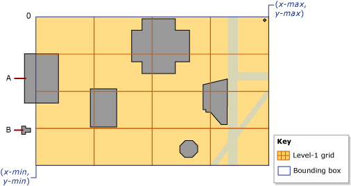
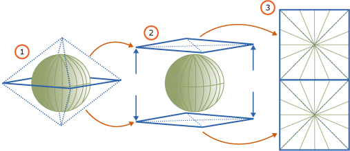
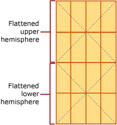

# Spatial Indexes Overview
[!INCLUDE [SQL Server Azure SQL Database Azure SQL Managed Instance](../../includes/applies-to-version/sql-asdb-asdbmi.md)]
  [!INCLUDE[ssNoVersion](../../includes/ssnoversion-md.md)] supports spatial data and spatial indexes. A *spatial index* is a type of extended index that allows you to index a spatial column. A spatial column is a table column that contains data of a spatial data type, such as **geometry** or **geography**.

> [!TIP]
> [!INCLUDE [Spatial tools project information](../../includes/spatial-tools.md)]  
  
##  <a name="about"></a> About Spatial Indexes  
  
###  <a name="decompose"></a> Decomposing Indexed Space into a Grid Hierarchy  
 In [!INCLUDE[ssNoVersion](../../includes/ssnoversion-md.md)], spatial indexes are built using B-trees, which means that the indexes must represent the 2-dimensional spatial data in the linear order of B-trees. Therefore, before reading data into a spatial index, [!INCLUDE[ssNoVersion](../../includes/ssnoversion-md.md)] implements a hierarchical uniform decomposition of space. The index-creation process *decomposes* the space into a four-level *grid hierarchy*. These levels are referred to as *level 1* (the top level), *level 2*, *level 3*, and *level 4*.  
  
 Each successive level further decomposes the level above it, so each upper-level cell contains a complete grid at the next level. On a given level, all the grids have the same number of cells along both axes (for example, 4x4 or 8x8), and the cells are all one size.  
  
 The following illustration shows the decomposition for the upper-right cell at each level of the grid hierarchy into a 4x4 grid. In reality, all the cells are decomposed in this way. Thus, for example, decomposing a space into four levels of 4x4 grids actually produces a total of 65,536 level-four cells.  
  
   
  
> [!NOTE]  
>  The decomposition of space for a spatial index is independent of the unit of measurement that the application data uses.  
  
 Grid hierarchy cells are numbered in a linear fashion by using a variation of the Hilbert space-filling curve. For the purpose of illustration, however, this discussion uses a simple row-wise numbering, instead of the numbering that is actually produced by the Hilbert curve. In the following illustration, several polygons that represent buildings, and lines that represent streets, have already been placed into a 4x4, level-1 grid. The level-1 cells are numbered from 1 through 16, starting with the upper-left cell.  
  
   
  
#### Grid Density  
 The number of cells along the axes of a grid determines its *density*: the larger the number, the denser the grid. For example, an 8x8 grid (which produces 64 cells), is denser than a 4x4 grid (which produces 16 cells). Grid density is defined on a per-level basis.  
  
 The [CREATE SPATIAL INDEX](../../t-sql/statements/create-spatial-index-transact-sql.md)[!INCLUDE[tsql](../../includes/tsql-md.md)] statement supports a GRIDS clause that enables you to specify different grid densities at different levels. The grid density for a given level is specified by using one of the following keywords.  
  
|Keyword|Grid configuration|Number of cells|  
|-------------|------------------------|---------------------|  
|LOW|4X4|16|  
|MEDIUM|8X8|64|  
|HIGH|16X16|256|  
  
 In [!INCLUDE[ssNoVersion](../../includes/ssnoversion-md.md)], when the database compatibility level is set to 100 or lower, then the default is MEDIUM on all levels. When the database compatibility level is set to 110 or higher, then the default is an auto grid scheme. (Auto grid indicates an 8 level configuration of HLLLLLLL.) Instead of varying index grid density, you can vary cells per object and query window cells per object via hint. 
  
 You can control the decomposition process by specifying non-default grid densities. For example, different grid densities on different levels might be useful for fine tuning an index based on the size of the indexed space and the objects in the spatial column.  
  
> [!NOTE]  
>  The grid densities of a spatial index are visible in the level_1_grid, level_2_grid, level_3_grid, and level_4_grid columns of the [sys.spatial_index_tessellations](../../relational-databases/system-catalog-views/sys-spatial-index-tessellations-transact-sql.md) catalog view when the database compatibility level is set to 100 or lower. The **GEOMETRY_AUTO_GRID**/**GEOGRAPHY_AUTO_GRID** tessellation scheme options do not populate these columns. sys.spatial_index_tessellations catalog view has **NULL** values for these columns when the auto grid options are used.  
  
###  <a name="tessellation"></a> Tessellation  
 After decomposition of an indexed space into a grid hierarchy, the spatial index reads the data from the spatial column, row by row. After reading the data for a spatial object (or instance), the spatial index performs a *tessellation process* for that object. The tessellation process fits the object into the grid hierarchy by associating the object with a set of grid cells that it touches (*touched cells*). Starting at level 1 of the grid hierarchy, the tessellation process proceeds *breadth first* across the level. Potentially, the process can continue through all four levels, one level at a time.  
  
 The output of the tessellation process is a set of touched cells that are recorded in the spatial index for the object. By referring to these recorded cells, the spatial index can locate the object in space relative to other objects in the spatial column that are also stored in the index.  
  
#### Tessellation Rules  
 To limit the number of touched cells that are recorded for an object, the tessellation process applies several tessellation rules. These rules determine the depth of the tessellation process and which of the touched cells are recorded in the index.  
  
 These rules are as follows:  
  
-   The covering rule  
  
     If the object completely covers a cell, that cell is said to be *covered* by the object. A covered cell is counted and is not tessellated. This rule applies at all levels of the grid hierarchy. The covering rule simplifies the tessellation process and reduces the amount of data that a spatial index records.  
  
-   The cells-per-object rule  
  
     This rule enforces the *cells-per-object limit*, which determines the maximum number of cells that can be counted for each object, except on level 1. At lower levels, the cells-per-object rule controls the amount of information that can be recorded about the object.  
  
-   The deepest-cell rule  
  
     The deepest-cell rule generates the best approximation of an object by recording only the bottom-most cells that have been tessellated for the object. Parent cells do not contribute to the cells-per-object count, and they are not recorded in the index.  
  
 These tessellation rules are applied recursively on each grid level. The rest of this section describes the tessellation rules in more detail.  
  
#### Covering Rule  
 If an object completely covers a cell, that cell is said to be *covered* by the object. For example, in the following illustration, one of the second-level cells, 15.11, is completely covered by the middle portion of an octagon.  
  
   
  
 A covered cell is counted and recorded in the index, and the cell is not tessellated any further.  
  
#### Cells-Per-Object Rule  
 The extent of tessellation of each object depends primarily on the *cells-per-object limit* of the spatial index. This limit defines the maximum number of cells that tessellation can count per object. Note, however, that the cells-per-object rule is not enforced for level 1, so it is possible to exceed this limit. If the level-1 count reaches, or exceeds, the cells-per-object limit, no further tessellation occurs at the lower levels.  
  
 As long as the count is less than the cells-per-object limit, the tessellation process continues. Starting with the lowest-number touched cell (for example, cell 15.6 in the preceding illustration), the process tests each cell to evaluate whether to count it or tessellate it. If tessellating a cell would exceed the cells-per-object limit, the cell is counted and not tessellated. Otherwise, the cell is tessellated, and the lower-level cells that are touched by the object are counted. The tessellation process continues in this way, breadth-wise, across the level. This process is repeated recursively for the lower-level grids of the tessellated cells until the limit is reached or there are no more cells to count.  
  
 For example, consider the preceding illustration, which shows an octagon that fits completely into cell 15 of the level-1 grid. In the figure, cell 15 has been tessellated, dissecting the octagon into nine level-2 cells. This illustration assumes that the cells-per-object limit is 9 or more. If the cells-per-object limit were 8 or less, however, cell 15 would not be tessellated, and only that cell 15 would be counted for the object.  
  
 By default, the cells-per-object limit is 16 cells per object, which provides a satisfactory trade-off between space and precision for most spatial indexes. However, the [CREATE SPATIAL INDEX](../../t-sql/statements/create-spatial-index-transact-sql.md)[!INCLUDE[tsql](../../includes/tsql-md.md)] statement supports a CELLS_PER_OBJECT **=** _n_ clause that enables you to specify a cells-per-object limit between 1 and 8192, inclusive.  
  
> [!NOTE]  
>  The **cells_per_object** setting of a spatial index is visible in the [sys.spatial_index_tessellations](../../relational-databases/system-catalog-views/sys-spatial-index-tessellations-transact-sql.md) catalog view.  
  
#### Deepest-Cell Rule  
 The deepest-cell rule exploits the fact that every lower-level cell belongs to the cell above it: a level-4 cell belongs to a level-3 cell, a level-3 cell belongs to a level-2 cell, and a level-2 cell belongs to a level-1 cell. For example, an object that belongs to cell 1.1.1.1 also belongs to cell 1.1.1, cell 1.1, and cell 1. Knowledge of such cell-hierarchy relationships is built into the query processor. Therefore, only the deepest-level cells need to be recorded in the index, minimizing the information that the index needs to store.  
  
 In the following illustration, a relatively small diamond-shaped polygon is tessellated. The index uses the default cells-per-object limit of 16, which is not reached for this small object. Therefore, tessellation continues down to level 4. The polygon resides in the following level-1 through level-3 cells: 4, 4.4, and 4.4.10 and 4.4.14. However, using the deepest-cell rule, the tessellation counts only the twelve level-4 cells: 4.4.10.13-15 and 4.4.14.1-3, 4.4.14.5-7, and 4.4.14.9-11.  
  
   
  
###  <a name="schemes"></a> Tessellation Schemes  
 The behavior of a spatial index depends partly on its *tessellation scheme*. The tessellation scheme is data-type specific. In [!INCLUDE[ssNoVersion](../../includes/ssnoversion-md.md)], spatial indexes support two tessellation schemes:  
  
-   *Geometry grid tessellation*, which is the scheme for the **geometry** data type.  
  
-   *Geography grid tessellation*, which applies to columns of the **geography** data type.  
  
> [!NOTE]  
>  The **tessellation_scheme** setting of a spatial index is visible in the [sys.spatial_index_tessellations](../../relational-databases/system-catalog-views/sys-spatial-index-tessellations-transact-sql.md) catalog view.  
  
#### Geometry Grid Tessellation Scheme  
 GEOMETRY_AUTO_GRID tessellation is the default tessellation scheme for the **geometry** data type for [!INCLUDE[ssNoVersion](../../includes/sssql11-md.md)] and later.  GEOMETRY_GRID tessellation is the only tessellation scheme available for geometry data types in [!INCLUDE[ssNoVersion](../../includes/sskatmai-md.md)]. This section discusses aspects of geometry grid tessellation that are relevant to working with spatial indexes: supported methods and bounding boxes.  
  
> [!NOTE]  
>  You can explicitly specify this tessellation scheme by using the USING (GEOMETRY_AUTO_GRID/GEOMETRY_GRID) clause of the [CREATE SPATIAL INDEX](../../t-sql/statements/create-spatial-index-transact-sql.md) [!INCLUDE[tsql](../../includes/tsql-md.md)] statement.  
  
##### The Bounding Box  
 Geometric data occupies a plane that can be infinite. In [!INCLUDE[ssNoVersion](../../includes/ssnoversion-md.md)], however, a spatial index requires a finite space. To establish a finite space for decomposition, the geometry grid tessellation scheme requires a rectangular *bounding box*. The bounding box is defined by four coordinates, **(**_x-min_**,**_y-min_**)** and **(**_x-max_**,**_y-max_**)**, which are stored as properties of the spatial index. These coordinates represent the following:  
  
-   *x-min* is the x-coordinate of the lower-left corner of the bounding box.  
  
-   *y-min* is the y-coordinate of the lower-left corner.  
  
-   *x-max* is the x-coordinate of the upper-right corner.  
  
-   *y-max* is the y-coordinate of upper-right corner.  
  
> [!NOTE]  
>  These coordinates are specified by the BOUNDING_BOX clause of the [CREATE SPATIAL INDEX](../../t-sql/statements/create-spatial-index-transact-sql.md)[!INCLUDE[tsql](../../includes/tsql-md.md)] statement.  
  
 The **(**_x-min_**,**_y-min_**)** and **(**_x-max_**,**_y-max_**)** coordinates determine the placement and dimensions of the bounding box. The space outside of the bounding box is treated as a single cell that is numbered 0.  
  
 The spatial index decomposes the space inside the bounding box. The level-1 grid of the grid hierarchy fills the bounding box. To place a geometric object in the grid hierarchy, the spatial index compares the coordinates of the object to the bounding-box coordinates.  
  
 The following illustration shows the points defined by the **(**_x-min_**,**_y-min_**)** and **(**_x-max_**,**_y-max_**)** coordinates of the bounding box. The top-level of the grid hierarchy is shown as a 4x4 grid. For the purpose of illustration, the lower levels are omitted. The space outside of the bounding box is indicated by a zero (0). Note that object 'A' extends partly beyond the box, and object 'B' lies completely outside the box in cell 0.  
  
   
  
 A bounding box corresponds to some portion of an application's spatial data. Whether the bounding-box of the index completely contains the data stored in the spatial column, or only contains a portion, is up to the application. Only operations computed on objects that are entirely inside of the bounding box benefit from the spatial index. Therefore, to gain the greatest advantage from a spatial index on a **geometry** column, you need to specify a bounding-box that contains all or most of the objects.  
  
> [!NOTE]  
>  The grid densities of a spatial index are visible in the bounding_box_xmin, bounding_box_ymin, bounding_box_xmax, and bounding_box_ymax columns of the [sys.spatial_index_tessellations](../../relational-databases/system-catalog-views/sys-spatial-index-tessellations-transact-sql.md) catalog view.  
  
#### The Geography Grid Tessellation Scheme  
 This tessellation scheme applies only to a **geography** column. This section summarizes the methods that are supported by geography grid tessellation and discusses how geodetic space is projected onto a plane, which is then decomposed into a grid hierarchy.  
  
> [!NOTE]  
>  You can explicitly specify this tessellation scheme by using the USING (GEOGRAPHY_AUTO_GRID/GEOGRAPHY_GRID) clause of the [CREATE SPATIAL INDEX](../../t-sql/statements/create-spatial-index-transact-sql.md)[!INCLUDE[tsql](../../includes/tsql-md.md)] statement.  
  
##### Projection of the Geodetic Space onto a Plane  
 Computations on **geography** instances (objects) treat the space containing the objects as a geodetic ellipsoid. To decompose this space, the geography grid tessellation scheme divides the surface of the ellipsoid into its upper and lower hemispheres and then performs the following steps:  
  
1.  Projects each hemisphere onto the facets of a quadrilateral pyramid.  
  
2.  Flattens the two pyramids.  
  
3.  Joins the flattened pyramids to form a non-Euclidean plane.  

 The following illustration shows a schematic view of the three-step decomposition process. In the pyramids, the dotted lines represent the boundaries of the four facets of each pyramid. Steps 1 and 2 illustrate the geodetic ellipsoid, using a green horizontal line to represent the equatorial latitude line and a series of green vertical lines to represent several longitude lines. Step 1 shows the pyramids being projected over the two hemispheres. Step 2 shows the pyramids being flattened. Step 3 illustrates the flattened pyramids, after they have been combined to form a plane, showing a number of projected longitude lines. Notice that these projected lines are straightened and vary in length, depending on where they fall on the pyramids.  
  
   
  
 Once the space has been projected onto the plane, the plane is decomposed into the four-level grid hierarchy. Different levels can use different grid densities. The following illustration shows the plane after it has been decomposed into a 4x4 level-1 grid. For the purposes of illustration, the lower-levels of the grid hierarchy are omitted. In actuality, the plane is fully decomposed into a four-level grid hierarchy. After the decomposition process finishes, the geographic data is read, row by row, from the geography column, and the tessellation process is performed for each object in turn.  
  
   
  
##  <a name="methods"></a> Methods Supported by Spatial Indexes  
  
###  <a name="geometry"></a> Geometry Methods Supported by Spatial Indexes  
 Spatial indexes support the following set-oriented geometry methods under certain conditions: STContains(), STDistance(), STEquals(), STIntersects(), STOverlaps(), STTouches(), and STWithin(). To be supported by a spatial index, these methods must be used within the WHERE or JOIN ON clause of a query, and they must occur within a predicate of the following general form:  
  
 *geometry1*.*method_name*(*geometry2*)*comparison_operator**valid_number*  
  
 To return a non-null result, *geometry1* and *geometry2* must have the same [spatial reference identifier (SRID)](../../relational-databases/spatial/spatial-reference-identifiers-srids.md). Otherwise, the method returns NULL.  
  
 Spatial indexes support the following predicate forms:  
  
-   *geometry1*.[STContains](../../t-sql/spatial-geometry/stcontains-geometry-data-type.md)(*geometry2*) = 1  
  
-   *geometry1*.[STDistance](../../t-sql/spatial-geometry/stdistance-geometry-data-type.md)(*geometry2*) < *number*  
  
-   *geometry1*.[STDistance](../../t-sql/spatial-geometry/stdistance-geometry-data-type.md)(*geometry2*) <= *number*  
  
-   *geometry1*.[STEquals](../../t-sql/spatial-geometry/stequals-geometry-data-type.md)(*geometry2*)= 1  
  
-   *geometry1*.[STIntersects](../../t-sql/spatial-geometry/stintersects-geometry-data-type.md)(*geometry2*)= 1  
  
-   *geometry1.* [STOverlaps](../../t-sql/spatial-geometry/stoverlaps-geometry-data-type.md) *(geometry2) = 1*  
  
-   *geometry1*.[STTouches](../../t-sql/spatial-geometry/sttouches-geometry-data-type.md)(*geometry2*) = 1  
  
-   *geometry1*.[STWithin](../../t-sql/spatial-geometry/stwithin-geometry-data-type.md)(*geometry2*)= 1  
  
###  <a name="geography"></a> Geography Methods Supported by Spatial Indexes  
 Under certain conditions, spatial indexes support the following set-oriented geography methods: STIntersects(),STEquals(), and STDistance(). To be supported by a spatial index, these methods must be used within the WHERE clause of a query, and they must occur within a predicate of the following general form:  
  
 *geography1*.*method_name*(*geography2*)*comparison_operator**valid_number*  
  
 To return a non-null result, *geography1* and *geography2* must have the same [Spatial Reference Identifier (SRID)](../../relational-databases/spatial/spatial-reference-identifiers-srids.md). Otherwise, the method returns NULL.  
  
 Spatial indexes support the following predicate forms:  
  
-   *geography1*.[STIntersects](../../t-sql/spatial-geography/stintersects-geography-data-type.md)(*geography2*)= 1  
  
-   *geography1*.[STEquals](../../t-sql/spatial-geography/stequals-geography-data-type.md)(*geography2*)= 1  
  
-   *geography1*.[STDistance](../../t-sql/spatial-geography/stdistance-geography-data-type.md)(*geography2*) < *number*  
  
-   *geography1*.[STDistance](../../t-sql/spatial-geography/stdistance-geography-data-type.md)(*geography2*) <= *number*  
  
### Queries that use Spatial Indexes  
 Spatial indexes are only supported in queries that include an indexed spatial operator in the **WHERE** clause. For example syntax such as:  
  
```  
[spatial object].SpatialMethod([reference spatial object]) [ = | < ] [const literal or variable]  
```  
  
 The query optimizer understands the commutativity of spatial operations (that `@a.STIntersects(@b) = @b.STInterestcs(@a)` ). However, the spatial index will not be used if the beginning of a comparison does not contain the spatial operator (for example `WHERE 1 = spatial op` will not use the spatial index). To use the spatial index, rewrite the comparison (for example `WHERE spatial op = 1`).  
  
 As with any other index, when a spatial index is supported, the use of the spatial index is chosen based on cost, so the query optimizer might not choose to use the spatial index even though all requirements for using it are met. Use showplan to see if the spatial index was used and if necessary provide query hints to force a desired query plan.  
  
 The nearest neighbor type of query also supports spatial indexes however only if a specific query syntax is written. The appropriate syntax is:  
  
```  
SELECT TOP(K) [WITH TIES] *   
FROM <Table> AS T [WITH(INDEX(<SpatialIndex>))]  
WHERE <SpatialColumn>.STDistance(@reference_object) IS NOT NULL  
ORDER BY <SpatialColumn>.STDistance(@reference_object) [;]  
```  
  
## See Also  
 [Spatial Data &#40;SQL Server&#41;](../../relational-databases/spatial/spatial-data-sql-server.md)  
  
  
