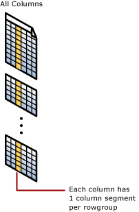
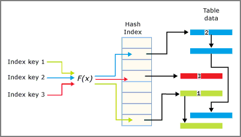
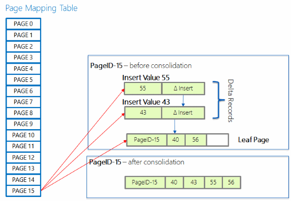
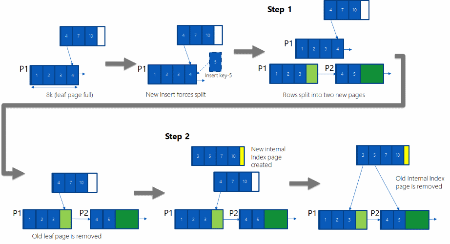
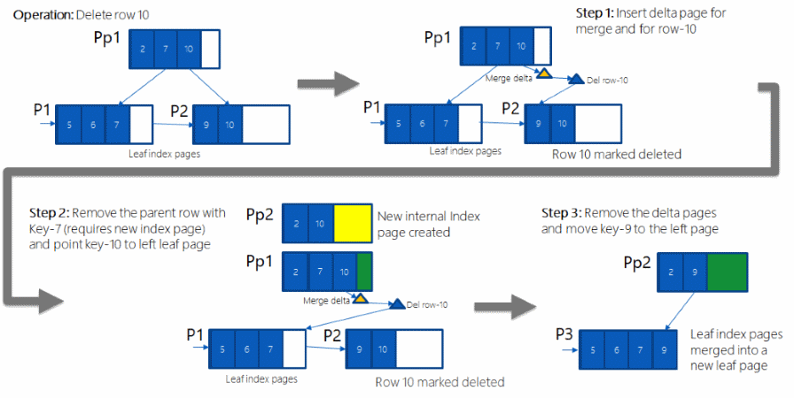

# SQL Server and Azure SQL index architecture and design guide
[!INCLUDE[SQL Server Azure SQL Database Synapse Analytics PDW ](../includes/applies-to-version/sql-asdb-asdbmi-asa-pdw.md)]

Poorly designed indexes and a lack of indexes are primary sources of database application bottlenecks. Designing efficient indexes is paramount to achieving good database and application performance. This index design guide contains information on index architecture, and best practices to help you design effective indexes to meet the needs of your application.

This guide assumes the reader has a general understanding of the index types available. For a general description of index types, see [Index Types](../relational-databases/indexes/indexes.md).  

This guide covers the following types of indexes:

|Primary storage format  | Index type  |
|---------|---------|
|**Disk-based rowstore** |         |
|     | Clustered        |
|     | Nonclustered        |
|     | Unique        |
|     | Filtered        |
|**Columnstore**     |         |
|     | Clustered columnstore        |
|     | Nonclustered columnstore       |
|**Memory-optimized**  |         |
|     | Hash        |
|     | Memory-Optimized nonclustered        |

For information about XML indexes, see [XML Indexes Overview](../relational-databases/xml/xml-indexes-sql-server.md) and [Selective XML Indexes (SXI)](../relational-databases/xml/selective-xml-indexes-sxi.md).

For information about Spatial indexes, see [Spatial Indexes Overview](../relational-databases/spatial/spatial-indexes-overview.md).

For information about Full-text indexes, see [Populate Full-Text Indexes](../relational-databases/search/populate-full-text-indexes.md).
  
##  <a name="Basics"></a> Index design basics
 Think about a regular book: at the end of the book, there is an index that helps to quickly locate information within the book. The index is a sorted list of keywords and next to each keyword is a set of page numbers pointing to the pages where each keyword can be found. 

A rowstore index is no different: it is an ordered list of values and for each value there are pointers to the data [pages](../relational-databases/pages-and-extents-architecture-guide.md) where these values are located. The index itself is stored on pages, referred to as Index Pages. In a regular book, if the index spans multiple pages and you have to find pointers to all the pages that contain the word "SQL" for example, you would have to leaf through until you locate the index page that contains the keyword "SQL". From there, you follow the pointers to all the book pages.  This could be optimized further if at the very beginning of the index, you create a single page that contains an alphabetical list of where each letter can be found. For example: "A through D -  page 121", "E through G - page 122" and so on. This additional page would eliminate the step of leafing through the index to find the starting place. Such a page does not exist in regular books, but it does exist in a rowstore index. This single page is referred to as the root page of the index. The root page is the starting page of the tree structure used by an index. Following the tree analogy, the end pages that contain pointers to the actual data are referred to as "leaf pages" of the tree.

An index is an on-disk or in-memory structure associated with a table or view that speeds retrieval of rows from the table or view. A rowstore index contains keys built from one or more columns in the table or view. For rowstore indexes, these keys are stored in a tree structure (B+ tree) that enables the Database Engine to find the row or rows associated with the key values quickly and efficiently.  

 A rowstore index stores data logically organized as a table with rows and columns, and physically stored in a row-wise data format called *rowstore* <sup>1</sup>, or stored in a column-wise data format called *[columnstore](#columnstore_index)*.  
    
 The selection of the right indexes for a database and its workload is a complex balancing act between query speed and update cost. Narrow disk-based rowstore indexes, or indexes with few columns in the index key, require less disk space and maintenance overhead. Wide indexes, on the other hand, cover more queries. You may have to experiment with several different designs before finding the most efficient index. Indexes can be added, modified, and dropped without affecting the database schema or application design. Therefore, you should not hesitate to experiment with different indexes.  
  
 The database engine's query optimizer reliably chooses the most effective index in the vast majority of cases. Your overall index design strategy should provide a variety of indexes for the query optimizer to choose from and trust it to make the right decision. This reduces analysis time and produces good performance over a variety of situations. To see which indexes the query optimizer uses for a specific query, in [!INCLUDE[ssManStudioFull](../includes/ssmanstudiofull-md.md)], on the **Query** menu, select **Include Actual Execution Plan**.  
  
 Do not always equate index usage with good performance, and good performance with efficient index use. If using an index always helped produce the best performance, the job of the query optimizer would be simple. In reality, an incorrect index choice can cause less than optimal performance. Therefore, the task of the query optimizer is to select an index, or combination of indexes, only when it will improve performance, and to avoid indexed retrieval when it will hinder performance.  

<sup>1</sup> Rowstore has been the traditional way to store relational table data. 'Rowstore' refers to table where the underlying data storage format is a heap, a B+ tree ([clustered index](#Clustered)), or a memory-optimized table. 'Disk-based rowstore' excludes memory-optimized tables.


### Index design tasks  
 The following tasks make up our recommended strategy for designing indexes:  
  
1. Understand the characteristics of the database itself. 
    * For example, is it an online transaction processing (OLTP) database with frequent data modifications that must sustain a high throughput? Memory-optimized tables and indexes are especially appropriate for this scenario, by providing a latch-free design. For more information, see [Indexes for Memory-Optimized Tables](../relational-databases/in-memory-oltp/indexes-for-memory-optimized-tables.md), or [Nonclustered Index for Memory-Optimized Tables Design Guidelines](#inmem_nonclustered_index) and [Hash Index for Memory-Optimized Tables Design Guidelines](#hash_index) in this guide.
    * Or is it an example of a Decision Support System (DSS) or data warehousing (OLAP) database that must process very large data sets quickly? Columnstore indexes are especially appropriate for typical data warehousing data sets. Columnstore indexes can transform the data warehousing experience for users by enabling faster performance for common data warehousing queries such as filtering, aggregating, grouping, and star-join queries. For more information, see [Columnstore Indexes overview](../relational-databases/indexes/columnstore-indexes-overview.md), or [Columnstore Index Design Guidelines](#columnstore_index) in this guide.  

2. Understand the characteristics of the most frequently used queries. For example, knowing that a frequently used query joins two or more tables will help you determine the best type of indexes to use.  
  
3. Understand the characteristics of the columns used in the queries. For example, an index is ideal for columns that have an integer data type and are also unique or nonnull columns. For columns that have well-defined subsets of data, you can use a filtered index in [!INCLUDE[ssKatmai](../includes/sskatmai-md.md)] and higher versions. For more information, see [Filtered Index Design Guidelines](#Filtered) in this guide.  
  
4. Determine which index options might enhance performance when the index is created or maintained. For example, creating a clustered index on an existing large table would benefit from the `ONLINE` index option. The ONLINE option allows for concurrent activity on the underlying data to continue while the index is being created or rebuilt. For more information, see [Set Index Options](../relational-databases/indexes/set-index-options.md).  
  
5. Determine the optimal storage location for the index.

    A nonclustered index can be stored in the same filegroup as the underlying table, or on a different filegroup. The storage location of indexes can improve query performance by increasing disk I/O performance. For example, storing a nonclustered index on a filegroup that is on a different disk than the table filegroup can improve performance because multiple disks can be read at the same time. Alternatively, clustered and nonclustered indexes can use a partition scheme across multiple filegroups. When you consider partitioning, determine whether the index should be aligned, that is, partitioned in essentially the same manner as the table, or partitioned independently. Learn more in the [index placement on filegroups or partitions schemes](#Index_placement) section of this article.
1. When you identify missing indexes with Dynamic Management Views (DMVs) such as [sys.dm_db_missing_index_details](system-dynamic-management-views/sys-dm-db-missing-index-details-transact-sql.md) and [sys.dm_db_missing_index_columns](system-dynamic-management-views/sys-dm-db-missing-index-columns-transact-sql.md), you may be offered similar variations of indexes on the same table and column(s). Examine existing indexes on the table along with missing index suggestions to prevent creating duplicate indexes. Learn more in [tune nonclustered indexes with missing index suggestions](indexes/tune-nonclustered-missing-index-suggestions.md).

##  <a name="General_Design"></a> General index design guidelines  
 Experienced database administrators can design a good set of indexes, but this task is complex, time-consuming, and error-prone even for moderately complex databases and workloads. Understanding the characteristics of your database, queries, and data columns can help you design optimal indexes.  
  
### Database considerations  
 When you design an index, consider the following database guidelines:  
  
-   Large numbers of indexes on a table affect the performance of `INSERT`, `UPDATE`, `DELETE`, and `MERGE` statements because all indexes must be adjusted appropriately as data in the table changes. For example, if a column is used in several indexes and you execute an `UPDATE` statement that modifies that column's data, each index that contains that column must be updated as well as the column in the underlying base table (heap or clustered index).  
  
    -   Avoid over-indexing heavily updated tables and keep indexes narrow, that is, with as few columns as possible.  
  
    -   Use many indexes to improve query performance on tables with low update requirements, but large volumes of data. Large numbers of indexes can help the performance of queries that do not modify data, such as SELECT statements, because the query optimizer has more indexes to choose from to determine the fastest access method.  
  
-   Indexing small tables may not be optimal because it can take the query optimizer longer to traverse the index searching for data than to perform a simple table scan. Therefore, indexes on small tables might never be used, but must still be maintained as data in the table changes.  
  
-   Indexes on views can provide significant performance gains when the view contains aggregations, table joins, or a combination of aggregations and joins. The view does not have to be explicitly referenced in the query for the query optimizer to use it.  
  
-   Databases on primary replicas in Azure SQL Database automatically generate [database advisor performance recommendations](/azure/azure-sql/database/database-advisor-implement-performance-recommendations) for indexes. You can optionally [enable automatic index tuning](/azure/azure-sql/database/automatic-tuning-enable).

- [Query Store helps identify queries with sub-optmial performance](performance/best-practice-with-the-query-store.md#start-with-query-performance-troubleshooting) and provides a history of [query execution plans](performance/execution-plans.md) which document indexes selected by the optimizer.
  
### Query considerations  
 When you design an index, consider the following query guidelines:  
  
-   Create nonclustered indexes on the columns that are frequently used in predicates and join conditions in queries. These are your SARGable<sup>1</sup> columns. However, you should avoid adding unnecessary columns. Adding too many index columns can adversely affect disk space and index maintenance performance.  
  
-   Covering indexes can improve query performance because all the data needed to meet the requirements of the query exists within the index itself. That is, only the index pages, and not the data pages of the table or clustered index, are required to retrieve the requested data; therefore, reducing overall disk I/O. For example, a query of columns `A` and `B` on a table that has a composite index created on columns `A`, `B`, and `C` can retrieve the specified data from the index alone.  

    > [!IMPORTANT]
    > Covering indexes are the designation for a [nonclustered index](#nonclustered-index-architecture) that resolves one or several similar query results directly with no access to its base table, and without incurring in lookups.
    > Such indexes have all the necessary non-[SARGable](#sargable) columns in its leaf level. This means that the columns returned by either the SELECT clause and all the WHERE and JOIN arguments are covered by the index.
    > There is potentially much less I/O to execute the query, if the index is narrow enough when compared to the rows and columns in the table itself, meaning it is a real sub-set of the total columns. 
    > Consider covering indexes when selecting a small portion of a large table, and where that small portion is defined by a fixed predicate, such as [sparse columns](../relational-databases/tables/use-sparse-columns.md) that contain only a few non-NULL values, for example.
    
-   Write queries that insert or modify as many rows as possible in a single statement, instead of using multiple queries to update the same rows. By using only one statement, optimized index maintenance could be exploited.  
  
-   Evaluate the query type and how columns are used in the query. For example, a column used in an exact-match query type would be a good candidate for a nonclustered or clustered index.

<a name="sargable"></a><sup>1</sup> The term SARGable in relational databases refers to a **S**earch **ARG**ument-**able** predicate that can use an index to speed up the execution of the query.
  
### Column considerations  
 When you design an index consider the following column guidelines:  
  
-   Keep the length of the index key short for clustered indexes. Additionally, clustered indexes benefit from being created on unique or nonnull columns.  
  
-   Columns that are of the **ntext**, **text**, **image**, **varchar(max)**, **nvarchar(max)**, and **varbinary(max)** data types cannot be specified as index key columns. However, **varchar(max)**, **nvarchar(max)**, **varbinary(max)**, and **xml** data types can participate in a nonclustered index as nonkey index columns. For more information, see the section ['Index with Included Columns](#Included_Columns)' in this guide.  
  
-   An **xml** data type can only be a key column only in an XML index. For more information, see [XML Indexes](../relational-databases/xml/xml-indexes-sql-server.md). SQL Server 2012 SP1 introduced a new type of XML index known as a Selective XML Index. This new index can improve querying performance over data stored as XML, allow for much faster indexing of large XML data workloads, and improve scalability by reducing storage costs of the index itself. For more information, see [Selective XML Indexes &#40;SXI&#41;](../relational-databases/xml/selective-xml-indexes-sxi.md).  
  
-   Examine column uniqueness. A unique index instead of a nonunique index on the same combination of columns provides additional information for the query optimizer that makes the index more useful. For more information, see [Unique Index Design Guidelines](#Unique) in this guide.  
  
-   Examine data distribution in the column. Frequently, a long-running query is caused by indexing a column with few unique values, or by performing a join on such a column. This is a fundamental problem with the data and query, and generally cannot be resolved without identifying this situation. For example, a physical telephone directory sorted alphabetically on last name will not expedite locating a person if all people in the city are named Smith or Jones. For more information about data distribution, see [Statistics](../relational-databases/statistics/statistics.md).  
  
-   Consider using filtered indexes on columns that have well-defined subsets, for example sparse columns, columns with mostly NULL values, columns with categories of values, and columns with distinct ranges of values. A well-designed filtered index can improve query performance, reduce index maintenance costs, and reduce storage costs.  
  
-   Consider the order of the columns if the index will contain multiple columns. The column that is used in the WHERE clause in an equal to (=), greater than (>), less than (<), or BETWEEN search condition, or participates in a join, should be placed first. Additional columns should be ordered based on their level of distinctness, that is, from the most distinct to the least distinct.  
  
     For example, if the index is defined as `LastName`, `FirstName` the index will be useful when the search criterion is `WHERE LastName = 'Smith'` or `WHERE LastName = Smith AND FirstName LIKE 'J%'`. However, the query optimizer would not use the index for a query that searched only on `FirstName (WHERE FirstName = 'Jane')`.  
  
-   Consider indexing computed columns. For more information, see [Indexes on Computed Columns](../relational-databases/indexes/indexes-on-computed-columns.md).  
  
### Index characteristics  
 After you have determined that an index is appropriate for a query, you can select the type of index that best fits your situation. Index characteristics include the following:  
  
-   Clustered versus nonclustered  
-   Unique versus nonunique  
-   Single column versus multicolumn  
-   Ascending or descending order on the columns in the index  
-   Full-table versus filtered for nonclustered indexes  
-   Columnstore versus rowstore
-   Hash versus nonclustered for Memory-Optimized tables
  
You can also customize the initial storage characteristics of the index to optimize its performance or maintenance by setting an option such as FILLFACTOR. Also, you can determine the index storage location by using filegroups or partition schemes to optimize performance.  
  
###  <a name="Index_placement"></a> Index placement on filegroups or partitions schemes  
 As you develop your index design strategy, you should consider the placement of the indexes on the filegroups associated with the database. Careful selection of the filegroup or partition scheme can improve query performance.  
  
 By default, indexes are stored in the same filegroup as the base table on which the index is created. A nonpartitioned clustered index and the base table always reside in the same filegroup. However, you can do the following:  
  
-   Create nonclustered indexes on a filegroup other than the filegroup of the base table or clustered index.  
-   Partition clustered and nonclustered indexes to span multiple filegroups.  
-   Move a table from one filegroup to another by dropping the clustered index and specifying a new filegroup or partition scheme in the MOVE TO clause of the DROP INDEX statement or by using the CREATE INDEX statement with the DROP_EXISTING clause.  
  
By creating the nonclustered index on a different filegroup, you can achieve performance gains if the filegroups are using different physical drives with their own controllers. Data and index information can then be read in parallel by the multiple disk heads. For example, if `Table_A` on filegroup `f1` and `Index_A` on filegroup `f2` are both being used by the same query, performance gains can be achieved because both filegroups are being fully used without contention. However, if `Table_A` is scanned by the query but `Index_A` is not referenced, only filegroup `f1` is used. This creates no performance gain.  
  
Because you cannot predict what type of access will occur and when it will occur, it could be a better decision to spread your tables and indexes across all filegroups. This would guarantee that all disks are being accessed because all data and indexes are spread evenly across all disks, regardless of which way the data is accessed. This is also a simpler approach for system administrators.  
  
#### Partitions across multiple filegroups  
 You can also consider partitioning disk-based clustered and nonclustered indexes across multiple filegroups. Partitioned indexes are partitioned horizontally, or by row, based on a partition function. The partition function defines how each row is mapped to a set of partitions based on the values of certain columns, called partitioning columns. A partition scheme specifies the mapping of the partitions to a set of filegroups.  
  
 Partitioning an index can provide the following benefits:  
  
-   Provide scalable systems that make large indexes more manageable. OLTP systems, for example, can implement partition-aware applications that deal with large indexes.  
  
-   Make queries run faster and more efficiently. When queries access several partitions of an index, the query optimizer can process individual partitions at the same time and exclude partitions that are not affected by the query.  
  
For more information, see [Partitioned Tables and Indexes](../relational-databases/partitions/partitioned-tables-and-indexes.md).  
  
###  <a name="Sort_Order"></a> Index sort order design guidelines  
 When defining indexes, consider whether the data for the index key column should be stored in ascending or descending order. Ascending is the default and maintains compatibility with earlier versions of the database engine. The syntax of the CREATE INDEX, CREATE TABLE, and ALTER TABLE statements supports the keywords ASC (ascending) and DESC (descending) on individual columns in indexes and constraints.  
  
 Specifying the order in which key values are stored in an index is useful when queries referencing the table have ORDER BY clauses that specify different directions for the key column or columns in that index. In these cases, the index can remove the need for a SORT operator in the query plan; therefore, this makes the query more efficient. For example, the buyers in the [!INCLUDE[ssSampleDBCoFull](../includes/sssampledbcofull-md.md)] purchasing department have to evaluate the quality of products they purchase from vendors. The buyers are most interested in finding products sent by these vendors with a high rejection rate. 

As shown in the following query against the [AdventureWorks sample database](../samples/adventureworks-install-configure.md), retrieving the data to meet this criteria requires the `RejectedQty` column in the `Purchasing.PurchaseOrderDetail` table to be sorted in descending order (large to small) and the `ProductID` column to be sorted in ascending order (small to large).
  
```sql
SELECT RejectedQty, ((RejectedQty/OrderQty)*100) AS RejectionRate,  
    ProductID, DueDate  
FROM Purchasing.PurchaseOrderDetail  
ORDER BY RejectedQty DESC, ProductID ASC;
GO
```  
  
 The following [execution plan](performance/display-an-actual-execution-plan.md) for this query shows that the query optimizer used a SORT operator to return the result set in the order specified by the ORDER BY clause.  
  
 
  
 If a disk-based rowstore index is created with key columns that match those in the ORDER BY clause in the query, the SORT operator can be eliminated in the query plan and the query plan is more efficient.  
  
```sql  
CREATE NONCLUSTERED INDEX IX_PurchaseOrderDetail_RejectedQty  
ON Purchasing.PurchaseOrderDetail  
    (RejectedQty DESC, ProductID ASC, DueDate, OrderQty);
GO
```  
  
 After the query is executed again, the following execution plan shows that the SORT operator has been eliminated and the newly created nonclustered index is used.  
  
 
  
 The [!INCLUDE[ssDE](../includes/ssde-md.md)] can move equally efficiently in either direction. An index defined as `(RejectedQty DESC, ProductID ASC)` can still be used for a query in which the sort direction of the columns in the ORDER BY clause are reversed. For example, a query with the ORDER BY clause `ORDER BY RejectedQty ASC, ProductID DESC` can use the index.  
  
 Sort order can be specified only for the key columns in index. The [sys.index_columns](../relational-databases/system-catalog-views/sys-index-columns-transact-sql.md) catalog view and the INDEXKEY_PROPERTY function report whether an index column is stored in ascending or descending order.

If you are following along with the code examples in the [AdventureWorks sample database](../samples/adventureworks-install-configure.md), you can drop the `IX_PurchaseOrderDetail_RejectedQty` with the following Transact-SQL:
```sql
DROP INDEX IX_PurchaseOrderDetail_RejectedQty  
ON Purchasing.PurchaseOrderDetail;
GO
```

## Metadata  
Use these metadata views to see attributes of indexes. More architectural information is embedded in some of these views.

> [!NOTE]
> For columnstore indexes, all columns are stored in the metadata as included columns. The columnstore index does not have key columns.  

:::row:::
    :::column:::
        [sys.indexes &#40;Transact-SQL&#41;](../relational-databases/system-catalog-views/sys-indexes-transact-sql.md)
    :::column-end:::
    :::column:::
        [sys.index_columns &#40;Transact-SQL&#41;](../relational-databases/system-catalog-views/sys-index-columns-transact-sql.md)
    :::column-end:::
:::row-end:::  
:::row:::
    :::column:::
        [sys.partitions &#40;Transact-SQL&#41;](../relational-databases/system-catalog-views/sys-partitions-transact-sql.md)
    :::column-end:::
    :::column:::
        [sys.internal_partitions &#40;Transact-SQL&#41;](../relational-databases/system-catalog-views/sys-internal-partitions-transact-sql.md)
    :::column-end:::
:::row-end:::
:::row:::
    :::column:::
        [sys.dm_db_index_operational_stats &#40;Transact-SQL&#41;](../relational-databases/system-dynamic-management-views/sys-dm-db-index-operational-stats-transact-sql.md)
    :::column-end:::
    :::column:::
        [sys.dm_db_index_physical_stats &#40;Transact-SQL&#41;](../relational-databases/system-dynamic-management-views/sys-dm-db-index-physical-stats-transact-sql.md)
    :::column-end:::
:::row-end:::  
:::row:::
    :::column:::
        [sys.column_store_segments &#40;Transact-SQL&#41;](../relational-databases/system-catalog-views/sys-column-store-segments-transact-sql.md)
    :::column-end:::
    :::column:::
        [sys.column_store_dictionaries &#40;Transact-SQL&#41;](../relational-databases/system-catalog-views/sys-column-store-dictionaries-transact-sql.md)
    :::column-end:::
:::row-end:::  
:::row:::
    :::column:::
        [sys.column_store_row_groups &#40;Transact-SQL&#41;](../relational-databases/system-catalog-views/sys-column-store-row-groups-transact-sql.md)
    :::column-end:::
    :::column:::
        [sys.dm_db_column_store_row_group_operational_stats &#40;Transact-SQL&#41;](../relational-databases/system-dynamic-management-views/sys-dm-db-column-store-row-group-operational-stats-transact-sql.md)
    :::column-end:::
:::row-end:::
:::row:::
    :::column:::
        [sys.dm_db_column_store_row_group_physical_stats &#40;Transact-SQL&#41;](../relational-databases/system-dynamic-management-views/sys-dm-db-column-store-row-group-physical-stats-transact-sql.md)
    :::column-end:::
    :::column:::
        [sys.dm_column_store_object_pool &#40;Transact-SQL&#41;](../relational-databases/system-dynamic-management-views/sys-dm-column-store-object-pool-transact-sql.md)
    :::column-end:::
:::row-end:::  
:::row:::
    :::column:::
        [sys.dm_db_column_store_row_group_operational_stats &#40;Transact-SQL&#41;](../relational-databases/system-dynamic-management-views/sys-dm-db-column-store-row-group-operational-stats-transact-sql.md)
    :::column-end:::
    :::column:::
        [sys.dm_db_xtp_hash_index_stats &#40;Transact-SQL&#41;](../relational-databases/system-dynamic-management-views/sys-dm-db-xtp-hash-index-stats-transact-sql.md)
    :::column-end:::
:::row-end:::
:::row:::
    :::column:::
        [sys.dm_db_xtp_index_stats &#40;Transact-SQL&#41;](../relational-databases/system-dynamic-management-views/sys-dm-db-xtp-index-stats-transact-sql.md)
    :::column-end:::
    :::column:::
        [sys.dm_db_xtp_object_stats &#40;Transact-SQL&#41;](../relational-databases/system-dynamic-management-views/sys-dm-db-xtp-object-stats-transact-sql.md)
    :::column-end:::
:::row-end:::
:::row:::
    :::column:::
        [sys.dm_db_xtp_nonclustered_index_stats &#40;Transact-SQL&#41;](../relational-databases/system-dynamic-management-views/sys-dm-db-xtp-nonclustered-index-stats-transact-sql.md)
    :::column-end:::
    :::column:::
        [sys.dm_db_xtp_table_memory_stats &#40;Transact-SQL&#41;](../relational-databases/system-dynamic-management-views/sys-dm-db-xtp-table-memory-stats-transact-sql.md)
    :::column-end:::
:::row-end:::
:::row:::
    :::column:::
        [sys.hash_indexes &#40;Transact-SQL&#41;](../relational-databases/system-catalog-views/sys-hash-indexes-transact-sql.md)
    :::column-end:::
    :::column:::
        [sys.memory_optimized_tables_internal_attributes &#40;Transact-SQL&#41;](../relational-databases/system-catalog-views/sys-memory-optimized-tables-internal-attributes-transact-sql.md)
    :::column-end:::
:::row-end:::

##  <a name="Clustered"></a> Clustered index design guidelines  
 Clustered indexes sort and store the data rows in the table based on their key values. There can only be one clustered index per table, because the data rows themselves can only be sorted in one order. With few exceptions, every table should have a clustered index defined on the column, or columns, that offer the following:  
  
-   Can be used for frequently used queries.  
  
-   Provide a high degree of uniqueness.  
  
    > [!NOTE]  
    > When you create a PRIMARY KEY constraint, a unique index on the column, or columns, is automatically created. By default, this index is clustered; however, you can specify a nonclustered index when you create the constraint.  
  
-   Can be used in range queries.  
  
If the clustered index is not created with the `UNIQUE` property, the [!INCLUDE[ssDE](../includes/ssde-md.md)] automatically adds a 4-byte uniqueifier column to the table. When it is required, the [!INCLUDE[ssDE](../includes/ssde-md.md)] automatically adds a uniqueifier value to a row to make each key unique. This column and its values are used internally and cannot be seen or accessed by users.  
  
### Clustered index architecture  
Rowstore indexes are organized as B+ trees. Each page in an index B+ tree is called an index node. The top node of the B+ tree is called the root node. The bottom nodes in the index are called the leaf nodes. Any index levels between the root and the leaf nodes are collectively known as intermediate levels. In a clustered index, the leaf nodes contain the data pages of the underlying table. The root and intermediate level nodes contain index pages holding index rows. Each index row contains a key value and a pointer to either an intermediate level page in the B+ tree, or a data row in the leaf level of the index. The pages in each level of the index are linked in a doubly-linked list.  
  
 Clustered indexes have one row in [sys.partitions](../relational-databases/system-catalog-views/sys-partitions-transact-sql.md), with **index_id** = 1 for each partition used by the index. By default, a clustered index has a single partition. When a clustered index has multiple partitions, each partition has a B+ tree structure that contains the data for that specific partition. For example, if a clustered index has four partitions, there are four B+ tree structures; one in each partition.  
  
 Depending on the data types in the clustered index, each clustered index structure will have one or more allocation units in which to store and manage the data for a specific partition. At a minimum, each clustered index will have one IN_ROW_DATA allocation unit per partition. The clustered index will also have one *LOB_DATA* allocation unit per partition if it contains large object (LOB) columns. It will also have one *ROW_OVERFLOW_DATA* allocation unit per partition if it contains variable length columns that exceed the 8,060-byte row size limit.  
  
 The pages in the data chain and the rows in them are ordered on the value of the clustered index key. All inserts are made at the point where the key value in the inserted row fits in the ordering sequence among existing rows.  
  
 This illustration shows the structure of a clustered index in a single partition.  
 
   
  
### Query considerations  
 Before you create clustered indexes, understand how your data will be accessed. Consider using a clustered index for queries that do the following:  
  
-   Return a range of values by using operators such as `BETWEEN`, >, >=, <, and <=.  
  
     After the row with the first value is found by using the clustered index, rows with subsequent indexed values are guaranteed to be physically adjacent. For example, if a query retrieves records between a range of sales order numbers, a clustered index on the column `SalesOrderNumber` can quickly locate the row that contains the starting sales order number, and then retrieve all successive rows in the table until the last sales order number is reached.  
  
-   Return large result sets.  
  
-   Use `JOIN` clauses; typically these are foreign key columns.  
  
-   Use `ORDER BY` or `GROUP BY` clauses.  
  
     An index on the columns specified in the ORDER BY or GROUP BY clause may remove the need for the [!INCLUDE[ssDE](../includes/ssde-md.md)] to sort the data, because the rows are already sorted. This improves query performance.  
  
### Column considerations  
 Generally, you should define the clustered index key with as few columns as possible. Consider columns that have one or more of the following attributes:  
  
-   Are unique or contain many distinct values  
  
    For example, an employee ID uniquely identifies employees. A clustered index or [PRIMARY KEY](../relational-databases/tables/create-primary-keys.md) constraint on the `EmployeeID` column would improve the performance of queries that search for employee information based on the employee ID number. Alternatively, a clustered index could be created on `LastName`, `FirstName`, `MiddleName` because employee records are frequently grouped and queried in this way, and the combination of these columns would still provide a high degree of difference. 

    > [!TIP]
    > If not specified differently, when creating a [PRIMARY KEY](../relational-databases/tables/create-primary-keys.md) constraint, the database engine creates a [clustered index](#Clustered) to support that constraint.
    > Although a *[uniqueidentifier](../t-sql/data-types/uniqueidentifier-transact-sql.md)* can be used to enforce uniqueness as a PRIMARY KEY, it is not an efficient clustering key.
    > If using a *uniqueidentifier* as PRIMARY KEY, the recommendation is to create it as a nonclustered index, and use another column such as an `IDENTITY` to create the clustered index.   
  
-   Are accessed sequentially  
  
    For example, a product ID uniquely identifies products in the `Production.Product` table in the [!INCLUDE[ssSampleDBobject](../includes/sssampledbobject-md.md)] database. Queries in which a sequential search is specified, such as `WHERE ProductID BETWEEN 980 and 999`, would benefit from a clustered index on `ProductID`. This is because the rows would be stored in sorted order on that key column.  
  
-   Defined as `IDENTITY`.  
  
-   Used frequently to sort the data retrieved from a table.  
  
    It can be a good idea to cluster, that is physically sort, the table on that column to save the cost of a sort operation every time the column is queried.  
  
 Clustered indexes are not a good choice for the following attributes:  
  
-   Columns that undergo frequent changes  
  
    This causes in the whole row to move, because the [!INCLUDE[ssDE](../includes/ssde-md.md)] must keep the data values of a row in physical order. This is an important consideration in high-volume transaction processing systems in which data is typically volatile.  
  
-   Wide keys  
  
    Wide keys are a composite of several columns or several large-size columns. The key values from the clustered index are used by all nonclustered indexes as lookup keys. Any nonclustered indexes defined on the same table will be significantly larger because the nonclustered index entries contain the clustering key and also the key columns defined for that nonclustered index.  
  
##  <a name="Nonclustered"></a> Nonclustered index design guidelines  
 A disk-based rowstore nonclustered index contains the index key values and row locators that point to the storage location of the table data. You can create multiple nonclustered indexes on a table or indexed view. Generally, nonclustered indexes should be designed to improve the performance of frequently used queries that are not covered by the clustered index.  
  
 Similar to the way you use an index in a book, the query optimizer searches for a data value by searching the nonclustered index to find the location of the data value in the table and then retrieves the data directly from that location. This makes nonclustered indexes the optimal choice for exact match queries because the index contains entries describing the exact location in the table of the data values being searched for in the queries. For example, to query the `HumanResources. Employee` table for all employees that report to a specific manager, the query optimizer might use the nonclustered index `IX_Employee_ManagerID`; this has `ManagerID` as its key column. The query optimizer can quickly find all entries in the index that match the specified `ManagerID`. Each index entry points to the exact page and row in the table, or clustered index, in which the corresponding data can be found. After the query optimizer finds all entries in the index, it can go directly to the exact page and row to retrieve the data.  
  
### Nonclustered index architecture  

Disk-based rowstore nonclustered indexes have the same B+ tree structure as clustered indexes, except for the following significant differences:  
  
-   The data rows of the underlying table are not sorted and stored in order based on their nonclustered keys.  
  
-   The leaf level of a nonclustered index is made up of index pages instead of data pages. The index pages on the leaf level of a nonclustered index contain key columns and [included columns](#Included_Columns).
  
The row locators in nonclustered index rows are either a pointer to a row or are a clustered index key for a row, as described in the following:  
  
-   If the table is a heap, which means it does not have a clustered index, the row locator is a pointer to the row. The pointer is built from the file identifier (ID), page number, and number of the row on the page. The whole pointer is known as a Row ID (RID).  
  
-   If the table has a clustered index, or the index is on an indexed view, the row locator is the clustered index key for the row.

Row locators also ensure uniqueness for nonclustered index rows. The following table describes how the database engine adds row locators to nonclustered indexes:

| Table type | Nonclustered index type | Row locator |
|---------|---------|---------|
| **Heap** | | |
| | Non-unique | RID added to key columns  |
| | Unique | RID added to included columns |
| **Unique clustered index** | |  |
| | Non-unique | Clustered index keys added to key columns|
| | Unique | Clustered index keys added to included  columns|
| **Non-unique clustered index** | | |
| | Non-unique | Clustered index keys and uniqueifier (when present) added to key columns|
| | Unique | Clustered index keys and uniqueifier (when present) added to included  columns|

The database engine will never store a given column twice in a nonclustered index. The index key order specified by the user when they create a nonclustered index is always honored: any row locator columns which need to be added to the key of a nonclustered index will be added at the end of the key, following the columns specified in the index definition. Clustered index key-based row locator columns in a nonclustered index can be used by the query optimizer, regardless of whether they were explicitly specified in the index definition. 

The following examples shows how row locators are implemented in nonclustered indexes:

| Clustered index | Nonclustered index definition | Nonclustered index definition with row locators | Explanation | 
|---------|---------|---------|---------|
| Unique clustered index with key columns (`A`, `B`, `C`) | Non-unique nonclustered index with key columns (`B`, `A`) and  included columns (`E`,`G`) | Key columns (`B`, `A`, `C`) and included columns (`E`, `G`) | The nonclustered index is non-unique, so the row locator needs to be present in the index keys. Columns `B` and `A` from the row locator are already present, so only column `c` is added. Column `c` is added to the end of the key column list. |
| Unique clustered index with key column (`A`) | Non-unique nonclustered index with key columns (`B`, `C`) and  included column (`A`) | Key columns (`B`, `C`, `A`) | The nonclustered index is non-unique, so the row locator is added to the key. Column `A` is not already specified as a key column, so it is added to the end of the key column list. Column `A` is now in the key, so there is no need to store it as an included column.  |
| Unique clustered index with key column (`A`,`B`) | Unique nonclustered index with key column (`C`) | Key column (`C`) and included columns (`A`,`B`) | The nonclustered index is unique, so the row locator is added to the included columns.   |


Nonclustered indexes have one row in [sys.partitions](../relational-databases/system-catalog-views/sys-partitions-transact-sql.md) with **index_id** > 1 for each partition used by the index. By default, a nonclustered index has a single partition. When a nonclustered index has multiple partitions, each partition has a B+ tree structure that contains the index rows for that specific partition. For example, if a nonclustered index has four partitions, there are four B+ tree structures, with one in each partition.  
  
Depending on the data types in the nonclustered index, each nonclustered index structure will have one or more allocation units in which to store and manage the data for a specific partition. At a minimum, each nonclustered index will have one *IN_ROW_DATA* allocation unit per partition that stores the index B+ tree pages. The nonclustered index will also have one *LOB_DATA* allocation unit per partition if it contains large object (LOB) columns. Additionally, it will have one *ROW_OVERFLOW_DATA* allocation unit per partition if it contains variable length columns that exceed the 8,060-byte row size limit.  
  
The following illustration shows the structure of a nonclustered index in a single partition.  

  
  

### Database considerations  
 Consider the characteristics of the database when designing nonclustered indexes.  
  
-   Databases or tables with low update requirements, but large volumes of data can benefit from many nonclustered indexes to improve query performance. Consider creating filtered indexes for well-defined subsets of data to improve query performance, reduce index storage costs, and reduce index maintenance costs compared with full-table nonclustered indexes.  
  
     Decision Support System applications and databases that contain primarily read-only data can benefit from many nonclustered indexes. The query optimizer has more indexes to choose from to determine the fastest access method, and the low update characteristics of the database mean index maintenance will not impede performance.  
  
-   Online Transaction Processing (OLTP) applications and databases that contain heavily updated tables should avoid over-indexing. Additionally, indexes should be narrow, that is, with as few columns as possible.  
  
     Large numbers of indexes on a table affect the performance of INSERT, UPDATE, DELETE, and MERGE  statements because all indexes must be adjusted appropriately as data in the table changes.  
  
### Query considerations  
 Before you create nonclustered indexes, you should understand how your data will be accessed. Consider using a nonclustered index for queries that have the following attributes:  
  
-   Use `JOIN` or `GROUP BY` clauses.  
  
     Create multiple nonclustered indexes on columns involved in join and grouping operations, and a clustered index on any foreign key columns.  
  
-   Queries that do not return large result sets.  
  
     Create filtered indexes to cover queries that return a well-defined subset of rows from a large table. 
     
     > [!TIP] 
     > Typically the WHERE clause of the CREATE INDEX statement matches the WHERE clause of a query being covered.  

-   Contain columns frequently involved in search conditions of a query, such as WHERE clause, that return exact matches.  

    > [!TIP]
    > Consider the cost versus benefit when adding new indexes. It may be preferable to consolidate additional query needs into an existing index. For example, consider adding one or two extra leaf level columns to an existing index, if it allows coverage of several critical queries, instead of having one exactly covering index per each critical query.
    
### Column considerations  
 Consider columns that have one or more of these attributes:  
  
-   Cover the query.  
  
     Performance gains are achieved when the index contains all columns in the query. The query optimizer can locate all the column values within the index; table or clustered index data is not accessed resulting in fewer disk I/O operations. Use index with [included columns](#Included_Columns) to add covering columns instead of creating a wide index key.  
  
     If the table has a clustered index, the column or columns defined in the clustered index are automatically added to each nonclustered index on the table. This can produce a covered query without specifying the clustered index columns in the definition of the nonclustered index. For example, if a table has a clustered index on column `C`, a non-unique nonclustered index on columns `B` and `A` will have as its key values columns `B`, `A`, and `C`. Learn more in [nonclustered index architecture](#nonclustered-index-architecture).
      
-   Lots of distinct values, such as a combination of last name and first name, if a clustered index is used for other columns.  
  
     If there are very few distinct values, such as only 1 and 0, most queries will not use the index because a table scan is generally more efficient. For this type of data, consider creating a filtered index on a distinct value that only occurs in a small number of rows. For example, if most of the values are 0, the query optimizer might use a filtered index for the data rows that contain 1.  
  
####  <a name="Included_Columns"></a> Use included columns to extend nonclustered indexes  
 You can extend the functionality of nonclustered indexes by adding nonkey columns to the leaf level of the nonclustered index. By including nonkey columns, you can create nonclustered indexes that cover more queries. This is because the nonkey columns have the following benefits:  
  
-   They can be data types not allowed as index key columns.  
  
-   They are not considered by the database engine when calculating the number of index key columns or index key size.  
  
 An index with included nonkey columns can significantly improve query performance when all columns in the query are included in the index either as key or nonkey columns. Performance gains are achieved because the query optimizer can locate all the column values within the index; table or clustered index data is not accessed resulting in fewer disk I/O operations.  
  
> [!NOTE]  
> When an index contains all the columns referenced by the query it is typically referred to as covering the query.  
  
 While key columns are stored at all levels of the index, nonkey columns are stored only at the leaf level.  
  
##### Using included columns to avoid size limits  
 You can include nonkey columns in a nonclustered index to avoid exceeding the current index size limitations of a maximum of 16 key columns and a maximum index key size of 900 bytes. The [!INCLUDE[ssDE](../includes/ssde-md.md)] does not consider nonkey columns when calculating the number of index key columns or index key size.   
 For example, assume that you want to index the following columns in the `Document` table:  
 *  `Title nvarchar(50)`  
 *  `Revision nchar(5)`  
 *  `FileName nvarchar(400)`  
  
 Because the **nchar** and **nvarchar** data types require 2 bytes for each character, an index that contains these three columns would exceed the 900-byte size limitation by 10 bytes (455 * 2). By using the `INCLUDE` clause of the `CREATE INDEX` statement, the index key could be defined as (`Title, Revision`) and `FileName` defined as a nonkey column. In this way, the index key size would be 110 bytes (55 \* 2), and the index would still contain all the required columns. The following statement creates such an index.  
  
```sql
CREATE INDEX IX_Document_Title   
ON Production.Document (Title, Revision)   
INCLUDE (FileName);
GO   
```

If you are following along with the code examples, you can drop this index using this Transact-SQL statement:

```sql
DROP INDEX IX_Document_Title   
ON Production.Document;
GO
```
  
##### Index with included columns guidelines  
When you design nonclustered indexes with included columns consider the following guidelines:  
  
-   Nonkey columns are defined in the INCLUDE clause of the CREATE INDEX statement.  
  
-   Nonkey columns can only be defined on nonclustered indexes on tables or indexed views.  
  
-   All data types are allowed except **text**, **ntext**, and **image**.  
  
-   Computed columns that are deterministic and either precise or imprecise can be included columns. For more information, see [Indexes on Computed Columns](../relational-databases/indexes/indexes-on-computed-columns.md).  
  
-   As with key columns, computed columns derived from **image**, **ntext**, and **text** data types can be nonkey (included) columns as long as the computed column data type is allowed as a nonkey index column.  
  
-   Column names cannot be specified in both the INCLUDE list and in the key column list.  
  
-   Column names cannot be repeated in the INCLUDE list.  

##### Column size guidelines  
  
-   At least one key column must be defined. The maximum number of nonkey columns is 1023 columns. This is the maximum number of table columns minus 1.  
  
-   Index key columns, excluding nonkeys, must follow the existing index size restrictions of 16 key columns maximum, and a total index key size of 900 bytes.  
  
-   The total size of all nonkey columns is limited only by the size of the columns specified in the INCLUDE clause; for example, **varchar(max)** columns are limited to 2 GB.  
  
##### Column modification guidelines  
 When you modify a table column that has been defined as an included column, the following restrictions apply:  
  
-   Nonkey columns cannot be dropped from the table unless the index is dropped first.  
  
-   Nonkey columns cannot be changed, except to do the following:  
  
    -   Change the nullability of the column from NOT NULL to NULL.  
  
    -   Increase the length of **varchar**, **nvarchar**, or **varbinary** columns.  
  
        > [!NOTE]  
        >  These column modification restrictions also apply to index key columns.  
  
##### Design recommendations  
 Redesign nonclustered indexes with a large index key size so that only columns used for searching and lookups are key columns. Make all other columns that cover the query included nonkey columns. In this way, you will have all columns needed to cover the query, but the index key itself is small and efficient.  
  
 For example, assume that you want to design an index to cover the following query.  
  
```sql
SELECT AddressLine1, AddressLine2, City, StateProvinceID, PostalCode  
FROM Person.Address  
WHERE PostalCode BETWEEN N'98000' AND N'99999';  
GO
```  
  
 To cover the query, each column must be defined in the index. Although you could define all columns as key columns, the key size would be 334 bytes. Because the only column actually used as search criteria is the `PostalCode` column, having a length of 30 bytes, a better index design would define `PostalCode` as the key column and include all other columns as nonkey columns.  
  
 The following statement creates an index with included columns to cover the query.  
  
```sql  
CREATE INDEX IX_Address_PostalCode  
ON Person.Address (PostalCode)  
INCLUDE (AddressLine1, AddressLine2, City, StateProvinceID);  
```  

To validate that the index covers the query, create the index, then [display the estimated execution plan](performance/display-the-estimated-execution-plan.md).

If the execution plan shows only a SELECT operator and an Index Seek operator for the `IX_Address_PostalCode` index, the query has been "covered" by the index.

You can drop the index with the following statement:

```sql
DROP INDEX IX_Address_PostalCode  
ON Person.Address;
GO
```

##### Performance considerations  
 Avoid adding unnecessary columns. Adding too many index columns, key or nonkey, can have the following performance implications:  
  
-   Fewer index rows will fit on a page. This could create I/O increases and reduced cache efficiency.  
  
-   More disk space will be required to store the index. In particular, adding **varchar(max)**, **nvarchar(max)**, **varbinary(max)**, or **xml** data types as nonkey index columns may significantly increase disk space requirements. This is because the column values are copied into the index leaf level. Therefore, they reside in both the index and the base table.  
  
-   Index maintenance may increase the time that it takes to perform modifications, inserts, updates, or deletes, to the underlying table or indexed view.  
  
 You will have to determine whether the gains in query performance outweigh the effect to performance during data modification and in additional disk space requirements.  

##  <a name="Unique"></a> Unique index design guidelines  
 A unique index guarantees that the index key contains no duplicate values and therefore every row in the table is in some way unique. Specifying a unique index makes sense only when uniqueness is a characteristic of the data itself. For example, if you want to make sure that the values in the `NationalIDNumber` column in the `HumanResources.Employee` table are unique, when the primary key is `EmployeeID`, create a UNIQUE constraint on the `NationalIDNumber` column. If the user tries to enter the same value in that column for more than one employee, an error message is displayed and the duplicate value is not entered.  
  
 With multicolumn unique indexes, the index guarantees that each combination of values in the index key is unique. For example, if a unique index is created on a combination of `LastName`, `FirstName`, and `MiddleName` columns, no two rows in the table could have the same combination of values for these columns.  
  
 Both clustered and nonclustered indexes can be unique. If the data in the column is unique, you can create both a unique clustered index and multiple unique nonclustered indexes on the same table.  
  
 The benefits of unique indexes include the following:  
  
-   Data integrity of the defined columns is ensured.  
  
-   Additional information helpful to the query optimizer is provided.  
  
 Creating a PRIMARY KEY or UNIQUE constraint automatically creates a unique index on the specified columns. There are no significant differences between creating a UNIQUE constraint and creating a unique index independent of a constraint. Data validation occurs in the same manner and the query optimizer does not differentiate between a unique index created by a constraint or manually created. However, you should create a UNIQUE or PRIMARY KEY constraint on the column when data integrity is the objective. By doing this the objective of the index will be clear.  
  
### Considerations  
  
-   A unique index, UNIQUE constraint, or PRIMARY KEY constraint cannot be created if duplicate key values exist in the data.  
  
-   If the data is unique and you want uniqueness enforced, creating a unique index instead of a nonunique index on the same combination of columns provides additional information for the query optimizer that can produce more efficient execution plans. Creating a unique index (preferably by creating a UNIQUE constraint) is recommended in this case.  
  
-   A unique nonclustered index can contain included nonkey columns. For more information, see [Index with Included Columns](#Included_Columns).  
 
  
##  <a name="Filtered"></a> Filtered index design guidelines

 A filtered index is an optimized nonclustered index, especially suited to cover queries that select from a well-defined subset of data. It uses a filter predicate to index a portion of rows in the table. A well-designed filtered index can improve query performance, reduce index maintenance costs, and reduce index storage costs compared with full-table indexes.  
  
 Filtered indexes can provide the following advantages over full-table indexes:  
  
-   **Improved query performance and plan quality**  
  
     A well-designed filtered index improves query performance and execution plan quality because it is smaller than a full-table nonclustered index and has filtered statistics. The filtered statistics are more accurate than full-table statistics because they cover only the rows in the filtered index.  
  
-   **Reduced index maintenance costs**  
  
     An index is maintained only when data manipulation language (DML) statements affect the data in the index. A filtered index reduces index maintenance costs compared with a full-table nonclustered index because it is smaller and is only maintained when the data in the index is affected. It is possible to have a large number of filtered indexes, especially when they contain data that is affected infrequently. Similarly, if a filtered index contains only the frequently affected data, the smaller size of the index reduces the cost of updating the statistics.  
  
-   **Reduced index storage costs**  
  
     Creating a filtered index can reduce disk storage for nonclustered indexes when a full-table index is not necessary. You can replace a full-table nonclustered index with multiple filtered indexes without significantly increasing the storage requirements.  
  
 Filtered indexes are useful when columns contain well-defined subsets of data that queries reference in SELECT statements. Examples are:  
  
-   Sparse columns that contain only a few non-NULL values.  
  
-   Heterogeneous columns that contain categories of data.  
  
-   Columns that contain ranges of values such as dollar amounts, time, and dates.  
  
-   Table partitions that are defined by simple comparison logic for column values.  
  
 Reduced maintenance costs for filtered indexes are most noticeable when the number of rows in the index is small compared with a full-table index. If the filtered index includes most of the rows in the table, it could cost more to maintain than a full-table index. In this case, you should use a full-table index instead of a filtered index.  
  
 Filtered indexes are defined on one table and only support simple comparison operators. If you need a filter expression that references multiple tables or has complex logic, you should create a view.  
  
### Design considerations  
 In order to design effective filtered indexes, it is important to understand what queries your application uses and how they relate to subsets of your data. Some examples of data that have well-defined subsets are columns with mostly NULL values, columns with heterogeneous categories of values and columns with distinct ranges of values. The following design considerations give a variety of scenarios for when a filtered index can provide advantages over full-table indexes.  
 
> [!TIP] 
> The nonclustered [columnstore index](#columnstore_index) definition supports using a filtered condition. To minimize the performance impact of adding a columnstore index on an OLTP table, use a filtered condition to create a nonclustered columnstore index on only the cold data of your operational workload. 
  
#### Filtered indexes for subsets of data  
When a column only has a small number of relevant values for queries, you can create a filtered index on the subset of values. For example, when the values in a column are mostly NULL and the query selects only from the non-NULL values, you can create a filtered index for the non-NULL data rows. The resulting index will be smaller and cost less to maintain than a full-table nonclustered index defined on the same key columns.  
  
For example, the [AdventureWorks sample database](../samples/adventureworks-install-configure.md) has a `Production.BillOfMaterials` table with 2679 rows. The `EndDate` column has only 199 rows that contain a non-NULL value and the other 2480 rows contain NULL. The following filtered index would cover queries that return the columns defined in the index and that select only rows with a non-NULL value for `EndDate`.  
  
```sql
CREATE NONCLUSTERED INDEX FIBillOfMaterialsWithEndDate  
    ON Production.BillOfMaterials (ComponentID, StartDate)  
    WHERE EndDate IS NOT NULL;  
GO  
```  
  
The filtered index `FIBillOfMaterialsWithEndDate` is valid for the following query. [Display the estimated execution plan](performance/display-the-estimated-execution-plan.md) to determine if the query optimizer used the filtered index.  
  
```sql  
SELECT ProductAssemblyID, ComponentID, StartDate   
FROM Production.BillOfMaterials  
WHERE EndDate IS NOT NULL   
    AND ComponentID = 5   
    AND StartDate > '20080101';
GO
```

For more information about how to create filtered indexes and how to define the filtered index predicate expression, see [Create Filtered Indexes](../relational-databases/indexes/create-filtered-indexes.md).  
  
#### Filtered indexes for heterogeneous data  
 When a table has heterogeneous data rows, you can create a filtered index for one or more categories of data.  
  
 For example, the products listed in the `Production.Product` table are each assigned to a `ProductSubcategoryID`, which are in turn associated with the product categories Bikes, Components, Clothing, or Accessories. These categories are heterogeneous because their column values in the `Production.Product` table are not closely correlated. For example, the columns `Color`, `ReorderPoint`, `ListPrice`, `Weight`, `Class`, and `Style` have unique characteristics for each product category. Suppose that there are frequent queries for accessories which have subcategories between 27 and 36 inclusive. You can improve the performance of queries for accessories by creating a filtered index on the accessories subcategories as shown in the following example.  
  
```sql
CREATE NONCLUSTERED INDEX FIProductAccessories  
    ON Production.Product (ProductSubcategoryID, ListPrice)   
        Include (Name)  
WHERE ProductSubcategoryID >= 27 AND ProductSubcategoryID <= 36;  
GO
```  
  
 The filtered index `FIProductAccessories` covers the following query because the query results are contained in the index and the query plan does not include a base table lookup. For example, the query predicate expression `ProductSubcategoryID = 33` is a subset of the filtered index predicate `ProductSubcategoryID >= 27` and `ProductSubcategoryID <= 36`, the `ProductSubcategoryID` and `ListPrice` columns in the query predicate are both key columns in the index, and name is stored in the leaf level of the index as an included column.  
  
```sql  
SELECT Name, ProductSubcategoryID, ListPrice  
FROM Production.Product  
WHERE ProductSubcategoryID = 33 AND ListPrice > 25.00;  
GO
```
  
#### Key columns  
 It is a best practice to include a small number of key or included columns in a filtered index definition, and to incorporate only the columns that are necessary for the query optimizer to choose the filtered index for the query execution plan. The query optimizer can choose a filtered index for the query regardless of whether it does or does not cover the query. However, the query optimizer is more likely to choose a filtered index if it covers the query.  
  
 In some cases, a filtered index covers the query without including the columns in the filtered index expression as key or included columns in the filtered index definition. The following guidelines explain when a column in the filtered index expression should be a key or included column in the filtered index definition. The examples refer to the filtered index, `FIBillOfMaterialsWithEndDate` that was created previously.  
  
 A column in the filtered index expression does not need to be a key or included column in the filtered index definition if the filtered index expression is equivalent to the query predicate and the query does not return the column in the filtered index expression with the query results. For example, `FIBillOfMaterialsWithEndDate` covers the following query because the query predicate is equivalent to the filter expression, and `EndDate` is not returned with the query results. `FIBillOfMaterialsWithEndDate` does not need `EndDate` as a key or included column in the filtered index definition.  
  
```sql
SELECT ComponentID, StartDate FROM Production.BillOfMaterials  
WHERE EndDate IS NOT NULL;   
```  
  
 A column in the filtered index expression should be a key or included column in the filtered index definition if the query predicate uses the column in a comparison that is not equivalent to the filtered index expression. For example, `FIBillOfMaterialsWithEndDate` is valid for the following query because it selects a subset of rows from the filtered index. However, it does not cover the following query because `EndDate` is used in the comparison `EndDate > '20040101'`, which is not equivalent to the filtered index expression. The query processor cannot execute this query without looking up the values of `EndDate`. Therefore, `EndDate` should be a key or included column in the filtered index definition.  
  
```sql  
SELECT ComponentID, StartDate FROM Production.BillOfMaterials  
WHERE EndDate > '20040101';   
```  
  
 A column in the filtered index expression should be a key or included column in the filtered index definition if the column is in the query result set. For example, `FIBillOfMaterialsWithEndDate` does not cover the following query because it returns the `EndDate` column in the query results. Therefore, `EndDate` should be a key or included column in the filtered index definition.  
  
```sql  
SELECT ComponentID, StartDate, EndDate FROM Production.BillOfMaterials  
WHERE EndDate IS NOT NULL;  
```  
  
 The clustered index key of the table does not need to be a key or included column in the filtered index definition. The clustered index key is automatically included in all nonclustered indexes, including filtered indexes.  

To drop the `FIBillOfMaterialsWithEndDate` and `FIProductAccessories` indexes, run the following statements:

```sql 
DROP INDEX FIBillOfMaterialsWithEndDate  
    ON Production.BillOfMaterials;
GO
DROP INDEX FIProductAccessories  
    ON Production.Product;
GO
```  
#### Data conversion operators in the filter predicate  
 If the comparison operator specified in the filtered index expression of the filtered index results in an implicit or explicit data conversion, an error will occur if the conversion occurs on the left side of a comparison operator. A solution is to write the filtered index expression with the data conversion operator (CAST or CONVERT) on the right side of the comparison operator.  
  
 The following example creates a table with a variety of data types.  
  
```sql  
CREATE TABLE dbo.TestTable (a int, b varbinary(4)); 
GO
```  
  
 In the following filtered index definition, column `b` is implicitly converted to an integer data type for the purpose of comparing it to the constant 1. This generates error message 10611 because the conversion occurs on the left-hand side of the operator in the filtered predicate.  
  
```sql  
CREATE NONCLUSTERED INDEX TestTabIndex ON dbo.TestTable(a,b)  
WHERE b = 1;
GO
```  
  
 The solution is to convert the constant on the right-hand side to be of the same type as column `b`, as seen in the following example:  
  
```sql  
CREATE INDEX TestTabIndex ON dbo.TestTable(a,b)  
WHERE b = CONVERT(Varbinary(4), 1);
GO
```  
  
 Moving the data conversion from the left side to the right side of a comparison operator might change the meaning of the conversion. In the above example, when the CONVERT operator was added to the right side, the comparison changed from an integer comparison to a **varbinary** comparison.

Drop the objects created in this example by running the following statement:

```sql
DROP TABLE TestTable;
GO
```
  
## <a name="columnstore_index"></a> Columnstore index design guidelines

A *columnstore index* is a technology for storing, retrieving, and managing data by using a columnar data format, called a columnstore. For more information, see [Columnstore Indexes overview](../relational-databases/indexes/columnstore-indexes-overview.md). 

For version information, see [Columnstore indexes - What's new](../relational-databases/indexes/columnstore-indexes-what-s-new.md).

### Columnstore index architecture

Knowing these basics will make it easier to understand other columnstore articles that explain how to use them effectively.

#### Data storage uses columnstore and rowstore compression
When discussing columnstore indexes, we use the terms *rowstore* and *columnstore* to emphasize the format for the data storage. Columnstore indexes use both types of storage.

 

- A **columnstore** is data that is logically organized as a table with rows and columns, and physically stored in a column-wise data format.
  
  A columnstore index physically stores most of the data in columnstore format. In columnstore format, the data is compressed and uncompressed as columns. There is no need to uncompress other values in each row that are not requested by the query. This makes it fast to scan an entire column of a large table. 

- A **rowstore** is data that is logically organized as a table with rows and columns, and then physically stored in a row-wise data format. This has been the traditional way to store relational table data such as a heap or clustered B+ tree index.

  A columnstore index also physically stores some rows in a rowstore format called a deltastore. The deltastore,also called delta rowgroups, is a holding place for rows that are too few in number to qualify for compression into the columnstore. Each delta rowgroup is implemented as a clustered B+ tree index. 

- The **deltastore** is a holding place for rows that are too few in number to be compressed into the columnstore. The deltastore stores the rows in rowstore format. 

For more information about columnstore terms and concepts, see [Columnstore indexes: Overview](../relational-databases/indexes/columnstore-indexes-overview.md).
  
#### Operations are performed on rowgroups and column segments

The columnstore index groups rows into manageable units. Each of these units is called a **rowgroup**. For best performance, the number of rows in a rowgroup is large enough to improve compression rates and small enough to benefit from in-memory operations.

For example, the columnstore index performs these operations on rowgroups:

* Compresses rowgroups into the columnstore. Compression is performed on each column segment within a rowgroup.
* Merges rowgroups during an `ALTER INDEX ... REORGANIZE` operation, including removing deleted data.
* Creates new rowgroups during an `ALTER INDEX ... REBUILD` operation.
* Reports on rowgroup health and fragmentation in the dynamic management views (DMVs).

The deltastore is comprised of one or more rowgroups called **delta rowgroups**. Each delta rowgroup is a clustered B+ tree index that stores small bulk loads and inserts until the rowgroup contains 1,048,576 rows, at which time a process called the **tuple-mover** automatically compresses the closed rowgroup into the columnstore. 

For more information about rowgroup statuses, see [sys.dm_db_column_store_row_group_physical_stats (Transact-SQL)](../relational-databases/system-dynamic-management-views/sys-dm-db-column-store-row-group-physical-stats-transact-sql.md). 

> [!TIP]
> Having too many small rowgroups decreases the columnstore index quality. A reorganize operation will merge smaller rowgroups, following an internal threshold policy that determines how to remove deleted rows and combine the compressed rowgroups. After a merge, the index quality should be improved. 

> [!NOTE]
> Starting with [!INCLUDE[sql-server-2019](../includes/sssql19-md.md)], the tuple-mover is helped by a background merge task that automatically compresses smaller OPEN delta rowgroups that have existed for some time as determined by an internal threshold, or merges COMPRESSED rowgroups from where a large number of rows has been deleted.

Each column has some of its values in each rowgroup. These values are called **column segments**. Each rowgroup contains one column segment for every column in the table. Each column has one column segment in each rowgroup.

 
 
When the columnstore index compresses a rowgroup, it compresses each column segment separately. To uncompress an entire column, the columnstore index only needs to uncompress one column segment from each rowgroup. 

For more information about columnstore terms and concepts, see [Columnstore indexes: Overview](../relational-databases/indexes/columnstore-indexes-overview.md). 

#### Small loads and inserts go to the deltastore
A columnstore index improves columnstore compression and performance by compressing at least 102,400 rows at a time into the columnstore index. To compress rows in bulk, the columnstore index accumulates small loads and inserts in the deltastore. The deltastore operations are handled behind the scenes. To return the correct query results, the clustered columnstore index combines query results from both the columnstore and the deltastore. 

Rows go to the deltastore when they are:
* Inserted with the `INSERT INTO ... VALUES` statement.
* At the end of a bulk load and they number less than 102,400.
* Updated. Each update is implemented as a delete and an insert.

The deltastore also stores a list of IDs for deleted rows that have been marked as deleted but not yet physically deleted from the columnstore. 

For more information about columnstore terms and concepts, see [Columnstore indexes: Overview](../relational-databases/indexes/columnstore-indexes-overview.md). 

#### When delta rowgroups are full, they get compressed into the columnstore

Clustered columnstore indexes collect up to 1,048,576 rows in each delta rowgroup before compressing the rowgroup into the columnstore. This improves the compression of the columnstore index. When a delta rowgroup reaches the maximum number of rows, it transitions from an OPEN to CLOSED state. A background process named the tuple-mover checks for closed row groups. If the process finds a closed rowgroup, it compresses the rowgroup and stores it into the columnstore.  

When a delta rowgroup has been compressed, the existing delta rowgroup transitions into TOMBSTONE state to be removed later by the tuple-mover when there is no reference to it, and the new compressed rowgroup is marked as COMPRESSED. 

For more information about rowgroup statuses, see [sys.dm_db_column_store_row_group_physical_stats (Transact-SQL)](../relational-databases/system-dynamic-management-views/sys-dm-db-column-store-row-group-physical-stats-transact-sql.md). 

You can force delta rowgroups into the columnstore by using [ALTER INDEX](../t-sql/statements/alter-index-transact-sql.md) to rebuild or reorganize the index. Note that if there is memory pressure during compression, the columnstore index might reduce the number of rows in the compressed rowgroup.   

For more information about columnstore terms and concepts, see [Columnstore indexes: Overview](../relational-databases/indexes/columnstore-indexes-overview.md). 

#### Each table partition has its own rowgroups and delta rowgroups

The concept of partitioning is the same in both a clustered index, a heap, and a columnstore index. Partitioning a table divides the table into smaller groups of rows according to a range of column values. It is often used for managing the data. For example, you could create a partition for each year of data, and then use partition switching to archive data to less expensive storage. Partition switching works on columnstore indexes and makes it easy to move a partition of data to another location.

Rowgroups are always defined within a table partition. When a columnstore index is partitioned, each partition has its own compressed rowgroups and delta rowgroups.

> [!TIP]
> Consider using table partitioning if there's a need to remove data from the columnstore. Switching out and truncating partitions that are not needed anymore is an efficient strategy to delete data without generating fragmentation introduced by having smaller rowgroups.

##### Each partition can have multiple delta rowgroups
Each partition can have more than one delta rowgroups. When the columnstore index needs to add data to a delta rowgroup and the delta rowgroup is locked, the columnstore index will try to obtain a lock on a different delta rowgroup. If there are no delta rowgroups available, the columnstore index will create a new delta rowgroup. For example, a table with 10 partitions could easily have 20 or more delta rowgroups. 

#### You can combine columnstore and rowstore indexes on the same table
A nonclustered index contains a copy of part or all of the rows and columns in the underlying table. The index is defined as one or more columns of the table, and has an optional condition that filters the rows. 

You can create an updatable **nonclustered columnstore index on a rowstore table**. The columnstore index stores a copy of the data so you do need extra storage. However, the data in the columnstore index will compress to a smaller size than the rowstore table requires.  By doing this, you can run analytics on the columnstore index and transactions on the rowstore index at the same time. The column store is updated when data changes in the rowstore table, so both indexes are working against the same data.  
  
You can have **one or more nonclustered rowstore indexes on a columnstore index**. By doing this, you can perform efficient table seeks on the underlying columnstore. Other options become available too. For example, you can enforce a primary key constraint by using a UNIQUE constraint on the rowstore table. Since a non-unique value will fail to insert into the rowstore table, the database engine cannot insert the value into the columnstore.  
 
### Performance considerations 

-   The nonclustered columnstore index definition supports using a filtered condition. To minimize the performance impact of adding a columnstore index on an OLTP table, use a filtered condition to create a nonclustered columnstore index on only the cold data of your operational workload. 
  
-   An in-memory table can have one columnstore index. You can create it when the table is created or add it later with [ALTER TABLE &#40;Transact-SQL&#41;](../t-sql/statements/alter-table-transact-sql.md). Before [!INCLUDE[sssql15-md](../includes/sssql16-md.md)], only a disk-based table could have a columnstore index. 

For more information, see [Columnstore indexes - Query performance](../relational-databases/indexes/columnstore-indexes-query-performance.md).

### Design guidance 

-   A rowstore table can have one updateable nonclustered columnstore index. Before [!INCLUDE[ssSQL14](../includes/sssql14-md.md)], the nonclustered columnstore index was read-only.  
 
For more information, see [Columnstore indexes - Design Guidance](../relational-databases/indexes/columnstore-indexes-design-guidance.md).

##  <a name="hash_index"></a> Hash index design guidelines 

All memory-optimized tables must have at least one index, because it is the indexes that connect the rows together. On a memory-optimized table, every index is also memory-optimized. Hash indexes are one of the possible index types in a memory-optimized table. For more information, see [Indexes for Memory-Optimized Tables](../relational-databases/in-memory-oltp/indexes-for-memory-optimized-tables.md).

[!INCLUDE[SQL Server Azure SQL Database Azure SQL Managed Instances ](../includes/applies-to-version/sql-asdb-asdbmi.md)]

### Hash index architecture
A hash index consists of an array of pointers, and each element of the array is called a hash bucket.
- Each bucket is 8 bytes, which are used to store the memory address of a link list of key entries.  
- Each entry is a value for an index key, plus the address of its corresponding row in the underlying memory-optimized table.  
- Each entry points to the next entry in a link list of entries, all chained to the current bucket.  

The number of buckets must be specified at index definition time:
- The lower the ratio of buckets to table rows or to distinct values, the longer the average bucket link list will be.  
- Short link lists perform faster than long link lists.
- The maximum number of buckets in hash indexes is 1,073,741,824.

> [!TIP]
> To determine the right `BUCKET_COUNT` for your data, see [Configuring the hash index bucket count](#configuring_bucket_count).

The hash function is applied to the index key columns and the result of the function determines what bucket that key falls into. Each bucket has a pointer to rows whose hashed key values are mapped to that bucket.

The hashing function used for hash indexes has the following characteristics:
- The database engine has one hash function that is used for all hash indexes.
- The hash function is deterministic. The same input key value is always mapped to the same bucket in the hash index.
- Multiple index keys may be mapped to the same hash bucket.
- The hash function is balanced, meaning that the distribution of index key values over hash buckets typically follows a Poisson or bell curve distribution, not a flat linear distribution.
- Poisson distribution is not an even distribution. Index key values are not evenly distributed in the hash buckets.
- If two index keys are mapped to the same hash bucket, there is a *hash collision*. A large number of hash collisions can have a performance impact on read operations. A realistic goal is for 30% of the buckets contain two different key values.
  
The interplay of the hash index and the buckets is summarized in the following image.  
  
  

### <a name="configuring_bucket_count"></a> Configuring the hash index bucket count
The hash index bucket count is specified at index create time, and can be changed using the `ALTER TABLE...ALTER INDEX REBUILD` syntax.  
  
In most cases the bucket count would ideally be between 1 and 2 times the number of distinct values in the index key.   
You may not always be able to predict how many values a particular index key may have, or will have. Performance is usually still good if the **BUCKET_COUNT** value is within 10 times of the actual number of key values, and overestimating is generally better than underestimating.  
  
Too **few** buckets has the following drawbacks:  
  
- More hash collisions of distinct key values.  
- Each distinct value is forced to share the same bucket with a different distinct value.  
- The average chain length per bucket grows.  
- The longer the bucket chain, the slower the speed of equality lookups in the index.  
  
Too **many** buckets has the following drawbacks:  
  
- Too high a bucket count might result in more empty buckets.  
- Empty buckets impact the performance of full index scans. If those are performed regularly, consider picking a bucket count close to the number of distinct index key values.  
- Empty buckets use memory, though each bucket uses only 8 bytes.  
  
> [!NOTE]
> Adding more buckets does nothing to reduce the chaining together of entries that share a duplicate value. The rate of value duplication is used to decide whether a hash is the appropriate index type, not to calculate the bucket count.  

### Performance considerations  
  
The performance of a hash index is:  
  
- Excellent when the predicate in the `WHERE` clause specifies an **exact** value for each column in the hash index key. A hash index will revert to a scan given an inequality predicate. 
- Poor when the predicate in the `WHERE` clause looks for a **range** of values in the index key.  
- Poor when the predicate in the `WHERE` clause stipulates one specific value for the **first** column of a two column hash index key, but does not specify a value for **other** columns of the key.  

> [!TIP]
> The predicate must include all columns in the hash index key. The hash index requires a key (to hash) to seek into the index. 
> If an index key consists of two columns and the `WHERE` clause only provides the first column, the database engine does not have a complete key to hash. This will result in an index scan query plan.

If a hash index is used and the number of unique index keys is 100 times (or more) than the row count, consider either increasing to a larger bucket count to avoid large row chains, or use a [nonclustered index](#inmem_nonclustered_index) instead.

### <a name="h3-b2-declaration-limitations"></a> Declaration considerations  
A hash index can exist only on a memory-optimized table. It cannot exist on a disk-based table.  
  
A hash index can be declared as:  
  
- UNIQUE, or can default to Non-Unique.  
- NONCLUSTERED, which is the default.   
  
The following is an example of the syntax to create a hash index, outside of the CREATE TABLE statement:  
  
```sql
ALTER TABLE MyTable_memop  
ADD INDEX ix_hash_Column2 UNIQUE  
HASH (Column2) WITH (BUCKET_COUNT = 64);
``` 

### Row versions and garbage collection  
In a memory-optimized table, when a row is affected by an `UPDATE`, the table creates an updated version of the row. During the update transaction, other sessions might be able to read the older version of the row and thereby avoid the performance slowdown associated with a row lock.  
  
The hash index might also have different versions of its entries to accommodate the update.  
  
Later when the older versions are no longer needed, a garbage collection (GC) thread traverses the buckets and their link lists to clean away old entries. The GC thread performs better if the link list chain lengths are short. For more information, see [In-Memory OLTP Garbage Collection](../relational-databases/in-memory-oltp/in-memory-oltp-garbage-collection.md). 

##  <a name="inmem_nonclustered_index"></a> Memory-Optimized nonclustered index design guidelines 

Nonclustered indexes are one of the possible index types in a memory-optimized table. For more information, see [Indexes for Memory-Optimized Tables](../relational-databases/in-memory-oltp/indexes-for-memory-optimized-tables.md).

[!INCLUDE[SQL Server Azure SQL Database Azure SQL Managed Instances ](../includes/applies-to-version/sql-asdb-asdbmi.md)]

### In-memory nonclustered index architecture

In-memory nonclustered indexes are implemented using a data structure called a Bw-tree, originally envisioned and described by Microsoft Research in 2011. A Bw-tree is a lock and latch-free variation of a B-tree. For more details please see [The Bw-tree: A B-tree for New Hardware Platforms](https://www.microsoft.com/research/publication/the-bw-tree-a-b-tree-for-new-hardware/). 

At a very high level the Bw-tree can be understood as a map of pages organized by page ID (PidMap), a facility to allocate and reuse page IDs (PidAlloc) and a set of pages linked in the page map and to each other. These three high level sub-components make up the basic internal structure of a Bw-tree.


The structure is similar to a normal B-tree in the sense that each page has a set of key values that are ordered and there are levels in the index each pointing to a lower level and the leaf levels point to a data row. However there are several differences.

Just like hash indexes, multiple data rows can be linked together (versions). The page pointers between the levels are logical page IDs, which are offsets into a page mapping table, that in turn has the physical address for each page.

There are no in-place updates of index pages. New delta pages are introduced for this purpose.
-  No latching or locking is required for page updates.
-  Index pages are not a fixed size.

The key value in each non-leaf level page depicted is the highest value that the child that it points to contains and each row also contains that page logical page ID. On the leaf-level pages, along with the key value, it contains the physical address of the data row.

Point lookups are similar to B-trees except that because pages are linked in only one direction, the [!INCLUDE[ssDEnoversion](../includes/ssdenoversion-md.md)] follows right page pointers, where each non-leaf pages has the highest value of its child, rather than lowest value as in a B-tree.

If a Leaf-level page has to change, the [!INCLUDE[ssDEnoversion](../includes/ssdenoversion-md.md)] does not modify the page itself. Rather, the [!INCLUDE[ssDEnoversion](../includes/ssdenoversion-md.md)] creates a delta record that describes the change, and appends it to the previous page. Then it also updates the page map table address for that previous page, to the address of the delta record that now becomes the physical address for this page.

There are three different operations that can be required for managing the structure of a Bw-Tree: consolidation, split, and merge.

#### Delta consolidation
A long chain of delta records can eventually degrade search performance as it could mean we are traversing long chains when searching through an index. If a new delta record is added to a chain that already has 16 elements, the changes in the delta records will be consolidated into the referenced index page, and the page will then be rebuilt, including the changes indicated by the new delta record that triggered the consolidation. The newly rebuilt page will have the same page ID but a new memory address. 



#### Split page
An index page in Bw-Tree grows on as-needed basis starting from storing a single row to storing a maximum of 8 KB. Once the index page grows to 8 KB, a new insert of a single row will cause the index page to split. For an internal page, this means when there is no more room to add another key value and pointer, and for a leaf page, it means that the row would be too big to fit on the page once all the delta records are incorporated. The statistics information in the page header for a leaf page keeps track of how much space would be required to consolidate the delta records, and that information is adjusted as each new delta record is added. 

A Split operation is done in two atomic steps. In the picture below, assume a Leaf-page forces a split because a key with value 5 is being inserted, and a non-leaf page exists pointing to the end of the current Leaf-level page (key value 4).



**Step 1:** Allocate two new pages P1 and P2, and split the rows from old P1 page onto these new pages, including the newly inserted row. A new slot in Page Mapping Table is used to store the physical address of page P2. These pages, P1 and P2 are not accessible to any concurrent operations yet. In addition, the logical pointer from P1 to P2 is set. Then, in one atomic step update the Page Mapping Table to change the pointer from old P1 to new P1. 

**Step 2:** The non-leaf page points to P1 but there is no direct pointer from a non-leaf page to P2. P2 is only reachable via P1. To create a pointer from a non-leaf page to P2, allocate a new non-leaf page (internal index page), copy all the rows from old non-leaf page, and add a new row to point to P2. Once this is done, in one atomic step, update the Page Mapping Table to change the pointer from old non-leaf page to new non-leaf page.

#### Merge page
When a `DELETE` operation results in a page having less than 10% of the maximum page size (currently 8 KB), or with a single row on it, that page will be merged with a contiguous page.

When a row is deleted from a page, a delta record for the delete is added. Additionally, a check is made to determine if the index page (non-leaf page) qualifies for Merge. This check verifies if the remaining space after deleting the row will be less than 10% of maximum page size. If it does qualify, the Merge is performed in three atomic steps.

In the picture below, assume a `DELETE` operation will delete the key value 10. 



**Step 1:** A delta page representing key value 10 (blue triangle) is created and its pointer in the non-leaf page Pp1 is set to the new delta page. Additionally a special merge-delta page (green triangle) is created, and it is linked to point to the delta page. At this stage, both pages (delta page and merge-delta page) are not visible to any concurrent transaction. In one atomic step, the pointer to the Leaf-level page P1 in the Page Mapping Table is updated to point to the merge-delta page. After this step, the entry for key value 10 in Pp1 now points to the merge-delta page. 

**Step 2:** The row representing key value 7 in the non-leaf page Pp1 needs to be removed, and the entry for key value 10 updated to point to P1. To do this, a new non-leaf page Pp2 is allocated and all the rows from Pp1 are copied except for the row representing key value 7; then the row for key value 10 is updated to point to page P1. Once this is done, in one atomic step, the Page Mapping Table entry pointing to Pp1 is updated to point to Pp2. Pp1 is no longer reachable. 

**Step 3:** The Leaf-level pages P2 and P1 are merged and the delta pages removed. To do this, a new page P3 is allocated and the rows from P2 and P1 are merged, and the delta page changes are included in the new P3. Then, in one atomic step, the Page Mapping Table entry pointing to page P1 is updated to point to page P3. 

### Performance considerations

The performance of a nonclustered index is better than nonclustered hash indexes when querying a memory-optimized table with inequality predicates.

> [!NOTE]
> A column in a memory-optimized table can be part of both a hash index and a nonclustered index.

> [!TIP]
> When a column in a nonclustered index key columns have many duplicate values, performance can degrade for updates, inserts, and deletes. 
> One way to improve performance in this situation is to add another column to the nonclustered index.

##  <a name="Additional_Reading"></a> Next steps

Learn more about index design and related topics from the following articles:

- [CREATE INDEX &#40;Transact-SQL&#41;](../t-sql/statements/create-index-transact-sql.md)
- [Reorganize and Rebuild Indexes](../relational-databases/indexes/reorganize-and-rebuild-indexes.md)
- [Partitioned Tables and Indexes](../relational-databases/partitions/partitioned-tables-and-indexes.md)
- [Indexes for Memory-Optimized Tables](../relational-databases/in-memory-oltp/indexes-for-memory-optimized-tables.md)
- [Columnstore Indexes overview](../relational-databases/indexes/columnstore-indexes-overview.md)
- [Indexes on Computed Columns](../relational-databases/indexes/indexes-on-computed-columns.md)
- [Tune nonclustered indexes with missing index suggestions](indexes/tune-nonclustered-missing-index-suggestions.md)