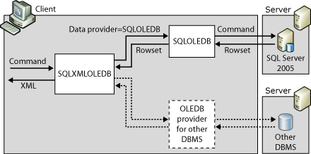

# Architecture of Client-side and Server-side XML Formatting (SQLXML 4.0)
[!INCLUDE [SQL Server Azure SQL Database](../../../includes/applies-to-version/sql-asdb.md)]
  The following illustration shows the architecture of XML formatting on the server side.  
  
   
  
 In this example, the command that is specified on the client is sent to the server. The server produces an XML document and returns it to the client. In this case, the server has an instance of [!INCLUDE[msCoName](../../../includes/msconame-md.md)][!INCLUDE[ssNoVersion](../../../includes/ssnoversion-md.md)]. With server-side XML formatting, you can use either the SQLXMLOLEDB provider or the SQLOLEDB provider.  The SQLXMLOLEDB provider uses Sqlxml4.dll, which is included in SQLXML 4.0. When you use the SQLOLEDB provider, by default you get the SQLXML functionality provided by Sqlxmlx.dll, which is included with [!INCLUDE[msCoName](../../../includes/msconame-md.md)] Windows or in Microsoft Data Access Components (MDAC) 2.6 or later. To use Sqlxml4.dll with SQLOLEDB, you must set the SQLXML Version property to "SQLXML.4.0" on the SQLOLEDB Connection object. In either case, the server produces the XML document and sends it to the client.  
  
> [!NOTE]  
>  XPath queries and updategrams are parsed on the client. To get the XPath template or updategram functionality in SQLXML 4.0, use Sqlxml4.dll.  
  
 The following illustration shows the architecture of XML formatting on the client side.  
  
   
  
 In this example, the client uses the SQLXMLOLEDB provider. In the connection string, the Data Provider property must be set to SQLOLEDB. (This is the only value accepted in SQLXML 4.0.) The command that is executed on the client is sent to the server. The rowset that is generated on the server is sent to the client. The formatting of the XML document from the rowset is performed on the client.  
  
 In SQLXML 4.0, either the [!INCLUDE[ssNoVersion](../../../includes/ssnoversion-md.md)] Native Client (SQLNCLI11) or the SQLOLEDB provider can be used as the data provider. You can potentially access any data source. As long as the query returns a single rowset, the XML transformation can be applied on the client.  
  
> [!IMPORTANT] 
> [!INCLUDE[snac-removed-oledb-and-odbc](../../../includes/snac-removed-oledb-and-odbc.md)]