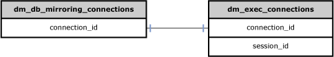

# Database Mirroring - sys.dm_db_mirroring_connections
[!INCLUDE[tsql-appliesto-ss2008-xxxx-xxxx-xxx-md](../../includes/tsql-appliesto-ss2008-xxxx-xxxx-xxx-md.md)]

  Returns a row for each connection established for database mirroring.  
  
|Column name|Data type|Description|  
|-----------------|---------------|-----------------|  
|**connection_id**|**uniqueidentifier**|Identifier of the connection.|  
|**transport_stream_id**|**uniqueidentifier**|Identifier of the [!INCLUDE[ssNoVersion](../../includes/ssnoversion-md.md)] Network Interface (SNI) connection used by this connection for TCP/IP communications.|  
|**state**|**smallint**|Current state of the connection. Possible values:   1 = NEW   2 = CONNECTING   3 = CONNECTED   4 = LOGGED_IN   5 = CLOSED|  
|**state_desc**|**nvarchar(60)**|Current state of the connection. Possible values:   NEW   CONNECTING   CONNECTED   LOGGED_IN   CLOSED|  
|**connect_time**|**datetime**|Date and time at which the connection was opened.|  
|**login_time**|**datetime**|Date and time at which login for the connection succeeded.|  
|**authentication_method**|**nvarchar(128)**|Name of the Windows Authentication method, such as NTLM or KERBEROS. The value comes from Windows.|  
|**principal_name**|**nvarchar(128)**|Name of the login that was validated for connection permissions. For Windows Authentication, this value is the remote user name. For certificate authentication, this value is the certificate owner.|  
|**remote_user_name**|**nvarchar(128)**|Name of the peer user from the other database that is used by Windows Authentication.|  
|**last_activity_time**|**datetime**|Date and time at which the connection was last used to send or receive information.|  
|**is_accept**|**bit**|Indicates whether the connection originated on the remote side.   1 = The connection is a request accepted from the remote instance.   0 = The connection was started by the local instance.|  
|**login_state**|**smallint**|State of the login process for this connection. Possible values:   0 = INITIAL   1 = WAIT LOGIN NEGOTIATE   2 = ONE ISC   3 = ONE ASC   4 = TWO ISC   5 = TWO ASC   6 = WAIT ISC Confirm   7 = WAIT ASC Confirm   8 = WAIT REJECT   9 = WAIT PRE-MASTER SECRET   10 = WAIT VALIDATION   11 = WAIT ARBITRATION   12 = ONLINE   13 = ERROR|  
|**login_state_desc**|**nvarchar(60)**|Current state of login from the remote computer. Possible values:   Connection handshake is initializing.   Connection handshake is waiting for Login Negotiate message.   Connection handshake has initialized and sent security context for authentication.   Connection handshake has received and accepted security context for authentication.   Connection handshake has initialized and sent security context for authentication. There is an optional mechanism available for authenticating the peers.   Connection handshake has received and sent accepted security context for authentication. There is an optional mechanism available for authenticating the peers.   Connection handshake is waiting for Initialize Security Context Confirmation message.   Connection handshake is waiting for Accept Security Context Confirmation message.   Connection handshake is waiting for SSPI rejection message for failed authentication.   Connection handshake is waiting for Pre-Master Secret message.   Connection handshake is waiting for Validation message.   Connection handshake is waiting for Arbitration message.   Connection handshake is complete and is online (ready) for message exchange.   Connection is in error.|  
|**peer_certificate_id**|**int**|The local object ID of the certificate used by the remote instance for authentication. The owner of this certificate must have CONNECT permissions to the database mirroring endpoint.|  
|**encryption_algorithm**|**smallint**|Encryption algorithm that is used for this connection. NULLABLE. Possible values:   **Value:**0   **Description:** None   **DDL Option:** Disabled   **Value:**1   **Description:** RC4   **DDL Option:** {Required &#124; Required algorithm RC4}   **Value:**2   **Description:** AES   **DDL Option:** Required algorithm AES   **Value:**3   **Description:** None, RC4   **DDL Option:** {Supported &#124; Supported algorithm RC4}   **Value:**4   **Description:** none, AES   **DDL Option:** Supported algorithm RC4   **Value:**5   **Description:** RC4, AES   **DDL Option:** Required algorithm RC4 AES   **Value:**6   **Description:** AES, RC4   **DDL Option:** Required Algorithm AES RC4   **Value:**7   **Description:** NONE, RC4, AES   **DDL Option:** Supported Algorithm RC4 AES   **Value:**8   **Description:** NONE, AES, RC4   **DDL Option:** Supported algorithm AES RC4   **Note:** The RC4 algorithm is only supported for backward compatibility. New material can only be encrypted using RC4 or RC4_128 when the database is in compatibility level 90 or 100. (Not recommended.) Use a newer algorithm such as one of the AES algorithms instead. In [!INCLUDE[ssSQL11](../../includes/sssql11-md.md)] and higher versions, material encrypted using RC4 or RC4_128 can be decrypted in any compatibility level.|  
|**encryption_algorithm_desc**|**nvarchar(60)**|Textual representation of the encryption algorithm. NULLABLE. Possible Values:   **Description:** None   **DDL Option:** Disabled   **Description:** RC4   **DDL Option:** {Required &#124; Required Algorithm RC4}   **Description:** AES   **DDL Option:** Required Algorithm AES   **Description:** NONE, RC4   **DDL Option:** {Supported &#124; Supported Algorithm RC4}   **Description:** NONE, AES   **DDL Option:** Supported Algorithm RC4   **Description:** RC4, AES   **DDL Option:** Required Algorithm RC4 AES   **Description:** AES, RC4   **DDL Option:** Required Algorithm AES RC4   **Description:** NONE, RC4, AES   **DDL Option:** Supported Algorithm RC4 AES   **Description:** NONE, AES, RC4   **DDL Option:** Supported Algorithm AES RC4|  
|**receives_posted**|**smallint**|Number of asynchronous network receives that have not yet completed for this connection.|  
|**is_receive_flow_controlled**|**bit**|Whether network receives have been postponed due to flow control because the network is busy.   1 = True|  
|**sends_posted**|**smallint**|The number of asynchronous network sends that have not yet completed for this connection.|  
|**is_send_flow_controlled**|**bit**|Whether network sends have been postponed due to network flow control because the network is busy.   1 = True|  
|**total_bytes_sent**|**bigint**|Total number of bytes sent by this connection.|  
|**total_bytes_received**|**bigint**|Total number of bytes received by this connection.|  
|**total_fragments_sent**|**bigint**|Total number of database mirroring message fragments sent by this connection.|  
|**total_fragments_received**|**bigint**|Total number of database mirroring message fragments received by this connection.|  
|**total_sends**|**bigint**|Total number of network send requests issued by this connection.|  
|**total_receives**|**bigint**|Total number of network receive requests issued by this connection.|  
|**peer_arbitration_id**|**uniqueidentifier**|Internal identifier for the endpoint. NULLABLE.|  
  
## Permissions  
 Requires VIEW SERVER STATE permission on the server.  
  
## Physical Joins  
   
  
## Relationship Cardinalities  
  
|From|To|Relationship|  
|----------|--------|------------------|  
|**dm_db_mirroring_connections.connection_id**|**dm_exec_connections.connection_id**|One-to-one|  
  
## See Also  
 [Dynamic Management Views and Functions &#40;Transact-SQL&#41;](~/relational-databases/system-dynamic-management-views/system-dynamic-management-views.md)   
 [Monitoring Database Mirroring &#40;SQL Server&#41;](../../database-engine/database-mirroring/monitoring-database-mirroring-sql-server.md)  
  
  
