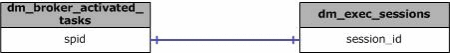

# sys.dm_broker_activated_tasks (Transact-SQL)
[!INCLUDE[tsql-appliesto-ss2008-xxxx-xxxx-xxx-md](../../includes/tsql-appliesto-ss2008-xxxx-xxxx-xxx-md.md)]

  Returns a row for each stored procedure activated by Service Broker.  
 

|Column name|Data type|Description|  
|-----------------|---------------|-----------------|  
|**spid**|**int**|ID of the session of the activated stored procedure. NULLABLE.|  
|**database_id**|**smallint**|ID of the database in which the queue is defined. NULLABLE.|  
|**queue_id**|**int**|ID of the object of the queue for which the stored procedure was activated. NULLABLE.|  
|**procedure_name**|**nvarchar(650)**|Name of the activated stored procedure. NULLABLE.|  
|**execute_as**|**int**|ID of the user that the stored procedure runs as. NULLABLE.|  
  
## Permissions  
 Requires VIEW SERVER STATE permission on the server.  
  
## Physical Joins  
   
  
## Relationship Cardinalities  
  
|From|To|Relationship|  
|----------|--------|------------------|  
|dm_broker_activated_tasks.spid|dm_exec_sessions.session_id|One-to-one|  
  
## See Also  
 [Dynamic Management Views and Functions &#40;Transact-SQL&#41;](~/relational-databases/system-dynamic-management-views/system-dynamic-management-views.md)   
 [Service Broker Related Dynamic Management Views &#40;Transact-SQL&#41;](../../relational-databases/system-dynamic-management-views/service-broker-related-dynamic-management-views-transact-sql.md)  
  
  

