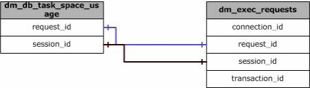

# sys.dm_db_task_space_usage (Transact-SQL)
[!INCLUDE[tsql-appliesto-ss2008-all-md](../../includes/tsql-appliesto-ss2008-all-md.md)]

  Returns page allocation and deallocation activity by task for the database.  
  
> [!NOTE]  
>  This view is applicable only to the [tempdb database](../../relational-databases/databases/tempdb-database.md).  
  
> [!NOTE]  
>  To call this from [!INCLUDE[ssSDWfull](../../includes/sssdwfull-md.md)] or [!INCLUDE[ssPDW](../../includes/sspdw-md.md)], use the name **sys.dm_pdw_nodes_db_task_space_usage**.  
  
|Column name|Data type|Description|  
|-----------------|---------------|-----------------|  
|**session_id**|**smallint**|Session ID.|  
|**request_id**|**int**|Request ID within the session.   A request is also called a batch and may contain one or more queries. A session may have multiple requests active at the same time. Each query in the request may start multiple threads (tasks), if a parallel execution plan is used.|  
|**exec_context_id**|**int**|Execution context ID of the task. For more information, see [sys.dm_os_tasks &#40;Transact-SQL&#41;](../../relational-databases/system-dynamic-management-views/sys-dm-os-tasks-transact-sql.md).|  
|**database_id**|**smallint**|Database ID.|  
|**user_objects_alloc_page_count**|**bigint**|Number of pages reserved or allocated for user objects by this task.|  
|**user_objects_dealloc_page_count**|**bigint**|Number of pages deallocated and no longer reserved for user objects by this task.|  
|**internal_objects_alloc_page_count**|**bigint**|Number of pages reserved or allocated for internal objects by this task.|  
|**internal_objects_dealloc_page_count**|**bigint**|Number of pages deallocated and no longer reserved for internal objects by this task.|  
|**pdw_node_id**|**int**|**Applies to**: [!INCLUDE[ssSDWfull](../../includes/sssdwfull-md.md)], [!INCLUDE[ssPDW](../../includes/sspdw-md.md)]   The identifier for the node that this distribution is on.|  
  
## Permissions

On [!INCLUDE[ssNoVersion_md](../../includes/ssnoversion-md.md)], requires `VIEW SERVER STATE` permission.   
On [!INCLUDE[ssSDS_md](../../includes/sssds-md.md)], requires the `VIEW DATABASE STATE` permission in the database.   

## Remarks  
 IAM pages are not included in any of the page counts reported by this view.  
  
 Page counters are initialized to zero (0) at the start of a request. These values are aggregated at the session level when the request is completed. For more information, see [sys.dm_db_session_space_usage &#40;Transact-SQL&#41;](../../relational-databases/system-dynamic-management-views/sys-dm-db-session-space-usage-transact-sql.md).  
  
 Work table caching, temporary table caching, and deferred drop operations affect the number of pages allocated and deallocated in a specified task.  
  
## User Objects  
 The following objects are included in the user object page counters:  
  
-   User-defined tables and indexes  
  
-   System tables and indexes  
  
-   Global temporary tables and indexes  
  
-   Local temporary tables and indexes  
  
-   Table variables  
  
-   Tables returned in the table-valued functions  
  
## Internal Objects  
 Internal objects are only in **tempdb**. The following objects are included in the internal object page counters:  
  
-   Work tables for cursor or spool operations and temporary large object (LOB) storage  
  
-   Work files for operations such as a hash join  
  
-   Sort runs  
  
## Physical Joins  
   
  
## Relationship Cardinalities  
  
|From|To|Relationship|  
|----------|--------|------------------|  
|dm_db_task_space_usage.request_id|dm_exec_requests.request_id|One-to-one|  
|dm_db_task_space_usage.session_id|dm_exec_requests.session_id|One-to-one|  
  
## See Also  
 [Dynamic Management Views and Functions &#40;Transact-SQL&#41;](~/relational-databases/system-dynamic-management-views/system-dynamic-management-views.md)   
 [Database Related Dynamic Management Views &#40;Transact-SQL&#41;](../../relational-databases/system-dynamic-management-views/database-related-dynamic-management-views-transact-sql.md)   
 [sys.dm_exec_sessions &#40;Transact-SQL&#41;](../../relational-databases/system-dynamic-management-views/sys-dm-exec-sessions-transact-sql.md)   
 [sys.dm_exec_requests &#40;Transact-SQL&#41;](../../relational-databases/system-dynamic-management-views/sys-dm-exec-requests-transact-sql.md)   
 [sys.dm_os_tasks &#40;Transact-SQL&#41;](../../relational-databases/system-dynamic-management-views/sys-dm-os-tasks-transact-sql.md)   
 [sys.dm_db_session_space_usage &#40;Transact-SQL&#41;](../../relational-databases/system-dynamic-management-views/sys-dm-db-session-space-usage-transact-sql.md)   
 [sys.dm_db_file_space_usage &#40;Transact-SQL&#41;](../../relational-databases/system-dynamic-management-views/sys-dm-db-file-space-usage-transact-sql.md)  
  
  

