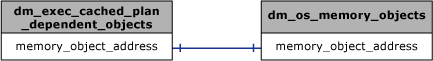

# sys.dm_exec_cached_plan_dependent_objects (Transact-SQL)
[!INCLUDE[tsql-appliesto-ss2008-asdb-xxxx-xxx-md](../../includes/tsql-appliesto-ss2008-asdb-xxxx-xxx-md.md)]

  Returns a row for each [!INCLUDE[tsql](../../includes/tsql-md.md)] execution plan, common language runtime (CLR) execution plan, and cursor associated with a plan.  
  
## Syntax  
  
```  
sys.dm_exec_cached_plan_dependent_objects(plan_handle)  
```  
  
## Arguments  
*plan_handle*  
Is a token that uniquely identifies a query execution plan for a batch that has executed and its plan resides in the plan cache. *plan_handle* is **varbinary(64)**.   

The *plan_handle* can be obtained from the following dynamic management objects:  
  
-   [sys.dm_exec_cached_plans &#40;Transact-SQL&#41;](../../relational-databases/system-dynamic-management-views/sys-dm-exec-cached-plans-transact-sql.md)  
  
-   [sys.dm_exec_query_stats &#40;Transact-SQL&#41;](../../relational-databases/system-dynamic-management-views/sys-dm-exec-query-stats-transact-sql.md)  
  
-   [sys.dm_exec_requests &#40;Transact-SQL&#41;](../../relational-databases/system-dynamic-management-views/sys-dm-exec-requests-transact-sql.md)  

-   [sys.dm_exec_procedure_stats &#40;Transact-SQL&#41;](../../relational-databases/system-dynamic-management-views/sys-dm-exec-procedure-stats-transact-sql.md)  

-   [sys.dm_exec_trigger_stats &#40;Transact-SQL&#41;](../../relational-databases/system-dynamic-management-views/sys-dm-exec-trigger-stats-transact-sql.md)  
  
## Table Returned  
  
|Column name|Data type|Description|  
|-----------------|---------------|-----------------|  
|**usecounts**|**int**|Number of times the execution context or cursor has been used.<br /><br /> Column is not nullable.|  
|**memory_object_address**|**varbinary(8)**|Memory address of the execution context or cursor.<br /><br /> Column is not nullable.|  
|**cacheobjtype**|**nvarchar(50)**|The Plan cache object type. Column is not nullable. Possible values are<br /><br /> Executable plan<br /><br /> CLR compiled function<br /><br /> CLR compiled procedure<br /><br /> Cursor|  
  
## Permissions  
 Requires `VIEW SERVER STATE` permission on the server.  
  
## Physical Joins  
   
  
## Relationship Cardinalities  
  
|From|To|On|Relationship|  
|----------|--------|--------|------------------|  
|**dm_exec_cached_plan_dependent_objects**|**dm_os_memory_objects**|**memory_object_address**|One-to-one|  
  
## See Also  
 [Execution Related Dynamic Management Views and Functions &#40;Transact-SQL&#41;](../../relational-databases/system-dynamic-management-views/execution-related-dynamic-management-views-and-functions-transact-sql.md)   
 [Dynamic Management Views and Functions &#40;Transact-SQL&#41;](~/relational-databases/system-dynamic-management-views/system-dynamic-management-views.md)   
 [sys.syscacheobjects &#40;Transact-SQL&#41;](../../relational-databases/system-compatibility-views/sys-syscacheobjects-transact-sql.md)  
  
  
