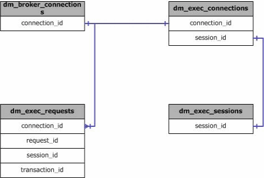

# sys.dm_exec_connections (Transact-SQL)
[!INCLUDE[tsql-appliesto-ss2008-asdb-xxxx-xxx-md](../../includes/tsql-appliesto-ss2008-asdb-xxxx-xxx-md.md)]

  Returns information about the connections established to this instance of [!INCLUDE[ssNoVersion](../../includes/ssnoversion-md.md)] and the details of each connection. Returns server wide connection information for SQL Server. Returns current database connection information for SQL Database.  
  
> [!NOTE]
> To call this from [!INCLUDE[ssSDWfull](../../includes/sssdwfull-md.md)] or [!INCLUDE[ssPDW](../../includes/sspdw-md.md)], use [sys.dm_pdw_exec_connections &#40;Transact-SQL&#41;](../../relational-databases/system-dynamic-management-views/sys-dm-pdw-exec-connections-transact-sql.md).  
  
|Column name|Data type|Description|  
|-----------------|---------------|-----------------|  
|session_id|**int**|Identifies the session associated with this connection. Is nullable.|  
|most_recent_session_id|**int**|Represents the session ID for the most recent request associated with this connection. (SOAP connections can be reused by another session.) Is nullable.|  
|connect_time|**datetime**|Timestamp when connection was established. Is not nullable.|  
|net_transport|**nvarchar(40)**|Always returns **Session** when a connection has multiple active result sets (MARS) enabled.<br /><br /> **Note:** Describes the physical transport protocol that is used by this connection. Is not nullable.|  
|protocol_type|**nvarchar(40)**|Specifies the protocol type of the payload. It currently distinguishes between TDS (TSQL) and SOAP. Is nullable.|  
|protocol_version|**int**|Version of the data access protocol associated with this connection. Is nullable.|  
|endpoint_id|**int**|An identifier that describes what type of connection it is. This endpoint_id can be used to query the sys.endpoints view. Is nullable.|  
|encrypt_option|**nvarchar(40)**|Boolean value to describe whether encryption is enabled for this connection. Is not nullable.|  
|auth_scheme|**nvarchar(40)**|Specifies [!INCLUDE[ssNoVersion](../../includes/ssnoversion-md.md)]/Windows Authentication scheme used with this connection. Is not nullable.|  
|node_affinity|**smallint**|Identifies the memory node to which this connection has affinity. Is not nullable.|  
|num_reads|**int**|Number of byte reads that have occurred over this connection. Is nullable.|  
|num_writes|**int**|Number of byte writes that have occurred over this connection. Is nullable.|  
|last_read|**datetime**|Timestamp when last read occurred over this connection. Is nullable.|  
|last_write|**datetime**|Timestamp when last write occurred over this connection. Not Is nullable.|  
|net_packet_size|**int**|Network packet size used for information and data transfer. Is nullable.|  
|client_net_address|**varchar(48)**|Host address of the client connecting to this server. Is nullable.<br /><br /> Prior to V12 in [!INCLUDE[ssSDSfull](../../includes/sssdsfull-md.md)], this column always returns NULL.|  
|client_tcp_port|**int**|Port number on the client computer that is associated with this connection. Is nullable.<br /><br /> In [!INCLUDE[ssSDSfull](../../includes/sssdsfull-md.md)], this column always returns NULL.|  
|local_net_address|**varchar(48)**|Represents the IP address on the server that this connection targeted. Available only for connections using the TCP transport provider. Is nullable.<br /><br /> In [!INCLUDE[ssSDSfull](../../includes/sssdsfull-md.md)], this column always returns NULL.|  
|local_tcp_port|**int**|Represents the server TCP port that this connection targeted if it were a connection using the TCP transport. Is nullable.<br /><br /> In [!INCLUDE[ssSDSfull](../../includes/sssdsfull-md.md)], this column always returns NULL.|  
|connection_id|**uniqueidentifier**|Identifies each connection uniquely. Is not nullable.|  
|parent_connection_id|**uniqueidentifier**|Identifies the primary connection that the MARS session is using. Is nullable.|  
|most_recent_sql_handle|**varbinary(64)**|The SQL handle of the last request executed on this connection. The most_recent_sql_handle column is always in sync with the most_recent_session_id column. Is nullable.|  
|pdw_node_id|**int**|**Applies to**: [!INCLUDE[ssSDWfull](../../includes/sssdwfull-md.md)], [!INCLUDE[ssPDW](../../includes/sspdw-md.md)]<br /><br /> The identifier for the node that this distribution is on.|  
  
## Permissions

On [!INCLUDE[ssNoVersion_md](../../includes/ssnoversion-md.md)], requires `VIEW SERVER STATE` permission.   
On [!INCLUDE[ssSDS_md](../../includes/sssds-md.md)], requires the `VIEW DATABASE STATE` permission in the database.   

## Physical Joins  
   
  
## Relationship Cardinalities  
  
||||  
|-|-|-|  
|dm_exec_sessions.session_id|dm_exec_connections.session_id|One-to-one|  
|dm_exec_requests.connection_id|dm_exec_connections.connection_id|Many to one|  
|dm_broker_connections.connection_id|dm_exec_connections.connection_id|One to one|  
  
## Examples  
 Typical query to gather information about a queries own connection.  
  
```sql  
SELECT   
    c.session_id, c.net_transport, c.encrypt_option,   
    c.auth_scheme, s.host_name, s.program_name,   
    s.client_interface_name, s.login_name, s.nt_domain,   
    s.nt_user_name, s.original_login_name, c.connect_time,   
    s.login_time   
FROM sys.dm_exec_connections AS c  
JOIN sys.dm_exec_sessions AS s  
    ON c.session_id = s.session_id  
WHERE c.session_id = @@SPID;  
```  
  
## See Also  

 [Execution Related Dynamic Management Views and Functions &#40;Transact-SQL&#41;](../../relational-databases/system-dynamic-management-views/execution-related-dynamic-management-views-and-functions-transact-sql.md)  
  
  


