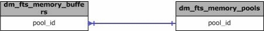

# sys.dm_fts_memory_pools (Transact-SQL)
[!INCLUDE[tsql-appliesto-ss2008-asdb-xxxx-xxx-md](../../includes/tsql-appliesto-ss2008-asdb-xxxx-xxx-md.md)]

  Returns information about the shared memory pools available to the Full-Text Gatherer component for a full-text crawl or a full-text crawl range.  
   
|Column name|Data type|Description|  
|-----------------|---------------|-----------------|  
|**pool_id**|**int**|ID of the allocated memory pool.<br /><br /> 0 = Small buffers<br /><br /> 1 = Large buffers|  
|**buffer_size**|**int**|Size of each allocated buffer in the memory pool.|  
|**min_buffer_limit**|**int**|Minimum number of buffers allowed in the memory pool.|  
|**max_buffer_limit**|**int**|Maximum number of buffers allowed in the memory pool.|  
|**buffer_count**|**int**|Current number of shared memory buffers in the memory pool.|  
  
## Permissions  

On [!INCLUDE[ssNoVersion_md](../../includes/ssnoversion-md.md)], requires `VIEW SERVER STATE` permission.   
On [!INCLUDE[ssSDS_md](../../includes/sssds-md.md)], requires the `VIEW DATABASE STATE` permission in the database.   
 
## Physical Joins  
   
  
## Relationship Cardinalities  
  
|From|To|Relationship|  
|----------|--------|------------------|  
|dm_fts_memory_buffers.pool_id|dm_fts_memory_pools.pool_id|Many-to-one|  
  
## Examples  
 The following example returns the total shared memory owned by the [!INCLUDE[msCoName](../../includes/msconame-md.md)] Full-Text Gatherer component of the [!INCLUDE[ssNoVersion](../../includes/ssnoversion-md.md)] process:  
  
```  
SELECT SUM(buffer_size * buffer_count) AS "total memory"   
    FROM sys.dm_fts_memory_pools;  
```  
  
## See Also  
 [Full-Text Search and Semantic Search Dynamic Management Views and Functions &#40;Transact-SQL&#41;](../../relational-databases/system-dynamic-management-views/full-text-and-semantic-search-dynamic-management-views-functions.md)  
  
  
