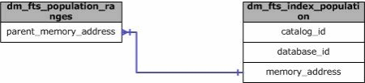

# sys.dm_fts_population_ranges (Transact-SQL)
[!INCLUDE[tsql-appliesto-ss2008-asdb-xxxx-xxx-md](../../includes/tsql-appliesto-ss2008-asdb-xxxx-xxx-md.md)]

  Returns information about the specific ranges related to a full-text index population currently in progress.  
   
|Column name|Data type|Description|  
|-----------------|---------------|-----------------|  
|**memory_address**|**varbinary(8)**|Address of memory buffers allocated for activity related to this subrange of a full-text index population.|  
|**parent_memory_address**|**varbinary(8)**|Address of memory buffers representing the parent object of all ranges of population related to a full-text index.|  
|**is_retry**|**bit**|If the value is 1, this subrange is responsible for retrying rows that encountered errors.|  
|**session_id**|**smallint**|ID of the session that is currently processing this task.|  
|**processed_row_count**|**int**|Number of rows that have been processed by this range. Forward progress is persisted and counted every 5 minutes, rather than with every batch commit.|  
|**error_count**|**int**|Number of rows that have encountered errors by this range. Forward progress is persisted and counted every 5 minutes, rather than with every batch commit.|  
  
## Permissions  

On [!INCLUDE[ssNoVersion_md](../../includes/ssnoversion-md.md)], requires `VIEW SERVER STATE` permission.   
On [!INCLUDE[ssSDS_md](../../includes/sssds-md.md)], requires the `VIEW DATABASE STATE` permission in the database.   
 
## Physical Joins  
   
  
## Relationship Cardinalities  
  
|From|To|Relationship|  
|----------|--------|------------------|  
|dm_fts_population_ranges.parent_memory_address|dm_fts_index_population.memory_address|Many-to-one|  
  
## See Also  
  [Full-Text Search and Semantic Search Dynamic Management Views and Functions &#40;Transact-SQL&#41;](../../relational-databases/system-dynamic-management-views/full-text-and-semantic-search-dynamic-management-views-functions.md)  
  
  

