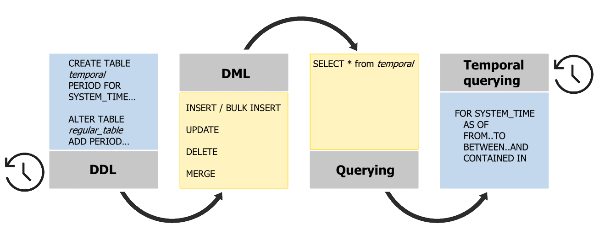

# Getting Started with System-Versioned Temporal Tables
[!INCLUDE[tsql-appliesto-ss2016-asdb-xxxx-xxx-md](../../includes/tsql-appliesto-ss2016-asdb-xxxx-xxx-md.md)]

  Depending on your scenario, you can either create new system-versioned temporal tables or modify existing ones by adding temporal attributes to the existing table schema.   
When the data in temporal table is modified, the system builds version history transparently to applications and end users. As a result, working with system-versioned temporal tables does not require any change to the way table is modified or how the latest (actual) state of the data is queried.   
In addition to regular DML and querying, temporal also provides convenient and easy ways to get insights from data history through extended Transact-SQL syntax.   
Every system-versioned table has a history table assigned but it is completely transparent for the users unless they want to optimize workload performance or storage footprint by creating additional indexes or choosing different storage options.    
The following diagram depicts typical workflow with  system-versioned temporal tables:   
  
  
 This topic is divided into the following 5 subtopics:  
  
-   [Creating a System-Versioned Temporal Table](../../relational-databases/tables/creating-a-system-versioned-temporal-table.md)  
  
-   [Modifying Data in a System-Versioned Temporal Table](../../relational-databases/tables/modifying-data-in-a-system-versioned-temporal-table.md)  
  
-   [Querying Data in a System-Versioned Temporal Table](../../relational-databases/tables/querying-data-in-a-system-versioned-temporal-table.md)  
  
-   [Changing the Schema of a System-Versioned Temporal Table](../../relational-databases/tables/changing-the-schema-of-a-system-versioned-temporal-table.md)  
  
-   [Stopping System-Versioning on a System-Versioned Temporal Table](../../relational-databases/tables/stopping-system-versioning-on-a-system-versioned-temporal-table.md)  
  
## See Also  
 [Temporal Tables](../../relational-databases/tables/temporal-tables.md)   
 [Temporal Table System Consistency Checks](../../relational-databases/tables/temporal-table-system-consistency-checks.md)   
 [Partitioning with Temporal Tables](../../relational-databases/tables/partitioning-with-temporal-tables.md)   
 [Temporal Table Considerations and Limitations](../../relational-databases/tables/temporal-table-considerations-and-limitations.md)   
 [Temporal Table Security](../../relational-databases/tables/temporal-table-security.md)   
 [Manage Retention of Historical Data in System-Versioned Temporal Tables](../../relational-databases/tables/manage-retention-of-historical-data-in-system-versioned-temporal-tables.md)   
 [System-Versioned Temporal Tables with Memory-Optimized Tables](../../relational-databases/tables/system-versioned-temporal-tables-with-memory-optimized-tables.md)   
 [Temporal Table Metadata Views and Functions](../../relational-databases/tables/temporal-table-metadata-views-and-functions.md)  
  
  
