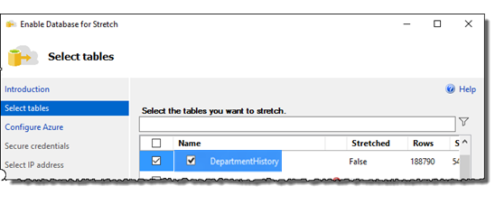
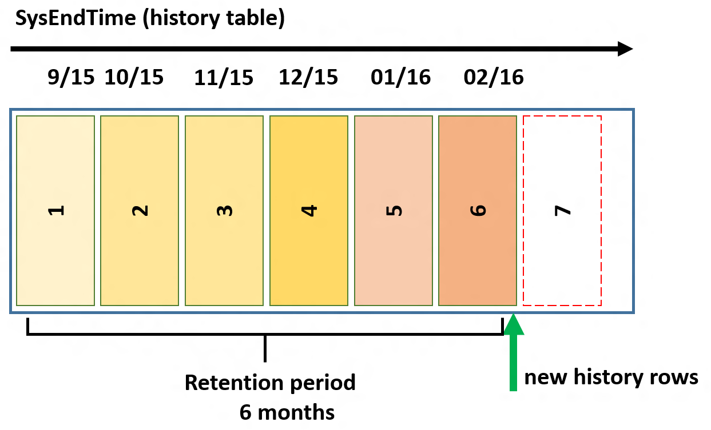
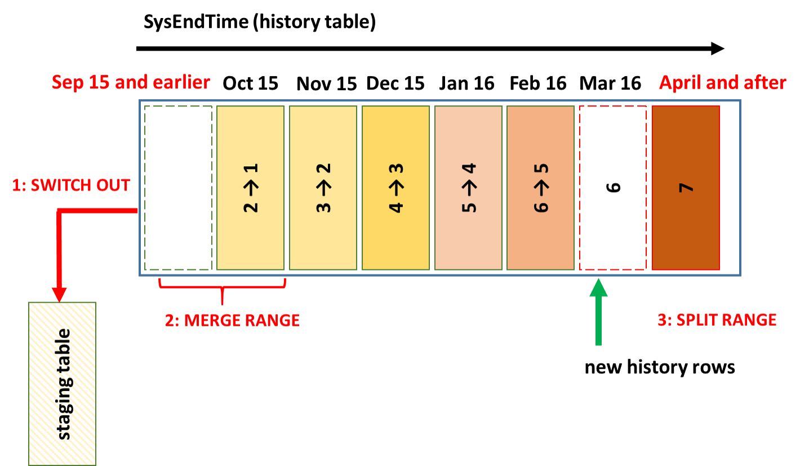
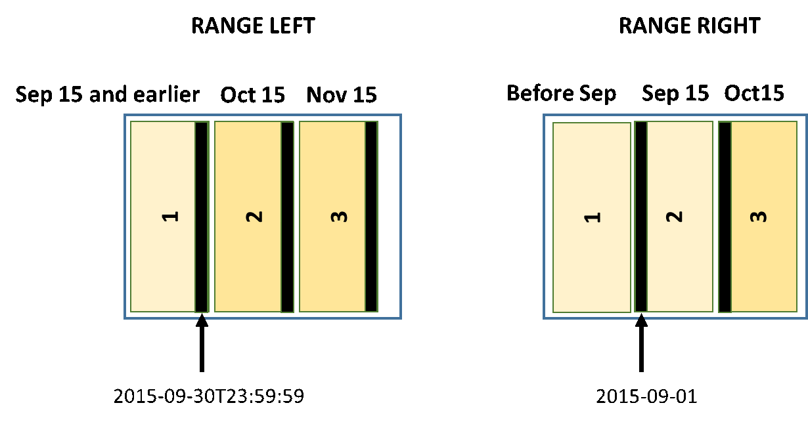
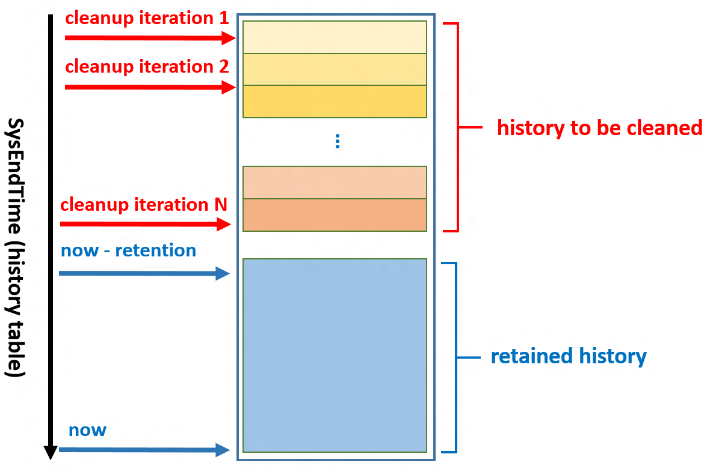

# Manage Retention of Historical Data in System-Versioned Temporal Tables
[!INCLUDE[tsql-appliesto-ss2016-asdb-xxxx-xxx-md](../../includes/tsql-appliesto-ss2016-asdb-xxxx-xxx-md.md)]

  With system-versioned temporal tables, the history table may increase database size more than regular tables, particularly under the following conditions:  
  
-   You retain historical data for a long period of time  
  
-   You have an update or delete heavy data modification pattern  
  
 A large and ever-growing history table can become an issue both due to pure storage costs as well as imposing a performance tax on temporal querying. Hence, developing a data retention policy for managing data in the history table is an important aspect of planning and managing the lifecycle of every temporal table.  
  
## Data retention management for history table  
 Managing temporal table data retention begins with determining the required retention period for each temporal table. Your retention policy, in most cases, should be considered to be part of the business logic of the application using the temporal tables. For example,  applications in data audit and time travel scenarios have firm requirements in terms of for how long historical data must be available for online querying.  
  
 Once you determine your data retention period, your next step is to develop a plan for managing historical data how and where you store your historical data and how to delete historical data that is older than your retention requirements. The following four approaches for managing historical data in the temporal history table are available:  
  
-   [Stretch Database](https://msdn.microsoft.com/library/mt637341.aspx#using-stretch-database-approach)  
  
-   [Table Partitioning](https://msdn.microsoft.com/library/mt637341.aspx#using-table-partitioning-approach)  
  
-   [Custom Cleanup Script](https://msdn.microsoft.com/library/mt637341.aspx#using-custom-cleanup-script-approach)  

-   [Retention Policy](https://msdn.microsoft.com/library/mt637341.aspx#using-temporal-history-retention-policy-approach)  

 With each of these approaches, the logic for migrating or cleaning history data is based on the column that corresponds to end of period in the current table. The end of period value for each row determines the moment when the row version becomes "closed", i.e. when it lands in the history table. For example, the condition `SysEndTime < DATEADD (DAYS, -30, SYSUTCDATETIME ())` specifies that historical data older than one month needs to be removed or moved out from the history table.  
  
> **NOTE:**  The examples in this topic use this [Temporal Table example](creating-a-system-versioned-temporal-table.md).  
  
## Using Stretch Database approach  
  
> **NOTE:**  Using the Stretch Database approach only applies to [!INCLUDE[ssCurrent](../../includes/sscurrent-md.md)] and does not apply to [!INCLUDE[sqldbesa](../../includes/sqldbesa-md.md)].  
  
 [Stretch Database](../../sql-server/stretch-database/stretch-database.md) in [!INCLUDE[ssCurrent](../../includes/sscurrent-md.md)] migrates your historical data transparently to Azure. For additional security, you can encrypt data in motion using SQL Server's [Always Encrypted](https://msdn.microsoft.com/library/mt163865.aspx) feature. Additionally, you can use [Row-Level Security](../../relational-databases/security/row-level-security.md) and other advanced SQL Server security features with Temporal and Stretch Database to protect your data.  
  
 Using the Stretch Database approach, you can stretch some or all of your temporal history tables to Azure and SQL Server will silently move historical data to Azure. Stretch-enabling a history table does not change how you interact with the temporal table in terms of data modification and temporal querying.  
  
-   **Stretch the entire history table:** Configure Stretch Database for your entire history table if your main scenario is data audit in the environment with frequent data changes and relatively rare querying on historical data.  In other words, use this approach if performance of temporal querying is not critical. In this case, the cost-effectiveness provided by Azure may be compelling.   
    When stretching the entire history table, you can either use the Stretch Wizard or Transact-SQL. Examples of both appear below.  
  
-   **Stretch a portion of the history table:** Configure Stretch Database for only a portion of your history table to improve performance if your main scenario involves primarily querying recent historical data, but you wish to preserve the option to query older historical data when needed while storing this data remotely at a lower cost. With Transact-SQL, you can  accomplish this by specifying a predicate function to select the rows that will be migrated from the history table rather than migrating all of the rows.  When you work with temporal tables, it typically makes sense to move data based on time condition (i.e. based on age of the row version in the history table).    
    Using a deterministic predicate function, you can keep portion of history in the same database with the current data, while the rest is migrated to Azure.    
    For examples and limitations, see [Select rows to migrate by using a filter function (Stretch Database)](../../sql-server/stretch-database/select-rows-to-migrate-by-using-a-filter-function-stretch-database.md). Because non-deterministic functions are not valid, if you want to transfer history data in sliding window manner, you would need to regularly alter definition of the inline predicate function so that window of rows you keep locally is constant in terms of age. Sliding window allows you to constantly move historical data older than one month to Azure. An example of this approach appears below.  
  
> **NOTE:** Stretch Database migrates data to Azure. Therefore, you have to have an Azure account and a subscription for billing. To get  a free trial Azure account, click [Free One-Month Trial](https://azure.microsoft.com/pricing/free-trial/).  
  
 You can configure a temporal history table for Stretch using either the Stretch Wizard or Transact-SQL, and you can stretch-enable a temporal history table while system-versioning is set to **ON**. Stretching the current table is not allowed because it does not make sense to stretch the current table.  
  
### Using the Stretch Wizard to stretch the entire history table  
 The easiest method for beginners is to use the Stretch Wizard to enable stretch for the entire database and then select the temporal history table within the Stretch wizard (this example assumes that you have configured the Department table as a system-versioned temporal table in an otherwise empty database). In [!INCLUDE[ssSQL15](../../includes/sssql15-md.md)], you cannot right-click the temporal history table itself and click Stretch.  
  
1.  Right-click your database and point to **Tasks**, point to **Stretch**, and then click **Enable** to launch the wizard.  
  
2.  In the **Select tables** window, select the checkbox for the temporal history table and click Next.  
  
       
  
3.  In the **Configure Azure** window, provide your login credentials. Sign in to Microsoft Azure or sign-up for an account. Select the subscription to use, select the Azure region. Then either create a new server or select an existing server. Click **Next**.  
  
       
  
4.  In the **Secure credentials** window, provide a password for the database master key to secure your source SQL Server database credential and click Next.  
  
       
  
5.  In the **Select IP address** window, provide the IP address range for your  SQL Server to let your Azure server communicate with your SQL Server (if you select an existing server for which a firewall rule already exists, simply click Next here to use the existing firewall rule). Click **Next** and then click **Finish** to enable Stretch Database and stretch  the temporal history table.  
  
       
  
6.  When the wizard completes, verify that your database was successfully stretch-enabled. Notice the icons in Object Explorer indicating the database was stretched  
  
> **NOTE:** If the Enable Database for Stretch fails, review the error log. A common error is improperly configuring the firewall rule.  
  
 See also:  
  
-   [Enable Stretch Database for a database](../../sql-server/stretch-database/enable-stretch-database-for-a-database.md)  
  
-   [Get started by running the Enable Database for Stretch Wizard](../../sql-server/stretch-database/get-started-by-running-the-enable-database-for-stretch-wizard.md)  
  
-   [Enable Stretch Database for a table](../../sql-server/stretch-database/enable-stretch-database-for-a-table.md)  
  
### Using Transact-SQL to stretch the entire history table  
 You can also use Transact-SQL to enable Stretch on the local server and [Enable Stretch Database for a database](../../sql-server/stretch-database/enable-stretch-database-for-a-database.md). You can then  [use Transact-SQL to enable Stretch Database on a table](https://msdn.microsoft.com/library/mt605115.aspx#Anchor_1). With a database previously enabled for Stretch Database, execute the following Transact-SQL script to stretch an existing system-versioned temporal history table:  
  
```  
ALTER TABLE <history table name>   
SET (REMOTE_DATA_ARCHIVE = ON (MIGRATION_STATE = OUTBOUND));  
```  
  
### Using Transact-SQL to stretch a portion of the history table  
 To stretch only a portion of the history table, you start by creating an [inline predicate function](../../sql-server/stretch-database/select-rows-to-migrate-by-using-a-filter-function-stretch-database.md). For this example, let's assume that you configured inline predicate function for the first time on December 1, 2015 and want to stretch to Azure all history date older than November 1, 2015. To accomplish this, start by creating the following function:  
  
```  
CREATE FUNCTION dbo.fn_StretchBySystemEndTime20151101(@systemEndTime datetime2)   
RETURNS TABLE   
WITH SCHEMABINDING    
AS    
RETURN SELECT 1 AS is_eligible   
  WHERE @systemEndTime < CONVERT(datetime2, '2015-11-01T00:00:00', 101) ;  
```  
  
 Next, use the following script to add the filter predicate to the history table and set the migration state to OUTBOUND to enable predicate based data migration for the history table.  
  
```  
ALTER TABLE <history table name>   
SET (   
        REMOTE_DATA_ARCHIVE = ON   
                (   
                        FILTER_PREDICATE = dbo.fn_StretchBySystemEndTime20151101 (SysEndTime)  
                                , MIGRATION_STATE = OUTBOUND   
                )  
        )   
;  
```  
  
 To maintain a  sliding window, you need to make predicate function to be accurate every day (i.e. change filtering row condition every day by one day). The following script is the script that you would you need to execute on December 2, 2015:  
  
```  
BEGIN TRAN  
           /*(1) Create new predicate function definition */  
        CREATE FUNCTION dbo.fn_StretchBySystemEndTime20151102(@systemEndTime datetime2)  
        RETURNS TABLE  
        WITH SCHEMABINDING   
        AS   
        RETURN SELECT 1 AS is_eligible  
               WHERE @systemEndTime < CONVERT(datetime2,'2015-11-02T00:00:00', 101)  
        GO  
  
        /*(2) Set the new function as filter predicate */  
        ALTER TABLE <history table name>  
        SET   
        (  
               REMOTE_DATA_ARCHIVE = ON  
               (  
                       FILTER_PREDICATE = dbo.fn_StretchBySystemEndTime20151102(SysEndTime),  
                       MIGRATION_STATE = OUTBOUND  
               )  
        )   
COMMIT ;  
```  
  
 Use SQL Server Agent or some other scheduling mechanism to ensure valid predicate function definition all the time.  
  
## Using Table Partitioning Approach  
 [Table partitioning](../partitions/create-partitioned-tables-and-indexes.md) can make large tables more manageable and scalable. Using the table partitioning approach, you can use history table partitions to  implement custom data cleanup or offline archival based on a time condition. Table partitioning will also give you performance benefits when querying  temporal tables on a subset of data history by using partition elimination.  
  
 With table partitioning, you can implement a sliding window approach to move out oldest portion of the historical data from the history table and keep the size of the retained part constant in terms of age - maintaining data in the history table equal to required retention period. The operation of switching data out from the history table is supported while SYSTEM_VERSIONING is ON, which means that you can clean a portion of the history data without introducing a maintenance windows or blocking your regular workloads.  
  
> **NOTE:** In order to perform partition switching, your clustered index on history table must be aligned with the partitioning schema (it has to contain SysEndTime). The default history table created by the system contains a clustered index that includes the SysEndTime and SysStartTime columns, which is optimal for partitioning, inserting new history data, and typical temporal querying. For more information, see [Temporal Tables](../../relational-databases/tables/temporal-tables.md).  
  
 A sliding window approach has two sets of tasks that you need to perform:  
  
-   A partitioning configuration task  
  
-   Recurring partition maintenance tasks  
  
 For the illustration, let's assume that we want to keep historical data for 6 months and that we want to keep every month of data in a separate partition. Also, let's assume that we activated system-versioning in September of 2015.  
  
 A partitioning configuration task creates the initial partitioning configuration for the history table. For this example, we would create the same number partitions as the size of sliding window, in months, plus one additional empty partition pre-prepared (explained below). This configuration  ensures that the system will be able to store new data correctly when we start the recurring partition maintenance task for the first time and guarantees that we never split partitions with data to avoid expensive data movements. You should perform this task using Transact-SQL using the example script below.  
  
 The following picture shows initial partitioning configuration to keep 6 months of data.  
  
   
  
> **NOTE:** See Performance considerations with table partitioning below for the performance implications of using RANGE LEFT versus RANGE RIGHT when configuring partitioning.  
  
 Note that first and last partition are "open" on lower and upper boundaries respectively to ensure that every new row has destination partition regardless of the value in partitioning column.   
As time goes by, new rows in history table will land in higher partitions. When 6th partition gets filled up, we will have reached the targeted retention period. This is the moment to start the recurring partition maintenance task for the first time (it needs to be scheduled to run periodically, once per month in this example).  
  
 The following picture illustrates the recurring partition maintenance tasks (see detailed steps below).  
  
   
  
 The detailed steps for the recurring partition maintenance tasks are:  
  
1.  SWITCH OUT: Create a staging table and then switch a partition between the history table and the staging table using the [ALTER TABLE &#40;Transact-SQL&#41;](../../t-sql/statements/alter-table-transact-sql.md) statement with the SWITCH PARTITION argument (see Example C. Switching partitions between tables).  
  
    ```  
    ALTER TABLE <history table> SWITCH PARTITION 1 TO <staging table>  
    ```  
  
     After the partition switch, you can optionally archive the data from staging table and then either drop or truncate the staging table to be ready for the next time you need to perform this recurring partition maintenance task.  
  
2.  MERGE RANGE: Merge the empty partition 1 with partition 2 using the [ALTER PARTITION FUNCTION &#40;Transact-SQL&#41;](../../t-sql/statements/alter-partition-function-transact-sql.md) with MERGE RANGE (See example B). By removing the lowest boundary using this function, you effectively merge the empty partition 1 with the former partition 2 to form new partition 1. The other partitions also effectively change their ordinals.  
  
3.  SPLIT RANGE: Create a new empty partition 7 using the [ALTER PARTITION FUNCTION &#40;Transact-SQL&#41;](../../t-sql/statements/alter-partition-function-transact-sql.md) with SPLIT RANGE (See example A). By adding a new upper boundary using this function, you effectively create a separate partition for the upcoming month.  
  
### Use Transact-SQL to create partitions on history table  
 Use the Transact-SQL script in the code window below to create the partition function, the partition schema, and recreate the clustered index to be partition-aligned with the partition schema, partitions. For this example, we will creating a six-month sliding window approach with monthly partitions beginning September, 2015.  
  
```  
BEGIN TRANSACTION  
  
        /*Create partition function*/  
        CREATE PARTITION FUNCTION [fn_Partition_DepartmentHistory_By_SysEndTime] (datetime2(7))   
                    AS RANGE LEFT FOR VALUES   
                                (N'2015-09-30T23:59:59.999'  
                                , N'2015-10-31T23:59:59.999'  
                                , N'2015-11-30T23:59:59.999'  
                                , N'2015-12-31T23:59:59.999'  
                                , N'2016-01-31T23:59:59.999'  
                                , N'2016-02-29T23:59:59.999')  
  
        /*Create partition scheme*/  
        CREATE PARTITION SCHEME [sch_Partition_DepartmentHistory_By_SysEndTime]   
                        AS PARTITION [fn_Partition_DepartmentHistory_By_SysEndTime]   
                        TO ([PRIMARY], [PRIMARY], [PRIMARY], [PRIMARY], [PRIMARY], [PRIMARY], [PRIMARY])  
  
        /*Re-create index to be partition-aligned with the partitioning schema*/  
        CREATE CLUSTERED INDEX [ix_DepartmentHistory] ON [dbo].[DepartmentHistory]  
        (  
                    [SysEndTime] ASC,  
                    [SysStartTime] ASC  
        )  
            WITH   
                        (PAD_INDEX = OFF  
                        , STATISTICS_NORECOMPUTE = OFF  
                        , SORT_IN_TEMPDB = OFF  
                        , DROP_EXISTING = ON  
                        , ONLINE = OFF  
                        , ALLOW_ROW_LOCKS = ON  
                        , ALLOW_PAGE_LOCKS = ON  
                        , DATA_COMPRESSION = PAGE)  
            ON [sch_Partition_DepartmentHistory_By_SysEndTime] ([SysEndTime])  
  
COMMIT TRANSACTION;  
  
```  
  
### Using Transact-SQL to maintain partitions in sliding window scenario  
 Use the Transact-SQL script in the code window below to maintain partitions in the sliding window scenario. For this example, we will switch out the partition for September of 2015 using MERGE RANGE and then add a new partition for March of 2016 using SPLIT RANGE.  
  
```  
BEGIN TRANSACTION  
  
         /*(1)  Create staging table */  
         CREATE TABLE [dbo].[staging_DepartmentHistory_September_2015]  
        (  
                 [DeptID] [int] NOT NULL  
                 , [DeptName] [varchar](50) COLLATE SQL_Latin1_General_CP1_CI_AS NOT NULL  
                 , [ManagerID] [int] NULL  
                 ,  [ParentDeptID] [int] NULL  
                 ,  [SysStartTime] [datetime2](7) NOT NULL  
                 ,  [SysEndTime] [datetime2](7) NOT NULL  
         ) ON [PRIMARY]  
         WITH  
         (  
              DATA_COMPRESSION = PAGE  
         )  
  
         /*(2) Create index on the same filegroups as the partition that will be switched out*/  
         CREATE CLUSTERED INDEX [ox_staging_DepartmentHistory_September_2015]    
         ON [dbo].[staging_DepartmentHistory_September_2015]  
         (  
                  [SysEndTime] ASC,  
                  [SysStartTime] ASC  
         )  
      WITH   
          (  
               PAD_INDEX = OFF  
               , SORT_IN_TEMPDB = OFF  
               , DROP_EXISTING = OFF  
               , ONLINE = OFF  
               , ALLOW_ROW_LOCKS = ON  
               , ALLOW_PAGE_LOCKS = ON  
          )   
         ON [PRIMARY]  
  
         /*(3) Create constraints matching the partition that will be switched out*/  
         ALTER TABLE [dbo].[staging_DepartmentHistory_September_2015]  WITH CHECK   
               ADD  CONSTRAINT [chk_staging_DepartmentHistory_September_2015_partition_1]   
                    CHECK  ([SysEndTime]<=N'2015-09-30T23:59:59.999')  
         ALTER TABLE [dbo].[staging_DepartmentHistory_September_2015]   
               CHECK CONSTRAINT [chk_staging_DepartmentHistory_September_2015_partition_1]  
  
         /*(4) Switch partition to staging table*/  
         ALTER TABLE [dbo].[DepartmentHistory]   
         SWITCH PARTITION 1 TO [dbo].[staging_DepartmentHistory_September_2015]   
         WITH (WAIT_AT_LOW_PRIORITY (MAX_DURATION = 0 MINUTES, ABORT_AFTER_WAIT = NONE))  
  
         /*(5) [Commented out] Optionally archive the data and drop staging table  
         INSERT INTO [ArchiveDB].[dbo].[DepartmentHistory]   
         SELECT * FROM [dbo].[staging_DepartmentHistory_September_2015];  
         DROP TABLE [dbo].[staging_DepartmentHIstory_September_2015];  
         */  
  
         /*(6) merge range to move lower boundary one month ahead*/  
         ALTER PARTITION FUNCTION [fn_Partition_DepartmentHistory_By_SysEndTime]()   
               MERGE RANGE(N'2015-09-30T23:59:59.999')  
  
         /*(7) Create new empty partition for "April and after" by creating new boundary point and specifying NEXT USED file group*/  
         ALTER PARTITION SCHEME [sch_Partition_DepartmentHistory_By_SysEndTime] NEXT USED [PRIMARY]  
         ALTER PARTITION FUNCTION [fn_Partition_DepartmentHistory_By_SysEndTime]() SPLIT RANGE(N'2016-03-31T23:59:59.999')  
  
COMMIT TRANSACTION  
  
```  
  
 You can slightly modify script above and use it in regular monthly maintenance process:  
  
1.  In step (1) create new staging table for the month you want to remove (October would be next one in our example)  
  
2.  In step (3) create  and check constraint that matches the month of data you want to remove: `[SysEndTime]<=N'2015-10-31T23:59:59.999'` for October partition  
  
3.  In step (4) SWITCH partition 1 to newly created staging table  
  
4.  In step (6) alter partition function by merging lower boundary: `MERGE RANGE(N'2015-10-31T23:59:59.999'` after you moved out data for October  
  
5.  In step (7) split partition function creating new upper boundary: `SPLIT RANGE (N'2016-04-30T23:59:59.999'` after you moved out data for October.  
  
 However, the optimal solution would be to regularly run a generic Transact-SQL script that is a capable of performing the appropriate action every month without script modification. It is possible to generalize the script above to act upon provided parameters (lower boundary that needs to be merged and new boundary that will be created by with partition split). In order to avoid staging table creation every month, you can create one beforehand and reuse by changing check constraint to match partition that will be switched out. Take a look at the following pages to get ideas on [how sliding window can be fully automated](https://msdn.microsoft.com/library/aa964122.aspx) using a Transact-SQL script.  
  
### Performance considerations with table partitioning  
 It is important to perform the MERGE and SPLIT RANGE operations to avoid any data movement as data movement can incur significant performance overhead. For more information, see [Modify a Partition Function](../../relational-databases/partitions/modify-a-partition-function.md).You accomplish this by using RANGE LEFT rather than RANGE RIGHT when you [CREATE PARTITION FUNCTION &#40;Transact-SQL&#41;](../../t-sql/statements/create-partition-function-transact-sql.md).  
  
 Let's first visually explain meaning of the  RANGE LEFT and RANGE RIGHT options:  
  
   
  
 When you define a partition function as RANGE LEFT, the specified values are the upper boundaries of the partitions. When you use RANGE RIGHT, the specified values are the lower boundaries of the partitions. When you use the MERGE RANGE operation to remove a boundary from the partition function definition, the underlying implementation also removes the partition which contains the boundary. If that partition is not empty, data will be moved to the partition that is result of MERGE RANGE operation.  
  
 In sliding window scenario, we always remove lowest partition boundary.  
  
-   RANGE LEFT case: In RANGE LEFT case, the lowest partition boundary belongs to partition 1, which is empty (after partition switch out), so MERGE RANGE won't incur any data movement.  
  
-   RANGE RIGHT case: In RANGE RIGHT case, the lowest partition boundary belongs to partition 2, which is not empty as we assumed that partition 1 was emptied by switch out. In this case MERGE RANGE will incur data movement (data from partition 2 will be moved to partition 1). To avoid this, RANGE RIGHT in the sliding window scenario needs to have partition 1, which is always empty. This means that if we use RANGE RIGHT, we should create and maintain one additional partition compared to RANGE LEFT case.  
  
 Conclusion: Using RANGE LEFT in sliding partition is much simpler for the partition management and avoids data movement. However, defining partition boundaries with RANGE RIGHT is slightly simpler as you don't have to deal with datetime time tick issues.  
  
## Using Custom Cleanup Script Approach  
 In cases when the Stretch Database and table partitioning approached are not viable options, the third approach is to delete the data from history table using the custom cleanup script. Deleting data from history table is possible only when **SYSTEM_VERSIONING = OFF**. In order to avoid data inconsistency, perform cleanup either during the maintenance window (when workloads that modify data are not active) or within a transaction (effectively blocking other workloads).  This operation requires **CONTROL** permission on current and history tables.  
  
 To minimally block regular applications and user queries, delete data in smaller chunks with a delay when performing the cleanup script inside a transaction. While there is no optimal size of for each data  chunk to be deleted for all scenarios, deleting more than 10,000 rows in a single transaction may impose a significant impact.  
  
 The cleanup logic is the same for every temporal table, so it can be automated relatively easily through a generic stored procedure that you schedule to run periodically for every temporal table for which you want to limit data history.  
  
 The following diagram illustrates how your cleanup logic should be organized for a single table to reduce impact on the running workloads.  
  
   
  
 Here are some high-level guidelines for implementing the process. Schedule cleanup logic to run every day and iterate over all temporal tables that need data cleanup. Use SQL Server Agent or different tool to schedule this process:  
  
-   Delete historical data in every temporal table starting from the oldest to the most recent rows in several iterations in small chunks and avoid deleting all rows in a single transaction as shown on picture above.  
  
-   Implement every iteration as an invocation of generic stored procedure that removes a portion of data from the history table (see code example below for this procedure).  
  
-   Calculate how many rows you need to delete for an individual temporal table every time you invoke the process. Based on that and number of number of iterations you want to have  determine dynamically split points for every procedure invocation.  
  
-   Plan to have a period of delay between iterations for a single table to reduce impact on applications that access the temporal table.  
  
 A stored procedure that deletes the data for a single temporal table might look like in the following code snippet (review this code carefully and adjust it before apply in your environment):  
  
```  
DROP PROCEDURE IF EXISTS sp_CleanupHistoryData;  
GO  
  
CREATE PROCEDURE sp_CleanupHistoryData  
         @temporalTableSchema sysname  
       , @temporalTableName sysname  
       , @cleanupOlderThanDate datetime2  
AS  
    DECLARE @disableVersioningScript nvarchar(max) = '';  
    DECLARE @deleteHistoryDataScript nvarchar(max) = '';  
    DECLARE @enableVersioningScript nvarchar(max) = '';  
  
DECLARE @historyTableName sysname    
DECLARE @historyTableSchema sysname    
DECLARE @periodColumnName sysname    
  
/*Generate script to discover history table name and end of period column for given temporal table name*/  
EXECUTE sp_executesql   
    N'SELECT @hst_tbl_nm = t2.name, @hst_sch_nm = s.name, @period_col_nm = c.name  
        FROM sys.tables t1   
           JOIN sys.tables t2 on t1.history_table_id = t2.object_id  
        JOIN sys.schemas s on t2.schema_id = s.schema_id  
            JOIN sys.periods p on p.object_id = t1.object_id  
           JOIN sys.columns c on p.end_column_id = c.column_id and c.object_id = t1.object_id  
                  WHERE   
                 t1.name = @tblName and s.name = @schName'  
                , N'@tblName sysname  
                , @schName sysname  
                , @hst_tbl_nm sysname OUTPUT  
                , @hst_sch_nm sysname OUTPUT  
                , @period_col_nm sysname OUTPUT'  
                , @tblName = @temporalTableName  
                , @schName = @temporalTableSchema  
                , @hst_tbl_nm = @historyTableName OUTPUT  
                , @hst_sch_nm = @historyTableSchema OUTPUT  
                , @period_col_nm = @periodColumnName OUTPUT   
  
IF @historyTableName IS NULL OR @historyTableSchema IS NULL OR @periodColumnName IS NULL  
    THROW 50010, 'History table cannot be found. Either specified table is not system-versioned temporal or you have provided incorrect argument values.', 1  
  
/*Generate 3 statements that will run inside a transaction:
  (1) SET SYSTEM_VERSIONING = OFF,
  (2) DELETE FROM history_table,
  (3) SET SYSTEM_VERSIONING = ON
  On SQL Server 2016, it is critical that (1) and (2) run in separate EXEC statements, or SQL Server will generate the following error: 
  Msg 13560, Level 16, State 1, Line XXX
  Cannot delete rows from a temporal history table '<database_name>.<history_table_schema_name>.<history_table_name>'.
*/  
SET @disableVersioningScript =  @disableVersioningScript + 'ALTER TABLE [' + @temporalTableSchema + '].[' + @temporalTableName + '] SET (SYSTEM_VERSIONING = OFF)'  
SET @deleteHistoryDataScript =  @deleteHistoryDataScript + ' DELETE FROM  [' + @historyTableSchema + '].[' + @historyTableName + ']   
     WHERE ['+ @periodColumnName + '] < ' + '''' + convert(varchar(128), @cleanupOlderThanDate, 126) +  ''''   
SET @enableVersioningScript =  @enableVersioningScript + ' ALTER TABLE [' + @temporalTableSchema + '].[' + @temporalTableName + ']   
    SET (SYSTEM_VERSIONING = ON (HISTORY_TABLE = [' + @historyTableSchema + '].[' + @historyTableName + '], DATA_CONSISTENCY_CHECK = OFF )); '   
  
BEGIN TRAN  
    EXEC (@disableVersioningScript);  
    EXEC (@deleteHistoryDataScript);  
    EXEC (@enableVersioningScript);  
COMMIT;  
```  

## Using Temporal History Retention Policy Approach
> **NOTE:**  Using the Temporal History Retention Policy approach applies to [!INCLUDE[sqldbesa](../../includes/sqldbesa-md.md)] and SQL Server 2017 starting from CTP 1.3.  

Temporal history retention can be configured at the individual table level, which allows users to create flexible aging polices. Applying temporal retention is simple: it requires only one parameter to be set during table creation or schema change.

After you define retention policy, Azure SQL Database starts checking regularly if there are historical rows that are eligible for automatic data cleanup. Identification of matching rows and their removal from the history table occur transparently, in the background task that is scheduled and run by the system. Age condition for the history table rows is checked based on the column representing end of SYSTEM_TIME period. If retention period, for example, is set to six months, table rows eligible for cleanup satisfy the following condition:
```
ValidTo < DATEADD (MONTH, -6, SYSUTCDATETIME())
```
In the preceding example, we assumed that ValidTo column corresponds to the end of SYSTEM_TIME period.
### How to configure retention policy?
Before you configure retention policy for a temporal table, check first whether temporal historical retention is enabled at the database level:
```
SELECT is_temporal_history_retention_enabled, name
FROM sys.databases
```
Database flag **is_temporal_history_retention_enabled** is set to ON by default, but users can change it with ALTER DATABASE statement. It is also automatically set to OFF after point in time restore operation. To enable temporal history retention cleanup for your database, execute the following statement:
```
ALTER DATABASE <myDB>
SET TEMPORAL_HISTORY_RETENTION  ON
```
Retention policy is configured during table creation by specifying value for the HISTORY_RETENTION_PERIOD parameter:
```
CREATE TABLE dbo.WebsiteUserInfo
(  
    [UserID] int NOT NULL PRIMARY KEY CLUSTERED
  , [UserName] nvarchar(100) NOT NULL
  , [PagesVisited] int NOT NULL
  , [ValidFrom] datetime2 (0) GENERATED ALWAYS AS ROW START
  , [ValidTo] datetime2 (0) GENERATED ALWAYS AS ROW END
  , PERIOD FOR SYSTEM_TIME (ValidFrom, ValidTo)
 )  
 WITH
 (
     SYSTEM_VERSIONING = ON
     (
        HISTORY_TABLE = dbo.WebsiteUserInfoHistory,
        HISTORY_RETENTION_PERIOD = 6 MONTHS
     )
 );
```
You can specify retention period by using different time units: DAYS, WEEKS, MONTHS, and YEARS. If HISTORY_RETENTION_PERIOD is omitted, INFINITE retention is assumed. You can also use INFINITE keyword explicitly.
In some scenarios, you may want to configure retention after table creation, or to change previously configured value. In that case use ALTER TABLE statement:
```
ALTER TABLE dbo.WebsiteUserInfo
SET (SYSTEM_VERSIONING = ON (HISTORY_RETENTION_PERIOD = 9 MONTHS));
```
To review current state of the retention policy, use the following query that joins temporal retention enablement flag at the database level with retention periods for individual tables:
```
SELECT DB.is_temporal_history_retention_enabled,
SCHEMA_NAME(T1.schema_id) AS TemporalTableSchema,
T1.name as TemporalTableName,  SCHEMA_NAME(T2.schema_id) AS HistoryTableSchema,
T2.name as HistoryTableName,T1.history_retention_period,
T1.history_retention_period_unit_desc
FROM sys.tables T1  
OUTER APPLY (select is_temporal_history_retention_enabled from sys.databases
where name = DB_NAME()) AS DB
LEFT JOIN sys.tables T2   
ON T1.history_table_id = T2.object_id WHERE T1.temporal_type = 2
```
### How SQL Database deletes aged rows?
The cleanup process depends on the index layout of the history table. It is important to notice that *only history tables with a clustered index (B-tree or columnstore) can have finite retention policy configured*. A background task is created to perform aged data cleanup for all temporal tables with finite retention period. Cleanup logic for the rowstore (B-tree) clustered index deletes aged rows in smaller chunks (up to 10K) minimizing pressure on database log and I/O subsystem. Although cleanup logic utilizes required B-tree index, order of deletions for the rows older than retention period cannot be firmly guaranteed. Hence, *do not take any dependency on the cleanup order in your applications*.

The cleanup task for the clustered columnstore removes entire row groups at once (typically contain 1 million of rows each), which is very efficient, especially when historical data is generated at a high pace.


Excellent data compression and efficient retention cleanup makes clustered columnstore index a perfect choice for scenarios when your workload rapidly generates high amount of historical data. That pattern is typical for intensive transactional processing workloads that use temporal tables for change tracking and auditing, trend analysis, or IoT data ingestion.

Please check [Manage historical data in Temporal Tables with retention policy](https://docs.microsoft.com/azure/sql-database/sql-database-temporal-tables-retention-policy) for more details.

## See Also  
 [Temporal Tables](../../relational-databases/tables/temporal-tables.md)   
 [Getting Started with System-Versioned Temporal Tables](../../relational-databases/tables/getting-started-with-system-versioned-temporal-tables.md)   
 [Temporal Table System Consistency Checks](../../relational-databases/tables/temporal-table-system-consistency-checks.md)   
 [Partitioning with Temporal Tables](../../relational-databases/tables/partitioning-with-temporal-tables.md)   
 [Temporal Table Considerations and Limitations](../../relational-databases/tables/temporal-table-considerations-and-limitations.md)   
 [Temporal Table Security](../../relational-databases/tables/temporal-table-security.md)   
 [System-Versioned Temporal Tables with Memory-Optimized Tables](../../relational-databases/tables/system-versioned-temporal-tables-with-memory-optimized-tables.md)   
 [Temporal Table Metadata Views and Functions](../../relational-databases/tables/temporal-table-metadata-views-and-functions.md)  
  
  
