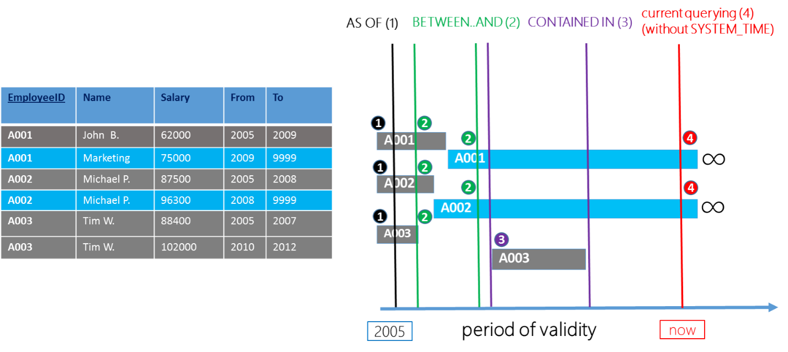
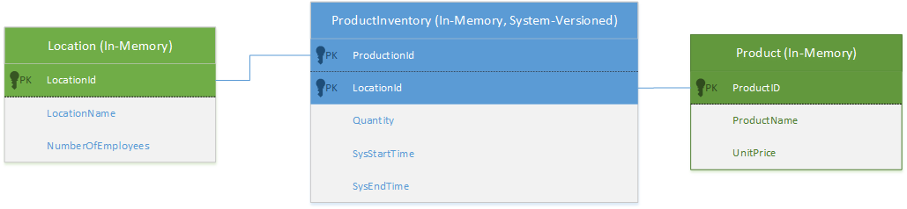
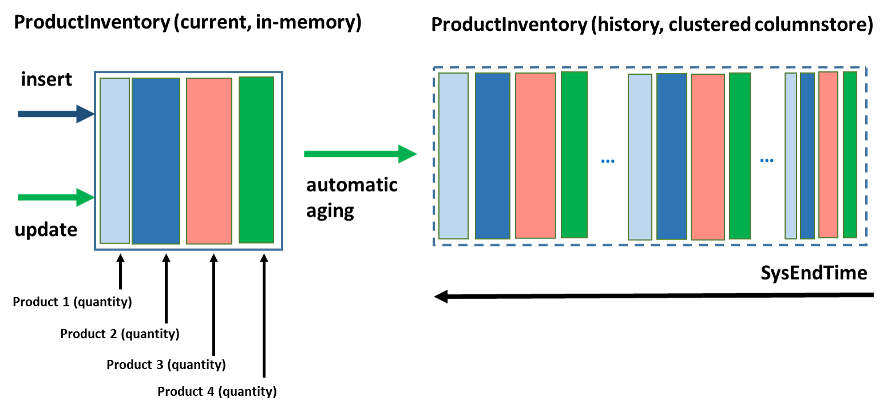
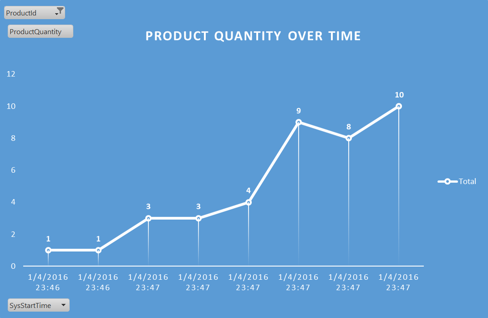
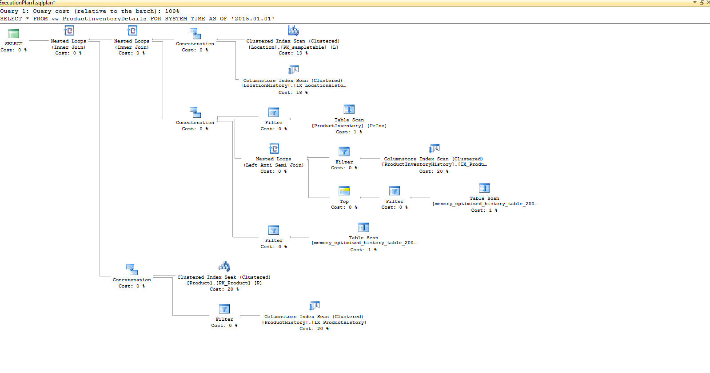
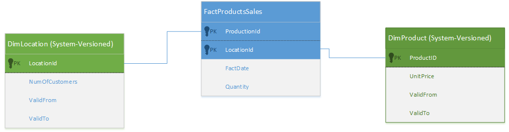
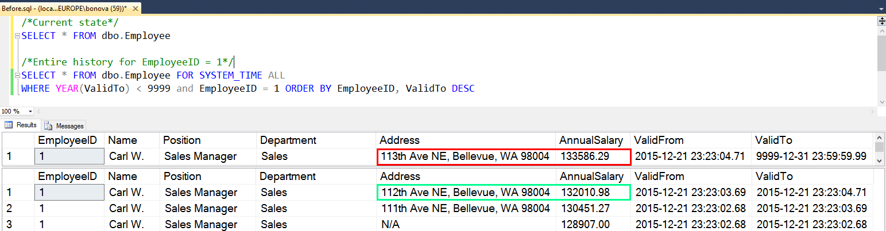
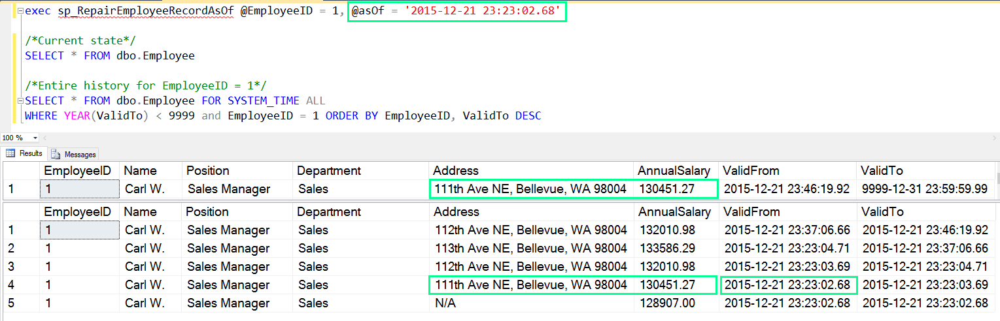
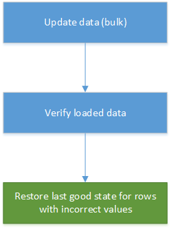

# Temporal Table Usage Scenarios
[!INCLUDE[tsql-appliesto-ss2008-xxxx-xxxx-xxx-md](../../includes/tsql-appliesto-ss2008-xxxx-xxxx-xxx-md.md)]

  Temporal Tables are generally useful in scenarios that require tracking history of data changes.    
We recommend you to consider Temporal Tables in the following use cases for major productivity benefits.  
  
## Data Audit  
 Use temporal system-versioning on tables that store critical information for which you need to keep track of what has changed and when, and to perform data forensics at any point in time.    
Temporal system-versioned tables allows you to plan for data audit scenarios in the early stages of the development cycle or to add data auditing to existing applications or solutions when you need it.  
  
 The following diagram shows an Employee table scenario with the data sample including current (marked with blue color) and historical row versions (marked with grey color).   
The right-hand portion of the diagram visualizes row versions on time axis and what are the rows you select with different types of querying on temporal table with or without SYSTEM_TIME clause.  
  
   
  
### Enabling system-versioning on a new table for data audit  
 If you have identified information that needs data audit, create database tables as temporal system-versioned. The following simple example illustrates a scenario with Employee information in hypothetical HR database:  
  
```  
CREATE TABLE Employee   
(    
  [EmployeeID] int NOT NULL PRIMARY KEY CLUSTERED   
  , [Name] nvarchar(100) NOT NULL  
  , [Position] varchar(100) NOT NULL   
  , [Department] varchar(100) NOT NULL  
  , [Address] nvarchar(1024) NOT NULL  
  , [AnnualSalary] decimal (10,2) NOT NULL  
  , [ValidFrom] datetime2 (2) GENERATED ALWAYS AS ROW START  
  , [ValidTo] datetime2 (2) GENERATED ALWAYS AS ROW END  
  , PERIOD FOR SYSTEM_TIME (ValidFrom, ValidTo)  
 )    
 WITH (SYSTEM_VERSIONING = ON (HISTORY_TABLE = dbo.EmployeeHistory));  
```  
  
 Various options  to create temporal system-versioned table are described in [Creating a System-Versioned Temporal Table](../../relational-databases/tables/creating-a-system-versioned-temporal-table.md).  
  
### Enabling system-versioning on an existing table for data audit  
 If you need to perform data audit in existing databases, use ALTER TABLE to extend non-temporal tables to become system-versioned. In order to avoid breaking changes in your application, add period columns as HIDDEN, as explained  in [Alter Non-Temporal Table to be System-Versioned Temporal Table](https://msdn.microsoft.com/library/mt590957.aspx#Anchor_3). The following example illustrates enabling system-versioning on an existing Employee table in a hypothetical HR database:  
  
```  
/*   
Turn ON system versioning in Employee table in two steps   
(1) add new period columns (HIDDEN)   
(2) create default history table   
*/   
ALTER TABLE Employee   
ADD   
    ValidFrom datetime2 (2) GENERATED ALWAYS AS ROW START HIDDEN    
        constraint DF_ValidFrom DEFAULT DATEADD(second, -1, SYSUTCDATETIME())  
    , ValidTo datetime2 (2)  GENERATED ALWAYS AS ROW END HIDDEN     
        constraint DF_ValidTo DEFAULT '9999.12.31 23:59:59.99'  
    , PERIOD FOR SYSTEM_TIME (ValidFrom, ValidTo);   
  
ALTER TABLE Employee    
    SET (SYSTEM_VERSIONING = ON (HISTORY_TABLE = dbo.Employee_History));  
```  
  
 After executing the above script, all data changes will be collected transparently in the history table.    
In typical data audit scenario, you would query for all data changes that were applied to an individual row within a period of time of interest. The default history table is created with clustered row-store B-Tree to efficiently address this use case.  
  
### Performing data analysis  
 After enabling system-versioning using either of the above approaches, data audit is just one query away from you. The following query searches for row versions for Employee record with EmployeeID = 1000 that were active at least for a portion of period between 1st January of 2014 and 1st January 2015 (including the upper boundary):  
  
```  
SELECT * FROM Employee   
    FOR SYSTEM_TIME    
        BETWEEN '2014-01-01 00:00:00.0000000' AND '2015-01-01 00:00:00.0000000'   
            WHERE EmployeeID = 1000 ORDER BY ValidFrom;  
```  
  
 Replace FOR SYSTEM_TIME BETWEEN...AND with FOR SYSTEM_TIME ALL to analyze the entire history of data changes for that particular employee:  
  
```  
SELECT * FROM Employee   
    FOR SYSTEM_TIME ALL WHERE    
        EmployeeID = 1000 ORDER BY ValidFrom;  
```  
  
 To search for row versions that were active only within a period (and not outside of it), use CONTAINED IN. This query is very efficient because it only queries the history table:  
  
```  
SELECT * FROM Employee FOR SYSTEM_TIME    
    CONTAINED IN ('2014-01-01 00:00:00.0000000', '2015-01-01 00:00:00.0000000')   
        WHERE EmployeeID = 1000 ORDER BY ValidFrom;  
```  
  
 Finally, in some audit scenarios, you may want to see how entire table looked like at any point in time in the past:  
  
```  
SELECT * FROM Employee FOR SYSTEM_TIME AS OF '2014-01-01 00:00:00.0000000' ;  
```  
  
 System-versioned temporal tables store values for period columns in UTC time zone, while it is always more convenient to work with local time zone both for filtering data and displaying results. The following code example shows how to apply filtering condition that is originally specified in the local time zone and then converted to UTC using AT TIME ZONE  introduced in SQL Server 2016:  
  
```  
/*Add offset of the local time zone to current time*/  
DECLARE @asOf DATETIMEOFFSET = GETDATE() AT TIME ZONE 'Pacific Standard Time'  
/*Convert AS OF filter to UTC*/  
SET @asOf = DATEADD (MONTH, -9, @asOf) AT TIME ZONE 'UTC';  
  
SELECT   
    EmployeeID  
    , Name  
    , Position  
    , Department  
    , [Address]  
    , [AnnualSalary]  
    , ValidFrom AT TIME ZONE 'Pacific Standard Time' AS ValidFromPT   
    , ValidTo AT TIME ZONE 'Pacific Standard Time' AS ValidToPT  
FROM Employee   
    FOR SYSTEM_TIME AS OF @asOf where EmployeeId = 1000  
  
```  
  
 Using AT TIME ZONE is helpful in all other scenarios where system-versioned tables are used.  
  
> [!TIP]  
>  Filtering conditions specified in temporal clauses with FOR SYSTEM_TIME are SARG-able (i.e SQL Server can utilize underlying clustered index to perform a seek instead of a scan operation.   
> If you query the history table directly, make sure that your filtering condition is also SARG-able by specifying filters in form of \<period column>  {< | > | =, ...} date_condition AT TIME ZONE 'UTC'.  
> If you apply AT TIME ZONE to period columns, SQL Server will perform a table/index scan, which can be very expensive. Avoid this type of condition in your queries:  
> \<period column>  AT TIME ZONE '\<your time zone>'  >  {< | > | =, ...} date_condition.  
  
 See also: [Querying Data in a System-Versioned Temporal Table](../../relational-databases/tables/querying-data-in-a-system-versioned-temporal-table.md).  
  
## Point in Time Analysis (Time Travel)  
 Unlike data audit, where the focus is typically on changes that occurred to an individual records, in time travel scenarios users want to see how entire data sets changed over time. Sometimes time travel includes several related temporal tables, each changing at independent pace, for which you want to analyze:  
  
-   Trends for the important indicators in the historical and current data  
  
-   Exact snapshot of the entire data "as of" any point in time in the past (yesterday, a month ago, etc.)  
  
-   Differences in between two point in time of interest (a month ago vs. three months ago, for instance)  
  
 There are many real-world scenarios which require time travel analysis. To illustrate this usage scenario, let's look at OLTP with auto-generated history.  
  
### OLTP with Auto-Generated Data History  
 In transaction processing systems, it is not unusual to analyze how important metrics change over time. Ideally, analyzing history should not compromise performance of the OLTP application where access to the latest state of data must occur with minimal latency and data locking.  System-versioned temporal tables are designed to allow users to transparently keep the full history of changes for later analysis, separately from the current data, with the minimal impact on the main OLTP workload.  
For high transactional processing  workloads, we recommend  that you use [System-Versioned Temporal Tables with Memory-Optimized Tables](../../relational-databases/tables/system-versioned-temporal-tables-with-memory-optimized-tables.md), which allow you to store current data in-memory and full history of changes on disk in a cost effective way.  
  
 For the history table, we recommend that you use a clustered columnstore index for the following reasons:  
  
-   Typical trend analysis benefits from query performance provided by a clustered columnstore index.  
  
-   The data flush task with memory-optimized tables performs best under heavy OLTP workload when the history table has a clustered columnstore index.  
  
-   A clustered columnstore index provides excellent compression, especially in scenarios where not all columns are changed at the same time.  
  
 Using temporal tables with in-memory OLTP reduces the need to keep the entire data set in-memory and enables you to easily distinguish between hot and cold data.  
Examples of the real-world scenarios that fit well into this category are inventory management or currency trading, among others.  
  
 The following diagram shows simplified data model used for inventory management:  
  
   
  
 The following code example creates ProductInventory as an in-memory system-versioned temporal table with a clustered columnstore index on the history table (which actually replaces the row-store index created by default):  
  
> [!NOTE]  
>  Make sure that your database allows creation of memory-optimized tables. See [Creating a Memory-Optimized Table and a Natively Compiled Stored Procedure](../../relational-databases/in-memory-oltp/creating-a-memory-optimized-table-and-a-natively-compiled-stored-procedure.md).  
  
```  
USE TemporalProductInventory  
GO  
  
BEGIN  
    --If table is system-versioned, SYSTEM_VERSIONING must be set to OFF first   
    IF ((SELECT temporal_type FROM SYS.TABLES WHERE object_id = OBJECT_ID('dbo.ProductInventory', 'U')) = 2)  
    BEGIN  
        ALTER TABLE [dbo].[ProductInventory] SET (SYSTEM_VERSIONING = OFF)  
    END  
    DROP TABLE IF EXISTS [dbo].[ProductInventory]  
       DROP TABLE IF EXISTS [dbo].[ProductInventoryHistory]  
END  
GO  
  
CREATE TABLE [dbo].[ProductInventory]  
(  
    ProductId int NOT NULL,  
    LocationID INT NOT NULL,  
    Quantity int NOT NULL CHECK (Quantity >=0),  
  
    SysStartTime datetime2(0) GENERATED ALWAYS AS ROW START  NOT NULL ,  
    SysEndTime datetime2(0) GENERATED ALWAYS AS ROW END  NOT NULL ,  
    PERIOD FOR SYSTEM_TIME(SysStartTime,SysEndTime),  
  
    --Primary key definition  
    CONSTRAINT PK_ProductInventory PRIMARY KEY NONCLUSTERED (ProductId, LocationId)  
)  
WITH  
(  
    MEMORY_OPTIMIZED=ON,      
    SYSTEM_VERSIONING = ON   
    (          
        HISTORY_TABLE = [dbo].[ProductInventoryHistory],          
        DATA_CONSISTENCY_CHECK = ON  
    )  
)  
  
CREATE CLUSTERED COLUMNSTORE INDEX IX_ProductInventoryHistory ON [ProductInventoryHistory]  
WITH (DROP_EXISTING = ON);  
```  
  
 For the model above this is how the procedure for maintaining inventory could look like:  
  
```  
CREATE PROCEDURE [dbo].[spUpdateInventory]  
@productId int,  
@locationId int,  
@quantityIncrement int  
  
WITH NATIVE_COMPILATION, SCHEMABINDING  
AS  
BEGIN ATOMIC WITH (TRANSACTION ISOLATION LEVEL=SNAPSHOT, LANGUAGE=N'English')  
    UPDATE dbo.ProductInventory  
        SET Quantity = Quantity + @quantityIncrement   
            WHERE ProductId = @productId AND LocationId = @locationId  
  
/*If zero rows were updated than this is insert of the new product for a given location*/  
    IF @@rowcount = 0  
        BEGIN  
            IF @quantityIncrement < 0  
                SET @quantityIncrement = 0  
            INSERT INTO [dbo].[ProductInventory]  
                (  
                    [ProductId]  
                    ,[LocationID]  
                    ,[Quantity]  
                )  
                VALUES  
                   (  
                        @productId  
                       ,@locationId  
                       ,@quantityIncrement  
        END  
END;  
```  
  
 The spUpdateInventory stored procedure either inserts a new product in the inventory or updates the product quantity for the particular location. The business logic is very simple and focused on maintaining the latest state accurate all the time by incrementing / decrementing the Quantity field through table update, while system-versioned tables transparently add history dimension to the data, as depicted on the diagram below  
  
   
  
 Now, querying of the latest state can be performed efficiently from the natively compiled module:  
  
```  
CREATE PROCEDURE [dbo].[spQueryInventoryLatestState]  
WITH NATIVE_COMPILATION, SCHEMABINDING  
AS  
BEGIN ATOMIC WITH (TRANSACTION ISOLATION LEVEL=SNAPSHOT, LANGUAGE=N'English')  
    SELECT ProductId, LocationID, Quantity, SysStartTime  
      FROM dbo.ProductInventory  
    ORDER BY ProductId, LocationId  
END;  
GO  
EXEC [dbo].[spQueryInventoryLatestState];  
```  
  
 Analyzing data changes over time becomes extremely easy with the FOR SYSTEM_TIME ALL clause, as shown in the following example:  
  
```  
DROP VIEW IF EXISTS vw_GetProductInventoryHistory;  
GO  
CREATE VIEW vw_GetProductInventoryHistory  
AS  
   SELECT ProductId, LocationId, Quantity, SysStartTime, SysEndTime   
   FROM [dbo].[ProductInventory]  
   FOR SYSTEM_TIME ALL;  
GO  
SELECT * FROM vw_GetProductInventoryHistory   
    WHERE ProductId = 2;  
```  
  
 The diagram below shows the data history for one product which can be easily rendered importing the view above in the Power Query, Power BI  or similar business intelligence tool:  
  
   
  
 Temporal tables can be used in this scenario to perform other types of time travel analysis, such as reconstructing the state of the inventory AS OF any point in time in the past or comparing snapshots that belong to different moments in time.  
  
 For this usage scenario, you can also extend the Product and Location tables to become temporal tables, which enables later analysis of the history of changes of UnitPrice and NumberOfEmployee.  
  
```  
ALTER TABLE Product   
ADD   
    SysStartTime datetime2 (2) GENERATED ALWAYS AS ROW START HIDDEN    
        constraint DF_ValidFrom DEFAULT DATEADD(second, -1, SYSUTCDATETIME())  
    , SysEndTime datetime2 (2)  GENERATED ALWAYS AS ROW END HIDDEN     
        constraint DF_ValidTo DEFAULT '9999.12.31 23:59:59.99'  
    , PERIOD FOR SYSTEM_TIME (SysStartTime, SysEndTime);   
  
ALTER TABLE Product    
    SET (SYSTEM_VERSIONING = ON (HISTORY_TABLE = dbo.ProductHistory));  
  
ALTER TABLE [Location]  
ADD   
    SysStartTime datetime2 (2) GENERATED ALWAYS AS ROW START HIDDEN    
        constraint DFValidFrom DEFAULT DATEADD(second, -1, SYSUTCDATETIME())  
    , SysEndTime datetime2 (2)  GENERATED ALWAYS AS ROW END HIDDEN     
        constraint DFValidTo DEFAULT '9999.12.31 23:59:59.99'  
    , PERIOD FOR SYSTEM_TIME (SysStartTime, SysEndTime);  
  
ALTER TABLE [Location]    
    SET (SYSTEM_VERSIONING = ON (HISTORY_TABLE = dbo.LocationHistory));  
```  
  
 Since the data model now involves multiple temporal tables, the best practice for AS OF analysis is to create a view that extracts necessary data from the related tables and apply FOR SYSTEM_TIME AS OF to the view as this will greatly simplify reconstructing the state of entire data model:  
  
```  
DROP VIEW IF EXISTS vw_ProductInventoryDetails;  
GO  
  
CREATE VIEW vw_ProductInventoryDetails  
AS  
    SELECT PrInv.ProductId ,PrInv.LocationId, P.ProductName, L.LocationName, PrInv.Quantity  
    , P.UnitPrice, L.NumberOfEmployees  
    , P.SysStartTime AS ProductStartTime, P.SysEndTime AS ProductEndTime  
    , L.SysStartTime AS LocationStartTime, L.SysEndTime AS LocationEndTime  
    , PrInv.SysStartTime AS InventoryStartTime, PrInv.SysEndTime AS InventoryEndTime  
FROM dbo.ProductInventory as PrInv  
JOIN dbo.Product AS P ON PrInv.ProductId = P.ProductID  
JOIN dbo.Location AS L ON PrInv.LocationId = L.LocationID;  
GO  
SELECT * FROM vw_ProductInventoryDetails  
    FOR SYSTEM_TIME AS OF '2015.01.01';   
```  
  
 The following picture shows the execution plan generated for the SELECT query. This illustrates that all complexity of dealing with temporal relations is fully handled by the SQL Server engine:  
  
   
  
 Use the following code to compare state of product inventory between two points in time (a day ago and a month ago):  
  
```  
DECLARE @dayAgo datetime2 (0) = DATEADD (day, -1, SYSUTCDATETIME());  
DECLARE @monthAgo datetime2 (0) = DATEADD (month, -1, SYSUTCDATETIME());  
  
SELECT   
    inventoryDayAgo.ProductId  
    , inventoryDayAgo.ProductName  
    , inventoryDayAgo.LocationName  
    , inventoryDayAgo.Quantity AS QuantityDayAgo,inventoryMonthAgo.Quantity AS QuantityMonthAgo  
    , inventoryDayAgo.UnitPrice AS UnitPriceDayAgo, inventoryMonthAgo.UnitPrice AS UnitPriceMonthAgo  
FROM vw_ProductInventoryDetails  
FOR SYSTEM_TIME AS OF @dayAgo AS inventoryDayAgo  
JOIN vw_ProductInventoryDetails FOR SYSTEM_TIME AS OF @monthAgo AS inventoryMonthAgo  
    ON inventoryDayAgo.ProductId = inventoryMonthAgo.ProductId AND inventoryDayAgo.LocationId = inventoryMonthAgo.LocationID;  
```  
  
## Anomaly Detection  
 Anomaly detection (or outlier detection) is the identification of items which do not conform to an expected pattern or other items in a dataset.   
You can use system-versioned temporal tables to detect anomalies that occur periodically or irregularly as you can utilize temporal querying to quickly locate specific patterns.  
What anomaly is depends on type of data you collect and your business logic.  
  
 The following example shows simplified logic for detecting "spikes" in sales numbers. Let's assume that you work with a temporal table that collects history of the products purchased:  
  
```  
CREATE TABLE [dbo].[Product]  
                (  
            [ProdID] [int] NOT NULL PRIMARY KEY CLUSTERED  
        , [ProductName] [varchar](100) NOT NULL  
        , [DailySales] INT NOT NULL  
        , [ValidFrom] [datetime2](7) GENERATED ALWAYS AS ROW START NOT NULL  
        , [ValidTo] [datetime2](7) GENERATED ALWAYS AS ROW END NOT NULL  
        , PERIOD FOR SYSTEM_TIME ([ValidFrom], [ValidTo])  
    )  
    WITH( SYSTEM_VERSIONING = ON (HISTORY_TABLE = [dbo].[ProductHistory]   
        , DATA_CONSISTENCY_CHECK = ON ))  
  
```  
  
 The following diagram shows the purchases over time:  
  
   
  
 Assuming that during the regular days number of purchased products has small variance, the following query identifies singleton outliers  - samples which difference compared to their immediate neighbors is significant (2x), while surrounding samples do not differ significantly (less than 20%):  
  
```  
WITH CTE (ProdId, PrevValue, CurrentValue, NextValue, ValidFrom, ValidTo)  
AS  
    (  
        SELECT   
            ProdId, LAG (DailySales, 1, 1) over (partition by ProdId order by ValidFrom) as PrevValue  
            , DailySales, LEAD (DailySales, 1, 1) over (partition by ProdId order by ValidFrom) as NextValue   
             , ValidFrom, ValidTo from Product  
        FOR SYSTEM_TIME ALL  
)  
  
SELECT   
    ProdId  
    , PrevValue  
    , CurrentValue  
    , NextValue  
    , ValidFrom  
    , ValidTo  
    , ABS (PrevValue - NextValue) / convert (float, (CASE WHEN NextValue > PrevValue THEN PrevValue ELSE NextValue END)) as PrevToNextDiff  
    , ABS (CurrentValue - PrevValue) / convert (float, (CASE WHEN CurrentValue > PrevValue THEN PrevValue ELSE CurrentValue END)) as CurrentToPrevDiff  
    , ABS (CurrentValue - NextValue) / convert (float, (CASE WHEN CurrentValue > NextValue THEN NextValue ELSE CurrentValue END)) as CurrentToNextDiff  
FROM CTE   
    WHERE   
        ABS (PrevValue - NextValue) / (CASE WHEN NextValue > PrevValue THEN PrevValue ELSE NextValue END) < 0.2  
            AND ABS (CurrentValue - PrevValue) / (CASE WHEN CurrentValue > PrevValue THEN PrevValue ELSE CurrentValue END) > 2  
            AND ABS (CurrentValue - NextValue) / (CASE WHEN CurrentValue > NextValue THEN NextValue ELSE CurrentValue END) > 2;  
```  
  
> [!NOTE]  
>  This example is intentionally simplified. In the production scenarios, you would likely use advanced statistical methods to identify samples which do not follow the common pattern.  
  
## Slowly-Changing Dimensions  
 Dimensions in data warehousing typically contain relatively static data about entities such as geographical locations, customers, or products. However, some scenarios require you to track data changes in dimension tables as well. Given that modification in dimensions happen much less frequently, in unpredictable manner and outside of the regular update schedule that applies to fact tables, these types of dimension tables are called slowly changing dimensions (SCD).  
  
 There are several categories of slowly changing dimensions based on how history of changes is preserved:  
  
-   Type 0:  History is not preserved. Dimension attributes reflect original values.  
  
-   Type 1:  Dimension attributes reflect latest values (previous values are overwritten)  
  
-   Type 2:  Every version of dimension member represented with separate row in the table usually with columns that represent period of validity  
  
-   Type 3: Keeping limited history for selected attribute(s) using additional columns in the same row  
  
-   Type 4: Keeping history in the separate table while original dimension table keeps latest (current) dimension member versions  
  
 When you choose SCD strategy, it is responsibility of the ETL layer (Extract-Transform-Load) to keep dimension table(s) accurate and that usually requires a lot of code and complex maintenance.  
  
 System-versioned temporal tables in SQL Server 2016 can be used to dramatically lower the complexity of your code as history of data is automatically preserved. Given its implementation using two tables, temporal tables in SQL Server 2016 is closest to Type 4 SCD. However, since temporal queries allows you to reference current table only, you can also consider temporal tables in environments where you plan to use Type 2 SCD.  
  
 In order to convert your regular dimension to SCD, just create a new one or alter an existing one to become  a system-versioned temporal table. If your existing dimension table contains historical data, create separate table and move historical data there and keep current (actual) dimension versions in your original dimension table. Then use ALTER TABLE syntax to convert your dimension table to a system-versioned temporal table with a predefined history table.  
  
 The following example illustrates the process and assumes that the  DimLocation dimension table already has ValidFrom and ValidTo as datetime2 non-nullable columns which are populated by the ETL process:  
  
```  
/*Move "closed" row versions into newly created history table*/  
SELECT * INTO  DimLocationHistory  
    FROM DimLocation  
        WHERE ValidTo < '9999-12-31 23:59:59.99';  
GO  
/*Create clustered columnstore index which is a very good choice in DW scenarios*/  
CREATE CLUSTERED COLUMNSTORE INDEX IX_DimLocationHistory ON DimLocationHistory  
/*Delete previous versions from DimLocation which will become current table in temporal-system-versioning configuration*/  
DELETE FROM DimLocation  
    WHERE ValidTo < '9999-12-31 23:59:59.99';  
/*Add period definition*/  
ALTER TABLE DimLocation ADD PERIOD FOR SYSTEM_TIME (ValidFrom, ValidTo);  
/*Enable system-versioning and bind histiory table to the DimLocation*/  
ALTER TABLE DimLocation SET (SYSTEM_VERSIONING = ON (HISTORY_TABLE = dbo.DimLocationHistory));  
```  
  
 Note that no additional code is required to maintain SCD during the data warehouse loading process once you created it.  
  
 The following illustration shows how you can use Temporal Tables in a simple scenario involving 2 SCDs (DimLocation and DimProduct) and one fact table.  
  
   
  
 In order to use above SCDs in reports, you need to effectively adjust querying. For example, you might want to calculate the total sales amount and the average number of sold products per capita for the last six months.  Note that both metrics requires the correlation of data from the fact table and dimensions that  might have changed their attributes important for the analysis (DimLocation.NumOfCustomers, DimProduct.UnitPrice).  The followinq query properly calculates the required metrics:  
  
```  
DECLARE @now datetime2 = SYSUTCDATETIME()  
DECLARE @sixMonthsAgo datetime2 SET   
    @sixMonthsAgo = DATEADD (month, -12, SYSUTCDATETIME())   
  
SELECT DimProduct_History.ProductId  
   , DimLocation_History.LocationId  
    , SUM(F.Quantity * DimProduct_History.UnitPrice) AS TotalAmount  
    , AVG (F.Quantity/DimLocation_History.NumOfCustomers) AS AverageProductsPerCapita   
FROM FactProductSales F   
/* find corresponding record in SCD history in last 6 months, based on matching fact */  
JOIN DimLocation FOR SYSTEM_TIME BETWEEN @sixMonthsAgo AND @now AS DimLocation_History   
    ON DimLocation_History.LocationId = F.LocationId   
        AND F.FactDate BETWEEN DimLocation_History.ValidFrom AND DimLocation_History.ValidTo   
/* find corresponding record in SCD history in last 6 months, based on matching fact */  
JOIN DimProduct FOR SYSTEM_TIME BETWEEN @sixMonthsAgo AND @now AS DimProduct_History   
    ON DimProduct_History.ProductId = F.ProductId  
        AND F.FactDate BETWEEN DimProduct_History.ValidFrom AND DimProduct_History.ValidTo   
    WHERE F.FactDate BETWEEN @sixMonthsAgo AND @now   
GROUP BY DimProduct_History.ProductId, DimLocation_History.LocationId ;  
```  
  
 **Considerations:**  
  
-   Using  system-versioned temporal tables for SCD is acceptable if period of validity calculated based on database transaction time is fine with your business logic. If you load data with significant delay, transaction time might not be acceptable.  
  
-   By default, system-versioned temporal tables do not allow changing historical data after loading (you can modify history after you set SYSTEM_VERSIONING to OFF). This might be limitation in cases where changing historical data happens regularly.  
  
-   Temporal system-versioned tables generate row version on any column change. If you want to suppress new versions on certain column change you need to incorporate that limitation in the ETL logic.  
  
-   If you expect a significant number of historical rows in SCD tables, consider using a clustered columnstore index as the main storage option for history table. That will reduce history table footprint and speed up your analytical queries.  
  
## Repairing Row-Level Data Corruption  
 You can rely on historical data in  system-versioned temporal tables to quickly repair individual rows to any of the previously captured states. This property of temporal tables is very useful when you are able to locate affected rows and/or when you know time of undesired data change so you can perform repair very efficiently without dealing with backups.  
  
 This approach has several advantages:  
  
-   You are able to control the scope of the repair very precisely. Records that are not affected need to stay at the latest state, which is often a critical requirement.  
  
-   Operation is very efficient and the database stays online for all workloads using the data.  
  
-   The repair operation itself is versioned. You have audit trail for repair operation itself, so you can analyze what happened later if necessary.  
  
 Repair action can be automated relatively easily. Here is code example of the stored procedure that performs data repair for the table Employee used in the data audit scenario.  
  
```  
DROP PROCEDURE IF EXISTS sp_RepairEmployeeRecord;  
GO  
  
CREATE PROCEDURE sp_RepairEmployeeRecord   
    @EmployeeID INT,  
    @versionNumber INT = 1  
AS  
  
;WITH History  
AS  
(  
        /* Order historical rows by tehir age in DESC order*/  
        SELECT ROW_NUMBER () OVER (PARTITION BY EmployeeID ORDER BY [ValidTo] DESC) AS RN, *  
        FROM Employee FOR SYSTEM_TIME ALL WHERE YEAR (ValidTo) < 9999 AND Employee.EmployeeID = @EmployeeID  
)  
  
/*Update current row by using N-th row version from history (default is 1 - i.e. last version)*/  
UPDATE Employee   
    SET [Position] = H.[Position], [Department] = H.Department, [Address] = H.[Address], AnnualSalary = H.AnnualSalary  
    FROM Employee E JOIN History H ON E.EmployeeID = H.EmployeeID AND RN = @versionNumber  
    WHERE E.EmployeeID = @EmployeeID  
  
```  
  
 This stored procedure takes @EmployeeID and @versionNumber as input parameters. This procedure by default restores row state to the last version from the history (@versionNumber = 1).  
  
 The following picture shows state of the row before and after the procedure invocation. Red rectangle marks current row version that is incorrect, while green rectangle marks correct version from the history.  
  
   
  
```  
EXEC sp_RepairEmployeeRecord @EmployeeID = 1, @versionNumber = 1  
```  
  
   
  
 This repair stored procedure can be defined to accept an exact timestamp instead of row version. It will restore row to any version that was active for the point in time provided (i.e. AS OF point in time).  
  
```  
DROP PROCEDURE IF EXISTS sp_RepairEmployeeRecordAsOf;  
GO  
  
CREATE PROCEDURE sp_RepairEmployeeRecordAsOf   
    @EmployeeID INT,  
    @asOf datetime2  
AS  
  
/*Update current row to the state that was actual AS OF provided date*/  
UPDATE Employee   
    SET [Position] = History.[Position], [Department] = History.Department, [Address] = History.[Address], AnnualSalary = History.AnnualSalary  
    FROM Employee AS E JOIN Employee FOR SYSTEM_TIME AS OF @asOf AS History  ON E.EmployeeID = History.EmployeeID  
    WHERE E.EmployeeID = @EmployeeID  
  
```  
  
 For the same data sample the following picture illustrates repair scenario with time condition. Highlighted are @asOf parameter, selected row in the history that was actual at the provided point in time and new row version in the current table after repair operation:  
  
   
  
 Data correction can become part of automated data loading in data warehousing and reporting systems.  
If a newly updated value is not correct then, in many scenarios, restoring the previous version from history is good enough mitigation. The following diagram shows how this process can be automated:  
  
   
  
## See Also  
 [Temporal Tables](../../relational-databases/tables/temporal-tables.md)   
 [Getting Started with System-Versioned Temporal Tables](../../relational-databases/tables/getting-started-with-system-versioned-temporal-tables.md)   
 [Temporal Table System Consistency Checks](../../relational-databases/tables/temporal-table-system-consistency-checks.md)   
 [Partitioning with Temporal Tables](../../relational-databases/tables/partitioning-with-temporal-tables.md)   
 [Temporal Table Considerations and Limitations](../../relational-databases/tables/temporal-table-considerations-and-limitations.md)   
 [Temporal Table Security](../../relational-databases/tables/temporal-table-security.md)   
 [System-Versioned Temporal Tables with Memory-Optimized Tables](../../relational-databases/tables/system-versioned-temporal-tables-with-memory-optimized-tables.md)   
 [Temporal Table Metadata Views and Functions](../../relational-databases/tables/temporal-table-metadata-views-and-functions.md)  
  
  
