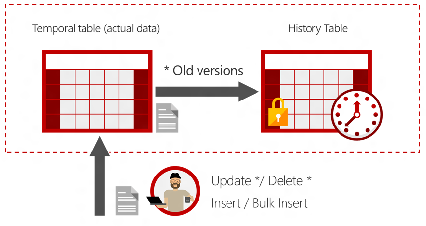
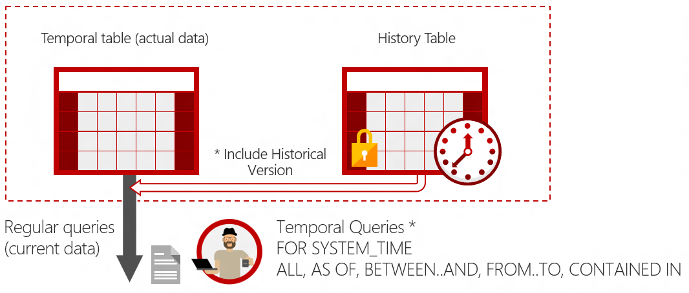

# Temporal Tables
[!INCLUDE[tsql-appliesto-ss2016-asdb-xxxx-xxx-md](../../includes/tsql-appliesto-ss2016-asdb-xxxx-xxx-md.md)]

  SQL Server 2016 introduced support for temporal tables (also known as system-versioned temporal tables) as a database feature that brings built-in support for providing information about data stored in the table at any point in time rather than only the data that is correct at the current moment in time. Temporal is a database feature that was introduced in ANSI SQL 2011.  
  
 **Quick Start**  
  
-   **Getting started:**  
  
    -   [Getting Started with System-Versioned Temporal Tables](../../relational-databases/tables/getting-started-with-system-versioned-temporal-tables.md)  
  
    -   [System-Versioned Temporal Tables with Memory-Optimized Tables](../../relational-databases/tables/system-versioned-temporal-tables-with-memory-optimized-tables.md)  
  
    -   [Temporal Table Usage Scenarios](../../relational-databases/tables/temporal-table-usage-scenarios.md)  
  
    -   [Getting Started with Temporal Tables in Azure SQL Database](https://azure.microsoft.com/documentation/articles/sql-database-temporal-tables/)  
  
-   **Examples:**  
  
    -   [Creating a System-Versioned Temporal Table](../../relational-databases/tables/creating-a-system-versioned-temporal-table.md)  
  
    -   [Working with Memory-Optimized System-Versioned Temporal Tables](../../relational-databases/tables/working-with-memory-optimized-system-versioned-temporal-tables.md)  
  
    -   [Modifying Data in a System-Versioned Temporal Table](../../relational-databases/tables/modifying-data-in-a-system-versioned-temporal-table.md)  
  
    -   [Querying Data in a System-Versioned Temporal Table](../../relational-databases/tables/querying-data-in-a-system-versioned-temporal-table.md)  
  
    -   **Download Adventure Works sample database:** To get started with Temporal Tables download [AdventureWorks database for SQL Server 2016 CTP3](https://www.microsoft.com/download/details.aspx?id=49502) with script samples and follow the instructions in the folder 'Temporal'  
  
-   **Syntax:**  
  
    -   [CREATE TABLE &#40;Transact-SQL&#41;](../../t-sql/statements/create-table-transact-sql.md)  
  
    -   [ALTER TABLE &#40;Transact-SQL&#41;](../../t-sql/statements/alter-table-transact-sql.md)  
  
    -   [FROM &#40;Transact-SQL&#41;](../../t-sql/queries/from-transact-sql.md)  
  
-   **Video:** For a 20 minute discussion of temporal, see [Temporal in SQL Server 2016](https://channel9.msdn.com/Shows/Data-Exposed/Temporal-in-SQL-Server-2016).  
  
## What is a system-versioned temporal table?  
 A system-versioned temporal table is a type of user table designed to keep a full history of data changes and allow easy point in time analysis. This type of temporal table is referred to as a system-versioned temporal table because the period of validity for each row is managed by the system (i.e. database engine).  
  
 Every temporal table has two explicitly defined columns, each with a **datetime2** data type. These columns are referred to as period columns. These period columns are used exclusively by the system to record period of validity for each row whenever a row is modified.  
  
 In addition to these period columns, a temporal table also contains a reference to another table with a mirrored schema. The system uses this table to automatically store the previous version of the row each time a row in the temporal table gets updated or deleted. This additional table is referred to as the history table, while the main table that stores current (actual) row versions is referred to as the current table or simply as the temporal table. During temporal table creation users can specify existing history table (must be schema compliant) or let system create default history table.  
  
## Why temporal?  
 Real data sources are dynamic and more often than not business decisions rely on insights that analysts can get from data evolution. Use cases for temporal tables include:  
  
-   Auditing all data changes and performing data forensics when necessary  
  
-   Reconstructing state of the data as of any time in the past  
  
-   Calculating trends over time  
  
-   Maintaining a slowly changing dimension for decision support applications  
  
-   Recovering from accidental data changes and application errors  
  
## How does temporal work?  
 System-versioning for a table is implemented as a pair of tables, a current table and a history table. Within each of these tables, the following two additional **datetime2** columns are used to define the period of validity for each row:  
  
-   Period start column: The system records the start time for the row in this column, typically denoted as the **SysStartTime** column.  
  
-   Period end column: The system records the end time for the row in this column, typically denoted at the **SysEndTime** column.  
  
 The current table contains the current value for each row. The history table contains each previous value for each row, if any, and the start time and end time for the period for which it was valid.  
  
   
  
 The following simple example illustrates a scenario with Employee information in hypothetical HR database:  
  
```  
CREATE TABLE dbo.Employee   
(    
  [EmployeeID] int NOT NULL PRIMARY KEY CLUSTERED   
  , [Name] nvarchar(100) NOT NULL  
  , [Position] varchar(100) NOT NULL   
  , [Department] varchar(100) NOT NULL  
  , [Address] nvarchar(1024) NOT NULL  
  , [AnnualSalary] decimal (10,2) NOT NULL  
  , [ValidFrom] datetime2 (2) GENERATED ALWAYS AS ROW START  
  , [ValidTo] datetime2 (2) GENERATED ALWAYS AS ROW END  
  , PERIOD FOR SYSTEM_TIME (ValidFrom, ValidTo)  
 )    
 WITH (SYSTEM_VERSIONING = ON (HISTORY_TABLE = dbo.EmployeeHistory));  
```  
  
 **INSERTS:** On an **INSERT**, the system sets the value for the **SysStartTime** column to the begin time of the current transaction (in the UTC time zone) based on the system clock and assigns the value for the **SysEndTime** column to the maximum value of 9999-12-31. This marks the row as open.  
  
 **UPDATES:** On an **UPDATE**, the system stores the previous value of the row in the history table and sets the value for the **SysEndTime** column to the begin time of the current transaction (in the UTC time zone) based on the system clock. This marks the row as closed, with a period recorded for which the row was valid. In the current table, the row is updated with its new value and the system sets the value for the **SysStartTime** column to the begin time for the transaction (in the UTC time zone) based on the system clock. The value for the updated row in the current table for the **SysEndTime** column remains the maximum value of 9999-12-31.  
  
 **DELETES:** On a **DELETE**, the system stores the previous value of the row in the history table and sets the value for the **SysEndTime** column to the begin time of the current transaction (in the UTC time zone) based on the system clock. This marks the row as closed, with a period recorded for which the previous row was valid. In the current table, the row is removed. Queries of the current table will not return this row. Only queries that deal with history data return data for which a row is closed.  
  
 **MERGE:** On a **MERGE**, the operation behaves exactly as if up to three statements (an **INSERT**, an **UPDATE**, and/or a **DELETE**) executed, depending on  what is specified  as actions in the **MERGE** statement.  
  
> [!IMPORTANT]  
>  The times recorded in the system datetime2 columns are based on the begin time of the transaction itself. For example, all rows inserted within a single transaction will have the same UTC time recorded in the column corresponding to the start of the **SYSTEM_TIME** period.  
  
## How do I query temporal data?  
 The **SELECT** statement **FROM**_\<table\>_ clause has a new clause **FOR SYSTEM_TIME** with five temporal-specific sub-clauses to query data across the current and history tables. This new **SELECT** statement syntax is supported directly on a single table, propagated through multiple joins, and through views on top of multiple temporal tables.  
  
   
  
 The following query searches for row versions for Employee row with EmployeeID = 1000 that were active at least for a portion of period between 1st January of 2014 and 1st January 2015 (including the upper boundary):  
  
```  
SELECT * FROM Employee   
    FOR SYSTEM_TIME    
        BETWEEN '2014-01-01 00:00:00.0000000' AND '2015-01-01 00:00:00.0000000'   
            WHERE EmployeeID = 1000 ORDER BY ValidFrom;  
```  
  
> [!NOTE]  
>  **FOR SYSTEM_TIME** filters out rows that have period of validity with zero duration (**SysStartTime** = **SysEndTime**).  
> Those rows will be generated if you perform multiple updates on the same primary key within the same transaction.  
> In that case, temporal querying surfaces only row versions before the transactions and ones that became actual after the transactions.  
> If you need to include those rows in the analysis, query the history table directly.  
  
 In the table below, SysStartTime in the Qualifying Rows column represents the value in the **SysStartTime** column in the table being queried and **SysEndTime** represents the value in the **SysEndTime** column in the table being queried. For the full syntax and for examples, see [FROM &#40;Transact-SQL&#41;](../../t-sql/queries/from-transact-sql.md) and [Querying Data in a System-Versioned Temporal Table](../../relational-databases/tables/querying-data-in-a-system-versioned-temporal-table.md).  
  
|Expression|Qualifying Rows|Description|  
|----------------|---------------------|-----------------|  
|**AS OF**<date_time>|SysStartTime \<= date_time AND SysEndTime > date_time|Returns a table with a rows containing the values that were actual (current) at the specified point in time in the past. Internally, a union is performed between the temporal table and its history table and the results are filtered to return the values in the row that was valid at the point in time specified by the *<date_time>* parameter. The value for a row is deemed valid if the *system_start_time_column_name* value is less than or equal to the *<date_time>* parameter value and the *system_end_time_column_name* value is greater than the *<date_time>* parameter value.|  
|**FROM**<start_date_time>**TO**<end_date_time>|SysStartTime < end_date_time AND SysEndTime > start_date_time|Returns a table with the values for all row versions that were active within the specified time range, regardless of whether they started being active before the *<start_date_time>* parameter value for the FROM argument or ceased being active after the *<end_date_time>* parameter value for the TO argument. Internally, a union is performed between the temporal table and its history table and the results are filtered to return the values for all row versions that were active at any time during the time range specified. Rows that ceased being active exactly on the lower boundary defined by the FROM endpoint are not included and records that became active exactly on the upper boundary defined by the TO endpoint are not included also.|  
|**BETWEEN**<start_date_time>**AND**<end_date_time>|SysStartTime \<= end_date_time AND SysEndTime > start_date_time|Same as above in the **FOR SYSTEM_TIME FROM** <start_date_time>**TO** <end_date_time> description, except the table of rows returned includes rows that became active on the upper boundary defined by the <end_date_time> endpoint.|  
|**CONTAINED IN** (<start_date_time> , <end_date_time>)|SysStartTime >= start_date_time AND SysEndTime \<= end_date_time|Returns a table with the values for all row versions that were opened and closed within the specified time range defined by the two datetime values for the CONTAINED IN argument. Rows that became active exactly on the lower boundary or ceased being active exactly on the upper boundary are included.|  
|**ALL**|All rows|Returns the union of rows that belong to the current and the history table.|  
  
> [!NOTE]  
>  Optionally, you can choose to hide these period columns such that queries that do not explicitly reference these period columns do not return these columns (the **SELECT \* FROM**_\<table\>_ scenario). To return a hidden column, simply explicitly refer to the hidden column in the query. Similarly **INSERT** and **BULK INSERT** statements will continue as if these new period columns were not present (and the column values will be auto-populated). For details on using the **HIDDEN** clause, see [CREATE TABLE &#40;Transact-SQL&#41;](../../t-sql/statements/create-table-transact-sql.md) and [ALTER TABLE &#40;Transact-SQL&#41;](../../t-sql/statements/alter-table-transact-sql.md).  
  
## See Also  
 [Getting Started with System-Versioned Temporal Tables](../../relational-databases/tables/getting-started-with-system-versioned-temporal-tables.md)   
 [System-Versioned Temporal Tables with Memory-Optimized Tables](../../relational-databases/tables/system-versioned-temporal-tables-with-memory-optimized-tables.md)   
 [Temporal Table Usage Scenarios](../../relational-databases/tables/temporal-table-usage-scenarios.md)   
 [Temporal Table Considerations and Limitations](../../relational-databases/tables/temporal-table-considerations-and-limitations.md)   
 [Manage Retention of Historical Data in System-Versioned Temporal Tables](../../relational-databases/tables/manage-retention-of-historical-data-in-system-versioned-temporal-tables.md)   
 [Partitioning with Temporal Tables](../../relational-databases/tables/partitioning-with-temporal-tables.md)   
 [Temporal Table System Consistency Checks](../../relational-databases/tables/temporal-table-system-consistency-checks.md)   
 [Temporal Table Security](../../relational-databases/tables/temporal-table-security.md)   
 [Temporal Table Metadata Views and Functions](../../relational-databases/tables/temporal-table-metadata-views-and-functions.md)  
  
  
