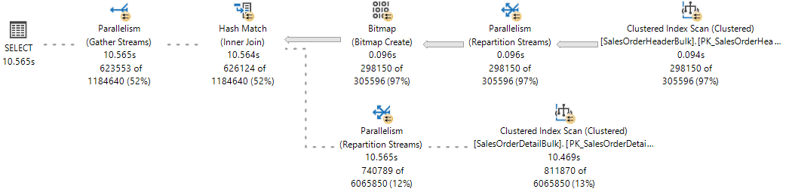

# Thread and Task Architecture Guide
[!INCLUDE [SQL Server Azure SQL Database Azure SQL Managed Instance](../includes/applies-to-version/sql-asdb-asdbmi.md)]

## Operating system task scheduling
Threads are the smallest units of processing that can be executed by an operating system, and allow the application logic to be separated into several concurrent execution paths. Threads are useful when complex applications have many tasks that can be performed at the same time. 

When an operating system executes an instance of an application, it creates a unit called a process to manage the instance. The process has a thread of execution. This is the series of programming instructions performed by the application code. For example, if a simple application has a single set of instructions that can be performed serially, that set of instructions is handled as a single **task**, and there is just one execution path (or **thread**) through the application. More complex applications may have several **tasks** that can be performed concurrently instead of serially. An application can do this by starting separate processes for each task, which is a resource-intensive operation, or start separate threads, which are relatively less resource-intensive. Additionally, each thread can be scheduled for execution independently from the other threads associated with a process.

Threads allow complex applications to make more effective use of a processor (CPU), even on computers that have a single CPU. With one CPU, only one thread can execute at a time. If one thread executes a long-running operation that does not use the CPU, such as a disk read or write, another one of the threads can execute until the first operation is completed. By being able to execute threads while other threads are waiting for an operation to be completed, an application can maximize its use of the CPU. This is especially true for multi-user, disk I/O intensive applications such as a database server. Computers that have multiple CPUs can execute one thread per CPU at the same time. For example, if a computer has eight CPUs, it can execute eight threads at the same time.

## SQL Server task scheduling
In the scope of [!INCLUDE[ssNoVersion](../includes/ssnoversion-md.md)], a **request** is the logical representation of a query or batch. A request also represents operations required by system threads, such as checkpoint or log writer. Requests exist in various states throughout their lifetime and can accumulate waits when resources required to execute the request are not available, such as [locks](../relational-databases/system-dynamic-management-views/sys-dm-tran-locks-transact-sql.md#locks) or [latches](../relational-databases/system-dynamic-management-views/sys-dm-os-latch-stats-transact-sql.md#latches). For more information about request states, see [sys.dm_exec_requests](../relational-databases/system-dynamic-management-views/sys-dm-exec-requests-transact-sql.md).

A **task** represents the unit of work that needs to be completed to fulfill the request. One or more tasks can be assigned to a single request. 
-  Parallel requests will have several active tasks that are executed concurrently instead of serially, with one **parent task** (or coordinating task) and multiple **child tasks**. An execution plan for a parallel request may have serial branches - areas of the plan with operators that don't execute in parallel. The parent task is also responsible for executing those serial operators.
-  Serial requests will only have one active task at any given point in time during execution.     
Tasks exist in various states throughout their lifetime. For more information about task states, see [sys.dm_os_tasks](../relational-databases/system-dynamic-management-views/sys-dm-os-tasks-transact-sql.md). Tasks in SUSPENDED state are waiting on resources required to execute the task to become available. For more information about waiting tasks, see [sys.dm_os_waiting_tasks](../relational-databases/system-dynamic-management-views/sys-dm-os-waiting-tasks-transact-sql.md).

A [!INCLUDE[ssNoVersion](../includes/ssnoversion-md.md)] **worker thread**, also known as worker or thread, is a logical representation of an operating system thread. When executing **serial requests**, the [!INCLUDE[ssDEnoversion](../includes/ssdenoversion-md.md)] will spawn a worker to execute the active task (1:1). When executing **parallel requests** in [row mode](../relational-databases/query-processing-architecture-guide.md#execution-modes), the [!INCLUDE[ssDEnoversion](../includes/ssdenoversion-md.md)] assigns a worker to coordinate the child workers responsible for completing tasks assigned to them (also 1:1), called the **parent thread** (or coordinating thread). The parent thread has a parent task associated with it. The parent thread is the point of entry of the request and exists even before engine parses a query. The main responsibilities of the parent thread are: 
-  Coordinate a parallel scan.
-  Start child parallel workers.
-  Collect rows from parallel threads and send to the client.
-  Perform local and global aggregations.    

> [!NOTE]
> If a query plan has serial and parallel branches, one of the parallel tasks will be responsible for executing the serial branch. 

The number of worker threads spawned for each task depends on:
-	Whether the request was eligible for parallelism as determined by the Query Optimizer.
-	What is the actual available [degree of parallelism (DOP)](../relational-databases/query-processing-architecture-guide.md#degree-of-parallelism-dop) in the system based on current load. This may differ from estimated DOP, which is based on the server configuration for max degree of parallelism (MAXDOP). For example, the server configuration for MAXDOP may be 8 but the available DOP at runtime can be only 2, which affects query performance. 

> [!NOTE]
> The **max degree of parallelism (MAXDOP)** limit is set per task, not per request. This means that during a parallel query execution, a single request can spawn multiple tasks up to the MAXDOP limit, and each task will use one worker. For more information about MAXDOP, see [Configure the max degree of parallelism Server Configuration Option](../database-engine/configure-windows/configure-the-max-degree-of-parallelism-server-configuration-option.md).

A **scheduler**, also known as SOS scheduler, manages worker threads that require processing time to carry out work on behalf of tasks. Each scheduler is mapped to an individual processor (CPU). The time a worker can remain active in a scheduler is called the OS quantum, with a maximum of 4 ms. After its quantum time expires, a worker yields its time to other workers that need to access CPU resources, and changes its state. This cooperation between workers to maximize access to CPU resources is called **cooperative scheduling**, also known as non-preemptive scheduling. In turn, the change in worker state is propagated to the task associated with that worker, and to the request associated with the task. For more information about worker states, see [sys.dm_os_workers](../relational-databases/system-dynamic-management-views/sys-dm-os-workers-transact-sql.md). For more information about schedulers, see [sys.dm_os_schedulers ](../relational-databases/system-dynamic-management-views/sys-dm-os-schedulers-transact-sql.md). 

In summary, a **request** may spawn one or more **tasks** to carry out units of work. Each task is assigned to a **worker thread** who is responsible for completing the task. Each worker thread must be scheduled (placed on a **scheduler**) for active execution of the task. 

> [!NOTE]
> Consider the following scenario:   
> -  Worker 1 is a long-running task, for example a read query using read-ahead over disk-based tables. Worker 1 finds its required data pages are already in Buffer Pool, so it doesn't have to yield to wait for I/O operations, and can consume its full quantum before yielding.   
> -  Worker 2 is doing shorter sub-millisecond tasks and therefore is required to yield before its full quantum is exhausted.     
>
> In this scenario and up to [!INCLUDE[ssSQL14](../includes/sssql14-md.md)], Worker 1 is allowed to basically monopolize the scheduler by having more overall quantum time.   
> Starting with [!INCLUDE[sssql15-md](../includes/sssql16-md.md)], cooperative scheduling includes Large Deficit First (LDF) scheduling. With LDF scheduling, quantum usage patterns are monitored and one worker thread doesn't monopolize a scheduler. In the same scenario, Worker 2 is allowed to consume repeated quantum's before Worker 1 is allowed more quantum, therefore preventing Worker 1 from monopolizing the scheduler in an unfriendly pattern.

### Scheduling parallel tasks
Imagine a [!INCLUDE[ssNoVersion](../includes/ssnoversion-md.md)] configured with MaxDOP 8, and CPU Affinity is configured for 24 CPUs (schedulers) across NUMA nodes 0 and 1. Schedulers 0 through 11 belong to NUMA node 0, schedulers 12 through 23 belong to NUMA node 1. An application sends the following query (request) to the [!INCLUDE[ssde_md](../includes/ssde_md.md)]:

```sql
SELECT h.SalesOrderID, h.OrderDate, h.DueDate, h.ShipDate
FROM Sales.SalesOrderHeaderBulk AS h 
INNER JOIN Sales.SalesOrderDetailBulk AS d ON h.SalesOrderID = d.SalesOrderID 
WHERE (h.OrderDate >= '2014-3-28 00:00:00');
```

> [!TIP]
> The example query can be executed using the [AdventureWorks2016_EXT sample database](../samples/adventureworks-install-configure.md) database. The tables `Sales.SalesOrderHeader` and `Sales.SalesOrderDetail` were enlarged 50 times and renamed to `Sales.SalesOrderHeaderBulk` and `Sales.SalesOrderDetailBulk`.

The execution plan shows a [Hash Join](../relational-databases/performance/joins.md#hash) between two tables, and each of the operators executed in parallel, as indicated by the yellow circle with two arrows. Each Parallelism operator is a different branch in the plan. Therefore, there are three branches in the execution plan below. 


> [!NOTE]
> If you think of an execution plan as a tree, a **branch** is an area of the plan that groups one or more operators between Parallelism operators, also called Exchange Iterators. For more information about plan operators, see [Showplan Logical and Physical Operators Reference](../relational-databases/showplan-logical-and-physical-operators-reference.md). 

While there are three branches in the execution plan, at any point during execution only two branches can execute concurrently in this execution plan:
1.  The branch where a *Clustered Index Scan* is used on the `Sales.SalesOrderHeaderBulk` (build input of the join) executes alone.
2.  Then, the branch where a *Clustered Index Scan* is used on the `Sales.SalesOrderDetailBulk` (probe input of the join) executes concurrently with the branch where the *Bitmap* was created and currently the *Hash Match* is executing.

The Showplan XML shows that 16 worker threads were reserved and used on NUMA node 0:

```xml
<ThreadStat Branches="2" UsedThreads="16">
  <ThreadReservation NodeId="0" ReservedThreads="16" />
</ThreadStat>
```

Thread reservation ensures the [!INCLUDE[ssde_md](../includes/ssde_md.md)] has enough worker threads to carry out all the tasks that will be needed for the request. Threads can be reserved across several NUMA nodes, or be reserved in just one NUMA node. Thread reservation is done at runtime before execution starts, and is dependent on scheduler load. The number of reserved worker threads is generically derived from the formula ***concurrent branches* * *runtime DOP*** and excludes the parent worker thread. Each branch is limited to a number of worker threads that's equal to MaxDOP. In this example there are two concurrent branches and MaxDOP is set to 8, therefore **2 * 8 = 16**.

For reference, observe the live execution plan from [Live Query Statistics](../relational-databases/performance/live-query-statistics.md), where one branch has completed and two branches are executing concurrently.



The [!INCLUDE[ssDEnoversion](../includes/ssdenoversion-md.md)] will assign a worker thread to execute an active task (1:1), which can be observed during query execution by querying the [sys.dm_os_tasks](../relational-databases/system-dynamic-management-views/sys-dm-os-tasks-transact-sql.md) DMV, as seen in the following example:

```sql
SELECT parent_task_address, task_address, 
       task_state, scheduler_id, worker_address
FROM sys.dm_os_tasks
WHERE session_id = <insert_session_id>
ORDER BY parent_task_address, scheduler_id;
```

> [!TIP]
> The column `parent_task_address` is always NULL for the parent task. 

> [!TIP]
> On a very busy [!INCLUDE[ssDEnoversion](../includes/ssdenoversion-md.md)], it's possible to see a number of active tasks that's over the limit set by reserved threads. These tasks can belong to a branch that is not being used anymore and are in a transient state, waiting for cleanup. 

[!INCLUDE[ssResult](../includes/ssresult-md.md)] Notice there are 17 active tasks for the branches that are currently executing: 16 child tasks corresponding to the reserved threads, plus the parent task, or coordinating task.

|parent_task_address|task_address|task_state|scheduler_id|worker_address|
|--------|--------|--------|--------|--------|
|NULL|**0x000001EF4758ACA8**|SUSPENDED|3|0x000001EFE6CB6160|
|0x000001EF4758ACA8|0x000001EFE43F3468|SUSPENDED|0|0x000001EF6DB70160|
|0x000001EF4758ACA8|0x000001EEB243A4E8|SUSPENDED|0|0x000001EF6DB7A160|
|0x000001EF4758ACA8|0x000001EC86251468|SUSPENDED|5|0x000001EEC05E8160|
|0x000001EF4758ACA8|0x000001EFE3023468|SUSPENDED|5|0x000001EF6B46A160|
|0x000001EF4758ACA8|0x000001EFE3AF1468|SUSPENDED|6|0x000001EF6BD38160|
|0x000001EF4758ACA8|0x000001EFE4AFCCA8|SUSPENDED|6|0x000001EF6ACB4160|
|0x000001EF4758ACA8|0x000001EFDE043848|SUSPENDED|7|0x000001EEA18C2160|
|0x000001EF4758ACA8|0x000001EF69038108|SUSPENDED|7|0x000001EF6AEBA160|
|0x000001EF4758ACA8|0x000001EFCFDD8CA8|SUSPENDED|8|0x000001EFCB6F0160|
|0x000001EF4758ACA8|0x000001EFCFDD88C8|SUSPENDED|8|0x000001EF6DC46160|
|0x000001EF4758ACA8|0x000001EFBCC54108|SUSPENDED|9|0x000001EFCB886160|
|0x000001EF4758ACA8|0x000001EC86279468|SUSPENDED|9|0x000001EF6DE08160|
|0x000001EF4758ACA8|0x000001EFDE901848|SUSPENDED|10|0x000001EFF56E0160|
|0x000001EF4758ACA8|0x000001EF6DB32108|SUSPENDED|10|0x000001EFCC3D0160|
|0x000001EF4758ACA8|0x000001EC8628D468|SUSPENDED|11|0x000001EFBFA4A160|
|0x000001EF4758ACA8|0x000001EFBD3A1C28|SUSPENDED|11|0x000001EF6BD72160|

Observe that each of the 16 child tasks has a different worker thread assigned (seen in the `worker_address` column), but all the workers are assigned to the same pool of eight schedulers (0,5,6,7,8,9,10,11), and that the parent task is assigned to a scheduler outside this pool (3).

> [!IMPORTANT]
> Once the first set of parallel tasks on a given branch is scheduled, the [!INCLUDE[ssde_md](../includes/ssde_md.md)] will use that same pool of schedulers for any additional tasks on other branches. This means the same set of schedulers will be used for all the parallel tasks in the entire execution plan, only limited by MaxDOP.  
> The [!INCLUDE[ssDEnoversion](../includes/ssdenoversion-md.md)] will always try to assign schedulers from the same NUMA node for task execution, and assign them sequentially (in round-robin fashion) if schedulers are available. However, the worker thread assigned to the parent task may be placed in a different NUMA node from other tasks.

A worker thread can only remain active in the scheduler for the duration of its quantum (4 ms) and must yield its scheduler after that quantum has elapsed, so that a worker thread assigned to another task may become active. When a worker's quantum expires and is no longer active, the respective task is placed in a FIFO queue in a RUNNABLE state, until it moves to a RUNNING state again, assuming the task won't require access to resources that are not available at the moment, such as a latch or lock, in which case the task would be placed in a SUSPENDED state instead of RUNNABLE, until such time those resources are available.  

> [!TIP] 
> For the output of the DMV seen above, all active tasks are in SUSPENDED state. More detail on waiting tasks is available by querying the [sys.dm_os_waiting_tasks](../relational-databases/system-dynamic-management-views/sys-dm-os-waiting-tasks-transact-sql.md) DMV. 

In summary, a parallel request will spawn multiple tasks. Each task must be assigned to a single worker thread. Each worker thread must be assigned to a single scheduler. Therefore, the number of schedulers in use cannot exceed the number of parallel tasks per branch, which is set by the MaxDOP configuration or query hint. The coordinating thread does not contribute to the MaxDOP limit. 

### Allocating threads to a CPU
By default, each instance of [!INCLUDE[ssNoVersion](../includes/ssnoversion-md.md)] starts each thread, and the operating system distributes threads from instances of [!INCLUDE[ssNoVersion](../includes/ssnoversion-md.md)] among the processors (CPUs) on a computer, based on load. If process affinity has been enabled at the operating system level, then the operating system assigns each thread to a specific CPU. In contrast, the [!INCLUDE[ssDEnoversion](../includes/ssdenoversion-md.md)] assigns [!INCLUDE[ssNoVersion](../includes/ssnoversion-md.md)] **worker threads** to **schedulers** that distribute the threads evenly among the CPUs, in a round-robin fashion.
    
To carry out multitasking, for example when multiple applications access the same set of CPUs, the operating system sometimes moves worker threads among different CPUs. Although efficient from an operating system point of view, this activity can reduce [!INCLUDE[ssNoVersion](../includes/ssnoversion-md.md)] performance under heavy system loads, as each processor cache is repeatedly reloaded with data. Assigning CPUs to specific threads can improve performance under these conditions by eliminating processor reloads and reducing thread migration across CPUs (thereby reducing context switching); such an association between a thread and a processor is called processor affinity. If affinity has been enabled, the operating system assigns each thread to a specific CPU. 

The [affinity mask option](../database-engine/configure-windows/affinity-mask-server-configuration-option.md) is set by using [ALTER SERVER CONFIGURATION](../t-sql/statements/alter-server-configuration-transact-sql.md). When the affinity mask is not set, the instance of [!INCLUDE[ssNoVersion](../includes/ssnoversion-md.md)] allocates worker threads evenly among the schedulers that have not been masked off.

> [!CAUTION]
> Do not configure CPU affinity in the operating system and also configure the affinity mask in [!INCLUDE[ssNoVersion](../includes/ssnoversion-md.md)]. These settings are attempting to achieve the same result, and if the configurations are inconsistent, you may have unpredictable results. For more information, see [affinity mask option](../database-engine/configure-windows/affinity-mask-server-configuration-option.md).

Thread pooling helps optimize performance when large numbers of clients are connected to the server. Usually, a separate operating system thread is created for each query request. However, with hundreds of connections to the server, using one thread per query request can consume large amounts of system resources. The [max worker threads option](../database-engine/configure-windows/configure-the-max-worker-threads-server-configuration-option.md) enables [!INCLUDE[ssNoVersion](../includes/ssnoversion-md.md)] to create a pool of worker threads to service a larger number of query requests, which improves performance. 

### Using the lightweight pooling Option
The overhead involved in switching thread contexts may not be very large. Most instances of [!INCLUDE[ssNoVersion](../includes/ssnoversion-md.md)] will not see any performance differences between setting the lightweight pooling option to 0 or 1. The only instances of [!INCLUDE[ssNoVersion](../includes/ssnoversion-md.md)] that might benefit from [lightweight pooling](../database-engine/configure-windows/lightweight-pooling-server-configuration-option.md) are those that run on a computer having the following characteristics:    
* A large multi-CPU server
* All the CPUs are running near maximum capacity
* There is a high level of context switching

These systems may see a small increase in performance if the lightweight pooling value is set to 1.

> [!IMPORTANT]
> Do not use fiber mode scheduling for routine operation. This can decrease performance by inhibiting the regular benefits of context switching, and because some components of [!INCLUDE[ssNoVersion](../includes/ssnoversion-md.md)] cannot function correctly in fiber mode. For more information, see [lightweight pooling](../database-engine/configure-windows/lightweight-pooling-server-configuration-option.md).

## Thread and Fiber Execution
Microsoft Windows uses a numeric priority system that ranges from 1 through 31 to schedule threads for execution. Zero is reserved for operating system use. When several threads are waiting to execute, Windows dispatches the thread with the highest priority.

By default, each instance of [!INCLUDE[ssNoVersion](../includes/ssnoversion-md.md)] is a priority of 7, which is referred to as the normal priority. This default gives [!INCLUDE[ssNoVersion](../includes/ssnoversion-md.md)] threads a high enough priority to obtain sufficient CPU resources without adversely affecting other applications. 

> [!IMPORTANT]  
>  [!INCLUDE[ssNoteDepFutureAvoid](../includes/ssnotedepfutureavoid-md.md)]  

The [priority boost](../database-engine/configure-windows/configure-the-priority-boost-server-configuration-option.md) configuration option can be used to increase the priority of the threads from an instance of [!INCLUDE[ssNoVersion](../includes/ssnoversion-md.md)] to 13. This is referred to as high priority. This setting gives [!INCLUDE[ssNoVersion](../includes/ssnoversion-md.md)] threads a higher priority than most other applications. Thus, [!INCLUDE[ssNoVersion](../includes/ssnoversion-md.md)] threads will generally be dispatched whenever they are ready to run and will not be preempted by threads from other applications. This can improve performance when a server is running only instances of [!INCLUDE[ssNoVersion](../includes/ssnoversion-md.md)] and no other applications. However, if a memory-intensive operation occurs in [!INCLUDE[ssNoVersion](../includes/ssnoversion-md.md)], however, other applications are not likely to have a high-enough priority to preempt the [!INCLUDE[ssNoVersion](../includes/ssnoversion-md.md)] thread. 

If you are running multiple instances of [!INCLUDE[ssNoVersion](../includes/ssnoversion-md.md)] on a computer, and turn on priority boost for only some of the instances, the performance of any instances running at normal priority can be adversely affected. Also, the performance of other applications and components on the server can decline if priority boost is turned on. Therefore, it should only be used under tightly controlled conditions.


## Hot add CPU
Hot add CPU is the ability to dynamically add CPUs to a running system. Adding CPUs can occur physically by adding new hardware, logically by online hardware partitioning, or virtually through a virtualization layer. Starting with [!INCLUDE[ssKatmai](../includes/ssKatmai-md.md)], [!INCLUDE[ssNoVersion](../includes/ssnoversion-md.md)] supports hot add CPU.

Requirements for hot add CPU:  
* Requires hardware that supports hot add CPU.
* Requires the 64-bit edition of Windows Server 2008 Datacenter or the Windows Server 2008 Enterprise Edition for Itanium-Based Systems operating system.
* Requires [!INCLUDE[ssNoVersion](../includes/ssnoversion-md.md)] Enterprise.
* [!INCLUDE[ssNoVersion](../includes/ssnoversion-md.md)] cannot be configured to use soft NUMA. For more information about soft NUMA, see [Soft-NUMA (SQL Server)](../database-engine/configure-windows/soft-numa-sql-server.md).

[!INCLUDE[ssNoVersion](../includes/ssnoversion-md.md)] does not automatically start to use CPUs after they are added. This prevents [!INCLUDE[ssNoVersion](../includes/ssnoversion-md.md)] from using CPUs that might be added for some other purpose. After adding CPUs, execute the [RECONFIGURE](../t-sql/language-elements/reconfigure-transact-sql.md) statement, so that [!INCLUDE[ssNoVersion](../includes/ssnoversion-md.md)] will recognize the new CPUs as available resources.

> [!NOTE]
> If the [affinity64 mask](../database-engine/configure-windows/affinity64-mask-server-configuration-option.md) is configured, the affinity64 mask must be modified to use the new CPUs.
 
## Best Practices for running SQL Server on computers that have more than 64 CPUs

### Assigning Hardware Threads with CPUs
Do not use the affinity mask and affinity64 mask server configuration options to bind processors to specific threads. These options are limited to 64 CPUs. Use the `SET PROCESS AFFINITY` option of [ALTER SERVER CONFIGURATION](../t-sql/statements/alter-server-configuration-transact-sql.md) instead.

### Managing the Transaction Log file size
Do not rely on autogrow to increase the size of the transaction log file. Increasing the transaction log must be a serial process. Extending the log can prevent transaction write operations from proceeding until the log extension is finished. Instead, preallocate space for the log files by setting the file size to a value large enough to support the typical workload in the environment.

### Setting Max Degree of Parallelism for index operations
The performance of index operations such as creating or rebuilding indexes can be improved on computers that have many CPUs by temporarily setting the recovery model of the database to either the bulk-logged or simple recovery model. These index operations can generate significant log activity and log contention can affect the best degree of parallelism (DOP) choice made by [!INCLUDE[ssNoVersion](../includes/ssnoversion-md.md)].

In addition to adjusting the **max degree of parallelism (MAXDOP)** server configuration option, consider adjusting the parallelism for index operations using the [MAXDOP option](../t-sql/statements/alter-index-transact-sql.md). For more information, see [Configure Parallel Index Operations](../relational-databases/indexes/configure-parallel-index-operations.md). For more information and guidelines about adjusting the max degree of parallelism server configuration option, see [Configure the max degree of parallelism Server Configuration Option](../database-engine/configure-windows/configure-the-max-degree-of-parallelism-server-configuration-option.md).

### Setting the Maximum Number of Worker Threads
[!INCLUDE[ssNoVersion](../includes/ssnoversion-md.md)] will dynamically configure the **max worker threads** server configuration option at startup. [!INCLUDE[ssNoVersion](../includes/ssnoversion-md.md)] uses the number of available CPUs and the system architecture to determine this server configuration during startup, using a documented [formula](../database-engine/configure-windows/configure-the-max-worker-threads-server-configuration-option.md#Recommendations).

This option is an advanced option and should be changed only by an experienced database administrator or certified SQL Server professional. If you suspect that there is a performance problem, it is probably not the availability of worker threads. The cause is more likely something like I/O that is causing the worker threads to wait. It is best to find the root cause of a performance issue before you change the max worker threads setting. However, if you need to manually set the maximum number of worker threads, this configuration value must always be set to a value of at least seven times the number of CPUs that are present on the system. For more information, see [Configure the max worker threads](../database-engine/configure-windows/configure-the-max-worker-threads-server-configuration-option.md).

### Using SQL Trace and SQL Server Profiler
We recommend that you do not use SQL Trace and SQL Profiler in a production environment. The overhead for running these tools also increases as the number of CPUs increases. If you must use SQL Trace in a production environment, limit the number of trace events to a minimum. Carefully profile and test each trace event under load, and avoid using combinations of events that significantly affect performance.

> [!IMPORTANT]
> SQL Trace and [!INCLUDE[ssSqlProfiler](../includes/sssqlprofiler-md.md)] are deprecated. The *Microsoft.SqlServer.Management.Trace* namespace that contains the Microsoft SQL Server Trace and Replay objects are also deprecated. 
> [!INCLUDE[ssNoteDepFutureAvoid](../includes/ssnotedepfutureavoid-md.md)] 
> Use Extended Events instead. For more information on [Extended Events](../relational-databases/extended-events/extended-events.md), see [Quick Start: Extended events in SQL Server](../relational-databases/extended-events/quick-start-extended-events-in-sql-server.md) and [SSMS XEvent Profiler](../relational-databases/extended-events/use-the-ssms-xe-profiler.md).

> [!NOTE]
> [!INCLUDE[ssSqlProfiler](../includes/sssqlprofiler-md.md)] for Analysis Services workloads is NOT deprecated, and will continue to be supported.

### Setting the number of tempdb data files
The number of files depends on the number of (logical) processors on the machine. As a general rule, if the number of logical processors is less than or equal to eight, use the same number of data files as logical processors. If the number of logical processors is greater than eight, use eight data files and then if contention continues, increase the number of data files by multiples of 4 until the contention is reduced to acceptable levels or make changes to the workload/code. Also keep in mind other recommendations for tempdb, available in [Optimizing tempdb performance in SQL Server](../relational-databases/databases/tempdb-database.md#optimizing-tempdb-performance-in-sql-server). 

However, by carefully considering the concurrency needs of tempdb, you can reduce database management overhead. For example, if a system has 64 CPUs and usually only 32 queries use tempdb, increasing the number of tempdb files to 64 will not improve performance.

### SQL Server components that can use more than 64 CPUs
The following table lists [!INCLUDE[ssNoVersion](../includes/ssnoversion-md.md)] components and indicates whether they can use more that 64 CPUs.

|Process name	|Executable program	|Use more than 64 CPUs |  
|----------|----------|----------|  
|SQL Server Database Engine	|Sqlserver.exe	|Yes |  
|Reporting Services	|Rs.exe	|No |  
|Analysis Services	|As.exe	|No |  
|Integration Services	|Is.exe	|No |  
|Service Broker	|Sb.exe	|No |  
|Full-Text Search	|Fts.exe	|No |  
|SQL Server Agent	|Sqlagent.exe	|No |  
|SQL Server Management Studio	|Ssms.exe	|No |  
|SQL Server Setup	|Setup.exe	|No |  
