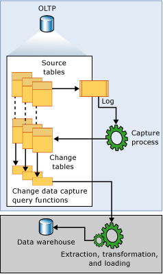

# What is change data capture (CDC)?
[!INCLUDE [SQL Server - ASDBMI](../../includes/applies-to-version/sql-asdb-asdbmi.md)]

In this article, learn about change data capture (CDC), which records activity on a database when tables and rows have been modified. Change data capture is generally available in Azure SQL Database, SQL Server, and Azure SQL Managed Instance.

## Overview

Change data capture (CDC) uses the SQL Server agent to record insert, update, and delete activity that applies to a table. This makes the details of the changes available in an easily consumed relational format. Column information and the metadata that is required to apply the changes to a target environment is captured for the modified rows and stored in change tables that mirror the column structure of the tracked source tables. Table-valued functions are provided to allow systematic access to the change data by consumers.  
  
A good example of a data consumer that this technology targets is an extraction, transformation, and loading (ETL) application. An ETL application incrementally loads change data from [!INCLUDE[ssNoVersion](../../includes/ssnoversion-md.md)] source tables to a data warehouse or data mart. Although the representation of the source tables within the data warehouse must reflect changes in the source tables, an end-to-end technology that refreshes a replica of the source isn't appropriate. Instead, you need a reliable stream of change data that is structured so that consumers can apply it to dissimilar target representations of the data. [!INCLUDE[ssNoVersion](../../includes/ssnoversion-md.md)] change data capture provides this technology.  

## CDC & Azure SQL Database

In Azure SQL Database, a change data capture scheduler takes the place of the SQL Server Agent that invokes stored procedures to start periodic capture and cleanup of the change data capture tables. The scheduler runs capture and cleanup automatically within SQL Database, without any external dependency for reliability or performance. Users retain the option to manually initiate capture and cleanup processes as needed.

To learn about Change Data Capture, you can also refer to this Data Exposed episode:
> [!VIDEO https://channel9.msdn.com/Shows/Data-Exposed/Track-and-Record-Data-Changes-with-Change-Data-Capture-CDC-in-Azure-SQL/player?WT.mc_id=dataexposed-c9-niner]

### Performance considerations

The effect on performance from enabling change data capture on Azure SQL Database is similar to the effect on performance of enabling CDC for SQL Server or Azure SQL Managed Instance. Some of the aspects that influence the effect of performance while enabling CDC are:

- The number of tracked CDC-enabled tables 
- Frequency of changes in the tracked tables  
- Space available in the source database, since CDC artifacts (for example, CT tables, cdc_jobs etc.) are stored in the same database 
- Whether the database is single or pooled. For databases in elastic pools, in addition to considering the number of tables that have CDC enabled, pay attention to the number of databases those tables belong to. Databases in a pool share resource among them (such as disk space), so enabling CDC on multiple databases runs the risk of reaching the max size of the elastic pool disk size. Monitor resources such as CPU, memory and log throughput. 

To provide more specific performance optimization guidance to customers, more details are needed on each customer's workload. However, here's some more general guidance based on performance tests conducted on the TPCC workload:

- Consider increasing the number of vCores or shift to a higher database tier (for example, Hyperscale) to ensure the same performance level as before CDC was enabled on your Azure SQL Database.

- Monitor space utilization closely and test your workload thoroughly before enabling CDC on databases in production.

- Monitor log generation rate. To learn more [here](/azure/azure-sql/database/resource-limits-logical-server#resource-consumption-by-user-workloads-and-internal-processes). 

- Scan/cleanup are part of user workload (user's resources are used). Performance degradation can be substantial since entire rows are added to change tables and for updates operations preimage is also included.  

- Elastic Pools - Number of CDC-enabled databases shouldn't exceed the number of vCores of the pool, in order to avoid latency increase. Learn more about resource management in dense Elastic Pools [here](/azure/azure-sql/database/elastic-pool-resource-management). 

- Cleanup – based on the customer's workload, it may be advised to keep the retention period smaller than the default of three days, to ensure that the cleanup catches up with all changes in change table. In general, it's good to keep the retention low and track the database size.  

- No Service Level Agreement (SLA) provided for when changes will be populated to the change tables. Subsecond latency is also not supported.
    
## Data flow  

 The following illustration shows the principal data flow for change data capture.  
  
   
  
 The source of change data for change data capture is the [!INCLUDE[ssNoVersion](../../includes/ssnoversion-md.md)] transaction log. As inserts, updates, and deletes are applied to tracked source tables, entries that describe those changes are added to the log. The log serves as input to the capture process. This reads the log and adds information about changes to the tracked table's associated change table. Functions are provided to enumerate the changes that appear in the change tables over a specified range, returning the information in the form of a filtered result set. The filtered result set is typically used by an application process to update a representation of the source in some external environment.  
  
## Capture instance

 Before changes to any individual tables within a database can be tracked, change data capture must be explicitly enabled for the database. This is done by using the stored procedure [sys.sp_cdc_enable_db](../../relational-databases/system-stored-procedures/sys-sp-cdc-enable-db-transact-sql.md). When the database is enabled, source tables can be identified as tracked tables by using the stored procedure [sys.sp_cdc_enable_table](../../relational-databases/system-stored-procedures/sys-sp-cdc-enable-table-transact-sql.md). When a table is enabled for change data capture, an associated capture instance is created to support the dissemination of the change data in the source table. The capture instance consists of a change table and up to two query functions. Metadata that describes the configuration details of the capture instance is retained in the change data capture metadata tables **cdc.change_tables**, **cdc.index_columns**, and **cdc.captured_columns**. This information can be retrieved by using the stored procedure [sys.sp_cdc_help_change_data_capture](../../relational-databases/system-stored-procedures/sys-sp-cdc-help-change-data-capture-transact-sql.md).  
  
 All objects that are associated with a capture instance are created in the change data capture schema of the enabled database. The requirements for the capture instance name are that it's a valid object name, and that it's unique across the database capture instances. By default, the name is \<*schema name*\_*table name*> of the source table. Its associated change table is named by appending **_CT** to the capture instance name. The function that is used to query for all changes is named by prepending **fn_cdc_get_all_changes_** to the capture instance name. If the capture instance is configured to support **net changes**, the **net_changes** query function is also created and named by prepending **fn_cdc_get_net_changes\_** to the capture instance name.  
  
## Change table   

 The first five columns of a change data capture change table are metadata columns. These provide additional information that is relevant to the recorded change. The remaining columns mirror the identified captured columns from the source table in name and, typically, in type. These columns hold the captured column data that is gathered from the source table.  
  
 Each insert or delete operation that is applied to a source table appears as a single row within the change table. The data columns of the row that results from an insert operation contain the column values after the insert. The data columns of the row that results from a delete operation contain the column values before the delete. An update operation requires one-row entry to identify the column values before the update, and a second row entry to identify the column values after the update.  
  
 Each row in a change table also contains other metadata to allow interpretation of the change activity. The column __$start_lsn identifies the commit log sequence number (LSN) that was assigned to the change. The commit LSN both identifies changes that were committed within the same transaction, and orders those transactions. The column \_\_$seqval can be used to order more changes that occur in the same transaction. The column \_\_$operation records the operation that is associated with the change: 1 = delete, 2 = insert, 3 = update (before image), and 4 = update (after image). The column \_\_$update_mask is a variable bit mask with one defined bit for each captured column. For insert and, delete entries, the update mask has all bits set. Update rows, however, will have those bits set that corresponds to changed columns.  
  
## Validity interval 

The change data capture validity interval for a database is the time during which change data is available for capture instances. The validity interval begins when the first capture instance is created for a database table, and continues to the present time.  

### Database

Data that is deposited in change tables grow unmanageably if you don't periodically and systematically prune the data. The change data capture cleanup process is responsible for enforcing the retention-based cleanup policy. First, it moves the low endpoint of the validity interval to satisfy the time restriction. Then, it removes expired change table entries. By default, three days of data are retained.  
  
At the high end, as the capture process commits each new batch of change data, new entries are added to **cdc.lsn_time_mapping** for each transaction that has change table entries. Within the mapping table, both a commit Log Sequence Number (LSN) and a transaction commit time (columns start_lsn and tran_end_time, respectively) are retained. The maximum LSN value that is found in **cdc.lsn_time_mapping** represents the high water mark of the database validity window. Its corresponding commit time is used as the base from which retention-based cleanup computes a new low water mark.  
  
Because the capture process extracts change data from the transaction log, there's a built-in latency between the time that a change is committed to a source table and the time that the change appears within its associated change table. While this latency is typically small, it's nevertheless important to remember that change data isn't available until the capture process has processed the related log entries.  

### Capture instance
  
Although it's common for the database validity interval and the validity interval of individual capture instance to coincide, this isn't always true. The validity interval of the capture instance starts when the capture process recognizes the capture instance and starts to log associated changes to its change table. As a result, if capture instances are created at different times, each will initially have a different low endpoint. The start_lsn column of the result set that is returned by [sys.sp_cdc_help_change_data_capture](../../relational-databases/system-stored-procedures/sys-sp-cdc-help-change-data-capture-transact-sql.md) shows the current low endpoint for each defined capture instance. When the cleanup process cleans up change table entries, it adjusts the start_lsn values for all capture instances to reflect the new low water mark for available change data. Only those capture instances that have start_lsn values that are currently less than the new low water mark are adjusted. Over time, if no new capture instances are created, the validity intervals for all individual instances will tend to coincide with the database validity interval.  
  
 The validity interval is important to consumers of change data because the extraction interval for a request must be fully covered by the current change data capture validity interval for the capture instance. If the low endpoint of the extraction interval is to the left of the low endpoint of the validity interval, there could be missing change data due to aggressive cleanup. If the high endpoint of the extraction interval is to the right of the high endpoint of the validity interval, the capture process hasn't yet processed through the time period that is represented by the extraction interval, and change data could also be missing.  
  
 The function [sys.fn_cdc_get_min_lsn](../../relational-databases/system-functions/sys-fn-cdc-get-min-lsn-transact-sql.md) is used to retrieve the current minimum LSN for a capture instance, while [sys.fn_cdc_get_max_lsn](../../relational-databases/system-functions/sys-fn-cdc-get-max-lsn-transact-sql.md) is used to retrieve the current maximum LSN value. When querying for change data, if the specified LSN range doesn't lie within these two LSN values, the change data capture query functions fail.  
  
## Handling changes to source table 

 Accommodating column changes in the source tables that are being tracked is a difficult issue for downstream consumers. Although enabling change data capture on a source table doesn't prevent such DDL changes from occurring, change data capture mitigates the effect on consumers by preserving the delivered result sets returned through the API, even as the column structure of the underlying source table changes. This fixed column structure is also reflected in the underlying change table that the defined query functions access.  
  
The capture process responsible for populating the change table accommodates a fixed column structure change table by ignoring any new columns not identified for capture when the source table was enabled for change data capture. If a tracked column is dropped, null values are supplied for the column in the subsequent change entries. However, if an existing column undergoes a change in its data type, the change is propagated to the change table to ensure that the capture mechanism doesn't introduce data loss to tracked columns. The capture process also posts any detected changes to the column structure of tracked tables to the cdc.ddl_history table. Consumers wishing to be alerted of adjustments that might have to be made in downstream applications, use the stored procedure [sys.sp_cdc_get_ddl_history](../../relational-databases/system-stored-procedures/sys-sp-cdc-get-ddl-history-transact-sql.md).  
  
 Typically, the current capture instance continues to retain its shape when DDL changes are applied to its associated source table. However, it's possible to create a second capture instance for the table that reflects the new column structure. This allows the capture process to make changes to the same source table into two distinct change tables having two different column structures. Thus, while one change table can continue to feed current operational programs, the second one can drive a development environment that is trying to incorporate the new column data. Allowing the capture mechanism to populate both change tables in tandem means that a transition from one to the other can be accomplished without loss of change data. This can happen anytime the two change data capture timelines overlap. When the transition is affected, the obsolete capture instance can be removed.  
  
> [!NOTE]  
>  The maximum number of capture instances that can be concurrently associated with a single source table is two.  
  
## Relationship with log reader agent 

 The logic for change data capture process is embedded in the stored procedure [sp_replcmds](../../relational-databases/system-stored-procedures/sp-replcmds-transact-sql.md), an internal server function built as part of sqlservr.exe and also used by transactional replication to harvest changes from the transaction log. In SQL Server and Azure SQL Managed Instance, when change data capture alone is enabled for a database, you create the change data capture SQL Server Agent capture job as the vehicle for invoking sp_replcmds. When replication is also present, the transactional log reader alone is used to satisfy the change data needs for both of these consumers. This strategy significantly reduces log contention when both replication and change data capture are enabled for the same database.  
  
 The switch between these two operational modes for capturing change data occurs automatically whenever there's a change in the replication status of a change data capture enabled database.  
  
> [!NOTE]  
>  In SQL Server and Azure SQL Managed Instance, both instances of the capture logic require [!INCLUDE[ssNoVersion](../../includes/ssnoversion-md.md)] Agent to be running for the process to execute.  
  
 The principal task of the capture process is to scan the log and write column data and transaction-related information to the change data capture change tables. To ensure a transactionally consistent boundary across all the change data capture change tables that it populates, the capture process opens and commits its own transaction on each scan cycle. It detects when tables are newly enabled for change data capture, and automatically includes them in the set of tables that are actively monitored for change entries in the log. Similarly, disabling change data capture will also be detected, causing the source table to be removed from the set of tables actively monitored for change data. When processing for a section of the log is finished, the capture process signals the server log truncation logic, which uses this information to identify log entries eligible for truncation.  
  
> [!NOTE]  
>  When a database is enabled for change data capture, even if the recovery mode is set to simple recovery the log truncation point will not advance until all the changes that are marked for capture have been gathered by the capture process. If the capture process is not running and there are changes to be gathered, executing CHECKPOINT will not truncate the log.  
  
 The capture process is also used to maintain history on the DDL changes to tracked tables. The DDL statements that are associated with change data capture make entries to the database transaction log whenever a change data capture-enabled database or table is dropped or columns of a change data capture-enabled table are added, modified, or dropped. These log entries are processed by the capture process, which then posts the associated DDL events to the cdc.ddl_history table. You can obtain information about DDL events that affect tracked tables by using the stored procedure [sys.sp_cdc_get_ddl_history](../../relational-databases/system-stored-procedures/sys-sp-cdc-get-ddl-history-transact-sql.md).  
 
> [!WARNING]  
> **MaxCmdsInTran** was not designed to be always turned on. It exists to work around cases where someone accidentally performed a large number of DML operations in a single transaction (causing a delay in the distribution of commands until the entire transaction is in the distribution database, locks being held, etc.). If you routinely fall into this situation,review your applications and find ways to reduce the transaction size.  

> [!WARNING]  
> **MaxCmdsInTran** is not supported if the given publication database is enabled for both Change Data Capture and replication. Using **MaxCmdsInTran** in this configuration may lead to data loss in CDC change tables. It may also cause PK errors if the **MaxCmdsInTran** parameter is added and removed while replicating a large Transaction.
  
## Agent jobs

 Two [!INCLUDE[ssNoVersion](../../includes/ssnoversion-md.md)] Agent jobs are typically associated with a change data capture enabled database: one that is used to populate the database change tables, and one that is responsible for change table cleanup. Both jobs consist of a single step that runs a [!INCLUDE[tsql](../../includes/tsql-md.md)] command. The [!INCLUDE[tsql](../../includes/tsql-md.md)] command that is invoked is a change data capture defined stored procedure that implements the logic of the job. The jobs are created when the first table of the database is enabled for change data capture. The Cleanup Job is always created. The capture job will only be created if there are no defined transactional publications for the database. The capture job is also created when both change data capture and transactional replication are enabled for a database, and the transactional log reader job is removed because the database no longer has defined publications.  
  
 Both the capture and cleanup jobs are created by using default parameters. The capture job is started immediately. It runs continuously, processing a maximum of 1000 transactions per scan cycle with a wait of 5 seconds between cycles. The cleanup job runs daily at 2 A.M. It retains change table entries for 4320 minutes or 3 days, removing a maximum of 5000 entries with a single delete statement.  
  
 The change data capture agent jobs are removed when change data capture is disabled for a database. The capture job can also be removed when the first publication is added to a database, and both change data capture and transactional replication are enabled.  
  
 Internally, change data capture agent jobs are created and dropped by using the stored procedures [sys.sp_cdc_add_job](../../relational-databases/system-stored-procedures/sys-sp-cdc-add-job-transact-sql.md) and [sys.sp_cdc_drop_job](../../relational-databases/system-stored-procedures/sys-sp-cdc-drop-job-transact-sql.md), respectively. These stored procedures are also exposed so that administrators can control the creation and removal of these jobs.  
  
 An administrator has no explicit control over the default configuration of the change data capture agent jobs. The stored procedure [sys.sp_cdc_change_job](../../relational-databases/system-stored-procedures/sys-sp-cdc-change-job-transact-sql.md) is provided to allow the default configuration parameters to be modified. In addition, the stored procedure [sys.sp_cdc_help_jobs](../../relational-databases/system-stored-procedures/sys-sp-cdc-help-jobs-transact-sql.md) allows current configuration parameters to be viewed. Both the capture job and the cleanup job extract configuration parameters from the table msdb.dbo.cdc_jobs on startup. Any changes made to these values by using [sys.sp_cdc_change_job](../../relational-databases/system-stored-procedures/sys-sp-cdc-change-job-transact-sql.md) won't take effect until the job is stopped and restarted.  
  
 Two other stored procedures are provided to allow the change data capture agent jobs to be started and stopped: [sys.sp_cdc_start_job](../../relational-databases/system-stored-procedures/sys-sp-cdc-start-job-transact-sql.md) and [sys.sp_cdc_stop_job](../../relational-databases/system-stored-procedures/sys-sp-cdc-stop-job-transact-sql.md).  
  
> [!NOTE]  
>  Starting and stopping the capture job does not result in a loss of change data. It only prevents the capture process from actively scanning the log for change entries to deposit in the change tables. A reasonable strategy to prevent log scanning from adding load during periods of peak demand is to stop the capture job and restart it when demand is reduced.  
  
 Both [!INCLUDE[ssNoVersion](../../includes/ssnoversion-md.md)] Agent jobs were designed to be flexible enough and sufficiently configurable to meet the basic needs of change data capture environments. In both cases, however, the underlying stored procedures that provide the core functionality have been exposed so that further customization is possible.  
  
 Change data capture can't function properly when the Database Engine service or the SQL Server Agent service is running under the NETWORK SERVICE account. This can result in error 22832.  

> [!NOTE]  
>  In Azure SQL Database, the Agent Jobs are replaced by an scheduler which runs capture and cleanup automatically. 
 
## CDC capture and cleanup in Azure SQL Database

In Azure SQL Database, a change data capture scheduler takes the place of the SQL Server Agent that invokes stored procedures to start periodic capture and cleanup of the change data capture tables. 

The scheduler runs capture and cleanup automatically within SQL Database, without any external dependency for reliability or performance. Users still have the option to run capture and cleanup manually on demand using the [sp_cdc_scan](../system-stored-procedures/sys-sp-cdc-scan-transact-sql.md) and [sp_cdc_cleanup_change_tables](../system-stored-procedures/sys-sp-cdc-cleanup-change-table-transact-sql.md) procedures. The CDC capture job runs every 20 seconds, and the cleanup job runs every hour. 

Azure SQL Database includes two dynamic management views to help you monitor change data capture: [sys.dm_cdc_log_scan_sessions](../system-dynamic-management-views/change-data-capture-sys-dm-cdc-log-scan-sessions.md) and [sys.dm_cdc_errors](../system-dynamic-management-views/change-data-capture-sys-dm-cdc-errors.md).  
 
## Collation differences

It's important to be aware of a situation where you have different collations between the database and the columns of a table configured for change data capture. CDC uses interim storage to populate side tables. If a table has CHAR or VARCHAR columns with collations that are different from the database collation and if those columns store non-ASCII characters (such as double byte DBCS characters), CDC might not be able to persist the changed data consistent with the data in the base tables. This is because the interim storage variables can't have collations associated with them.

Consider one of the following approaches to ensure change captured data is consistent with base tables:

- Use NCHAR or NVARCHAR data type for columns containing non-ASCII data.

- Or, Use the same collation for columns and for the database.

For example, if you have one database that uses a collation of  SQL_Latin1_General_CP1_CI_AS, consider the following table:

```sql
CREATE TABLE T1( 
     C1 INT PRIMARY KEY, 
     C2 VARCHAR(10) collate Chinese_PRC_CI_AI)
```

CDC might fail to capture the binary data for column C2, because its collation is different (Chinese_PRC_CI_AI). Use NVARCHAR to avoid this problem:

```sql
CREATE TABLE T1( 
     C1 INT PRIMARY KEY, 
     C2 NVARCHAR(10) collate Chinese_PRC_CI_AI --Unicode data type, CDC works well with this data type
     )
```


## Permissions required

Sysadmin permissions are required to enable change data capture for SQL Server or Azure SQL Managed Instance. The db_owner role is required to enable change data capture for Azure SQL Database. 

## General guidelines

For Change data capture (CDC) to function properly, you shouldn't manually modify any CDC metadata such as CDC schema, change tables, CDC system stored procedures, default `cdc` user permissions ([`sys.database_principals`](../system-catalog-views/sys-database-principals-transact-sql.md)) or rename `cdc` user.

Any objects in [sys.objects](../system-catalog-views/sys-objects-transact-sql.md) with `is_ms_shipped` property set to `1` shouldn't be modified.

```sql
SELECT    name AS object_name   
        ,SCHEMA_NAME(schema_id) AS schema_name  
        ,type_desc  
        ,is_ms_shipped  
FROM sys.objects 
WHERE is_ms_shipped= 1 AND SCHEMA_NAME(schema_id) = 'cdc'

```

## Known limitations and issues

Known limitations and issues associated with Change data capture (CDC).

### Linux
CDC is now supported for SQL Server 2017 on Linux starting with CU18, and SQL Server 2019 on Linux.

### Columnstore indexes
Change data capture can't be enabled on tables with a clustered columnstore index. Starting with SQL Server 2016, it can be enabled on tables with a nonclustered columnstore index.

### Partition switching with variables
Using variables with partition switching on databases or tables with change data capture (CDC) isn't supported for the `ALTER TABLE ... SWITCH TO ... PARTITION ...` statement. See [partition switching limitations](../replication/publish/replicate-partitioned-tables-and-indexes.md#replication-support-for-partition-switching) to learn more. 

### Availability of CDC in Azure SQL Databases
CDC can only be enabled on databases tiers S3 and above. Subcore (Basic, S0, S1, S2) Azure SQL Databases aren't supported for CDC.

Dbcopy from database tiers above S3 having CDC enabled to a subcore SLO presently retains the CDC artifacts, but CDC artifacts may be removed in the future.

### Capture and Cleanup Customization on Azure SQL Databases
Configuring the frequency of the capture and the cleanup processes for CDC in Azure SQL Databases isn't possible. Capture and cleanup are run automatically by the scheduler.

### Computed columns
CDC doesn't support the values for computed columns even if the computed column is defined as persisted. Computed columns that are included in a capture instance always have a value of `NULL`. This behavior is intended, and not a bug.

### Point-in-time restore (PITR)
If you enable CDC on your database as a Microsoft Azure Active Directory (Azure AD) user, it isn't possible to Point-in-time restore (PITR) to a subcore SLO. It's recommended that you restore the database to the same as the source or higher SLO, and then disable CDC if necessary.

### Microsoft Azure Active Directory (Azure AD)
If you create a database in Azure SQL Database as a Microsoft Azure Active Directory (Azure AD) user and enable change data capture (CDC) on it, a SQL user (for example, even sysadmin role) won't be able to disable/make changes to CDC artifacts. However, another Azure AD user is able to enable/disable CDC on the same database.

Similarly, if you create an Azure SQL Database as a SQL user, enabling/disabling change data capture as an Azure AD user won't work.

### Aggressive log truncation
When you enable change data capture (CDC) on Azure SQL Database or SQL Server, the aggressive log truncation feature of Accelerated Database Recovery (ADR) is disabled. This is because the CDC scan accesses the database transaction log. Active transactions continue to hold the transaction log truncation until the transaction commits and CDC scan catches up, or transaction aborts. This might result in the transaction log filling up more than usual and should be monitored so that the transaction log doesn't fill.

When enabling CDC, we recommend using the Resumable index option. Resumable index create or rebuild doesn't require you to keep open a long-running transaction, allowing log truncation during this operation and better log space management. For more information, see [Guidelines for online index operations - Resumable Index considerations](../../relational-databases/indexes/guidelines-for-online-index-operations.md#resumable-index-considerations)

### CDC fails after ALTER COLUMN to VARCHAR and VARBINARY
When the datatype of a column on a CDC-enabled table is changed from `TEXT` to `VARCHAR` or `IMAGE` to `VARBINARY` and an existing row is updated to an off-row value. After the update, the CDC scan will result in errors.

### Enabling CDC fails on restored Azure SQL DB created with Microsoft Azure Active Directory (Azure AD)
Enabling CDC fails if you create a database in Azure SQL Database as a Microsoft Azure Active Directory (Azure AD) user and don't enable CDC, then restore the database and enable CDC on the restored database.

To resolve this issue, follow these steps: 

- Sign in as Azure AD admin of the server
- Run ALTER AUTHORIZATION command on the database: 

```sql
ALTER AUTHORIZATION ON DATABASE::[<restored_db_name>] TO [<azuread_admin_login_name>];

EXEC sys.sp_cdc_enable_db
```

### Attempt to enable CDC fails if the custom schema or user named `cdc` pre-exist in database*
When you enable CDC on database, it creates a new schema and user named `cdc`. So, it's not recommended to manually create custom schema or user named `cdc`, as it's reserved for system use.  
If you've manually defined a custom schema or user named `cdc` in your database that isn't related to CDC, the system stored procedure `sys.sp_cdc_enable_db` fails to enable CDC on the database with below error message.

> The database `<database_name>` cannot be enabled for Change Data Capture because a database user named 'cdc' or a schema named 'cdc' already exists in the current database. These objects are required exclusively by Change Data Capture. Drop or rename the user or schema and retry the operation.

To resolve this issue:

- Manually drop the empty `cdc` schema and `cdc` user. Then, CDC can be enabled successfully on the database.

### Import database using data-tier Import/Export and Extract/Publish operations
For CDC enabled SQL databases, when you use SqlPackage, SSDT, or other SQL tools to Import/Export or Extract/Publish, the `cdc` schema and user get excluded in the new database. Other CDC objects not included in Import/Export and Extract/Deploy operations include the tables marked as `is_ms_shipped=1` in sys.objects.

Even if CDC isn't enabled and you've defined a custom schema or user named `cdc` in your database that will also be excluded in Import/Export and Extract/Deploy operations to import/setup a new database.

### DDL changes to source tables

Changing the size of columns of a CDC-enabled table using DDL statements can cause issues with the subsequent CDC capture process, resulting in **error 2628** or **error 8115**. Remember that data in CDC change tables are retained based on user-configured settings. So, before making any changes to column size, you must assess whether the alteration is compatible with the existing data in CDC change tables.

If the `sys.dm_cdc_errors` indicate that scans are failing due to the **error 2628** or **error 8115** for change tables, you should first consume the change data in the affected change tables. After that, you need to [disable and then reenable CDC](enable-and-disable-change-data-capture-sql-server.md) on the table to resolve the problem effectively.

## Troubleshooting

The following table provides a list of potential solutions for resolving CDC-related problems.

CDC-related errors may obstruct the proper functioning of the capture process and lead to the expansion of the database transaction log. To examine these errors, you can query the dynamic management view [sys.dm_cdc_errors](../../relational-databases/system-dynamic-management-views/change-data-capture-sys-dm-cdc-errors.md). In case any errors are present in [sys.dm_cdc_errors](../../relational-databases/system-dynamic-management-views/change-data-capture-sys-dm-cdc-errors.md) refer to the table for mitigation steps.

For more information on a particular error code, see [Database Engine events and errors](../../relational-databases/errors-events/database-engine-events-and-errors.md).  

|Issue Category|Issue Details|Mitigation|  
|-----------------|---------------|-----------------|  
|Metadata modified|**Error 200/208** - Invalid object name. Generally occurs when CDC metadata has been dropped.|Disable CDC and review CDC [guidelines](../track-changes/about-change-data-capture-sql-server.md?#general-guidelines) before re-enabling.<br/><br/>For more information, see [sys.sp_cdc_disable_db](../system-stored-procedures/sys-sp-cdc-disable-db-transact-sql.md).|
|Metadata modified|**Error 1202** - Database principal doesn't exist, or user isn't a member.|Ensure the existence of the `cdc` user and assign the `db_owner` role. <br/><br/>To create the `cdc` user, see the example [Create cdc user and assign role](#create-user-and-assign-role).|
|Metadata modified|**Error 15517** - Can't execute as the database principal because the principal doesn't exist. This type of principal can't be impersonated, or you don't have permission.|Disable CDC and review [CDC guidelines](../track-changes/about-change-data-capture-sql-server.md?#general-guidelines) before re-enabling.<br/><br/>For more information, see [sys.sp_cdc_disable_db](../system-stored-procedures/sys-sp-cdc-disable-db-transact-sql.md).|
|Metadata modified|**Error 18807** - Can't find an object ID for the replication system table. Verify that the system table exists and is accessible by querying the table directly.|Disable CDC and review [CDC guidelines](../track-changes/about-change-data-capture-sql-server.md?#general-guidelines) before re-enabling.<br/><br/>For more information, see [sys.sp_cdc_disable_db](../system-stored-procedures/sys-sp-cdc-disable-db-transact-sql.md).|
|Metadata modified|**Error 21050** - Only members of the `sysadmin` or `db_owner` fixed server role can perform this operation.|To address this problem, refer to the instructions provided at [Check and add role membership](#check-and-add-role-membership).|
|Data size insufficient|**Error 1105** - Couldn't allocate space for object in database because the filegroup is full. Create space by deleting unneeded files, dropping objects in the filegroup, adding other files to the filegroup, or setting autogrowth on for existing files in the filegroup.|Review the Azure SQL Database guidelines and take the actions specified at [Manage file space for databases in Azure SQL Database](/azure/azure-sql/database/file-space-manage).|
|Data size insufficient|**Error 1132** - The elastic pool has reached its storage limit.|Review the Azure SQL Database guidelines and take the actions specified at [Change elastic pool storage size](/azure/azure-sql/database/elastic-pool-scale?#change-elastic-pool-storage-size).|  
|CDC limitation and errors|**Error 913** - CDC capture job fails when processing changes for a table with system CLR datatype.|Refer to this article for mitigation of this issue.<br/><br/>For more information, see [CDC capture job fails when processing changes](/troubleshoot/sql/database-engine/replication/cdc-capture-job-fails-processing-changes-table).|

> [!NOTE]
> If you choose to disable CDC as a mitigation measure, by executing the stored procedure [sys.sp_cdc_disable_db](../../relational-databases/system-stored-procedures/sys-sp-cdc-disable-db-transact-sql.md), please be aware that this action will remove all CDC artifacts, resulting in the loss of captured change data.

### Create user and assign role

Use the following T-SQL script, to create a user (`cdc`), and assign the proper role for the same (`db_owner`).

```sql
IF NOT EXISTS 
(
    SELECT * 
    FROM sys.database_principals 
    WHERE NAME = 'cdc'
)
BEGIN
    CREATE USER [cdc] 
    WITHOUT LOGIN WITH DEFAULT_SCHEMA = [cdc];
END

EXEC sp_addrolemember 'db_owner', 'cdc';
```

### Check and add role membership

To verify if `cdc` user belongs to either the `sysadmin` or `db_owner` role, run the following T-SQL query:

```sql
EXECUTE AS USER = 'cdc';

SELECT is_srvrolemember('sysadmin'), is_member('db_owner');
```

If the `cdc` user doesn't belong to either role, execute the following T-SQL query to add `db_owner` role to the `cdc` user.

```sql
EXEC sp_addrolemember 'db_owner' , 'cdc';
```

## See also  
 [Track Data Changes &#40;SQL Server&#41;](../../relational-databases/track-changes/track-data-changes-sql-server.md)   
 [Enable and Disable change data capture &#40;SQL Server&#41;](../../relational-databases/track-changes/enable-and-disable-change-data-capture-sql-server.md)   
 [Work with Change Data &#40;SQL Server&#41;](../../relational-databases/track-changes/work-with-change-data-sql-server.md)   
 [Administer and Monitor change data capture &#40;SQL Server&#41;](../../relational-databases/track-changes/administer-and-monitor-change-data-capture-sql-server.md)  
[Temporal Tables](../../relational-databases/tables/temporal-tables.md)