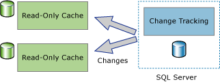

# About Change Tracking (SQL Server)
[!INCLUDE[tsql-appliesto-ss2008-asdb-xxxx-xxx-md](../../includes/tsql-appliesto-ss2008-asdb-xxxx-xxx-md.md)]

  Change tracking is a lightweight solution that provides an efficient change tracking mechanism for applications. Typically, to enable applications to query for changes to data in a database and access information that is related to the changes, application developers had to implement custom change tracking mechanisms. Creating these mechanisms usually involved a lot of work and frequently involved using a combination of triggers, **timestamp** columns, new tables to store tracking information, and custom cleanup processes.  
  
 Different types of applications have different requirements for how much information they need about the changes. Applications can use change tracking to answer the following questions about the changes that have been made to a user table:  
  
-   What rows have changed for a user table?  
  
    -   Only the fact that a row has changed is required, not how many times the row has changed or the values of any intermediate changes.  
  
    -   The latest data can be obtained directly from the table that is being tracked.  
  
-   Has a row changed?  
  
    -   The fact that a row has changed and information about the change must be available and recorded at the time that the change was made in the same transaction.  
  
> [!NOTE]  
>  If an application requires information about all the changes that were made and the intermediate values of the changed data, using change data capture, instead of change tracking, might be appropriate. For more information, see [About Change Data Capture &#40;SQL Server&#41;](../../relational-databases/track-changes/about-change-data-capture-sql-server.md).  
  
## One-Way and Two-Way Synchronization Applications  
 Applications that have to synchronize data with an instance of the [!INCLUDE[ssDEnoversion](../../includes/ssdenoversion-md.md)] must be able to query for changes. Change tracking can be used as a foundation for both one-way and two-way synchronization applications.  
  
### One-Way Synchronization Applications  
 One-way synchronization applications, such as a client or mid-tier caching application, can be built that use change tracking. As shown in the following illustration, a caching application requires data to be stored in the [!INCLUDE[ssDE](../../includes/ssde-md.md)] and to be cached in other data stores. The application must be able to keep the cache up-to-date with any changes that have been made to the database tables. There are no changes to pass back to the [!INCLUDE[ssDE](../../includes/ssde-md.md)].  
  
   
  
### Two-Way Synchronization Applications  
 Two-way synchronization applications can also be built that use change tracking. In this scenario, the data in an instance of the [!INCLUDE[ssDE](../../includes/ssde-md.md)] is synchronized with one or more data stores. The data in those stores can be updated and the changes must be synchronized back to the [!INCLUDE[ssDE](../../includes/ssde-md.md)].  
  
   
  
 A good example of two-way synchronization application is an occasionally connected application. In this type of application, a client application queries and updates a local store. When a connection is available between a client and server, the application will synchronize with a server, and changed data flows in both directions.  
  
 The two-way synchronization applications must be able to detect conflicts. A conflict would occur if the same data was changed in both data stores in the time between synchronizations. With the ability to detect conflicts, an application can make sure that changes are not lost.  
  
## How Change Tracking Works  
 To configure change tracking, you can use DDL statements or [!INCLUDE[ssManStudioFull](../../includes/ssmanstudiofull-md.md)]. For more information, see [Enable and Disable Change Tracking &#40;SQL Server&#41;](../../relational-databases/track-changes/enable-and-disable-change-tracking-sql-server.md). To track changes, change tracking must first be enabled for the database and then enabled for the tables that you want to track within that database. The table definition does not have to be changed in any way, and no triggers are created.  
  
 After change tracking is configured for a table, any DML statement that affects rows in the table will cause change tracking information for each modified row to be recorded. To query for the rows that have changed and to obtain information about the changes, you can use [change tracking functions](../../relational-databases/system-functions/change-tracking-functions-transact-sql.md).  
  
 The values of the primary key column is only information from the tracked table that is recorded with the change information. These values identify the rows that have been changed. To obtain the latest data for those rows, an application can use the primary key column values to join the source table with the tracked table.  
  
 Information about the change that was made to each row can also be obtained by using change tracking. For example, the type of DML operation that caused the change (insert, update, or delete) or the columns that were changed as part of an update operation. 
 
## Change Tracking Cleanup
Change tracking information for all tables (enabled for Change Tracking) is stored in an in-memory rowstore. Change tracking data associated with each table enabled for Change Tracking is flushed on every checkpoint from the in-memory rowstore to the corresponding on-disk internal table. During checkpoint, the in-memory rowstore is also purged after the rows are moved to the on-disk tables.

Each table that is enabled for Change Tracking has an internal on-disk table which is used by Change Tracking functions to determine the change version and the rows that have changed since a particular version. Every time the **auto cleanup** thread wakes up, it scans all the user databases on the SQL Server instance to identify the change tracking enabled databases. Based on the retention period setting of the database, each internal on-disk table is purged of its expired records.

A stored procedure was added in Service Packs for [!INCLUDE[ssSQL14](../../includes/sssql14-md.md)] and [!INCLUDE[ssSQL15](../../includes/sssql15-md.md)] for performing manual cleanup for the internal Change Tracking internal tables. More information about the stored procedure is available in [KB173157](https://support.microsoft.com/help/3173157/adds-a-stored-procedure-for-the-manual-cleanup-of-the-change-tracking-side-table-in-sql-server-2014-sp2-or-2016-sp1). 
  
## See Also  
 [Enable and Disable Change Tracking &#40;SQL Server&#41;](../../relational-databases/track-changes/enable-and-disable-change-tracking-sql-server.md)   
 [Work with Change Tracking &#40;SQL Server&#41;](../../relational-databases/track-changes/work-with-change-tracking-sql-server.md)   
 [Manage Change Tracking &#40;SQL Server&#41;](../../relational-databases/track-changes/manage-change-tracking-sql-server.md)   
 [Track Data Changes &#40;SQL Server&#41;](../../relational-databases/track-changes/track-data-changes-sql-server.md)  
  
  
